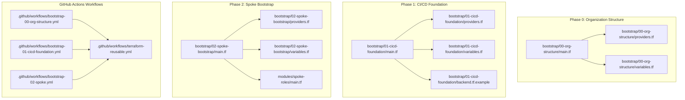
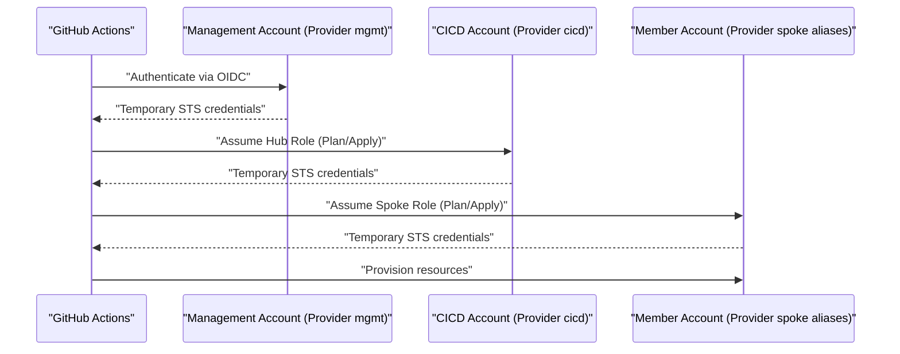
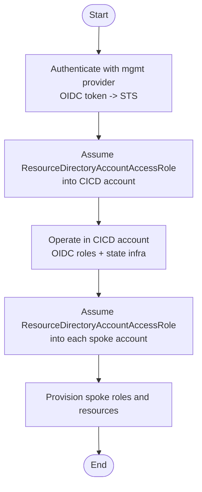
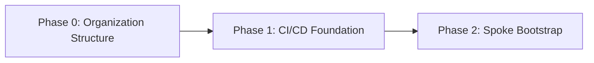
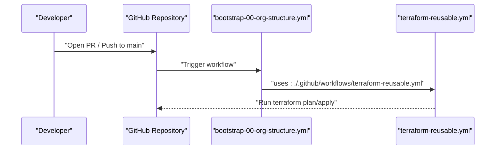

# Bootstrap Infrastructure

<cite>
**Referenced Files in This Document**
- [.github/workflows/bootstrap-00-org-structure.yml](file://.github/workflows/bootstrap-00-org-structure.yml)
- [.github/workflows/bootstrap-01-cicd-foundation.yml](file://.github/workflows/bootstrap-01-cicd-foundation.yml)
- [.github/workflows/bootstrap-02-spoke.yml](file://.github/workflows/bootstrap-02-spoke.yml)
- [.github/workflows/terraform-reusable.yml](file://.github/workflows/terraform-reusable.yml)
- [bootstrap/00-org-structure/main.tf](file://bootstrap/00-org-structure/main.tf)
- [bootstrap/00-org-structure/providers.tf](file://bootstrap/00-org-structure/providers.tf)
- [bootstrap/00-org-structure/variables.tf](file://bootstrap/00-org-structure/variables.tf)
- [bootstrap/01-cicd-foundation/main.tf](file://bootstrap/01-cicd-foundation/main.tf)
- [bootstrap/01-cicd-foundation/providers.tf](file://bootstrap/01-cicd-foundation/providers.tf)
- [bootstrap/01-cicd-foundation/variables.tf](file://bootstrap/01-cicd-foundation/variables.tf)
- [bootstrap/01-cicd-foundation/backend.tf.example](file://bootstrap/01-cicd-foundation/backend.tf.example)
- [bootstrap/02-spoke-bootstrap/main.tf](file://bootstrap/02-spoke-bootstrap/main.tf)
- [bootstrap/02-spoke-bootstrap/providers.tf](file://bootstrap/02-spoke-bootstrap/providers.tf)
- [bootstrap/02-spoke-bootstrap/variables.tf](file://bootstrap/02-spoke-bootstrap/variables.tf)
- [bootstrap/02-spoke-bootstrap/modules/spoke-roles/main.tf](file://bootstrap/02-spoke-bootstrap/modules/spoke-roles/main.tf)
- [bootstrap/02-spoke-bootstrap/modules/spoke-roles/variables.tf](file://bootstrap/02-spoke-bootstrap/modules/spoke-roles/variables.tf)
</cite>

## Update Summary
**Changes Made**
- Updated GitHub Actions workflow documentation to reflect complete three-phase implementation with dedicated workflows for each bootstrap phase
- Enhanced provider chaining mechanism documentation with detailed cross-account operation flow
- Added comprehensive state infrastructure documentation including OSS backend and Tablestore locking
- Expanded spoke role module documentation with reusable component details
- Updated troubleshooting guide with specific error scenarios and resolution steps

## Table of Contents
1. [Introduction](#introduction)
2. [Project Structure](#project-structure)
3. [Core Components](#core-components)
4. [Architecture Overview](#architecture-overview)
5. [Detailed Component Analysis](#detailed-component-analysis)
6. [Dependency Analysis](#dependency-analysis)
7. [Performance Considerations](#performance-considerations)
8. [Troubleshooting Guide](#troubleshooting-guide)
9. [Conclusion](#conclusion)
10. [Appendices](#appendices)

## Introduction
This document explains the bootstrap infrastructure that establishes the foundational infrastructure for Alibaba Cloud Landing Zone deployment. It covers the three-phase bootstrap process:
- Phase 0: Organization structure setup (Resource Directory, folders, and member accounts)
- Phase 1: CI/CD foundation (OIDC provider, hub roles, and state infrastructure)
- Phase 2: Spoke bootstrap (spoke role provisioning in member accounts)

It also documents sequential dependencies, security implications, provider settings, variable definitions, provider chaining, and troubleshooting/state migration procedures.

## Project Structure
The bootstrap is organized into three sequential Terraform workspaces under bootstrap/, each corresponding to a phase. Each phase defines its own providers, variables, and resources. A reusable GitHub Actions workflow orchestrates plan/apply for each phase.

**Diagram sources**
- [bootstrap/00-org-structure/main.tf:1-50](file://bootstrap/00-org-structure/main.tf#L1-L50)
- [bootstrap/00-org-structure/providers.tf:1-6](file://bootstrap/00-org-structure/providers.tf#L1-L6)
- [bootstrap/00-org-structure/variables.tf:1-6](file://bootstrap/00-org-structure/variables.tf#L1-L6)
- [bootstrap/01-cicd-foundation/main.tf:1-143](file://bootstrap/01-cicd-foundation/main.tf#L1-L143)
- [bootstrap/01-cicd-foundation/providers.tf:1-22](file://bootstrap/01-cicd-foundation/providers.tf#L1-L22)
- [bootstrap/01-cicd-foundation/variables.tf:1-16](file://bootstrap/01-cicd-foundation/variables.tf#L1-L16)
- [bootstrap/01-cicd-foundation/backend.tf.example:1-23](file://bootstrap/01-cicd-foundation/backend.tf.example#L1-L23)
- [bootstrap/02-spoke-bootstrap/main.tf:1-33](file://bootstrap/02-spoke-bootstrap/main.tf#L1-L33)
- [bootstrap/02-spoke-bootstrap/providers.tf:1-51](file://bootstrap/02-spoke-bootstrap/providers.tf#L1-L51)
- [bootstrap/02-spoke-bootstrap/variables.tf:1-26](file://bootstrap/02-spoke-bootstrap/variables.tf#L1-L26)
- [bootstrap/02-spoke-bootstrap/modules/spoke-roles/main.tf:1-42](file://bootstrap/02-spoke-bootstrap/modules/spoke-roles/main.tf#L1-L42)
- [.github/workflows/bootstrap-00-org-structure.yml:1-36](file://.github/workflows/bootstrap-00-org-structure.yml#L1-L36)
- [.github/workflows/bootstrap-01-cicd-foundation.yml:1-36](file://.github/workflows/bootstrap-01-cicd-foundation.yml#L1-L36)
- [.github/workflows/bootstrap-02-spoke.yml:1-36](file://.github/workflows/bootstrap-02-spoke.yml#L1-L36)
- [.github/workflows/terraform-reusable.yml:1-118](file://.github/workflows/terraform-reusable.yml#L1-L118)

## Core Components
- Phase 0: Organization structure
  - Enables Resource Directory and creates folders and core member accounts.
  - Uses a single provider configured with environment credentials.
- Phase 1: CI/CD foundation
  - Creates OIDC provider, hub roles (plan/apply), and state infrastructure (OSS bucket and OTS table for locks).
  - Uses provider chaining to operate from the management account into the CICD account.
- Phase 2: Spoke bootstrap
  - Deploys spoke roles (plan/apply) into each member account, trusting the hub roles.
  - Uses provider aliases to chain into each spoke account via ResourceDirectoryAccountAccessRole.

**Section sources**
- [bootstrap/00-org-structure/main.tf:1-50](file://bootstrap/00-org-structure/main.tf#L1-L50)
- [bootstrap/01-cicd-foundation/main.tf:1-143](file://bootstrap/01-cicd-foundation/main.tf#L1-L143)
- [bootstrap/02-spoke-bootstrap/main.tf:1-33](file://bootstrap/02-spoke-bootstrap/main.tf#L1-L33)

## Architecture Overview
The bootstrap enforces a strict order: Phase 0 must succeed before Phase 1, and Phase 1 must succeed before Phase 2. The CI/CD pipeline uses GitHub OIDC to assume hub roles and then chains into spoke accounts to provision resources.

**Diagram sources**
- [bootstrap/01-cicd-foundation/providers.tf:7-15](file://bootstrap/01-cicd-foundation/providers.tf#L7-L15)
- [bootstrap/02-spoke-bootstrap/providers.tf:6-50](file://bootstrap/02-spoke-bootstrap/providers.tf#L6-L50)

## Detailed Component Analysis

### Phase 0: Organization Structure Setup
Purpose:
- Enable Resource Directory (one-way operation)
- Create organizational folders (Core, Workloads, Sandbox)
- Create core member accounts (devops, log-archive, security, network, shared-services)

Security implications:
- Enabling Resource Directory centralizes governance.
- Member accounts are placed under folders to enforce isolation.

Sequential dependency:
- Must complete before Phase 1 because Phase 1 requires a CICD account ID.

Configuration and variables:
- region: Alibaba Cloud region for the management account.

Provider settings:
- Single provider aliased to management account credentials.

Operational notes:
- Destroy is intentionally not supported for Resource Directory enablement.

**Section sources**
- [bootstrap/00-org-structure/main.tf:1-50](file://bootstrap/00-org-structure/main.tf#L1-L50)
- [bootstrap/00-org-structure/providers.tf:1-6](file://bootstrap/00-org-structure/providers.tf#L1-L6)
- [bootstrap/00-org-structure/variables.tf:1-6](file://bootstrap/00-org-structure/variables.tf#L1-L6)

### Phase 1: CI/CD Foundation
Purpose:
- Create OIDC provider in the CICD account
- Create hub roles (Plan and Apply) with conditions tied to GitHub org/repo and environments
- Provision state infrastructure: encrypted OSS bucket with versioning and lifecycle rules, OTS instance/table for locking

Security implications:
- Plan role is read-only; Apply role is restricted to production environment.
- State is encrypted at rest and locked during apply.

Sequential dependency:
- Requires successful completion of Phase 0 to obtain CICD account ID.

Provider chaining:
- Provider "alicloud" alias "cicd" assumes ResourceDirectoryAccountAccessRole into the CICD account.

Variables:
- region: Alibaba Cloud region
- cicd_account_id: Account ID of the CICD/DevOps member account
- github_org_repo: GitHub org/repo identifier for OIDC conditions

State backend:
- OSS bucket named with cicd_account_id and region
- OTS table for distributed locking

**Updated** Enhanced with complete state infrastructure implementation including OSS encryption, versioning, lifecycle rules, and Tablestore-based distributed locking.

**Section sources**
- [bootstrap/01-cicd-foundation/main.tf:1-143](file://bootstrap/01-cicd-foundation/main.tf#L1-L143)
- [bootstrap/01-cicd-foundation/providers.tf:1-22](file://bootstrap/01-cicd-foundation/providers.tf#L1-L22)
- [bootstrap/01-cicd-foundation/variables.tf:1-16](file://bootstrap/01-cicd-foundation/variables.tf#L1-L16)
- [bootstrap/01-cicd-foundation/backend.tf.example:1-23](file://bootstrap/01-cicd-foundation/backend.tf.example#L1-L23)

### Phase 2: Spoke Bootstrap
Purpose:
- Deploy spoke roles (SpokePlanRole and SpokeApplyRole) into each member account
- Trust relationships: Spoke roles are assumed by hub roles in the CICD account

Security implications:
- SpokePlanRole is read-only; SpokeApplyRole is AdministratorAccess scoped to the spoke account.
- Cross-account trust is explicit and constrained.

Provider chaining:
- One provider alias per spoke account, each assuming ResourceDirectoryAccountAccessRole into the respective spoke.

Variables:
- region: Alibaba Cloud region
- hub_account_id: Account ID of the CICD account
- spokes: Map of spoke identifiers to account ID and region

Module:
- Reusable module deploys the two spoke roles per spoke.

**Updated** Enhanced with comprehensive provider targeting and variable definitions for all five spoke accounts (log-archive, security, network, shared, devops).

**Section sources**
- [bootstrap/02-spoke-bootstrap/main.tf:1-33](file://bootstrap/02-spoke-bootstrap/main.tf#L1-L33)
- [bootstrap/02-spoke-bootstrap/providers.tf:1-51](file://bootstrap/02-spoke-bootstrap/providers.tf#L1-L51)
- [bootstrap/02-spoke-bootstrap/variables.tf:1-26](file://bootstrap/02-spoke-bootstrap/variables.tf#L1-L26)
- [bootstrap/02-spoke-bootstrap/modules/spoke-roles/main.tf:1-42](file://bootstrap/02-spoke-bootstrap/modules/spoke-roles/main.tf#L1-L42)
- [bootstrap/02-spoke-bootstrap/modules/spoke-roles/variables.tf:1-5](file://bootstrap/02-spoke-bootstrap/modules/spoke-roles/variables.tf#L1-L5)

### Provider Chaining Mechanism
Provider chaining enables cross-account operations without storing long-lived credentials. The mgmt provider authenticates via OIDC, then the cicd provider assumes ResourceDirectoryAccountAccessRole into the CICD account, and spoke aliases assume ResourceDirectoryAccountAccessRole into each member account.

**Diagram sources**
- [bootstrap/01-cicd-foundation/providers.tf:7-15](file://bootstrap/01-cicd-foundation/providers.tf#L7-L15)
- [bootstrap/02-spoke-bootstrap/providers.tf:6-50](file://bootstrap/02-spoke-bootstrap/providers.tf#L6-L50)

**Section sources**
- [bootstrap/01-cicd-foundation/providers.tf:1-22](file://bootstrap/01-cicd-foundation/providers.tf#L1-L22)
- [bootstrap/02-spoke-bootstrap/providers.tf:1-51](file://bootstrap/02-spoke-bootstrap/providers.tf#L1-L51)

## Dependency Analysis
The phases are strictly sequential:
- Phase 0 must succeed to create member accounts and obtain the CICD account ID
- Phase 1 must succeed to create OIDC provider and hub roles
- Phase 2 must succeed to create spoke roles that trust the hub roles

**Diagram sources**
- [bootstrap/00-org-structure/main.tf:1-50](file://bootstrap/00-org-structure/main.tf#L1-L50)
- [bootstrap/01-cicd-foundation/main.tf:1-143](file://bootstrap/01-cicd-foundation/main.tf#L1-L143)
- [bootstrap/02-spoke-bootstrap/main.tf:1-33](file://bootstrap/02-spoke-bootstrap/main.tf#L1-L33)

## Performance Considerations
- State locking: OTS table prevents concurrent applies, reducing conflicts.
- Encrypted state: OSS SSE-KMS ensures confidentiality at rest.
- Least privilege: Separate Plan and Apply roles reduce blast radius.
- No long-lived credentials: OIDC minimizes risk exposure.
- Versioned state: OSS versioning provides rollback capabilities.
- Lifecycle management: Automatic cleanup of old state versions reduces storage costs.

## Troubleshooting Guide
Common bootstrap failures and remedies:
- Missing Resource Directory
  - Symptom: Cannot assume ResourceDirectoryAccountAccessRole
  - Resolution: Enable Resource Directory in the management account before Phase 0
- Incorrect CICD account ID
  - Symptom: Provider chaining fails in Phase 1
  - Resolution: Verify and set cicd_account_id variable
- OIDC provider mismatch
  - Symptom: Hub roles cannot be assumed by OIDC subject conditions
  - Resolution: Ensure github_org_repo matches the repository and OIDC provider ARN is configured
- Spoke account IDs missing
  - Symptom: Provider chaining fails in Phase 2
  - Resolution: Populate spokes map with account IDs and regions
- State migration after enabling OSS backend
  - Symptom: Local state out of sync
  - Resolution: Add backend block and run terraform init -migrate-state in each bootstrap directory
- Tablestore connection issues
  - Symptom: State locking fails with endpoint errors
  - Resolution: Verify tablestore_endpoint configuration matches the correct regional endpoint
- OSS bucket access denied
  - Symptom: Permission denied when accessing state bucket
  - Resolution: Ensure hub roles have proper OSS permissions and bucket policy allows access

**Updated** Enhanced with specific error scenarios related to state infrastructure components and their resolutions.

**Section sources**
- [bootstrap/01-cicd-foundation/variables.tf:7-16](file://bootstrap/01-cicd-foundation/variables.tf#L7-L16)
- [bootstrap/02-spoke-bootstrap/variables.tf:12-26](file://bootstrap/02-spoke-bootstrap/variables.tf#L12-L26)
- [bootstrap/01-cicd-foundation/backend.tf.example:1-23](file://bootstrap/01-cicd-foundation/backend.tf.example#L1-L23)

## Conclusion
The bootstrap establishes a secure, ordered, and automated path to deploy Alibaba Cloud Landing Zone foundations. By enforcing sequential phases, using OIDC-based provider chaining, and applying least privilege, the system minimizes risk while enabling scalable day-2 operations.

## Appendices

### Workflow Orchestration
Each phase is governed by a dedicated GitHub Actions workflow that triggers plan/apply on pull requests and merges to main respectively. They reuse a common workflow and pass role ARNs and OIDC provider ARNs from repository variables.

**Diagram sources**
- [.github/workflows/bootstrap-00-org-structure.yml:1-36](file://.github/workflows/bootstrap-00-org-structure.yml#L1-L36)
- [.github/workflows/bootstrap-01-cicd-foundation.yml:1-36](file://.github/workflows/bootstrap-01-cicd-foundation.yml#L1-L36)
- [.github/workflows/bootstrap-02-spoke.yml:1-36](file://.github/workflows/bootstrap-02-spoke.yml#L1-L36)
- [.github/workflows/terraform-reusable.yml:1-118](file://.github/workflows/terraform-reusable.yml#L1-L118)

**Section sources**
- [.github/workflows/bootstrap-00-org-structure.yml:1-36](file://.github/workflows/bootstrap-00-org-structure.yml#L1-L36)
- [.github/workflows/bootstrap-01-cicd-foundation.yml:1-36](file://.github/workflows/bootstrap-01-cicd-foundation.yml#L1-L36)
- [.github/workflows/bootstrap-02-spoke.yml:1-36](file://.github/workflows/bootstrap-02-spoke.yml#L1-L36)
- [.github/workflows/terraform-reusable.yml:1-118](file://.github/workflows/terraform-reusable.yml#L1-L118)

### State Migration Procedure
To migrate from local state to OSS backend:

1. Obtain STS credentials for the CICD account using ResourceDirectoryAccountAccessRole
2. Configure the backend block in versions.tf
3. Run `terraform init -migrate-state` in the bootstrap/01-cicd-foundation directory
4. Verify state migration completed successfully

**Section sources**
- [bootstrap/01-cicd-foundation/backend.tf.example:1-23](file://bootstrap/01-cicd-foundation/backend.tf.example#L1-L23)

### Variable Reference
Complete variable definitions for each bootstrap phase:

**Phase 0 Variables:**
- region: Alibaba Cloud region for the management account (default: cn-hangzhou)

**Phase 1 Variables:**
- region: Alibaba Cloud region (default: cn-hangzhou)
- cicd_account_id: Account ID of the CICD/DevOps member account
- github_org_repo: GitHub org/repo identifier (e.g., my-org/landing-zone)

**Phase 2 Variables:**
- region: Alibaba Cloud region (default: cn-hangzhou)
- hub_account_id: Account ID of the hub (CICD) account
- spokes: Map of spoke identifiers to account ID and region configuration

**Section sources**
- [bootstrap/00-org-structure/variables.tf:1-6](file://bootstrap/00-org-structure/variables.tf#L1-L6)
- [bootstrap/01-cicd-foundation/variables.tf:1-16](file://bootstrap/01-cicd-foundation/variables.tf#L1-L16)
- [bootstrap/02-spoke-bootstrap/variables.tf:1-26](file://bootstrap/02-spoke-bootstrap/variables.tf#L1-L26)