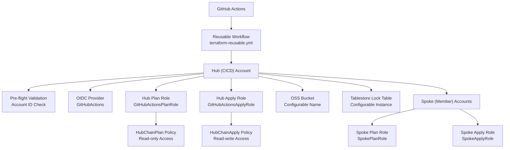
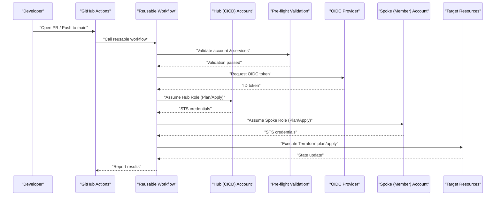
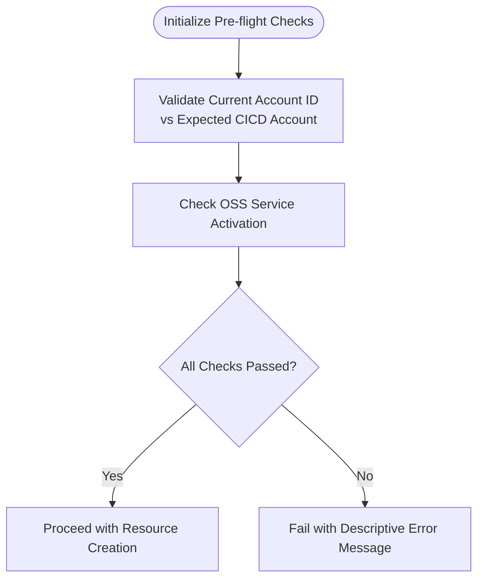
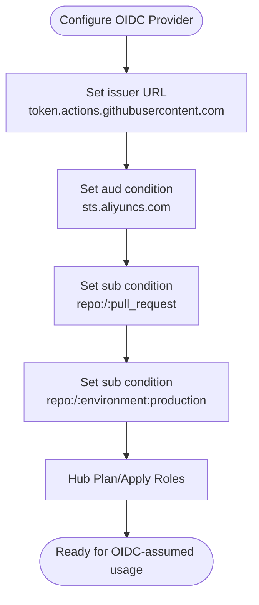
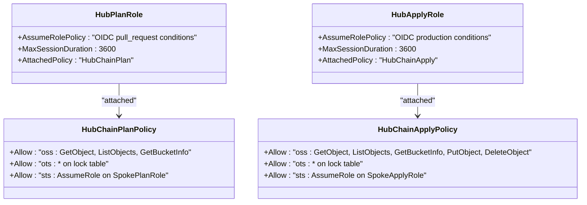
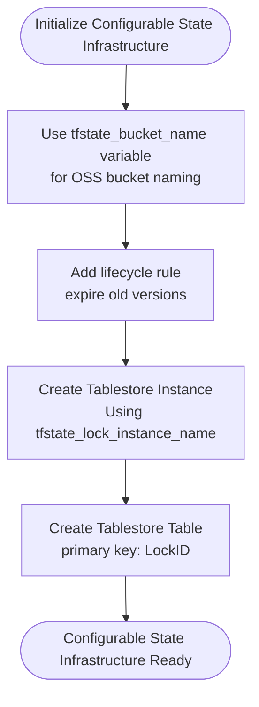
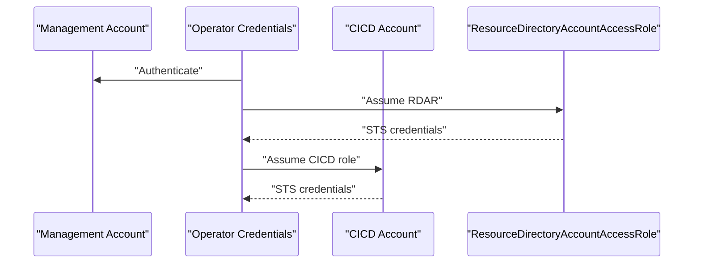
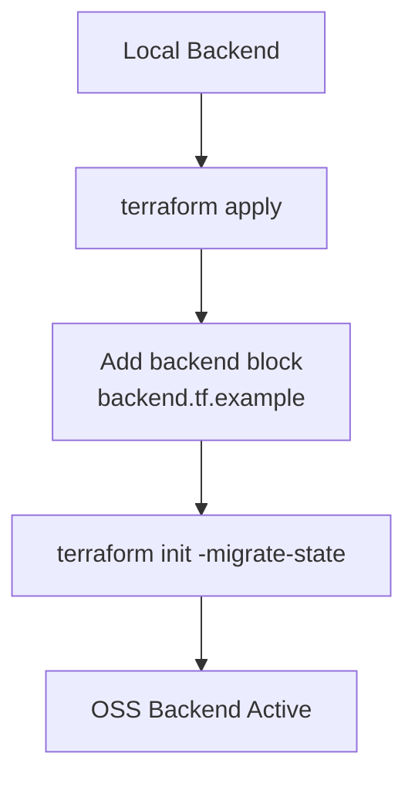
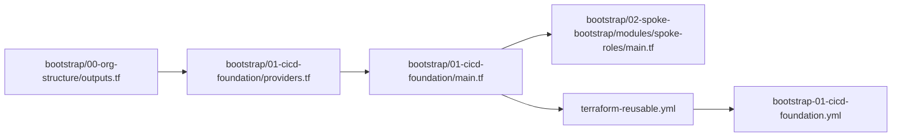

# CI/CD Foundation

<cite>
**Referenced Files in This Document**
- [README.md](file://README.md)
- [bootstrap/01-cicd-foundation/main.tf](file://bootstrap/01-cicd-foundation/main.tf)
- [bootstrap/01-cicd-foundation/variables.tf](file://bootstrap/01-cicd-foundation/variables.tf)
- [bootstrap/01-cicd-foundation/providers.tf](file://bootstrap/01-cicd-foundation/providers.tf)
- [bootstrap/01-cicd-foundation/backend.tf.example](file://bootstrap/01-cicd-foundation/backend.tf.example)
- [bootstrap/01-cicd-foundation/outputs.tf](file://bootstrap/01-cicd-foundation/outputs.tf)
- [bootstrap/01-cicd-foundation/versions.tf](file://bootstrap/01-cicd-foundation/versions.tf)
- [.github/workflows/bootstrap-01-cicd-foundation.yml](file://.github/workflows/bootstrap-01-cicd-foundation.yml)
- [.github/workflows/terraform-reusable.yml](file://.github/workflows/terraform-reusable.yml)
- [bootstrap/02-spoke-bootstrap/modules/spoke-roles/main.tf](file://bootstrap/02-spoke-bootstrap/modules/spoke-roles/main.tf)
- [bootstrap/02-spoke-bootstrap/modules/spoke-roles/variables.tf](file://bootstrap/02-spoke-bootstrap/modules/spoke-roles/variables.tf)
- [bootstrap/02-spoke-bootstrap/modules/spoke-roles/outputs.tf](file://bootstrap/02-spoke-bootstrap/modules/spoke-roles/outputs.tf)
- [bootstrap/00-org-structure/outputs.tf](file://bootstrap/00-org-structure/outputs.tf)
</cite>

## Update Summary
**Changes Made**
- Added enhanced security controls with pre-flight account validation checks
- Updated hub role policies to use separate HubChainPlan and HubChainApply policies for improved least-privilege access
- Added configurable state bucket naming via tfstate_bucket_name variable
- Added new tfstate_lock_instance_name variable for Tablestore instance configuration
- Added new current_account_id output for validation and debugging
- Enhanced OSS service activation validation using alicloud_oss_service data source

## Table of Contents
1. [Introduction](#introduction)
2. [Project Structure](#project-structure)
3. [Core Components](#core-components)
4. [Architecture Overview](#architecture-overview)
5. [Detailed Component Analysis](#detailed-component-analysis)
6. [Dependency Analysis](#dependency-analysis)
7. [Performance Considerations](#performance-considerations)
8. [Troubleshooting Guide](#troubleshooting-guide)
9. [Conclusion](#conclusion)
10. [Appendices](#appendices)

## Introduction
This document explains the CI/CD foundation bootstrap phase that establishes secure credential management and state infrastructure for Alibaba Cloud Landing Zone deployments using GitHub Actions and OIDC. It covers:
- OIDC provider configuration for GitHub Actions integration
- Hub role creation for Plan and Apply operations with enhanced least-privilege policies
- State infrastructure setup with OSS backend and Tablestore distributed locking
- Provider configuration for multi-account operations
- Security implications of enhanced security controls and pre-flight validation
- Backend configuration examples, variable definitions, and troubleshooting guidance
- State migration procedures and backend initialization steps

## Project Structure
The CI/CD foundation is implemented in a dedicated bootstrap module and orchestrated by GitHub Actions reusable workflows. The structure emphasizes separation of concerns with enhanced security controls:
- bootstrap/01-cicd-foundation: Creates OIDC provider, hub roles with separate plan/apply policies, OSS state bucket, and Tablestore lock table with pre-flight validation
- bootstrap/02-spoke-bootstrap/modules/spoke-roles: Defines spoke roles in member accounts that trust hub roles
- .github/workflows: Reusable workflow that performs Terraform plan/apply using OIDC-assumed roles

**Diagram sources**
- [.github/workflows/terraform-reusable.yml:1-118](file://.github/workflows/terraform-reusable.yml#L1-L118)
- [bootstrap/01-cicd-foundation/main.tf:7-14](file://bootstrap/01-cicd-foundation/main.tf#L7-L14)
- [bootstrap/01-cicd-foundation/main.tf:70-125](file://bootstrap/01-cicd-foundation/main.tf#L70-L125)
- [bootstrap/01-cicd-foundation/main.tf:133-179](file://bootstrap/01-cicd-foundation/main.tf#L133-L179)
- [bootstrap/02-spoke-bootstrap/modules/spoke-roles/main.tf:3-41](file://bootstrap/02-spoke-bootstrap/modules/spoke-roles/main.tf#L3-L41)

**Section sources**
- [README.md:141-165](file://README.md#L141-L165)
- [bootstrap/01-cicd-foundation/main.tf:1-192](file://bootstrap/01-cicd-foundation/main.tf#L1-L192)
- [bootstrap/01-cicd-foundation/variables.tf:1-27](file://bootstrap/01-cicd-foundation/variables.tf#L1-L27)
- [bootstrap/01-cicd-foundation/providers.tf:1-22](file://bootstrap/01-cicd-foundation/providers.tf#L1-L22)
- [.github/workflows/bootstrap-01-cicd-foundation.yml:1-36](file://.github/workflows/bootstrap-01-cicd-foundation.yml#L1-L36)
- [.github/workflows/terraform-reusable.yml:1-118](file://.github/workflows/terraform-reusable.yml#L1-L118)
- [bootstrap/02-spoke-bootstrap/modules/spoke-roles/main.tf:1-42](file://bootstrap/02-spoke-bootstrap/modules/spoke-roles/main.tf#L1-L42)

## Core Components
- **Pre-flight Validation**: Enhanced security controls with account ID verification and OSS service activation checks
- **OIDC Provider**: Establishes trust between GitHub Actions and Alibaba Cloud, enabling short-lived STS tokens without long-lived credentials
- **Hub Roles**: Separate roles for plan (read-only) and apply (read-write) operations with distinct least-privilege policies
- **State Infrastructure**: Configurable OSS bucket for encrypted state storage and Tablestore table for distributed locking
- **Provider Configuration**: Multi-account chaining from management account to CICD account using ResourceDirectoryAccountAccessRole
- **Outputs**: Exposes ARNs, identifiers, and current account information needed by GitHub Actions workflows

Key implementation references:
- Pre-flight validation and OSS service check: [bootstrap/01-cicd-foundation/main.tf:7-18](file://bootstrap/01-cicd-foundation/main.tf#L7-L18)
- OIDC provider and hub roles: [bootstrap/01-cicd-foundation/main.tf:70-125](file://bootstrap/01-cicd-foundation/main.tf#L70-L125)
- Separate hub policies: [bootstrap/01-cicd-foundation/main.tf:133-179](file://bootstrap/01-cicd-foundation/main.tf#L133-L179)
- State bucket and lock table: [bootstrap/01-cicd-foundation/main.tf:28-64](file://bootstrap/01-cicd-foundation/main.tf#L28-L64)
- Provider chaining: [bootstrap/01-cicd-foundation/providers.tf:14-21](file://bootstrap/01-cicd-foundation/providers.tf#L14-L21)
- Outputs including current account: [bootstrap/01-cicd-foundation/outputs.tf:1-30](file://bootstrap/01-cicd-foundation/outputs.tf#L1-L30)

**Section sources**
- [bootstrap/01-cicd-foundation/main.tf:7-18](file://bootstrap/01-cicd-foundation/main.tf#L7-L18)
- [bootstrap/01-cicd-foundation/main.tf:70-125](file://bootstrap/01-cicd-foundation/main.tf#L70-L125)
- [bootstrap/01-cicd-foundation/main.tf:133-179](file://bootstrap/01-cicd-foundation/main.tf#L133-L179)
- [bootstrap/01-cicd-foundation/main.tf:28-64](file://bootstrap/01-cicd-foundation/main.tf#L28-L64)
- [bootstrap/01-cicd-foundation/providers.tf:14-21](file://bootstrap/01-cicd-foundation/providers.tf#L14-L21)
- [bootstrap/01-cicd-foundation/outputs.tf:1-30](file://bootstrap/01-cicd-foundation/outputs.tf#L1-L30)

## Architecture Overview
The CI/CD foundation enforces a strict security model with enhanced pre-flight validation:
- **Pre-flight Security Checks**: Validates account context and service availability before resource creation
- No long-lived credentials: GitHub OIDC tokens are exchanged for short-lived STS tokens at runtime
- **Least-privilege with separate policies**: Plan role uses HubChainPlan policy (read-only); Apply role uses HubChainApply policy (read-write)
- Account isolation: Each spoke account has its own roles; compromising one does not affect others
- Encrypted state: OSS bucket uses KMS server-side encryption with configurable naming
- Distributed locking: Tablestore prevents concurrent applies with configurable instance naming

**Diagram sources**
- [.github/workflows/bootstrap-01-cicd-foundation.yml:18-36](file://.github/workflows/bootstrap-01-cicd-foundation.yml#L18-L36)
- [.github/workflows/terraform-reusable.yml:50-56](file://.github/workflows/terraform-reusable.yml#L50-L56)
- [bootstrap/01-cicd-foundation/main.tf:7-14](file://bootstrap/01-cicd-foundation/main.tf#L7-L14)
- [bootstrap/01-cicd-foundation/main.tf:70-125](file://bootstrap/01-cicd-foundation/main.tf#L70-L125)
- [bootstrap/02-spoke-bootstrap/modules/spoke-roles/main.tf:3-41](file://bootstrap/02-spoke-bootstrap/modules/spoke-roles/main.tf#L3-L41)

**Section sources**
- [README.md:106-113](file://README.md#L106-L113)
- [.github/workflows/terraform-reusable.yml:50-56](file://.github/workflows/terraform-reusable.yml#L50-L56)
- [bootstrap/01-cicd-foundation/main.tf:7-14](file://bootstrap/01-cicd-foundation/main.tf#L7-L14)
- [bootstrap/01-cicd-foundation/main.tf:70-125](file://bootstrap/01-cicd-foundation/main.tf#L70-L125)
- [bootstrap/02-spoke-bootstrap/modules/spoke-roles/main.tf:3-41](file://bootstrap/02-spoke-bootstrap/modules/spoke-roles/main.tf#L3-L41)

## Detailed Component Analysis

### Enhanced Security Controls and Pre-flight Validation
The CI/CD foundation now includes comprehensive pre-flight validation checks:
- **Account ID Validation**: Ensures Terraform runs in the correct CICD account context
- **OSS Service Activation Check**: Verifies OSS service is enabled before creating buckets
- **Service Dependency Management**: Uses depends_on to ensure proper resource ordering

Implementation highlights:
- Account validation with lifecycle precondition: [bootstrap/01-cicd-foundation/main.tf:7-14](file://bootstrap/01-cicd-foundation/main.tf#L7-L14)
- OSS service activation check: [bootstrap/01-cicd-foundation/main.tf:16-18](file://bootstrap/01-cicd-foundation/main.tf#L16-L18)
- State bucket dependency on OSS service: [bootstrap/01-cicd-foundation/main.tf:29](file://bootstrap/01-cicd-foundation/main.tf#L29)

**Diagram sources**
- [bootstrap/01-cicd-foundation/main.tf:7-14](file://bootstrap/01-cicd-foundation/main.tf#L7-L14)
- [bootstrap/01-cicd-foundation/main.tf:16-18](file://bootstrap/01-cicd-foundation/main.tf#L16-L18)

**Section sources**
- [bootstrap/01-cicd-foundation/main.tf:7-14](file://bootstrap/01-cicd-foundation/main.tf#L7-L14)
- [bootstrap/01-cicd-foundation/main.tf:16-18](file://bootstrap/01-cicd-foundation/main.tf#L16-L18)

### OIDC Provider Configuration
The OIDC provider enables GitHub Actions to assume hub roles securely:
- Provider name and issuer URL are configured for GitHub Actions
- Audience and issuer conditions restrict token usage
- Client IDs define trusted audiences
- Conditions scope role assumption to specific GitHub contexts (PR vs production environment)

Implementation highlights:
- OIDC provider resource: [bootstrap/01-cicd-foundation/main.tf:70-77](file://bootstrap/01-cicd-foundation/main.tf#L70-L77)
- Hub plan role with OIDC conditions: [bootstrap/01-cicd-foundation/main.tf:83-103](file://bootstrap/01-cicd-foundation/main.tf#L83-L103)
- Hub apply role with OIDC conditions: [bootstrap/01-cicd-foundation/main.tf:105-125](file://bootstrap/01-cicd-foundation/main.tf#L105-L125)

**Diagram sources**
- [bootstrap/01-cicd-foundation/main.tf:70-77](file://bootstrap/01-cicd-foundation/main.tf#L70-L77)
- [bootstrap/01-cicd-foundation/main.tf:83-125](file://bootstrap/01-cicd-foundation/main.tf#L83-L125)

**Section sources**
- [bootstrap/01-cicd-foundation/main.tf:70-77](file://bootstrap/01-cicd-foundation/main.tf#L70-L77)
- [bootstrap/01-cicd-foundation/main.tf:83-125](file://bootstrap/01-cicd-foundation/main.tf#L83-L125)

### Improved Hub Role Policies with Least-Privilege Access
Two separate hub policies provide enhanced least-privilege access control:
- **HubChainPlan Policy**: Read-only access for PR plans with limited OSS permissions
- **HubChainApply Policy**: Full read-write access for production apply with complete OSS permissions

Policy differences:
- Plan policy: `oss:GetObject`, `oss:ListObjects`, `oss:GetBucketInfo` only
- Apply policy: Adds `oss:PutObject`, `oss:DeleteObject` capabilities
- Both policies allow `ots:*` for distributed locking and `sts:AssumeRole` on appropriate spoke roles

Implementation highlights:
- HubChainPlan policy definition: [bootstrap/01-cicd-foundation/main.tf:133-155](file://bootstrap/01-cicd-foundation/main.tf#L133-L155)
- HubChainApply policy definition: [bootstrap/01-cicd-foundation/main.tf:157-179](file://bootstrap/01-cicd-foundation/main.tf#L157-L179)
- Policy attachments: [bootstrap/01-cicd-foundation/main.tf:181-191](file://bootstrap/01-cicd-foundation/main.tf#L181-L191)

**Diagram sources**
- [bootstrap/01-cicd-foundation/main.tf:83-191](file://bootstrap/01-cicd-foundation/main.tf#L83-L191)

**Section sources**
- [bootstrap/01-cicd-foundation/main.tf:133-191](file://bootstrap/01-cicd-foundation/main.tf#L133-L191)

### Configurable State Infrastructure Setup
The state infrastructure now supports configurable naming for better organization and management:
- **Configurable OSS Bucket**: Named via `tfstate_bucket_name` variable for flexible naming conventions
- **Configurable Tablestore Instance**: Named via `tfstate_lock_instance_name` variable with default value
- Enhanced versioning and lifecycle management remains unchanged

Implementation highlights:
- Configurable bucket naming: [bootstrap/01-cicd-foundation/main.tf:24-30](file://bootstrap/01-cicd-foundation/main.tf#L24-30)
- Configurable Tablestore instance: [bootstrap/01-cicd-foundation/main.tf:50-53](file://bootstrap/01-cicd-foundation/main.tf#L50-53)
- Variable definitions: [bootstrap/01-cicd-foundation/variables.tf:12-21](file://bootstrap/01-cicd-foundation/variables.tf#L12-21)

**Diagram sources**
- [bootstrap/01-cicd-foundation/main.tf:24-64](file://bootstrap/01-cicd-foundation/main.tf#L24-64)
- [bootstrap/01-cicd-foundation/variables.tf:12-21](file://bootstrap/01-cicd-foundation/variables.tf#L12-21)

**Section sources**
- [bootstrap/01-cicd-foundation/main.tf:24-64](file://bootstrap/01-cicd-foundation/main.tf#L24-64)
- [bootstrap/01-cicd-foundation/variables.tf:12-21](file://bootstrap/01-cicd-foundation/variables.tf#L12-21)

### Provider Configuration for Multi-Account Operations
Multi-account operations are achieved by chaining providers:
- Management account provider (operator credentials)
- CICD account provider chained via ResourceDirectoryAccountAccessRole

Implementation highlights:
- Management provider: [bootstrap/01-cicd-foundation/providers.tf:8-11](file://bootstrap/01-cicd-foundation/providers.tf#L8-11)
- CICD provider with assume_role: [bootstrap/01-cicd-foundation/providers.tf:14-21](file://bootstrap/01-cicd-foundation/providers.tf#L14-21)
- Variables consumed by providers: [bootstrap/01-cicd-foundation/variables.tf:1-27](file://bootstrap/01-cicd-foundation/variables.tf#L1-27)

**Diagram sources**
- [bootstrap/01-cicd-foundation/providers.tf:8-21](file://bootstrap/01-cicd-foundation/providers.tf#L8-21)
- [bootstrap/01-cicd-foundation/variables.tf:7-10](file://bootstrap/01-cicd-foundation/variables.tf#L7-10)

**Section sources**
- [bootstrap/01-cicd-foundation/providers.tf:8-21](file://bootstrap/01-cicd-foundation/providers.tf#L8-21)
- [bootstrap/01-cicd-foundation/variables.tf:7-10](file://bootstrap/01-cicd-foundation/variables.tf#L7-10)

### Enhanced Security Implications of Least-Privilege Roles
The enhanced security model provides stronger isolation:
- **Pre-flight validation**: Prevents accidental execution in wrong account context
- **Separate policies**: HubChainPlan vs HubChainApply provide clear separation of concerns
- Plan role is read-only and scoped to pull_request context with limited OSS permissions
- Apply role is read-write and restricted to production environment with full OSS permissions
- Spoke roles enforce account isolation and minimal permissions
- Encrypted state and distributed locking protect against unauthorized changes

Implementation references:
- Pre-flight validation: [bootstrap/01-cicd-foundation/main.tf:7-14](file://bootstrap/01-cicd-foundation/main.tf#L7-14)
- Separate hub policies: [bootstrap/01-cicd-foundation/main.tf:133-191](file://bootstrap/01-cicd-foundation/main.tf#L133-191)
- Spoke roles (plan/apply): [bootstrap/02-spoke-bootstrap/modules/spoke-roles/main.tf:3-41](file://bootstrap/02-spoke-bootstrap/modules/spoke-roles/main.tf#L3-41)
- Security model summary: [README.md:106-113](file://README.md#L106-113)

**Section sources**
- [bootstrap/01-cicd-foundation/main.tf:7-14](file://bootstrap/01-cicd-foundation/main.tf#L7-14)
- [bootstrap/01-cicd-foundation/main.tf:133-191](file://bootstrap/01-cicd-foundation/main.tf#L133-191)
- [bootstrap/02-spoke-bootstrap/modules/spoke-roles/main.tf:3-41](file://bootstrap/02-spoke-bootstrap/modules/spoke-roles/main.tf#L3-41)
- [README.md:106-113](file://README.md#L106-113)

### Backend Configuration and State Migration
- backend.tf.example demonstrates OSS backend configuration with Tablestore endpoint and table
- Initial versions.tf omits backend block; state is migrated after apply
- Migration requires obtaining STS credentials via ResourceDirectoryAccountAccessRole

Implementation highlights:
- Backend example: [bootstrap/01-cicd-foundation/backend.tf.example:13-22](file://bootstrap/01-cicd-foundation/backend.tf.example#L13-22)
- Migration instructions: [bootstrap/01-cicd-foundation/backend.tf.example:4-11](file://bootstrap/01-cicd-foundation/backend.tf.example#L4-11)
- Versions without backend: [bootstrap/01-cicd-foundation/versions.tf:9-11](file://bootstrap/01-cicd-foundation/versions.tf#L9-11)

**Diagram sources**
- [bootstrap/01-cicd-foundation/backend.tf.example:13-22](file://bootstrap/01-cicd-foundation/backend.tf.example#L13-22)
- [bootstrap/01-cicd-foundation/backend.tf.example:4-11](file://bootstrap/01-cicd-foundation/backend.tf.example#L4-11)
- [bootstrap/01-cicd-foundation/versions.tf:9-11](file://bootstrap/01-cicd-foundation/versions.tf#L9-11)

**Section sources**
- [bootstrap/01-cicd-foundation/backend.tf.example:13-22](file://bootstrap/01-cicd-foundation/backend.tf.example#L13-22)
- [bootstrap/01-cicd-foundation/backend.tf.example:4-11](file://bootstrap/01-cicd-foundation/backend.tf.example#L4-11)
- [bootstrap/01-cicd-foundation/versions.tf:9-11](file://bootstrap/01-cicd-foundation/versions.tf#L9-11)

## Dependency Analysis
The CI/CD foundation depends on:
- bootstrap/01-cicd-foundation: Provides OIDC provider, hub roles with separate policies, and state infrastructure with pre-flight validation
- bootstrap/02-spoke-bootstrap/modules/spoke-roles: Provides spoke roles that trust hub roles
- .github/workflows/terraform-reusable.yml: Orchestrates OIDC-based credential configuration and Terraform operations
- bootstrap/00-org-structure/outputs.tf: Supplies account IDs for provider configuration

**Diagram sources**
- [bootstrap/00-org-structure/outputs.tf:15-19](file://bootstrap/00-org-structure/outputs.tf#L15-19)
- [bootstrap/01-cicd-foundation/providers.tf:8-21](file://bootstrap/01-cicd-foundation/providers.tf#L8-21)
- [bootstrap/01-cicd-foundation/main.tf:70-191](file://bootstrap/01-cicd-foundation/main.tf#L70-191)
- [bootstrap/02-spoke-bootstrap/modules/spoke-roles/main.tf:3-41](file://bootstrap/02-spoke-bootstrap/modules/spoke-roles/main.tf#L3-41)
- [.github/workflows/terraform-reusable.yml:50-56](file://.github/workflows/terraform-reusable.yml#L50-56)
- [.github/workflows/bootstrap-01-cicd-foundation.yml:18-36](file://.github/workflows/bootstrap-01-cicd-foundation.yml#L18-36)

**Section sources**
- [bootstrap/00-org-structure/outputs.tf:15-19](file://bootstrap/00-org-structure/outputs.tf#L15-19)
- [bootstrap/01-cicd-foundation/providers.tf:8-21](file://bootstrap/01-cicd-foundation/providers.tf#L8-21)
- [bootstrap/01-cicd-foundation/main.tf:70-191](file://bootstrap/01-cicd-foundation/main.tf#L70-191)
- [bootstrap/02-spoke-bootstrap/modules/spoke-roles/main.tf:3-41](file://bootstrap/02-spoke-bootstrap/modules/spoke-roles/main.tf#L3-41)
- [.github/workflows/terraform-reusable.yml:50-56](file://.github/workflows/terraform-reusable.yml#L50-56)
- [.github/workflows/bootstrap-01-cicd-foundation.yml:18-36](file://.github/workflows/bootstrap-01-cicd-foundation.yml#L18-36)

## Performance Considerations
- OIDC token exchange is fast and avoids long-lived credentials
- **Pre-flight validation adds minimal overhead** while providing critical safety checks
- OSS state backend provides efficient state retrieval and updates
- Tablestore distributed locking minimizes contention under moderate concurrency
- Using capacity Tablestore instance reduces cost while maintaining reliability
- **Configurable naming allows for better resource organization and management**

[No sources needed since this section provides general guidance]

## Troubleshooting Guide
Common issues and resolutions during CI/CD foundation bootstrap:

- **Pre-flight validation failures**
  - Verify current account matches expected CICD account ID
  - Ensure you have assumed role into the correct account before running Terraform
  - Check error message for specific account mismatch details
  - Reference: [bootstrap/01-cicd-foundation/main.tf:7-14](file://bootstrap/01-cicd-foundation/main.tf#L7-14)

- **OSS service activation errors**
  - Ensure OSS service is enabled in the target account
  - Check that the alicloud_oss_service data source returns successfully
  - Reference: [bootstrap/01-cicd-foundation/main.tf:16-18](file://bootstrap/01-cicd-foundation/main.tf#L16-18)

- **OIDC token exchange failures**
  - Verify OIDC provider ARN and hub role ARNs are set in repository variables
  - Confirm GitHub Actions permissions include id-token: write
  - Ensure conditions match GitHub context (pull_request vs environment:production)
  - Reference: [README.md:96-105](file://README.md#L96-105), [.github/workflows/terraform-reusable.yml:33-36](file://.github/workflows/terraform-reusable.yml#L33-36)

- **State migration errors**
  - Ensure backend block is present before migration
  - Obtain STS credentials using ResourceDirectoryAccountAccessRole before terraform init -migrate-state
  - Reference: [bootstrap/01-cicd-foundation/backend.tf.example:4-11](file://bootstrap/01-cicd-foundation/backend.tf.example#L4-11)

- **Provider configuration issues**
  - Confirm management account credentials and ResourceDirectoryAccountAccessRole availability
  - Verify cicd_account_id variable matches the CICD account ID
  - Reference: [bootstrap/01-cicd-foundation/providers.tf:14-21](file://bootstrap/01-cicd-foundation/providers.tf#L14-21), [bootstrap/01-cicd-foundation/variables.tf:7-10](file://bootstrap/01-cicd-foundation/variables.tf#L7-10)

- **Role assumption failures**
  - Check hub role trust policies and OIDC conditions
  - Validate spoke roles trust hub roles and have appropriate policies attached
  - Verify correct policy attachment (HubChainPlan vs HubChainApply)
  - Reference: [bootstrap/01-cicd-foundation/main.tf:83-191](file://bootstrap/01-cicd-foundation/main.tf#L83-191), [bootstrap/02-spoke-bootstrap/modules/spoke-roles/main.tf:3-41](file://bootstrap/02-spoke-bootstrap/modules/spoke-roles/main.tf#L3-41)

- **Configurable naming issues**
  - Verify tfstate_bucket_name variable is properly set
  - Check tfstate_lock_instance_name variable if using custom Tablestore instance name
  - Reference: [bootstrap/01-cicd-foundation/variables.tf:12-21](file://bootstrap/01-cicd-foundation/variables.tf#L12-21)

**Section sources**
- [bootstrap/01-cicd-foundation/main.tf:7-14](file://bootstrap/01-cicd-foundation/main.tf#L7-14)
- [bootstrap/01-cicd-foundation/main.tf:16-18](file://bootstrap/01-cicd-foundation/main.tf#L16-18)
- [README.md:96-105](file://README.md#L96-105)
- [.github/workflows/terraform-reusable.yml:33-36](file://.github/workflows/terraform-reusable.yml#L33-36)
- [bootstrap/01-cicd-foundation/backend.tf.example:4-11](file://bootstrap/01-cicd-foundation/backend.tf.example#L4-11)
- [bootstrap/01-cicd-foundation/providers.tf:14-21](file://bootstrap/01-cicd-foundation/providers.tf#L14-21)
- [bootstrap/01-cicd-foundation/variables.tf:7-10](file://bootstrap/01-cicd-foundation/variables.tf#L7-10)
- [bootstrap/01-cicd-foundation/main.tf:83-191](file://bootstrap/01-cicd-foundation/main.tf#L83-191)
- [bootstrap/02-spoke-bootstrap/modules/spoke-roles/main.tf:3-41](file://bootstrap/02-spoke-bootstrap/modules/spoke-roles/main.tf#L3-41)
- [bootstrap/01-cicd-foundation/variables.tf:12-21](file://bootstrap/01-cicd-foundation/variables.tf#L12-21)

## Conclusion
The CI/CD foundation bootstrap establishes a secure, least-privilege pipeline for managing Alibaba Cloud resources with GitHub Actions, enhanced with robust security controls:
- **Pre-flight validation** ensures correct account context and service availability
- OIDC provider and hub roles enable short-lived, context-aware credentials with separate least-privilege policies
- **Configurable state infrastructure** provides flexible naming for better organization
- OSS state bucket with KMS encryption and Tablestore distributed locking ensures safe state management
- Multi-account provider chaining and spoke roles enforce isolation and minimal permissions
- Clear migration and troubleshooting guidance supports reliable operations

[No sources needed since this section summarizes without analyzing specific files]

## Appendices

### Enhanced Variable Definitions
- region: Alibaba Cloud region (default: cn-hangzhou)
- cicd_account_id: CICD/DevOps member account ID
- **tfstate_bucket_name**: Name of the OSS bucket for Terraform state storage (configurable)
- **tfstate_lock_instance_name**: Name of the Tablestore instance for Terraform state locking (default: tfstate-lock)
- github_org_repo: GitHub organization/repository identifier (e.g., my-org/landing-zone)

Reference: [bootstrap/01-cicd-foundation/variables.tf:1-27](file://bootstrap/01-cicd-foundation/variables.tf#L1-27)

### Backend Configuration Example
- Backend block for OSS with Tablestore endpoint and table
- Prefix and key define state path
- Region and tablestore settings align with state infrastructure

Reference: [bootstrap/01-cicd-foundation/backend.tf.example:13-22](file://bootstrap/01-cicd-foundation/backend.tf.example#L13-22)

### Enhanced Outputs for GitHub Actions
- **current_account_id**: Account ID of the current provider context (should match cicd_account_id)
- tfstate_bucket: OSS bucket name for Terraform state
- tfstate_tablestore_endpoint: Tablestore endpoint for state locking
- oidc_provider_arn: ARN of the GitHub Actions OIDC provider
- github_plan_role_arn: ARN of the GitHubActionsPlanRole (hub)
- github_apply_role_arn: ARN of the GitHubActionsApplyRole (hub)

Reference: [bootstrap/01-cicd-foundation/outputs.tf:1-30](file://bootstrap/01-cicd-foundation/outputs.tf#L1-30)

### Security Enhancement Summary
- **Pre-flight validation**: Prevents execution in wrong account context
- **Separate hub policies**: HubChainPlan (read-only) vs HubChainApply (read-write)
- **Enhanced OSS service validation**: Ensures service availability before resource creation
- **Configurable naming**: Better resource organization and management
- **Improved error messages**: More descriptive failure reasons for easier troubleshooting

[No sources needed since this section summarizes security enhancements]