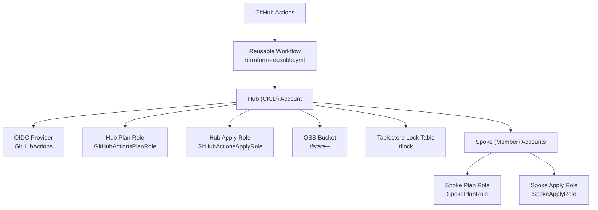
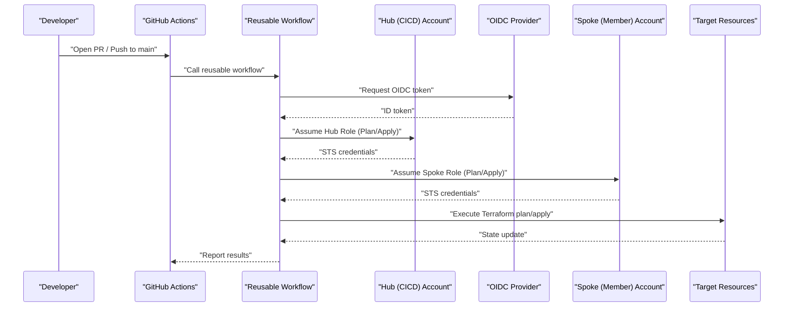
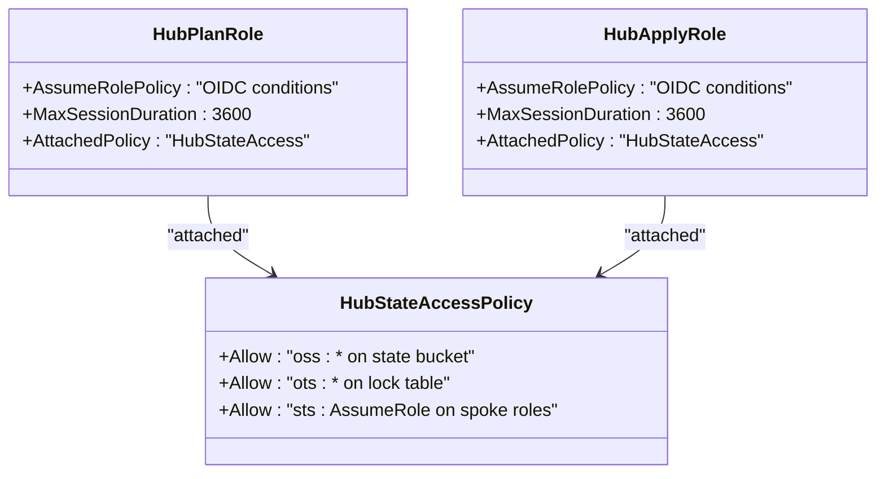
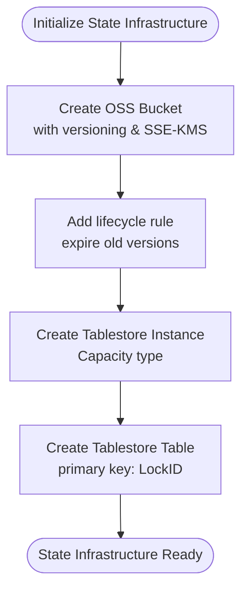
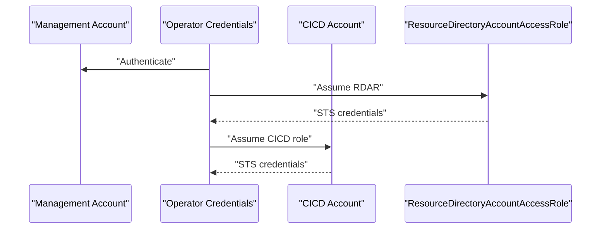
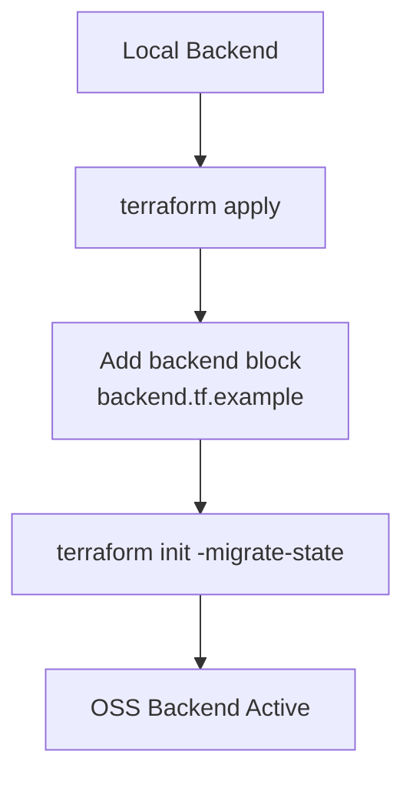
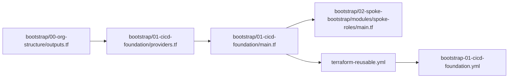

# CI/CD Foundation

<cite>
**Referenced Files in This Document**
- [README.md](file://README.md)
- [bootstrap/01-cicd-foundation/main.tf](file://bootstrap/01-cicd-foundation/main.tf)
- [bootstrap/01-cicd-foundation/variables.tf](file://bootstrap/01-cicd-foundation/variables.tf)
- [bootstrap/01-cicd-foundation/providers.tf](file://bootstrap/01-cicd-foundation/providers.tf)
- [bootstrap/01-cicd-foundation/backend.tf.example](file://bootstrap/01-cicd-foundation/backend.tf.example)
- [bootstrap/01-cicd-foundation/outputs.tf](file://bootstrap/01-cicd-foundation/outputs.tf)
- [bootstrap/01-cicd-foundation/versions.tf](file://bootstrap/01-cicd-foundation/versions.tf)
- [.github/workflows/bootstrap-01-cicd-foundation.yml](file://.github/workflows/bootstrap-01-cicd-foundation.yml)
- [.github/workflows/terraform-reusable.yml](file://.github/workflows/terraform-reusable.yml)
- [bootstrap/02-spoke-bootstrap/modules/spoke-roles/main.tf](file://bootstrap/02-spoke-bootstrap/modules/spoke-roles/main.tf)
- [bootstrap/02-spoke-bootstrap/modules/spoke-roles/variables.tf](file://bootstrap/02-spoke-bootstrap/modules/spoke-roles/variables.tf)
- [bootstrap/02-spoke-bootstrap/modules/spoke-roles/outputs.tf](file://bootstrap/02-spoke-bootstrap/modules/spoke-roles/outputs.tf)
- [bootstrap/00-org-structure/outputs.tf](file://bootstrap/00-org-structure/outputs.tf)
</cite>

## Table of Contents
1. [Introduction](#introduction)
2. [Project Structure](#project-structure)
3. [Core Components](#core-components)
4. [Architecture Overview](#architecture-overview)
5. [Detailed Component Analysis](#detailed-component-analysis)
6. [Dependency Analysis](#dependency-analysis)
7. [Performance Considerations](#performance-considerations)
8. [Troubleshooting Guide](#troubleshooting-guide)
9. [Conclusion](#conclusion)
10. [Appendices](#appendices)

## Introduction
This document explains the CI/CD foundation bootstrap phase that establishes secure credential management and state infrastructure for Alibaba Cloud Landing Zone deployments using GitHub Actions and OIDC. It covers:
- OIDC provider configuration for GitHub Actions integration
- Hub role creation for Plan and Apply operations
- State infrastructure setup with OSS backend and Tablestore distributed locking
- Provider configuration for multi-account operations
- Security implications of least-privilege roles
- Backend configuration examples, variable definitions, and troubleshooting guidance
- State migration procedures and backend initialization steps

## Project Structure
The CI/CD foundation is implemented in a dedicated bootstrap module and orchestrated by GitHub Actions reusable workflows. The structure emphasizes separation of concerns:
- bootstrap/01-cicd-foundation: Creates OIDC provider, hub roles, OSS state bucket, and Tablestore lock table
- bootstrap/02-spoke-bootstrap/modules/spoke-roles: Defines spoke roles in member accounts that trust hub roles
- .github/workflows: Reusable workflow that performs Terraform plan/apply using OIDC-assumed roles

**Diagram sources**
- [.github/workflows/terraform-reusable.yml:1-118](file://.github/workflows/terraform-reusable.yml#L1-L118)
- [bootstrap/01-cicd-foundation/main.tf:49-105](file://bootstrap/01-cicd-foundation/main.tf#L49-L105)
- [bootstrap/01-cicd-foundation/main.tf:5-43](file://bootstrap/01-cicd-foundation/main.tf#L5-L43)
- [bootstrap/02-spoke-bootstrap/modules/spoke-roles/main.tf:3-41](file://bootstrap/02-spoke-bootstrap/modules/spoke-roles/main.tf#L3-L41)

**Section sources**
- [README.md:141-165](file://README.md#L141-L165)
- [bootstrap/01-cicd-foundation/main.tf:1-150](file://bootstrap/01-cicd-foundation/main.tf#L1-L150)
- [bootstrap/01-cicd-foundation/variables.tf:1-16](file://bootstrap/01-cicd-foundation/variables.tf#L1-L16)
- [bootstrap/01-cicd-foundation/providers.tf:1-16](file://bootstrap/01-cicd-foundation/providers.tf#L1-L16)
- [.github/workflows/bootstrap-01-cicd-foundation.yml:1-36](file://.github/workflows/bootstrap-01-cicd-foundation.yml#L1-L36)
- [.github/workflows/terraform-reusable.yml:1-118](file://.github/workflows/terraform-reusable.yml#L1-L118)
- [bootstrap/02-spoke-bootstrap/modules/spoke-roles/main.tf:1-42](file://bootstrap/02-spoke-bootstrap/modules/spoke-roles/main.tf#L1-L42)

## Core Components
- OIDC Provider: Establishes trust between GitHub Actions and Alibaba Cloud, enabling short-lived STS tokens without long-lived credentials.
- Hub Roles: Separate roles for plan (read-only) and apply (read-write) operations, scoped to specific GitHub contexts.
- State Infrastructure: OSS bucket for encrypted state storage and Tablestore table for distributed locking.
- Provider Configuration: Multi-account chaining from management account to CICD account using ResourceDirectoryAccountAccessRole.
- Outputs: Exposes ARNs and identifiers needed by GitHub Actions workflows.

Key implementation references:
- OIDC provider and hub roles: [bootstrap/01-cicd-foundation/main.tf:49-105](file://bootstrap/01-cicd-foundation/main.tf#L49-L105)
- State bucket and lock table: [bootstrap/01-cicd-foundation/main.tf:5-43](file://bootstrap/01-cicd-foundation/main.tf#L5-L43)
- Provider chaining: [bootstrap/01-cicd-foundation/providers.tf:7-15](file://bootstrap/01-cicd-foundation/providers.tf#L7-L15)
- Outputs: [bootstrap/01-cicd-foundation/outputs.tf:1-25](file://bootstrap/01-cicd-foundation/outputs.tf#L1-L25)

**Section sources**
- [bootstrap/01-cicd-foundation/main.tf:49-105](file://bootstrap/01-cicd-foundation/main.tf#L49-L105)
- [bootstrap/01-cicd-foundation/main.tf:5-43](file://bootstrap/01-cicd-foundation/main.tf#L5-L43)
- [bootstrap/01-cicd-foundation/providers.tf:7-15](file://bootstrap/01-cicd-foundation/providers.tf#L7-L15)
- [bootstrap/01-cicd-foundation/outputs.tf:1-25](file://bootstrap/01-cicd-foundation/outputs.tf#L1-L25)

## Architecture Overview
The CI/CD foundation enforces a strict security model:
- No long-lived credentials: GitHub OIDC tokens are exchanged for short-lived STS tokens at runtime.
- Least-privilege: Plan role is read-only; Apply role is restricted to production environment.
- Account isolation: Each spoke account has its own roles; compromising one does not affect others.
- Encrypted state: OSS bucket uses KMS server-side encryption.
- Distributed locking: Tablestore prevents concurrent applies.

**Diagram sources**
- [.github/workflows/bootstrap-01-cicd-foundation.yml:18-36](file://.github/workflows/bootstrap-01-cicd-foundation.yml#L18-L36)
- [.github/workflows/terraform-reusable.yml:50-56](file://.github/workflows/terraform-reusable.yml#L50-L56)
- [bootstrap/01-cicd-foundation/main.tf:61-105](file://bootstrap/01-cicd-foundation/main.tf#L61-L105)
- [bootstrap/02-spoke-bootstrap/modules/spoke-roles/main.tf:3-41](file://bootstrap/02-spoke-bootstrap/modules/spoke-roles/main.tf#L3-L41)

**Section sources**
- [README.md:106-113](file://README.md#L106-L113)
- [.github/workflows/terraform-reusable.yml:50-56](file://.github/workflows/terraform-reusable.yml#L50-L56)
- [bootstrap/01-cicd-foundation/main.tf:61-105](file://bootstrap/01-cicd-foundation/main.tf#L61-L105)
- [bootstrap/02-spoke-bootstrap/modules/spoke-roles/main.tf:3-41](file://bootstrap/02-spoke-bootstrap/modules/spoke-roles/main.tf#L3-L41)

## Detailed Component Analysis

### OIDC Provider Configuration
The OIDC provider enables GitHub Actions to assume hub roles securely:
- Provider name and issuer URL are configured for GitHub Actions
- Audience and issuer conditions restrict token usage
- Client IDs define trusted audiences
- Conditions scope role assumption to specific GitHub contexts (PR vs production environment)

Implementation highlights:
- OIDC provider resource: [bootstrap/01-cicd-foundation/main.tf:49-55](file://bootstrap/01-cicd-foundation/main.tf#L49-L55)
- Hub plan role with OIDC conditions: [bootstrap/01-cicd-foundation/main.tf:61-82](file://bootstrap/01-cicd-foundation/main.tf#L61-L82)
- Hub apply role with OIDC conditions: [bootstrap/01-cicd-foundation/main.tf:84-105](file://bootstrap/01-cicd-foundation/main.tf#L84-L105)

**Diagram sources**
- [bootstrap/01-cicd-foundation/main.tf:49-55](file://bootstrap/01-cicd-foundation/main.tf#L49-L55)
- [bootstrap/01-cicd-foundation/main.tf:61-105](file://bootstrap/01-cicd-foundation/main.tf#L61-L105)

**Section sources**
- [bootstrap/01-cicd-foundation/main.tf:49-55](file://bootstrap/01-cicd-foundation/main.tf#L49-L55)
- [bootstrap/01-cicd-foundation/main.tf:61-105](file://bootstrap/01-cicd-foundation/main.tf#L61-L105)

### Hub Role Creation for Plan/Apply
Two hub roles are created with distinct privileges and conditions:
- GitHubActionsPlanRole: read-only access for PR plans
- GitHubActionsApplyRole: read-write access for production apply

Policy attachments grant:
- OSS access to the state bucket
- OTS access for distributed locking
- sts:AssumeRole on spoke roles

Implementation highlights:
- Plan role definition: [bootstrap/01-cicd-foundation/main.tf:61-82](file://bootstrap/01-cicd-foundation/main.tf#L61-L82)
- Apply role definition: [bootstrap/01-cicd-foundation/main.tf:84-105](file://bootstrap/01-cicd-foundation/main.tf#L84-L105)
- State access policy: [bootstrap/01-cicd-foundation/main.tf:112-135](file://bootstrap/01-cicd-foundation/main.tf#L112-L135)
- Policy attachment for plan: [bootstrap/01-cicd-foundation/main.tf:137-142](file://bootstrap/01-cicd-foundation/main.tf#L137-L142)
- Policy attachment for apply: [bootstrap/01-cicd-foundation/main.tf:144-149](file://bootstrap/01-cicd-foundation/main.tf#L144-L149)

**Diagram sources**
- [bootstrap/01-cicd-foundation/main.tf:61-149](file://bootstrap/01-cicd-foundation/main.tf#L61-L149)

**Section sources**
- [bootstrap/01-cicd-foundation/main.tf:61-149](file://bootstrap/01-cicd-foundation/main.tf#L61-L149)

### State Infrastructure Setup (OSS + Tablestore)
The state infrastructure consists of:
- OSS bucket with versioning and KMS encryption
- Lifecycle rule to expire old object versions
- Tablestore instance and table for distributed locking

Implementation highlights:
- OSS bucket: [bootstrap/01-cicd-foundation/main.tf:5-25](file://bootstrap/01-cicd-foundation/main.tf#L5-L25)
- Tablestore instance: [bootstrap/01-cicd-foundation/main.tf:27-31](file://bootstrap/01-cicd-foundation/main.tf#L27-L31)
- Tablestore table: [bootstrap/01-cicd-foundation/main.tf:33-43](file://bootstrap/01-cicd-foundation/main.tf#L33-L43)
- Outputs exposing bucket and lock endpoint: [bootstrap/01-cicd-foundation/outputs.tf:1-25](file://bootstrap/01-cicd-foundation/outputs.tf#L1-L25)

**Diagram sources**
- [bootstrap/01-cicd-foundation/main.tf:5-43](file://bootstrap/01-cicd-foundation/main.tf#L5-L43)
- [bootstrap/01-cicd-foundation/outputs.tf:1-25](file://bootstrap/01-cicd-foundation/outputs.tf#L1-L25)

**Section sources**
- [bootstrap/01-cicd-foundation/main.tf:5-43](file://bootstrap/01-cicd-foundation/main.tf#L5-L43)
- [bootstrap/01-cicd-foundation/outputs.tf:1-25](file://bootstrap/01-cicd-foundation/outputs.tf#L1-L25)

### Provider Configuration for Multi-Account Operations
Multi-account operations are achieved by chaining providers:
- Management account provider (operator credentials)
- CICD account provider chained via ResourceDirectoryAccountAccessRole

Implementation highlights:
- Management provider: [bootstrap/01-cicd-foundation/providers.tf:2-5](file://bootstrap/01-cicd-foundation/providers.tf#L2-L5)
- CICD provider with assume_role: [bootstrap/01-cicd-foundation/providers.tf:8-15](file://bootstrap/01-cicd-foundation/providers.tf#L8-L15)
- Variables consumed by providers: [bootstrap/01-cicd-foundation/variables.tf:1-16](file://bootstrap/01-cicd-foundation/variables.tf#L1-L16)

**Diagram sources**
- [bootstrap/01-cicd-foundation/providers.tf:2-15](file://bootstrap/01-cicd-foundation/providers.tf#L2-L15)
- [bootstrap/01-cicd-foundation/variables.tf:7-10](file://bootstrap/01-cicd-foundation/variables.tf#L7-L10)

**Section sources**
- [bootstrap/01-cicd-foundation/providers.tf:2-15](file://bootstrap/01-cicd-foundation/providers.tf#L2-L15)
- [bootstrap/01-cicd-foundation/variables.tf:7-10](file://bootstrap/01-cicd-foundation/variables.tf#L7-L10)

### Security Implications of Least-Privilege Roles
- Plan role is read-only and scoped to pull_request context
- Apply role is read-write and restricted to production environment
- Spoke roles enforce account isolation and minimal permissions
- Encrypted state and distributed locking protect against unauthorized changes

Implementation references:
- Plan role policy: [bootstrap/01-cicd-foundation/main.tf:112-135](file://bootstrap/01-cicd-foundation/main.tf#L112-L135)
- Spoke roles (plan/apply): [bootstrap/02-spoke-bootstrap/modules/spoke-roles/main.tf:3-41](file://bootstrap/02-spoke-bootstrap/modules/spoke-roles/main.tf#L3-L41)
- Security model summary: [README.md:106-113](file://README.md#L106-L113)

**Section sources**
- [bootstrap/01-cicd-foundation/main.tf:112-135](file://bootstrap/01-cicd-foundation/main.tf#L112-L135)
- [bootstrap/02-spoke-bootstrap/modules/spoke-roles/main.tf:3-41](file://bootstrap/02-spoke-bootstrap/modules/spoke-roles/main.tf#L3-L41)
- [README.md:106-113](file://README.md#L106-L113)

### Backend Configuration and State Migration
- backend.tf.example demonstrates OSS backend configuration with Tablestore endpoint and table
- Initial versions.tf omits backend block; state is migrated after apply
- Migration requires obtaining STS credentials via ResourceDirectoryAccountAccessRole

Implementation highlights:
- Backend example: [bootstrap/01-cicd-foundation/backend.tf.example:13-22](file://bootstrap/01-cicd-foundation/backend.tf.example#L13-L22)
- Migration instructions: [bootstrap/01-cicd-foundation/backend.tf.example:4-11](file://bootstrap/01-cicd-foundation/backend.tf.example#L4-L11)
- Versions without backend: [bootstrap/01-cicd-foundation/versions.tf:9-11](file://bootstrap/01-cicd-foundation/versions.tf#L9-L11)

**Diagram sources**
- [bootstrap/01-cicd-foundation/backend.tf.example:13-22](file://bootstrap/01-cicd-foundation/backend.tf.example#L13-L22)
- [bootstrap/01-cicd-foundation/backend.tf.example:4-11](file://bootstrap/01-cicd-foundation/backend.tf.example#L4-L11)
- [bootstrap/01-cicd-foundation/versions.tf:9-11](file://bootstrap/01-cicd-foundation/versions.tf#L9-L11)

**Section sources**
- [bootstrap/01-cicd-foundation/backend.tf.example:13-22](file://bootstrap/01-cicd-foundation/backend.tf.example#L13-L22)
- [bootstrap/01-cicd-foundation/backend.tf.example:4-11](file://bootstrap/01-cicd-foundation/backend.tf.example#L4-L11)
- [bootstrap/01-cicd-foundation/versions.tf:9-11](file://bootstrap/01-cicd-foundation/versions.tf#L9-L11)

## Dependency Analysis
The CI/CD foundation depends on:
- bootstrap/01-cicd-foundation: Provides OIDC provider, hub roles, and state infrastructure
- bootstrap/02-spoke-bootstrap/modules/spoke-roles: Provides spoke roles that trust hub roles
- .github/workflows/terraform-reusable.yml: Orchestrates OIDC-based credential configuration and Terraform operations
- bootstrap/00-org-structure/outputs.tf: Supplies account IDs for provider configuration

**Diagram sources**
- [bootstrap/00-org-structure/outputs.tf:15-19](file://bootstrap/00-org-structure/outputs.tf#L15-L19)
- [bootstrap/01-cicd-foundation/providers.tf:2-15](file://bootstrap/01-cicd-foundation/providers.tf#L2-L15)
- [bootstrap/01-cicd-foundation/main.tf:49-105](file://bootstrap/01-cicd-foundation/main.tf#L49-L105)
- [bootstrap/02-spoke-bootstrap/modules/spoke-roles/main.tf:3-41](file://bootstrap/02-spoke-bootstrap/modules/spoke-roles/main.tf#L3-L41)
- [.github/workflows/terraform-reusable.yml:50-56](file://.github/workflows/terraform-reusable.yml#L50-L56)
- [.github/workflows/bootstrap-01-cicd-foundation.yml:18-36](file://.github/workflows/bootstrap-01-cicd-foundation.yml#L18-L36)

**Section sources**
- [bootstrap/00-org-structure/outputs.tf:15-19](file://bootstrap/00-org-structure/outputs.tf#L15-L19)
- [bootstrap/01-cicd-foundation/providers.tf:2-15](file://bootstrap/01-cicd-foundation/providers.tf#L2-L15)
- [bootstrap/01-cicd-foundation/main.tf:49-105](file://bootstrap/01-cicd-foundation/main.tf#L49-L105)
- [bootstrap/02-spoke-bootstrap/modules/spoke-roles/main.tf:3-41](file://bootstrap/02-spoke-bootstrap/modules/spoke-roles/main.tf#L3-L41)
- [.github/workflows/terraform-reusable.yml:50-56](file://.github/workflows/terraform-reusable.yml#L50-L56)
- [.github/workflows/bootstrap-01-cicd-foundation.yml:18-36](file://.github/workflows/bootstrap-01-cicd-foundation.yml#L18-L36)

## Performance Considerations
- OIDC token exchange is fast and avoids long-lived credentials
- OSS state backend provides efficient state retrieval and updates
- Tablestore distributed locking minimizes contention under moderate concurrency
- Using capacity Tablestore instance reduces cost while maintaining reliability

[No sources needed since this section provides general guidance]

## Troubleshooting Guide
Common issues and resolutions during CI/CD foundation bootstrap:

- OIDC token exchange failures
  - Verify OIDC provider ARN and hub role ARNs are set in repository variables
  - Confirm GitHub Actions permissions include id-token: write
  - Ensure conditions match GitHub context (pull_request vs environment:production)
  - Reference: [README.md:96-105](file://README.md#L96-L105), [.github/workflows/terraform-reusable.yml:33-36](file://.github/workflows/terraform-reusable.yml#L33-L36)

- State migration errors
  - Ensure backend block is present before migration
  - Obtain STS credentials using ResourceDirectoryAccountAccessRole before terraform init -migrate-state
  - Reference: [bootstrap/01-cicd-foundation/backend.tf.example:4-11](file://bootstrap/01-cicd-foundation/backend.tf.example#L4-L11)

- Provider configuration issues
  - Confirm management account credentials and ResourceDirectoryAccountAccessRole availability
  - Verify cicd_account_id variable matches the CICD account ID
  - Reference: [bootstrap/01-cicd-foundation/providers.tf:8-15](file://bootstrap/01-cicd-foundation/providers.tf#L8-L15), [bootstrap/01-cicd-foundation/variables.tf:7-10](file://bootstrap/01-cicd-foundation/variables.tf#L7-L10)

- Role assumption failures
  - Check hub role trust policies and OIDC conditions
  - Validate spoke roles trust hub roles and have appropriate policies attached
  - Reference: [bootstrap/01-cicd-foundation/main.tf:61-105](file://bootstrap/01-cicd-foundation/main.tf#L61-L105), [bootstrap/02-spoke-bootstrap/modules/spoke-roles/main.tf:3-41](file://bootstrap/02-spoke-bootstrap/modules/spoke-roles/main.tf#L3-L41)

**Section sources**
- [README.md:96-105](file://README.md#L96-L105)
- [.github/workflows/terraform-reusable.yml:33-36](file://.github/workflows/terraform-reusable.yml#L33-L36)
- [bootstrap/01-cicd-foundation/backend.tf.example:4-11](file://bootstrap/01-cicd-foundation/backend.tf.example#L4-L11)
- [bootstrap/01-cicd-foundation/providers.tf:8-15](file://bootstrap/01-cicd-foundation/providers.tf#L8-L15)
- [bootstrap/01-cicd-foundation/variables.tf:7-10](file://bootstrap/01-cicd-foundation/variables.tf#L7-L10)
- [bootstrap/01-cicd-foundation/main.tf:61-105](file://bootstrap/01-cicd-foundation/main.tf#L61-L105)
- [bootstrap/02-spoke-bootstrap/modules/spoke-roles/main.tf:3-41](file://bootstrap/02-spoke-bootstrap/modules/spoke-roles/main.tf#L3-L41)

## Conclusion
The CI/CD foundation bootstrap establishes a secure, least-privilege pipeline for managing Alibaba Cloud resources with GitHub Actions:
- OIDC provider and hub roles enable short-lived, context-aware credentials
- OSS state bucket with KMS encryption and Tablestore distributed locking ensures safe state management
- Multi-account provider chaining and spoke roles enforce isolation and minimal permissions
- Clear migration and troubleshooting guidance supports reliable operations

[No sources needed since this section summarizes without analyzing specific files]

## Appendices

### Variable Definitions
- region: Alibaba Cloud region (default: cn-hangzhou)
- cicd_account_id: CICD/DevOps member account ID
- github_org_repo: GitHub organization/repository identifier (e.g., my-org/landing-zone)

Reference: [bootstrap/01-cicd-foundation/variables.tf:1-16](file://bootstrap/01-cicd-foundation/variables.tf#L1-L16)

### Backend Configuration Example
- Backend block for OSS with Tablestore endpoint and table
- Prefix and key define state path
- Region and tablestore settings align with state infrastructure

Reference: [bootstrap/01-cicd-foundation/backend.tf.example:13-22](file://bootstrap/01-cicd-foundation/backend.tf.example#L13-L22)

### Outputs for GitHub Actions
- tfstate_bucket: OSS bucket name for Terraform state
- tfstate_tablestore_endpoint: Tablestore endpoint for state locking
- oidc_provider_arn: ARN of the GitHub Actions OIDC provider
- github_plan_role_arn: ARN of the GitHubActionsPlanRole (hub)
- github_apply_role_arn: ARN of the GitHubActionsApplyRole (hub)

Reference: [bootstrap/01-cicd-foundation/outputs.tf:1-25](file://bootstrap/01-cicd-foundation/outputs.tf#L1-L25)