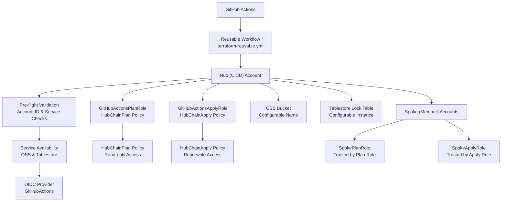
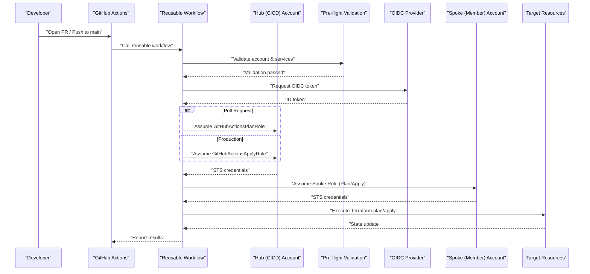
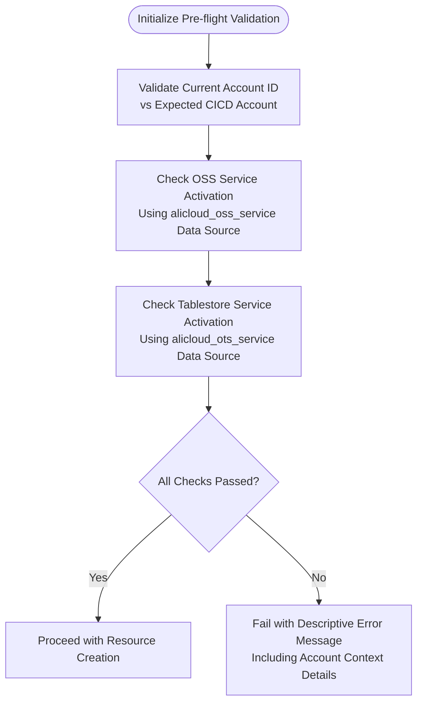
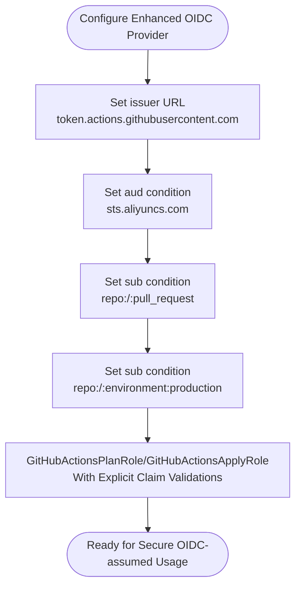
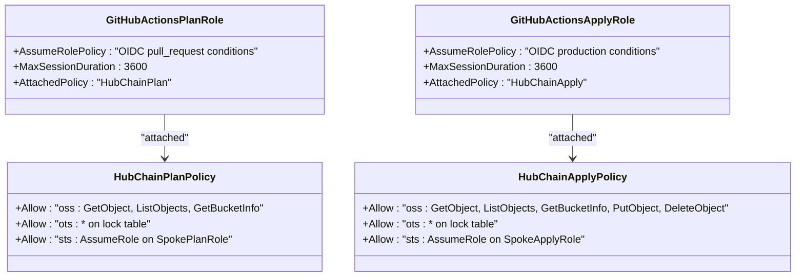
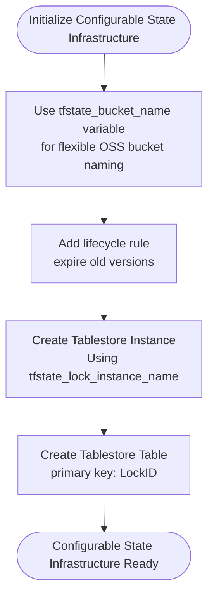
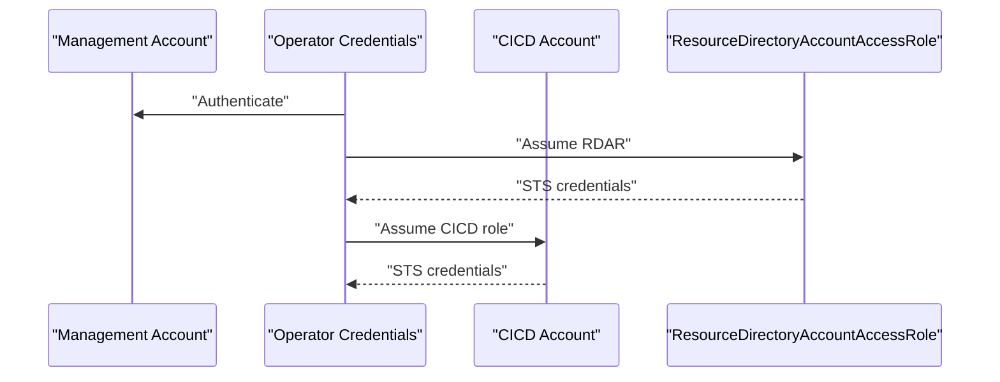
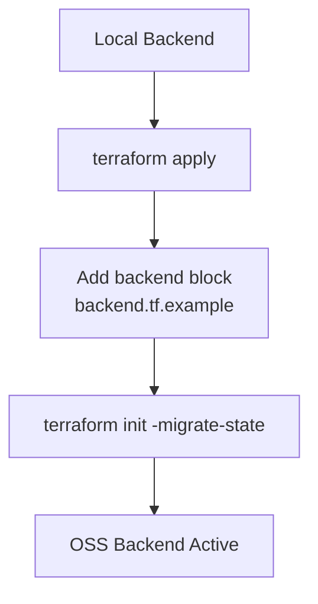
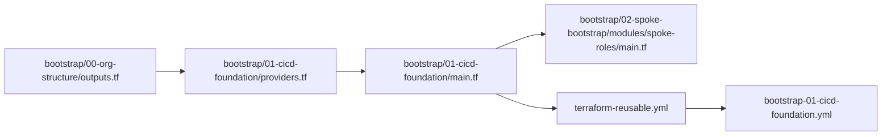

# CI/CD Foundation

<cite>
**Referenced Files in This Document**
- [README.md](file://README.md)
- [bootstrap/01-cicd-foundation/main.tf](file://bootstrap/01-cicd-foundation/main.tf)
- [bootstrap/01-cicd-foundation/variables.tf](file://bootstrap/01-cicd-foundation/variables.tf)
- [bootstrap/01-cicd-foundation/providers.tf](file://bootstrap/01-cicd-foundation/providers.tf)
- [bootstrap/01-cicd-foundation/backend.tf.example](file://bootstrap/01-cicd-foundation/backend.tf.example)
- [bootstrap/01-cicd-foundation/outputs.tf](file://bootstrap/01-cicd-foundation/outputs.tf)
- [bootstrap/01-cicd-foundation/versions.tf](file://bootstrap/01-cicd-foundation/versions.tf)
- [bootstrap/01-cicd-foundation/prod.tfvars](file://bootstrap/01-cicd-foundation/prod.tfvars)
- [.github/workflows/bootstrap-01-cicd-foundation.yml](file://.github/workflows/bootstrap-01-cicd-foundation.yml)
- [.github/workflows/terraform-reusable.yml](file://.github/workflows/terraform-reusable.yml)
- [bootstrap/02-spoke-bootstrap/modules/spoke-roles/main.tf](file://bootstrap/02-spoke-bootstrap/modules/spoke-roles/main.tf)
- [bootstrap/02-spoke-bootstrap/modules/spoke-roles/variables.tf](file://bootstrap/02-spoke-bootstrap/modules/spoke-roles/variables.tf)
- [bootstrap/02-spoke-bootstrap/modules/spoke-roles/outputs.tf](file://bootstrap/02-spoke-bootstrap/modules/spoke-roles/outputs.tf)
- [bootstrap/00-org-structure/outputs.tf](file://bootstrap/00-org-structure/outputs.tf)
</cite>

## Update Summary
**Changes Made**
- Added comprehensive pre-flight validation system with account ID verification and service activation checks for OSS and Tablestore
- Implemented least-privilege role architecture with separate GitHubActionsPlanRole and GitHubActionsApplyRole roles
- Created distinct HubChainPlan (read-only) and HubChainApply (read-write) policies with proper separation of concerns
- Enhanced OIDC security controls with explicit audience, issuer, and subject claim validations
- Introduced production variable template (prod.tfvars) with configurable state infrastructure naming
- Added enhanced outputs including current_account_id for validation and debugging
- Updated state infrastructure with proper dependency declarations on service availability

## Table of Contents
1. [Introduction](#introduction)
2. [Project Structure](#project-structure)
3. [Core Components](#core-components)
4. [Architecture Overview](#architecture-overview)
5. [Detailed Component Analysis](#detailed-component-analysis)
6. [Dependency Analysis](#dependency-analysis)
7. [Performance Considerations](#performance-considerations)
8. [Troubleshooting Guide](#troubleshooting-guide)
9. [Conclusion](#conclusion)
10. [Appendices](#appendices)

## Introduction
This document explains the CI/CD foundation bootstrap phase that establishes secure credential management and state infrastructure for Alibaba Cloud Landing Zone deployments using GitHub Actions and OIDC. The implementation now includes comprehensive pre-flight validation, separated least-privilege roles, and enhanced security controls:
- **Comprehensive pre-flight validation**: Account ID verification and service activation checks before resource creation
- **Enhanced OIDC provider configuration**: Strengthened security controls with explicit audience, issuer, and subject claim validations
- **Separated hub roles**: Distinct GitHubActionsPlanRole (read-only) and GitHubActionsApplyRole (read-write) with separate policies
- **Configurable state infrastructure**: Flexible OSS bucket naming and Tablestore instance configuration
- **Production-ready templates**: Pre-configured prod.tfvars for streamlined deployment
- Provider configuration for multi-account operations with enhanced security
- Security implications of least-privilege roles and comprehensive validation
- Backend configuration examples, variable definitions, and troubleshooting guidance
- State migration procedures and backend initialization steps

## Project Structure
The CI/CD foundation is implemented in a dedicated bootstrap module with enhanced security controls and comprehensive validation, orchestrated by GitHub Actions reusable workflows:
- bootstrap/01-cicd-foundation: Creates OIDC provider, separate hub roles with distinct policies, configurable state infrastructure, and comprehensive pre-flight validation
- bootstrap/02-spoke-bootstrap/modules/spoke-roles: Defines spoke roles in member accounts that trust hub roles
- .github/workflows: Reusable workflow that performs Terraform plan/apply using OIDC-assumed roles with environment-based role selection

```mermaid
graph TB
GH["GitHub Actions"] --> WF["Reusable Workflow<br/>terraform-reusable.yml"]
WF --> HUB["Hub (CICD) Account"]
HUB --> PRECHECK["Pre-flight Validation<br/>Account ID & Service Checks"]
PRECHECK --> VALIDATION["Service Availability<br/>OSS & Tablestore"]
VALIDATION --> OIDC["OIDC Provider<br/>GitHubActions"]
HUB --> PLAN["GitHubActionsPlanRole<br/>HubChainPlan Policy"]
HUB --> APPLY["GitHubActionsApplyRole<br/>HubChainApply Policy"]
PLAN --> PLANPOLICY["HubChainPlan Policy<br/>Read-only Access"]
APPLY --> APPOLICY["HubChainApply Policy<br/>Read-write Access"]
HUB --> STATE["OSS Bucket<br/>Configurable Name"]
HUB --> LOCK["Tablestore Lock Table<br/>Configurable Instance"]
HUB --> SPOKE["Spoke (Member) Accounts"]
SPOKE --> SPLAN["SpokePlanRole<br/>Trusted by Plan Role"]
SPOKE --> SAPPLY["SpokeApplyRole<br/>Trusted by Apply Role"]
```

**Diagram sources**
- [.github/workflows/terraform-reusable.yml:1-118](file://.github/workflows/terraform-reusable.yml#L1-L118)
- [bootstrap/01-cicd-foundation/main.tf:7-22](file://bootstrap/01-cicd-foundation/main.tf#L7-L22)
- [bootstrap/01-cicd-foundation/main.tf:88-130](file://bootstrap/01-cicd-foundation/main.tf#L88-L130)
- [bootstrap/01-cicd-foundation/main.tf:138-196](file://bootstrap/01-cicd-foundation/main.tf#L138-L196)
- [bootstrap/02-spoke-bootstrap/modules/spoke-roles/main.tf:3-41](file://bootstrap/02-spoke-bootstrap/modules/spoke-roles/main.tf#L3-L41)

**Section sources**
- [README.md:141-165](file://README.md#L141-L165)
- [bootstrap/01-cicd-foundation/main.tf:1-197](file://bootstrap/01-cicd-foundation/main.tf#L1-L197)
- [bootstrap/01-cicd-foundation/variables.tf:1-27](file://bootstrap/01-cicd-foundation/variables.tf#L1-L27)
- [bootstrap/01-cicd-foundation/providers.tf:1-22](file://bootstrap/01-cicd-foundation/providers.tf#L1-L22)
- [.github/workflows/bootstrap-01-cicd-foundation.yml:1-36](file://.github/workflows/bootstrap-01-cicd-foundation.yml#L1-L36)
- [.github/workflows/terraform-reusable.yml:1-118](file://.github/workflows/terraform-reusable.yml#L1-L118)
- [bootstrap/02-spoke-bootstrap/modules/spoke-roles/main.tf:1-42](file://bootstrap/02-spoke-bootstrap/modules/spoke-roles/main.tf#L1-L42)

## Core Components
- **Comprehensive Pre-flight Validation**: Multi-layered security checks including account ID verification and service activation validation before any resource creation
- **Enhanced OIDC Provider**: Establishes trust between GitHub Actions and Alibaba Cloud with strengthened security conditions, enabling short-lived STS tokens without long-lived credentials
- **Separated Hub Roles Architecture**: Distinct GitHubActionsPlanRole (read-only) and GitHubActionsApplyRole (read-write) with separate least-privilege policies implementing proper separation of concerns
- **Configurable State Infrastructure**: Flexible OSS bucket naming via tfstate_bucket_name variable and Tablestore instance configuration via tfstate_lock_instance_name variable
- **Provider Configuration**: Multi-account chaining from management account to CICD account using ResourceDirectoryAccountAccessRole
- **Enhanced Outputs**: Exposes ARNs, identifiers, and current account information needed by GitHub Actions workflows
- **Production Templates**: Pre-configured prod.tfvars for streamlined deployment with proper naming conventions

Key implementation references:
- Pre-flight validation and service checks: [bootstrap/01-cicd-foundation/main.tf:7-22](file://bootstrap/01-cicd-foundation/main.tf#L7-L22)
- Enhanced OIDC provider with strengthened conditions: [bootstrap/01-cicd-foundation/main.tf:75-82](file://bootstrap/01-cicd-foundation/main.tf#L75-L82)
- Separate hub roles (GitHubActionsPlanRole vs GitHubActionsApplyRole): [bootstrap/01-cicd-foundation/main.tf:88-130](file://bootstrap/01-cicd-foundation/main.tf#L88-L130)
- Distinct policies (HubChainPlan vs HubChainApply): [bootstrap/01-cicd-foundation/main.tf:138-196](file://bootstrap/01-cicd-foundation/main.tf#L138-L196)
- Configurable state infrastructure: [bootstrap/01-cicd-foundation/main.tf:28-69](file://bootstrap/01-cicd-foundation/main.tf#L28-L69)
- Provider chaining: [bootstrap/01-cicd-foundation/providers.tf:14-21](file://bootstrap/01-cicd-foundation/providers.tf#L14-L21)
- Enhanced outputs including current account: [bootstrap/01-cicd-foundation/outputs.tf:1-30](file://bootstrap/01-cicd-foundation/outputs.tf#L1-L30)

**Section sources**
- [bootstrap/01-cicd-foundation/main.tf:7-22](file://bootstrap/01-cicd-foundation/main.tf#L7-L22)
- [bootstrap/01-cicd-foundation/main.tf:75-82](file://bootstrap/01-cicd-foundation/main.tf#L75-L82)
- [bootstrap/01-cicd-foundation/main.tf:88-130](file://bootstrap/01-cicd-foundation/main.tf#L88-L130)
- [bootstrap/01-cicd-foundation/main.tf:138-196](file://bootstrap/01-cicd-foundation/main.tf#L138-L196)
- [bootstrap/01-cicd-foundation/main.tf:28-69](file://bootstrap/01-cicd-foundation/main.tf#L28-L69)
- [bootstrap/01-cicd-foundation/providers.tf:14-21](file://bootstrap/01-cicd-foundation/providers.tf#L14-L21)
- [bootstrap/01-cicd-foundation/outputs.tf:1-30](file://bootstrap/01-cicd-foundation/outputs.tf#L1-L30)

## Architecture Overview
The CI/CD foundation enforces a strict security model with comprehensive pre-flight validation and separated least-privilege policies:
- **Multi-layered Pre-flight Security**: Validates account context and service availability before any resource creation
- No long-lived credentials: GitHub OIDC tokens are exchanged for short-lived STS tokens at runtime with strengthened conditions
- **Separated least-privilege policies**: GitHubActionsPlanRole uses HubChainPlan policy (read-only); GitHubActionsApplyRole uses HubChainApply policy (read-write)
- Account isolation: Each spoke account has its own roles; compromising one does not affect others
- Encrypted state: OSS bucket uses KMS server-side encryption with configurable naming
- Distributed locking: Tablestore prevents concurrent applies with configurable instance naming
- Environment-based role selection: Pull requests use plan role, production environments use apply role

```mermaid
sequenceDiagram
participant Dev as "Developer"
participant GH as "GitHub Actions"
participant WF as "Reusable Workflow"
participant Hub as "Hub (CICD) Account"
participant PreCheck as "Pre-flight Validation"
participant OIDC as "OIDC Provider"
participant Spoke as "Spoke (Member) Account"
participant Res as "Target Resources"
Dev->>GH : "Open PR / Push to main"
GH->>WF : "Call reusable workflow"
WF->>PreCheck : "Validate account & services"
PreCheck-->>WF : "Validation passed"
WF->>OIDC : "Request OIDC token"
OIDC-->>WF : "ID token"
alt Pull Request
WF->>Hub : "Assume GitHubActionsPlanRole"
else Production
WF->>Hub : "Assume GitHubActionsApplyRole"
end
Hub-->>WF : "STS credentials"
WF->>Spoke : "Assume Spoke Role (Plan/Apply)"
Spoke-->>WF : "STS credentials"
WF->>Res : "Execute Terraform plan/apply"
Res-->>WF : "State update"
WF-->>GH : "Report results"
```

**Diagram sources**
- [.github/workflows/bootstrap-01-cicd-foundation.yml:18-36](file://.github/workflows/bootstrap-01-cicd-foundation.yml#L18-L36)
- [.github/workflows/terraform-reusable.yml:50-56](file://.github/workflows/terraform-reusable.yml#L50-L56)
- [bootstrap/01-cicd-foundation/main.tf:7-22](file://bootstrap/01-cicd-foundation/main.tf#L7-L22)
- [bootstrap/01-cicd-foundation/main.tf:88-130](file://bootstrap/01-cicd-foundation/main.tf#L88-L130)
- [bootstrap/02-spoke-bootstrap/modules/spoke-roles/main.tf:3-41](file://bootstrap/02-spoke-bootstrap/modules/spoke-roles/main.tf#L3-L41)

**Section sources**
- [README.md:106-113](file://README.md#L106-L113)
- [.github/workflows/terraform-reusable.yml:50-56](file://.github/workflows/terraform-reusable.yml#L50-L56)
- [bootstrap/01-cicd-foundation/main.tf:7-22](file://bootstrap/01-cicd-foundation/main.tf#L7-L22)
- [bootstrap/01-cicd-foundation/main.tf:88-130](file://bootstrap/01-cicd-foundation/main.tf#L88-L130)
- [bootstrap/02-spoke-bootstrap/modules/spoke-roles/main.tf:3-41](file://bootstrap/02-spoke-bootstrap/modules/spoke-roles/main.tf#L3-L41)

## Detailed Component Analysis

### Comprehensive Pre-flight Validation System
The CI/CD foundation now includes comprehensive pre-flight validation checks that provide critical safety guarantees across multiple layers:
- **Account ID Validation**: Ensures Terraform runs in the correct CICD account context using lifecycle precondition with descriptive error messages
- **OSS Service Activation Check**: Verifies OSS service is enabled before creating buckets using alicloud_oss_service data source
- **Tablestore Service Activation Check**: Ensures Tablestore service is available for distributed locking using alicloud_ots_service data source
- **Service Dependency Management**: Uses depends_on to ensure proper resource ordering and service availability

Implementation highlights:
- Account validation with lifecycle precondition: [bootstrap/01-cicd-foundation/main.tf:7-14](file://bootstrap/01-cicd-foundation/main.tf#L7-L14)
- OSS service activation check: [bootstrap/01-cicd-foundation/main.tf:16-18](file://bootstrap/01-cicd-foundation/main.tf#L16-L18)
- Tablestore service activation check: [bootstrap/01-cicd-foundation/main.tf:20-22](file://bootstrap/01-cicd-foundation/main.tf#L20-L22)
- State bucket dependency on OSS service: [bootstrap/01-cicd-foundation/main.tf:33](file://bootstrap/01-cicd-foundation/main.tf#L33)
- Tablestore instance dependency on service: [bootstrap/01-cicd-foundation/main.tf:55](file://bootstrap/01-cicd-foundation/main.tf#L55)

```mermaid
flowchart TD
Start(["Initialize Pre-flight Validation"]) --> AccountCheck["Validate Current Account ID<br/>vs Expected CICD Account"]
AccountCheck --> OSSCheck["Check OSS Service Activation<br/>Using alicloud_oss_service Data Source"]
OSSCheck --> OTSCheck["Check Tablestore Service Activation<br/>Using alicloud_ots_service Data Source"]
OTSCheck --> Success{"All Checks Passed?"}
Success --> |Yes| Proceed["Proceed with Resource Creation"]
Success --> |No| Fail["Fail with Descriptive Error Message<br/>Including Account Context Details"]
```

**Diagram sources**
- [bootstrap/01-cicd-foundation/main.tf:7-14](file://bootstrap/01-cicd-foundation/main.tf#L7-L14)
- [bootstrap/01-cicd-foundation/main.tf:16-22](file://bootstrap/01-cicd-foundation/main.tf#L16-L22)

**Section sources**
- [bootstrap/01-cicd-foundation/main.tf:7-14](file://bootstrap/01-cicd-foundation/main.tf#L7-L14)
- [bootstrap/01-cicd-foundation/main.tf:16-22](file://bootstrap/01-cicd-foundation/main.tf#L16-L22)

### Enhanced OIDC Provider Configuration with Strengthened Security Controls
The OIDC provider enables GitHub Actions to assume hub roles securely with enhanced security controls and explicit claim validations:
- Provider name and issuer URL configured for GitHub Actions with explicit audience validation
- Strengthened conditions restrict token usage with explicit audience, issuer, and subject claim validations
- Client IDs define trusted audiences with sts.aliyuncs.com requirement
- Conditions scope role assumption to specific GitHub contexts with enhanced security controls

Implementation highlights:
- OIDC provider resource with strengthened conditions: [bootstrap/01-cicd-foundation/main.tf:75-82](file://bootstrap/01-cicd-foundation/main.tf#L75-L82)
- GitHubActionsPlanRole with pull_request conditions: [bootstrap/01-cicd-foundation/main.tf:88-108](file://bootstrap/01-cicd-foundation/main.tf#L88-L108)
- GitHubActionsApplyRole with production environment conditions: [bootstrap/01-cicd-foundation/main.tf:110-130](file://bootstrap/01-cicd-foundation/main.tf#L110-L130)

```mermaid
flowchart TD
Start(["Configure Enhanced OIDC Provider"]) --> Issuer["Set issuer URL<br/>token.actions.githubusercontent.com"]
Issuer --> Audience["Set aud condition<br/>sts.aliyuncs.com"]
Audience --> Repo["Set sub condition<br/>repo:<org>/<repo>:pull_request"]
Repo --> Prod["Set sub condition<br/>repo:<org>/<repo>:environment:production"]
Prod --> Roles["GitHubActionsPlanRole/GitHubActionsApplyRole<br/>With Explicit Claim Validations"]
Roles --> End(["Ready for Secure OIDC-assumed Usage"])
```

**Diagram sources**
- [bootstrap/01-cicd-foundation/main.tf:75-82](file://bootstrap/01-cicd-foundation/main.tf#L75-L82)
- [bootstrap/01-cicd-foundation/main.tf:88-130](file://bootstrap/01-cicd-foundation/main.tf#L88-L130)

**Section sources**
- [bootstrap/01-cicd-foundation/main.tf:75-82](file://bootstrap/01-cicd-foundation/main.tf#L75-L82)
- [bootstrap/01-cicd-foundation/main.tf:88-130](file://bootstrap/01-cicd-foundation/main.tf#L88-L130)

### Least-Privilege Role Architecture with Separated Policies
Two separate hub roles provide enhanced least-privilege access control with clear separation of concerns:
- **GitHubActionsPlanRole**: Read-only access for PR plans with HubChainPlan policy (GetObject, ListObjects, GetBucketInfo only)
- **GitHubActionsApplyRole**: Full read-write access for production apply with HubChainApply policy (adds PutObject, DeleteObject capabilities)

Policy differences and security benefits:
- Plan role is restricted to pull_request context with limited OSS permissions preventing accidental modifications during planning
- Apply role is restricted to production environment with full OSS permissions and required reviewers
- Both roles allow `ots:*` for distributed locking and `sts:AssumeRole` on appropriate spoke roles
- Clear audit trail for distinguishing between planning and applying activities through separate roles and policies

Implementation highlights:
- GitHubActionsPlanRole definition: [bootstrap/01-cicd-foundation/main.tf:88-108](file://bootstrap/01-cicd-foundation/main.tf#L88-L108)
- GitHubActionsApplyRole definition: [bootstrap/01-cicd-foundation/main.tf:110-130](file://bootstrap/01-cicd-foundation/main.tf#L110-L130)
- HubChainPlan policy definition: [bootstrap/01-cicd-foundation/main.tf:138-160](file://bootstrap/01-cicd-foundation/main.tf#L138-L160)
- HubChainApply policy definition: [bootstrap/01-cicd-foundation/main.tf:162-184](file://bootstrap/01-cicd-foundation/main.tf#L162-L184)
- Policy attachments: [bootstrap/01-cicd-foundation/main.tf:186-196](file://bootstrap/01-cicd-foundation/main.tf#L186-L196)

```mermaid
classDiagram
class GitHubActionsPlanRole {
+AssumeRolePolicy : "OIDC pull_request conditions"
+MaxSessionDuration : 3600
+AttachedPolicy : "HubChainPlan"
}
class GitHubActionsApplyRole {
+AssumeRolePolicy : "OIDC production conditions"
+MaxSessionDuration : 3600
+AttachedPolicy : "HubChainApply"
}
class HubChainPlanPolicy {
+Allow : "oss : GetObject, ListObjects, GetBucketInfo"
+Allow : "ots : * on lock table"
+Allow : "sts : AssumeRole on SpokePlanRole"
}
class HubChainApplyPolicy {
+Allow : "oss : GetObject, ListObjects, GetBucketInfo, PutObject, DeleteObject"
+Allow : "ots : * on lock table"
+Allow : "sts : AssumeRole on SpokeApplyRole"
}
GitHubActionsPlanRole --> HubChainPlanPolicy : "attached"
GitHubActionsApplyRole --> HubChainApplyPolicy : "attached"
```

**Diagram sources**
- [bootstrap/01-cicd-foundation/main.tf:88-196](file://bootstrap/01-cicd-foundation/main.tf#L88-L196)

**Section sources**
- [bootstrap/01-cicd-foundation/main.tf:88-196](file://bootstrap/01-cicd-foundation/main.tf#L88-L196)

### Configurable State Infrastructure Setup
The state infrastructure now supports configurable naming for better organization and management:
- **Configurable OSS Bucket**: Named via `tfstate_bucket_name` variable for flexible naming conventions and better resource organization
- **Configurable Tablestore Instance**: Named via `tfstate_lock_instance_name` variable with default value for consistent naming patterns
- Enhanced versioning and lifecycle management remains unchanged with proper service dependencies

Implementation highlights:
- Configurable bucket naming: [bootstrap/01-cicd-foundation/main.tf:28-34](file://bootstrap/01-cicd-foundation/main.tf#L28-34)
- Configurable Tablestore instance: [bootstrap/01-cicd-foundation/main.tf:54-58](file://bootstrap/01-cicd-foundation/main.tf#L54-58)
- Variable definitions: [bootstrap/01-cicd-foundation/variables.tf:12-21](file://bootstrap/01-cicd-foundation/variables.tf#L12-21)
- Production template: [bootstrap/01-cicd-foundation/prod.tfvars:8-10](file://bootstrap/01-cicd-foundation/prod.tfvars#L8-10)

```mermaid
flowchart TD
Start(["Initialize Configurable State Infrastructure"]) --> BucketName["Use tfstate_bucket_name variable<br/>for flexible OSS bucket naming"]
BucketName --> Lifecycle["Add lifecycle rule<br/>expire old versions"]
Lifecycle --> OTSInstance["Create Tablestore Instance<br/>Using tfstate_lock_instance_name"]
OTSInstance --> OTSTable["Create Tablestore Table<br/>primary key: LockID"]
OTSTable --> Ready(["Configurable State Infrastructure Ready"])
```

**Diagram sources**
- [bootstrap/01-cicd-foundation/main.tf:28-69](file://bootstrap/01-cicd-foundation/main.tf#L28-L69)
- [bootstrap/01-cicd-foundation/variables.tf:12-21](file://bootstrap/01-cicd-foundation/variables.tf#L12-21)
- [bootstrap/01-cicd-foundation/prod.tfvars:8-10](file://bootstrap/01-cicd-foundation/prod.tfvars#L8-10)

**Section sources**
- [bootstrap/01-cicd-foundation/main.tf:28-69](file://bootstrap/01-cicd-foundation/main.tf#L28-L69)
- [bootstrap/01-cicd-foundation/variables.tf:12-21](file://bootstrap/01-cicd-foundation/variables.tf#L12-21)
- [bootstrap/01-cicd-foundation/prod.tfvars:8-10](file://bootstrap/01-cicd-foundation/prod.tfvars#L8-10)

### Provider Configuration for Multi-Account Operations
Multi-account operations are achieved by chaining providers with enhanced security:
- Management account provider (operator credentials)
- CICD account provider chained via ResourceDirectoryAccountAccessRole

Implementation highlights:
- Management provider: [bootstrap/01-cicd-foundation/providers.tf:8-11](file://bootstrap/01-cicd-foundation/providers.tf#L8-11)
- CICD provider with assume_role: [bootstrap/01-cicd-foundation/providers.tf:14-21](file://bootstrap/01-cicd-foundation/providers.tf#L14-21)
- Variables consumed by providers: [bootstrap/01-cicd-foundation/variables.tf:1-27](file://bootstrap/01-cicd-foundation/variables.tf#L1-27)

```mermaid
sequenceDiagram
participant Mgmt as "Management Account"
participant Creds as "Operator Credentials"
participant CICD as "CICD Account"
participant RDAR as "ResourceDirectoryAccountAccessRole"
Creds->>Mgmt : "Authenticate"
Creds->>RDAR : "Assume RDAR"
RDAR-->>Creds : "STS credentials"
Creds->>CICD : "Assume CICD role"
CICD-->>Creds : "STS credentials"
```

**Diagram sources**
- [bootstrap/01-cicd-foundation/providers.tf:8-21](file://bootstrap/01-cicd-foundation/providers.tf#L8-21)
- [bootstrap/01-cicd-foundation/variables.tf:7-10](file://bootstrap/01-cicd-foundation/variables.tf#L7-10)

**Section sources**
- [bootstrap/01-cicd-foundation/providers.tf:8-21](file://bootstrap/01-cicd-foundation/providers.tf#L8-21)
- [bootstrap/01-cicd-foundation/variables.tf:7-10](file://bootstrap/01-cicd-foundation/variables.tf#L7-10)

### Enhanced Security Implications of Separated Least-Privilege Roles
The enhanced security model provides stronger isolation through separated policies and comprehensive validation:
- **Pre-flight validation**: Prevents accidental execution in wrong account context with descriptive error messages
- **Separated policies**: HubChainPlan vs HubChainApply provide clear separation of concerns and audit trails
- GitHubActionsPlanRole is read-only and scoped to pull_request context with limited OSS permissions
- GitHubActionsApplyRole is read-write and restricted to production environment with full OSS permissions
- Spoke roles enforce account isolation and minimal permissions
- Encrypted state and distributed locking protect against unauthorized changes
- **Strengthened OIDC conditions**: More restrictive token validation with explicit audience, issuer, and subject claim checks

Implementation references:
- Pre-flight validation: [bootstrap/01-cicd-foundation/main.tf:7-22](file://bootstrap/01-cicd-foundation/main.tf#L7-L22)
- Separate hub roles and policies: [bootstrap/01-cicd-foundation/main.tf:88-196](file://bootstrap/01-cicd-foundation/main.tf#L88-L196)
- Spoke roles (plan/apply): [bootstrap/02-spoke-bootstrap/modules/spoke-roles/main.tf:3-41](file://bootstrap/02-spoke-bootstrap/modules/spoke-roles/main.tf#L3-L41)
- Security model summary: [README.md:106-113](file://README.md#L106-L113)

**Section sources**
- [bootstrap/01-cicd-foundation/main.tf:7-22](file://bootstrap/01-cicd-foundation/main.tf#L7-L22)
- [bootstrap/01-cicd-foundation/main.tf:88-196](file://bootstrap/01-cicd-foundation/main.tf#L88-L196)
- [bootstrap/02-spoke-bootstrap/modules/spoke-roles/main.tf:3-41](file://bootstrap/02-spoke-bootstrap/modules/spoke-roles/main.tf#L3-L41)
- [README.md:106-113](file://README.md#L106-L113)

### Backend Configuration and State Migration
- backend.tf.example demonstrates OSS backend configuration with Tablestore endpoint and table
- Initial versions.tf omits backend block; state is migrated after apply
- Migration requires obtaining STS credentials via ResourceDirectoryAccountAccessRole

Implementation highlights:
- Backend example: [bootstrap/01-cicd-foundation/backend.tf.example:13-22](file://bootstrap/01-cicd-foundation/backend.tf.example#L13-22)
- Migration instructions: [bootstrap/01-cicd-foundation/backend.tf.example:4-11](file://bootstrap/01-cicd-foundation/backend.tf.example#L4-11)
- Versions without backend: [bootstrap/01-cicd-foundation/versions.tf:9-11](file://bootstrap/01-cicd-foundation/versions.tf#L9-11)

```mermaid
flowchart TD
Local["Local Backend"] --> Apply["terraform apply"]
Apply --> AddBackend["Add backend block<br/>backend.tf.example"]
AddBackend --> Migrate["terraform init -migrate-state"]
Migrate --> OSS["OSS Backend Active"]
```

**Diagram sources**
- [bootstrap/01-cicd-foundation/backend.tf.example:13-22](file://bootstrap/01-cicd-foundation/backend.tf.example#L13-22)
- [bootstrap/01-cicd-foundation/backend.tf.example:4-11](file://bootstrap/01-cicd-foundation/backend.tf.example#L4-11)
- [bootstrap/01-cicd-foundation/versions.tf:9-11](file://bootstrap/01-cicd-foundation/versions.tf#L9-11)

**Section sources**
- [bootstrap/01-cicd-foundation/backend.tf.example:13-22](file://bootstrap/01-cicd-foundation/backend.tf.example#L13-22)
- [bootstrap/01-cicd-foundation/backend.tf.example:4-11](file://bootstrap/01-cicd-foundation/backend.tf.example#L4-11)
- [bootstrap/01-cicd-foundation/versions.tf:9-11](file://bootstrap/01-cicd-foundation/versions.tf#L9-11)

## Dependency Analysis
The CI/CD foundation depends on:
- bootstrap/01-cicd-foundation: Provides OIDC provider, separate hub roles with distinct policies, configurable state infrastructure, and comprehensive pre-flight validation
- bootstrap/02-spoke-bootstrap/modules/spoke-roles: Provides spoke roles that trust hub roles
- .github/workflows/terraform-reusable.yml: Orchestrates OIDC-based credential configuration and Terraform operations
- bootstrap/00-org-structure/outputs.tf: Supplies account IDs for provider configuration

```mermaid
graph LR
Org["bootstrap/00-org-structure/outputs.tf"] --> Providers["bootstrap/01-cicd-foundation/providers.tf"]
Providers --> CICD["bootstrap/01-cicd-foundation/main.tf"]
CICD --> Spoke["bootstrap/02-spoke-bootstrap/modules/spoke-roles/main.tf"]
CICD --> WF["terraform-reusable.yml"]
WF --> GH["bootstrap-01-cicd-foundation.yml"]
```

**Diagram sources**
- [bootstrap/00-org-structure/outputs.tf:15-19](file://bootstrap/00-org-structure/outputs.tf#L15-19)
- [bootstrap/01-cicd-foundation/providers.tf:8-21](file://bootstrap/01-cicd-foundation/providers.tf#L8-21)
- [bootstrap/01-cicd-foundation/main.tf:75-196](file://bootstrap/01-cicd-foundation/main.tf#L75-L196)
- [bootstrap/02-spoke-bootstrap/modules/spoke-roles/main.tf:3-41](file://bootstrap/02-spoke-bootstrap/modules/spoke-roles/main.tf#L3-L41)
- [.github/workflows/terraform-reusable.yml:50-56](file://.github/workflows/terraform-reusable.yml#L50-L56)
- [.github/workflows/bootstrap-01-cicd-foundation.yml:18-36](file://.github/workflows/bootstrap-01-cicd-foundation.yml#L18-L36)

**Section sources**
- [bootstrap/00-org-structure/outputs.tf:15-19](file://bootstrap/00-org-structure/outputs.tf#L15-19)
- [bootstrap/01-cicd-foundation/providers.tf:8-21](file://bootstrap/01-cicd-foundation/providers.tf#L8-21)
- [bootstrap/01-cicd-foundation/main.tf:75-196](file://bootstrap/01-cicd-foundation/main.tf#L75-L196)
- [bootstrap/02-spoke-bootstrap/modules/spoke-roles/main.tf:3-41](file://bootstrap/02-spoke-bootstrap/modules/spoke-roles/main.tf#L3-L41)
- [.github/workflows/terraform-reusable.yml:50-56](file://.github/workflows/terraform-reusable.yml#L50-L56)
- [.github/workflows/bootstrap-01-cicd-foundation.yml:18-36](file://.github/workflows/bootstrap-01-cicd-foundation.yml#L18-L36)

## Performance Considerations
- OIDC token exchange is fast and avoids long-lived credentials
- **Pre-flight validation adds minimal overhead while providing critical safety checks**
- OSS state backend provides efficient state retrieval and updates
- Tablestore distributed locking minimizes contention under moderate concurrency
- Using capacity Tablestore instance reduces cost while maintaining reliability
- **Configurable naming allows for better resource organization and management**
- **Separate roles reduce permission evaluation overhead by limiting scope**

[No sources needed since this section provides general guidance]

## Troubleshooting Guide
Common issues and resolutions during CI/CD foundation bootstrap with enhanced security controls:

- **Pre-flight validation failures**
  - Verify current account matches expected CICD account ID
  - Ensure you have assumed role into the correct account before running Terraform
  - Check error message for specific account mismatch details
  - Reference: [bootstrap/01-cicd-foundation/main.tf:7-14](file://bootstrap/01-cicd-foundation/main.tf#L7-L14)

- **Service activation errors**
  - Ensure OSS and Tablestore services are enabled in the target account
  - Check that alicloud_oss_service and alicloud_ots_service data sources return successfully
  - Verify service dependencies are properly declared
  - Reference: [bootstrap/01-cicd-foundation/main.tf:16-22](file://bootstrap/01-cicd-foundation/main.tf#L16-L22)

- **OIDC token exchange failures**
  - Verify OIDC provider ARN and hub role ARNs are set in repository variables
  - Confirm GitHub Actions permissions include id-token: write
  - Ensure conditions match GitHub context (pull_request vs environment:production)
  - Check strengthened OIDC conditions with explicit audience, issuer, and subject claims
  - Reference: [README.md:96-105](file://README.md#L96-105), [.github/workflows/terraform-reusable.yml:33-36](file://.github/workflows/terraform-reusable.yml#L33-36)

- **Role assumption failures**
  - Check GitHubActionsPlanRole and GitHubActionsApplyRole trust policies and strengthened OIDC conditions
  - Validate spoke roles trust hub roles and have appropriate policies attached
  - Verify correct policy attachment (HubChainPlan vs HubChainApply)
  - Reference: [bootstrap/01-cicd-foundation/main.tf:88-196](file://bootstrap/01-cicd-foundation/main.tf#L88-L196), [bootstrap/02-spoke-bootstrap/modules/spoke-roles/main.tf:3-41](file://bootstrap/02-spoke-bootstrap/modules/spoke-roles/main.tf#L3-L41)

- **State migration errors**
  - Ensure backend block is present before migration
  - Obtain STS credentials using ResourceDirectoryAccountAccessRole before terraform init -migrate-state
  - Reference: [bootstrap/01-cicd-foundation/backend.tf.example:4-11](file://bootstrap/01-cicd-foundation/backend.tf.example#L4-11)

- **Provider configuration issues**
  - Confirm management account credentials and ResourceDirectoryAccountAccessRole availability
  - Verify cicd_account_id variable matches the CICD account ID
  - Reference: [bootstrap/01-cicd-foundation/providers.tf:14-21](file://bootstrap/01-cicd-foundation/providers.tf#L14-L21), [bootstrap/01-cicd-foundation/variables.tf:7-10](file://bootstrap/01-cicd-foundation/variables.tf#L7-10)

- **Configurable naming issues**
  - Verify tfstate_bucket_name variable is properly set
  - Check tfstate_lock_instance_name variable if using custom Tablestore instance name
  - Reference prod.tfvars for proper naming conventions
  - Reference: [bootstrap/01-cicd-foundation/variables.tf:12-21](file://bootstrap/01-cicd-foundation/variables.tf#L12-21), [bootstrap/01-cicd-foundation/prod.tfvars:8-10](file://bootstrap/01-cicd-foundation/prod.tfvars#L8-10)

**Section sources**
- [bootstrap/01-cicd-foundation/main.tf:7-22](file://bootstrap/01-cicd-foundation/main.tf#L7-L22)
- [README.md:96-105](file://README.md#L96-105)
- [.github/workflows/terraform-reusable.yml:33-36](file://.github/workflows/terraform-reusable.yml#L33-36)
- [bootstrap/01-cicd-foundation/backend.tf.example:4-11](file://bootstrap/01-cicd-foundation/backend.tf.example#L4-11)
- [bootstrap/01-cicd-foundation/providers.tf:14-21](file://bootstrap/01-cicd-foundation/providers.tf#L14-L21)
- [bootstrap/01-cicd-foundation/variables.tf:7-10](file://bootstrap/01-cicd-foundation/variables.tf#L7-10)
- [bootstrap/01-cicd-foundation/main.tf:88-196](file://bootstrap/01-cicd-foundation/main.tf#L88-L196)
- [bootstrap/02-spoke-bootstrap/modules/spoke-roles/main.tf:3-41](file://bootstrap/02-spoke-bootstrap/modules/spoke-roles/main.tf#L3-L41)
- [bootstrap/01-cicd-foundation/variables.tf:12-21](file://bootstrap/01-cicd-foundation/variables.tf#L12-21)
- [bootstrap/01-cicd-foundation/prod.tfvars:8-10](file://bootstrap/01-cicd-foundation/prod.tfvars#L8-10)

## Conclusion
The CI/CD foundation bootstrap establishes a secure, least-privilege pipeline for managing Alibaba Cloud resources with GitHub Actions, enhanced with robust security controls and comprehensive validation:
- **Comprehensive pre-flight validation** ensures correct account context and service availability before any resource creation
- Enhanced OIDC provider and separated hub roles enable short-lived, context-aware credentials with distinct least-privilege policies (HubChainPlan vs HubChainApply)
- **Configurable state infrastructure** provides flexible naming for better organization and management
- OSS state bucket with KMS encryption and Tablestore distributed locking ensures safe state management
- Multi-account provider chaining and spoke roles enforce isolation and minimal permissions
- **Strengthened OIDC conditions** provide enhanced security controls with explicit claim validations
- **Production-ready templates** streamline deployment with proper naming conventions
- Clear migration and troubleshooting guidance supports reliable operations

[No sources needed since this section summarizes without analyzing specific files]

## Appendices

### Enhanced Variable Definitions
- region: Alibaba Cloud region (default: cn-hangzhou)
- cicd_account_id: CICD/DevOps member account ID
- **tfstate_bucket_name**: Name of the OSS bucket for Terraform state storage (configurable)
- **tfstate_lock_instance_name**: Name of the Tablestore instance for Terraform state locking (default: tfstate-lock)
- github_org_repo: GitHub organization/repository identifier (e.g., my-org/landing-zone)

Reference: [bootstrap/01-cicd-foundation/variables.tf:1-27](file://bootstrap/01-cicd-foundation/variables.tf#L1-27)

### Production Variable Template
The prod.tfvars file provides pre-configured values for production deployment:
- Properly formatted account IDs and resource names
- Consistent naming conventions following best practices
- Example configuration for quick deployment setup

Reference: [bootstrap/01-cicd-foundation/prod.tfvars:1-13](file://bootstrap/01-cicd-foundation/prod.tfvars#L1-13)

### Backend Configuration Example
- Backend block for OSS with Tablestore endpoint and table
- Prefix and key define state path
- Region and tablestore settings align with state infrastructure

Reference: [bootstrap/01-cicd-foundation/backend.tf.example:13-22](file://bootstrap/01-cicd-foundation/backend.tf.example#L13-22)

### Enhanced Outputs for GitHub Actions
- **current_account_id**: Account ID of the current provider context (should match cicd_account_id)
- tfstate_bucket: OSS bucket name for Terraform state
- tfstate_tablestore_endpoint: Tablestore endpoint for state locking
- oidc_provider_arn: ARN of the GitHub Actions OIDC provider
- **github_plan_role_arn**: ARN of the GitHubActionsPlanRole (hub)
- **github_apply_role_arn**: ARN of the GitHubActionsApplyRole (hub)

Reference: [bootstrap/01-cicd-foundation/outputs.tf:1-30](file://bootstrap/01-cicd-foundation/outputs.tf#L1-30)

### Security Enhancement Summary
- **Comprehensive pre-flight validation**: Prevents execution in wrong account context with descriptive error messages
- **Separated hub roles**: GitHubActionsPlanRole vs GitHubActionsApplyRole with distinct least-privilege policies
- **Enhanced service validation**: Ensures OSS and Tablestore service availability before resource creation using data sources
- **Configurable naming**: Better resource organization and management through flexible variables
- **Strengthened OIDC conditions**: More restrictive token validation with explicit audience, issuer, and subject claim checks
- **Improved error messages**: More descriptive failure reasons for easier troubleshooting
- **Production-ready templates**: Streamlined deployment with proper naming conventions

[No sources needed since this section summarizes security enhancements]