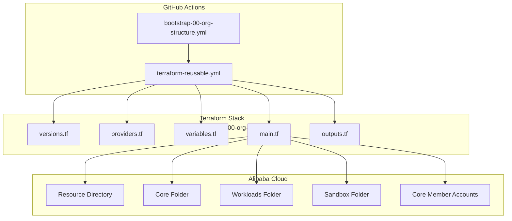
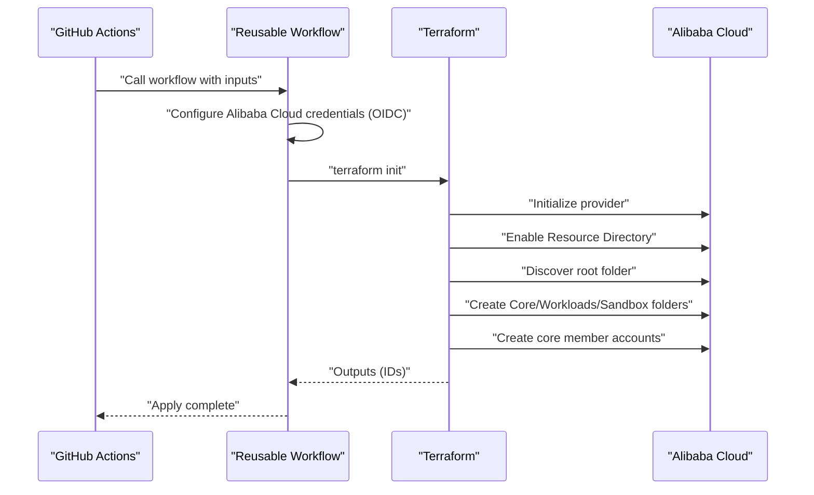
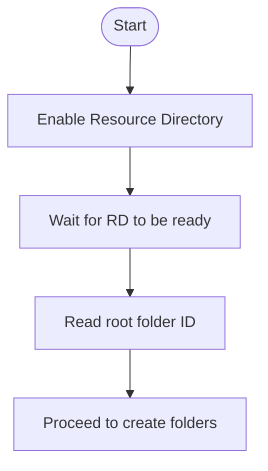
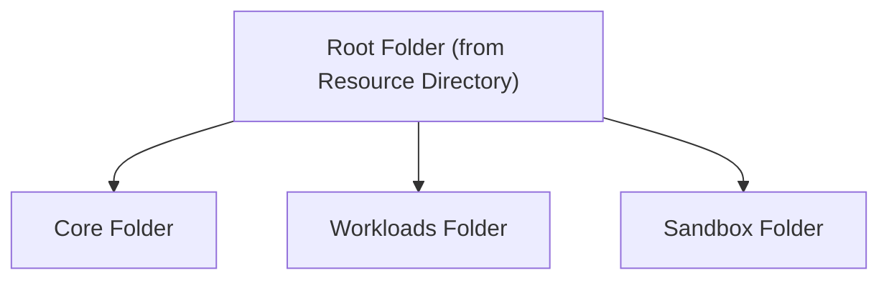
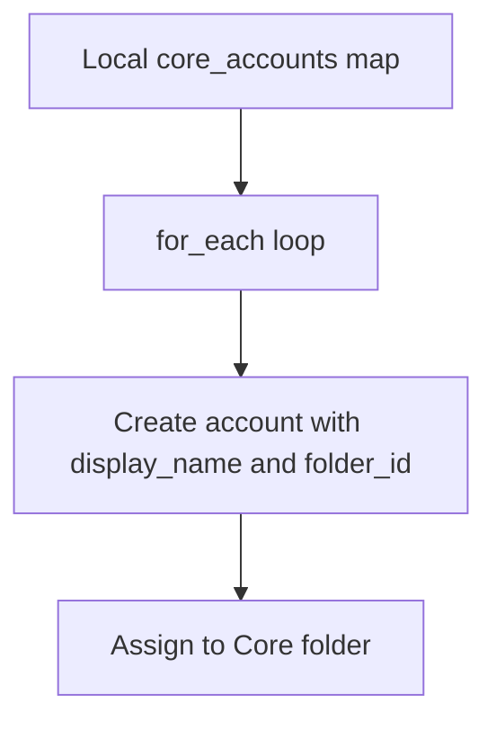
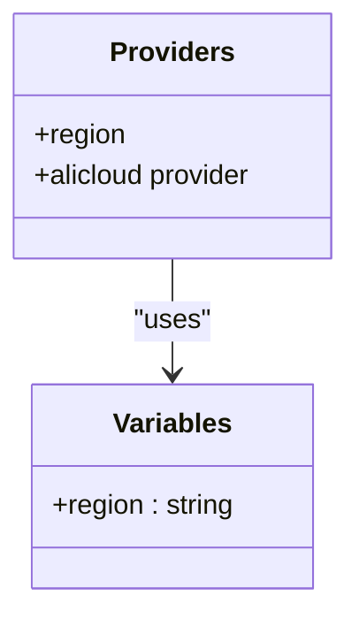
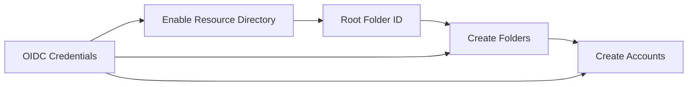

# Organization Structure Setup

<cite>
**Referenced Files in This Document**
- [bootstrap/00-org-structure/main.tf](file://bootstrap/00-org-structure/main.tf)
- [bootstrap/00-org-structure/variables.tf](file://bootstrap/00-org-structure/variables.tf)
- [bootstrap/00-org-structure/providers.tf](file://bootstrap/00-org-structure/providers.tf)
- [bootstrap/00-org-structure/outputs.tf](file://bootstrap/00-org-structure/outputs.tf)
- [bootstrap/00-org-structure/versions.tf](file://bootstrap/00-org-structure/versions.tf)
- [.github/workflows/bootstrap-00-org-structure.yml](file://.github/workflows/bootstrap-00-org-structure.yml)
- [.github/workflows/terraform-reusable.yml](file://.github/workflows/terraform-reusable.yml)
- [README.md](file://README.md)
- [bootstrap/01-cicd-foundation/backend.tf.example](file://bootstrap/01-cicd-foundation/backend.tf.example)
</cite>

## Table of Contents
1. [Introduction](#introduction)
2. [Project Structure](#project-structure)
3. [Core Components](#core-components)
4. [Architecture Overview](#architecture-overview)
5. [Detailed Component Analysis](#detailed-component-analysis)
6. [Dependency Analysis](#dependency-analysis)
7. [Performance Considerations](#performance-considerations)
8. [Troubleshooting Guide](#troubleshooting-guide)
9. [Conclusion](#conclusion)

## Introduction
This document explains the organization structure setup phase of the bootstrap infrastructure. It focuses on enabling the Resource Directory, establishing the folder hierarchy (Core, Workloads, Sandbox), provisioning core member accounts (devops, log-archive, security, network, shared-services), and documenting provider configuration and variables. It also covers idempotency guarantees, folder creation order dependencies, and common issues encountered during Resource Directory enablement and folder creation.

## Project Structure
The organization structure setup is implemented as a Terraform stack under bootstrap/00-org-structure. It is orchestrated by a GitHub Actions workflow that uses OIDC-based authentication to provision resources in Alibaba Cloud without long-lived credentials.

**Diagram sources**
- [.github/workflows/bootstrap-00-org-structure.yml:1-36](file://.github/workflows/bootstrap-00-org-structure.yml#L1-L36)
- [.github/workflows/terraform-reusable.yml:1-118](file://.github/workflows/terraform-reusable.yml#L1-L118)
- [bootstrap/00-org-structure/versions.tf:1-11](file://bootstrap/00-org-structure/versions.tf#L1-L11)
- [bootstrap/00-org-structure/providers.tf:1-6](file://bootstrap/00-org-structure/providers.tf#L1-L6)
- [bootstrap/00-org-structure/variables.tf:1-6](file://bootstrap/00-org-structure/variables.tf#L1-L6)
- [bootstrap/00-org-structure/main.tf:1-49](file://bootstrap/00-org-structure/main.tf#L1-L49)
- [bootstrap/00-org-structure/outputs.tf:1-19](file://bootstrap/00-org-structure/outputs.tf#L1-L19)

**Section sources**
- [README.md:48-57](file://README.md#L48-L57)
- [.github/workflows/bootstrap-00-org-structure.yml:1-36](file://.github/workflows/bootstrap-00-org-structure.yml#L1-L36)
- [.github/workflows/terraform-reusable.yml:1-118](file://.github/workflows/terraform-reusable.yml#L1-L118)
- [bootstrap/00-org-structure/main.tf:1-49](file://bootstrap/00-org-structure/main.tf#L1-L49)

## Core Components
- Resource Directory enablement: Enables Resource Directory on the management account. This operation is idempotent; subsequent runs are no-op if already enabled. Destroying the stack does not disable Resource Directory.
- Root folder discovery: Uses a data source to discover the root folder ID after Resource Directory is enabled.
- Folder hierarchy: Creates three top-level folders under the root folder: Core, Workloads, and Sandbox.
- Core member accounts: Provisions five core member accounts (devops, log-archive, security, network, shared-services) and assigns them to the Core folder.
- Provider configuration: Configures the Alibaba Cloud provider with region and credentials sourced via OIDC.
- Outputs: Exposes root folder ID, folder IDs, and account IDs for downstream use.

**Section sources**
- [bootstrap/00-org-structure/main.tf:1-49](file://bootstrap/00-org-structure/main.tf#L1-L49)
- [bootstrap/00-org-structure/outputs.tf:1-19](file://bootstrap/00-org-structure/outputs.tf#L1-L19)
- [bootstrap/00-org-structure/providers.tf:1-6](file://bootstrap/00-org-structure/providers.tf#L1-L6)
- [bootstrap/00-org-structure/variables.tf:1-6](file://bootstrap/00-org-structure/variables.tf#L1-L6)

## Architecture Overview
The organization structure setup is executed through GitHub Actions using OIDC federation. The reusable workflow configures Alibaba Cloud credentials via OIDC, initializes Terraform, and applies the stack in the management account.

**Diagram sources**
- [.github/workflows/bootstrap-00-org-structure.yml:18-36](file://.github/workflows/bootstrap-00-org-structure.yml#L18-L36)
- [.github/workflows/terraform-reusable.yml:50-118](file://.github/workflows/terraform-reusable.yml#L50-L118)
- [bootstrap/00-org-structure/main.tf:1-49](file://bootstrap/00-org-structure/main.tf#L1-L49)

## Detailed Component Analysis

### Resource Directory Enablement
- Purpose: Ensures Resource Directory is enabled on the management account.
- Idempotency: Subsequent applies are no-op if already enabled. Destroy does not disable Resource Directory.
- Dependencies: A data source reads the Resource Directory immediately after enabling it to ensure the root folder is available for subsequent steps.

**Diagram sources**
- [bootstrap/00-org-structure/main.tf:1-13](file://bootstrap/00-org-structure/main.tf#L1-L13)

**Section sources**
- [bootstrap/00-org-structure/main.tf:1-13](file://bootstrap/00-org-structure/main.tf#L1-L13)
- [README.md:46](file://README.md#L46)

### Folder Hierarchy Creation
- Top-level folders: Core, Workloads, Sandbox are created under the root folder.
- Parent-child relationship: All three folders are children of the root folder discovered from Resource Directory.
- Order dependency: Folders are created in parallel; however, they depend on the root folder ID being available. The data source ensures readiness.

**Diagram sources**
- [bootstrap/00-org-structure/main.tf:15-29](file://bootstrap/00-org-structure/main.tf#L15-L29)

**Section sources**
- [bootstrap/00-org-structure/main.tf:15-29](file://bootstrap/00-org-structure/main.tf#L15-L29)

### Core Member Account Provisioning
- Accounts provisioned: devops, log-archive, security, network, shared-services.
- Assignment: All accounts are placed in the Core folder.
- Naming: Account names are derived from the display name prefix configured per account.
- Scaling: The for_each loop allows easy addition of new core accounts by extending the local map.

**Diagram sources**
- [bootstrap/00-org-structure/main.tf:31-49](file://bootstrap/00-org-structure/main.tf#L31-L49)

**Section sources**
- [bootstrap/00-org-structure/main.tf:31-49](file://bootstrap/00-org-structure/main.tf#L31-L49)

### Provider Configuration and Variables
- Provider: Alibaba Cloud provider configured with region and OIDC-based credentials.
- Region variable: Controls the Alibaba Cloud region used for management account resources.
- Credentials: Provided via OIDC in the reusable workflow; no long-lived keys are required.

**Diagram sources**
- [bootstrap/00-org-structure/providers.tf:1-6](file://bootstrap/00-org-structure/providers.tf#L1-L6)
- [bootstrap/00-org-structure/variables.tf:1-6](file://bootstrap/00-org-structure/variables.tf#L1-L6)

**Section sources**
- [bootstrap/00-org-structure/providers.tf:1-6](file://bootstrap/00-org-structure/providers.tf#L1-L6)
- [bootstrap/00-org-structure/variables.tf:1-6](file://bootstrap/00-org-structure/variables.tf#L1-L6)
- [.github/workflows/terraform-reusable.yml:50-56](file://.github/workflows/terraform-reusable.yml#L50-L56)

### Outputs
- root_folder_id: Exposes the Resource Directory root folder ID for downstream stacks.
- folder_ids: Provides a map of folder names to their IDs for reference.
- account_ids: Provides a map of core account names to their IDs for downstream stacks.

**Section sources**
- [bootstrap/00-org-structure/outputs.tf:1-19](file://bootstrap/00-org-structure/outputs.tf#L1-L19)

## Dependency Analysis
- Control flow dependencies:
  - Resource Directory enablement must succeed before discovering the root folder.
  - Folder creation depends on the root folder ID.
  - Account creation depends on folder IDs.
- External dependencies:
  - Alibaba Cloud provider and Resource Manager service.
  - GitHub Actions OIDC provider and roles configured in the hub account.
- State backend:
  - The bootstrap stack uses a local backend initially; later migrated to OSS in Phase 2.

**Diagram sources**
- [bootstrap/00-org-structure/main.tf:1-49](file://bootstrap/00-org-structure/main.tf#L1-L49)
- [.github/workflows/terraform-reusable.yml:50-56](file://.github/workflows/terraform-reusable.yml#L50-L56)

**Section sources**
- [bootstrap/00-org-structure/main.tf:1-49](file://bootstrap/00-org-structure/main.tf#L1-L49)
- [bootstrap/00-org-structure/versions.tf:1-11](file://bootstrap/00-org-structure/versions.tf#L1-L11)
- [bootstrap/01-cicd-foundation/backend.tf.example:13-22](file://bootstrap/01-cicd-foundation/backend.tf.example#L13-L22)

## Performance Considerations
- Idempotency: The Resource Directory enablement and folder creation are designed to be idempotent, reducing repeated provisioning overhead.
- Parallelism: Folder creation uses separate resources, allowing parallel execution by Terraform.
- Minimal state footprint: The bootstrap stack intentionally avoids a backend until Phase 2, keeping initial state local.

## Troubleshooting Guide
- Resource Directory not enabled:
  - Ensure Resource Directory is enabled in the management account before running the stack. The enablement step is idempotent, but the data source requires RD to be active.
  - Reference: [README.md:46](file://README.md#L46)
- Destroy does not disable Resource Directory:
  - The destroy action does not disable Resource Directory. Treat Resource Directory enablement as a one-way switch.
  - Reference: [bootstrap/00-org-structure/main.tf:2-4](file://bootstrap/00-org-structure/main.tf#L2-L4)
- Folder creation order dependencies:
  - Folders depend on the root folder ID. Ensure Resource Directory enablement completes before attempting to create folders.
  - Reference: [bootstrap/00-org-structure/main.tf:7-13](file://bootstrap/00-org-structure/main.tf#L7-L13)
- OIDC credential failures:
  - Verify the OIDC provider ARN and hub role ARN are correctly configured in repository variables and that the reusable workflow is invoked with the correct inputs.
  - Reference: [.github/workflows/bootstrap-00-org-structure.yml:22-35](file://.github/workflows/bootstrap-00-org-structure.yml#L22-L35), [.github/workflows/terraform-reusable.yml:50-56](file://.github/workflows/terraform-reusable.yml#L50-L56)
- State backend migration:
  - After Phase 2, migrate local state to OSS using the provided example backend configuration and the migration steps described in the repository.
  - Reference: [README.md:80-87](file://README.md#L80-L87), [bootstrap/01-cicd-foundation/backend.tf.example:1-22](file://bootstrap/01-cicd-foundation/backend.tf.example#L1-L22)

**Section sources**
- [bootstrap/00-org-structure/main.tf:1-4](file://bootstrap/00-org-structure/main.tf#L1-L4)
- [bootstrap/00-org-structure/main.tf:7-13](file://bootstrap/00-org-structure/main.tf#L7-L13)
- [.github/workflows/bootstrap-00-org-structure.yml:22-35](file://.github/workflows/bootstrap-00-org-structure.yml#L22-L35)
- [.github/workflows/terraform-reusable.yml:50-56](file://.github/workflows/terraform-reusable.yml#L50-L56)
- [README.md:80-87](file://README.md#L80-L87)
- [bootstrap/01-cicd-foundation/backend.tf.example:1-22](file://bootstrap/01-cicd-foundation/backend.tf.example#L1-L22)

## Conclusion
The organization structure setup establishes the foundational organizational units in Alibaba Cloud using Resource Directory, creates the folder hierarchy, and provisions core member accounts. It is designed to be idempotent and orchestrated securely via GitHub Actions with OIDC-based credentials. Proper configuration of OIDC and repository variables, along with awareness of Resource Directory enablement semantics, ensures reliable and repeatable provisioning.