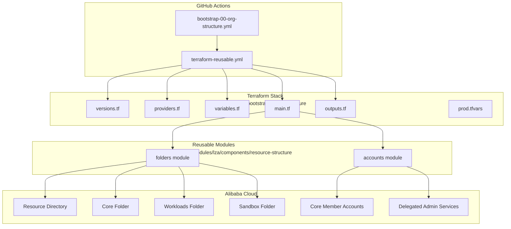
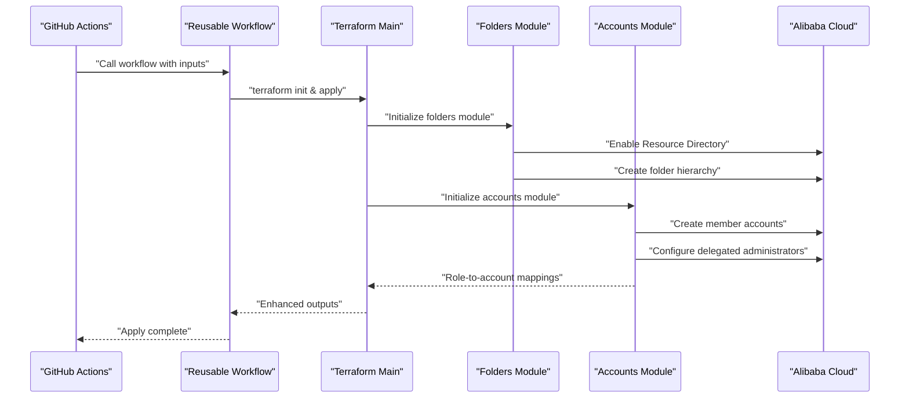
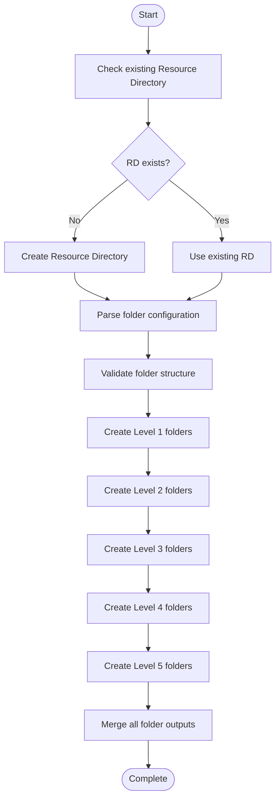
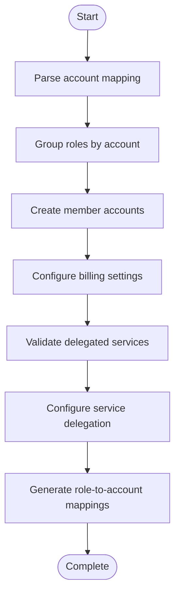
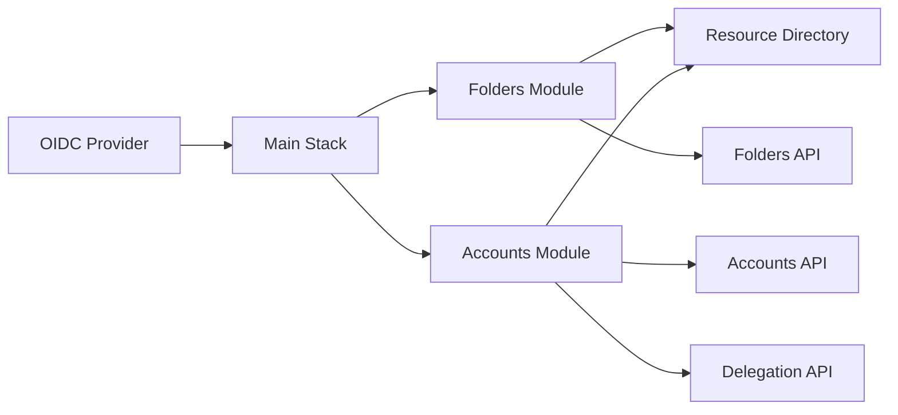

# Organization Structure Setup

<cite>
**Referenced Files in This Document**
- [bootstrap/00-org-structure/main.tf](file://bootstrap/00-org-structure/main.tf)
- [bootstrap/00-org-structure/variables.tf](file://bootstrap/00-org-structure/variables.tf)
- [bootstrap/00-org-structure/providers.tf](file://bootstrap/00-org-structure/providers.tf)
- [bootstrap/00-org-structure/outputs.tf](file://bootstrap/00-org-structure/outputs.tf)
- [bootstrap/00-org-structure/prod.tfvars](file://bootstrap/00-org-structure/prod.tfvars)
- [bootstrap/00-org-structure/versions.tf](file://bootstrap/00-org-structure/versions.tf)
- [modules/lza/components/resource-structure/folders/main.tf](file://modules/lza/components/resource-structure/folders/main.tf)
- [modules/lza/components/resource-structure/folders/variables.tf](file://modules/lza/components/resource-structure/folders/variables.tf)
- [modules/lza/components/resource-structure/folders/outputs.tf](file://modules/lza/components/resource-structure/folders/outputs.tf)
- [modules/lza/components/resource-structure/accounts/main.tf](file://modules/lza/components/resource-structure/accounts/main.tf)
- [modules/lza/components/resource-structure/accounts/variables.tf](file://modules/lza/components/resource-structure/accounts/variables.tf)
- [modules/lza/components/resource-structure/accounts/outputs.tf](file://modules/lza/components/resource-structure/accounts/outputs.tf)
- [.github/workflows/bootstrap-00-org-structure.yml](file://.github/workflows/bootstrap-00-org-structure.yml)
- [.github/workflows/terraform-reusable.yml](file://.github/workflows/terraform-reusable.yml)
</cite>

## Update Summary
**Changes Made**
- Updated architecture overview to reflect modularized resource directory management
- Added documentation for new hashicorp/alicloud provider migration
- Enhanced variable definitions with folder_structure and account_mapping configurations
- Documented new production configuration file (prod.tfvars)
- Updated output definitions to expose module outputs for better integration
- Added comprehensive validation rules and error handling documentation
- Enhanced troubleshooting guide with new modular architecture considerations

## Table of Contents
1. [Introduction](#introduction)
2. [Project Structure](#project-structure)
3. [Core Components](#core-components)
4. [Architecture Overview](#architecture-overview)
5. [Detailed Component Analysis](#detailed-component-analysis)
6. [Dependency Analysis](#dependency-analysis)
7. [Performance Considerations](#performance-considerations)
8. [Troubleshooting Guide](#troubleshooting-guide)
9. [Conclusion](#conclusion)

## Introduction
This document explains the organization structure setup phase of the bootstrap infrastructure using a modularized approach. The system has been significantly enhanced with improved architecture including modularized resource directory management, migration to the hashicorp/alicloud provider, enhanced variable definitions with comprehensive validation, and production-ready configuration files. It focuses on enabling the Resource Directory, establishing the folder hierarchy (Core, Workloads, Sandbox), provisioning core member accounts (devops, log-archive, security, network, shared-services, iam), and documenting provider configuration and variables. The implementation is designed to be idempotent and supports advanced features like service delegation administrators and multi-role account grouping.

## Project Structure
The organization structure setup is implemented as a modularized Terraform stack under bootstrap/00-org-structure. The architecture has been restructured to use reusable components from modules/lza/components/resource-structure/, providing better separation of concerns and enhanced functionality. The stack is orchestrated by GitHub Actions workflows using OIDC-based authentication.


```mermaid
graph TB
subgraph "GitHub Actions"
WF["bootstrap-00-org-structure.yml"]
RW["terraform-reusable.yml"]
end
subgraph "Terraform Stack<br/>bootstrap/00-org-structure"
V["versions.tf"]
P["providers.tf"]
VA["variables.tf"]
M["main.tf"]
O["outputs.tf"]
PTF["prod.tfvars"]
end
subgraph "Reusable Modules<br/>modules/lza/components/resource-structure"
FM["folders module"]
AM["accounts module"]
end
subgraph "Alibaba Cloud"
RD["Resource Directory"]
F1["Core Folder"]
F2["Workloads Folder"]
F3["Sandbox Folder"]
ACC["Core Member Accounts"]
DA["Delegated Admin Services"]
end
WF --> RW
RW --> V
RW --> P
RW --> VA
RW --> M
RW --> O
M --> FM
M --> AM
FM --> RD
FM --> F1
FM --> F2
FM --> F3
AM --> ACC
AM --> DA
```

**Diagram sources**
- [.github/workflows/bootstrap-00-org-structure.yml:1-36](file://.github/workflows/bootstrap-00-org-structure.yml#L1-L36)
- [.github/workflows/terraform-reusable.yml:1-118](file://.github/workflows/terraform-reusable.yml#L1-L118)
- [bootstrap/00-org-structure/main.tf:1-25](file://bootstrap/00-org-structure/main.tf#L1-L25)
- [modules/lza/components/resource-structure/folders/main.tf:1-136](file://modules/lza/components/resource-structure/folders/main.tf#L1-L136)
- [modules/lza/components/resource-structure/accounts/main.tf:1-137](file://modules/lza/components/resource-structure/accounts/main.tf#L1-L137)

**Section sources**
- [.github/workflows/bootstrap-00-org-structure.yml:1-36](file://.github/workflows/bootstrap-00-org-structure.yml#L1-L36)
- [.github/workflows/terraform-reusable.yml:1-118](file://.github/workflows/terraform-reusable.yml#L1-L118)
- [bootstrap/00-org-structure/main.tf:1-25](file://bootstrap/00-org-structure/main.tf#L1-L25)

## Core Components
The modularized architecture consists of several key components:

- **Resource Directory Management**: Modularized component that handles Resource Directory enablement and folder hierarchy creation with comprehensive validation and support for up to 5 hierarchical levels.
- **Account Provisioning**: Advanced account management with support for multi-role grouping, service delegation administrators, and flexible billing configurations.
- **Provider Configuration**: Migrated to hashicorp/alicloud provider with region and credentials sourced via OIDC or environment variables.
- **Enhanced Variable Definitions**: Comprehensive variable structures with validation rules for folder_structure and account_mapping configurations.
- **Production Configuration**: New prod.tfvars file providing production-ready configuration examples.
- **Improved Outputs**: Enhanced output definitions exposing module outputs for better integration with downstream stacks.

**Updated** Major architectural improvements including modularization, enhanced validation, and production-ready configuration support.

**Section sources**
- [bootstrap/00-org-structure/main.tf:1-25](file://bootstrap/00-org-structure/main.tf#L1-L25)
- [bootstrap/00-org-structure/variables.tf:1-41](file://bootstrap/00-org-structure/variables.tf#L1-L41)
- [bootstrap/00-org-structure/providers.tf:1-6](file://bootstrap/00-org-structure/providers.tf#L1-L6)
- [bootstrap/00-org-structure/outputs.tf:1-20](file://bootstrap/00-org-structure/outputs.tf#L1-20)

## Architecture Overview
The organization structure setup uses a modularized architecture executed through GitHub Actions with OIDC federation. The main stack orchestrates two reusable modules: folders for Resource Directory and folder management, and accounts for member account provisioning with service delegation capabilities.


```mermaid
sequenceDiagram
participant GH as "GitHub Actions"
participant RW as "Reusable Workflow"
participant TF as "Terraform Main"
participant FM as "Folders Module"
participant AM as "Accounts Module"
participant AC as "Alibaba Cloud"
GH->>RW : "Call workflow with inputs"
RW->>TF : "terraform init & apply"
TF->>FM : "Initialize folders module"
FM->>AC : "Enable Resource Directory"
FM->>AC : "Create folder hierarchy"
TF->>AM : "Initialize accounts module"
AM->>AC : "Create member accounts"
AM->>AC : "Configure delegated administrators"
AM-->>TF : "Role-to-account mappings"
TF-->>RW : "Enhanced outputs"
RW-->>GH : "Apply complete"
```

**Diagram sources**
- [.github/workflows/bootstrap-00-org-structure.yml:18-36](file://.github/workflows/bootstrap-00-org-structure.yml#L18-L36)
- [.github/workflows/terraform-reusable.yml:50-118](file://.github/workflows/terraform-reusable.yml#L50-L118)
- [bootstrap/00-org-structure/main.tf:1-25](file://bootstrap/00-org-structure/main.tf#L1-L25)

## Detailed Component Analysis

### Modularized Resource Directory Management
The Resource Directory management has been completely modularized into a reusable component that provides comprehensive folder hierarchy management with support for up to 5 hierarchical levels.

**Key Features:**
- **Hierarchical Folder Support**: Creates folders at levels 1-5 with proper parent-child relationships
- **Flexible Configuration**: Supports both inline configuration and external JSON/YAML files
- **Comprehensive Validation**: Built-in validation rules for folder names, levels, and parent relationships
- **Idempotent Operations**: Safe to run multiple times without creating duplicate resources


```mermaid
flowchart TD
Start(["Start"]) --> CheckRD["Check existing Resource Directory"]
CheckRD --> EnableRD{"RD exists?"}
EnableRD --> |No| CreateRD["Create Resource Directory"]
EnableRD --> |Yes| UseExisting["Use existing RD"]
CreateRD --> ParseConfig["Parse folder configuration"]
UseExisting --> ParseConfig
ParseConfig --> ValidateConfig["Validate folder structure"]
ValidateConfig --> CreateLevel1["Create Level 1 folders"]
CreateLevel1 --> CreateLevel2["Create Level 2 folders"]
CreateLevel2 --> CreateLevel3["Create Level 3 folders"]
CreateLevel3 --> CreateLevel4["Create Level 4 folders"]
CreateLevel4 --> CreateLevel5["Create Level 5 folders"]
CreateLevel5 --> MergeOutputs["Merge all folder outputs"]
MergeOutputs --> End(["Complete"])
```

**Diagram sources**
- [modules/lza/components/resource-structure/folders/main.tf:1-136](file://modules/lza/components/resource-structure/folders/main.tf#L1-L136)

**Section sources**
- [modules/lza/components/resource-structure/folders/main.tf:1-136](file://modules/lza/components/resource-structure/folders/main.tf#L1-L136)
- [modules/lza/components/resource-structure/folders/variables.tf:1-72](file://modules/lza/components/resource-structure/folders/variables.tf#L1-72)
- [modules/lza/components/resource-structure/folders/outputs.tf:1-80](file://modules/lza/components/resource-structure/folders/outputs.tf#L1-80)

### Enhanced Account Provisioning System
The account provisioning system has been significantly enhanced with support for multi-role grouping, service delegation administrators, and comprehensive validation rules.

**Advanced Features:**
- **Multi-Role Grouping**: Multiple roles can share the same account using comma-separated keys (e.g., "log,security")
- **Service Delegation**: Automatic configuration of delegated administrators for various Alibaba Cloud services
- **Flexible Billing**: Support for both Trusteeship and Self-pay billing models
- **Validation Rules**: Comprehensive input validation for account names, display names, and billing types


```mermaid
flowchart TD
Start(["Start"]) --> ParseMapping["Parse account mapping"]
ParseMapping --> GroupRoles["Group roles by account"]
GroupRoles --> CreateAccounts["Create member accounts"]
CreateAccounts --> ConfigureBilling["Configure billing settings"]
ConfigureBilling --> ValidateServices["Validate delegated services"]
ValidateServices --> ConfigureDelegation["Configure service delegation"]
ConfigureDelegation --> GenerateMappings["Generate role-to-account mappings"]
GenerateMappings --> End(["Complete"])
```

**Diagram sources**
- [modules/lza/components/resource-structure/accounts/main.tf:1-137](file://modules/lza/components/resource-structure/accounts/main.tf#L1-L137)

**Section sources**
- [modules/lza/components/resource-structure/accounts/main.tf:1-137](file://modules/lza/components/resource-structure/accounts/main.tf#L1-L137)
- [modules/lza/components/resource-structure/accounts/variables.tf:1-122](file://modules/lza/components/resource-structure/accounts/variables.tf#L1-122)
- [modules/lza/components/resource-structure/accounts/outputs.tf:1-42](file://modules/lza/components/resource-structure/accounts/outputs.tf#L1-42)

### Provider Configuration and Migration
The provider configuration has been migrated to the official hashicorp/alicloud provider with enhanced credential management options.

**Provider Features:**
- **Official Provider**: Uses hashicorp/alicloud provider version >= 1.267.0
- **Flexible Authentication**: Supports both OIDC and environment variable authentication
- **Region Configuration**: Configurable region with default to cn-hangzhou
- **Version Management**: Proper version constraints and requirements

**Section sources**
- [bootstrap/00-org-structure/providers.tf:1-6](file://bootstrap/00-org-structure/providers.tf#L1-6)
- [bootstrap/00-org-structure/versions.tf:1-11](file://bootstrap/00-org-structure/versions.tf#L1-11)

### Enhanced Variable Definitions
The variable definitions have been significantly enhanced with comprehensive validation rules and flexible configuration options.

**Folder Structure Variables:**
- **Hierarchical Support**: Supports up to 5 levels of folder hierarchy
- **Parent-Child Relationships**: Defines parent_folder_name for nested folder structures
- **Tag Support**: Optional tags for each folder
- **Validation Rules**: Comprehensive validation for folder names, levels, and relationships

**Account Mapping Variables:**
- **Multi-Role Support**: Comma-separated role keys for account grouping
- **Flexible Billing**: Support for different billing types and accounts
- **Folder Assignment**: Optional folder_id assignment per account
- **Tag Support**: Per-account tagging capabilities

**Section sources**
- [bootstrap/00-org-structure/variables.tf:1-41](file://bootstrap/00-org-structure/variables.tf#L1-41)

### Production Configuration File
A new production-ready configuration file (prod.tfvars) provides example configurations for production deployments.

**Configuration Features:**
- **Environment-Specific Settings**: Dedicated production configuration
- **Complete Examples**: Full examples of folder_structure and account_mapping
- **Best Practices**: Follows recommended patterns for production deployments
- **Easy Customization**: Simple structure for modification based on specific needs

**Section sources**
- [bootstrap/00-org-structure/prod.tfvars:1-44](file://bootstrap/00-org-structure/prod.tfvars#L1-44)

### Improved Output Definitions
The output definitions have been enhanced to provide better integration capabilities with downstream stacks.

**Enhanced Outputs:**
- **Resource Directory ID**: Direct access to Resource Directory identifier
- **Root Folder ID**: Root folder identification for hierarchical operations
- **Folder Structure Map**: Complete mapping of folder names to IDs with metadata
- **Account Role Mapping**: Flexible role-to-account ID mappings supporting multi-role scenarios
- **Service Delegation Info**: Information about configured delegated administrators

**Section sources**
- [bootstrap/00-org-structure/outputs.tf:1-20](file://bootstrap/00-org-structure/outputs.tf#L1-20)

## Dependency Analysis
The modularized architecture introduces clear dependency boundaries while maintaining efficient execution flow.

**Module Dependencies:**
- **Main Stack**: Orchestrates folders and accounts modules
- **Folders Module**: Depends on Resource Directory availability and creates hierarchical folder structure
- **Accounts Module**: Depends on Resource Directory and folder structure for account placement

**External Dependencies:**
- **Alibaba Cloud Provider**: Official hashicorp/alicloud provider with version constraints
- **OIDC Authentication**: GitHub Actions OIDC provider for secure credential management
- **Resource Manager Service**: Alibaba Cloud Resource Directory and folder management APIs

**State Management:**
- **Local Backend**: Initial state storage during bootstrap phase
- **Migration Path**: Designed for migration to OSS backend in Phase 2


```mermaid
graph LR
Main["Main Stack"] --> Folders["Folders Module"]
Main --> Accounts["Accounts Module"]
Folders --> RD["Resource Directory"]
Folders --> FoldersAPI["Folders API"]
Accounts --> RD
Accounts --> AccountsAPI["Accounts API"]
Accounts --> DelegationAPI["Delegation API"]
OIDC["OIDC Provider"] --> Main
```

**Diagram sources**
- [bootstrap/00-org-structure/main.tf:1-25](file://bootstrap/00-org-structure/main.tf#L1-25)
- [modules/lza/components/resource-structure/folders/main.tf:1-136](file://modules/lza/components/resource-structure/folders/main.tf#L1-136)
- [modules/lza/components/resource-structure/accounts/main.tf:1-137](file://modules/lza/components/resource-structure/accounts/main.tf#L1-137)

**Section sources**
- [bootstrap/00-org-structure/main.tf:1-25](file://bootstrap/00-org-structure/main.tf#L1-25)
- [bootstrap/00-org-structure/versions.tf:1-11](file://bootstrap/00-org-structure/versions.tf#L1-11)

## Performance Considerations
The modularized architecture provides several performance benefits:

- **Parallel Execution**: Folders at the same level are created in parallel by Terraform
- **Efficient State Management**: Modular design reduces state complexity and improves refresh performance
- **Validation Early Failures**: Comprehensive validation rules fail fast with clear error messages
- **Optimized Module Reuse**: Reusable modules reduce duplication and improve maintainability
- **Intelligent Caching**: HashiCorp provider caching improves subsequent plan/apply operations

## Troubleshooting Guide
The enhanced architecture includes improved error handling and more detailed troubleshooting guidance.

### Common Issues and Solutions

**Resource Directory Enablement:**
- **Issue**: Resource Directory not enabled in management account
- **Solution**: Ensure RD is enabled before running the stack. The folders module will attempt to enable it if not present.
- **Reference**: [modules/lza/components/resource-structure/folders/main.tf:5-8](file://modules/lza/components/resource-structure/folders/main.tf#L5-L8)

**Folder Creation Failures:**
- **Issue**: Invalid folder name or level configuration
- **Solution**: Check validation rules - folder names must be 1-24 characters with allowed characters, levels must be 1-5, and parent-child relationships must be valid.
- **Reference**: [modules/lza/components/resource-structure/folders/variables.tf:11-58](file://modules/lza/components/resource-structure/folders/variables.tf#L11-L58)

**Account Creation Errors:**
- **Issue**: Invalid account naming or billing configuration
- **Solution**: Verify account_name_prefix follows naming rules (2-50 chars, alphanumeric with underscores/dots/hyphens), display_name validation, and billing_type must be "Trusteeship" or "Self-pay".
- **Reference**: [modules/lza/components/resource-structure/accounts/variables.tf:50-73](file://modules/lza/components/resource-structure/accounts/variables.tf#L50-L73)

**Service Delegation Problems:**
- **Issue**: Delegated administrator roles not found
- **Solution**: Ensure all roles specified in delegated_services exist in account_mapping. The module validates this and provides clear error messages.
- **Reference**: [modules/lza/components/resource-structure/accounts/main.tf:114-120](file://modules/lza/components/resource-structure/accounts/main.tf#L114-L120)

**OIDC Authentication Failures:**
- **Issue**: Credential acquisition failures in GitHub Actions
- **Solution**: Verify OIDC provider ARN and hub role ARN are correctly configured in repository variables and workflow inputs.
- **Reference**: [.github/workflows/bootstrap-00-org-structure.yml:22-35](file://.github/workflows/bootstrap-00-org-structure.yml#L22-L35)

**Provider Version Issues:**
- **Issue**: Incompatible provider versions
- **Solution**: Ensure Terraform version >= 1.5 and alicloud provider >= 1.267.0 as specified in versions.tf
- **Reference**: [bootstrap/00-org-structure/versions.tf:1-11](file://bootstrap/00-org-structure/versions.tf#L1-11)

### Debugging Tips

**Enable Detailed Logging:**
```bash
export TF_LOG=DEBUG
terraform plan -var-file=prod.tfvars
```

**Validate Configuration Before Apply:**
```bash
terraform validate
terraform plan -var-file=prod.tfvars
```

**Check Module Outputs:**
```bash
terraform output -json
```

**Section sources**
- [modules/lza/components/resource-structure/folders/main.tf:5-8](file://modules/lza/components/resource-structure/folders/main.tf#L5-L8)
- [modules/lza/components/resource-structure/folders/variables.tf:11-58](file://modules/lza/components/resource-structure/folders/variables.tf#L11-L58)
- [modules/lza/components/resource-structure/accounts/variables.tf:50-73](file://modules/lza/components/resource-structure/accounts/variables.tf#L50-L73)
- [modules/lza/components/resource-structure/accounts/main.tf:114-120](file://modules/lza/components/resource-structure/accounts/main.tf#L114-L120)
- [.github/workflows/bootstrap-00-org-structure.yml:22-35](file://.github/workflows/bootstrap-00-org-structure.yml#L22-L35)
- [bootstrap/00-org-structure/versions.tf:1-11](file://bootstrap/00-org-structure/versions.tf#L1-11)

## Conclusion
The organization structure setup has been significantly enhanced with a modularized architecture that provides better separation of concerns, enhanced validation, and production-ready configuration options. The migration to the hashicorp/alicloud provider ensures long-term support and compatibility. The new folder_structure and account_mapping configurations offer flexible deployment options with comprehensive validation rules. The improved output definitions enable better integration with downstream stacks, while the production configuration file provides best-practice examples for enterprise deployments. The modular design ensures maintainability and scalability for growing organizational needs.