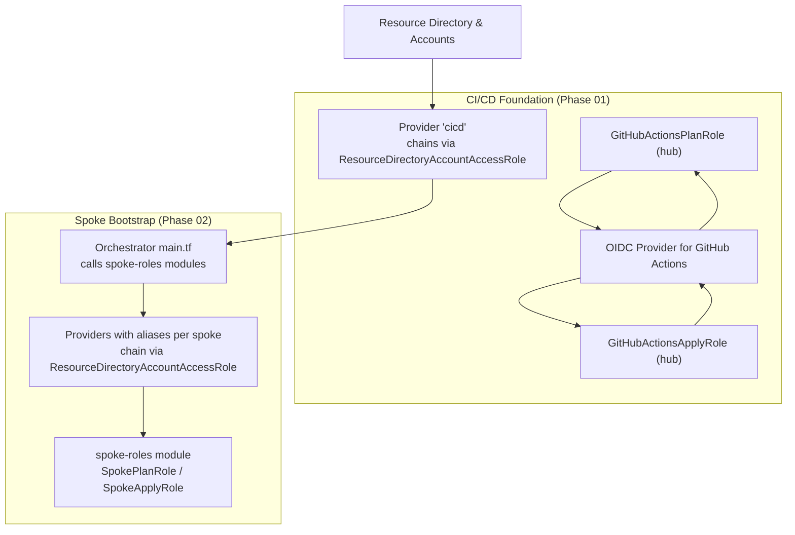
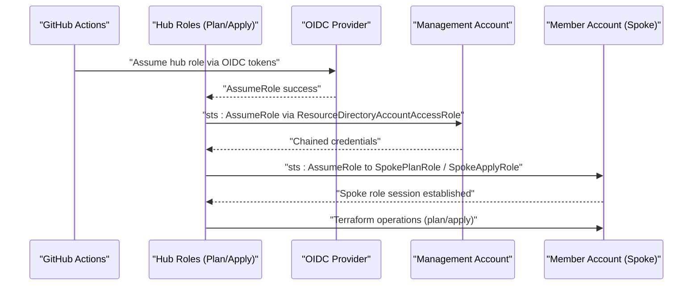
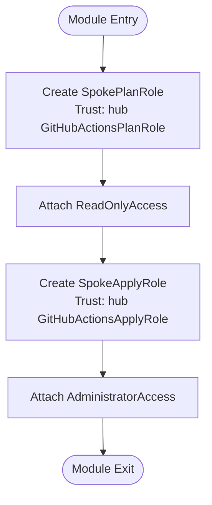
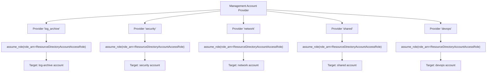
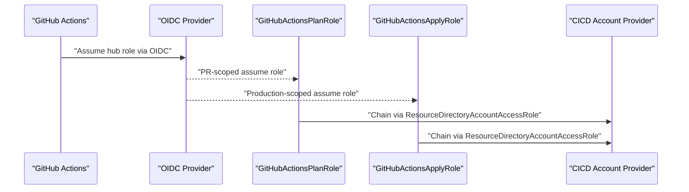
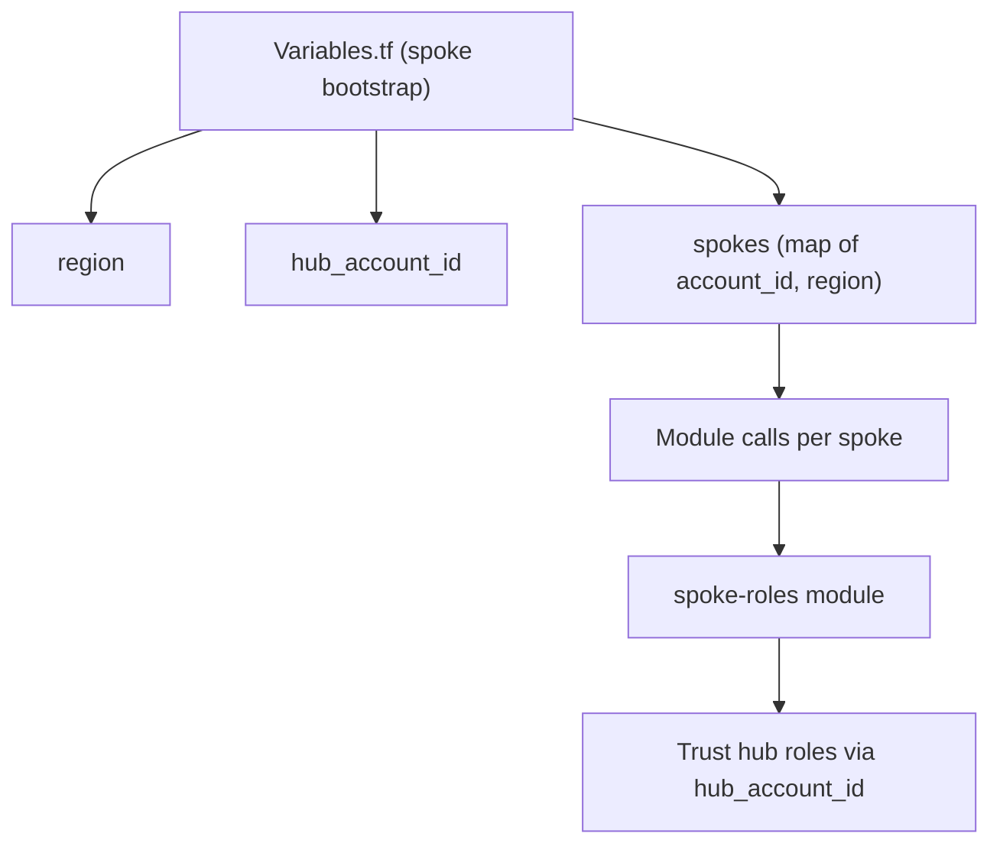
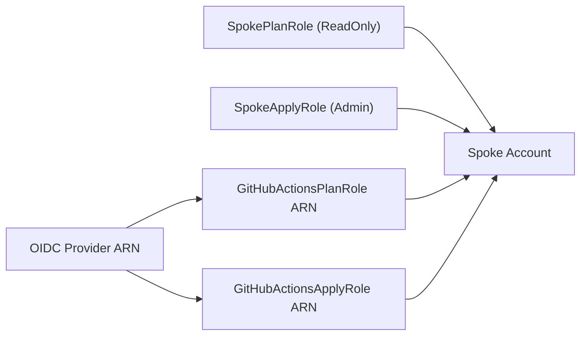
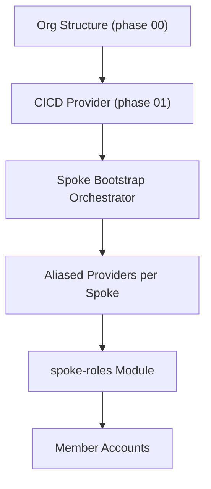
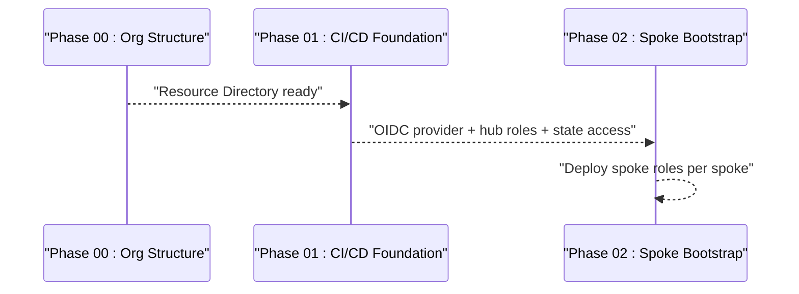

# Spoke Bootstrap

<cite>
**Referenced Files in This Document**
- [bootstrap/02-spoke-bootstrap/main.tf](file://bootstrap/02-spoke-bootstrap/main.tf)
- [bootstrap/02-spoke-bootstrap/providers.tf](file://bootstrap/02-spoke-bootstrap/providers.tf)
- [bootstrap/02-spoke-bootstrap/variables.tf](file://bootstrap/02-spoke-bootstrap/variables.tf)
- [bootstrap/02-spoke-bootstrap/outputs.tf](file://bootstrap/02-spoke-bootstrap/outputs.tf)
- [bootstrap/02-spoke-bootstrap/modules/spoke-roles/main.tf](file://bootstrap/02-spoke-bootstrap/modules/spoke-roles/main.tf)
- [bootstrap/02-spoke-bootstrap/modules/spoke-roles/variables.tf](file://bootstrap/02-spoke-bootstrap/modules/spoke-roles/variables.tf)
- [bootstrap/01-cicd-foundation/main.tf](file://bootstrap/01-cicd-foundation/main.tf)
- [bootstrap/01-cicd-foundation/providers.tf](file://bootstrap/01-cicd-foundation/providers.tf)
- [bootstrap/01-cicd-foundation/variables.tf](file://bootstrap/01-cicd-foundation/variables.tf)
- [bootstrap/01-cicd-foundation/outputs.tf](file://bootstrap/01-cicd-foundation/outputs.tf)
- [bootstrap/00-org-structure/main.tf](file://bootstrap/00-org-structure/main.tf)
- [.github/workflows/bootstrap-02-spoke.yml](file://.github/workflows/bootstrap-02-spoke.yml)
- [.github/workflows/bootstrap-01-cicd-foundation.yml](file://.github/workflows/bootstrap-01-cicd-foundation.yml)
</cite>

## Table of Contents
1. [Introduction](#introduction)
2. [Project Structure](#project-structure)
3. [Core Components](#core-components)
4. [Architecture Overview](#architecture-overview)
5. [Detailed Component Analysis](#detailed-component-analysis)
6. [Dependency Analysis](#dependency-analysis)
7. [Performance Considerations](#performance-considerations)
8. [Troubleshooting Guide](#troubleshooting-guide)
9. [Conclusion](#conclusion)
10. [Appendices](#appendices)

## Introduction
This document explains the spoke bootstrap phase that provisions IAM roles in member accounts and establishes provider chaining so CI/CD can operate across multiple Alibaba Cloud accounts securely. It covers:
- How the spoke-roles module creates roles for planning and applying changes in each spoke account
- How provider chaining uses ResourceDirectoryAccountAccessRole to safely target remote accounts
- Variable configuration for spoke account definitions and role permissions
- How the hub roles delegate authority to spoke accounts and maintain security isolation
- Troubleshooting provider chaining and role assumption failures
- The relationship between spoke bootstrap and the CI/CD foundation phase

## Project Structure
The spoke bootstrap is implemented as a Terraform module with a dedicated orchestration layer and a reusable spoke-roles module. It is orchestrated by GitHub Actions workflows and integrates with the CI/CD foundation that sets up OIDC trust and hub roles.

**Diagram sources**
- [bootstrap/01-cicd-foundation/providers.tf:1-16](file://bootstrap/01-cicd-foundation/providers.tf#L1-L16)
- [bootstrap/01-cicd-foundation/main.tf:59-105](file://bootstrap/01-cicd-foundation/main.tf#L59-L105)
- [bootstrap/02-spoke-bootstrap/main.tf:1-33](file://bootstrap/02-spoke-bootstrap/main.tf#L1-L33)
- [bootstrap/02-spoke-bootstrap/providers.tf:1-51](file://bootstrap/02-spoke-bootstrap/providers.tf#L1-L51)
- [bootstrap/02-spoke-bootstrap/modules/spoke-roles/main.tf:1-42](file://bootstrap/02-spoke-bootstrap/modules/spoke-roles/main.tf#L1-L42)

**Section sources**
- [bootstrap/02-spoke-bootstrap/main.tf:1-33](file://bootstrap/02-spoke-bootstrap/main.tf#L1-L33)
- [bootstrap/02-spoke-bootstrap/providers.tf:1-51](file://bootstrap/02-spoke-bootstrap/providers.tf#L1-L51)
- [bootstrap/02-spoke-bootstrap/variables.tf:1-26](file://bootstrap/02-spoke-bootstrap/variables.tf#L1-L26)
- [bootstrap/02-spoke-bootstrap/outputs.tf:1-22](file://bootstrap/02-spoke-bootstrap/outputs.tf#L1-L22)
- [bootstrap/01-cicd-foundation/providers.tf:1-16](file://bootstrap/01-cicd-foundation/providers.tf#L1-L16)
- [bootstrap/01-cicd-foundation/main.tf:59-105](file://bootstrap/01-cicd-foundation/main.tf#L59-L105)
- [bootstrap/01-cicd-foundation/outputs.tf:1-25](file://bootstrap/01-cicd-foundation/outputs.tf#L1-L25)
- [bootstrap/00-org-structure/main.tf:31-49](file://bootstrap/00-org-structure/main.tf#L31-L49)

## Core Components
- Spoke orchestration layer: Deploys spoke-roles modules targeting each member account via aliased providers.
- Spoke-roles module: Creates SpokePlanRole (read-only) and SpokeApplyRole (admin) in each spoke, trusting the hub’s GitHub OIDC-backed roles.
- Provider chaining: Uses ResourceDirectoryAccountAccessRole to chain from the management account into each spoke account.
- CI/CD foundation: Establishes OIDC provider and hub roles (GitHubActionsPlanRole and GitHubActionsApplyRole) with state access and cross-account assume-role permissions.
- Variables and outputs: Define spoke account identities and expose role ARNs for downstream use.

Key implementation references:
- Orchestration and provider aliases: [bootstrap/02-spoke-bootstrap/main.tf:1-33](file://bootstrap/02-spoke-bootstrap/main.tf#L1-L33), [bootstrap/02-spoke-bootstrap/providers.tf:6-51](file://bootstrap/02-spoke-bootstrap/providers.tf#L6-L51)
- Spoke roles creation: [bootstrap/02-spoke-bootstrap/modules/spoke-roles/main.tf:1-42](file://bootstrap/02-spoke-bootstrap/modules/spoke-roles/main.tf#L1-L42)
- Hub roles and OIDC: [bootstrap/01-cicd-foundation/main.tf:49-105](file://bootstrap/01-cicd-foundation/main.tf#L49-L105)
- Outputs for spoke role ARNs: [bootstrap/02-spoke-bootstrap/outputs.tf:1-22](file://bootstrap/02-spoke-bootstrap/outputs.tf#L1-L22)
- Outputs for hub role ARNs and OIDC: [bootstrap/01-cicd-foundation/outputs.tf:11-24](file://bootstrap/01-cicd-foundation/outputs.tf#L11-L24)

**Section sources**
- [bootstrap/02-spoke-bootstrap/main.tf:1-33](file://bootstrap/02-spoke-bootstrap/main.tf#L1-L33)
- [bootstrap/02-spoke-bootstrap/providers.tf:6-51](file://bootstrap/02-spoke-bootstrap/providers.tf#L6-L51)
- [bootstrap/02-spoke-bootstrap/modules/spoke-roles/main.tf:1-42](file://bootstrap/02-spoke-bootstrap/modules/spoke-roles/main.tf#L1-L42)
- [bootstrap/01-cicd-foundation/main.tf:49-105](file://bootstrap/01-cicd-foundation/main.tf#L49-L105)
- [bootstrap/02-spoke-bootstrap/outputs.tf:1-22](file://bootstrap/02-spoke-bootstrap/outputs.tf#L1-L22)
- [bootstrap/01-cicd-foundation/outputs.tf:11-24](file://bootstrap/01-cicd-foundation/outputs.tf#L11-L24)

## Architecture Overview
The spoke bootstrap establishes a secure, chained path from the CI/CD hub to each spoke account. The CI/CD foundation configures OIDC trust and hub roles. The spoke bootstrap uses provider chaining to deploy roles in each spoke, enabling Terraform to operate across accounts while maintaining least privilege and separation of duties.

**Diagram sources**
- [bootstrap/01-cicd-foundation/main.tf:49-105](file://bootstrap/01-cicd-foundation/main.tf#L49-L105)
- [bootstrap/01-cicd-foundation/providers.tf:7-15](file://bootstrap/01-cicd-foundation/providers.tf#L7-L15)
- [bootstrap/02-spoke-bootstrap/providers.tf:6-51](file://bootstrap/02-spoke-bootstrap/providers.tf#L6-L51)
- [bootstrap/02-spoke-bootstrap/modules/spoke-roles/main.tf:1-42](file://bootstrap/02-spoke-bootstrap/modules/spoke-roles/main.tf#L1-L42)

## Detailed Component Analysis

### Spoke Roles Module
The spoke-roles module provisions two roles per spoke:
- SpokePlanRole: Trusted by the hub’s GitHubActionsPlanRole, scoped to read-only operations for planning.
- SpokeApplyRole: Trusted by the hub’s GitHubActionsApplyRole, scoped to administrative operations for applying changes.

**Diagram sources**
- [bootstrap/02-spoke-bootstrap/modules/spoke-roles/main.tf:1-42](file://bootstrap/02-spoke-bootstrap/modules/spoke-roles/main.tf#L1-L42)

**Section sources**
- [bootstrap/02-spoke-bootstrap/modules/spoke-roles/main.tf:1-42](file://bootstrap/02-spoke-bootstrap/modules/spoke-roles/main.tf#L1-L42)
- [bootstrap/02-spoke-bootstrap/modules/spoke-roles/variables.tf:1-5](file://bootstrap/02-spoke-bootstrap/modules/spoke-roles/variables.tf#L1-L5)

### Provider Chaining Mechanism
Provider chaining uses ResourceDirectoryAccountAccessRole to safely target each spoke account from the management account. Each spoke gets an aliased provider configured with assume_role, ensuring Terraform runs under a session scoped to that spoke.

**Diagram sources**
- [bootstrap/02-spoke-bootstrap/providers.tf:6-51](file://bootstrap/02-spoke-bootstrap/providers.tf#L6-L51)

**Section sources**
- [bootstrap/02-spoke-bootstrap/providers.tf:6-51](file://bootstrap/02-spoke-bootstrap/providers.tf#L6-L51)

### CI/CD Foundation and Role Delegation
The CI/CD foundation sets up:
- OIDC provider for GitHub Actions
- Hub roles (GitHubActionsPlanRole and GitHubActionsApplyRole) with conditions for PR vs production
- Hub state access policy granting OSS/OTS access and cross-account assume-role permissions
- Providers that chain from management into the CICD account

**Diagram sources**
- [bootstrap/01-cicd-foundation/main.tf:49-105](file://bootstrap/01-cicd-foundation/main.tf#L49-L105)
- [bootstrap/01-cicd-foundation/providers.tf:7-15](file://bootstrap/01-cicd-foundation/providers.tf#L7-L15)

**Section sources**
- [bootstrap/01-cicd-foundation/main.tf:49-105](file://bootstrap/01-cicd-foundation/main.tf#L49-L105)
- [bootstrap/01-cicd-foundation/providers.tf:7-15](file://bootstrap/01-cicd-foundation/providers.tf#L7-L15)
- [bootstrap/01-cicd-foundation/outputs.tf:11-24](file://bootstrap/01-cicd-foundation/outputs.tf#L11-L24)

### Variable Configuration for Spoke Accounts and Permissions
- Region and hub_account_id: Provided at the spoke bootstrap layer.
- Spokes map: Defines each spoke’s account_id and region.
- Spoke-roles module: Consumes hub_account_id to configure trust with the hub’s GitHub OIDC roles.

**Diagram sources**
- [bootstrap/02-spoke-bootstrap/variables.tf:1-26](file://bootstrap/02-spoke-bootstrap/variables.tf#L1-L26)
- [bootstrap/02-spoke-bootstrap/modules/spoke-roles/variables.tf:1-5](file://bootstrap/02-spoke-bootstrap/modules/spoke-roles/variables.tf#L1-L5)

**Section sources**
- [bootstrap/02-spoke-bootstrap/variables.tf:1-26](file://bootstrap/02-spoke-bootstrap/variables.tf#L1-L26)
- [bootstrap/02-spoke-bootstrap/modules/spoke-roles/variables.tf:1-5](file://bootstrap/02-spoke-bootstrap/modules/spoke-roles/variables.tf#L1-L5)

### Outputs and Security Isolation
- Spoke bootstrap exposes SpokePlanRole and SpokeApplyRole ARNs per spoke for downstream consumers.
- CI/CD foundation exposes OIDC provider ARN and hub role ARNs for GitHub Actions workflows.
- Security isolation:
  - SpokePlanRole is read-only for planning.
  - SpokeApplyRole is admin but scoped to the spoke account.
  - Hub roles require OIDC conditions and are chained via ResourceDirectoryAccountAccessRole.

**Diagram sources**
- [bootstrap/02-spoke-bootstrap/outputs.tf:1-22](file://bootstrap/02-spoke-bootstrap/outputs.tf#L1-L22)
- [bootstrap/01-cicd-foundation/outputs.tf:11-24](file://bootstrap/01-cicd-foundation/outputs.tf#L11-L24)
- [bootstrap/02-spoke-bootstrap/modules/spoke-roles/main.tf:1-42](file://bootstrap/02-spoke-bootstrap/modules/spoke-roles/main.tf#L1-L42)

**Section sources**
- [bootstrap/02-spoke-bootstrap/outputs.tf:1-22](file://bootstrap/02-spoke-bootstrap/outputs.tf#L1-L22)
- [bootstrap/01-cicd-foundation/outputs.tf:11-24](file://bootstrap/01-cicd-foundation/outputs.tf#L11-L24)
- [bootstrap/02-spoke-bootstrap/modules/spoke-roles/main.tf:1-42](file://bootstrap/02-spoke-bootstrap/modules/spoke-roles/main.tf#L1-L42)

## Dependency Analysis
The spoke bootstrap depends on:
- Resource Directory being enabled and member accounts existing (phase 00)
- CICD foundation providing OIDC trust and hub roles
- Provider chaining to enable cross-account operations

**Diagram sources**
- [bootstrap/00-org-structure/main.tf:31-49](file://bootstrap/00-org-structure/main.tf#L31-L49)
- [bootstrap/01-cicd-foundation/providers.tf:7-15](file://bootstrap/01-cicd-foundation/providers.tf#L7-L15)
- [bootstrap/02-spoke-bootstrap/providers.tf:6-51](file://bootstrap/02-spoke-bootstrap/providers.tf#L6-L51)
- [bootstrap/02-spoke-bootstrap/main.tf:1-33](file://bootstrap/02-spoke-bootstrap/main.tf#L1-L33)

**Section sources**
- [bootstrap/00-org-structure/main.tf:31-49](file://bootstrap/00-org-structure/main.tf#L31-L49)
- [bootstrap/01-cicd-foundation/providers.tf:7-15](file://bootstrap/01-cicd-foundation/providers.tf#L7-L15)
- [bootstrap/02-spoke-bootstrap/providers.tf:6-51](file://bootstrap/02-spoke-bootstrap/providers.tf#L6-L51)
- [bootstrap/02-spoke-bootstrap/main.tf:1-33](file://bootstrap/02-spoke-bootstrap/main.tf#L1-L33)

## Performance Considerations
- Provider chaining introduces minimal overhead; sessions last up to the configured duration.
- Using aliased providers per spoke avoids repeated assume-role operations and keeps sessions scoped.
- Limiting role permissions (read-only for planning, admin for applying) reduces risk and improves auditability.

## Troubleshooting Guide
Common provider chaining and role assumption issues and resolutions:
- Provider chaining fails with assume_role errors
  - Verify ResourceDirectoryAccountAccessRole exists and is assumable from the management account.
  - Confirm the spoke account_id in variables matches the Resource Directory.
  - Ensure the session_name is consistent across providers.
  - References: [bootstrap/02-spoke-bootstrap/providers.tf:6-51](file://bootstrap/02-spoke-bootstrap/providers.tf#L6-L51)
- Role assumption from hub to spoke fails
  - Confirm SpokePlanRole and SpokeApplyRole trust the hub’s GitHubActionsPlanRole and GitHubActionsApplyRole respectively.
  - Ensure hub_account_id is set correctly in spoke bootstrap variables.
  - References: [bootstrap/02-spoke-bootstrap/modules/spoke-roles/main.tf:1-42](file://bootstrap/02-spoke-bootstrap/modules/spoke-roles/main.tf#L1-L42), [bootstrap/02-spoke-bootstrap/variables.tf:7-10](file://bootstrap/02-spoke-bootstrap/variables.tf#L7-L10)
- OIDC conditions prevent hub role assumption
  - Validate OIDC provider ARN and hub role ARNs are correctly exposed and used by workflows.
  - Ensure GitHub Actions permissions include id-token and OIDC provider ARN is configured.
  - References: [bootstrap/01-cicd-foundation/outputs.tf:11-24](file://bootstrap/01-cicd-foundation/outputs.tf#L11-L24), [.github/workflows/bootstrap-02-spoke.yml:13-36](file://.github/workflows/bootstrap-02-spoke.yml#L13-L36)
- Role permissions insufficient
  - Planning requires ReadOnlyAccess; applying requires AdministratorAccess on the spoke role.
  - Hub roles must have assume-role permission for SpokePlanRole/SpokeApplyRole.
  - References: [bootstrap/02-spoke-bootstrap/modules/spoke-roles/main.tf:16-20](file://bootstrap/02-spoke-bootstrap/modules/spoke-roles/main.tf#L16-L20), [bootstrap/02-spoke-bootstrap/modules/spoke-roles/main.tf:37-41](file://bootstrap/02-spoke-bootstrap/modules/spoke-roles/main.tf#L37-L41), [bootstrap/01-cicd-foundation/main.tf:128-134](file://bootstrap/01-cicd-foundation/main.tf#L128-L134)

**Section sources**
- [bootstrap/02-spoke-bootstrap/providers.tf:6-51](file://bootstrap/02-spoke-bootstrap/providers.tf#L6-L51)
- [bootstrap/02-spoke-bootstrap/modules/spoke-roles/main.tf:1-42](file://bootstrap/02-spoke-bootstrap/modules/spoke-roles/main.tf#L1-L42)
- [bootstrap/02-spoke-bootstrap/variables.tf:7-10](file://bootstrap/02-spoke-bootstrap/variables.tf#L7-L10)
- [bootstrap/01-cicd-foundation/outputs.tf:11-24](file://bootstrap/01-cicd-foundation/outputs.tf#L11-L24)
- [.github/workflows/bootstrap-02-spoke.yml:13-36](file://.github/workflows/bootstrap-02-spoke.yml#L13-L36)
- [bootstrap/01-cicd-foundation/main.tf:128-134](file://bootstrap/01-cicd-foundation/main.tf#L128-L134)

## Conclusion
The spoke bootstrap phase deploys spoke roles in member accounts and enables secure, chained provider access across accounts. By combining ResourceDirectoryAccountAccessRole chaining, OIDC-backed hub roles, and least-privilege spoke roles, the system achieves robust security isolation while allowing CI/CD to operate across the landing zone. Proper variable configuration and outputs ensure downstream automation can reliably assume the necessary roles.

## Appendices

### Relationship Between Spoke Bootstrap and CI/CD Foundation
- Phase 00 organizes accounts and folders in Resource Directory.
- Phase 01 sets up OIDC trust and hub roles with state access and cross-account assume-role permissions.
- Phase 02 provisions spoke roles and orchestrates provider chaining to enable cross-account operations.

**Diagram sources**
- [bootstrap/00-org-structure/main.tf:31-49](file://bootstrap/00-org-structure/main.tf#L31-L49)
- [bootstrap/01-cicd-foundation/main.tf:49-105](file://bootstrap/01-cicd-foundation/main.tf#L49-L105)
- [bootstrap/02-spoke-bootstrap/main.tf:1-33](file://bootstrap/02-spoke-bootstrap/main.tf#L1-L33)

**Section sources**
- [bootstrap/00-org-structure/main.tf:31-49](file://bootstrap/00-org-structure/main.tf#L31-L49)
- [bootstrap/01-cicd-foundation/main.tf:49-105](file://bootstrap/01-cicd-foundation/main.tf#L49-L105)
- [bootstrap/02-spoke-bootstrap/main.tf:1-33](file://bootstrap/02-spoke-bootstrap/main.tf#L1-L33)