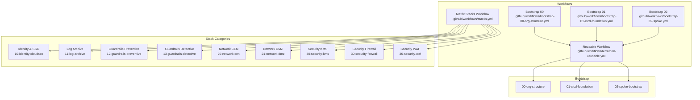
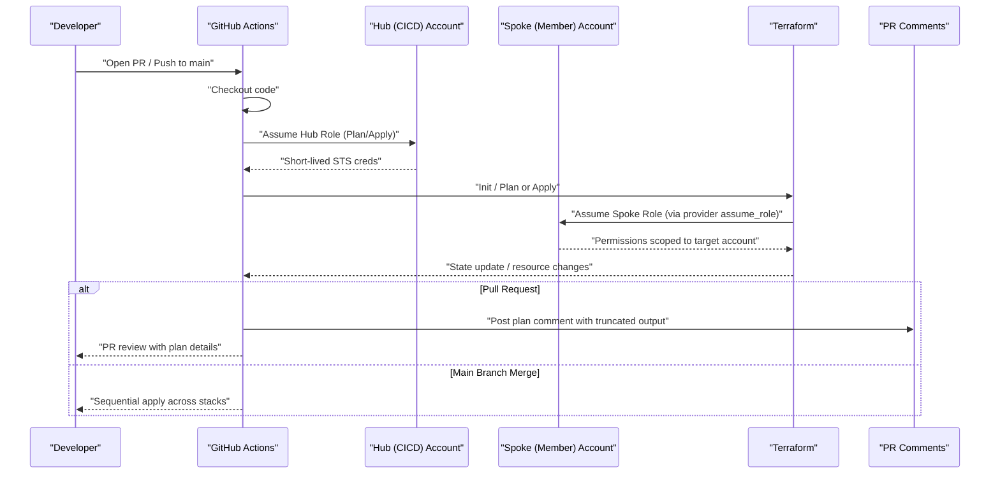
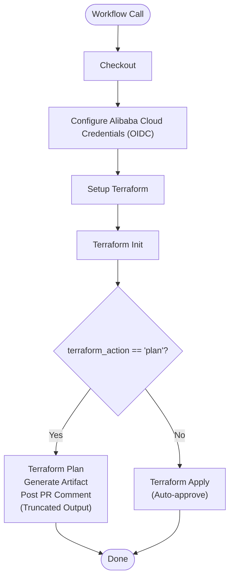
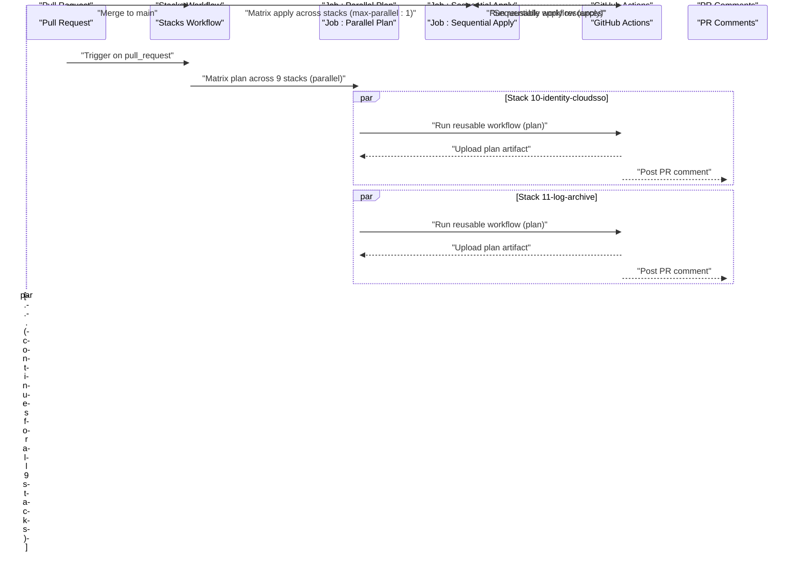
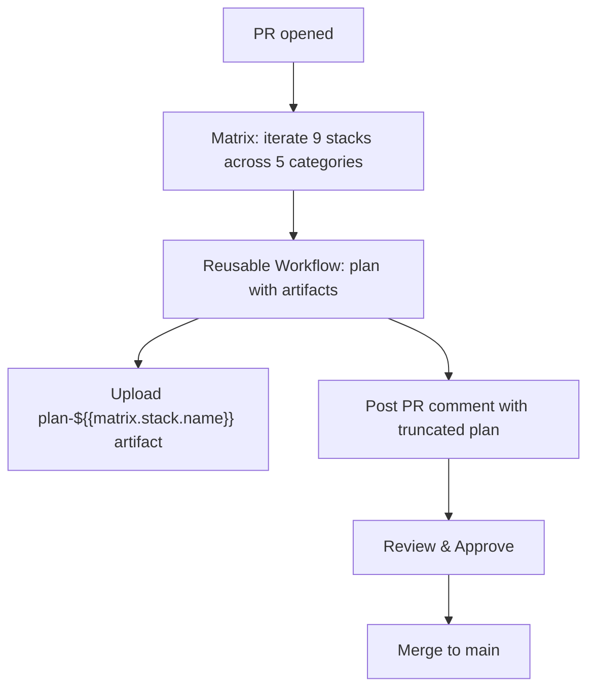
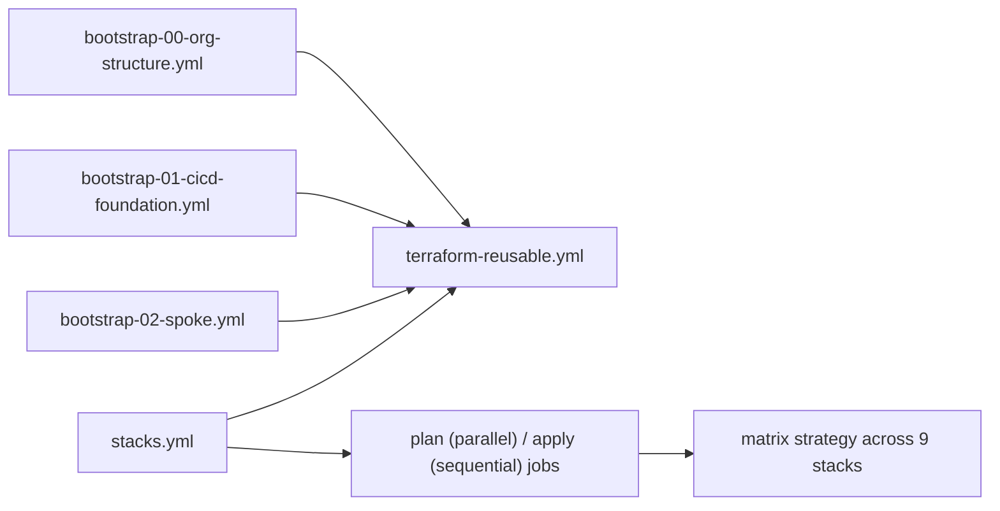
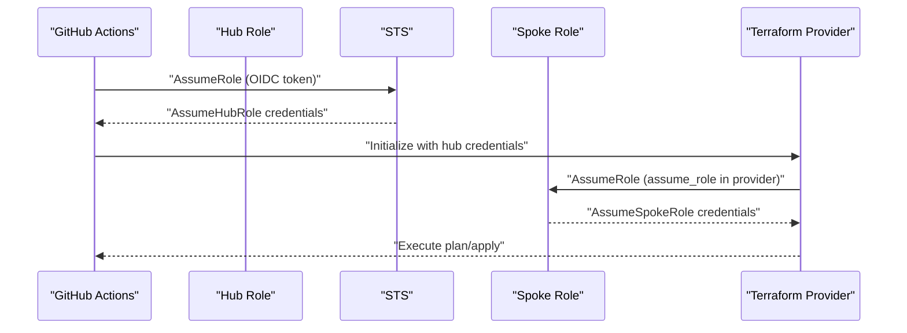
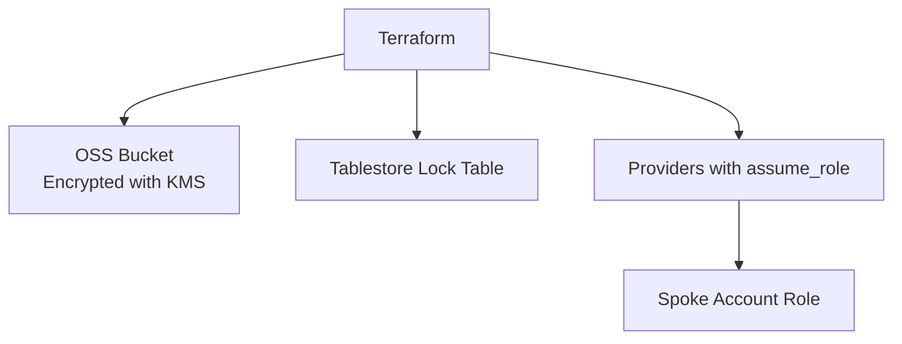
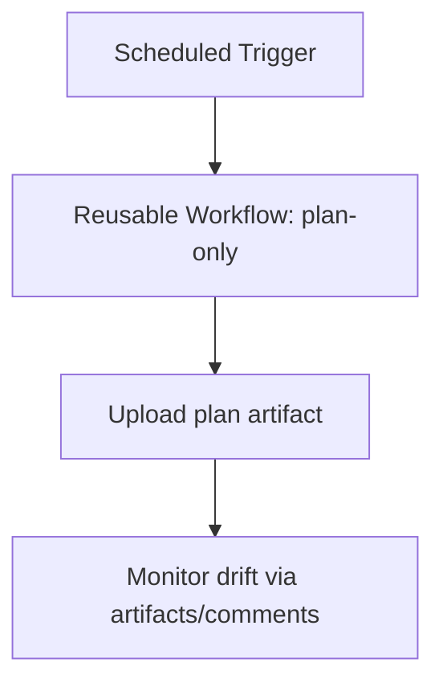
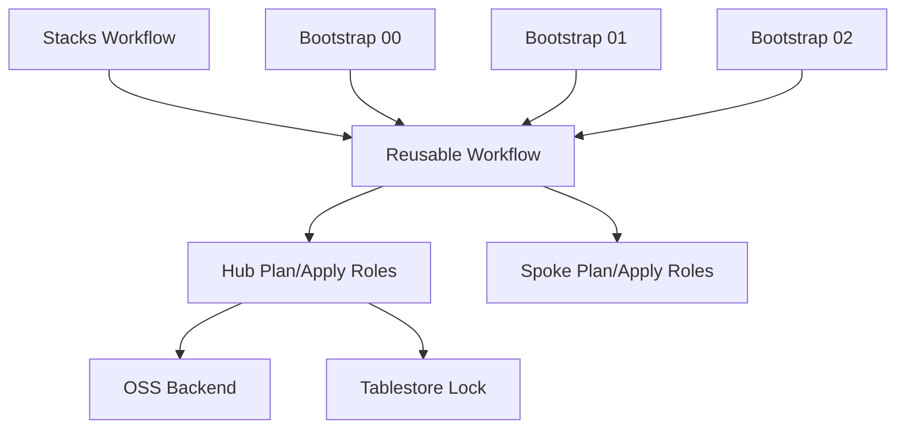

# CI/CD Pipeline Architecture

<cite>
**Referenced Files in This Document**
- [terraform-reusable.yml](file://.github/workflows/terraform-reusable.yml)
- [stacks.yml](file://.github/workflows/stacks.yml)
- [bootstrap-00-org-structure.yml](file://.github/workflows/bootstrap-00-org-structure.yml)
- [bootstrap-01-cicd-foundation.yml](file://.github/workflows/bootstrap-01-cicd-foundation.yml)
- [bootstrap-02-spoke.yml](file://.github/workflows/bootstrap-02-spoke.yml)
- [backend.tf.example](file://bootstrap/01-cicd-foundation/backend.tf.example)
- [main.tf](file://bootstrap/01-cicd-foundation/main.tf)
- [main.tf](file://bootstrap/02-spoke-bootstrap/modules/spoke-roles/main.tf)
- [variables.tf](file://bootstrap/02-spoke-bootstrap/modules/spoke-roles/variables.tf)
- [providers.tf](file://stacks/20-network-cen/providers.tf)
- [variables.tf](file://stacks/20-network-cen/variables.tf)
- [README.md](file://README.md)
</cite>

## Update Summary
**Changes Made**
- Updated Matrix-Driven Deployment Orchestration section to reflect sophisticated multi-category deployment system
- Enhanced Reusable Workflow Pattern section with detailed plan/comment functionality
- Added automatic plan artifact generation and PR comment posting features
- Updated Pull Request Validation Process with truncated output handling
- Enhanced Performance Considerations with parallel deployment details
- Updated architecture diagrams to reflect new matrix strategy implementation

## Table of Contents
1. [Introduction](#introduction)
2. [Project Structure](#project-structure)
3. [Core Components](#core-components)
4. [Architecture Overview](#architecture-overview)
5. [Detailed Component Analysis](#detailed-component-analysis)
6. [Dependency Analysis](#dependency-analysis)
7. [Performance Considerations](#performance-considerations)
8. [Troubleshooting Guide](#troubleshooting-guide)
9. [Conclusion](#conclusion)
10. [Appendices](#appendices)

## Introduction
This document explains the CI/CD pipeline architecture that orchestrates automated deployment of infrastructure stacks using GitHub Actions and Terraform. It covers the sophisticated matrix-driven deployment system, reusable workflow pattern, pull request validation with automatic plan comments, GitHub Actions workflow structure, job dependencies, environment variable configuration, credential flow via OIDC token exchange and role assumption chain, state management integration, plan-only mode for drift detection, scheduled workflow execution, customization, failure handling, and monitoring approaches. It also clarifies how individual stack deployments relate to the overall deployment strategy across multiple account categories.

## Project Structure
The repository is organized into three primary areas:
- Workflows: Sophisticated reusable workflow and matrix-driven stack orchestration workflows under .github/workflows/.
- Bootstrap: Three-phase bootstrap to establish the CI/CD foundation and spoke roles.
- Stacks: Modular infrastructure-as-code stacks under stacks/, each targeting specific Alibaba Cloud accounts via spoke roles across multiple categories.

**Diagram sources**
- [terraform-reusable.yml](file://.github/workflows/terraform-reusable.yml)
- [stacks.yml](file://.github/workflows/stacks.yml)
- [bootstrap-00-org-structure.yml](file://.github/workflows/bootstrap-00-org-structure.yml)
- [bootstrap-01-cicd-foundation.yml](file://.github/workflows/bootstrap-01-cicd-foundation.yml)
- [bootstrap-02-spoke.yml](file://.github/workflows/bootstrap-02-spoke.yml)

**Section sources**
- [README.md:141-165](file://README.md#L141-L165)

## Core Components
- **Sophisticated Reusable Workflow**: Provides standardized, composable jobs with advanced plan/comment functionality, automatic artifact generation, and PR comment posting with truncated output for readability.
- **Matrix-Driven Stacks Workflow**: Orchestrates parallel deployment across multiple stack categories with intelligent account mapping and controlled concurrency.
- **Bootstrap Workflows**: Delegate to the reusable workflow to provision bootstrap resources (organization structure, CI/CD foundation, spoke roles).
- **State Management**: Uses OSS backend with Tablestore-based locking; includes migration guidance and backend configuration examples.
- **Credential Flow**: GitHub OIDC token exchanged for short-lived STS credentials via hub roles, then chained to spoke roles per target account.

**Section sources**
- [terraform-reusable.yml:1-118](file://.github/workflows/terraform-reusable.yml#L1-L118)
- [stacks.yml:1-112](file://.github/workflows/stacks.yml#L1-L112)
- [bootstrap-00-org-structure.yml:1-36](file://.github/workflows/bootstrap-00-org-structure.yml#L1-L36)
- [bootstrap-01-cicd-foundation.yml:1-36](file://.github/workflows/bootstrap-01-cicd-foundation.yml#L1-L36)
- [bootstrap-02-spoke.yml:1-36](file://.github/workflows/bootstrap-02-spoke.yml#L1-L36)
- [backend.tf.example:1-23](file://bootstrap/01-cicd-foundation/backend.tf.example#L1-L23)

## Architecture Overview
The pipeline enforces least-privilege, account isolation, and secure state management with sophisticated matrix-driven orchestration:
- **Pull Requests trigger parallel plan-only runs** across all stack categories with automatic PR comments.
- **Merges to main trigger sequential apply runs** with strict environment gating and max-parallel: 1.
- **Credentials flow**: GitHub OIDC token → Hub Plan/Apply Role → Spoke Plan/Apply Role → Alibaba Cloud provider.
- **State is stored in OSS** with KMS encryption and locked via Tablestore.
- **Multi-category deployment**: Identity, Log Archive, Guardrails, Network, and Security stacks deployed across different account types.

**Diagram sources**
- [terraform-reusable.yml:50-56](file://.github/workflows/terraform-reusable.yml#L50-L56)
- [providers.tf:1-9](file://stacks/20-network-cen/providers.tf#L1-L9)
- [main.tf](file://bootstrap/01-cicd-foundation/main.tf)
- [main.tf](file://bootstrap/02-spoke-bootstrap/modules/spoke-roles/main.tf)

## Detailed Component Analysis

### Sophisticated Reusable Workflow Pattern
The reusable workflow encapsulates advanced functionality including:
- **Inputs**: working_directory, terraform_version, role_to_assume, oidc_provider_arn, spoke_role_arn, terraform_action.
- **Enhanced Permissions**: id-token write for OIDC, pull-requests write for PR comments.
- **Advanced Steps**:
  - Checkout
  - Configure Alibaba Cloud credentials via OIDC action
  - Setup Terraform
  - Init
  - **Plan with automatic artifact upload and intelligent PR comment posting**
  - Apply with auto-approve in production environment

**Diagram sources**
- [terraform-reusable.yml:3-36](file://.github/workflows/terraform-reusable.yml#L3-L36)
- [terraform-reusable.yml:46-118](file://.github/workflows/terraform-reusable.yml#L46-L118)

**Section sources**
- [terraform-reusable.yml:1-118](file://.github/workflows/terraform-reusable.yml#L1-L118)

### Advanced Matrix-Driven Deployment Orchestration
The stacks workflow implements sophisticated matrix orchestration:
- **Trigger Strategy**: Pull requests (paths restricted to stacks) and push to main (paths restricted to stacks).
- **Multi-Category Matrix**: Iterates over 9 stacks across 5 categories:
  - **Identity**: 10-identity-cloudsso (devops account)
  - **Log Archive**: 11-log-archive (log-archive account)
  - **Guardrails**: 12-guardrails-preventive, 13-guardrails-detective (devops/security accounts)
  - **Network**: 20-network-cen, 21-network-dmz, 30-security-firewall (network account)
  - **Security**: 30-security-kms, 30-security-waf (security/shared accounts)
- **Intelligent Account Mapping**: Each stack maps to specific account categories via JSON map variable.
- **Parallel Execution**: Plan jobs run in parallel across all stacks for rapid feedback.
- **Controlled Concurrency**: Apply jobs use max-parallel: 1 to serialize changes safely.

**Diagram sources**
- [stacks.yml:3-17](file://.github/workflows/stacks.yml#L3-L17)
- [stacks.yml:18-112](file://.github/workflows/stacks.yml#L18-L112)

**Section sources**
- [stacks.yml:1-112](file://.github/workflows/stacks.yml#L1-L112)

### Intelligent Pull Request Validation Process
- **Plan-only mode enforcement** for pull requests with automatic validation.
- **Automatic plan artifact generation** for each stack with unique naming.
- **Intelligent PR comment posting** with truncated output (65KB limit) for readability.
- **Environment variable resolution** from JSON map keyed by account category.
- **Provider role injection** via TF_VAR_spoke_role_arn for seamless assume_role.

**Diagram sources**
- [stacks.yml:19-68](file://.github/workflows/stacks.yml#L19-L68)
- [terraform-reusable.yml:65-112](file://.github/workflows/terraform-reusable.yml#L65-L112)

**Section sources**
- [stacks.yml:19-68](file://.github/workflows/stacks.yml#L19-L68)
- [terraform-reusable.yml:65-112](file://.github/workflows/terraform-reusable.yml#L65-L112)

### GitHub Actions Workflow Structure and Job Dependencies
- **Bootstrap workflows** delegate to the reusable workflow with plan and apply jobs.
- **Stacks workflow** defines two sophisticated jobs:
  - **Plan job**: Parallel execution across all 9 stacks with matrix strategy
  - **Apply job**: Sequential execution with max-parallel: 1 and production environment
- **Environment protection**: Apply job requires production environment with reviewers.

**Diagram sources**
- [bootstrap-00-org-structure.yml:18-36](file://.github/workflows/bootstrap-00-org-structure.yml#L18-L36)
- [bootstrap-01-cicd-foundation.yml:18-36](file://.github/workflows/bootstrap-01-cicd-foundation.yml#L18-L36)
- [bootstrap-02-spoke.yml:18-36](file://.github/workflows/bootstrap-02-spoke.yml#L18-L36)
- [stacks.yml:18-112](file://.github/workflows/stacks.yml#L18-L112)

**Section sources**
- [bootstrap-00-org-structure.yml:18-36](file://.github/workflows/bootstrap-00-org-structure.yml#L18-L36)
- [bootstrap-01-cicd-foundation.yml:18-36](file://.github/workflows/bootstrap-01-cicd-foundation.yml#L18-L36)
- [bootstrap-02-spoke.yml:18-36](file://.github/workflows/bootstrap-02-spoke.yml#L18-L36)
- [stacks.yml:18-112](file://.github/workflows/stacks.yml#L18-L112)

### Environment Variable Configuration
Required repository variables:
- **HUB_ACCOUNT_ID**: CICD hub account ID.
- **GHA_PLAN_ROLE_ARN**: Plan role ARN in the hub account.
- **GHA_APPLY_ROLE_ARN**: Apply role ARN in the hub account.
- **OIDC_PROVIDER_ARN**: OIDC provider ARN in the hub account.
- **SPOKE_ACCOUNT_IDS_JSON**: JSON map of spoke accounts keyed by category (`{"devops":"...","log-archive":"...","security":"...","network":"...","shared":"..."}`).

These variables are consumed by workflows to configure OIDC and resolve target account IDs for each stack category.

**Section sources**
- [README.md:96-105](file://README.md#L96-L105)
- [stacks.yml:37-90](file://.github/workflows/stacks.yml#L37-L90)

### Credential Flow: OIDC Token Exchange and Role Assumption Chain
- **GitHub OIDC token** is exchanged for short-lived STS credentials in the hub account using configured OIDC provider and hub role.
- **Alibaba Cloud provider** in each stack assumes the spoke role via assume_role, scoped to the target account.
- **Spoke roles** are defined per account and attached to hub roles for trust.

**Diagram sources**
- [terraform-reusable.yml:50-56](file://.github/workflows/terraform-reusable.yml#L50-L56)
- [providers.tf:1-9](file://stacks/20-network-cen/providers.tf#L1-L9)
- [main.tf](file://bootstrap/02-spoke-bootstrap/modules/spoke-roles/main.tf)
- [variables.tf:1-4](file://bootstrap/02-spoke-bootstrap/modules/spoke-roles/variables.tf#L1-L4)

**Section sources**
- [terraform-reusable.yml:50-56](file://.github/workflows/terraform-reusable.yml#L50-L56)
- [providers.tf:1-9](file://stacks/20-network-cen/providers.tf#L1-L9)
- [main.tf](file://bootstrap/02-spoke-bootstrap/modules/spoke-roles/main.tf)
- [variables.tf:1-4](file://bootstrap/02-spoke-bootstrap/modules/spoke-roles/variables.tf#L1-L4)

### State Management Integration
- **CI/CD foundation** creates an OSS bucket for state and a Tablestore table for locking.
- **Backend migration** demonstrates how to move local state to OSS after applying the foundation.
- **Alibaba Cloud provider** is configured to use assume_role with a spoke role per stack.

**Diagram sources**
- [backend.tf.example:13-22](file://bootstrap/01-cicd-foundation/backend.tf.example#L13-L22)
- [main.tf](file://bootstrap/01-cicd-foundation/main.tf)
- [providers.tf:1-9](file://stacks/20-network-cen/providers.tf#L1-L9)

**Section sources**
- [backend.tf.example:1-23](file://bootstrap/01-cicd-foundation/backend.tf.example#L1-L23)
- [main.tf](file://bootstrap/01-cicd-foundation/main.tf)
- [providers.tf:1-9](file://stacks/20-network-cen/providers.tf#L1-L9)

### Plan-Only Mode for Drift Detection and Scheduled Execution
- **Reusable workflow supports plan-only mode** via the terraform_action input.
- **Stacks workflow runs plan-only on pull requests** with automatic artifact generation.
- **Drift detection achieved** by scheduling plan-only runs (e.g., nightly) using cron triggers.

**Diagram sources**
- [README.md:129-139](file://README.md#L129-L139)
- [terraform-reusable.yml:28-32](file://.github/workflows/terraform-reusable.yml#L28-L32)

**Section sources**
- [README.md:129-139](file://README.md#L129-L139)
- [terraform-reusable.yml:28-32](file://.github/workflows/terraform-reusable.yml#L28-L32)

### Relationship Between Individual Stack Deployments and Overall Strategy
- **Each stack targets specific spoke accounts** via spoke roles, ensuring account isolation across categories.
- **Matrix orchestration coordinates deployment** across stacks while respecting account boundaries.
- **Bootstrap phases establish OIDC provider**, hub roles, and spoke roles, enabling secure, composable deployments.
- **Account category mapping** ensures proper resource segregation (devops, security, network, shared, log-archive).

**Section sources**
- [stacks.yml:22-34](file://.github/workflows/stacks.yml#L22-L34)
- [main.tf](file://bootstrap/02-spoke-bootstrap/modules/spoke-roles/main.tf)
- [README.md:89-95](file://README.md#L89-L95)

## Dependency Analysis
- **Workflow Coupling**:
  - Bootstrap workflows depend on the reusable workflow for plan/apply.
  - Stacks workflow depends on the reusable workflow and on repository variables for spoke account resolution.
- **External Dependencies**:
  - Alibaba Cloud OIDC provider and hub roles.
  - OSS backend and Tablestore lock for state.
- **Potential Circular Dependencies**:
  - None observed; workflows are layered (bootstrap -> stacks) and composable.

**Diagram sources**
- [terraform-reusable.yml:15-27](file://.github/workflows/terraform-reusable.yml#L15-L27)
- [stacks.yml:37-90](file://.github/workflows/stacks.yml#L37-L90)
- [main.tf](file://bootstrap/01-cicd-foundation/main.tf)
- [main.tf](file://bootstrap/02-spoke-bootstrap/modules/spoke-roles/main.tf)

**Section sources**
- [terraform-reusable.yml:15-27](file://.github/workflows/terraform-reusable.yml#L15-L27)
- [stacks.yml:37-90](file://.github/workflows/stacks.yml#L37-L90)
- [main.tf](file://bootstrap/01-cicd-foundation/main.tf)
- [main.tf](file://bootstrap/02-spoke-bootstrap/modules/spoke-roles/main.tf)

## Performance Considerations
- **Parallel Plan Execution**: Plan jobs across all 9 stacks run in parallel to accelerate feedback loops and reduce wait times.
- **Sequential Apply Control**: Apply jobs limited to max-parallel: 1 to prevent state contention and race conditions during state updates.
- **Intelligent Output Truncation**: PR comments automatically truncate plans exceeding 65KB to avoid GitHub API limits while maintaining readability.
- **Artifact Management**: Unique artifact naming per stack enables easy download and comparison of plan outputs.
- **State Efficiency**: OSS backend with versioning and KMS encryption ensures reliable, encrypted state storage across all stacks.

**Section sources**
- [stacks.yml:73-75](file://.github/workflows/stacks.yml#L73-L75)
- [stacks.yml:86-88](file://.github/workflows/stacks.yml#L86-L88)
- [terraform-reusable.yml:88-111](file://.github/workflows/terraform-reusable.yml#L88-L111)
- [backend.tf.example:10-22](file://bootstrap/01-cicd-foundation/backend.tf.example#L10-L22)

## Troubleshooting Guide
Common issues and remedies:
- **OIDC Authentication Failures**:
  - Verify OIDC provider ARN and hub role ARNs are set in repository variables.
  - Confirm the reusable workflow permissions include id-token write.
- **Insufficient Privileges**:
  - Ensure SpokePlanRole/SpokeApplyRole trust the hub roles and policies match intended scope.
- **State Lock Conflicts**:
  - Apply jobs are serialized; ensure no concurrent applies are attempted.
- **Plan Artifacts and PR Comments**:
  - Confirm plan-only runs upload artifacts and comments are posted; check comment truncation behavior.
  - Verify GitHub API rate limits aren't exceeded with large plan outputs.
- **Matrix Configuration Issues**:
  - Validate SPOKE_ACCOUNT_IDS_JSON format matches expected account categories.
  - Ensure all stack names in matrix match actual directory structures.
- **State Migration**:
  - Follow backend migration steps after applying the CI/CD foundation.

**Section sources**
- [terraform-reusable.yml:33-36](file://.github/workflows/terraform-reusable.yml#L33-L36)
- [main.tf](file://bootstrap/02-spoke-bootstrap/modules/spoke-roles/main.tf)
- [stacks.yml:72-75](file://.github/workflows/stacks.yml#L72-L75)
- [backend.tf.example:1-23](file://bootstrap/01-cicd-foundation/backend.tf.example#L1-L23)

## Conclusion
This CI/CD pipeline establishes a secure, composable, and auditable deployment strategy for Alibaba Cloud Landing Zone infrastructure with sophisticated matrix-driven orchestration. By leveraging OIDC-based credentials, role assumption chains, and intelligent parallel deployment across multiple stack categories, it enforces least privilege, account isolation, and safe state management. The reusable workflow pattern simplifies maintenance and standardizes behavior across bootstrap and stack deployments, while automatic plan artifacts and PR comments provide excellent visibility. The combination of parallel planning and sequential applying ensures both speed and safety in infrastructure deployments.

## Appendices

### Appendix A: Adding a New Stack
Steps to onboard a new stack:
- Copy an existing stack as a template.
- Update providers.tf and variables.tf to target the desired spoke account.
- Add the new stack entry to the matrix in the stacks workflow with appropriate account_key mapping.
- Open a PR to validate the plan and review automatic PR comments.

**Section sources**
- [README.md:122-128](file://README.md#L122-L128)
- [stacks.yml:22-34](file://.github/workflows/stacks.yml#L22-L34)

### Appendix B: Adding a New Spoke Account
Steps to onboard a new spoke account:
- Add the account to the spokes variable in the spoke bootstrap module.
- Apply the spoke bootstrap module.
- Update SPOKE_ACCOUNT_IDS_JSON in repository variables with new account category mapping.

**Section sources**
- [README.md:116-121](file://README.md#L116-L121)
- [variables.tf:1-4](file://bootstrap/02-spoke-bootstrap/modules/spoke-roles/variables.tf#L1-L4)

### Appendix C: Monitoring and Observability
Recommendations:
- Monitor PR comments for plan summaries and apply logs across all stack categories.
- Track plan artifacts for historical drift comparisons and audit trails.
- Observe scheduled runs for periodic drift detection across all stacks.
- Use GitHub environments and required reviewers for apply approvals.
- Set up alerts for failed matrix jobs to catch deployment issues early.

**Section sources**
- [README.md:129-139](file://README.md#L129-L139)
- [stacks.yml:72-75](file://.github/workflows/stacks.yml#L72-L75)