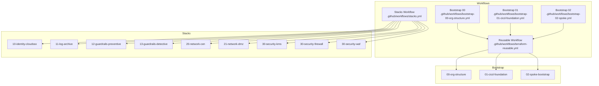
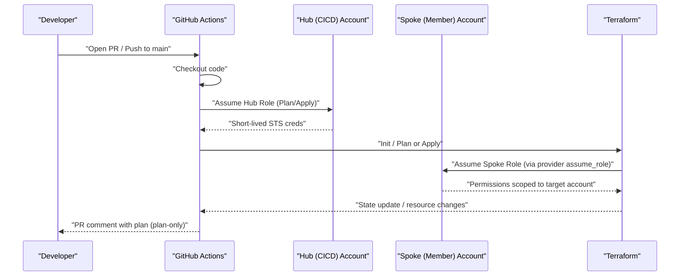
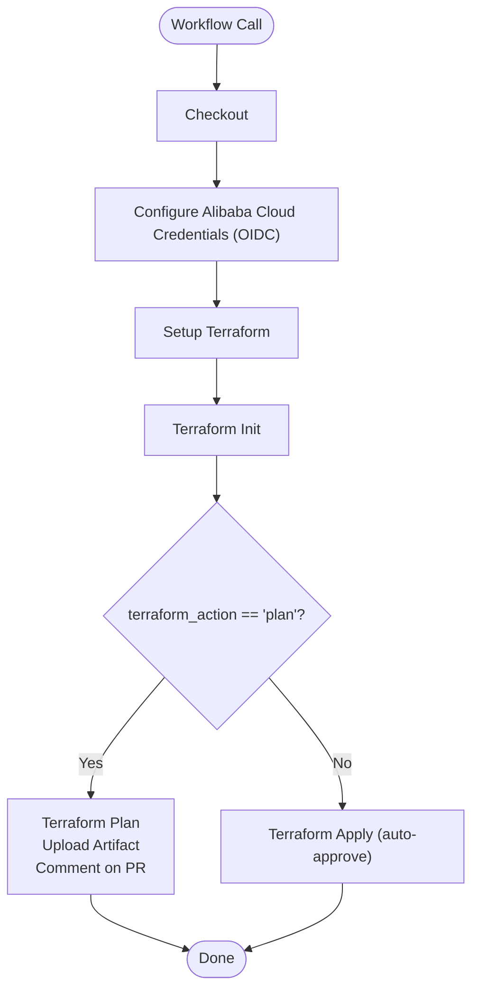
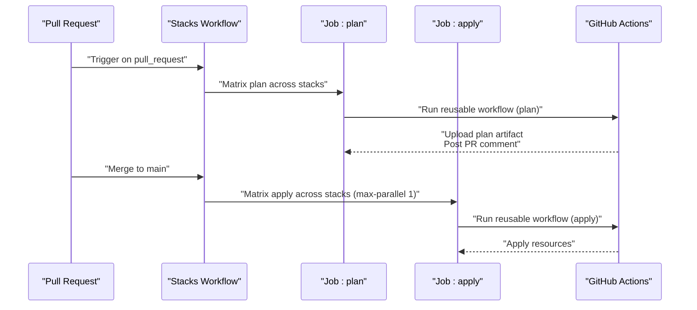
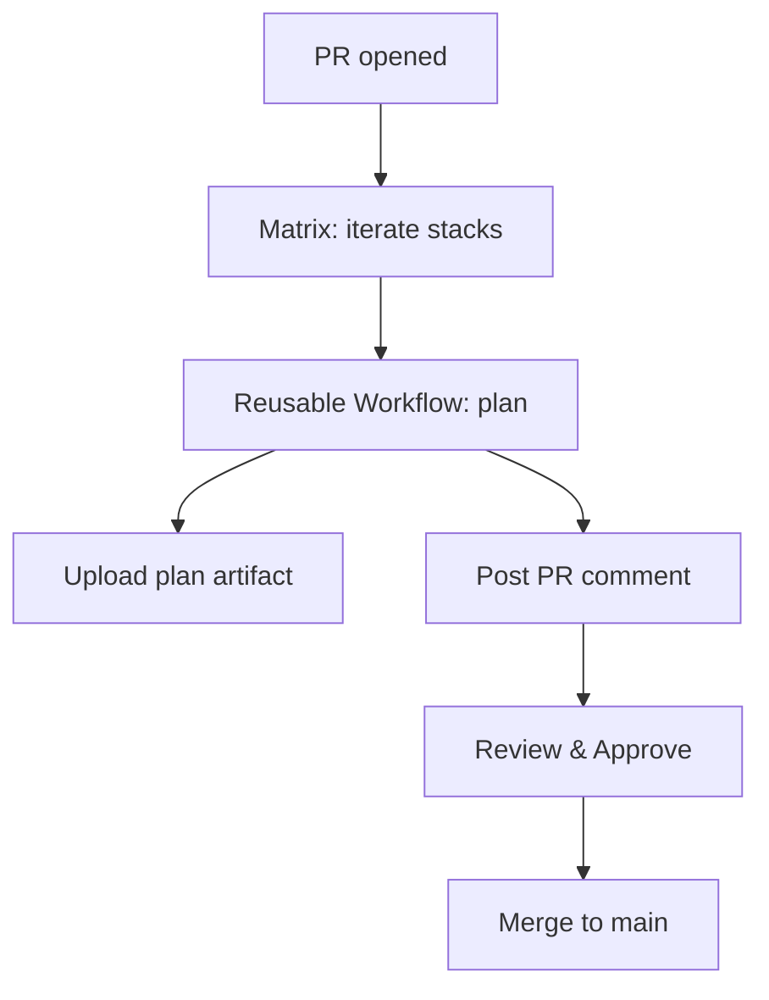
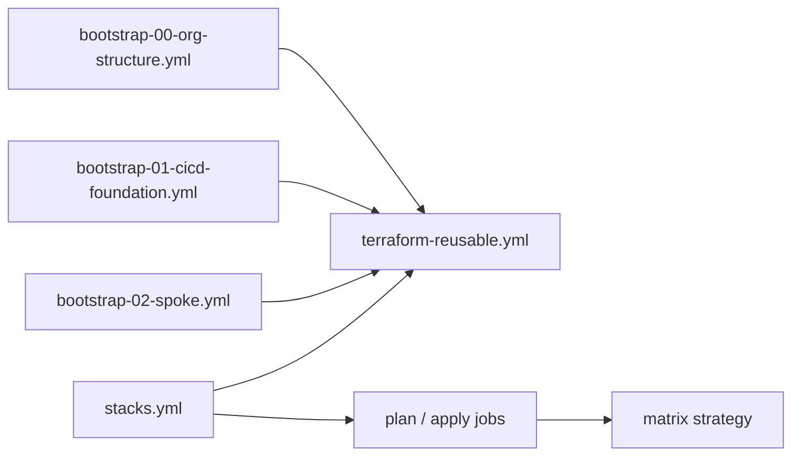
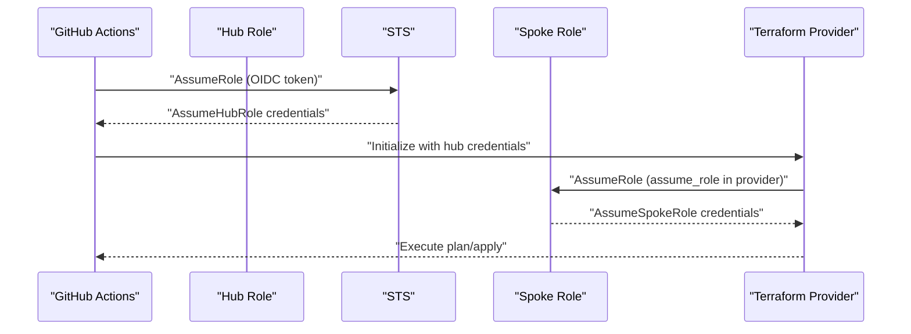
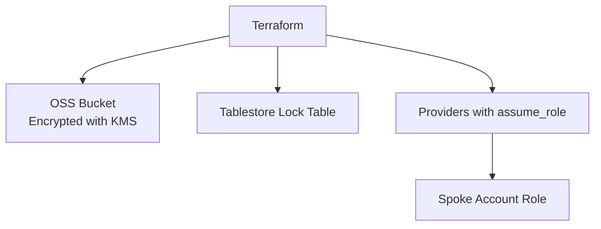
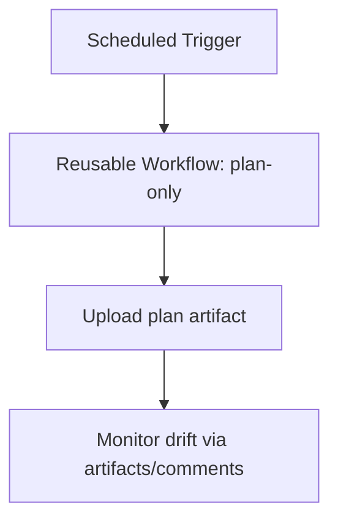
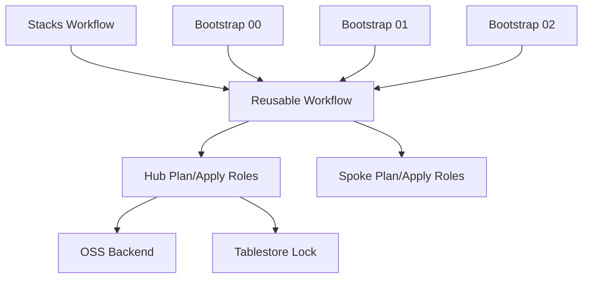

# CI/CD Pipeline Architecture

<cite>
**Referenced Files in This Document**
- [terraform-reusable.yml](file://.github/workflows/terraform-reusable.yml)
- [stacks.yml](file://.github/workflows/stacks.yml)
- [bootstrap-00-org-structure.yml](file://.github/workflows/bootstrap-00-org-structure.yml)
- [bootstrap-01-cicd-foundation.yml](file://.github/workflows/bootstrap-01-cicd-foundation.yml)
- [bootstrap-02-spoke.yml](file://.github/workflows/bootstrap-02-spoke.yml)
- [backend.tf.example](file://bootstrap/01-cicd-foundation/backend.tf.example)
- [main.tf](file://bootstrap/01-cicd-foundation/main.tf)
- [main.tf](file://bootstrap/02-spoke-bootstrap/modules/spoke-roles/main.tf)
- [variables.tf](file://bootstrap/02-spoke-bootstrap/modules/spoke-roles/variables.tf)
- [providers.tf](file://stacks/20-network-cen/providers.tf)
- [variables.tf](file://stacks/20-network-cen/variables.tf)
- [README.md](file://README.md)
</cite>

## Table of Contents
1. [Introduction](#introduction)
2. [Project Structure](#project-structure)
3. [Core Components](#core-components)
4. [Architecture Overview](#architecture-overview)
5. [Detailed Component Analysis](#detailed-component-analysis)
6. [Dependency Analysis](#dependency-analysis)
7. [Performance Considerations](#performance-considerations)
8. [Troubleshooting Guide](#troubleshooting-guide)
9. [Conclusion](#conclusion)
10. [Appendices](#appendices)

## Introduction
This document explains the CI/CD pipeline architecture that orchestrates automated deployment of infrastructure stacks using GitHub Actions and Terraform. It covers the reusable workflow pattern, matrix-driven deployment orchestration, pull request validation, GitHub Actions workflow structure, job dependencies, environment variable configuration, credential flow via OIDC token exchange and role assumption chain, state management integration, plan-only mode for drift detection, scheduled workflow execution, customization, failure handling, and monitoring approaches. It also clarifies how individual stack deployments relate to the overall deployment strategy.

## Project Structure
The repository is organized into three primary areas:
- Workflows: Reusable workflow and stack orchestration workflows under .github/workflows/.
- Bootstrap: Three-phase bootstrap to establish the CI/CD foundation and spoke roles.
- Stacks: Modular infrastructure-as-code stacks under stacks/, each targeting a specific Alibaba Cloud account via a spoke role.

**Diagram sources**
- [terraform-reusable.yml](file://.github/workflows/terraform-reusable.yml)
- [stacks.yml](file://.github/workflows/stacks.yml)
- [bootstrap-00-org-structure.yml](file://.github/workflows/bootstrap-00-org-structure.yml)
- [bootstrap-01-cicd-foundation.yml](file://.github/workflows/bootstrap-01-cicd-foundation.yml)
- [bootstrap-02-spoke.yml](file://.github/workflows/bootstrap-02-spoke.yml)

**Section sources**
- [README.md:141-165](file://README.md#L141-L165)

## Core Components
- Reusable Workflow: Provides a standardized, composable job that configures Alibaba Cloud credentials via OIDC, initializes Terraform, performs plan or apply, and optionally uploads plan artifacts and posts PR comments.
- Stacks Workflow: Orchestrates matrix-driven deployment across stacks, enforcing plan on pull requests and apply on pushes to main with controlled concurrency.
- Bootstrap Workflows: Delegate to the reusable workflow to provision bootstrap resources (organization structure, CI/CD foundation, spoke roles).
- State Management: Uses OSS backend with Tablestore-based locking; includes migration guidance and backend configuration examples.
- Credential Flow: GitHub OIDC token exchanged for short-lived STS credentials via hub roles, then chained to spoke roles per target account.

**Section sources**
- [terraform-reusable.yml:1-118](file://.github/workflows/terraform-reusable.yml#L1-L118)
- [stacks.yml:1-112](file://.github/workflows/stacks.yml#L1-L112)
- [bootstrap-00-org-structure.yml:1-36](file://.github/workflows/bootstrap-00-org-structure.yml#L1-L36)
- [bootstrap-01-cicd-foundation.yml:1-36](file://.github/workflows/bootstrap-01-cicd-foundation.yml#L1-L36)
- [bootstrap-02-spoke.yml:1-36](file://.github/workflows/bootstrap-02-spoke.yml#L1-L36)
- [backend.tf.example:1-23](file://bootstrap/01-cicd-foundation/backend.tf.example#L1-L23)

## Architecture Overview
The pipeline enforces least-privilege, account isolation, and secure state management:
- Pull Requests trigger plan-only runs across stacks.
- Merges to main trigger apply runs with strict environment gating.
- Credentials flow: GitHub OIDC token → Hub Plan/Apply Role → Spoke Plan/Apply Role → Alibaba Cloud provider.
- State is stored in OSS with KMS encryption and locked via Tablestore.

**Diagram sources**
- [terraform-reusable.yml:50-56](file://.github/workflows/terraform-reusable.yml#L50-L56)
- [providers.tf:1-9](file://stacks/20-network-cen/providers.tf#L1-L9)
- [main.tf](file://bootstrap/01-cicd-foundation/main.tf)
- [main.tf](file://bootstrap/02-spoke-bootstrap/modules/spoke-roles/main.tf)

## Detailed Component Analysis

### Reusable Workflow Pattern
The reusable workflow encapsulates:
- Inputs: working_directory, terraform_version, role_to_assume, oidc_provider_arn, spoke_role_arn, terraform_action.
- Permissions: id-token write for OIDC, pull-requests write for PR comments.
- Steps:
  - Checkout
  - Configure Alibaba Cloud credentials via OIDC action
  - Setup Terraform
  - Init
  - Plan (with artifact upload and PR comment)
  - Apply (auto-approve in production environment)

**Diagram sources**
- [terraform-reusable.yml:3-36](file://.github/workflows/terraform-reusable.yml#L3-L36)
- [terraform-reusable.yml:46-118](file://.github/workflows/terraform-reusable.yml#L46-L118)

**Section sources**
- [terraform-reusable.yml:1-118](file://.github/workflows/terraform-reusable.yml#L1-L118)

### Matrix-Driven Deployment Orchestration
The stacks workflow:
- Triggers on pull_request (paths restricted to stacks) and push to main (paths restricted to stacks).
- Uses a matrix to iterate over stacks and assigns each to a spoke account via a JSON map variable.
- On pull_request: runs plan-only across all stacks; uploads plan artifacts and posts PR comments.
- On push to main: runs apply with max-parallel 1 to serialize changes across stacks.

**Diagram sources**
- [stacks.yml:3-17](file://.github/workflows/stacks.yml#L3-L17)
- [stacks.yml:18-112](file://.github/workflows/stacks.yml#L18-L112)

**Section sources**
- [stacks.yml:1-112](file://.github/workflows/stacks.yml#L1-L112)

### Pull Request Validation Process
- Plan-only mode is enforced for pull requests.
- Each stack’s plan is uploaded as an artifact and posted as a PR comment.
- Environment variable ACCOUNT_ID is resolved from a JSON map keyed by account category.
- The reusable workflow injects TF_VAR_spoke_role_arn for provider assume_role.

**Diagram sources**
- [stacks.yml:19-68](file://.github/workflows/stacks.yml#L19-L68)
- [terraform-reusable.yml:65-112](file://.github/workflows/terraform-reusable.yml#L65-L112)

**Section sources**
- [stacks.yml:19-68](file://.github/workflows/stacks.yml#L19-L68)
- [terraform-reusable.yml:65-112](file://.github/workflows/terraform-reusable.yml#L65-L112)

### GitHub Actions Workflow Structure and Job Dependencies
- Bootstrap workflows delegate to the reusable workflow with plan and apply jobs.
- Stacks workflow defines two jobs: plan (pull_request) and apply (push to main), each with matrix strategies.
- The apply job sets environment: production and max-parallel: 1 to avoid concurrent applies.

**Diagram sources**
- [bootstrap-00-org-structure.yml:18-36](file://.github/workflows/bootstrap-00-org-structure.yml#L18-L36)
- [bootstrap-01-cicd-foundation.yml:18-36](file://.github/workflows/bootstrap-01-cicd-foundation.yml#L18-L36)
- [bootstrap-02-spoke.yml:18-36](file://.github/workflows/bootstrap-02-spoke.yml#L18-L36)
- [stacks.yml:18-112](file://.github/workflows/stacks.yml#L18-L112)

**Section sources**
- [bootstrap-00-org-structure.yml:18-36](file://.github/workflows/bootstrap-00-org-structure.yml#L18-L36)
- [bootstrap-01-cicd-foundation.yml:18-36](file://.github/workflows/bootstrap-01-cicd-foundation.yml#L18-L36)
- [bootstrap-02-spoke.yml:18-36](file://.github/workflows/bootstrap-02-spoke.yml#L18-L36)
- [stacks.yml:18-112](file://.github/workflows/stacks.yml#L18-L112)

### Environment Variable Configuration
Required repository variables:
- HUB_ACCOUNT_ID: CICD hub account ID.
- GHA_PLAN_ROLE_ARN: Plan role ARN in the hub account.
- GHA_APPLY_ROLE_ARN: Apply role ARN in the hub account.
- OIDC_PROVIDER_ARN: OIDC provider ARN in the hub account.
- SPOKE_ACCOUNT_IDS_JSON: JSON map of spoke accounts keyed by category.

These variables are consumed by workflows to configure OIDC and resolve target account IDs for each stack.

**Section sources**
- [README.md:96-105](file://README.md#L96-L105)
- [stacks.yml:37-90](file://.github/workflows/stacks.yml#L37-L90)

### Credential Flow: OIDC Token Exchange and Role Assumption Chain
- GitHub OIDC token is exchanged for short-lived STS credentials in the hub account using the configured OIDC provider and hub role.
- The Alibaba Cloud provider in each stack assumes the spoke role via assume_role, scoped to the target account.
- Spoke roles are defined per account and attached to the hub roles for trust.

**Diagram sources**
- [terraform-reusable.yml:50-56](file://.github/workflows/terraform-reusable.yml#L50-L56)
- [providers.tf:1-9](file://stacks/20-network-cen/providers.tf#L1-L9)
- [main.tf](file://bootstrap/02-spoke-bootstrap/modules/spoke-roles/main.tf)
- [variables.tf:1-4](file://bootstrap/02-spoke-bootstrap/modules/spoke-roles/variables.tf#L1-L4)

**Section sources**
- [terraform-reusable.yml:50-56](file://.github/workflows/terraform-reusable.yml#L50-L56)
- [providers.tf:1-9](file://stacks/20-network-cen/providers.tf#L1-L9)
- [main.tf](file://bootstrap/02-spoke-bootstrap/modules/spoke-roles/main.tf)
- [variables.tf:1-4](file://bootstrap/02-spoke-bootstrap/modules/spoke-roles/variables.tf#L1-L4)

### State Management Integration
- The CI/CD foundation creates an OSS bucket for state and a Tablestore table for locking.
- The backend.tf.example demonstrates how to migrate local state to OSS after applying the foundation.
- The Alibaba Cloud provider is configured to use assume_role with a spoke role per stack.

**Diagram sources**
- [backend.tf.example:13-22](file://bootstrap/01-cicd-foundation/backend.tf.example#L13-L22)
- [main.tf](file://bootstrap/01-cicd-foundation/main.tf)
- [providers.tf:1-9](file://stacks/20-network-cen/providers.tf#L1-L9)

**Section sources**
- [backend.tf.example:1-23](file://bootstrap/01-cicd-foundation/backend.tf.example#L1-L23)
- [main.tf](file://bootstrap/01-cicd-foundation/main.tf)
- [providers.tf:1-9](file://stacks/20-network-cen/providers.tf#L1-L9)

### Plan-Only Mode for Drift Detection and Scheduled Execution
- The reusable workflow supports plan-only mode via the terraform_action input.
- The stacks workflow runs plan-only on pull requests.
- Drift detection can be achieved by scheduling plan-only runs (e.g., nightly) using cron triggers.

**Diagram sources**
- [README.md:129-139](file://README.md#L129-L139)
- [terraform-reusable.yml:28-32](file://.github/workflows/terraform-reusable.yml#L28-L32)

**Section sources**
- [README.md:129-139](file://README.md#L129-L139)
- [terraform-reusable.yml:28-32](file://.github/workflows/terraform-reusable.yml#L28-L32)

### Relationship Between Individual Stack Deployments and Overall Strategy
- Each stack targets a specific spoke account via a spoke role, ensuring account isolation.
- The stacks workflow coordinates deployment across stacks while respecting account boundaries.
- Bootstrap phases establish the OIDC provider, hub roles, and spoke roles, enabling secure, composable deployments.

**Section sources**
- [stacks.yml:22-34](file://.github/workflows/stacks.yml#L22-L34)
- [main.tf](file://bootstrap/02-spoke-bootstrap/modules/spoke-roles/main.tf)
- [README.md:89-95](file://README.md#L89-L95)

## Dependency Analysis
- Workflow Coupling:
  - Bootstrap workflows depend on the reusable workflow for plan/apply.
  - Stacks workflow depends on the reusable workflow and on repository variables for spoke account resolution.
- External Dependencies:
  - Alibaba Cloud OIDC provider and hub roles.
  - OSS backend and Tablestore lock for state.
- Potential Circular Dependencies:
  - None observed; workflows are layered (bootstrap -> stacks) and composable.

**Diagram sources**
- [terraform-reusable.yml:15-27](file://.github/workflows/terraform-reusable.yml#L15-L27)
- [stacks.yml:37-90](file://.github/workflows/stacks.yml#L37-L90)
- [main.tf](file://bootstrap/01-cicd-foundation/main.tf)
- [main.tf](file://bootstrap/02-spoke-bootstrap/modules/spoke-roles/main.tf)

**Section sources**
- [terraform-reusable.yml:15-27](file://.github/workflows/terraform-reusable.yml#L15-L27)
- [stacks.yml:37-90](file://.github/workflows/stacks.yml#L37-L90)
- [main.tf](file://bootstrap/01-cicd-foundation/main.tf)
- [main.tf](file://bootstrap/02-spoke-bootstrap/modules/spoke-roles/main.tf)

## Performance Considerations
- Concurrency Control: The stacks workflow limits apply concurrency to 1 to prevent state contention and race conditions during state updates.
- Parallelization: Plan jobs across stacks run in parallel to accelerate feedback loops.
- Artifact Size: PR comments truncate long plans to avoid exceeding comment size limits.
- State Efficiency: OSS backend with versioning and KMS encryption ensures reliable, encrypted state storage.

**Section sources**
- [stacks.yml:73-75](file://.github/workflows/stacks.yml#L73-L75)
- [stacks.yml:86-88](file://.github/workflows/stacks.yml#L86-L88)
- [terraform-reusable.yml:88-111](file://.github/workflows/terraform-reusable.yml#L88-L111)
- [backend.tf.example:10-22](file://bootstrap/01-cicd-foundation/backend.tf.example#L10-L22)

## Troubleshooting Guide
Common issues and remedies:
- OIDC Authentication Failures:
  - Verify OIDC provider ARN and hub role ARNs are set in repository variables.
  - Confirm the reusable workflow permissions include id-token write.
- Insufficient Privileges:
  - Ensure SpokePlanRole/SpokeApplyRole trust the hub roles and policies match intended scope.
- State Lock Conflicts:
  - Apply jobs are serialized; ensure no concurrent applies are attempted.
- Plan Artifacts and PR Comments:
  - Confirm plan-only runs upload artifacts and comments are posted; check comment truncation behavior.
- State Migration:
  - Follow backend migration steps after applying the CI/CD foundation.

**Section sources**
- [terraform-reusable.yml:33-36](file://.github/workflows/terraform-reusable.yml#L33-L36)
- [main.tf](file://bootstrap/02-spoke-bootstrap/modules/spoke-roles/main.tf)
- [stacks.yml:72-75](file://.github/workflows/stacks.yml#L72-L75)
- [backend.tf.example:1-23](file://bootstrap/01-cicd-foundation/backend.tf.example#L1-L23)

## Conclusion
This CI/CD pipeline establishes a secure, composable, and auditable deployment strategy for Alibaba Cloud Landing Zone infrastructure. By leveraging OIDC-based credentials, role assumption chains, and matrix-driven orchestration, it enforces least privilege, account isolation, and safe state management. The reusable workflow pattern simplifies maintenance and standardizes behavior across bootstrap and stack deployments, while plan-only and scheduled runs support continuous drift detection and operational visibility.

## Appendices

### Appendix A: Adding a New Stack
Steps to onboard a new stack:
- Copy an existing stack as a template.
- Update providers.tf and variables.tf to target the desired spoke account.
- Add the new stack to the matrix in the stacks workflow.
- Open a PR to validate the plan.

**Section sources**
- [README.md:122-128](file://README.md#L122-L128)
- [stacks.yml:22-34](file://.github/workflows/stacks.yml#L22-L34)

### Appendix B: Adding a New Spoke Account
Steps to onboard a new spoke account:
- Add the account to the spokes variable in the spoke bootstrap module.
- Apply the spoke bootstrap module.
- Update SPOKE_ACCOUNT_IDS_JSON in repository variables.

**Section sources**
- [README.md:116-121](file://README.md#L116-L121)
- [variables.tf:1-4](file://bootstrap/02-spoke-bootstrap/modules/spoke-roles/variables.tf#L1-L4)

### Appendix C: Monitoring and Observability
Recommendations:
- Monitor PR comments for plan summaries and apply logs.
- Track plan artifacts for historical drift comparisons.
- Observe scheduled runs for periodic drift detection.
- Use GitHub environments and required reviewers for apply approvals.

**Section sources**
- [README.md:129-139](file://README.md#L129-L139)
- [stacks.yml:72-75](file://.github/workflows/stacks.yml#L72-L75)