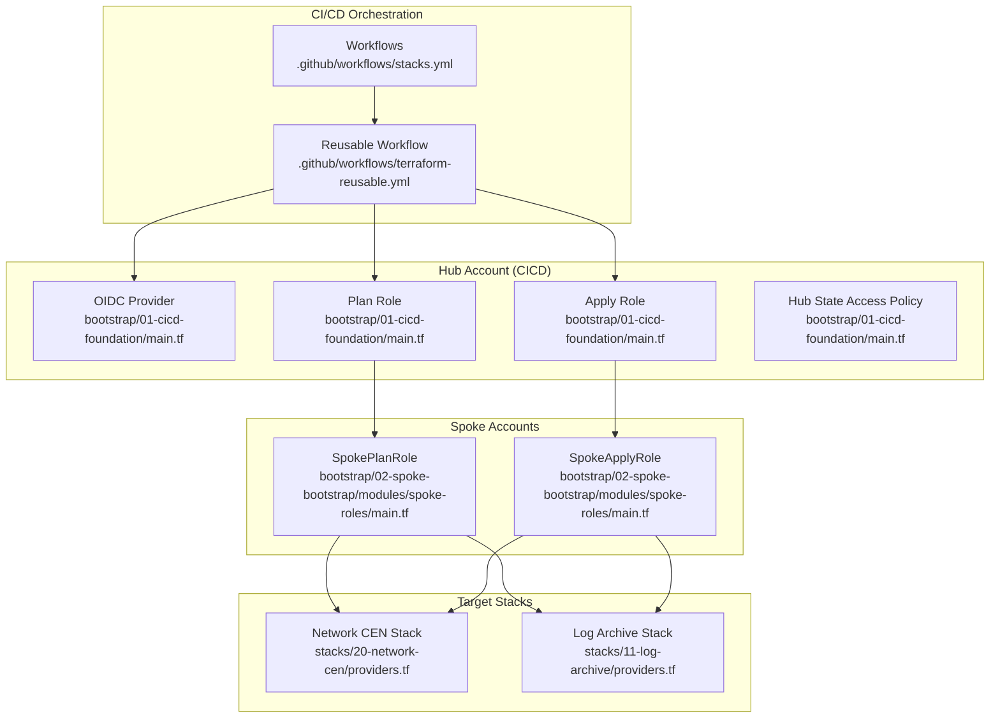
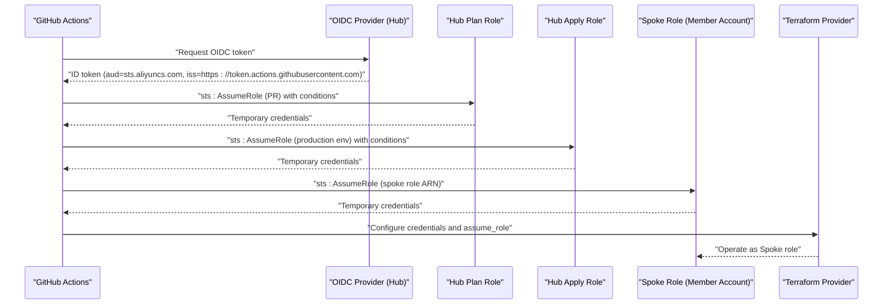
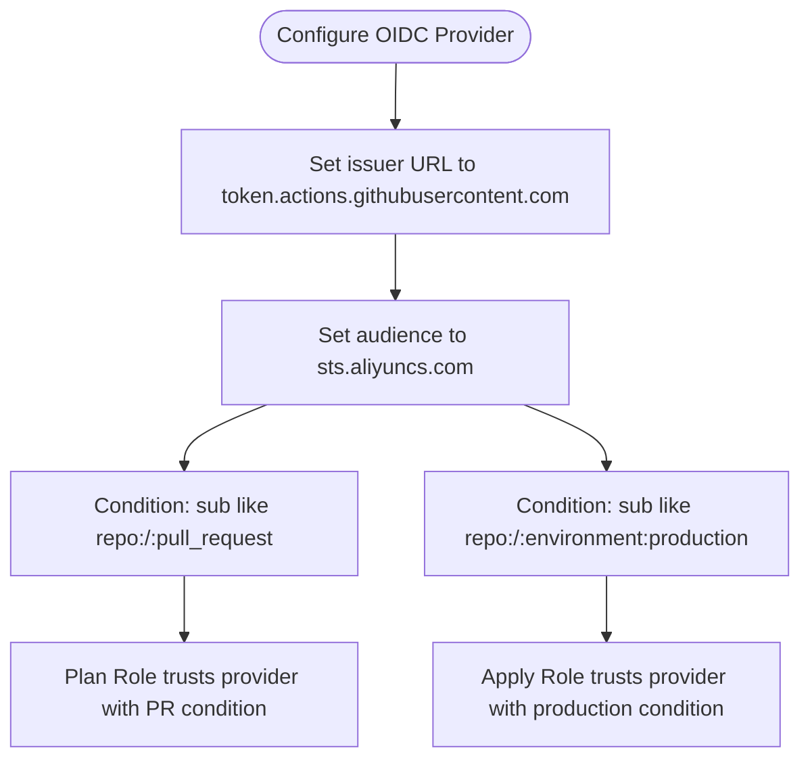
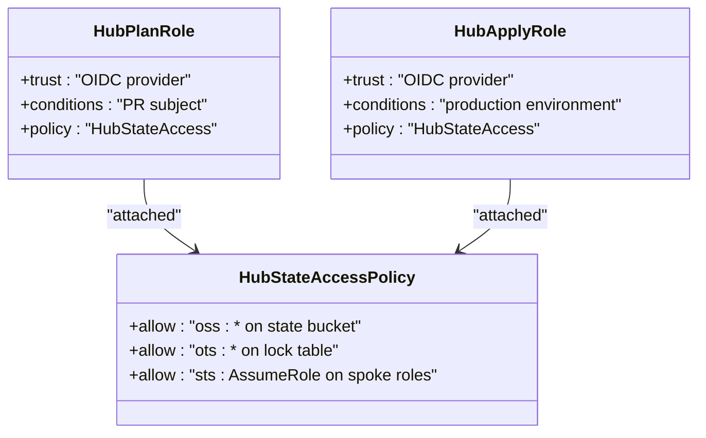
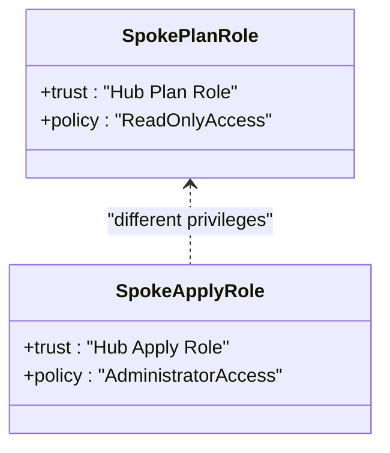
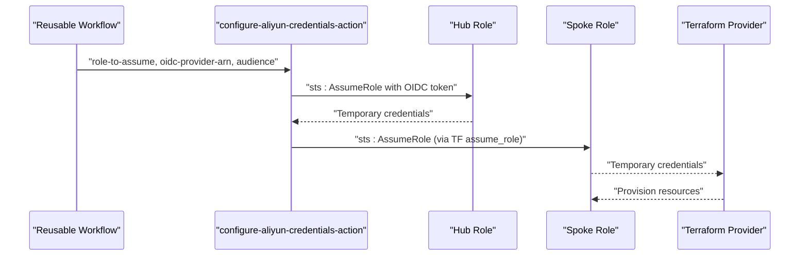
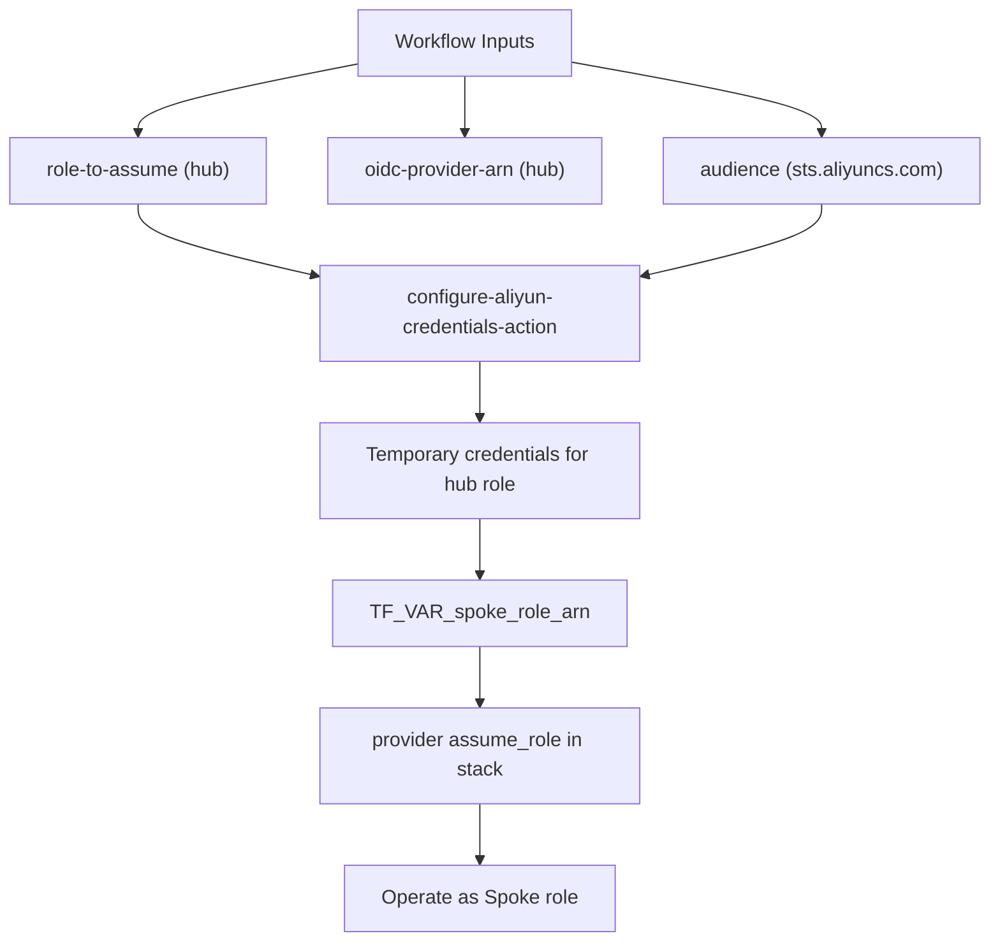
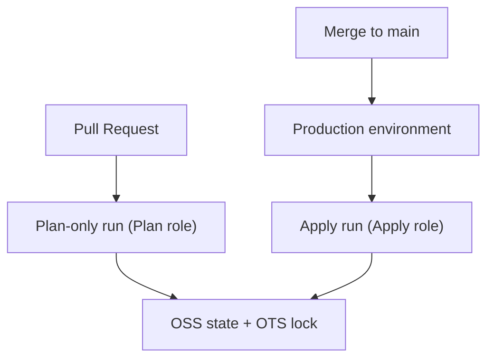
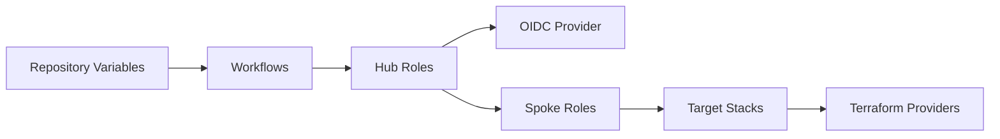

# Credential Flow and Security

<cite>
**Referenced Files in This Document**
- [README.md](file://README.md)
- [terraform-reusable.yml](file://.github/workflows/terraform-reusable.yml)
- [stacks.yml](file://.github/workflows/stacks.yml)
- [01-cicd-foundation/main.tf](file://bootstrap/01-cicd-foundation/main.tf)
- [01-cicd-foundation/variables.tf](file://bootstrap/01-cicd-foundation/variables.tf)
- [01-cicd-foundation/outputs.tf](file://bootstrap/01-cicd-foundation/outputs.tf)
- [02-spoke-bootstrap/main.tf](file://bootstrap/02-spoke-bootstrap/main.tf)
- [02-spoke-bootstrap/modules/spoke-roles/main.tf](file://bootstrap/02-spoke-bootstrap/modules/spoke-roles/main.tf)
- [02-spoke-bootstrap/variables.tf](file://bootstrap/02-spoke-bootstrap/variables.tf)
- [20-network-cen/providers.tf](file://stacks/20-network-cen/providers.tf)
- [20-network-cen/variables.tf](file://stacks/20-network-cen/variables.tf)
- [11-log-archive/providers.tf](file://stacks/11-log-archive/providers.tf)
- [11-log-archive/variables.tf](file://stacks/11-log-archive/variables.tf)
</cite>

## Table of Contents
1. [Introduction](#introduction)
2. [Project Structure](#project-structure)
3. [Core Components](#core-components)
4. [Architecture Overview](#architecture-overview)
5. [Detailed Component Analysis](#detailed-component-analysis)
6. [Dependency Analysis](#dependency-analysis)
7. [Performance Considerations](#performance-considerations)
8. [Troubleshooting Guide](#troubleshooting-guide)
9. [Conclusion](#conclusion)
10. [Appendices](#appendices)

## Introduction
This document explains the secure credential flow architecture that eliminates long-lived secrets by leveraging OIDC token exchange across three roles: GitHub Actions OIDC token, hub role in the CICD account, spoke role in a member account, and finally the target resources. It covers OIDC provider configuration, role trust policies, audience validation, credential configuration action setup, role-to-assume parameters, and audience specification. It also documents security considerations, including least-privilege principles, separation between Plan and Apply permissions, environment isolation, and audit trail generation.

## Project Structure
The repository is organized into three phases of bootstrapping and multiple stacks for provisioning. The CI/CD pipeline orchestrates Terraform runs through GitHub Actions, using OIDC to assume progressively narrower roles.

**Diagram sources**
- [stacks.yml:1-112](file://.github/workflows/stacks.yml#L1-L112)
- [terraform-reusable.yml:1-118](file://.github/workflows/terraform-reusable.yml#L1-L118)
- [01-cicd-foundation/main.tf:49-105](file://bootstrap/01-cicd-foundation/main.tf#L49-L105)
- [02-spoke-bootstrap/modules/spoke-roles/main.tf:3-41](file://bootstrap/02-spoke-bootstrap/modules/spoke-roles/main.tf#L3-L41)
- [20-network-cen/providers.tf:1-9](file://stacks/20-network-cen/providers.tf#L1-L9)
- [11-log-archive/providers.tf:1-9](file://stacks/11-log-archive/providers.tf#L1-L9)

**Section sources**
- [README.md:141-165](file://README.md#L141-L165)
- [stacks.yml:1-112](file://.github/workflows/stacks.yml#L1-L112)
- [terraform-reusable.yml:1-118](file://.github/workflows/terraform-reusable.yml#L1-L118)
- [01-cicd-foundation/main.tf:49-105](file://bootstrap/01-cicd-foundation/main.tf#L49-L105)
- [02-spoke-bootstrap/modules/spoke-roles/main.tf:3-41](file://bootstrap/02-spoke-bootstrap/modules/spoke-roles/main.tf#L3-L41)
- [20-network-cen/providers.tf:1-9](file://stacks/20-network-cen/providers.tf#L1-L9)
- [11-log-archive/providers.tf:1-9](file://stacks/11-log-archive/providers.tf#L1-L9)

## Core Components
- OIDC Provider in the hub account: Defines the identity provider and validates audience and issuer claims.
- Hub Roles (Plan and Apply): Trust the OIDC provider with conditions for pull request vs production environment.
- Hub Policies: Grant access to state infrastructure and the ability to assume spoke roles.
- Spoke Roles: Trust the hub roles and are scoped to individual member accounts.
- Target Stacks: Use Terraform provider assume_role to chain to the spoke role for resource provisioning.
- Workflows: Configure OIDC credentials and pass spoke role ARNs to Terraform.

**Section sources**
- [01-cicd-foundation/main.tf:49-105](file://bootstrap/01-cicd-foundation/main.tf#L49-L105)
- [01-cicd-foundation/main.tf:112-149](file://bootstrap/01-cicd-foundation/main.tf#L112-L149)
- [02-spoke-bootstrap/modules/spoke-roles/main.tf:3-41](file://bootstrap/02-spoke-bootstrap/modules/spoke-roles/main.tf#L3-L41)
- [20-network-cen/providers.tf:1-9](file://stacks/20-network-cen/providers.tf#L1-L9)
- [stacks.yml:42-111](file://.github/workflows/stacks.yml#L42-L111)
- [terraform-reusable.yml:50-56](file://.github/workflows/terraform-reusable.yml#L50-L56)

## Architecture Overview
The credential flow follows a strict multi-tier assumption chain:
- GitHub Actions obtains an OIDC token from token.actions.githubusercontent.com.
- The OIDC token is exchanged for a short-lived hub role session in the CICD account.
- The hub role assumes a spoke role in the target member account.
- The spoke role is used by the Terraform provider to provision resources.

**Diagram sources**
- [01-cicd-foundation/main.tf:61-105](file://bootstrap/01-cicd-foundation/main.tf#L61-L105)
- [02-spoke-bootstrap/modules/spoke-roles/main.tf:3-41](file://bootstrap/02-spoke-bootstrap/modules/spoke-roles/main.tf#L3-L41)
- [stacks.yml:42-111](file://.github/workflows/stacks.yml#L42-L111)
- [terraform-reusable.yml:50-56](file://.github/workflows/terraform-reusable.yml#L50-L56)
- [20-network-cen/providers.tf:1-9](file://stacks/20-network-cen/providers.tf#L1-L9)

## Detailed Component Analysis

### OIDC Provider Configuration
- Provider name and issuer URL are defined in the hub account.
- Audience is restricted to the Alibaba Cloud STS service.
- Conditions restrict token subjects to pull requests or production environments depending on the hub role.

**Diagram sources**
- [01-cicd-foundation/main.tf:49-105](file://bootstrap/01-cicd-foundation/main.tf#L49-L105)

**Section sources**
- [01-cicd-foundation/main.tf:49-105](file://bootstrap/01-cicd-foundation/main.tf#L49-L105)
- [01-cicd-foundation/variables.tf:12-15](file://bootstrap/01-cicd-foundation/variables.tf#L12-L15)

### Hub Roles and Trust Policies
- Plan Role: Read-only, used during pull requests; trusts the OIDC provider with PR-specific subject condition.
- Apply Role: Read-write, restricted to the production environment; trusts the OIDC provider with production environment condition.
- Both roles inherit a policy granting access to OSS state and OTS locks, and the ability to assume spoke roles.

**Diagram sources**
- [01-cicd-foundation/main.tf:61-105](file://bootstrap/01-cicd-foundation/main.tf#L61-L105)
- [01-cicd-foundation/main.tf:112-149](file://bootstrap/01-cicd-foundation/main.tf#L112-L149)

**Section sources**
- [01-cicd-foundation/main.tf:61-105](file://bootstrap/01-cicd-foundation/main.tf#L61-L105)
- [01-cicd-foundation/main.tf:112-149](file://bootstrap/01-cicd-foundation/main.tf#L112-L149)

### Spoke Roles and Least-Privilege Principle
- SpokePlanRole: Trusted by the hub’s Plan Role; attached to a managed ReadOnlyAccess policy.
- SpokeApplyRole: Trusted by the hub’s Apply Role; attached to a managed AdministratorAccess policy.
- Each spoke role is scoped to a single member account, enforcing account isolation.

**Diagram sources**
- [02-spoke-bootstrap/modules/spoke-roles/main.tf:3-41](file://bootstrap/02-spoke-bootstrap/modules/spoke-roles/main.tf#L3-L41)

**Section sources**
- [02-spoke-bootstrap/modules/spoke-roles/main.tf:3-41](file://bootstrap/02-spoke-bootstrap/modules/spoke-roles/main.tf#L3-L41)
- [02-spoke-bootstrap/main.tf:4-32](file://bootstrap/02-spoke-bootstrap/main.tf#L4-L32)

### Credential Configuration Action Setup
- The reusable workflow accepts role-to-assume and OIDC provider ARN inputs.
- The configure-aliyun-credentials-action is invoked with the hub role ARN and audience set to sts.aliyuncs.com.
- For plan, the workflow uses the Plan role ARN; for apply, it uses the Apply role ARN and sets the production environment.

**Diagram sources**
- [terraform-reusable.yml:50-56](file://.github/workflows/terraform-reusable.yml#L50-L56)
- [stacks.yml:42-111](file://.github/workflows/stacks.yml#L42-L111)

**Section sources**
- [terraform-reusable.yml:15-27](file://.github/workflows/terraform-reusable.yml#L15-L27)
- [terraform-reusable.yml:50-56](file://.github/workflows/terraform-reusable.yml#L50-L56)
- [stacks.yml:42-111](file://.github/workflows/stacks.yml#L42-L111)

### Role-to-Assume Parameters and Audience Specification
- Inputs include role-to-assume (hub role ARN), OIDC provider ARN, and audience (sts.aliyuncs.com).
- The spoke role ARN is passed to Terraform via TF_VAR_spoke_role_arn and configured in the stack’s provider assume_role block.

**Diagram sources**
- [terraform-reusable.yml:15-27](file://.github/workflows/terraform-reusable.yml#L15-L27)
- [20-network-cen/providers.tf:1-9](file://stacks/20-network-cen/providers.tf#L1-L9)

**Section sources**
- [terraform-reusable.yml:15-27](file://.github/workflows/terraform-reusable.yml#L15-L27)
- [20-network-cen/variables.tf:7-10](file://stacks/20-network-cen/variables.tf#L7-L10)
- [20-network-cen/providers.tf:1-9](file://stacks/20-network-cen/providers.tf#L1-L9)

### Environment Isolation and Audit Trail Generation
- Pull request events trigger plan-only runs with the Plan role.
- Production merges trigger apply runs under the production environment, restricting approvals and reviewers.
- State is stored in OSS with server-side encryption and locked via OTS, enabling auditability and concurrency control.

**Diagram sources**
- [stacks.yml:19-111](file://.github/workflows/stacks.yml#L19-L111)
- [01-cicd-foundation/main.tf:5-43](file://bootstrap/01-cicd-foundation/main.tf#L5-L43)

**Section sources**
- [stacks.yml:19-111](file://.github/workflows/stacks.yml#L19-L111)
- [01-cicd-foundation/main.tf:5-43](file://bootstrap/01-cicd-foundation/main.tf#L5-L43)
- [README.md:106-113](file://README.md#L106-L113)

## Dependency Analysis
The system exhibits clear dependency chains:
- Workflows depend on hub role ARNs and the OIDC provider ARN.
- Hub roles depend on the OIDC provider and its conditions.
- Spoke roles depend on hub roles.
- Stacks depend on spoke role ARNs injected via environment variables.

**Diagram sources**
- [stacks.yml:96-99](file://.github/workflows/stacks.yml#L96-L99)
- [01-cicd-foundation/outputs.tf:11-24](file://bootstrap/01-cicd-foundation/outputs.tf#L11-L24)
- [02-spoke-bootstrap/modules/spoke-roles/main.tf:3-41](file://bootstrap/02-spoke-bootstrap/modules/spoke-roles/main.tf#L3-L41)
- [20-network-cen/providers.tf:1-9](file://stacks/20-network-cen/providers.tf#L1-L9)

**Section sources**
- [stacks.yml:96-99](file://.github/workflows/stacks.yml#L96-L99)
- [01-cicd-foundation/outputs.tf:11-24](file://bootstrap/01-cicd-foundation/outputs.tf#L11-L24)
- [02-spoke-bootstrap/modules/spoke-roles/main.tf:3-41](file://bootstrap/02-spoke-bootstrap/modules/spoke-roles/main.tf#L3-L41)
- [20-network-cen/providers.tf:1-9](file://stacks/20-network-cen/providers.tf#L1-L9)

## Performance Considerations
- Session duration is capped at one hour for all roles, minimizing exposure windows.
- State locking via OTS prevents concurrent applies, avoiding wasted compute and reducing risk of state corruption.
- Using a single hub account for OIDC and role management centralizes control while maintaining least privilege per spoke.

[No sources needed since this section provides general guidance]

## Troubleshooting Guide
Common issues and resolutions:
- OIDC audience mismatch: Ensure the audience is set to sts.aliyuncs.com in the credential configuration action and hub roles.
- Subject condition mismatch: Verify the repository and branch/event pattern matches the hub role’s condition (pull_request vs environment:production).
- Missing spoke role ARN: Confirm TF_VAR_spoke_role_arn is set to the correct member account’s SpokePlanRole or SpokeApplyRole ARN.
- Insufficient hub permissions: Confirm the hub roles are attached to the HubStateAccess policy allowing sts:AssumeRole on spoke roles.
- State backend errors: Validate OSS bucket permissions and OTS lock table access for the hub roles.
- Environment isolation failures: Ensure PR-triggered runs use the Plan role and production environment triggers the Apply role.

**Section sources**
- [terraform-reusable.yml:50-56](file://.github/workflows/terraform-reusable.yml#L50-L56)
- [01-cicd-foundation/main.tf:61-105](file://bootstrap/01-cicd-foundation/main.tf#L61-L105)
- [01-cicd-foundation/main.tf:112-149](file://bootstrap/01-cicd-foundation/main.tf#L112-L149)
- [20-network-cen/providers.tf:1-9](file://stacks/20-network-cen/providers.tf#L1-L9)

## Conclusion
This architecture enforces strong security through OIDC-based short-lived credentials, least-privilege roles, and environment-based gating. The multi-tier assumption chain ensures that no long-lived secrets are required, and each stage of the pipeline operates with minimal privileges. State is encrypted and locked, and audits are supported by repository and cloud logs.

[No sources needed since this section summarizes without analyzing specific files]

## Appendices

### Security Best Practices for Role Management
- Keep hub role session durations short (one hour).
- Restrict OIDC conditions precisely to repository and environment scopes.
- Scope spoke roles per account and minimize permissions (use ReadOnlyAccess for planning).
- Enforce production environment approvals and reviewer requirements.
- Monitor and rotate roles periodically; remove unused roles promptly.

[No sources needed since this section provides general guidance]