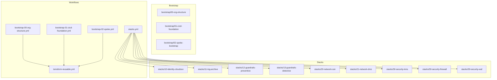
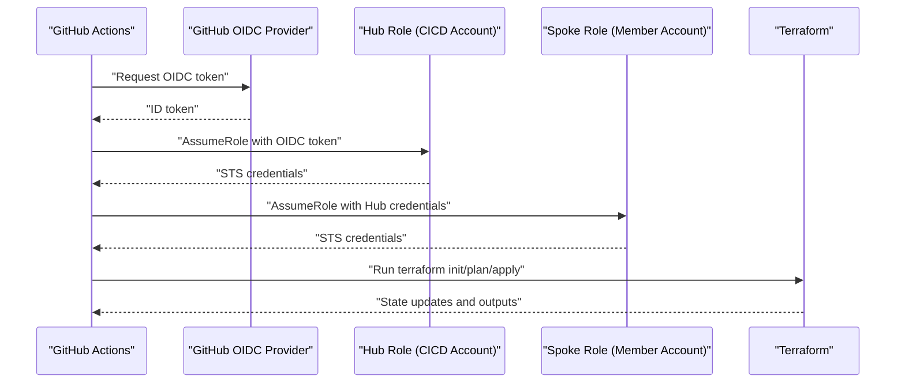
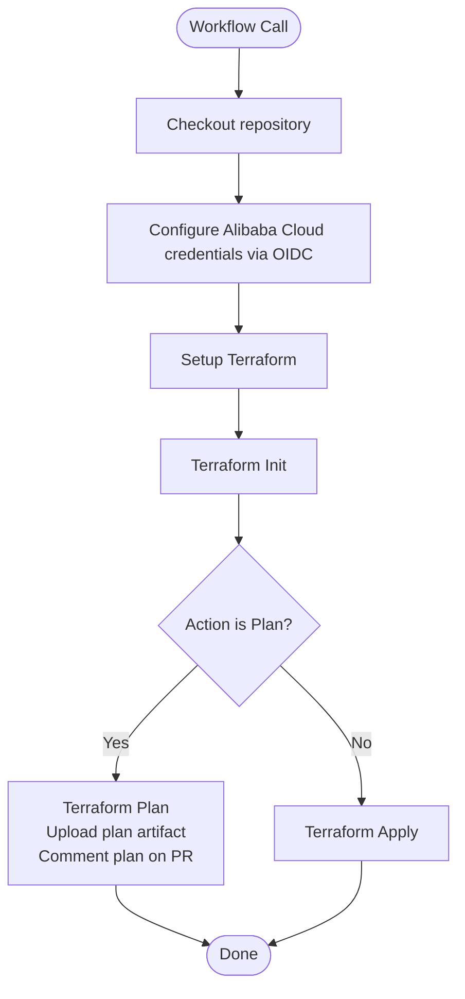
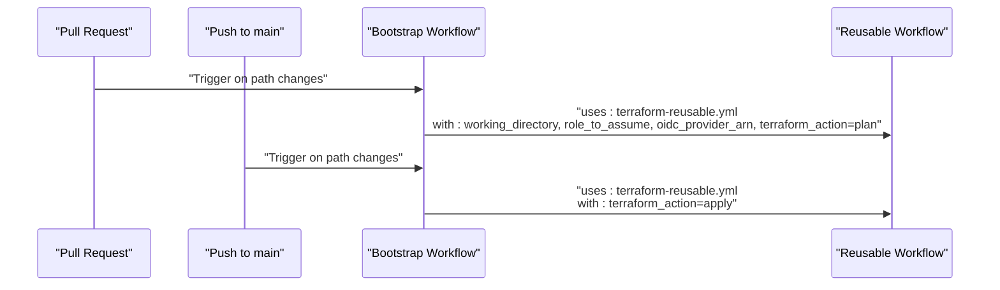
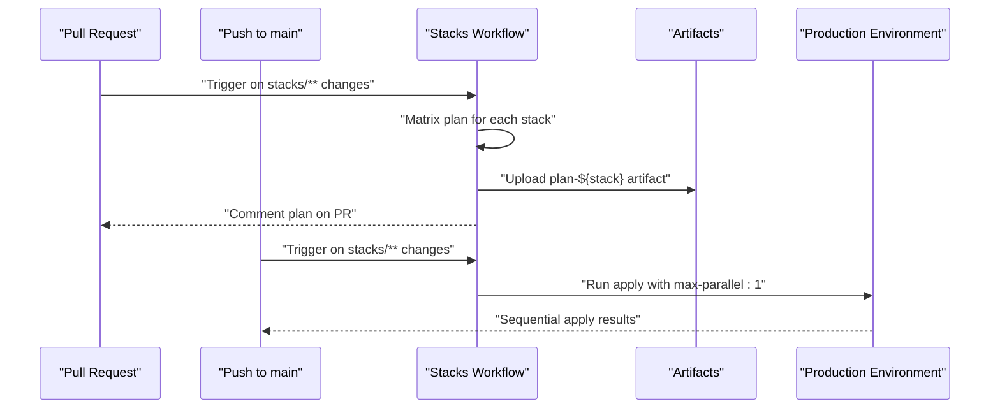
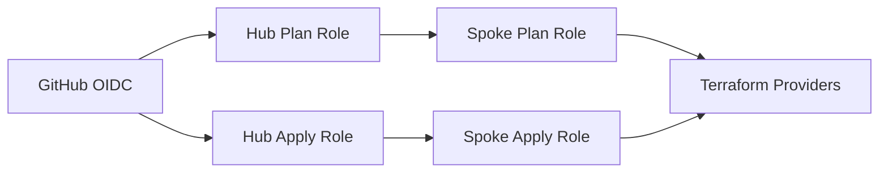
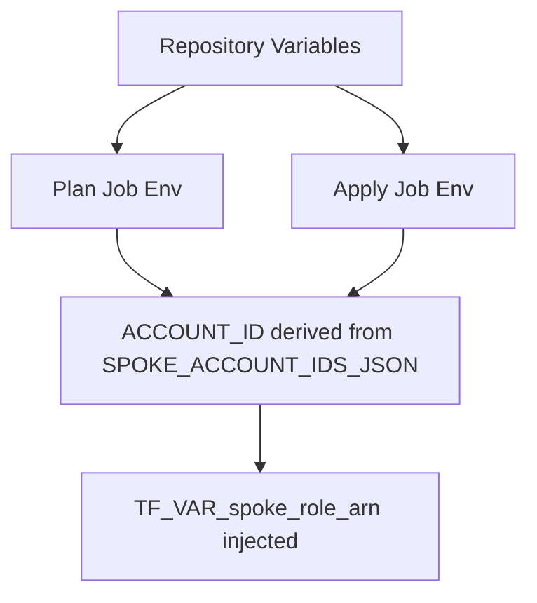
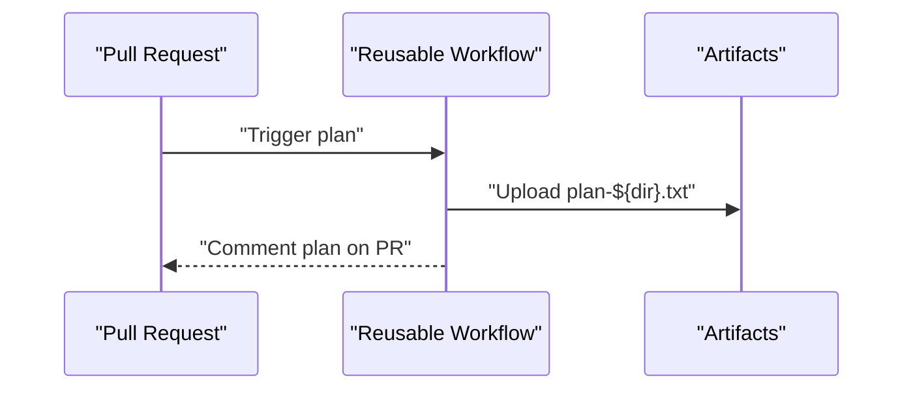
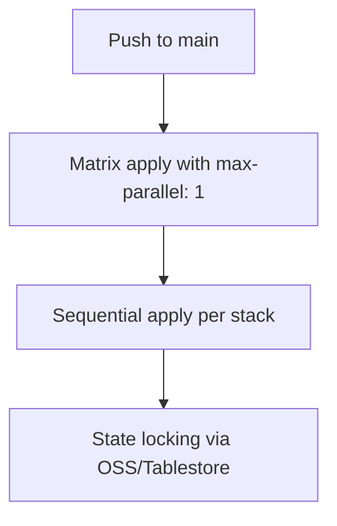
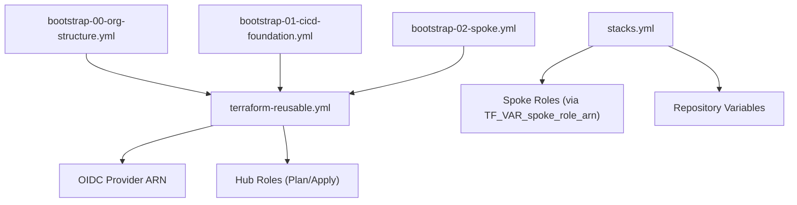

# GitHub Actions Workflows

<cite>
**Referenced Files in This Document**
- [.github/workflows/bootstrap-00-org-structure.yml](file://.github/workflows/bootstrap-00-org-structure.yml)
- [.github/workflows/bootstrap-01-cicd-foundation.yml](file://.github/workflows/bootstrap-01-cicd-foundation.yml)
- [.github/workflows/bootstrap-02-spoke.yml](file://.github/workflows/bootstrap-02-spoke.yml)
- [.github/workflows/stacks.yml](file://.github/workflows/stacks.yml)
- [.github/workflows/terraform-reusable.yml](file://.github/workflows/terraform-reusable.yml)
- [README.md](file://README.md)
- [bootstrap/00-org-structure/variables.tf](file://bootstrap/00-org-structure/variables.tf)
- [bootstrap/01-cicd-foundation/variables.tf](file://bootstrap/01-cicd-foundation/variables.tf)
- [bootstrap/02-spoke-bootstrap/variables.tf](file://bootstrap/02-spoke-bootstrap/variables.tf)
- [bootstrap/01-cicd-foundation/providers.tf](file://bootstrap/01-cicd-foundation/providers.tf)
- [bootstrap/02-spoke-bootstrap/providers.tf](file://bootstrap/02-spoke-bootstrap/providers.tf)
- [stacks/10-identity-cloudsso/variables.tf](file://stacks/10-identity-cloudsso/variables.tf)
- [stacks/20-network-cen/variables.tf](file://stacks/20-network-cen/variables.tf)
- [stacks/20-network-cen/providers.tf](file://stacks/20-network-cen/providers.tf)
- [bootstrap/01-cicd-foundation/backend.tf.example](file://bootstrap/01-cicd-foundation/backend.tf.example)
</cite>

## Table of Contents
1. [Introduction](#introduction)
2. [Project Structure](#project-structure)
3. [Core Components](#core-components)
4. [Architecture Overview](#architecture-overview)
5. [Detailed Component Analysis](#detailed-component-analysis)
6. [Dependency Analysis](#dependency-analysis)
7. [Performance Considerations](#performance-considerations)
8. [Troubleshooting Guide](#troubleshooting-guide)
9. [Conclusion](#conclusion)
10. [Appendices](#appendices)

## Introduction
This document explains the GitHub Actions workflow architecture that automates Alibaba Cloud infrastructure deployment using Terraform. It covers:
- The reusable workflow pattern used across bootstrap and stack deployment processes
- A matrix-driven deployment strategy that parallelizes stack deployments while respecting dependency ordering
- Pull request validation via plan-only mode and production deployment via sequential apply
- Workflow triggers (push/pull_request), permissions configuration, and environment variable management
- Credential flow through OIDC token exchange and role assumption chain
- Customization guidelines, failure handling, and artifact management for plan outputs

## Project Structure
The repository organizes deployment into two stages:
- Bootstrap: foundational resources and CI/CD enablement
- Stacks: repeatable, modular infrastructure components deployed across spoke accounts

**Diagram sources**
- [.github/workflows/bootstrap-00-org-structure.yml:1-36](file://.github/workflows/bootstrap-00-org-structure.yml#L1-L36)
- [.github/workflows/bootstrap-01-cicd-foundation.yml:1-36](file://.github/workflows/bootstrap-01-cicd-foundation.yml#L1-L36)
- [.github/workflows/bootstrap-02-spoke.yml:1-36](file://.github/workflows/bootstrap-02-spoke.yml#L1-L36)
- [.github/workflows/stacks.yml:1-112](file://.github/workflows/stacks.yml#L1-L112)
- [.github/workflows/terraform-reusable.yml:1-118](file://.github/workflows/terraform-reusable.yml#L1-L118)

**Section sources**
- [README.md:141-165](file://README.md#L141-L165)

## Core Components
- Reusable workflow: Centralized Terraform orchestration with OIDC-based credentials, plan/apply actions, and artifact upload for plans.
- Bootstrap workflows: Thin delegators that reuse the reusable workflow for each bootstrap phase.
- Stacks workflow: Matrix-driven orchestration for stack deployments with plan-only PR validation and sequential production apply.

Key capabilities:
- Pull request validation via plan-only mode with plan artifacts and PR comments
- Production apply gated behind a protected environment and sequential execution
- Environment-specific account routing via spoke account keys and JSON-mapped account IDs

**Section sources**
- [.github/workflows/terraform-reusable.yml:1-118](file://.github/workflows/terraform-reusable.yml#L1-L118)
- [.github/workflows/bootstrap-00-org-structure.yml:1-36](file://.github/workflows/bootstrap-00-org-structure.yml#L1-L36)
- [.github/workflows/bootstrap-01-cicd-foundation.yml:1-36](file://.github/workflows/bootstrap-01-cicd-foundation.yml#L1-L36)
- [.github/workflows/bootstrap-02-spoke.yml:1-36](file://.github/workflows/bootstrap-02-spoke.yml#L1-L36)
- [.github/workflows/stacks.yml:1-112](file://.github/workflows/stacks.yml#L1-L112)

## Architecture Overview
The workflows implement a secure, least-privileged credential flow using GitHub OIDC to assume roles in the hub (CICD) account and then in spoke (member) accounts.

**Diagram sources**
- [README.md:28](file://README.md#L28)
- [.github/workflows/terraform-reusable.yml:50-55](file://.github/workflows/terraform-reusable.yml#L50-L55)
- [.github/workflows/stacks.yml:94-99](file://.github/workflows/stacks.yml#L94-L99)

## Detailed Component Analysis

### Reusable Workflow Pattern
The reusable workflow encapsulates:
- OIDC-based credential configuration for Alibaba Cloud
- Terraform setup and initialization
- Conditional plan or apply execution
- Plan artifact upload and PR comment injection
- Environment gating for apply jobs

**Diagram sources**
- [.github/workflows/terraform-reusable.yml:47-117](file://.github/workflows/terraform-reusable.yml#L47-L117)

**Section sources**
- [.github/workflows/terraform-reusable.yml:1-118](file://.github/workflows/terraform-reusable.yml#L1-L118)

### Bootstrap Workflows (Phase 1–3)
Each bootstrap workflow delegates to the reusable workflow with:
- Working directory set to the bootstrap stage
- Role ARNs and OIDC provider ARN supplied via repository variables
- Plan-only on pull_request, apply-only on push to main

**Diagram sources**
- [.github/workflows/bootstrap-00-org-structure.yml:19-35](file://.github/workflows/bootstrap-00-org-structure.yml#L19-L35)
- [.github/workflows/bootstrap-01-cicd-foundation.yml:19-35](file://.github/workflows/bootstrap-01-cicd-foundation.yml#L19-L35)
- [.github/workflows/bootstrap-02-spoke.yml:19-35](file://.github/workflows/bootstrap-02-spoke.yml#L19-L35)
- [.github/workflows/terraform-reusable.yml:5-32](file://.github/workflows/terraform-reusable.yml#L5-L32)

**Section sources**
- [.github/workflows/bootstrap-00-org-structure.yml:1-36](file://.github/workflows/bootstrap-00-org-structure.yml#L1-L36)
- [.github/workflows/bootstrap-01-cicd-foundation.yml:1-36](file://.github/workflows/bootstrap-01-cicd-foundation.yml#L1-L36)
- [.github/workflows/bootstrap-02-spoke.yml:1-36](file://.github/workflows/bootstrap-02-spoke.yml#L1-L36)

### Stacks Workflow (Matrix-Driven Deployment)
The stacks workflow:
- Validates changes to stacks and workflow files on pull_request
- On PR: runs a matrix job to plan each stack in parallel; uploads plan artifacts and comments on the PR
- On push to main: runs a matrix job with max-parallel 1 to apply stacks sequentially across accounts

**Diagram sources**
- [.github/workflows/stacks.yml:3-16](file://.github/workflows/stacks.yml#L3-L16)
- [.github/workflows/stacks.yml:19-68](file://.github/workflows/stacks.yml#L19-L68)
- [.github/workflows/stacks.yml:69-112](file://.github/workflows/stacks.yml#L69-L112)

**Section sources**
- [.github/workflows/stacks.yml:1-112](file://.github/workflows/stacks.yml#L1-L112)

### Credential Flow and Role Assumption Chain
- Bootstrap phases use provider assume_role chaining from management account into the CICD account and then into spoke accounts.
- Stacks use OIDC to assume either GHA Plan or GHA Apply roles in the hub account, then assume spoke roles configured via TF_VAR_spoke_role_arn.

**Diagram sources**
- [bootstrap/01-cicd-foundation/providers.tf:7-15](file://bootstrap/01-cicd-foundation/providers.tf#L7-L15)
- [bootstrap/02-spoke-bootstrap/providers.tf:1-51](file://bootstrap/02-spoke-bootstrap/providers.tf#L1-L51)
- [stacks/20-network-cen/providers.tf:1-9](file://stacks/20-network-cen/providers.tf#L1-L9)
- [.github/workflows/stacks.yml:58-111](file://.github/workflows/stacks.yml#L58-L111)

**Section sources**
- [bootstrap/01-cicd-foundation/providers.tf:1-16](file://bootstrap/01-cicd-foundation/providers.tf#L1-L16)
- [bootstrap/02-spoke-bootstrap/providers.tf:1-51](file://bootstrap/02-spoke-bootstrap/providers.tf#L1-L51)
- [stacks/20-network-cen/providers.tf:1-9](file://stacks/20-network-cen/providers.tf#L1-L9)
- [.github/workflows/stacks.yml:58-111](file://.github/workflows/stacks.yml#L58-L111)

### Environment Variable Management
- Repository variables define hub identity, roles, OIDC provider ARN, and spoke account mappings.
- Stacks workflow derives spoke account IDs from a JSON map keyed by account categories.

**Diagram sources**
- [README.md:96-105](file://README.md#L96-L105)
- [.github/workflows/stacks.yml:37-47](file://.github/workflows/stacks.yml#L37-L47)
- [.github/workflows/stacks.yml:89-99](file://.github/workflows/stacks.yml#L89-L99)

**Section sources**
- [README.md:96-105](file://README.md#L96-L105)
- [.github/workflows/stacks.yml:37-47](file://.github/workflows/stacks.yml#L37-L47)
- [.github/workflows/stacks.yml:89-99](file://.github/workflows/stacks.yml#L89-L99)

### Pull Request Validation and Plan Artifacts
- PR-triggered plan-only runs produce a plan artifact per stack and post a comment to the PR with the plan summary.
- Plan artifacts are uploaded for later inspection and audit.

**Diagram sources**
- [.github/workflows/terraform-reusable.yml:74-111](file://.github/workflows/terraform-reusable.yml#L74-L111)
- [.github/workflows/stacks.yml:63-67](file://.github/workflows/stacks.yml#L63-L67)

**Section sources**
- [.github/workflows/terraform-reusable.yml:74-111](file://.github/workflows/terraform-reusable.yml#L74-L111)
- [.github/workflows/stacks.yml:63-67](file://.github/workflows/stacks.yml#L63-L67)

### Production Deployment and Sequential Execution
- Apply runs occur only on push to main and are gated by the production environment.
- Matrix strategy enforces sequential apply via max-parallel: 1 to avoid cross-stack contention.

**Diagram sources**
- [.github/workflows/stacks.yml:70-112](file://.github/workflows/stacks.yml#L70-L112)
- [bootstrap/01-cicd-foundation/backend.tf.example:13-22](file://bootstrap/01-cicd-foundation/backend.tf.example#L13-L22)

**Section sources**
- [.github/workflows/stacks.yml:70-112](file://.github/workflows/stacks.yml#L70-L112)
- [bootstrap/01-cicd-foundation/backend.tf.example:13-22](file://bootstrap/01-cicd-foundation/backend.tf.example#L13-L22)

## Dependency Analysis
- Bootstrap workflows depend on the reusable workflow for credential handling and Terraform lifecycle.
- Stacks workflow depends on repository variables for spoke account routing and relies on Alibaba Cloud OIDC credentials.
- Provider assume_role chains in bootstrap and spoke modules depend on hub roles and spoke roles being pre-configured.

**Diagram sources**
- [.github/workflows/bootstrap-00-org-structure.yml:21](file://.github/workflows/bootstrap-00-org-structure.yml#L21)
- [.github/workflows/bootstrap-01-cicd-foundation.yml:21](file://.github/workflows/bootstrap-01-cicd-foundation.yml#L21)
- [.github/workflows/bootstrap-02-spoke.yml:21](file://.github/workflows/bootstrap-02-spoke.yml#L21)
- [.github/workflows/terraform-reusable.yml:15-22](file://.github/workflows/terraform-reusable.yml#L15-L22)
- [.github/workflows/stacks.yml:58-111](file://.github/workflows/stacks.yml#L58-L111)

**Section sources**
- [.github/workflows/bootstrap-00-org-structure.yml:18-35](file://.github/workflows/bootstrap-00-org-structure.yml#L18-L35)
- [.github/workflows/bootstrap-01-cicd-foundation.yml:18-35](file://.github/workflows/bootstrap-01-cicd-foundation.yml#L18-L35)
- [.github/workflows/bootstrap-02-spoke.yml:18-35](file://.github/workflows/bootstrap-02-spoke.yml#L18-L35)
- [.github/workflows/terraform-reusable.yml:15-22](file://.github/workflows/terraform-reusable.yml#L15-L22)
- [.github/workflows/stacks.yml:58-111](file://.github/workflows/stacks.yml#L58-L111)

## Performance Considerations
- Parallelism: Stacks plan runs are parallelized by matrix; apply runs are serialized to prevent resource contention and race conditions.
- State backend: OSS backend with Tablestore locking ensures safe concurrent operations and reduces conflicts.
- Session duration: Provider assume_role session expiration can be tuned to balance security and long-running operations.

[No sources needed since this section provides general guidance]

## Troubleshooting Guide
Common issues and resolutions:
- Missing repository variables: Ensure hub account ID, role ARNs, OIDC provider ARN, and spoke account IDs JSON are configured.
- Insufficient permissions: Verify the OIDC provider trusts the repository and the hub roles grant assume-role to the OIDC subject.
- Plan-only vs apply confusion: Confirm the event type and branch; plan runs on pull_request, apply runs on push to main under the production environment.
- State migration: After enabling OSS backend, migrate local state using the documented procedure with temporary credentials.

**Section sources**
- [README.md:96-105](file://README.md#L96-L105)
- [bootstrap/01-cicd-foundation/backend.tf.example:1-22](file://bootstrap/01-cicd-foundation/backend.tf.example#L1-L22)

## Conclusion
The workflow architecture leverages a reusable foundation to enforce consistent, secure, and auditable infrastructure provisioning. Bootstrap workflows establish the CI/CD foundation, while the stacks workflow enables scalable, matrix-driven deployments with robust PR validation and controlled production apply.

[No sources needed since this section summarizes without analyzing specific files]

## Appendices

### Triggering and Permissions Summary
- Triggers: pull_request for path-filtered changes; push to main for apply
- Permissions: id-token write for OIDC, contents read for checkout, pull-requests write for commenting

**Section sources**
- [.github/workflows/bootstrap-00-org-structure.yml:3-16](file://.github/workflows/bootstrap-00-org-structure.yml#L3-L16)
- [.github/workflows/bootstrap-01-cicd-foundation.yml:3-16](file://.github/workflows/bootstrap-01-cicd-foundation.yml#L3-L16)
- [.github/workflows/bootstrap-02-spoke.yml:3-16](file://.github/workflows/bootstrap-02-spoke.yml#L3-L16)
- [.github/workflows/stacks.yml:3-16](file://.github/workflows/stacks.yml#L3-L16)
- [.github/workflows/terraform-reusable.yml:33-36](file://.github/workflows/terraform-reusable.yml#L33-L36)

### Customization Guidelines
- Adding a new bootstrap phase: create a new workflow that reuses the reusable workflow with appropriate working directory and role ARNs.
- Adding a new stack: copy an existing stack, update providers and variables, and add the stack to the stacks workflow matrix.
- Extending spoke accounts: update the spokes variable in the spoke bootstrap module and the spoke account IDs JSON in repository variables.

**Section sources**
- [README.md:122-127](file://README.md#L122-L127)
- [README.md:116-121](file://README.md#L116-L121)