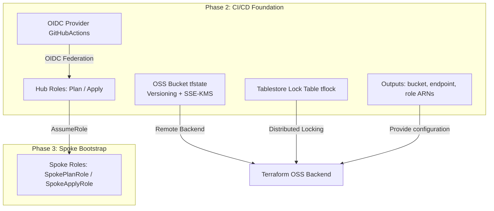
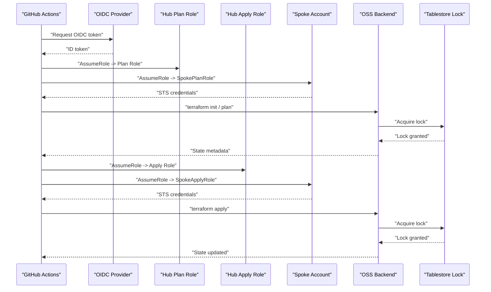
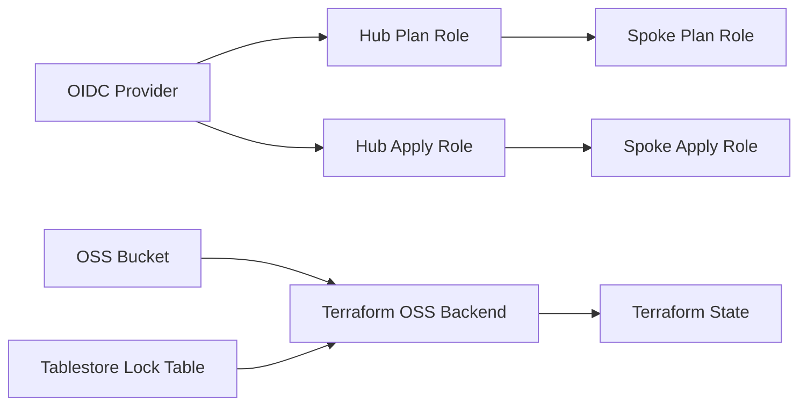

# State Management

<cite>
**Referenced Files in This Document**
- [README.md](file://README.md)
- [backend.tf.example](file://bootstrap/01-cicd-foundation/backend.tf.example)
- [main.tf](file://bootstrap/01-cicd-foundation/main.tf)
- [outputs.tf](file://bootstrap/01-cicd-foundation/outputs.tf)
- [providers.tf](file://bootstrap/01-cicd-foundation/providers.tf)
- [variables.tf](file://bootstrap/01-cicd-foundation/variables.tf)
- [main.tf](file://bootstrap/02-spoke-bootstrap/main.tf)
- [main.tf](file://bootstrap/02-spoke-bootstrap/modules/spoke-roles/main.tf)
- [outputs.tf](file://bootstrap/02-spoke-bootstrap/outputs.tf)
- [variables.tf](file://bootstrap/02-spoke-bootstrap/variables.tf)
</cite>

## Table of Contents
1. [Introduction](#introduction)
2. [Project Structure](#project-structure)
3. [Core Components](#core-components)
4. [Architecture Overview](#architecture-overview)
5. [Detailed Component Analysis](#detailed-component-analysis)
6. [Dependency Analysis](#dependency-analysis)
7. [Performance Considerations](#performance-considerations)
8. [Troubleshooting Guide](#troubleshooting-guide)
9. [Conclusion](#conclusion)
10. [Appendices](#appendices)

## Introduction
This document explains the Terraform state management infrastructure that enables reliable and secure state persistence across the landing zone deployment. It covers the OSS backend configuration with encryption-at-rest and versioning, the state migration process from local state to remote backend during bootstrap, the distributed locking mechanism using Alibaba Cloud Tablestore, and the associated access control and security model. It also documents backend configuration parameters, bucket policies, encryption keys, backup and disaster recovery considerations, locking behavior and conflict resolution, and troubleshooting guidance.

## Project Structure
The state management implementation spans two bootstrap phases:
- Phase 2 (CI/CD Foundation): Provisions the OSS state bucket, Tablestore lock table, OIDC provider, and hub roles used by CI/CD workflows.
- Phase 3 (Spoke Bootstrap): Deploys spoke roles in member accounts that trust the hub roles, enabling cross-account operations.

**Diagram sources**
- [main.tf:5-43](file://bootstrap/01-cicd-foundation/main.tf#L5-L43)
- [outputs.tf:1-25](file://bootstrap/01-cicd-foundation/outputs.tf#L1-L25)
- [main.tf:1-42](file://bootstrap/02-spoke-bootstrap/modules/spoke-roles/main.tf#L1-L42)

**Section sources**
- [README.md:23-26](file://README.md#L23-L26)
- [README.md:58-67](file://README.md#L58-L67)

## Core Components
- Remote backend configuration for Terraform using Alibaba Cloud OSS with distributed locking via Tablestore.
- Encrypted state storage with server-side encryption using KMS and versioning enabled for historical tracking and recovery.
- Distributed locking using a Tablestore table to prevent concurrent applies.
- CI/CD access control via OIDC provider and hub roles with least privilege and separation of concerns (plan vs apply).
- Outputs exposing backend configuration and role ARNs for downstream consumers.

**Section sources**
- [backend.tf.example:13-22](file://bootstrap/01-cicd-foundation/backend.tf.example#L13-L22)
- [main.tf:5-43](file://bootstrap/01-cicd-foundation/main.tf#L5-L43)
- [outputs.tf:1-25](file://bootstrap/01-cicd-foundation/outputs.tf#L1-L25)

## Architecture Overview
The state management architecture integrates CI/CD orchestration with secure state persistence and concurrency control:

**Diagram sources**
- [README.md:23-26](file://README.md#L23-L26)
- [main.tf:49-105](file://bootstrap/01-cicd-foundation/main.tf#L49-L105)
- [main.tf:1-42](file://bootstrap/02-spoke-bootstrap/modules/spoke-roles/main.tf#L1-L42)

## Detailed Component Analysis

### OSS Backend Configuration
- Backend type: Alibaba Cloud OSS.
- Bucket naming convention embeds the CICD account ID and region.
- Path prefix and key define the state file location within the bucket.
- Region selection aligns with the deployment region.
- Distributed locking endpoint and table configured for concurrency control.

Key backend parameters:
- bucket: Name of the OSS bucket used for state storage.
- prefix: Path prefix under the bucket for organizing state files.
- key: Name of the state file.
- region: Alibaba Cloud region where the bucket resides.
- tablestore_endpoint: Endpoint of the Tablestore instance used for distributed locks.
- tablestore_table: Name of the Tablestore table used for locks.

Migration steps:
- Add the backend block to the bootstrap stack’s configuration.
- Obtain temporary STS credentials for the CICD account.
- Run terraform init with state migration to move from local to remote backend.

**Section sources**
- [backend.tf.example:1-23](file://bootstrap/01-cicd-foundation/backend.tf.example#L1-L23)
- [README.md:78-88](file://README.md#L78-L88)

### State Encryption and Versioning
- Server-side encryption with KMS is enabled on the state bucket.
- Versioning is enabled to preserve historical state versions.
- Lifecycle rule configured to expire noncurrent object versions after a retention period.

Encryption and retention behavior:
- All state objects are encrypted at rest using KMS-managed keys.
- Versioning allows rollback to previous state versions for disaster recovery.
- Noncurrent version expiration prevents indefinite storage growth.

**Section sources**
- [main.tf:10-25](file://bootstrap/01-cicd-foundation/main.tf#L10-L25)

### Distributed Locking with Tablestore
- A Tablestore instance and table are provisioned for distributed locking.
- The OSS backend is configured to use the Tablestore endpoint and table for state locking.
- Lock acquisition is performed automatically by Terraform during init/apply/plan operations.

Locking characteristics:
- Single primary key column used as the lock identifier.
- TTL set to persist the lock record indefinitely.
- Max version constrained to a single version to simplify lock updates.

**Section sources**
- [main.tf:27-43](file://bootstrap/01-cicd-foundation/main.tf#L27-L43)
- [backend.tf.example:19-21](file://bootstrap/01-cicd-foundation/backend.tf.example#L19-L21)

### Access Control and Security Model
- OIDC provider configured in the CICD account to federate GitHub Actions identities.
- Hub roles (Plan and Apply) assume short-lived STS credentials based on OIDC conditions.
- Policies grant minimal required permissions for state access and cross-account role assumption.
- Spoke roles in member accounts trust the hub roles and are scoped to least privilege.

Hub role policies:
- Allow read/write access to the OSS bucket for state operations.
- Allow full access to the Tablestore table for locking.
- Allow assuming spoke roles in member accounts.

Spoke roles:
- Plan role grants read-only access for planning.
- Apply role grants administrative access for applying changes.

**Section sources**
- [main.tf:49-105](file://bootstrap/01-cicd-foundation/main.tf#L49-L105)
- [main.tf:112-135](file://bootstrap/01-cicd-foundation/main.tf#L112-L135)
- [main.tf:1-42](file://bootstrap/02-spoke-bootstrap/modules/spoke-roles/main.tf#L1-L42)

### Outputs and Configuration Exposure
- Exposes the OSS bucket name, Tablestore endpoint, OIDC provider ARN, and hub role ARNs.
- These outputs enable automation and CI/CD workflows to configure Terraform backends and OIDC authentication.

**Section sources**
- [outputs.tf:1-25](file://bootstrap/01-cicd-foundation/outputs.tf#L1-L25)
- [outputs.tf:1-22](file://bootstrap/02-spoke-bootstrap/outputs.tf#L1-L22)

## Dependency Analysis
The state management components depend on each other as follows:
- The OSS backend depends on the provisioned bucket and its encryption/versioning settings.
- The Tablestore table is required for distributed locking.
- CI/CD workflows depend on the OIDC provider and hub roles to obtain short-lived credentials.
- Spoke roles depend on hub roles being properly configured and assumed.

**Diagram sources**
- [main.tf:49-105](file://bootstrap/01-cicd-foundation/main.tf#L49-L105)
- [main.tf:112-135](file://bootstrap/01-cicd-foundation/main.tf#L112-L135)
- [main.tf:5-43](file://bootstrap/01-cicd-foundation/main.tf#L5-L43)
- [main.tf:1-42](file://bootstrap/02-spoke-bootstrap/modules/spoke-roles/main.tf#L1-L42)

**Section sources**
- [providers.tf:1-16](file://bootstrap/01-cicd-foundation/providers.tf#L1-L16)
- [variables.tf:1-16](file://bootstrap/01-cicd-foundation/variables.tf#L1-L16)
- [variables.tf:1-26](file://bootstrap/02-spoke-bootstrap/variables.tf#L1-L26)

## Performance Considerations
- OSS performance: Standard storage class is used; consider selecting a higher-performance class if latency-sensitive operations are frequent.
- Lock contention: Distributed locking reduces concurrency conflicts but may introduce wait times under heavy load; batching operations and avoiding simultaneous applies can help.
- Versioning overhead: Enabling versioning increases storage costs and retrieval complexity; ensure lifecycle policies align with retention needs.

[No sources needed since this section provides general guidance]

## Troubleshooting Guide
Common state-related issues and resolutions:
- State migration fails after adding backend block:
  - Ensure STS credentials for the CICD account are active and exported before running terraform init -migrate-state.
  - Verify the backend block matches the bucket naming convention and region.
- Lock acquisition errors:
  - Confirm the Tablestore endpoint and table name match the backend configuration.
  - Check that the hub roles have permission to access the Tablestore table.
- Permission denied on state operations:
  - Verify the hub roles’ policies include required OSS actions and OTS permissions.
  - Ensure the OIDC provider conditions match the repository and environment scopes.
- Cross-account role assumption failures:
  - Confirm the spoke roles trust the hub roles and that the hub account ID is correctly configured.
  - Validate that the spoke account IDs and regions are accurate in the spoke bootstrap variables.

**Section sources**
- [backend.tf.example:1-23](file://bootstrap/01-cicd-foundation/backend.tf.example#L1-L23)
- [README.md:78-88](file://README.md#L78-L88)
- [main.tf:112-135](file://bootstrap/01-cicd-foundation/main.tf#L112-L135)
- [main.tf:1-42](file://bootstrap/02-spoke-bootstrap/modules/spoke-roles/main.tf#L1-L42)

## Conclusion
The state management infrastructure establishes secure, reliable, and auditable state persistence for the landing zone. By combining encrypted and versioned OSS storage with distributed locking via Tablestore, and enforcing strict access controls through OIDC and least-privileged hub/spoke roles, the system mitigates risks associated with state corruption, unauthorized access, and concurrent operations. The documented migration process and troubleshooting guidance support smooth adoption and ongoing maintenance.

[No sources needed since this section summarizes without analyzing specific files]

## Appendices

### Backend Configuration Parameters Reference
- bucket: OSS bucket name for state storage.
- prefix: Path prefix within the bucket for state files.
- key: State file name.
- region: Alibaba Cloud region.
- tablestore_endpoint: Tablestore endpoint for distributed locking.
- tablestore_table: Tablestore table name for locks.

**Section sources**
- [backend.tf.example:13-22](file://bootstrap/01-cicd-foundation/backend.tf.example#L13-L22)

### Bucket Policies and Access Control Setup
- Hub state access policy grants:
  - Read/write access to the OSS bucket and its objects.
  - Full access to the Tablestore table.
  - Permission to assume spoke roles across member accounts.
- Hub roles:
  - Plan role: OIDC-assigned with conditions for pull requests.
  - Apply role: OIDC-assigned with conditions for production environment.
- Spoke roles:
  - Plan role: ReadOnlyAccess system policy.
  - Apply role: AdministratorAccess system policy.

**Section sources**
- [main.tf:112-135](file://bootstrap/01-cicd-foundation/main.tf#L112-L135)
- [main.tf:49-105](file://bootstrap/01-cicd-foundation/main.tf#L49-L105)
- [main.tf:1-42](file://bootstrap/02-spoke-bootstrap/modules/spoke-roles/main.tf#L1-L42)

### State Encryption Keys, Backup, and Disaster Recovery
- Encryption: Server-side encryption with KMS is enabled on the state bucket.
- Versioning: Enabled to maintain historical state versions.
- Lifecycle: Noncurrent version expiration configured to limit retention.
- Recovery: Use versioned state to restore previous states; rely on bucket replication or external backup if required.

**Section sources**
- [main.tf:10-25](file://bootstrap/01-cicd-foundation/main.tf#L10-L25)

### State Locking Behavior and Conflict Resolution
- Lock acquisition occurs automatically during terraform init/plan/apply.
- Distributed locking prevents concurrent applies across CI/CD runners.
- Conflict resolution: If a lock is held by another process, wait until released or resolve contention by aborting conflicting operations.

**Section sources**
- [main.tf:27-43](file://bootstrap/01-cicd-foundation/main.tf#L27-L43)
- [backend.tf.example:19-21](file://bootstrap/01-cicd-foundation/backend.tf.example#L19-L21)