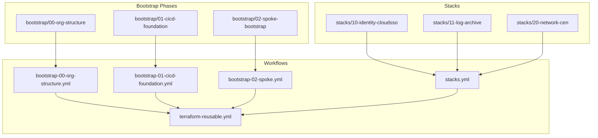
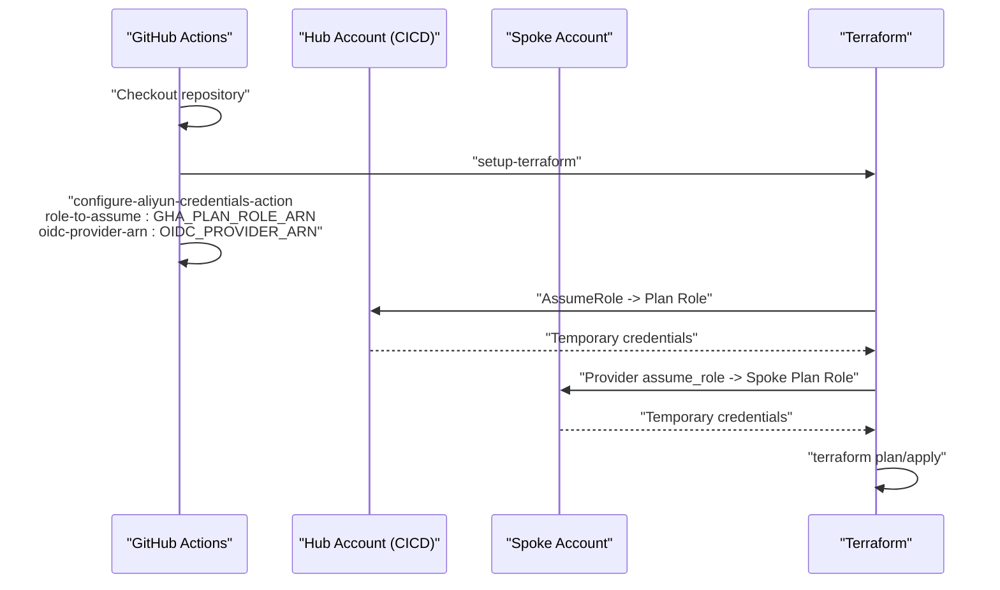
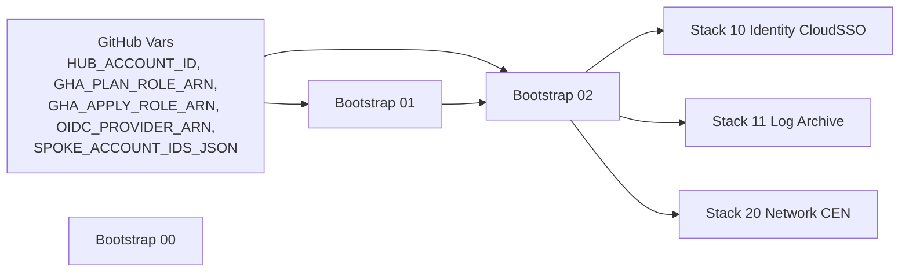

# Configuration Reference

<cite>
**Referenced Files in This Document**
- [README.md](file://README.md)
- [bootstrap/00-org-structure/variables.tf](file://bootstrap/00-org-structure/variables.tf)
- [bootstrap/00-org-structure/providers.tf](file://bootstrap/00-org-structure/providers.tf)
- [bootstrap/01-cicd-foundation/variables.tf](file://bootstrap/01-cicd-foundation/variables.tf)
- [bootstrap/01-cicd-foundation/providers.tf](file://bootstrap/01-cicd-foundation/providers.tf)
- [bootstrap/02-spoke-bootstrap/variables.tf](file://bootstrap/02-spoke-bootstrap/variables.tf)
- [bootstrap/02-spoke-bootstrap/providers.tf](file://bootstrap/02-spoke-bootstrap/providers.tf)
- [stacks/10-identity-cloudsso/variables.tf](file://stacks/10-identity-cloudsso/variables.tf)
- [stacks/10-identity-cloudsso/providers.tf](file://stacks/10-identity-cloudsso/providers.tf)
- [stacks/11-log-archive/variables.tf](file://stacks/11-log-archive/variables.tf)
- [stacks/11-log-archive/providers.tf](file://stacks/11-log-archive/providers.tf)
- [stacks/20-network-cen/variables.tf](file://stacks/20-network-cen/variables.tf)
- [stacks/20-network-cen/providers.tf](file://stacks/20-network-cen/providers.tf)
- [.github/workflows/bootstrap-00-org-structure.yml](file://.github/workflows/bootstrap-00-org-structure.yml)
- [.github/workflows/bootstrap-01-cicd-foundation.yml](file://.github/workflows/bootstrap-01-cicd-foundation.yml)
- [.github/workflows/bootstrap-02-spoke.yml](file://.github/workflows/bootstrap-02-spoke.yml)
- [.github/workflows/stacks.yml](file://.github/workflows/stacks.yml)
- [.github/workflows/terraform-reusable.yml](file://.github/workflows/terraform-reusable.yml)
</cite>

## Table of Contents
1. [Introduction](#introduction)
2. [Project Structure](#project-structure)
3. [Core Components](#core-components)
4. [Architecture Overview](#architecture-overview)
5. [Detailed Component Analysis](#detailed-component-analysis)
6. [Dependency Analysis](#dependency-analysis)
7. [Performance Considerations](#performance-considerations)
8. [Troubleshooting Guide](#troubleshooting-guide)
9. [Conclusion](#conclusion)
10. [Appendices](#appendices)

## Introduction
This document provides a comprehensive configuration reference for the Alibaba Cloud Landing Zone Accelerator deployed via Terraform and GitHub Actions. It covers variables, providers, and configuration options across bootstrap phases and stack components. It also documents environment variable requirements, GitHub repository variables, secret management, validation and testing approaches, and practical customization templates.

## Project Structure
The repository is organized into three bootstrap phases and multiple stack components, each with its own variables and providers. Workflows orchestrate plan and apply operations with OIDC-based authentication.

**Diagram sources**
- [README.md:141-165](file://README.md#L141-L165)
- [.github/workflows/bootstrap-00-org-structure.yml:1-36](file://.github/workflows/bootstrap-00-org-structure.yml#L1-L36)
- [.github/workflows/bootstrap-01-cicd-foundation.yml:1-36](file://.github/workflows/bootstrap-01-cicd-foundation.yml#L1-L36)
- [.github/workflows/bootstrap-02-spoke.yml:1-36](file://.github/workflows/bootstrap-02-spoke.yml#L1-L36)
- [.github/workflows/stacks.yml:1-112](file://.github/workflows/stacks.yml#L1-L112)
- [.github/workflows/terraform-reusable.yml:1-118](file://.github/workflows/terraform-reusable.yml#L1-L118)

**Section sources**
- [README.md:141-165](file://README.md#L141-L165)

## Core Components
This section summarizes configuration variables and provider setups for each bootstrap phase and selected stacks.

- Bootstrap 00 — Organization Structure
  - Variables
    - region: string, default cn-hangzhou
  - Providers
    - Aliyun provider configured with environment credentials

- Bootstrap 01 — CI/CD Foundation
  - Variables
    - region: string, default cn-hangzhou
    - cicd_account_id: string (required)
    - github_org_repo: string (required)
  - Providers
    - aliCloud provider alias mgmt (management account)
    - aliCloud provider alias cicd (assumes ResourceDirectoryAccountAccessRole into the CICD account)

- Bootstrap 02 — Spoke Bootstrap
  - Variables
    - region: string, default cn-hangzhou
    - hub_account_id: string (required)
    - spokes: map(object({ account_id: string, region: string })), default includes log-archive, security, network, shared, devops
  - Providers
    - aliCloud provider for management account
    - One aliCloud provider alias per spoke, each assuming ResourceDirectoryAccountAccessRole into the respective spoke account

- Stacks (examples)
  - Identity CloudSSO
    - Variables
      - region: string, default cn-hangzhou
      - spoke_role_arn: string (required, injected via TF_VAR_spoke_role_arn)
    - Providers
      - aliCloud provider with assume_role into spoke role
  - Log Archive
    - Variables
      - region: string, default cn-hangzhou
      - spoke_role_arn: string (required, injected via TF_VAR_spoke_role_arn)
    - Providers
      - aliCloud provider with assume_role into spoke role
  - Network CEN
    - Variables
      - region: string, default cn-hangzhou
      - spoke_role_arn: string (required, injected via TF_VAR_spoke_role_arn)
      - cen_name: string, default lz-prod-cen
    - Providers
      - aliCloud provider with assume_role into spoke role

Validation rules and defaults are defined in each variables.tf. Provider assume_role blocks chain credentials from the hub account into spoke accounts using ResourceDirectoryAccountAccessRole.

**Section sources**
- [bootstrap/00-org-structure/variables.tf:1-6](file://bootstrap/00-org-structure/variables.tf#L1-L6)
- [bootstrap/00-org-structure/providers.tf:1-6](file://bootstrap/00-org-structure/providers.tf#L1-L6)
- [bootstrap/01-cicd-foundation/variables.tf:1-16](file://bootstrap/01-cicd-foundation/variables.tf#L1-L16)
- [bootstrap/01-cicd-foundation/providers.tf:1-16](file://bootstrap/01-cicd-foundation/providers.tf#L1-L16)
- [bootstrap/02-spoke-bootstrap/variables.tf:1-26](file://bootstrap/02-spoke-bootstrap/variables.tf#L1-L26)
- [bootstrap/02-spoke-bootstrap/providers.tf:1-51](file://bootstrap/02-spoke-bootstrap/providers.tf#L1-L51)
- [stacks/10-identity-cloudsso/variables.tf:1-11](file://stacks/10-identity-cloudsso/variables.tf#L1-L11)
- [stacks/10-identity-cloudsso/providers.tf:1-9](file://stacks/10-identity-cloudsso/providers.tf#L1-L9)
- [stacks/11-log-archive/variables.tf:1-11](file://stacks/11-log-archive/variables.tf#L1-L11)
- [stacks/11-log-archive/providers.tf:1-9](file://stacks/11-log-archive/providers.tf#L1-L9)
- [stacks/20-network-cen/variables.tf:1-17](file://stacks/20-network-cen/variables.tf#L1-L17)
- [stacks/20-network-cen/providers.tf:1-9](file://stacks/20-network-cen/providers.tf#L1-L9)

## Architecture Overview
The configuration enforces a multi-account, least-privilege model with OIDC-based authentication. The workflow orchestrates plan/apply against spoke accounts by first assuming a hub role and then chaining into spoke roles.

**Diagram sources**
- [.github/workflows/stacks.yml:42-61](file://.github/workflows/stacks.yml#L42-L61)
- [.github/workflows/stacks.yml:94-111](file://.github/workflows/stacks.yml#L94-L111)
- [.github/workflows/terraform-reusable.yml:50-55](file://.github/workflows/terraform-reusable.yml#L50-L55)
- [.github/workflows/terraform-reusable.yml:113-117](file://.github/workflows/terraform-reusable.yml#L113-L117)

## Detailed Component Analysis

### Bootstrap 00 — Organization Structure
- Purpose
  - Creates Resource Directory, organizational units, and member accounts.
- Variables
  - region: string, default cn-hangzhou
- Providers
  - aliCloud provider configured with environment credentials (ALICLOUD_ACCESS_KEY, ALICLOUD_SECRET_KEY).
- Validation
  - No explicit validation; relies on provider and resource creation success.

**Section sources**
- [bootstrap/00-org-structure/variables.tf:1-6](file://bootstrap/00-org-structure/variables.tf#L1-L6)
- [bootstrap/00-org-structure/providers.tf:1-6](file://bootstrap/00-org-structure/providers.tf#L1-L6)

### Bootstrap 01 — CI/CD Foundation
- Purpose
  - Establishes OIDC provider, hub plan/apply roles, OSS state bucket, and Tablestore lock table.
- Variables
  - region: string, default cn-hangzhou
  - cicd_account_id: string (required)
  - github_org_repo: string (required)
- Providers
  - alias mgmt: aliCloud provider using management account credentials.
  - alias cicd: aliCloud provider that assumes ResourceDirectoryAccountAccessRole into the CICD account.
- Validation
  - Requires valid cicd_account_id and github_org_repo; provider assume_role requires cross-account trust policy.

**Section sources**
- [bootstrap/01-cicd-foundation/variables.tf:1-16](file://bootstrap/01-cicd-foundation/variables.tf#L1-L16)
- [bootstrap/01-cicd-foundation/providers.tf:1-16](file://bootstrap/01-cicd-foundation/providers.tf#L1-L16)

### Bootstrap 02 — Spoke Bootstrap
- Purpose
  - Creates spoke roles in member accounts that trust the hub roles.
- Variables
  - region: string, default cn-hangzhou
  - hub_account_id: string (required)
  - spokes: map(object({ account_id: string, region: string })), default keys include log-archive, security, network, shared, devops.
- Providers
  - Management account provider.
  - One provider alias per spoke, each assuming ResourceDirectoryAccountAccessRole into the respective spoke account.
- Validation
  - Requires valid account IDs and regions for each spoke; spoke map entries must match SPOKE_ACCOUNT_IDS_JSON.

**Section sources**
- [bootstrap/02-spoke-bootstrap/variables.tf:1-26](file://bootstrap/02-spoke-bootstrap/variables.tf#L1-L26)
- [bootstrap/02-spoke-bootstrap/providers.tf:1-51](file://bootstrap/02-spoke-bootstrap/providers.tf#L1-L51)

### Stacks — Identity CloudSSO
- Purpose
  - Deploys identity and CloudSSO resources into the devops spoke account.
- Variables
  - region: string, default cn-hangzhou
  - spoke_role_arn: string (required, injected via TF_VAR_spoke_role_arn)
- Providers
  - aliCloud provider with assume_role into spoke role; session expiration set to 3600 seconds.
- Validation
  - Requires a valid spoke_role_arn matching the target spoke account.

**Section sources**
- [stacks/10-identity-cloudsso/variables.tf:1-11](file://stacks/10-identity-cloudsso/variables.tf#L1-L11)
- [stacks/10-identity-cloudsso/providers.tf:1-9](file://stacks/10-identity-cloudsso/providers.tf#L1-L9)

### Stacks — Log Archive
- Purpose
  - Deploys log archive resources into the log-archive spoke account.
- Variables
  - region: string, default cn-hangzhou
  - spoke_role_arn: string (required, injected via TF_VAR_spoke_role_arn)
- Providers
  - aliCloud provider with assume_role into spoke role; session expiration set to 3600 seconds.
- Validation
  - Requires a valid spoke_role_arn matching the target spoke account.

**Section sources**
- [stacks/11-log-archive/variables.tf:1-11](file://stacks/11-log-archive/variables.tf#L1-L11)
- [stacks/11-log-archive/providers.tf:1-9](file://stacks/11-log-archive/providers.tf#L1-L9)

### Stacks — Network CEN
- Purpose
  - Deploys Cloud Enterprise Network resources into the network spoke account.
- Variables
  - region: string, default cn-hangzhou
  - spoke_role_arn: string (required, injected via TF_VAR_spoke_role_arn)
  - cen_name: string, default lz-prod-cen
- Providers
  - aliCloud provider with assume_role into spoke role; session expiration set to 3600 seconds.
- Validation
  - Requires a valid spoke_role_arn matching the target spoke account; cen_name must be unique within the account.

**Section sources**
- [stacks/20-network-cen/variables.tf:1-17](file://stacks/20-network-cen/variables.tf#L1-L17)
- [stacks/20-network-cen/providers.tf:1-9](file://stacks/20-network-cen/providers.tf#L1-L9)

## Dependency Analysis
The configuration exhibits explicit dependencies among bootstrap phases and stack deployments:

- Bootstrap 00 depends on manual account hygiene and environment credentials.
- Bootstrap 01 depends on Bootstrap 00 outputs (e.g., CICD account ID) and creates OIDC provider and hub roles.
- Bootstrap 02 depends on Bootstrap 01 (OIDC provider ARN and hub roles) and defines spoke account mappings.
- Stacks depend on Bootstrap 02 (spoke role ARNs) and GitHub repository variables (SPOKE_ACCOUNT_IDS_JSON).

**Diagram sources**
- [README.md:96-105](file://README.md#L96-L105)
- [bootstrap/01-cicd-foundation/variables.tf:7-16](file://bootstrap/01-cicd-foundation/variables.tf#L7-L16)
- [bootstrap/02-spoke-bootstrap/variables.tf:7-10](file://bootstrap/02-spoke-bootstrap/variables.tf#L7-L10)
- [.github/workflows/stacks.yml:37-38](file://.github/workflows/stacks.yml#L37-L38)

**Section sources**
- [README.md:96-105](file://README.md#L96-L105)
- [bootstrap/01-cicd-foundation/variables.tf:7-16](file://bootstrap/01-cicd-foundation/variables.tf#L7-L16)
- [bootstrap/02-spoke-bootstrap/variables.tf:7-10](file://bootstrap/02-spoke-bootstrap/variables.tf#L7-L10)
- [.github/workflows/stacks.yml:37-38](file://.github/workflows/stacks.yml#L37-L38)

## Performance Considerations
- Session expiration: Provider assume_role sets session expiration to 3600 seconds for spoke stacks. This balances security and operational overhead.
- Concurrency: The stacks workflow limits parallel applies to one during apply jobs to avoid state contention.
- State backend: After Bootstrap 01, state migration to OSS with Tablestore locking is recommended for reliable state management.

[No sources needed since this section provides general guidance]

## Troubleshooting Guide
Common configuration issues and resolutions:

- Missing GitHub repository variables
  - Symptoms: Workflow failures when resolving vars.GHA_* or vars.OIDC_PROVIDER_ARN or vars.SPOKE_ACCOUNT_IDS_JSON.
  - Resolution: Ensure all required repository variables are set in the repository settings.

- Invalid spoke role ARN injection
  - Symptoms: Provider assume_role failures in stacks.
  - Resolution: Verify TF_VAR_spoke_role_arn matches the spoke account’s plan/apply role ARN.

- Incorrect spoke account mapping
  - Symptoms: Matrix job cannot resolve ACCOUNT_ID for a given account_key.
  - Resolution: Update SPOKE_ACCOUNT_IDS_JSON to include the missing account_key and account ID.

- Cross-account trust policies
  - Symptoms: assume_role failures from hub to spoke or management to CICD.
  - Resolution: Confirm trust policies grant ResourceDirectoryAccountAccessRole to the hub account and spoke accounts.

- Environment credentials
  - Symptoms: Bootstrap 00 fails due to missing ALICLOUD_ACCESS_KEY or ALICLOUD_SECRET_KEY.
  - Resolution: Set environment variables for the initial bootstrap run.

**Section sources**
- [README.md:96-105](file://README.md#L96-L105)
- [stacks/10-identity-cloudsso/providers.tf:1-9](file://stacks/10-identity-cloudsso/providers.tf#L1-L9)
- [stacks/11-log-archive/providers.tf:1-9](file://stacks/11-log-archive/providers.tf#L1-L9)
- [stacks/20-network-cen/providers.tf:1-9](file://stacks/20-network-cen/providers.tf#L1-L9)
- [bootstrap/01-cicd-foundation/providers.tf:7-15](file://bootstrap/01-cicd-foundation/providers.tf#L7-L15)
- [bootstrap/02-spoke-bootstrap/providers.tf:6-50](file://bootstrap/02-spoke-bootstrap/providers.tf#L6-L50)

## Conclusion
This configuration reference outlines the variables, providers, and secrets required to operate the Alibaba Cloud Landing Zone Accelerator with Terraform and GitHub Actions. By adhering to the documented defaults, validation rules, and secret management practices, teams can reliably deploy and extend the landing zone across multiple accounts and regions.

[No sources needed since this section summarizes without analyzing specific files]

## Appendices

### A. Environment Variables and Secrets
- Bootstrap 00
  - ALICLOUD_ACCESS_KEY, ALICLOUD_SECRET_KEY (environment credentials)
- Bootstrap 01
  - None required beyond repository variables
- Bootstrap 02
  - None required beyond repository variables
- Stacks
  - TF_VAR_spoke_role_arn (injected per stack)
  - SPOKE_ACCOUNT_IDS_JSON (repository variable)

**Section sources**
- [bootstrap/00-org-structure/providers.tf:3-5](file://bootstrap/00-org-structure/providers.tf#L3-L5)
- [README.md:96-105](file://README.md#L96-L105)
- [.github/workflows/stacks.yml:58-58](file://.github/workflows/stacks.yml#L58-L58)
- [.github/workflows/stacks.yml:110-110](file://.github/workflows/stacks.yml#L110-L110)

### B. GitHub Repository Variables
- HUB_ACCOUNT_ID: CICD hub account ID
- GHA_PLAN_ROLE_ARN: Plan role ARN
- GHA_APPLY_ROLE_ARN: Apply role ARN
- OIDC_PROVIDER_ARN: OIDC provider ARN
- SPOKE_ACCOUNT_IDS_JSON: JSON map of spoke accounts

**Section sources**
- [README.md:96-105](file://README.md#L96-L105)

### C. Validation and Testing Approaches
- Pull Request plans: Use reusable workflow to run plan-only for review.
- Production applies: Restricted to the production environment with approvals.
- Drift detection: Schedule periodic plan-only runs to detect configuration drift.

**Section sources**
- [.github/workflows/stacks.yml:19-68](file://.github/workflows/stacks.yml#L19-L68)
- [.github/workflows/stacks.yml:69-112](file://.github/workflows/stacks.yml#L69-L112)
- [README.md:129-139](file://README.md#L129-L139)

### D. Customization Templates and Examples
- Adding a new spoke account
  - Update bootstrap/02-spoke-bootstrap/variables.tf spokes map.
  - Re-run bootstrap 02.
  - Update SPOKE_ACCOUNT_IDS_JSON in repository variables.
- Adding a new stack
  - Copy an existing stack directory.
  - Update providers.tf and variables.tf to target the desired account.
  - Add the new stack to the matrix in .github/workflows/stacks.yml.
  - Open a PR to validate the plan.

**Section sources**
- [README.md:116-128](file://README.md#L116-L128)