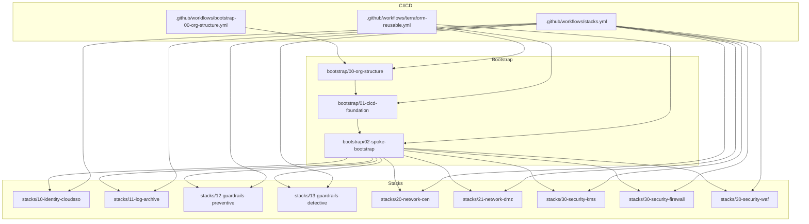
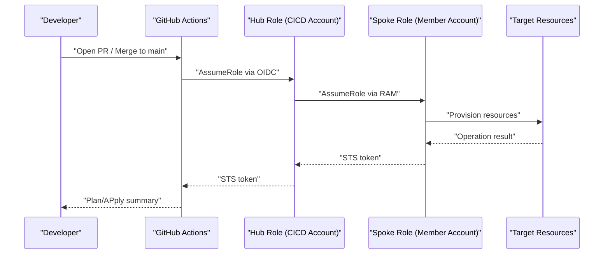
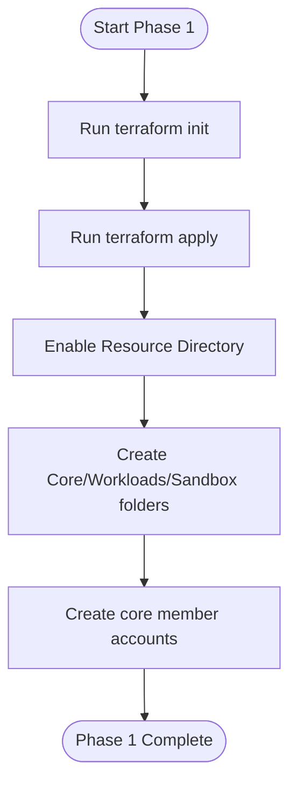
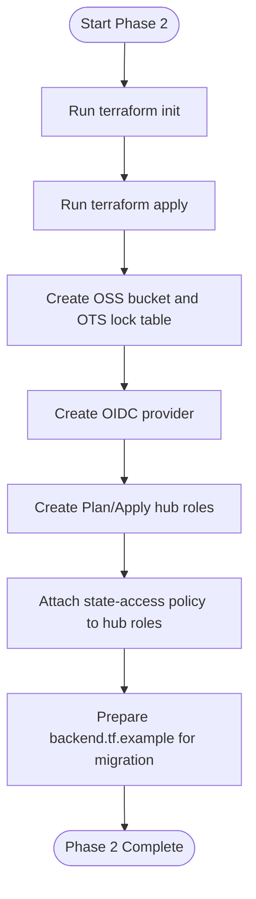
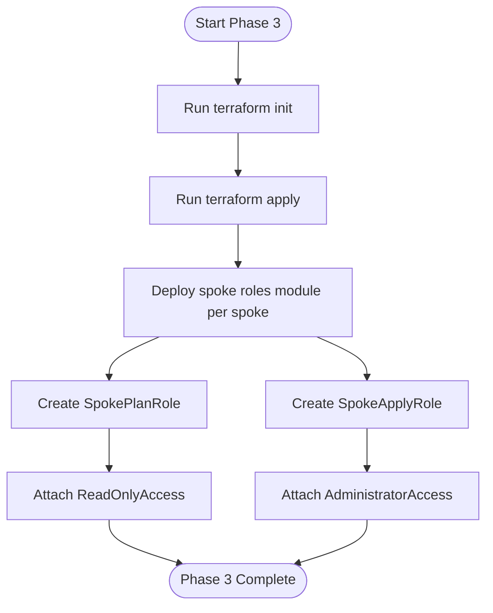
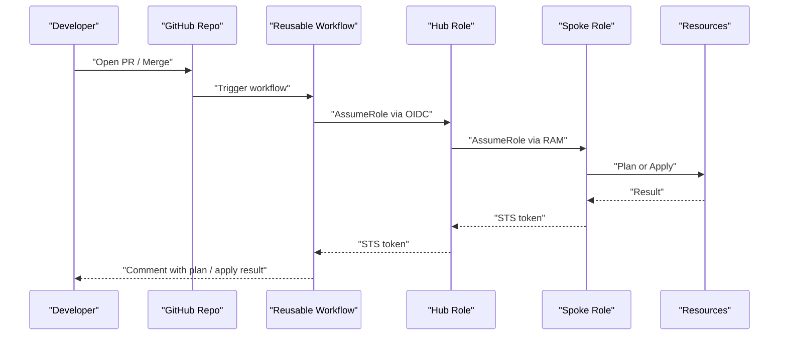
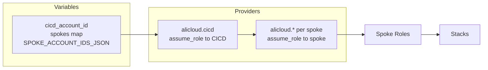

# Getting Started

<cite>
**Referenced Files in This Document**
- [README.md](file://README.md)
- [bootstrap/00-org-structure/main.tf](file://bootstrap/00-org-structure/main.tf)
- [bootstrap/01-cicd-foundation/main.tf](file://bootstrap/01-cicd-foundation/main.tf)
- [bootstrap/01-cicd-foundation/providers.tf](file://bootstrap/01-cicd-foundation/providers.tf)
- [bootstrap/01-cicd-foundation/variables.tf](file://bootstrap/01-cicd-foundation/variables.tf)
- [bootstrap/01-cicd-foundation/backend.tf.example](file://bootstrap/01-cicd-foundation/backend.tf.example)
- [bootstrap/02-spoke-bootstrap/main.tf](file://bootstrap/02-spoke-bootstrap/main.tf)
- [bootstrap/02-spoke-bootstrap/providers.tf](file://bootstrap/02-spoke-bootstrap/providers.tf)
- [bootstrap/02-spoke-bootstrap/variables.tf](file://bootstrap/02-spoke-bootstrap/variables.tf)
- [bootstrap/02-spoke-bootstrap/modules/spoke-roles/main.tf](file://bootstrap/02-spoke-bootstrap/modules/spoke-roles/main.tf)
- [.github/workflows/bootstrap-00-org-structure.yml](file://.github/workflows/bootstrap-00-org-structure.yml)
- [.github/workflows/terraform-reusable.yml](file://.github/workflows/terraform-reusable.yml)
- [.github/workflows/stacks.yml](file://.github/workflows/stacks.yml)
- [stacks/20-network-cen/main.tf](file://stacks/20-network-cen/main.tf)
</cite>

## Table of Contents
1. [Introduction](#introduction)
2. [Prerequisites](#prerequisites)
3. [Project Structure](#project-structure)
4. [Core Components](#core-components)
5. [Architecture Overview](#architecture-overview)
6. [Detailed Component Analysis](#detailed-component-analysis)
7. [Dependency Analysis](#dependency-analysis)
8. [Performance Considerations](#performance-considerations)
9. [Troubleshooting Guide](#troubleshooting-guide)
10. [Conclusion](#conclusion)
11. [Appendices](#appendices)

## Introduction
This guide helps you set up the Alibaba Cloud Landing Zone Accelerator using Terraform and GitHub Actions. It covers prerequisites, the four-phase bootstrap process, credential requirements, and operational guidance. The solution uses OIDC-based authentication to avoid long-lived credentials and enforces least privilege across hub and spoke accounts.

## Prerequisites
Before starting, ensure the following:
- Alibaba Cloud account with Resource Directory enabled (management account or delegated admin)
- GitHub repository (public or private)
- Terraform version 1.5 or newer (required for OIDC-based provider auth)
- Alibaba Cloud CLI installed locally for state migration tasks
- Short-lived operator AccessKey for bootstrap phases only; revoke after pipelines are live

Verification checklist:
- Confirm Resource Directory is enabled in the management account
- Ensure MFA is enabled on the management account root user
- Complete real-name verification for all member accounts
- Prepare a GitHub personal access token or deploy key with repository access

**Section sources**
- [README.md:30-47](file://README.md#L30-L47)

## Project Structure
The repository is organized into three bootstrap phases and multiple stacks, plus CI/CD workflows:
- bootstrap/00-org-structure: Enables Resource Directory, creates folders, and member accounts
- bootstrap/01-cicd-foundation: Creates OIDC provider, hub roles, OSS state bucket, and OTS lock table
- bootstrap/02-spoke-bootstrap: Deploys spoke roles in each member account
- stacks/: Implementation of landing zone capabilities (e.g., identity, logging, guardrails, networking, security)
- .github/workflows/: GitHub Actions workflows orchestrating bootstrap and stack deployments

**Diagram sources**
- [README.md:141-165](file://README.md#L141-L165)
- [bootstrap/00-org-structure/main.tf:1-49](file://bootstrap/00-org-structure/main.tf#L1-L49)
- [bootstrap/01-cicd-foundation/main.tf:1-150](file://bootstrap/01-cicd-foundation/main.tf#L1-L150)
- [bootstrap/02-spoke-bootstrap/main.tf:1-33](file://bootstrap/02-spoke-bootstrap/main.tf#L1-L33)
- [.github/workflows/bootstrap-00-org-structure.yml:1-36](file://.github/workflows/bootstrap-00-org-structure.yml#L1-L36)
- [.github/workflows/terraform-reusable.yml:1-118](file://.github/workflows/terraform-reusable.yml#L1-L118)
- [.github/workflows/stacks.yml:1-112](file://.github/workflows/stacks.yml#L1-L112)

**Section sources**
- [README.md:141-165](file://README.md#L141-L165)

## Core Components
- Bootstrap phases:
  - Phase 1: Organization structure (Resource Directory, folders, member accounts)
  - Phase 2: CI/CD foundation (OIDC provider, hub roles, state backend)
  - Phase 3: Spoke bootstrap (per-account spoke roles)
- Stacks: Landing zone capabilities deployed into spoke accounts
- Workflows: Reusable GitHub Actions for plan/apply with OIDC-based credentials

**Section sources**
- [README.md:40-95](file://README.md#L40-L95)

## Architecture Overview
The system uses OIDC federation to exchange GitHub tokens for short-lived STS credentials, chaining from hub to spoke accounts for provisioning.

**Diagram sources**
- [README.md:7-28](file://README.md#L7-L28)
- [.github/workflows/terraform-reusable.yml:50-56](file://.github/workflows/terraform-reusable.yml#L50-L56)
- [bootstrap/01-cicd-foundation/main.tf:84-105](file://bootstrap/01-cicd-foundation/main.tf#L84-L105)
- [bootstrap/02-spoke-bootstrap/modules/spoke-roles/main.tf:24-35](file://bootstrap/02-spoke-bootstrap/modules/spoke-roles/main.tf#L24-L35)

## Detailed Component Analysis

### Phase 0 — Manual Account Hygiene
Complete these manual steps before running automated bootstrap:
- Enable MFA on the management account root user
- Complete real-name verification for all member accounts
- Enable Resource Directory in the management account console

These prerequisites ensure compliance and enable subsequent automation.

**Section sources**
- [README.md:42-47](file://README.md#L42-L47)

### Phase 1 — Organization Structure
Purpose: Enable Resource Directory, create organizational folders, and provision core member accounts.

Steps:
- Change to the bootstrap directory and initialize Terraform
- Run terraform init and terraform apply

Outputs:
- Resource Directory enabled
- Folders: Core, Workloads, Sandbox
- Member accounts: devops, log-archive, security, network, shared-services

**Diagram sources**
- [bootstrap/00-org-structure/main.tf:1-49](file://bootstrap/00-org-structure/main.tf#L1-L49)

Practical example:
- cd into bootstrap/00-org-structure
- terraform init
- terraform apply

Notes:
- Destroy is intentionally non-idempotent for Resource Directory; treat as a one-way operation

**Section sources**
- [README.md:48-57](file://README.md#L48-L57)
- [bootstrap/00-org-structure/main.tf:1-5](file://bootstrap/00-org-structure/main.tf#L1-L5)

### Phase 2 — CI/CD Foundation
Purpose: Establish state infrastructure, OIDC provider, and hub roles for plan/apply.

Steps:
- Initialize and apply the foundation stack
- Configure repository variables (see Appendices)
- Migrate local state to OSS backend

Outputs:
- OSS bucket for state (encrypted with KMS)
- OTS instance/table for state locking
- OIDC provider named “GitHubActions”
- Hub roles: GitHubActionsPlanRole (read-only) and GitHubActionsApplyRole (read-write)

**Diagram sources**
- [bootstrap/01-cicd-foundation/main.tf:5-43](file://bootstrap/01-cicd-foundation/main.tf#L5-L43)
- [bootstrap/01-cicd-foundation/main.tf:49-105](file://bootstrap/01-cicd-foundation/main.tf#L49-L105)
- [bootstrap/01-cicd-foundation/main.tf:112-149](file://bootstrap/01-cicd-foundation/main.tf#L112-L149)

Practical example:
- cd into bootstrap/01-cicd-foundation
- terraform init
- terraform apply

State migration:
- Add the backend block from backend.tf.example
- Obtain temporary credentials for the CICD account
- Run terraform init -migrate-state

Repository variables to configure:
- HUB_ACCOUNT_ID
- GHA_PLAN_ROLE_ARN
- GHA_APPLY_ROLE_ARN
- OIDC_PROVIDER_ARN
- SPOKE_ACCOUNT_IDS_JSON

**Section sources**
- [README.md:58-88](file://README.md#L58-L88)
- [bootstrap/01-cicd-foundation/variables.tf:1-16](file://bootstrap/01-cicd-foundation/variables.tf#L1-L16)
- [bootstrap/01-cicd-foundation/backend.tf.example:1-23](file://bootstrap/01-cicd-foundation/backend.tf.example#L1-L23)

### Phase 3 — Spoke Bootstrap
Purpose: Deploy spoke roles in each member account so the hub can assume them.

Steps:
- Initialize and apply the spoke bootstrap stack
- Update SPOKE_ACCOUNT_IDS_JSON with actual spoke account IDs

Outputs:
- Per-account roles:
  - SpokePlanRole (trusts hub’s Plan role, read-only)
  - SpokeApplyRole (trusts hub’s Apply role, admin)

**Diagram sources**
- [bootstrap/02-spoke-bootstrap/main.tf:4-32](file://bootstrap/02-spoke-bootstrap/main.tf#L4-L32)
- [bootstrap/02-spoke-bootstrap/modules/spoke-roles/main.tf:3-20](file://bootstrap/02-spoke-bootstrap/modules/spoke-roles/main.tf#L3-L20)
- [bootstrap/02-spoke-bootstrap/modules/spoke-roles/main.tf:24-41](file://bootstrap/02-spoke-bootstrap/modules/spoke-roles/main.tf#L24-L41)

Practical example:
- cd into bootstrap/02-spoke-bootstrap
- terraform init
- terraform apply

Provider chaining:
- Providers chain via ResourceDirectoryAccountAccessRole to each spoke account

**Section sources**
- [README.md:68-77](file://README.md#L68-L77)
- [bootstrap/02-spoke-bootstrap/providers.tf:6-51](file://bootstrap/02-spoke-bootstrap/providers.tf#L6-L51)

### Phase 4+ — Pipeline Takes Over
Purpose: Automate plan/apply using GitHub Actions with OIDC.

Workflow orchestration:
- Pull requests trigger plan-only runs
- Merging to main triggers apply
- Reusable workflow configures OIDC credentials and executes terraform init/plan/apply

**Diagram sources**
- [.github/workflows/terraform-reusable.yml:39-118](file://.github/workflows/terraform-reusable.yml#L39-L118)
- [.github/workflows/bootstrap-00-org-structure.yml:18-36](file://.github/workflows/bootstrap-00-org-structure.yml#L18-L36)
- [.github/workflows/stacks.yml:18-112](file://.github/workflows/stacks.yml#L18-L112)

Operational guidance:
- Configure repository variables (see Appendices)
- Push repository to GitHub
- Open PRs to validate plans; merge to main to apply

**Section sources**
- [README.md:89-95](file://README.md#L89-L95)
- [.github/workflows/bootstrap-00-org-structure.yml:18-36](file://.github/workflows/bootstrap-00-org-structure.yml#L18-L36)
- [.github/workflows/stacks.yml:18-112](file://.github/workflows/stacks.yml#L18-L112)

## Dependency Analysis
The bootstrap phases build upon each other, and stacks depend on spoke roles. Providers and variables connect hub and spoke accounts.

**Diagram sources**
- [bootstrap/01-cicd-foundation/providers.tf:7-15](file://bootstrap/01-cicd-foundation/providers.tf#L7-L15)
- [bootstrap/02-spoke-bootstrap/providers.tf:6-51](file://bootstrap/02-spoke-bootstrap/providers.tf#L6-L51)
- [bootstrap/02-spoke-bootstrap/variables.tf:12-25](file://bootstrap/02-spoke-bootstrap/variables.tf#L12-L25)

**Section sources**
- [bootstrap/01-cicd-foundation/providers.tf:7-15](file://bootstrap/01-cicd-foundation/providers.tf#L7-L15)
- [bootstrap/02-spoke-bootstrap/providers.tf:6-51](file://bootstrap/02-spoke-bootstrap/providers.tf#L6-L51)
- [bootstrap/02-spoke-bootstrap/variables.tf:12-25](file://bootstrap/02-spoke-bootstrap/variables.tf#L12-L25)

## Performance Considerations
- Use plan-only runs for frequent checks to reduce runtime and cost
- Limit parallelism during apply to avoid contention (e.g., matrix with max-parallel 1)
- Keep state encrypted and locked to prevent conflicts and unauthorized changes

[No sources needed since this section provides general guidance]

## Troubleshooting Guide
Common issues and resolutions:
- OIDC permission failures: Verify OIDC provider ARN and role conditions match repository context
- State migration errors: Ensure OSS bucket and OTS table exist and credentials are valid for the CICD account
- Provider chaining failures: Confirm ResourceDirectoryAccountAccessRole exists and is assumable from the management account
- Drift detection: Schedule periodic plan-only runs to catch configuration drift early

Verification steps:
- Manually review plan comments on pull requests
- Confirm apply runs only in the production environment
- Validate that state remains locked and encrypted

**Section sources**
- [README.md:129-139](file://README.md#L129-L139)
- [bootstrap/01-cicd-foundation/backend.tf.example:4-11](file://bootstrap/01-cicd-foundation/backend.tf.example#L4-L11)

## Conclusion
You now have a secure, automated landing zone foundation using Alibaba Cloud Resource Directory, OIDC-based GitHub Actions, and Terraform. Proceed through the four phases, configure repository variables, and leverage the reusable workflows to continuously deploy and operate stacks across spoke accounts.

[No sources needed since this section summarizes without analyzing specific files]

## Appendices

### Appendix A — Credential Requirements
- Operator AccessKey for bootstrap phases only; revoke after pipelines are live
- OIDC-based credentials for all subsequent automation
- Hub roles:
  - Plan role ARN: used for pull request plan runs
  - Apply role ARN: used for production merges
- OIDC provider ARN: “GitHubActions” created in the CICD account

**Section sources**
- [README.md:38-47](file://README.md#L38-L47)
- [bootstrap/01-cicd-foundation/main.tf:49-55](file://bootstrap/01-cicd-foundation/main.tf#L49-L55)
- [bootstrap/01-cicd-foundation/main.tf:84-105](file://bootstrap/01-cicd-foundation/main.tf#L84-L105)

### Appendix B — Repository Variables
Configure these in your GitHub repository settings:
- HUB_ACCOUNT_ID
- GHA_PLAN_ROLE_ARN
- GHA_APPLY_ROLE_ARN
- OIDC_PROVIDER_ARN
- SPOKE_ACCOUNT_IDS_JSON (map of spoke keys to account IDs)

**Section sources**
- [README.md:96-105](file://README.md#L96-L105)

### Appendix C — Adding a New Spoke Account
- Update the spokes variable in bootstrap/02-spoke-bootstrap/variables.tf
- Run terraform apply in bootstrap/02-spoke-bootstrap
- Update SPOKE_ACCOUNT_IDS_JSON in repository variables

**Section sources**
- [README.md:116-121](file://README.md#L116-L121)
- [bootstrap/02-spoke-bootstrap/variables.tf:12-25](file://bootstrap/02-spoke-bootstrap/variables.tf#L12-L25)

### Appendix D — Adding a New Stack
- Copy an existing stack directory as a template
- Update providers.tf and variables.tf to target the desired spoke account
- Add the new stack to the matrix in .github/workflows/stacks.yml
- Open a PR to validate the plan

**Section sources**
- [README.md:122-129](file://README.md#L122-L129)
- [.github/workflows/stacks.yml:22-36](file://.github/workflows/stacks.yml#L22-L36)

### Appendix E — Example: Network CEN Stack
This stack demonstrates deploying a central network component into the network spoke account.

**Section sources**
- [stacks/20-network-cen/main.tf:1-16](file://stacks/20-network-cen/main.tf#L1-L16)