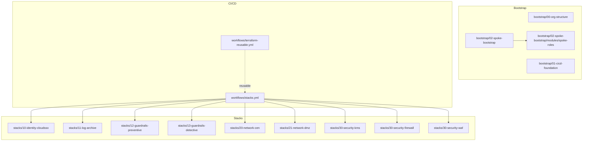
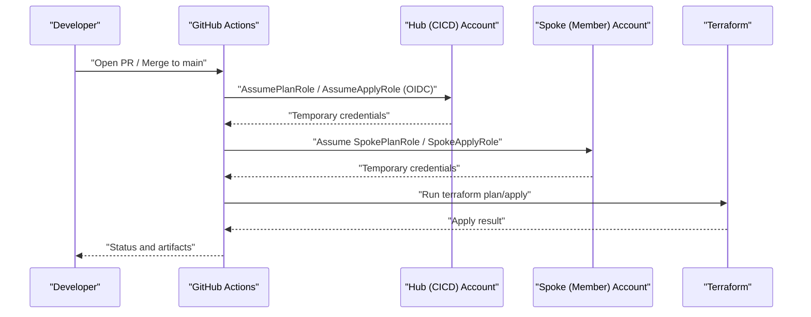
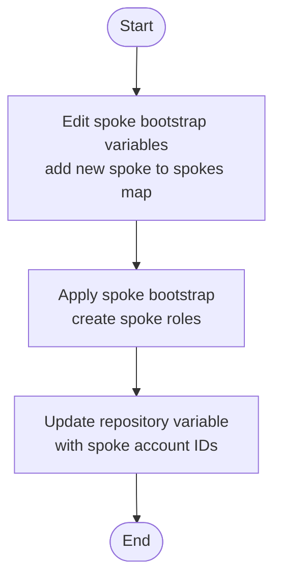
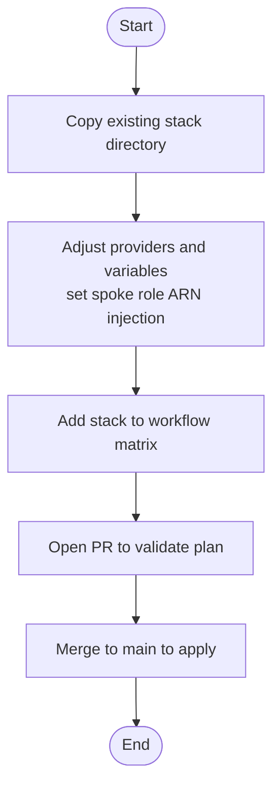
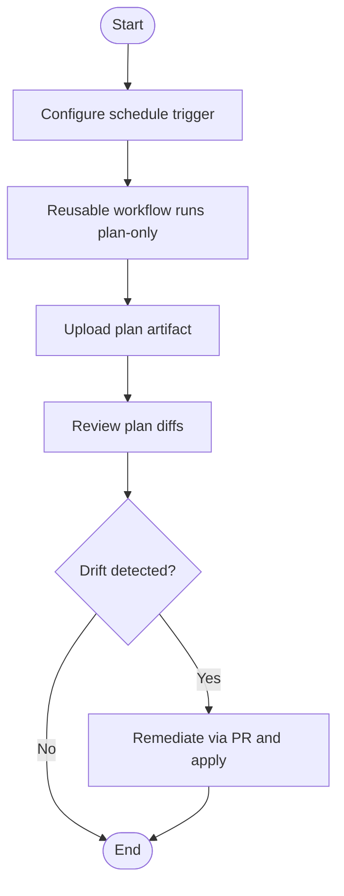
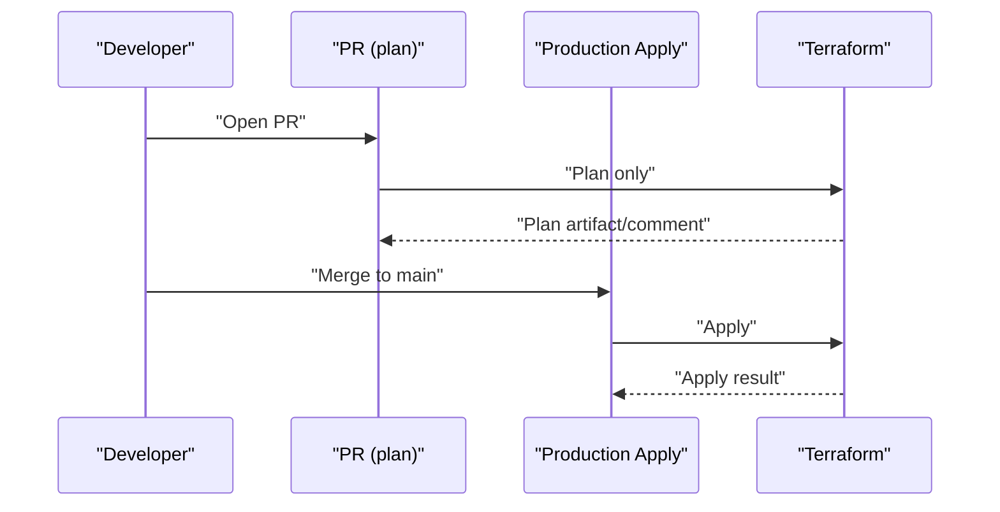
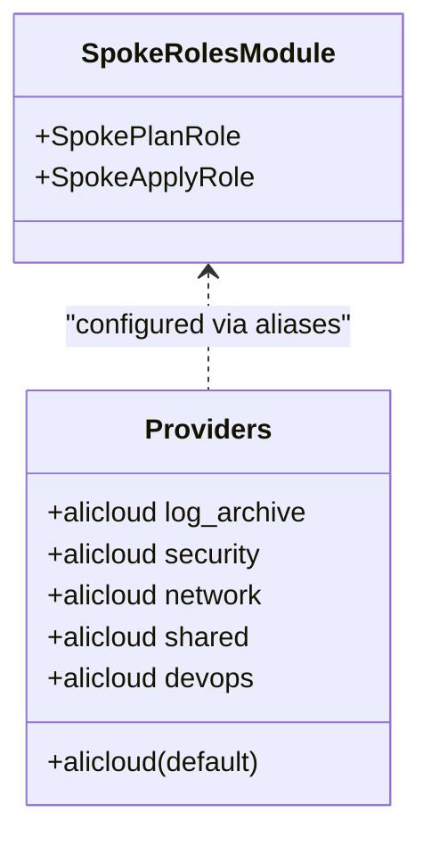
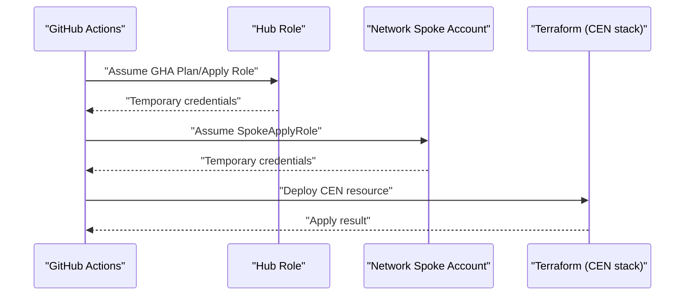
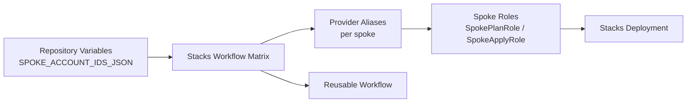

# Day-2 Operations

<cite>
**Referenced Files in This Document**
- [README.md](file://README.md)
- [bootstrap/02-spoke-bootstrap/main.tf](file://bootstrap/02-spoke-bootstrap/main.tf)
- [bootstrap/02-spoke-bootstrap/variables.tf](file://bootstrap/02-spoke-bootstrap/variables.tf)
- [bootstrap/02-spoke-bootstrap/providers.tf](file://bootstrap/02-spoke-bootstrap/providers.tf)
- [bootstrap/02-spoke-bootstrap/modules/spoke-roles/main.tf](file://bootstrap/02-spoke-bootstrap/modules/spoke-roles/main.tf)
- [stacks/10-identity-cloudsso/variables.tf](file://stacks/10-identity-cloudsso/variables.tf)
- [stacks/20-network-cen/variables.tf](file://stacks/20-network-cen/variables.tf)
- [stacks/20-network-cen/main.tf](file://stacks/20-network-cen/main.tf)
- [.github/workflows/stacks.yml](file://.github/workflows/stacks.yml)
- [.github/workflows/terraform-reusable.yml](file://.github/workflows/terraform-reusable.yml)
</cite>

## Table of Contents
1. [Introduction](#introduction)
2. [Project Structure](#project-structure)
3. [Core Components](#core-components)
4. [Architecture Overview](#architecture-overview)
5. [Detailed Component Analysis](#detailed-component-analysis)
6. [Dependency Analysis](#dependency-analysis)
7. [Performance Considerations](#performance-considerations)
8. [Troubleshooting Guide](#troubleshooting-guide)
9. [Conclusion](#conclusion)
10. [Appendices](#appendices)

## Introduction
This document provides day-2 operations procedures for managing and maintaining the Alibaba Cloud Landing Zone infrastructure built with Terraform and GitHub Actions. It covers:
- Adding new spoke accounts via variable updates and spoke bootstrap application
- Implementing new stacks by copying templates, configuring providers, and integrating into the deployment matrix
- Drift detection using scheduled plan-only workflows and compliance monitoring
- Change management, approvals, and rollback procedures
- Operational runbooks for common scenarios such as account onboarding, decommissioning, and configuration updates
- Troubleshooting guidance and escalation procedures

## Project Structure
The repository is organized into three primary areas:
- bootstrap: Initial provisioning phases for organization structure, CI/CD foundation, and spoke role bootstrapping
- stacks: Modular Terraform stacks deployed across spoke accounts
- .github/workflows: CI/CD workflows orchestrating plan/apply across stacks and spoke accounts

**Diagram sources**
- [README.md:141-165](file://README.md#L141-L165)
- [.github/workflows/stacks.yml:18-112](file://.github/workflows/stacks.yml#L18-L112)
- [.github/workflows/terraform-reusable.yml:1-118](file://.github/workflows/terraform-reusable.yml#L1-L118)

**Section sources**
- [README.md:141-165](file://README.md#L141-L165)

## Core Components
- Spoke bootstrap: Creates spoke roles in member accounts and configures provider aliases for cross-account targeting
- Stacks: Feature-specific deployments across spoke accounts, parameterized by spoke role ARNs injected via environment variables
- Workflows: Matrix-driven orchestration of plan/apply across stacks and spoke accounts, with OIDC-based credential exchange

Key operational capabilities:
- Adding new spoke accounts by updating spoke variables and re-applying the spoke bootstrap
- Adding new stacks by copying templates, adjusting providers and variables, and including them in the deployment matrix
- Drift detection via scheduled plan-only runs
- Least-privilege plan vs apply roles enforced by GitHub environments and role assumptions

**Section sources**
- [README.md:114-140](file://README.md#L114-L140)
- [bootstrap/02-spoke-bootstrap/variables.tf:12-25](file://bootstrap/02-spoke-bootstrap/variables.tf#L12-L25)
- [bootstrap/02-spoke-bootstrap/providers.tf:6-50](file://bootstrap/02-spoke-bootstrap/providers.tf#L6-L50)
- [.github/workflows/stacks.yml:18-112](file://.github/workflows/stacks.yml#L18-L112)

## Architecture Overview
The day-2 operations rely on a secure, least-privileged flow:
- GitHub Actions requests an OIDC token and assumes a hub role in the CICD account
- The hub role assumes a spoke role in the target member account
- Terraform executes plan/apply against the target spoke account using the spoke role’s session

**Diagram sources**
- [README.md:28](file://README.md#L28)
- [.github/workflows/stacks.yml:42-111](file://.github/workflows/stacks.yml#L42-L111)
- [.github/workflows/terraform-reusable.yml:50-117](file://.github/workflows/terraform-reusable.yml#L50-L117)

## Detailed Component Analysis

### Adding a New Spoke Account
Operational steps:
1. Add the new spoke to the spokes variable map in the spoke bootstrap variables
2. Re-apply the spoke bootstrap to create SpokePlanRole and SpokeApplyRole in the new account
3. Update the repository variable containing spoke account IDs so the deployment matrix can resolve the account

**Diagram sources**
- [README.md:116-121](file://README.md#L116-L121)
- [bootstrap/02-spoke-bootstrap/variables.tf:12-25](file://bootstrap/02-spoke-bootstrap/variables.tf#L12-L25)
- [bootstrap/02-spoke-bootstrap/main.tf:4-32](file://bootstrap/02-spoke-bootstrap/main.tf#L4-L32)

**Section sources**
- [README.md:116-121](file://README.md#L116-L121)
- [bootstrap/02-spoke-bootstrap/variables.tf:12-25](file://bootstrap/02-spoke-bootstrap/variables.tf#L12-L25)
- [bootstrap/02-spoke-bootstrap/providers.tf:6-50](file://bootstrap/02-spoke-bootstrap/providers.tf#L6-L50)

### Implementing a New Stack
Operational steps:
1. Copy an existing stack directory as a template
2. Update providers.tf and variables.tf to target the desired spoke account and inject spoke role ARNs
3. Add the new stack to the matrix in the stacks workflow
4. Open a pull request to validate the plan; merge to apply

**Diagram sources**
- [README.md:122-128](file://README.md#L122-L128)
- [stacks/10-identity-cloudsso/variables.tf:7-10](file://stacks/10-identity-cloudsso/variables.tf#L7-L10)
- [stacks/20-network-cen/variables.tf:7-16](file://stacks/20-network-cen/variables.tf#L7-L16)
- [.github/workflows/stacks.yml:22-33](file://.github/workflows/stacks.yml#L22-L33)

**Section sources**
- [README.md:122-128](file://README.md#L122-L128)
- [stacks/10-identity-cloudsso/variables.tf:7-10](file://stacks/10-identity-cloudsso/variables.tf#L7-L10)
- [stacks/20-network-cen/variables.tf:7-16](file://stacks/20-network-cen/variables.tf#L7-L16)
- [.github/workflows/stacks.yml:22-33](file://.github/workflows/stacks.yml#L22-L33)

### Drift Detection and Compliance Monitoring
- Schedule plan-only workflow runs (e.g., nightly) to detect configuration drift
- The reusable workflow supports plan-only mode and comments plans on pull requests
- Review plan artifacts and investigate unexpected changes

**Diagram sources**
- [README.md:129-139](file://README.md#L129-L139)
- [.github/workflows/terraform-reusable.yml:65-79](file://.github/workflows/terraform-reusable.yml#L65-L79)

**Section sources**
- [README.md:129-139](file://README.md#L129-L139)
- [.github/workflows/terraform-reusable.yml:65-79](file://.github/workflows/terraform-reusable.yml#L65-L79)

### Change Management, Approvals, and Rollback
Change management:
- Pull requests trigger plan-only runs; plans are reviewed and commented
- Applies run in the production environment and are auto-approved by the workflow
- Scope changes to specific stacks and spoke accounts via the matrix

Approvals:
- Apply runs are gated behind the production environment, enabling required reviewers as configured in GitHub

Rollback:
- Revert offending commits and re-run apply
- Alternatively, introduce corrective changes in a follow-up PR and apply

**Diagram sources**
- [.github/workflows/stacks.yml:19-68](file://.github/workflows/stacks.yml#L19-L68)
- [.github/workflows/stacks.yml:69-112](file://.github/workflows/stacks.yml#L69-L112)
- [.github/workflows/terraform-reusable.yml:42](file://.github/workflows/terraform-reusable.yml#L42)

**Section sources**
- [.github/workflows/stacks.yml:19-68](file://.github/workflows/stacks.yml#L19-L68)
- [.github/workflows/stacks.yml:69-112](file://.github/workflows/stacks.yml#L69-L112)
- [.github/workflows/terraform-reusable.yml:42](file://.github/workflows/terraform-reusable.yml#L42)

### Operational Runbooks

#### Account Onboarding (New Spoke)
- Add spoke to spoke bootstrap variables
- Apply spoke bootstrap
- Update repository spoke account IDs variable
- Verify roles exist in the new account

**Section sources**
- [README.md:116-121](file://README.md#L116-L121)
- [bootstrap/02-spoke-bootstrap/variables.tf:12-25](file://bootstrap/02-spoke-bootstrap/variables.tf#L12-L25)
- [bootstrap/02-spoke-bootstrap/providers.tf:6-50](file://bootstrap/02-spoke-bootstrap/providers.tf#L6-L50)

#### Resource Decommissioning
- Remove or comment out the relevant module/resource in the target stack
- Open a PR to validate plan
- Merge to apply; confirm resources are removed
- Optionally remove spoke role references if no longer needed

**Section sources**
- [.github/workflows/stacks.yml:19-68](file://.github/workflows/stacks.yml#L19-L68)
- [.github/workflows/stacks.yml:69-112](file://.github/workflows/stacks.yml#L69-L112)

#### Configuration Updates
- Modify variables in the target stack
- Open a PR to validate plan
- Merge to apply; monitor plan artifacts for expected changes

**Section sources**
- [stacks/20-network-cen/variables.tf:1-17](file://stacks/20-network-cen/variables.tf#L1-L17)
- [stacks/10-identity-cloudsso/variables.tf:1-11](file://stacks/10-identity-cloudsso/variables.tf#L1-L11)

### Spoke Roles and Provider Chaining
Spoke roles are created per spoke and chained via ResourceDirectoryAccountAccessRole. Providers are aliased per spoke to target different accounts.

**Diagram sources**
- [bootstrap/02-spoke-bootstrap/modules/spoke-roles/main.tf:3-41](file://bootstrap/02-spoke-bootstrap/modules/spoke-roles/main.tf#L3-L41)
- [bootstrap/02-spoke-bootstrap/providers.tf:6-50](file://bootstrap/02-spoke-bootstrap/providers.tf#L6-L50)
- [bootstrap/02-spoke-bootstrap/main.tf:4-32](file://bootstrap/02-spoke-bootstrap/main.tf#L4-L32)

**Section sources**
- [bootstrap/02-spoke-bootstrap/modules/spoke-roles/main.tf:3-41](file://bootstrap/02-spoke-bootstrap/modules/spoke-roles/main.tf#L3-L41)
- [bootstrap/02-spoke-bootstrap/providers.tf:6-50](file://bootstrap/02-spoke-bootstrap/providers.tf#L6-L50)
- [bootstrap/02-spoke-bootstrap/main.tf:4-32](file://bootstrap/02-spoke-bootstrap/main.tf#L4-L32)

### Example: Network CEN Stack
The CEN stack demonstrates deploying a core networking resource into the network spoke account using a spoke role ARN injected via environment variables.

**Diagram sources**
- [.github/workflows/stacks.yml:94-111](file://.github/workflows/stacks.yml#L94-L111)
- [stacks/20-network-cen/main.tf:12-15](file://stacks/20-network-cen/main.tf#L12-L15)
- [stacks/20-network-cen/variables.tf:7-16](file://stacks/20-network-cen/variables.tf#L7-L16)

**Section sources**
- [.github/workflows/stacks.yml:94-111](file://.github/workflows/stacks.yml#L94-L111)
- [stacks/20-network-cen/main.tf:12-15](file://stacks/20-network-cen/main.tf#L12-L15)
- [stacks/20-network-cen/variables.tf:7-16](file://stacks/20-network-cen/variables.tf#L7-L16)

## Dependency Analysis
- The stacks workflow depends on repository variables for spoke account resolution and on the reusable workflow for standardized plan/apply steps
- Spoke bootstrap defines provider aliases that align with the deployment matrix account keys
- Spoke roles are created per spoke and referenced by the stacks via spoke role ARNs

**Diagram sources**
- [.github/workflows/stacks.yml:22-33](file://.github/workflows/stacks.yml#L22-L33)
- [.github/workflows/stacks.yml:38](file://.github/workflows/stacks.yml#L38)
- [.github/workflows/terraform-reusable.yml:1-118](file://.github/workflows/terraform-reusable.yml#L1-L118)
- [bootstrap/02-spoke-bootstrap/providers.tf:6-50](file://bootstrap/02-spoke-bootstrap/providers.tf#L6-L50)
- [bootstrap/02-spoke-bootstrap/modules/spoke-roles/main.tf:3-41](file://bootstrap/02-spoke-bootstrap/modules/spoke-roles/main.tf#L3-L41)

**Section sources**
- [.github/workflows/stacks.yml:22-33](file://.github/workflows/stacks.yml#L22-L33)
- [.github/workflows/stacks.yml:38](file://.github/workflows/stacks.yml#L38)
- [.github/workflows/terraform-reusable.yml:1-118](file://.github/workflows/terraform-reusable.yml#L1-L118)
- [bootstrap/02-spoke-bootstrap/providers.tf:6-50](file://bootstrap/02-spoke-bootstrap/providers.tf#L6-L50)
- [bootstrap/02-spoke-bootstrap/modules/spoke-roles/main.tf:3-41](file://bootstrap/02-spoke-bootstrap/modules/spoke-roles/main.tf#L3-L41)

## Performance Considerations
- Limit parallel applies to avoid contention; the stacks workflow sets max-parallel to 1 for apply jobs
- Use plan-only runs for frequent checks to reduce runtime overhead
- Keep provider aliases scoped to necessary spoke accounts to minimize cross-account assumption overhead

**Section sources**
- [.github/workflows/stacks.yml:74](file://.github/workflows/stacks.yml#L74)

## Troubleshooting Guide
Common issues and resolutions:
- OIDC credential failures: Verify hub role ARNs and OIDC provider ARN in repository variables; ensure audience matches the provider configuration
- Cross-account role assumption errors: Confirm ResourceDirectoryAccountAccessRole exists and is assumable by the hub roles
- State locking or backend issues: Ensure OSS backend and Tablestore lock are provisioned during bootstrap and reachable from workflows
- Drift detection noise: Use scheduled plan-only runs and review plan artifacts; suppress non-actionable drift by scoping guardrails appropriately

Escalation procedure:
- If repeated failures occur, temporarily disable auto-apply and run manual plan/apply in a controlled branch
- Engage platform team to review hub role permissions and spoke role trust policies

**Section sources**
- [.github/workflows/stacks.yml:42-47](file://.github/workflows/stacks.yml#L42-L47)
- [.github/workflows/stacks.yml:94-99](file://.github/workflows/stacks.yml#L94-L99)
- [README.md:106-113](file://README.md#L106-L113)

## Conclusion
This repository provides a robust, secure, and automated framework for day-2 operations on an Alibaba Cloud Landing Zone. By leveraging OIDC-based credentials, least-privilege roles, and matrix-driven CI/CD, teams can safely onboard new spoke accounts, introduce new stacks, continuously monitor for drift, and maintain operational stability with clear change management and rollback procedures.

## Appendices
- Security model highlights: No long-lived credentials, least privilege roles, encrypted state, and distributed locking
- References: Alibaba Cloud RAM OIDC provider documentation, Alibaba Cloud credentials action, Terraform Alibaba Cloud provider, Terraform OSS backend

**Section sources**
- [README.md:106-113](file://README.md#L106-L113)
- [README.md:167-177](file://README.md#L167-L177)