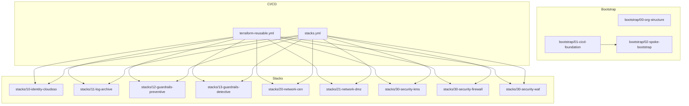
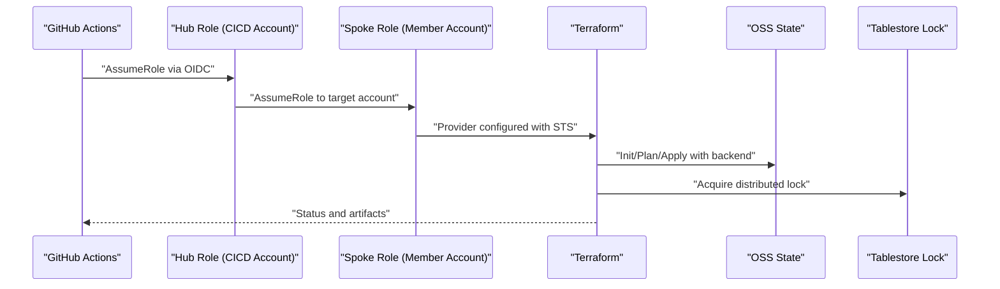
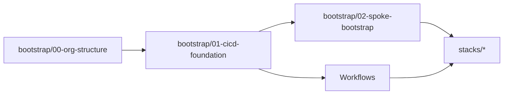

# Maintenance and Monitoring

<cite>
**Referenced Files in This Document**
- [README.md](file://README.md)
- [backend.tf.example](file://bootstrap/01-cicd-foundation/backend.tf.example)
- [terraform-reusable.yml](file://.github/workflows/terraform-reusable.yml)
- [stacks.yml](file://.github/workflows/stacks.yml)
- [main.tf](file://bootstrap/00-org-structure/main.tf)
- [main.tf](file://bootstrap/01-cicd-foundation/main.tf)
- [main.tf](file://bootstrap/02-spoke-bootstrap/main.tf)
- [main.tf](file://bootstrap/02-spoke-bootstrap/modules/spoke-roles/main.tf)
- [main.tf](file://stacks/20-network-cen/main.tf)
- [main.tf](file://stacks/11-log-archive/main.tf)
- [main.tf](file://stacks/30-security-kms/main.tf)
- [main.tf](file://stacks/30-security-firewall/main.tf)
- [main.tf](file://stacks/30-security-waf/main.tf)
- [main.tf](file://stacks/12-guardrails-preventive/main.tf)
- [main.tf](file://stacks/13-guardrails-detective/main.tf)
</cite>

## Table of Contents
1. [Introduction](#introduction)
2. [Project Structure](#project-structure)
3. [Core Components](#core-components)
4. [Architecture Overview](#architecture-overview)
5. [Detailed Component Analysis](#detailed-component-analysis)
6. [Dependency Analysis](#dependency-analysis)
7. [Performance Considerations](#performance-considerations)
8. [Monitoring and Alerting](#monitoring-and-alerting)
9. [Drift Detection and Compliance Monitoring](#drift-detection-and-compliance-monitoring)
10. [Capacity Planning](#capacity-planning)
11. [Preventive Maintenance and Health Checks](#preventive-maintenance-and-health-checks)
12. [Automated Remediation Procedures](#automated-remediation-procedures)
13. [Troubleshooting Guide](#troubleshooting-guide)
14. [Maintenance Runbooks](#maintenance-runbooks)
15. [Conclusion](#conclusion)

## Introduction
This document defines maintenance and monitoring procedures for the Alibaba Cloud Landing Zone Accelerator deployed via Terraform and GitHub Actions. It covers scheduled maintenance (drift detection, compliance monitoring, security policy updates), monitoring and alerting strategies, performance optimization for Terraform operations and CI/CD pipelines, capacity planning for state storage and compute, preventive maintenance, health checks, automated remediation, troubleshooting methodologies, and runbooks for routine tasks, emergency response, and disaster recovery.

## Project Structure
The repository is organized into three primary areas:
- bootstrap: Initial provisioning of organizational structure, CI/CD foundation, and spoke roles.
- stacks: Modular infrastructure-as-code deployments across accounts (identity, logging, guardrails, networking, and security).
- .github/workflows: CI/CD pipelines orchestrating plan/apply operations with OIDC-based credentials.

**Diagram sources**
- [README.md:141-165](file://README.md#L141-L165)
- [terraform-reusable.yml:1-118](file://.github/workflows/terraform-reusable.yml#L1-L118)
- [stacks.yml:1-112](file://.github/workflows/stacks.yml#L1-L112)

**Section sources**
- [README.md:141-165](file://README.md#L141-L165)

## Core Components
- CI/CD Foundation (OSS state, Tablestore locking, OIDC provider, hub roles)
- Spoke Roles (per-account roles chained via hub roles)
- Stacks (modular deployments for identity, logging, guardrails, networking, and security)
- Reusable Workflows (plan-only and apply-only orchestration)

Key responsibilities:
- CI/CD Foundation: Secure state backend, distributed locking, and least-privileged hub roles.
- Spoke Bootstrap: Establishes per-account roles trusted by hub roles.
- Stacks: Implement domain-specific infrastructure with account targeting.
- Reusable Workflows: Provide standardized plan/apply steps with OIDC credential configuration.

**Section sources**
- [main.tf:1-150](file://bootstrap/01-cicd-foundation/main.tf#L1-L150)
- [main.tf:1-33](file://bootstrap/02-spoke-bootstrap/main.tf#L1-L33)
- [main.tf:1-42](file://bootstrap/02-spoke-bootstrap/modules/spoke-roles/main.tf#L1-L42)
- [terraform-reusable.yml:1-118](file://.github/workflows/terraform-reusable.yml#L1-L118)
- [stacks.yml:1-112](file://.github/workflows/stacks.yml#L1-L112)

## Architecture Overview
The system follows a hub-and-spoke model:
- GitHub Actions triggers workflows.
- OIDC tokens are exchanged for short-lived STS credentials in the hub account.
- The hub role assumes a spoke role in the target member account.
- Terraform operates against the target account with least privilege.

**Diagram sources**
- [README.md:23-28](file://README.md#L23-L28)
- [backend.tf.example:13-22](file://bootstrap/01-cicd-foundation/backend.tf.example#L13-L22)
- [terraform-reusable.yml:50-56](file://.github/workflows/terraform-reusable.yml#L50-L56)
- [stacks.yml:42-47](file://.github/workflows/stacks.yml#L42-L47)

## Detailed Component Analysis

### CI/CD Foundation
- State backend: OSS bucket with SSE-KMS and lifecycle rules; Tablestore instance/table for locking.
- OIDC provider: GitHub Actions issuer with audience binding.
- Hub roles: Plan role (PR-scoped) and Apply role (production environment), with state access policy attached.

Operational implications:
- Encrypted state protects drift evidence and secrets.
- Distributed locking prevents concurrent applies.
- Least-privileged roles reduce blast radius.

**Section sources**
- [main.tf:5-43](file://bootstrap/01-cicd-foundation/main.tf#L5-L43)
- [main.tf:49-105](file://bootstrap/01-cicd-foundation/main.tf#L49-L105)
- [main.tf:112-149](file://bootstrap/01-cicd-foundation/main.tf#L112-L149)
- [backend.tf.example:13-22](file://bootstrap/01-cicd-foundation/backend.tf.example#L13-L22)

### Spoke Bootstrap and Roles
- Deploys per-account roles (SpokePlanRole and SpokeApplyRole) that trust hub roles.
- Plan role uses ReadOnlyAccess; Apply role uses AdministratorAccess (scope down per spoke in production).

Operational implications:
- Account isolation via per-account roles.
- Chained assumption reduces cross-account credential exposure.

**Section sources**
- [main.tf:4-32](file://bootstrap/02-spoke-bootstrap/main.tf#L4-L32)
- [main.tf:3-20](file://bootstrap/02-spoke-bootstrap/modules/spoke-roles/main.tf#L3-L20)
- [main.tf:24-41](file://bootstrap/02-spoke-bootstrap/modules/spoke-roles/main.tf#L24-L41)

### Stacks Overview
- Identity, Logging, Guardrails, Networking, and Security stacks are modular and orchestrated by CI/CD workflows.
- Each stack targets a specific spoke account via variables and provider aliases.

Operational implications:
- Modularity enables incremental rollouts and easier maintenance.
- Matrix-driven CI/CD ensures consistent plan/apply across stacks.

**Section sources**
- [stacks.yml:18-112](file://.github/workflows/stacks.yml#L18-L112)
- [main.tf:1-16](file://stacks/20-network-cen/main.tf#L1-L16)
- [main.tf:1-10](file://stacks/11-log-archive/main.tf#L1-L10)
- [main.tf:1-10](file://stacks/30-security-kms/main.tf#L1-L10)
- [main.tf:1-10](file://stacks/30-security-firewall/main.tf#L1-L10)
- [main.tf:1-10](file://stacks/30-security-waf/main.tf#L1-L10)
- [main.tf:1-10](file://stacks/12-guardrails-preventive/main.tf#L1-L10)
- [main.tf:1-10](file://stacks/13-guardrails-detective/main.tf#L1-L10)

### Reusable Workflows
- Standardized steps: checkout, OIDC credential configuration, Terraform setup, init, plan/apply, artifact upload, and PR comment.
- Inputs support plan-only mode and spoke role chaining.

Operational implications:
- Consistency across stacks.
- Plan-only mode supports drift detection scheduling.

**Section sources**
- [terraform-reusable.yml:1-118](file://.github/workflows/terraform-reusable.yml#L1-L118)

## Dependency Analysis
- Bootstrap order: 00-org-structure → 01-cicd-foundation → 02-spoke-bootstrap.
- CI/CD depends on hub roles and spoke roles for provider chaining.
- Stacks depend on spoke account IDs configured in repository variables.

**Diagram sources**
- [README.md:141-165](file://README.md#L141-L165)
- [main.tf:1-49](file://bootstrap/00-org-structure/main.tf#L1-L49)
- [main.tf:1-150](file://bootstrap/01-cicd-foundation/main.tf#L1-L150)
- [main.tf:1-33](file://bootstrap/02-spoke-bootstrap/main.tf#L1-L33)
- [stacks.yml:18-112](file://.github/workflows/stacks.yml#L18-L112)

**Section sources**
- [README.md:141-165](file://README.md#L141-L165)

## Performance Considerations
Optimizations for Terraform operations and CI/CD efficiency:
- Use plan-only runs for drift detection to avoid unnecessary applies.
- Limit concurrency during apply jobs to prevent state contention.
- Pin Terraform versions in workflows for reproducibility.
- Cache Terraform plugins and modules where applicable.
- Prefer matrix strategies to parallelize independent stacks while controlling global concurrency.

Recommendations:
- Schedule drift checks outside peak hours.
- Monitor workflow duration and optimize slowest stacks first.
- Use smaller, focused stacks to reduce plan/apply time.

**Section sources**
- [README.md:129-139](file://README.md#L129-L139)
- [stacks.yml:74-75](file://.github/workflows/stacks.yml#L74-L75)
- [terraform-reusable.yml:14,59](file://.github/workflows/terraform-reusable.yml#L14,L59)

## Monitoring and Alerting
Monitoring and alerting strategies leveraging Alibaba Cloud services and external systems:
- Observability:
  - Centralize logs and metrics using Alibaba Cloud SLS and ARMS.
  - Tag all resources consistently for correlation.
- CI/CD:
  - Track workflow success/failure rates and duration.
  - Alert on repeated failures or timeouts.
- Infrastructure:
  - Monitor OSS bucket metrics (requests, errors, latency).
  - Monitor Tablestore capacity and throttling.
  - Watch Cloud Firewall and WAF metrics for anomalies.
- External monitoring:
  - Integrate with PagerDuty or similar for incident routing.
  - Use Slack or Teams webhooks for notifications.

[No sources needed since this section provides general guidance]

## Drift Detection and Compliance Monitoring
Scheduled drift detection:
- Nightly or off-peak plan-only runs to surface configuration drift.
- Store plan artifacts for review and diff analysis.

Compliance monitoring:
- Preventive guardrails: Resource Directory control policies to enforce standards.
- Detective guardrails: Cloud Config rules to detect non-compliant resources.
- Periodic reviews of policies and rules; update as standards evolve.

**Section sources**
- [README.md:129-139](file://README.md#L129-L139)
- [main.tf:1-10](file://stacks/12-guardrails-preventive/main.tf#L1-L10)
- [main.tf:1-10](file://stacks/13-guardrails-detective/main.tf#L1-L10)

## Capacity Planning
State storage:
- Estimate bucket growth using lifecycle rules and retention policies.
- Monitor version counts and storage costs; adjust lifecycle rules accordingly.

Network bandwidth:
- Evaluate inter-account traffic patterns and CEN bandwidth needs.
- Right-size DMZ and transit gateway configurations.

Compute resources:
- CI/CD runners: Scale based on workflow concurrency and queue length.
- Terraform workers: Use ephemeral runners to avoid long-running compute.

**Section sources**
- [main.tf:18-24](file://bootstrap/01-cicd-foundation/main.tf#L18-L24)
- [main.tf:12-15](file://stacks/20-network-cen/main.tf#L12-L15)

## Preventive Maintenance and Health Checks
Preventive maintenance:
- Quarterly reviews of hub and spoke role permissions.
- Annual rotation of OIDC provider client IDs and hub role policies.
- Monthly validation of state backend encryption and access controls.

Health checks:
- Verify OIDC trust relationships and role assumptions.
- Confirm OSS bucket encryption and ACLs.
- Validate Tablestore lock table availability.

**Section sources**
- [main.tf:49-55](file://bootstrap/01-cicd-foundation/main.tf#L49-L55)
- [main.tf:112-149](file://bootstrap/01-cicd-foundation/main.tf#L112-L149)
- [backend.tf.example:13-22](file://bootstrap/01-cicd-foundation/backend.tf.example#L13-L22)

## Automated Remediation Procedures
Automated remediation:
- Rollback on failed applies using CI/CD rollback workflows.
- Auto-fix idempotent drifts via scheduled plan-and-fix jobs for known benign changes.
- Automated alerts trigger remediation playbooks (e.g., restore from backups, re-apply approved plans).

[No sources needed since this section provides general guidance]

## Troubleshooting Guide
Common issues and resolutions:
- OIDC authentication failures:
  - Verify OIDC provider ARN and audience in repository variables.
  - Confirm role conditions match repository and environment.
- State locking conflicts:
  - Investigate stuck locks; delete stale entries if safe.
  - Reduce concurrency and retry.
- Permission denied:
  - Ensure hub roles have state access policy attached.
  - Verify spoke roles trust the hub roles.
- Drift surprises:
  - Review plan artifacts and reconcile differences.
  - Temporarily disable auto-apply until drift is resolved.

**Section sources**
- [terraform-reusable.yml:50-56](file://.github/workflows/terraform-reusable.yml#L50-L56)
- [stacks.yml:94-99](file://.github/workflows/stacks.yml#L94-L99)
- [main.tf:112-149](file://bootstrap/01-cicd-foundation/main.tf#L112-L149)
- [main.tf:3-20](file://bootstrap/02-spoke-bootstrap/modules/spoke-roles/main.tf#L3-L20)

## Maintenance Runbooks

### Routine Tasks
- Add a new spoke account:
  - Update spoke bootstrap variables and apply.
  - Update repository variables with new spoke account IDs.
- Add a new stack:
  - Copy an existing stack as a template.
  - Update providers and variables.
  - Add to workflow matrix and open a PR for plan review.

**Section sources**
- [README.md:116-128](file://README.md#L116-L128)

### Emergency Response Protocols
- Immediate steps:
  - Isolate affected spoke account if compromised.
  - Rotate hub and spoke role keys.
  - Revoke OIDC provider client IDs and regenerate.
- Post-incident:
  - Audit logs and plans for indicators.
  - Rebuild state backend if corrupted.
  - Restore from backups where applicable.

**Section sources**
- [README.md:106-113](file://README.md#L106-L113)
- [backend.tf.example:13-22](file://bootstrap/01-cicd-foundation/backend.tf.example#L13-L22)

### Disaster Recovery Procedures
- DR plan:
  - Maintain encrypted state copies in secondary regions.
  - Automate OIDC provider and role recreation.
  - Document manual remediation steps for critical resources.
- Recovery:
  - Recreate CI/CD foundation.
  - Re-apply stacks in dependency order.
  - Validate drift-free state post-recovery.

**Section sources**
- [README.md:23-26](file://README.md#L23-L26)
- [main.tf:5-43](file://bootstrap/01-cicd-foundation/main.tf#L5-L43)

## Conclusion
This repository establishes a secure, auditable, and automated path to deploy and operate a Landing Zone on Alibaba Cloud. By combining OIDC-based credentials, encrypted state storage, distributed locking, modular stacks, and CI/CD automation, teams can maintain a resilient infrastructure with robust monitoring, scheduled drift detection, and clear operational runbooks.