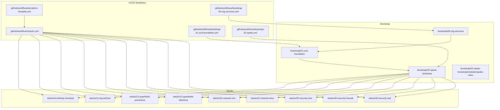
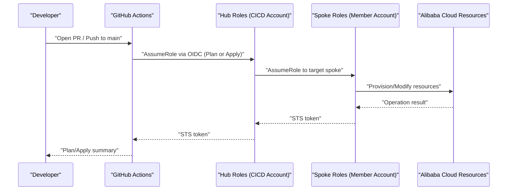
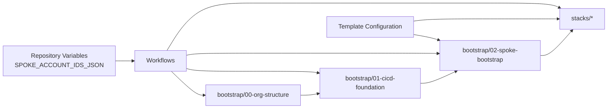

# Operational Procedures

<cite>
**Referenced Files in This Document**
- [README.md](file://README.md)
- [backend.tf.example](file://bootstrap/01-cicd-foundation/backend.tf.example)
- [main.tf](file://bootstrap/00-org-structure/main.tf)
- [variables.tf](file://bootstrap/00-org-structure/variables.tf)
- [main.tf](file://bootstrap/01-cicd-foundation/main.tf)
- [variables.tf](file://bootstrap/01-cicd-foundation/variables.tf)
- [main.tf](file://bootstrap/02-spoke-bootstrap/main.tf)
- [variables.tf](file://bootstrap/02-spoke-bootstrap/variables.tf)
- [outputs.tf](file://bootstrap/02-spoke-bootstrap/outputs.tf)
- [main.tf](file://bootstrap/02-spoke-bootstrap/modules/spoke-roles/main.tf)
- [main.tf](file://stacks/20-network-cen/main.tf)
- [variables.tf](file://stacks/20-network-cen/variables.tf)
- [terraform-reusable.yml](file://.github/workflows/terraform-reusable.yml)
- [stacks.yml](file://.github/workflows/stacks.yml)
- [bootstrap-00-org-structure.yml](file://.github/workflows/bootstrap-00-org-structure.yml)
- [bootstrap-01-cicd-foundation.yml](file://.github/workflows/bootstrap-01-cicd-foundation.yml)
- [bootstrap-02-spoke.yml](file://.github/workflows/bootstrap-02-spoke.yml)
</cite>

## Update Summary
**Changes Made**
- Enhanced spoke account management procedures with detailed template-based approach
- Updated stack deployment documentation with matrix configuration details
- Added comprehensive drift detection procedures using scheduled workflows
- Expanded operational runbooks with step-by-step instructions
- Improved troubleshooting guidance for common day-2 scenarios

## Table of Contents
1. [Introduction](#introduction)
2. [Project Structure](#project-structure)
3. [Core Components](#core-components)
4. [Architecture Overview](#architecture-overview)
5. [Detailed Component Analysis](#detailed-component-analysis)
6. [Dependency Analysis](#dependency-analysis)
7. [Performance Considerations](#performance-considerations)
8. [Troubleshooting Guide](#troubleshooting-guide)
9. [Conclusion](#conclusion)
10. [Appendices](#appendices)

## Introduction
This document defines comprehensive day-2 operations, state management, and maintenance procedures for the Alibaba Cloud Landing Zone infrastructure demonstrated in this repository. It covers adding new spoke accounts through template-based configuration, implementing new stacks using existing examples, built-in drift detection capabilities, state migration from local to remote backend, backend configuration management, distributed locking mechanisms, maintenance tasks, monitoring approaches, troubleshooting methodologies, backup and recovery procedures, performance optimization, capacity planning, change management processes, approval workflows, rollback procedures, and operational runbooks for common scenarios and emergency response protocols.

## Project Structure
The repository is organized into three bootstrap phases and a stacks catalog, plus CI/CD workflows that orchestrate plan and apply operations against spoke accounts through OIDC-assumed hub roles. The architecture supports template-based expansion for both spoke accounts and stack deployments.

**Diagram sources**
- [README.md:141-165](file://README.md#L141-L165)
- [bootstrap-00-org-structure.yml:1-36](file://.github/workflows/bootstrap-00-org-structure.yml#L1-L36)
- [bootstrap-01-cicd-foundation.yml:1-36](file://.github/workflows/bootstrap-01-cicd-foundation.yml#L1-L36)
- [bootstrap-02-spoke.yml:1-36](file://.github/workflows/bootstrap-02-spoke.yml#L1-L36)
- [stacks.yml:1-112](file://.github/workflows/stacks.yml#L1-L112)
- [terraform-reusable.yml:1-118](file://.github/workflows/terraform-reusable.yml#L1-L118)

**Section sources**
- [README.md:141-165](file://README.md#L141-L165)

## Core Components
- Bootstrap phases establish organizational structure, CI/CD foundation (OIDC, state backend, locking), and spoke roles using template-based configuration.
- Stacks implement domain-specific capabilities (identity, logging, guardrails, networking, security) with matrix-driven deployment.
- Workflows enforce least-privilege plan vs apply roles, PR plans, and production-environment apply gating.
- Template-based expansion system supports dynamic spoke account and stack deployment.

Key operational responsibilities:
- State backend and locking: managed in-phase bootstrap with OSS and OTS.
- Credential flow: OIDC token -> hub roles -> spoke roles -> resources.
- Maintenance: drift detection via scheduled plans, state migration, and spoke account expansion.
- Template management: consistent configuration patterns for new accounts and stacks.

**Section sources**
- [README.md:106-140](file://README.md#L106-L140)
- [main.tf:5-43](file://bootstrap/01-cicd-foundation/main.tf#L5-L43)
- [main.tf:3-41](file://bootstrap/02-spoke-bootstrap/modules/spoke-roles/main.tf#L3-L41)

## Architecture Overview
The CI/CD architecture uses GitHub Actions with OIDC federation to assume short-lived hub roles in the CICD account, which then chain to spoke roles in member accounts to provision resources. The system supports dynamic expansion through template-based configuration.

**Diagram sources**
- [README.md:23-28](file://README.md#L23-L28)
- [terraform-reusable.yml:50-56](file://.github/workflows/terraform-reusable.yml#L50-L56)
- [stacks.yml:42-47](file://.github/workflows/stacks.yml#L42-L47)
- [main.tf:3-41](file://bootstrap/02-spoke-bootstrap/modules/spoke-roles/main.tf#L3-L41)

## Detailed Component Analysis

### State Backend and Distributed Locking
- Remote backend: OSS bucket with server-side encryption and lifecycle rules.
- Distributed locking: OTS table used for state locks during apply operations.
- Migration: After bootstrap, local state is migrated to OSS using a backend block and migrate-state workflow.

Operational procedures:
- Backend configuration: Add the backend block to versions and initialize with migrate-state after enabling the backend.
- Locking: OTS table enforces mutual exclusion for apply operations.
- Encryption: OSS bucket configured with KMS SSE.

**Section sources**
- [README.md:78-87](file://README.md#L78-L87)
- [backend.tf.example:13-22](file://bootstrap/01-cicd-foundation/backend.tf.example#L13-L22)
- [main.tf:5-43](file://bootstrap/01-cicd-foundation/main.tf#L5-L43)

### CI/CD Foundation (OIDC, Hub Roles, State Infrastructure)
- OIDC provider created in the CICD account.
- Hub roles: Plan role for PR plans; Apply role for production apply with environment gating.
- Hub policies grant access to OSS/OTS and cross-account assume-role to spoke roles.

Change management:
- Plan role is used on PRs; Apply role requires production environment and reviewers.

**Section sources**
- [README.md:106-113](file://README.md#L106-L113)
- [main.tf:49-149](file://bootstrap/01-cicd-foundation/main.tf#L49-L149)

### Spoke Bootstrap (Template-Based Per-Account Roles)
- Deploys SpokePlanRole and SpokeApplyRole into each member account using template-based configuration.
- Trusts the hub's plan/apply roles respectively.
- Plan role is read-only; Apply role is administrator scoped to the spoke.
- Dynamic expansion through spoke map configuration.

Maintenance:
- To add a new spoke, update the spoke map in variables.tf and re-run the spoke bootstrap.
- Each spoke account gets dedicated provider aliases and module instances.

**Updated** Enhanced with template-based spoke account management using map configuration and dynamic provider aliasing.

**Section sources**
- [README.md:116-121](file://README.md#L116-L121)
- [main.tf:4-32](file://bootstrap/02-spoke-bootstrap/main.tf#L4-L32)
- [main.tf:3-41](file://bootstrap/02-spoke-bootstrap/modules/spoke-roles/main.tf#L3-L41)
- [variables.tf:12-25](file://bootstrap/02-spoke-bootstrap/variables.tf#L12-L25)
- [outputs.tf:1-21](file://bootstrap/02-spoke-bootstrap/outputs.tf#L1-L21)

### Stacks Catalog and Matrix-Driven Deployment
- Stacks are organized by domain (identity, logging, guardrails, network, security).
- Deployment uses matrix-driven workflows targeting spoke accounts via injected spoke role ARNs.
- Each stack defines its own variables and targets a specific spoke account through account_key mapping.
- Template-based approach allows easy replication of existing stack configurations.

New stack implementation:
- Copy an existing stack as a template, adjust providers and variables, add to the stacks matrix with proper account_key mapping, and validate with a PR plan.
- Account mapping uses SPOKE_ACCOUNT_IDS_JSON repository variable for dynamic account resolution.

**Updated** Enhanced with detailed matrix configuration and template-based deployment approach.

**Section sources**
- [README.md:122-128](file://README.md#L122-L128)
- [stacks.yml:18-112](file://.github/workflows/stacks.yml#L18-L112)
- [variables.tf:7-10](file://stacks/20-network-cen/variables.tf#L7-L10)

### Built-in Drift Detection and Continuous Compliance Monitoring
- Schedule periodic plan-only runs (e.g., nightly) to surface configuration drift automatically.
- Reusable workflow supports plan-only mode for continuous compliance monitoring.
- Automated drift detection through cron expressions leveraging reusable workflow capabilities.
- Integration with GitHub Actions scheduling for regular compliance checks.

Operational procedures:
- Configure scheduled workflows using cron expressions for automated drift detection.
- Monitor plan artifacts and PR comments for drift notifications.
- Address deviations promptly through standard change management process.

**Updated** Comprehensive drift detection capabilities with scheduled workflow integration and continuous compliance monitoring.

**Section sources**
- [README.md:129-139](file://README.md#L129-L139)
- [terraform-reusable.yml:65-111](file://.github/workflows/terraform-reusable.yml#L65-111)

### Credential Flow and Least Privilege
- OIDC token is exchanged for short-lived STS tokens.
- Plan vs apply roles enforced by workflow inputs and environment gating.
- Spoke role chaining ensures account isolation.
- Template-based credential injection through environment variables.

**Section sources**
- [README.md:106-113](file://README.md#L106-L113)
- [terraform-reusable.yml:28-32](file://.github/workflows/terraform-reusable.yml#L28-L32)
- [stacks.yml:72-74](file://.github/workflows/stacks.yml#L72-L74)

### Maintenance Tasks and Monitoring Approaches
- Maintenance:
  - Regularly review and approve PR plans before applying to production.
  - Monitor drift via scheduled plan runs and address deviations promptly.
  - Rotate hub role credentials periodically and audit access.
  - Validate spoke account configurations and stack deployments.
- Monitoring:
  - Track workflow logs and plan artifacts across all matrix jobs.
  - Use GitHub environments and required reviewers to gate production changes.
  - Monitor scheduled drift detection results and compliance status.

**Updated** Enhanced with template-based maintenance procedures and comprehensive monitoring approaches.

**Section sources**
- [README.md:106-113](file://README.md#L106-L113)
- [stacks.yml:72-74](file://.github/workflows/stacks.yml#L72-L74)

### Backup and Recovery Procedures
- OSS versioning enabled; lifecycle rules expire old versions.
- State migration to OSS ensures recoverability from local workstations.
- Recovery steps:
  - Restore from OSS versions if needed.
  - Recreate OTS lock table if required.
  - Validate spoke account configurations and rebuild if necessary.

**Section sources**
- [main.tf:10-24](file://bootstrap/01-cicd-foundation/main.tf#L10-L24)
- [README.md:78-87](file://README.md#L78-L87)

### Performance Optimization and Capacity Planning
- Performance:
  - Use plan-only runs to reduce apply load.
  - Limit max-parallel applies to 1 for production to avoid contention.
  - Optimize matrix job parallelism based on spoke account count.
- Capacity:
  - Plan and monitor OTS table capacity for state locks.
  - Monitor OSS bucket growth and tune lifecycle policies.
  - Scale spoke account management based on template efficiency.

**Updated** Enhanced with template-based performance considerations and capacity planning.

**Section sources**
- [stacks.yml:74-74](file://.github/workflows/stacks.yml#L74-L74)
- [main.tf:27-43](file://bootstrap/01-cicd-foundation/main.tf#L27-L43)

### Change Management Processes, Approval Workflows, and Rollback
- Change management:
  - PR-based plan for all changes; auto-apply only on main branch for approved changes.
  - Production environment gating for apply jobs.
  - Template validation through matrix-based testing.
- Approval workflows:
  - Required reviewers for production environment.
  - Automated drift detection results require attention.
- Rollback:
  - Re-run apply with previous known-good plan or restore from OSS versions.
  - Template rollback through version control history.

**Updated** Enhanced with template-based change management and drift detection integration.

**Section sources**
- [README.md:106-113](file://README.md#L106-L113)
- [stacks.yml:72-74](file://.github/workflows/stacks.yml#L72-L74)

### Emergency Response Protocols
- Immediate actions:
  - Block production environment until incident is resolved.
  - Revert last known-good commit and re-apply.
  - Pause scheduled drift detection if causing issues.
- Communication:
  - Post plan diffs and remediation steps in PR comments.
  - Alert stakeholders on drift detection failures.
- Post-mortem:
  - Document root cause, mitigation, and preventive measures.
  - Update templates to prevent recurrence.

**Updated** Enhanced with drift detection emergency response procedures.

**Section sources**
- [terraform-reusable.yml:81-111](file://.github/workflows/terraform-reusable.yml#L81-L111)
- [stacks.yml:72-74](file://.github/workflows/stacks.yml#L72-L74)

## Dependency Analysis
The operational flows depend on:
- Bootstrap order: org structure -> CI/CD foundation -> spoke bootstrap.
- Workflows depend on repository variables for hub account, OIDC provider, and spoke account mappings.
- Stacks depend on spoke roles and injected spoke role ARNs.
- Template-based dependencies between spoke configuration and stack deployment matrices.

**Diagram sources**
- [README.md:141-165](file://README.md#L141-L165)
- [variables.tf:12-25](file://bootstrap/02-spoke-bootstrap/variables.tf#L12-L25)
- [stacks.yml:38-90](file://.github/workflows/stacks.yml#L38-L90)

**Section sources**
- [README.md:141-165](file://README.md#L141-L165)
- [variables.tf:12-25](file://bootstrap/02-spoke-bootstrap/variables.tf#L12-L25)
- [stacks.yml:38-90](file://.github/workflows/stacks.yml#L38-L90)

## Performance Considerations
- Reduce concurrent applies: limit to 1 in production.
- Use plan-only schedules to detect drift without modifying state.
- Monitor OTS lock table capacity and OSS bucket size; adjust lifecycle policies accordingly.
- Optimize matrix job parallelism based on spoke account count and resource dependencies.
- Leverage template-based configuration for efficient scaling operations.

[No sources needed since this section provides general guidance]

## Troubleshooting Guide
Common issues and resolutions:
- State migration failures:
  - Ensure backend block is present and credentials are set before migrate-state.
  - Verify OSS bucket and OTS table exist and are accessible.
- OIDC assumption errors:
  - Confirm OIDC provider ARN and audience match workflow inputs.
  - Verify GitHub environment and required reviewers are configured for apply.
- Drift not detected:
  - Confirm scheduled plan runs are enabled and workflow permissions are granted.
  - Check cron expression syntax and timezone settings.
- Spoke role access denied:
  - Verify SpokePlanRole/SpokeApplyRole trust policies and hub role attachments.
  - Validate spoke account configuration in variables.tf matches SPOKE_ACCOUNT_IDS_JSON.
- Matrix deployment failures:
  - Check account_key mapping in stacks.yml matches spoke configuration.
  - Verify SPOKE_ACCOUNT_IDS_JSON contains all required account mappings.

**Updated** Enhanced with template-based troubleshooting scenarios and matrix deployment issues.

**Section sources**
- [README.md:78-87](file://README.md#L78-L87)
- [backend.tf.example:4-11](file://bootstrap/01-cicd-foundation/backend.tf.example#L4-L11)
- [terraform-reusable.yml:50-56](file://.github/workflows/terraform-reusable.yml#L50-L56)
- [stacks.yml:72-74](file://.github/workflows/stacks.yml#L72-L74)

## Conclusion
This repository demonstrates a secure, automated, and auditable Landing Zone delivery model using Terraform and GitHub Actions with OIDC. The operational procedures outlined here enable safe day-2 operations, robust state management, resilient maintenance practices across spoke accounts and stacks, and comprehensive drift detection through template-based configuration and scheduled workflows. The system supports scalable expansion while maintaining security and compliance standards.

[No sources needed since this section summarizes without analyzing specific files]

## Appendices

### Appendix A: Adding a New Spoke Account (Runbook)
- Steps:
  - Add the new account to the `spokes` variable in `bootstrap/02-spoke-bootstrap/variables.tf` following the existing template pattern.
  - Run `terraform apply` in `bootstrap/02-spoke-bootstrap` to create SpokePlanRole and SpokeApplyRole.
  - Update `SPOKE_ACCOUNT_IDS_JSON` in the GitHub repository variables with the new account mapping.
  - Verify the new spoke appears in the spoke bootstrap outputs.
- Validation:
  - Verify roles exist in the new spoke account console.
  - Test plan/apply via a stack targeting the new spoke account.
  - Confirm OIDC credential flow works with the new spoke roles.

**Updated** Enhanced with template-based spoke account addition procedures.

**Section sources**
- [README.md:116-121](file://README.md#L116-L121)
- [variables.tf:12-25](file://bootstrap/02-spoke-bootstrap/variables.tf#L12-L25)
- [outputs.tf:1-21](file://bootstrap/02-spoke-bootstrap/outputs.tf#L1-L21)

### Appendix B: Implementing a New Stack (Runbook)
- Steps:
  - Copy an existing stack (e.g., `stacks/20-network-cen`) as a template.
  - Update `providers.tf` and `variables.tf` to target the desired spoke account.
  - Add the new stack to the `matrix` in `.github/workflows/stacks.yml` with proper account_key mapping.
  - Open a PR to validate the plan across all matrix jobs.
  - Merge to main for production deployment.
- Validation:
  - Review plan artifact and comments posted by the workflow for each matrix job.
  - Verify resources are created in the correct spoke account.
  - Test drift detection for the new stack.

**Updated** Enhanced with matrix configuration and template-based stack deployment procedures.

**Section sources**
- [README.md:122-128](file://README.md#L122-L128)
- [stacks.yml:24-33](file://.github/workflows/stacks.yml#L24-L33)

### Appendix C: Drift Detection Setup (Runbook)
- Steps:
  - Create a scheduled workflow file using cron expressions (e.g., `'0 2 * * *'` for daily at 2 AM).
  - Configure the reusable workflow with plan-only mode for drift detection.
  - Set up appropriate permissions and environment variables.
  - Monitor plan artifacts and PR comments for drift notifications.
- Validation:
  - Confirm drift is captured in PR comments and artifacts.
  - Verify scheduled runs execute successfully.
  - Test alerting mechanisms for drift detection results.

**Updated** Comprehensive drift detection setup with scheduled workflow configuration.

**Section sources**
- [README.md:129-139](file://README.md#L129-L139)
- [terraform-reusable.yml:65-111](file://.github/workflows/terraform-reusable.yml#L65-L111)

### Appendix D: State Migration (Local to Remote Backend)
- Steps:
  - Add backend block to versions.
  - Obtain temporary credentials for the CICD account.
  - Initialize with migrate-state to move local state to OSS.
  - Verify state migration success and lock table functionality.
- Validation:
  - Confirm state file exists in OSS and OTS lock table is ready.
  - Test subsequent terraform operations work correctly.

**Section sources**
- [README.md:78-87](file://README.md#L78-L87)
- [backend.tf.example:13-22](file://bootstrap/01-cicd-foundation/backend.tf.example#L13-L22)

### Appendix E: Backend Configuration Management
- Configuration:
  - OSS bucket with SSE-KMS and lifecycle rules.
  - OTS table for distributed locking.
- Management:
  - Use hub role policies to grant access to state infrastructure.
  - Keep credentials short-lived and rotate regularly.
  - Monitor backend performance and capacity.

**Section sources**
- [main.tf:5-43](file://bootstrap/01-cicd-foundation/main.tf#L5-L43)
- [main.tf:112-149](file://bootstrap/01-cicd-foundation/main.tf#L112-L149)

### Appendix F: Distributed Locking Mechanism
- Mechanism:
  - OTS table used as a lock database for Terraform state.
- Operation:
  - Lock acquired automatically during init/apply; released after completion.
- Monitoring:
  - Watch for lock contention and investigate long-held locks.
  - Monitor lock table performance metrics.

**Section sources**
- [main.tf:33-43](file://bootstrap/01-cicd-foundation/main.tf#L33-L43)
- [README.md:23-26](file://README.md#L23-L26)

### Appendix G: Maintenance and Monitoring Checklist
- Daily:
  - Review PR plan artifacts and comments.
  - Check workflow run statuses including matrix jobs.
  - Monitor drift detection results and compliance status.
- Weekly:
  - Audit hub role access and permissions.
  - Review OSS bucket size and OTS capacity.
  - Validate spoke account configurations and stack deployments.
- Monthly:
  - Validate drift detection coverage and effectiveness.
  - Rotate hub role credentials and test OIDC federation.
  - Review template configurations for optimization opportunities.

**Updated** Enhanced with template-based maintenance procedures and drift detection monitoring.

**Section sources**
- [README.md:106-113](file://README.md#L106-L113)
- [stacks.yml:72-74](file://.github/workflows/stacks.yml#L72-L74)

### Appendix H: Template-Based Operations Reference
- Spoke Account Templates:
  - Follow the map structure in variables.tf for consistent spoke configuration.
  - Use provider aliases for multi-account targeting.
  - Maintain consistent naming conventions across spoke modules.
- Stack Deployment Templates:
  - Use existing stacks as reference implementations.
  - Follow matrix configuration patterns for account mapping.
  - Leverage environment variables for dynamic configuration.
- Workflow Templates:
  - Utilize reusable workflow for consistent operations.
  - Follow permission and environment patterns.
  - Implement proper error handling and logging.

**New Section** Comprehensive template-based operations reference for consistent day-2 operations.

**Section sources**
- [variables.tf:12-25](file://bootstrap/02-spoke-bootstrap/variables.tf#L12-L25)
- [stacks.yml:24-33](file://.github/workflows/stacks.yml#L24-L33)
- [terraform-reusable.yml:1-118](file://.github/workflows/terraform-reusable.yml#L1-L118)