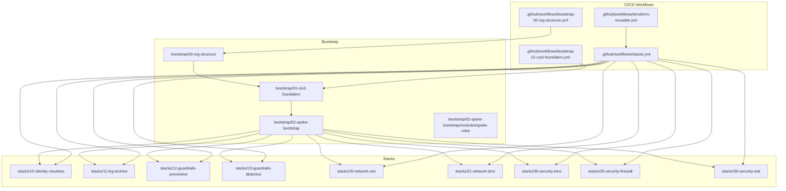
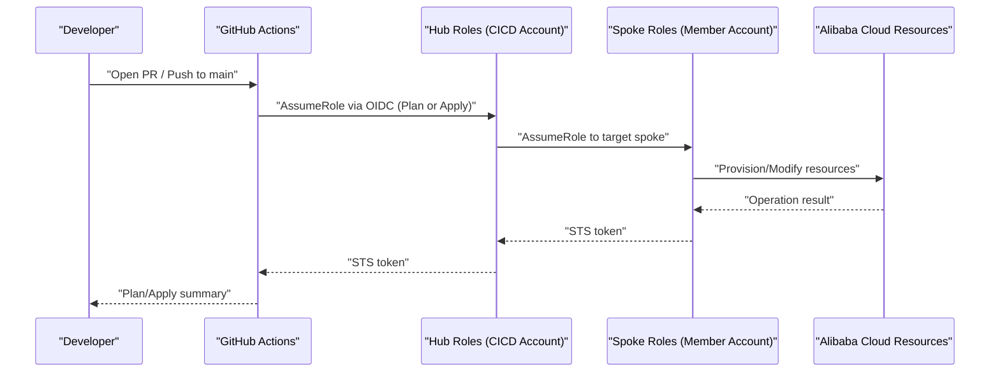
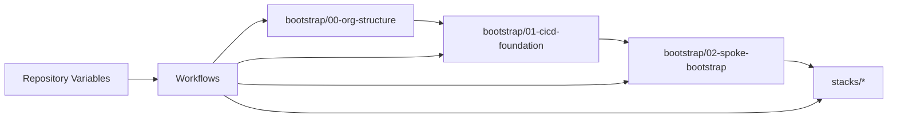

# Operational Procedures

<cite>
**Referenced Files in This Document**
- [README.md](file://README.md)
- [backend.tf.example](file://bootstrap/01-cicd-foundation/backend.tf.example)
- [main.tf](file://bootstrap/00-org-structure/main.tf)
- [variables.tf](file://bootstrap/00-org-structure/variables.tf)
- [main.tf](file://bootstrap/01-cicd-foundation/main.tf)
- [variables.tf](file://bootstrap/01-cicd-foundation/variables.tf)
- [main.tf](file://bootstrap/02-spoke-bootstrap/main.tf)
- [variables.tf](file://bootstrap/02-spoke-bootstrap/variables.tf)
- [main.tf](file://bootstrap/02-spoke-bootstrap/modules/spoke-roles/main.tf)
- [main.tf](file://stacks/20-network-cen/main.tf)
- [variables.tf](file://stacks/20-network-cen/variables.tf)
- [terraform-reusable.yml](file://.github/workflows/terraform-reusable.yml)
- [stacks.yml](file://.github/workflows/stacks.yml)
- [bootstrap-00-org-structure.yml](file://.github/workflows/bootstrap-00-org-structure.yml)
- [bootstrap-01-cicd-foundation.yml](file://.github/workflows/bootstrap-01-cicd-foundation.yml)
</cite>

## Table of Contents
1. [Introduction](#introduction)
2. [Project Structure](#project-structure)
3. [Core Components](#core-components)
4. [Architecture Overview](#architecture-overview)
5. [Detailed Component Analysis](#detailed-component-analysis)
6. [Dependency Analysis](#dependency-analysis)
7. [Performance Considerations](#performance-considerations)
8. [Troubleshooting Guide](#troubleshooting-guide)
9. [Conclusion](#conclusion)
10. [Appendices](#appendices)

## Introduction
This document defines day-2 operations, state management, and maintenance procedures for the Alibaba Cloud Landing Zone infrastructure demonstrated in this repository. It covers adding new spoke accounts, implementing new stacks, drift detection, state migration from local to remote backend, backend configuration, distributed locking, maintenance and monitoring, backup and recovery, performance optimization, capacity planning, change management and approvals, rollback procedures, and runbooks for common scenarios and emergencies.

## Project Structure
The repository is organized into three bootstrap phases and a stacks catalog, plus CI/CD workflows that orchestrate plan and apply operations against spoke accounts through OIDC-assumed hub roles.

**Diagram sources**
- [README.md:141-165](file://README.md#L141-L165)
- [bootstrap-00-org-structure.yml:1-36](file://.github/workflows/bootstrap-00-org-structure.yml#L1-L36)
- [bootstrap-01-cicd-foundation.yml:1-36](file://.github/workflows/bootstrap-01-cicd-foundation.yml#L1-L36)
- [stacks.yml:1-112](file://.github/workflows/stacks.yml#L1-L112)
- [terraform-reusable.yml:1-118](file://.github/workflows/terraform-reusable.yml#L1-L118)

**Section sources**
- [README.md:141-165](file://README.md#L141-L165)

## Core Components
- Bootstrap phases establish organizational structure, CI/CD foundation (OIDC, state backend, locking), and spoke roles.
- Stacks implement domain-specific capabilities (identity, logging, guardrails, networking, security).
- Workflows enforce least-privilege plan vs apply roles, PR plans, and production-environment apply gating.

Key operational responsibilities:
- State backend and locking: managed in-phase bootstrap with OSS and OTS.
- Credential flow: OIDC token -> hub roles -> spoke roles -> resources.
- Maintenance: drift detection via scheduled plans, state migration, and spoke account expansion.

**Section sources**
- [README.md:106-140](file://README.md#L106-L140)
- [main.tf:5-43](file://bootstrap/01-cicd-foundation/main.tf#L5-L43)
- [main.tf:3-41](file://bootstrap/02-spoke-bootstrap/modules/spoke-roles/main.tf#L3-L41)

## Architecture Overview
The CI/CD architecture uses GitHub Actions with OIDC federation to assume short-lived hub roles in the CICD account, which then chain to spoke roles in member accounts to provision resources.

**Diagram sources**
- [README.md:23-28](file://README.md#L23-L28)
- [terraform-reusable.yml:50-56](file://.github/workflows/terraform-reusable.yml#L50-L56)
- [stacks.yml:42-47](file://.github/workflows/stacks.yml#L42-L47)
- [main.tf:3-41](file://bootstrap/02-spoke-bootstrap/modules/spoke-roles/main.tf#L3-L41)

## Detailed Component Analysis

### State Backend and Distributed Locking
- Remote backend: OSS bucket with server-side encryption and lifecycle rules.
- Distributed locking: OTS table used for state locks during apply operations.
- Migration: After bootstrap, local state is migrated to OSS using a backend block and migrate-state workflow.

Operational procedures:
- Backend configuration: Add the backend block to versions and initialize with migrate-state after enabling the backend.
- Locking: OTS table enforces mutual exclusion for apply operations.
- Encryption: OSS bucket configured with KMS SSE.

**Section sources**
- [README.md:78-87](file://README.md#L78-L87)
- [backend.tf.example:13-22](file://bootstrap/01-cicd-foundation/backend.tf.example#L13-L22)
- [main.tf:5-43](file://bootstrap/01-cicd-foundation/main.tf#L5-L43)

### CI/CD Foundation (OIDC, Hub Roles, State Infrastructure)
- OIDC provider created in the CICD account.
- Hub roles: Plan role for PR plans; Apply role for production apply with environment gating.
- Hub policies grant access to OSS/OTS and cross-account assume-role to spoke roles.

Change management:
- Plan role is used on PRs; Apply role requires production environment and reviewers.

**Section sources**
- [README.md:106-113](file://README.md#L106-L113)
- [main.tf:49-149](file://bootstrap/01-cicd-foundation/main.tf#L49-L149)

### Spoke Bootstrap (Per-Account Roles)
- Deploys SpokePlanRole and SpokeApplyRole into each member account.
- Trusts the hub’s plan/apply roles respectively.
- Plan role is read-only; Apply role is administrator scoped to the spoke.

Maintenance:
- To add a new spoke, update the spoke map and re-run the spoke bootstrap.

**Section sources**
- [README.md:116-121](file://README.md#L116-L121)
- [main.tf:4-32](file://bootstrap/02-spoke-bootstrap/main.tf#L4-L32)
- [main.tf:3-41](file://bootstrap/02-spoke-bootstrap/modules/spoke-roles/main.tf#L3-L41)
- [variables.tf:12-25](file://bootstrap/02-spoke-bootstrap/variables.tf#L12-L25)

### Stacks Catalog and Deployment
- Stacks are organized by domain (identity, logging, guardrails, network, security).
- Deployment uses matrix-driven workflows targeting spoke accounts via injected spoke role ARNs.
- Each stack defines its own variables and targets a specific spoke account.

New stack implementation:
- Copy an existing stack as a template, adjust providers and variables, add to the stacks matrix, and validate with a PR plan.

**Section sources**
- [README.md:122-128](file://README.md#L122-L128)
- [stacks.yml:18-112](file://.github/workflows/stacks.yml#L18-L112)
- [variables.tf:7-10](file://stacks/20-network-cen/variables.tf#L7-L10)

### Drift Detection
- Schedule periodic plan-only runs (e.g., nightly) to surface configuration drift.
- Reusable workflow supports plan-only mode.

**Section sources**
- [README.md:129-139](file://README.md#L129-L139)

### Credential Flow and Least Privilege
- OIDC token is exchanged for short-lived STS tokens.
- Plan vs apply roles enforced by workflow inputs and environment gating.
- Spoke role chaining ensures account isolation.

**Section sources**
- [README.md:106-113](file://README.md#L106-L113)
- [terraform-reusable.yml:28-32](file://.github/workflows/terraform-reusable.yml#L28-L32)
- [stacks.yml:72-74](file://.github/workflows/stacks.yml#L72-L74)

### Maintenance Tasks and Monitoring Approaches
- Maintenance:
  - Regularly review and approve PR plans before applying to production.
  - Monitor drift via scheduled plan runs.
  - Rotate hub role credentials periodically and audit access.
- Monitoring:
  - Track workflow logs and plan artifacts.
  - Use GitHub environments and required reviewers to gate production changes.

**Section sources**
- [README.md:106-113](file://README.md#L106-L113)
- [stacks.yml:72-74](file://.github/workflows/stacks.yml#L72-L74)

### Backup and Recovery Procedures
- OSS versioning enabled; lifecycle rules expire old versions.
- State migration to OSS ensures recoverability from local workstations.
- Recovery steps:
  - Restore from OSS versions if needed.
  - Recreate OTS lock table if required.

**Section sources**
- [main.tf:10-24](file://bootstrap/01-cicd-foundation/main.tf#L10-L24)
- [README.md:78-87](file://README.md#L78-L87)

### Performance Optimization and Capacity Planning
- Performance:
  - Use plan-only runs to reduce apply load.
  - Limit max-parallel applies to 1 for production to avoid contention.
- Capacity:
  - Plan and monitor OTS table capacity for state locks.
  - Monitor OSS bucket growth and tune lifecycle policies.

**Section sources**
- [stacks.yml:74-74](file://.github/workflows/stacks.yml#L74-L74)
- [main.tf:27-43](file://bootstrap/01-cicd-foundation/main.tf#L27-L43)

### Change Management Processes, Approval Workflows, and Rollback
- Change management:
  - PR-based plan for all changes; auto-apply only on main branch for approved changes.
  - Production environment gating for apply jobs.
- Approval workflows:
  - Required reviewers for production environment.
- Rollback:
  - Re-run apply with previous known-good plan or restore from OSS versions.

**Section sources**
- [README.md:106-113](file://README.md#L106-L113)
- [stacks.yml:72-74](file://.github/workflows/stacks.yml#L72-L74)

### Emergency Response Protocols
- Immediate actions:
  - Block production environment until incident is resolved.
  - Revert last known-good commit and re-apply.
- Communication:
  - Post plan diffs and remediation steps in PR comments.
- Post-mortem:
  - Document root cause, mitigation, and preventive measures.

**Section sources**
- [terraform-reusable.yml:81-111](file://.github/workflows/terraform-reusable.yml#L81-L111)
- [stacks.yml:72-74](file://.github/workflows/stacks.yml#L72-L74)

## Dependency Analysis
The operational flows depend on:
- Bootstrap order: org structure -> CI/CD foundation -> spoke bootstrap.
- Workflows depend on repository variables for hub account, OIDC provider, and spoke account mappings.
- Stacks depend on spoke roles and injected spoke role ARNs.

**Diagram sources**
- [README.md:141-165](file://README.md#L141-L165)
- [variables.tf:12-25](file://bootstrap/02-spoke-bootstrap/variables.tf#L12-L25)
- [stacks.yml:38-90](file://.github/workflows/stacks.yml#L38-L90)

**Section sources**
- [README.md:141-165](file://README.md#L141-L165)
- [variables.tf:12-25](file://bootstrap/02-spoke-bootstrap/variables.tf#L12-L25)
- [stacks.yml:38-90](file://.github/workflows/stacks.yml#L38-L90)

## Performance Considerations
- Reduce concurrent applies: limit to 1 in production.
- Use plan-only schedules to detect drift without modifying state.
- Monitor OTS lock table capacity and OSS bucket size; adjust lifecycle policies accordingly.

[No sources needed since this section provides general guidance]

## Troubleshooting Guide
Common issues and resolutions:
- State migration failures:
  - Ensure backend block is present and credentials are set before migrate-state.
  - Verify OSS bucket and OTS table exist and are accessible.
- OIDC assumption errors:
  - Confirm OIDC provider ARN and audience match workflow inputs.
  - Verify GitHub environment and required reviewers are configured for apply.
- Drift not detected:
  - Confirm scheduled plan runs are enabled and workflow permissions are granted.
- Spoke role access denied:
  - Verify SpokePlanRole/SpokeApplyRole trust policies and hub role attachments.

**Section sources**
- [README.md:78-87](file://README.md#L78-L87)
- [backend.tf.example:4-11](file://bootstrap/01-cicd-foundation/backend.tf.example#L4-L11)
- [terraform-reusable.yml:50-56](file://.github/workflows/terraform-reusable.yml#L50-L56)
- [stacks.yml:72-74](file://.github/workflows/stacks.yml#L72-L74)

## Conclusion
This repository demonstrates a secure, automated, and auditable Landing Zone delivery model using Terraform and GitHub Actions with OIDC. The operational procedures outlined here enable safe day-2 operations, robust state management, and resilient maintenance practices across spoke accounts and stacks.

[No sources needed since this section summarizes without analyzing specific files]

## Appendices

### Appendix A: Adding a New Spoke Account (Runbook)
- Steps:
  - Update the spoke map in the spoke bootstrap variables.
  - Apply the spoke bootstrap to create SpokePlanRole and SpokeApplyRole.
  - Update repository variables with the new spoke account mapping.
- Validation:
  - Verify roles exist in the new spoke account.
  - Test plan/apply via a stack targeting the new spoke.

**Section sources**
- [README.md:116-121](file://README.md#L116-L121)
- [variables.tf:12-25](file://bootstrap/02-spoke-bootstrap/variables.tf#L12-L25)

### Appendix B: Implementing a New Stack (Runbook)
- Steps:
  - Copy an existing stack as a template.
  - Update providers and variables to target the desired spoke account.
  - Add the new stack to the stacks matrix.
  - Open a PR to validate the plan.
- Validation:
  - Review plan artifact and comments posted by the workflow.

**Section sources**
- [README.md:122-128](file://README.md#L122-L128)
- [stacks.yml:24-33](file://.github/workflows/stacks.yml#L24-L33)

### Appendix C: Drift Detection (Runbook)
- Steps:
  - Schedule plan-only runs (e.g., nightly).
  - Review plan diffs and address deviations promptly.
- Validation:
  - Confirm drift is captured in PR comments and artifacts.

**Section sources**
- [README.md:129-139](file://README.md#L129-L139)
- [terraform-reusable.yml:65-111](file://.github/workflows/terraform-reusable.yml#L65-L111)

### Appendix D: State Migration (Local to Remote Backend)
- Steps:
  - Add backend block to versions.
  - Obtain temporary credentials for the CICD account.
  - Initialize with migrate-state to move local state to OSS.
- Validation:
  - Confirm state file exists in OSS and OTS lock table is ready.

**Section sources**
- [README.md:78-87](file://README.md#L78-L87)
- [backend.tf.example:13-22](file://bootstrap/01-cicd-foundation/backend.tf.example#L13-L22)

### Appendix E: Backend Configuration Management
- Configuration:
  - OSS bucket with SSE-KMS and lifecycle rules.
  - OTS table for distributed locking.
- Management:
  - Use hub role policies to grant access to state infrastructure.
  - Keep credentials short-lived and rotate regularly.

**Section sources**
- [main.tf:5-43](file://bootstrap/01-cicd-foundation/main.tf#L5-L43)
- [main.tf:112-149](file://bootstrap/01-cicd-foundation/main.tf#L112-L149)

### Appendix F: Distributed Locking Mechanism
- Mechanism:
  - OTS table used as a lock database for Terraform state.
- Operation:
  - Lock acquired automatically during init/apply; released after completion.
- Monitoring:
  - Watch for lock contention and investigate long-held locks.

**Section sources**
- [main.tf:33-43](file://bootstrap/01-cicd-foundation/main.tf#L33-L43)
- [README.md:23-26](file://README.md#L23-L26)

### Appendix G: Maintenance and Monitoring Checklist
- Daily:
  - Review PR plan artifacts and comments.
  - Check workflow run statuses.
- Weekly:
  - Audit hub role access and permissions.
  - Review OSS bucket size and OTS capacity.
- Monthly:
  - Validate drift detection coverage.
  - Rotate hub role credentials and test OIDC federation.

**Section sources**
- [README.md:106-113](file://README.md#L106-L113)
- [stacks.yml:72-74](file://.github/workflows/stacks.yml#L72-L74)