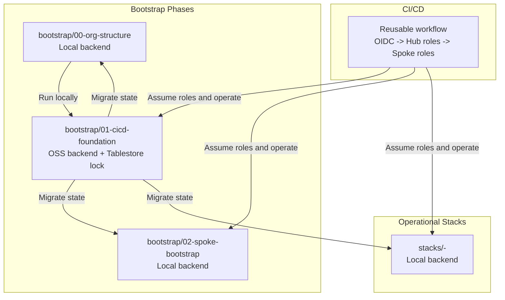
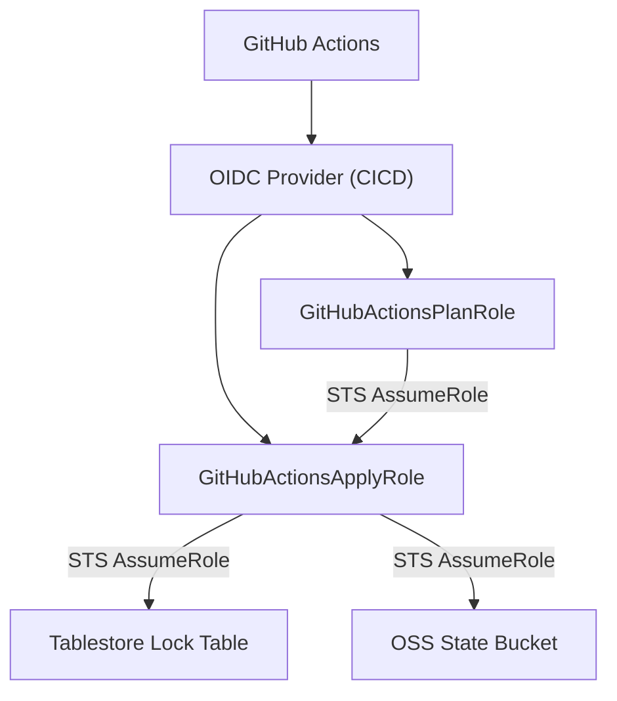
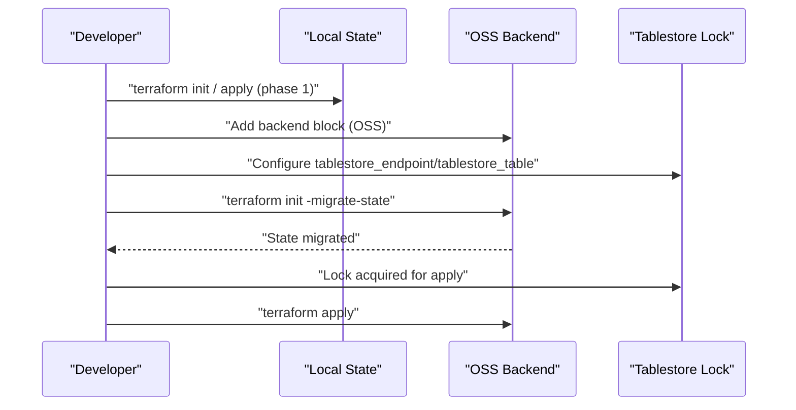
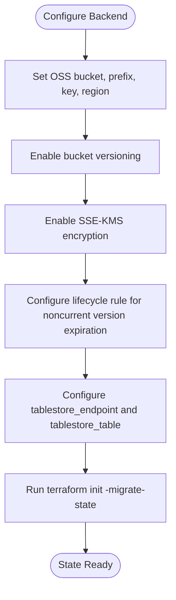
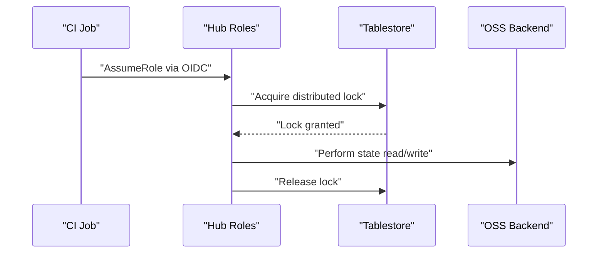
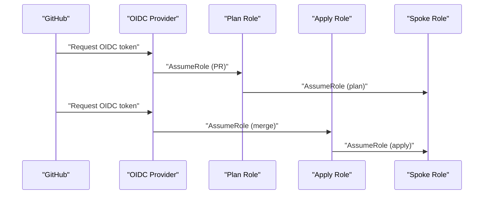
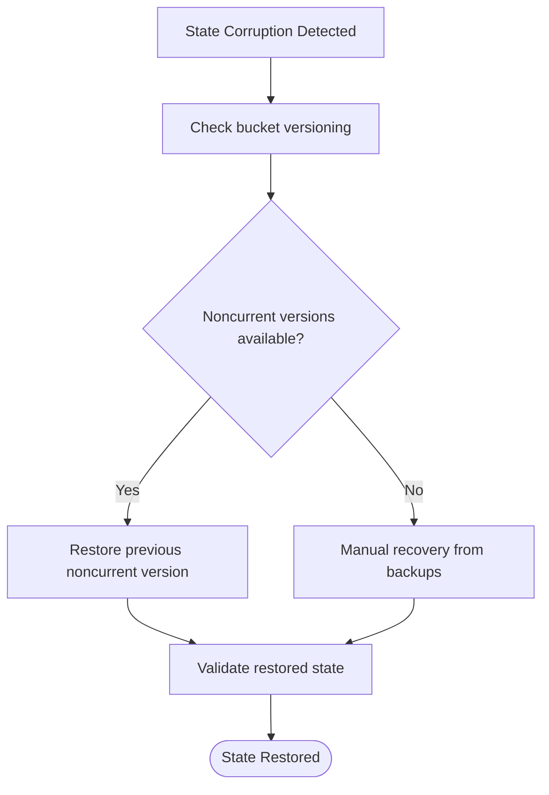
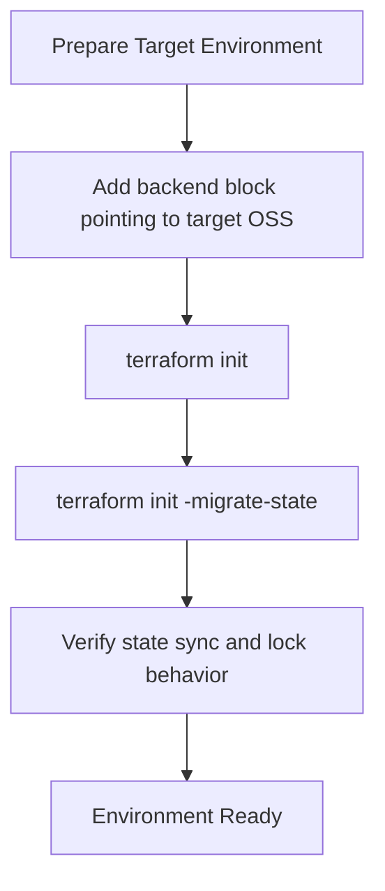
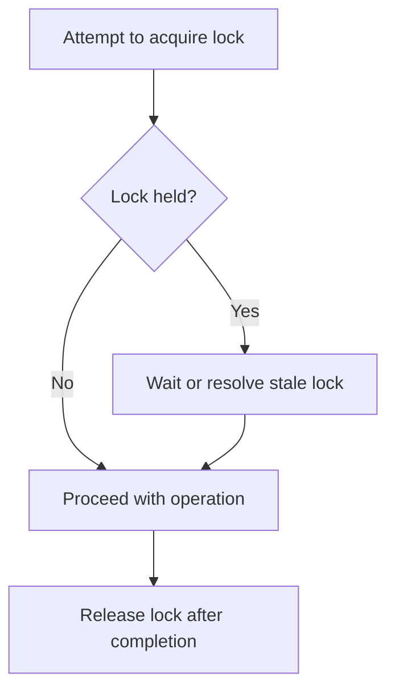
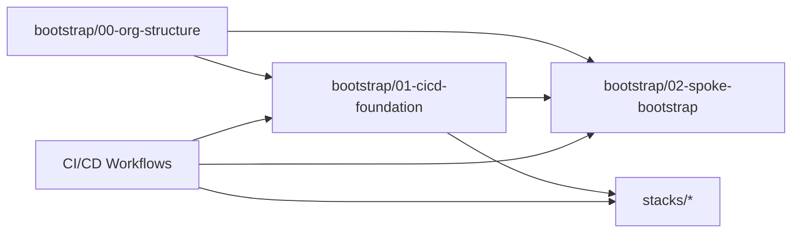

# State Management

<cite>
**Referenced Files in This Document**
- [README.md](file://README.md)
- [backend.tf.example](file://bootstrap/01-cicd-foundation/backend.tf.example)
- [versions.tf (org-structure)](file://bootstrap/00-org-structure/versions.tf)
- [versions.tf (cicd-foundation)](file://bootstrap/01-cicd-foundation/versions.tf)
- [versions.tf (spoke-bootstrap)](file://bootstrap/02-spoke-bootstrap/versions.tf)
- [providers.tf (cicd-foundation)](file://bootstrap/01-cicd-foundation/providers.tf)
- [main.tf (cicd-foundation)](file://bootstrap/01-cicd-foundation/main.tf)
- [main.tf (spoke-bootstrap)](file://bootstrap/02-spoke-bootstrap/main.tf)
- [main.tf (spoke-roles)](file://bootstrap/02-spoke-bootstrap/modules/spoke-roles/main.tf)
- [terraform-reusable.yml](file://.github/workflows/terraform-reusable.yml)
- [bootstrap-01-cicd-foundation.yml](file://.github/workflows/bootstrap-01-cicd-foundation.yml)
- [main.tf (network-cen stack)](file://stacks/20-network-cen/main.tf)
</cite>

## Table of Contents
1. [Introduction](#introduction)
2. [Project Structure](#project-structure)
3. [Core Components](#core-components)
4. [Architecture Overview](#architecture-overview)
5. [Detailed Component Analysis](#detailed-component-analysis)
6. [Dependency Analysis](#dependency-analysis)
7. [Performance Considerations](#performance-considerations)
8. [Troubleshooting Guide](#troubleshooting-guide)
9. [Conclusion](#conclusion)
10. [Appendices](#appendices)

## Introduction
This document explains the state management strategy for the Alibaba Cloud Landing Zone Accelerator demo, focusing on the Terraform state lifecycle, backend configuration, and distributed locking. It covers:
- State migration from local backend to OSS
- Bootstrap state transfer procedure
- Backend configuration requirements and best practices
- Distributed locking using Alibaba Cloud Tablestore
- State encryption, backup, and recovery
- State versioning, cross-environment migration, and corruption recovery
- Monitoring and alerting, performance optimization, and capacity planning

## Project Structure
The repository organizes state management across three bootstrap phases and a set of operational stacks:
- bootstrap/00-org-structure: Establishes Resource Directory and organizational accounts; uses local backend until migration.
- bootstrap/01-cicd-foundation: Provisions OSS state bucket, Tablestore lock table, OIDC provider, and hub roles; prepares for migration.
- bootstrap/02-spoke-bootstrap: Deploys spoke roles in member accounts; initial state remains local until migration.
- stacks/: Operational stacks that consume the hub state and spoke roles; each stack initializes with local backend and migrates after the hub is ready.

**Section sources**
- [README.md:23-26](file://README.md#L23-L26)
- [versions.tf (org-structure):9](file://bootstrap/00-org-structure/versions.tf#L9)
- [versions.tf (cicd-foundation):9-11](file://bootstrap/01-cicd-foundation/versions.tf#L9-L11)
- [versions.tf (spoke-bootstrap):9](file://bootstrap/02-spoke-bootstrap/versions.tf#L9)

## Core Components
- OSS state backend with encryption and versioning
- Tablestore distributed lock table
- OIDC-based hub roles for CI/CD automation
- Spoke roles in member accounts for least-privilege access
- Migration workflow from local to OSS backend

Key implementation references:
- OSS bucket with SSE-KMS encryption and lifecycle rules
- Tablestore instance and table configured for locking
- Hub roles with OIDC conditions and state access policy
- Spoke roles trusting hub roles with scoped permissions

**Section sources**
- [main.tf (cicd-foundation):5-25](file://bootstrap/01-cicd-foundation/main.tf#L5-L25)
- [main.tf (cicd-foundation):27-43](file://bootstrap/01-cicd-foundation/main.tf#L27-L43)
- [main.tf (cicd-foundation):61-105](file://bootstrap/01-cicd-foundation/main.tf#L61-L105)
- [main.tf (cicd-foundation):112-135](file://bootstrap/01-cicd-foundation/main.tf#L112-L135)
- [main.tf (spoke-roles):3-14](file://bootstrap/02-spoke-bootstrap/modules/spoke-roles/main.tf#L3-L14)
- [main.tf (spoke-roles):24-35](file://bootstrap/02-spoke-bootstrap/modules/spoke-roles/main.tf#L24-L35)

## Architecture Overview
The state architecture combines secure storage and concurrency control:
- State storage: OSS bucket with SSE-KMS encryption and versioning enabled
- Concurrency control: Tablestore table for distributed locks
- Authentication: OIDC provider in the CICD account; hub roles for plan/apply
- Authorization: Spoke roles in member accounts trust hub roles

**Diagram sources**
- [main.tf (cicd-foundation):49-55](file://bootstrap/01-cicd-foundation/main.tf#L49-L55)
- [main.tf (cicd-foundation):61-105](file://bootstrap/01-cicd-foundation/main.tf#L61-L105)
- [main.tf (cicd-foundation):112-135](file://bootstrap/01-cicd-foundation/main.tf#L112-L135)
- [main.tf (spoke-roles):3-14](file://bootstrap/02-spoke-bootstrap/modules/spoke-roles/main.tf#L3-L14)
- [main.tf (spoke-roles):24-35](file://bootstrap/02-spoke-bootstrap/modules/spoke-roles/main.tf#L24-L35)

**Section sources**
- [README.md:23-26](file://README.md#L23-L26)
- [README.md:106-112](file://README.md#L106-L112)

## Detailed Component Analysis

### State Lifecycle and Migration
- Initial phase (bootstrap/00-org-structure and bootstrap/02-spoke-bootstrap) uses local backend.
- After bootstrap/01-cicd-foundation provisioning, add the OSS backend block and run migration.
- Migration command uses terraform init with state migration to OSS.

**Diagram sources**
- [backend.tf.example:13-22](file://bootstrap/01-cicd-foundation/backend.tf.example#L13-L22)
- [versions.tf (org-structure):9](file://bootstrap/00-org-structure/versions.tf#L9)
- [versions.tf (spoke-bootstrap):9](file://bootstrap/02-spoke-bootstrap/versions.tf#L9)
- [README.md:78-87](file://README.md#L78-L87)

**Section sources**
- [README.md:78-87](file://README.md#L78-L87)
- [backend.tf.example:1-23](file://bootstrap/01-cicd-foundation/backend.tf.example#L1-L23)
- [versions.tf (org-structure):9](file://bootstrap/00-org-structure/versions.tf#L9)
- [versions.tf (spoke-bootstrap):9](file://bootstrap/02-spoke-bootstrap/versions.tf#L9)

### Backend Configuration and Best Practices
- OSS bucket configuration includes:
  - SSE-KMS encryption
  - Versioning enabled
  - Lifecycle rule to expire noncurrent versions after a retention period
- Backend block requires:
  - bucket, prefix, key, region
  - tablestore_endpoint and tablestore_table for distributed locking
- Provider chaining from management to CICD account for bootstrapping resources

**Diagram sources**
- [main.tf (cicd-foundation):5-25](file://bootstrap/01-cicd-foundation/main.tf#L5-L25)
- [main.tf (cicd-foundation):112-135](file://bootstrap/01-cicd-foundation/main.tf#L112-L135)
- [backend.tf.example:13-22](file://bootstrap/01-cicd-foundation/backend.tf.example#L13-L22)
- [providers.tf (cicd-foundation):7-15](file://bootstrap/01-cicd-foundation/providers.tf#L7-L15)

**Section sources**
- [main.tf (cicd-foundation):5-25](file://bootstrap/01-cicd-foundation/main.tf#L5-L25)
- [main.tf (cicd-foundation):112-135](file://bootstrap/01-cicd-foundation/main.tf#L112-L135)
- [backend.tf.example:13-22](file://bootstrap/01-cicd-foundation/backend.tf.example#L13-L22)
- [providers.tf (cicd-foundation):7-15](file://bootstrap/01-cicd-foundation/providers.tf#L7-L15)

### Distributed Locking with Tablestore
- A Tablestore instance and table are provisioned for distributed locking.
- The backend configuration references the Tablestore endpoint and table name.
- CI/CD workflows assume hub roles to perform operations against OSS and Tablestore.

**Diagram sources**
- [main.tf (cicd-foundation):27-43](file://bootstrap/01-cicd-foundation/main.tf#L27-L43)
- [backend.tf.example:19-20](file://bootstrap/01-cicd-foundation/backend.tf.example#L19-L20)
- [terraform-reusable.yml:50-56](file://.github/workflows/terraform-reusable.yml#L50-L56)

**Section sources**
- [main.tf (cicd-foundation):27-43](file://bootstrap/01-cicd-foundation/main.tf#L27-L43)
- [backend.tf.example:19-20](file://bootstrap/01-cicd-foundation/backend.tf.example#L19-L20)
- [terraform-reusable.yml:50-56](file://.github/workflows/terraform-reusable.yml#L50-L56)

### CI/CD Integration and Role-Based Access
- OIDC provider is created in the CICD account.
- Two hub roles are defined:
  - Plan role for PR-triggered plans (read-only)
  - Apply role for production merges (read-write)
- Spoke roles in member accounts trust hub roles and are scoped appropriately.

**Diagram sources**
- [main.tf (cicd-foundation):49-55](file://bootstrap/01-cicd-foundation/main.tf#L49-L55)
- [main.tf (cicd-foundation):61-105](file://bootstrap/01-cicd-foundation/main.tf#L61-L105)
- [main.tf (spoke-roles):3-14](file://bootstrap/02-spoke-bootstrap/modules/spoke-roles/main.tf#L3-L14)
- [main.tf (spoke-roles):24-35](file://bootstrap/02-spoke-bootstrap/modules/spoke-roles/main.tf#L24-L35)
- [terraform-reusable.yml:50-56](file://.github/workflows/terraform-reusable.yml#L50-L56)

**Section sources**
- [main.tf (cicd-foundation):49-55](file://bootstrap/01-cicd-foundation/main.tf#L49-L55)
- [main.tf (cicd-foundation):61-105](file://bootstrap/01-cicd-foundation/main.tf#L61-L105)
- [main.tf (spoke-roles):3-14](file://bootstrap/02-spoke-bootstrap/modules/spoke-roles/main.tf#L3-L14)
- [main.tf (spoke-roles):24-35](file://bootstrap/02-spoke-bootstrap/modules/spoke-roles/main.tf#L24-L35)
- [terraform-reusable.yml:50-56](file://.github/workflows/terraform-reusable.yml#L50-L56)

### State Encryption, Backup, and Recovery
- Encryption: OSS bucket configured with SSE-KMS encryption.
- Versioning: Enabled on the bucket; lifecycle rule expires noncurrent versions after a retention window.
- Recovery: Use current and previous versions to restore state after corruption or accidental changes.
- Backup: Regular snapshotting of the OSS bucket and Tablestore table is recommended for offloading protection.

**Diagram sources**
- [main.tf (cicd-foundation):10-24](file://bootstrap/01-cicd-foundation/main.tf#L10-L24)

**Section sources**
- [main.tf (cicd-foundation):10-24](file://bootstrap/01-cicd-foundation/main.tf#L10-L24)

### State Versioning and Cross-Environment Migration
- Versioning enables safe rollback and drift detection.
- To migrate stacks between environments, initialize each stack with the OSS backend and run migration.
- Ensure the backend block matches the target environment’s bucket/prefix/key.

**Diagram sources**
- [backend.tf.example:13-22](file://bootstrap/01-cicd-foundation/backend.tf.example#L13-L22)
- [README.md:78-87](file://README.md#L78-L87)

**Section sources**
- [backend.tf.example:13-22](file://bootstrap/01-cicd-foundation/backend.tf.example#L13-L22)
- [README.md:78-87](file://README.md#L78-L87)

### Conflict Resolution and Lock Policies
- Distributed locking prevents concurrent applies across CI/CD jobs.
- Policy documents grant OTS access to hub roles and restrict to the lock table resource.
- If a lock is stale, investigate the CI job and release the lock manually if necessary.

**Diagram sources**
- [main.tf (cicd-foundation):112-135](file://bootstrap/01-cicd-foundation/main.tf#L112-L135)
- [backend.tf.example:19-20](file://bootstrap/01-cicd-foundation/backend.tf.example#L19-L20)

**Section sources**
- [main.tf (cicd-foundation):112-135](file://bootstrap/01-cicd-foundation/main.tf#L112-L135)
- [backend.tf.example:19-20](file://bootstrap/01-cicd-foundation/backend.tf.example#L19-L20)

## Dependency Analysis
The state management relies on explicit dependencies among bootstrap phases and CI/CD workflows:
- bootstrap/00-org-structure must complete before bootstrap/02-spoke-bootstrap can assume roles.
- bootstrap/01-cicd-foundation must provision OSS and Tablestore before migration.
- CI/CD workflows depend on OIDC provider and hub roles to chain into spoke accounts.

**Diagram sources**
- [main.tf (spoke-bootstrap):4-32](file://bootstrap/02-spoke-bootstrap/main.tf#L4-L32)
- [terraform-reusable.yml:18-36](file://.github/workflows/bootstrap-01-cicd-foundation.yml#L18-L36)

**Section sources**
- [main.tf (spoke-bootstrap):4-32](file://bootstrap/02-spoke-bootstrap/main.tf#L4-L32)
- [terraform-reusable.yml:18-36](file://.github/workflows/bootstrap-01-cicd-foundation.yml#L18-L36)

## Performance Considerations
- Minimize state size by consolidating resources and avoiding unnecessary metadata.
- Use regional endpoints for OSS and Tablestore to reduce latency.
- Enable lifecycle policies to prune old state versions and reduce storage costs.
- Monitor CI/CD queue times; if locks frequently contend, consider splitting workloads across separate keys or prefixes.

[No sources needed since this section provides general guidance]

## Troubleshooting Guide
Common issues and resolutions:
- Migration fails due to missing backend configuration: Ensure the backend block is present and initialized with migration.
- Lock contention during apply: Investigate concurrent CI jobs and release stale locks if necessary.
- Permission denied errors: Verify hub roles have OTS and OSS permissions and spoke roles trust hub roles.
- Drift detection: Schedule periodic plan-only runs to surface configuration drift early.

**Section sources**
- [README.md:129-139](file://README.md#L129-L139)
- [main.tf (cicd-foundation):112-135](file://bootstrap/01-cicd-foundation/main.tf#L112-L135)
- [backend.tf.example:1-23](file://bootstrap/01-cicd-foundation/backend.tf.example#L1-L23)

## Conclusion
This repository demonstrates a robust, OIDC-driven state management strategy:
- Secure state storage with encryption and versioning
- Reliable distributed locking via Tablestore
- Least-privilege CI/CD roles with clear separation of duties
- Clear migration procedures and operational safeguards

Adopting these patterns ensures safe, auditable, and scalable state operations across environments.

[No sources needed since this section summarizes without analyzing specific files]

## Appendices

### Appendix A: CI/CD Role Definitions
- Plan role: OIDC-assigned, read-only, intended for PR-triggered plans.
- Apply role: OIDC-assigned, read-write, restricted to production environment.

**Section sources**
- [main.tf (cicd-foundation):61-105](file://bootstrap/01-cicd-foundation/main.tf#L61-L105)

### Appendix B: Spoke Role Trust Relationships
- SpokePlanRole trusts GitHubActionsPlanRole.
- SpokeApplyRole trusts GitHubActionsApplyRole.

**Section sources**
- [main.tf (spoke-roles):3-14](file://bootstrap/02-spoke-bootstrap/modules/spoke-roles/main.tf#L3-L14)
- [main.tf (spoke-roles):24-35](file://bootstrap/02-spoke-bootstrap/modules/spoke-roles/main.tf#L24-L35)

### Appendix C: Example Stack Reference
- Example stack deploying a core networking resource in a spoke account.

**Section sources**
- [main.tf (network-cen stack):12-16](file://stacks/20-network-cen/main.tf#L12-L16)