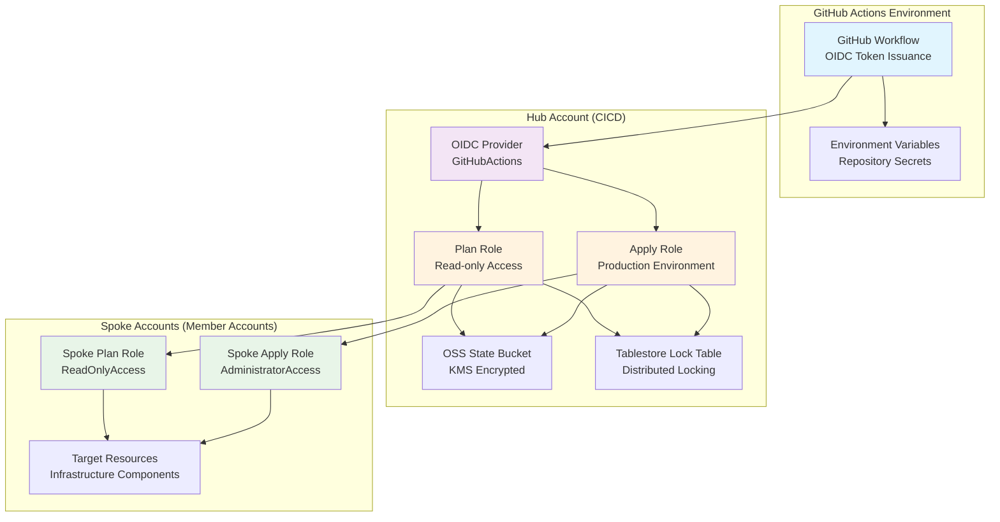
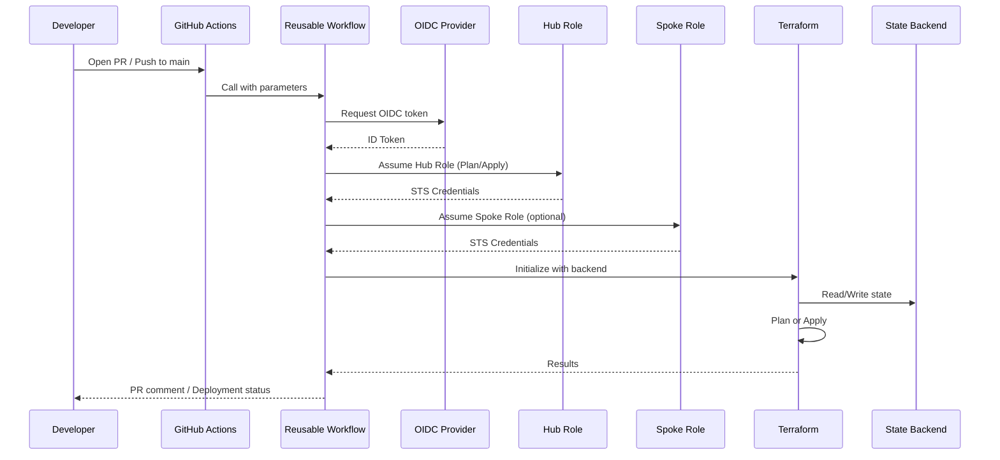

# Project Overview

<cite>
**Referenced Files in This Document**
- [README.md](file://README.md)
- [.github/workflows/terraform-reusable.yml](file://.github/workflows/terraform-reusable.yml)
- [bootstrap/01-cicd-foundation/main.tf](file://bootstrap/01-cicd-foundation/main.tf)
- [bootstrap/02-spoke-bootstrap/modules/spoke-roles/main.tf](file://bootstrap/02-spoke-bootstrap/modules/spoke-roles/main.tf)
- [.github/workflows/bootstrap-01-cicd-foundation.yml](file://.github/workflows/bootstrap-01-cicd-foundation.yml)
- [.github/workflows/stacks.yml](file://.github/workflows/stacks.yml)
- [bootstrap/01-cicd-foundation/backend.tf.example](file://bootstrap/01-cicd-foundation/backend.tf.example)
- [bootstrap/00-org-structure/main.tf](file://bootstrap/00-org-structure/main.tf)
- [bootstrap/02-spoke-bootstrap/main.tf](file://bootstrap/02-spoke-bootstrap/main.tf)
</cite>

## Update Summary
**Changes Made**
- Enhanced architecture diagrams with comprehensive credential flow visualization from GitHub OIDC tokens through hub roles to spoke roles
- Expanded four-phase bootstrap process documentation with detailed technical implementation details
- Improved security model explanation emphasizing no-long-lived-credentials approach with short-lived STS token exchange at every workflow run
- Added detailed provider chaining mechanism documentation
- Enhanced state management security documentation with KMS encryption and distributed locking details

## Table of Contents
1. [Introduction](#introduction)
2. [Architecture Overview](#architecture-overview)
3. [Security Model](#security-model)
4. [Bootstrap Process](#bootstrap-process)
5. [CI/CD Pipeline Architecture](#cicd-pipeline-architecture)
6. [Project Structure](#project-structure)
7. [GitHub Repository Configuration](#github-repository-configuration)
8. [Day-2 Operations](#day-2-operations)
9. [References](#references)

## Introduction
This project demonstrates a secure CI/CD automation framework for deploying and managing Alibaba Cloud infrastructure using Terraform and GitHub Actions with OIDC federation — eliminating the need for long-lived credentials entirely. It enforces a hub-and-spoke security model with strict credential delegation and least privilege principles, relying exclusively on short-lived STS tokens issued from GitHub OIDC tokens at every workflow execution.

The repository serves as both a comprehensive guide and production-ready implementation reference for establishing a landing zone accelerator on Alibaba Cloud, providing conceptual overviews for beginners while offering detailed technical implementation guidance for experienced developers.

## Architecture Overview
The system implements a sophisticated hub-and-spoke architecture with multi-level credential delegation and zero-trust security principles.



### Comprehensive Credential Flow
The authentication and authorization process follows a strict chain of trust:

1. **GitHub OIDC Token Generation**: Each workflow run generates a fresh, time-limited OIDC token from GitHub's identity provider
2. **Hub Role Assumption**: The OIDC token is exchanged for short-lived STS credentials assuming either the Plan or Apply role in the CICD account
3. **Provider Chaining**: Hub roles then assume corresponding Spoke roles in target member accounts
4. **Resource Access**: Final STS credentials are used to provision resources with scoped permissions

Each step uses short-lived credentials (typically 1 hour maximum), ensuring no persistent access keys exist in the environment.

**Diagram sources**
- [README.md:7-26](file://README.md#L7-L26)
- [.github/workflows/terraform-reusable.yml:50-55](file://.github/workflows/terraform-reusable.yml#L50-L55)
- [bootstrap/01-cicd-foundation/main.tf:70-125](file://bootstrap/01-cicd-foundation/main.tf#L70-L125)
- [bootstrap/02-spoke-bootstrap/modules/spoke-roles/main.tf:3-41](file://bootstrap/02-spoke-bootstrap/modules/spoke-roles/main.tf#L3-L41)

### Provider Chaining Mechanism
The system implements sophisticated provider chaining where:
- **Hub Roles** act as intermediaries between GitHub and spoke accounts
- **Spoke Roles** provide scoped access to specific member account resources
- **State Backend** provides centralized state management with encryption and locking

**Section sources**
- [README.md:28](file://README.md#L28)
- [.github/workflows/terraform-reusable.yml:50-55](file://.github/workflows/terraform-reusable.yml#L50-L55)
- [bootstrap/01-cicd-foundation/main.tf:133-179](file://bootstrap/01-cicd-foundation/main.tf#L133-L179)

## Security Model
The security model is built around several foundational principles that eliminate traditional credential management risks:

### Zero Long-Lived Credentials
- **Dynamic Token Exchange**: GitHub OIDC tokens are exchanged for short-lived STS tokens at every workflow execution
- **No Persistent Keys**: No permanent access keys stored in repositories, environment variables, or configuration files
- **Automatic Rotation**: Complete credential rotation occurs with each pipeline run, eliminating key compromise risks

### Least Privilege Role Design
- **Plan Role**: Read-only access restricted to pull request environments for change preview and validation
- **Apply Role**: Read-write access strictly limited to the `production` GitHub environment with mandatory reviewer approval
- **Account Isolation**: Each spoke account maintains independent IAM roles; compromise of one role cannot cascade to other accounts

### Advanced State Management Security
- **Encrypted State Storage**: Terraform state persists in OSS buckets with server-side KMS encryption
- **Distributed State Locking**: Tablestore provides distributed locking mechanisms preventing concurrent modifications
- **Version Control Integration**: OSS bucket maintains complete version history enabling state recovery and audit trails

### OIDC Provider Security Controls
- **Audience Validation**: Strict audience claims (`sts.aliyuncs.com`) prevent token misuse
- **Issuer Verification**: GitHub Actions issuer URL verification ensures token authenticity
- **Subject Conditions**: Repository and environment-specific subject conditions restrict role assumption scope

**Section sources**
- [README.md:106-112](file://README.md#L106-L112)
- [bootstrap/01-cicd-foundation/main.tf:70-125](file://bootstrap/01-cicd-foundation/main.tf#L70-L125)
- [bootstrap/01-cicd-foundation/main.tf:28-48](file://bootstrap/01-cicd-foundation/main.tf#L28-L48)

## Bootstrap Process
The bootstrap establishes the landing zone foundation through four controlled phases, each building upon the previous phase's outputs:

### Phase 0 — Manual Account Hygiene
**Prerequisites requiring manual intervention:**
1. Enable Multi-Factor Authentication (MFA) on the management account root user
2. Complete real-name verification for all planned member accounts
3. Enable Resource Directory service in the management account console

### Phase 1 — Organization Structure
**Automated organizational hierarchy creation:**
- **Resource Directory Setup**: Enables and configures Alibaba Cloud Resource Directory
- **Folder Hierarchy**: Creates logical organization folders (Core, Workloads, Sandbox)
- **Core Member Accounts**: Provisions essential accounts (devops, log-archive, security, network, shared-services)

```bash
cd bootstrap/00-org-structure
terraform init
terraform apply
```

**Section sources**
- [bootstrap/00-org-structure/main.tf:1-50](file://bootstrap/00-org-structure/main.tf#L1-50)

### Phase 2 — CI/CD Foundation
**Infrastructure provisioning for automated deployments:**
- **OIDC Provider Configuration**: Establishes GitHub Actions integration with Alibaba Cloud RAM
- **Hub Role Creation**: Deploys Plan and Apply roles with appropriate permission boundaries
- **State Backend Setup**: Provisions OSS bucket with KMS encryption and Tablestore for state locking
- **Policy Attachment**: Attaches least-privilege policies to hub roles

```bash
cd bootstrap/01-cicd-foundation
terraform init
terraform apply
```

**State Migration**: After backend provisioning, migrate local state to remote backend:
```bash
# Configure backend.tf with actual values from backend.tf.example
terraform init -migrate-state
```

**Section sources**
- [bootstrap/01-cicd-foundation/main.tf:28-192](file://bootstrap/01-cicd-foundation/main.tf#L28-L192)
- [bootstrap/01-cicd-foundation/backend.tf.example:13-22](file://bootstrap/01-cicd-foundation/backend.tf.example#L13-L22)

### Phase 3 — Spoke Bootstrap
**Trust relationship establishment between hub and spoke accounts:**
- **Spoke Role Creation**: Deploys Plan and Apply roles in each member account
- **Trust Policy Configuration**: Configures roles to trust corresponding hub roles
- **Permission Scoping**: Applies appropriate permission levels (read-only for plan, admin for apply)

```bash
cd bootstrap/02-spoke-bootstrap
terraform init
terraform apply
```

**Section sources**
- [bootstrap/02-spoke-bootstrap/main.tf:1-33](file://bootstrap/02-spoke-bootstrap/main.tf#L1-33)
- [bootstrap/02-spoke-bootstrap/modules/spoke-roles/main.tf:1-42](file://bootstrap/02-spoke-bootstrap/modules/spoke-roles/main.tf#L1-L42)

### Phase 4+ — Automated Pipeline Operation
**Transition to fully automated operations:**
1. Push repository to GitHub
2. Configure required repository variables
3. Open Pull Request → triggers plan execution
4. Merge to main branch → triggers apply execution

**Section sources**
- [README.md:89-94](file://README.md#L89-L94)

## CI/CD Pipeline Architecture
The pipeline implements a reusable workflow pattern ensuring consistency, maintainability, and security across all deployments.



### Reusable Workflow Features
The core reusable workflow (`terraform-reusable.yml`) provides standardized functionality:
- **OIDC Credential Configuration**: Automatic setup of Alibaba Cloud credentials via OIDC
- **Consistent Execution**: Standardized Terraform initialization and execution patterns
- **PR Integration**: Formatted plan output comments on pull requests
- **Environment Protection**: Production environment restrictions for apply operations
- **Artifact Management**: Plan result artifacts for review and auditing

### Matrix-Driven Stack Deployment
Stacks utilize a matrix strategy for parallel deployment across multiple spoke accounts:
- **Dynamic Account Resolution**: JSON mapping resolves account IDs from repository variables
- **Parallel Execution**: Independent stacks deploy simultaneously for efficiency
- **Sequential Dependencies**: Controlled execution order for dependent resources
- **Selective Targeting**: Each stack targets specific spoke accounts based on configuration

**Diagram sources**
- [.github/workflows/terraform-reusable.yml:38-117](file://.github/workflows/terraform-reusable.yml#L38-L117)
- [.github/workflows/bootstrap-01-cicd-foundation.yml:18-35](file://.github/workflows/bootstrap-01-cicd-foundation.yml#L18-L35)

**Section sources**
- [.github/workflows/terraform-reusable.yml:1-118](file://.github/workflows/terraform-reusable.yml#L1-L118)
- [.github/workflows/stacks.yml:19-112](file://.github/workflows/stacks.yml#L19-L112)

## Project Structure
The repository follows a modular architecture supporting the complete lifecycle from bootstrap to day-2 operations:

```
├── bootstrap/                    # Four-phase bootstrap process
│   ├── 00-org-structure/         # Phase 1: RD, folders, member accounts
│   ├── 01-cicd-foundation/       # Phase 2: OSS state, OIDC, hub roles
│   └── 02-spoke-bootstrap/       # Phase 3: spoke roles in member accounts
│       └── modules/spoke-roles/  # Reusable spoke role module
├── stacks/                       # Modular infrastructure-as-code components
│   ├── 10-identity-cloudsso/     # Identity and SSO configuration
│   ├── 11-log-archive/           # Centralized logging setup
│   ├── 12-guardrails-preventive/ # Preventive security controls
│   ├── 13-guardrails-detective/  # Detective security controls
│   ├── 20-network-cen/           # Network connectivity (fully implemented)
│   ├── 21-network-dmz/           # DMZ network configuration
│   ├── 30-security-kms/          # Key management services
│   ├── 30-security-firewall/     # Network firewall rules
│   └── 30-security-waf/          # Web application firewall
└── .github/workflows/            # CI/CD pipeline definitions
    ├── terraform-reusable.yml    # Core reusable workflow
    ├── bootstrap-00-org-structure.yml
    ├── bootstrap-01-cicd-foundation.yml
    ├── bootstrap-02-spoke.yml
    └── stacks.yml                # Matrix-driven stack deployment
```

**Section sources**
- [README.md:141-165](file://README.md#L141-L165)

## GitHub Repository Configuration
Required repository variables must be configured in GitHub Settings > Secrets and variables > Actions:

| Variable | Description | Example |
|----------|-------------|---------|
| `HUB_ACCOUNT_ID` | CICD hub account ID | `1234567890123456` |
| `GHA_PLAN_ROLE_ARN` | Plan role ARN | `acs:ram::1234567890123456:role/GitHubActionsPlanRole` |
| `GHA_APPLY_ROLE_ARN` | Apply role ARN | `acs:ram::1234567890123456:role/GitHubActionsApplyRole` |
| `OIDC_PROVIDER_ARN` | OIDC provider ARN | `acs:ram::1234567890123456:oidc-provider/GitHubActions` |
| `SPOKE_ACCOUNT_IDS_JSON` | JSON map of spoke accounts | `{"devops":"123...","log-archive":"456...","security":"789..."}` |

These variables enable dynamic configuration without hardcoding sensitive information in the repository.

**Section sources**
- [README.md:96-104](file://README.md#L96-L104)

## Day-2 Operations
After initial deployment, the following operational procedures support ongoing management:

### Adding a New Spoke Account
1. Add the new account to the `spokes` variable in `bootstrap/02-spoke-bootstrap/variables.tf`
2. Run `terraform apply` in `bootstrap/02-spoke-bootstrap` directory
3. Update `SPOKE_ACCOUNT_IDS_JSON` in the GitHub repository variables

### Adding a New Stack
1. Copy an existing stack (e.g., `stacks/20-network-cen`) as a template
2. Update `providers.tf` and `variables.tf` to target the desired account
3. Add the new stack to the `matrix` in `.github/workflows/stacks.yml`
4. Open a PR to validate the plan before merging

### Drift Detection
Schedule plan-only workflow runs (e.g., nightly) to detect configuration drift:

```yaml
on:
  schedule:
    - cron: '0 2 * * *'
```

The reusable workflow supports plan-only mode for drift detection scenarios.

**Section sources**
- [README.md:114-139](file://README.md#L114-L139)

## References
For additional information and official documentation:

- [Alibaba Cloud RAM — OIDC Provider Documentation](https://www.alibabacloud.com/help/en/ram/user-guide/overview-of-oidc-based-sso)
- [aliyun/configure-aliyun-credentials-action](https://github.com/aliyun/configure-aliyun-credentials-action) — GitHub Action for OIDC-based credential configuration
- [Terraform Alibaba Cloud Provider](https://registry.terraform.io/providers/aliyun/alicloud/latest/docs)
- [Terraform OSS Backend](https://www.alibabacloud.com/help/en/oss/developer-reference/terraform-backend-type)
- [Landing Zone Accelerator on Alibaba Cloud](https://github.com/aliyun/alibabacloud-landing-zone)

**Section sources**
- [README.md:167-173](file://README.md#L167-L173)