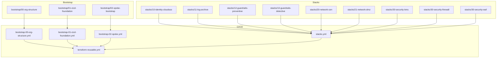
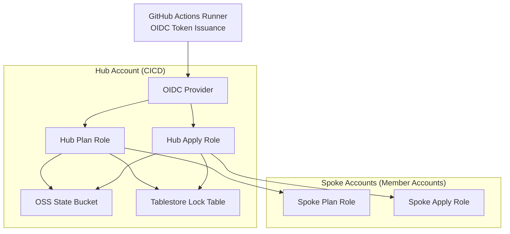
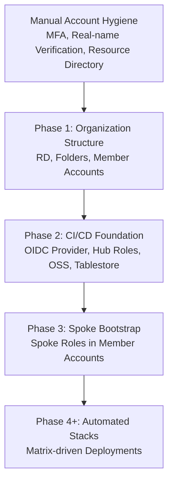
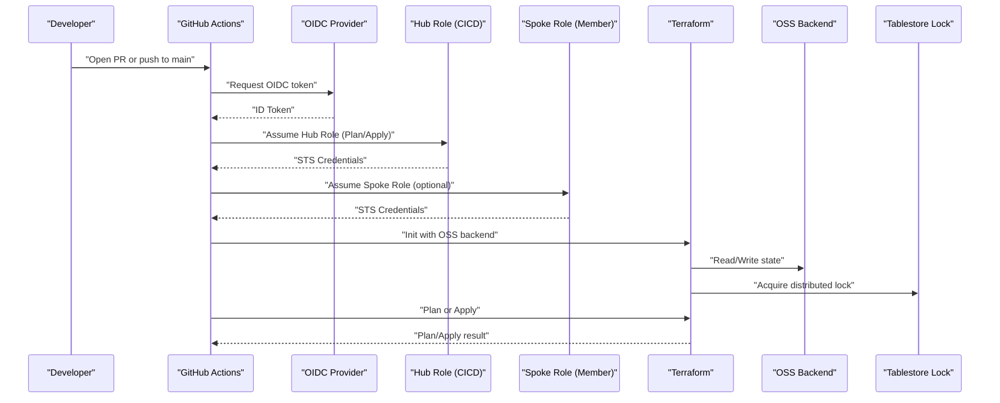
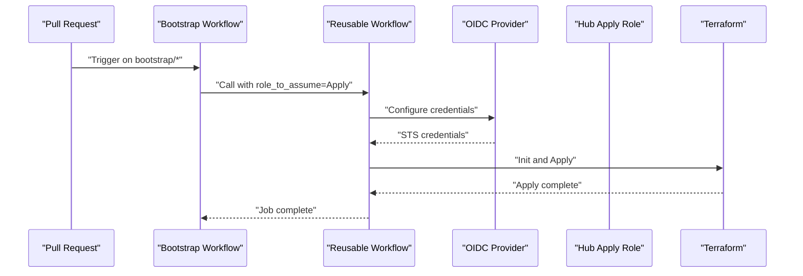
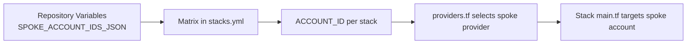
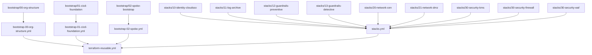

# Project Overview

<cite>
**Referenced Files in This Document**
- [README.md](file://README.md)
- [bootstrap/00-org-structure/main.tf](file://bootstrap/00-org-structure/main.tf)
- [bootstrap/01-cicd-foundation/main.tf](file://bootstrap/01-cicd-foundation/main.tf)
- [bootstrap/01-cicd-foundation/backend.tf.example](file://bootstrap/01-cicd-foundation/backend.tf.example)
- [bootstrap/02-spoke-bootstrap/main.tf](file://bootstrap/02-spoke-bootstrap/main.tf)
- [bootstrap/02-spoke-bootstrap/modules/spoke-roles/main.tf](file://bootstrap/02-spoke-bootstrap/modules/spoke-roles/main.tf)
- [.github/workflows/bootstrap-00-org-structure.yml](file://.github/workflows/bootstrap-00-org-structure.yml)
- [.github/workflows/bootstrap-01-cicd-foundation.yml](file://.github/workflows/bootstrap-01-cicd-foundation.yml)
- [.github/workflows/bootstrap-02-spoke.yml](file://.github/workflows/bootstrap-02-spoke.yml)
- [.github/workflows/stacks.yml](file://.github/workflows/stacks.yml)
- [.github/workflows/terraform-reusable.yml](file://.github/workflows/terraform-reusable.yml)
- [stacks/20-network-cen/main.tf](file://stacks/20-network-cen/main.tf)
</cite>

## Table of Contents
1. [Introduction](#introduction)
2. [Project Structure](#project-structure)
3. [Core Components](#core-components)
4. [Architecture Overview](#architecture-overview)
5. [Detailed Component Analysis](#detailed-component-analysis)
6. [Dependency Analysis](#dependency-analysis)
7. [Performance Considerations](#performance-considerations)
8. [Troubleshooting Guide](#troubleshooting-guide)
9. [Conclusion](#conclusion)
10. [Appendices](#appendices)

## Introduction
This project demonstrates a secure CI/CD automation framework for deploying and managing Alibaba Cloud infrastructure using Terraform and GitHub Actions with OIDC federation. It enforces a hub-and-spoke security model with no long-lived credentials, relying on short-lived STS tokens issued from GitHub OIDC tokens. The repository is organized into four bootstrap phases that provision foundational resources, followed by a scalable set of stacks deployed via a matrix-driven workflow.

Key goals:
- Demonstrate a repeatable, auditable, and least-privileged CI/CD pipeline
- Establish encrypted state storage with OSS and distributed locking with Tablestore
- Enable safe, permission-scoped access from GitHub Actions to Alibaba Cloud accounts
- Provide a clear separation between hub (CICD account) and spoke (business/member accounts)

## Project Structure
The repository is organized into three major areas:
- bootstrap: Four-phase bootstrap to establish the landing zone foundation
- stacks: Modular, account-targeted infrastructure-as-code modules
- .github/workflows: CI/CD pipelines orchestrating bootstrap and stack deployments

**Diagram sources**
- [README.md:141-165](file://README.md#L141-L165)
- [.github/workflows/bootstrap-00-org-structure.yml:1-36](file://.github/workflows/bootstrap-00-org-structure.yml#L1-L36)
- [.github/workflows/bootstrap-01-cicd-foundation.yml:1-36](file://.github/workflows/bootstrap-01-cicd-foundation.yml#L1-L36)
- [.github/workflows/bootstrap-02-spoke.yml:1-36](file://.github/workflows/bootstrap-02-spoke.yml#L1-L36)
- [.github/workflows/stacks.yml:1-112](file://.github/workflows/stacks.yml#L1-L112)
- [.github/workflows/terraform-reusable.yml:1-118](file://.github/workflows/terraform-reusable.yml#L1-L118)

**Section sources**
- [README.md:141-165](file://README.md#L141-L165)

## Core Components
- Hub account (CICD account): Holds the OIDC provider, hub roles (Plan/Apply), state backend (OSS), and state locks (Tablestore).
- Spoke accounts (member/business accounts): Each has dedicated spoke roles (Plan/Apply) that trust the hub roles.
- OIDC provider: Federates GitHub Actions OIDC tokens to Alibaba Cloud STS.
- State backend: OSS bucket with server-side encryption and Tablestore table for distributed locking.

How it works conceptually:
- GitHub Actions requests an OIDC token from GitHub.
- The action assumes a hub role in the CICD account using OIDC conditions.
- The workflow optionally chains to a spoke role in the target member account.
- Terraform initializes with the OSS backend and executes plan/apply against the spoke account.

**Section sources**
- [README.md:5-28](file://README.md#L5-L28)
- [bootstrap/01-cicd-foundation/main.tf:49-105](file://bootstrap/01-cicd-foundation/main.tf#L49-L105)
- [bootstrap/02-spoke-bootstrap/modules/spoke-roles/main.tf:3-41](file://bootstrap/02-spoke-bootstrap/modules/spoke-roles/main.tf#L3-L41)

## Architecture Overview
The system follows a hub-and-spoke model with strict credential delegation and least privilege.

**Diagram sources**
- [README.md:23-28](file://README.md#L23-L28)
- [bootstrap/01-cicd-foundation/main.tf:49-105](file://bootstrap/01-cicd-foundation/main.tf#L49-L105)
- [bootstrap/02-spoke-bootstrap/modules/spoke-roles/main.tf:3-41](file://bootstrap/02-spoke-bootstrap/modules/spoke-roles/main.tf#L3-L41)

## Detailed Component Analysis

### Four-Phase Bootstrap Process
The bootstrap establishes the landing zone foundation in a controlled, manual-first manner, then transitions to automated CI/CD.

**Diagram sources**
- [README.md:42-95](file://README.md#L42-L95)

#### Phase 1: Organization Structure
- Purpose: Enable Resource Directory and create organizational folders and core member accounts.
- Outputs: Resource Directory, Core, Workloads, Sandbox folders; core member accounts for devops, log-archive, security, network, shared-services.

Implementation highlights:
- Enables Resource Directory idempotently.
- Creates folder hierarchy under the root folder.
- Provisions core member accounts with display names and folder assignments.

**Section sources**
- [bootstrap/00-org-structure/main.tf:1-49](file://bootstrap/00-org-structure/main.tf#L1-L49)

#### Phase 2: CI/CD Foundation
- Purpose: Provision the state infrastructure and hub roles in the CICD account.
- Outputs: OSS bucket (versioned, SSE-KMS), Tablestore instance/table, OIDC provider, hub Plan/Apply roles, and state-access policies.

Implementation highlights:
- State backend: OSS bucket with versioning and lifecycle rules; server-side encryption with KMS.
- Distributed locking: Tablestore table configured for state locking.
- OIDC provider: GitHub Actions OIDC provider with audience and issuer constraints.
- Hub roles: Plan role for pull requests; Apply role for production merges, both with OIDC conditions and environment scoping.
- Policies: Hub state access policy granting OSS/OTS access and cross-account STS assume-role permissions.

Post-apply migration:
- After applying, migrate local state to OSS using the backend configuration and a temporary operator session.

**Section sources**
- [bootstrap/01-cicd-foundation/main.tf:5-43](file://bootstrap/01-cicd-foundation/main.tf#L5-L43)
- [bootstrap/01-cicd-foundation/main.tf:49-105](file://bootstrap/01-cicd-foundation/main.tf#L49-L105)
- [bootstrap/01-cicd-foundation/main.tf:112-149](file://bootstrap/01-cicd-foundation/main.tf#L112-L149)
- [bootstrap/01-cicd-foundation/backend.tf.example:13-22](file://bootstrap/01-cicd-foundation/backend.tf.example#L13-L22)

#### Phase 3: Spoke Bootstrap
- Purpose: Deploy spoke roles in each member account so the hub roles can chain to them.
- Outputs: SpokePlanRole and SpokeApplyRole in each member account, trusting the hub roles.

Implementation highlights:
- Uses provider aliases to target each spoke account from the CICD account.
- Reusable module defines spoke roles with least privilege: ReadOnlyAccess for Plan, AdministratorAccess for Apply.

**Section sources**
- [bootstrap/02-spoke-bootstrap/main.tf:4-32](file://bootstrap/02-spoke-bootstrap/main.tf#L4-L32)
- [bootstrap/02-spoke-bootstrap/modules/spoke-roles/main.tf:3-41](file://bootstrap/02-spoke-bootstrap/modules/spoke-roles/main.tf#L3-L41)

#### Phase 4+: Automated Stacks
- Purpose: Matrix-driven deployment of infrastructure stacks targeting specific spoke accounts.
- Outputs: Composable, modular stacks for identity, logging, guardrails, networking, and security.

Implementation highlights:
- stacks.yml orchestrates a matrix of stacks and assigns each to a spoke account via SPOKE_ACCOUNT_IDS_JSON.
- For plan jobs, uses the Plan role; for apply jobs, uses the Apply role and requires the production environment.
- Each stack sets TF_VAR_spoke_role_arn to chain to the appropriate spoke role.

**Section sources**
- [.github/workflows/stacks.yml:19-112](file://.github/workflows/stacks.yml#L19-L112)
- [README.md:116-129](file://README.md#L116-L129)

### CI/CD Pipelines and Credential Flow

#### Reusable Workflow
The reusable workflow encapsulates the OIDC credential configuration, Terraform setup, plan/apply execution, and artifact/commenting for PR plans.

**Diagram sources**
- [README.md:23-28](file://README.md#L23-L28)
- [.github/workflows/terraform-reusable.yml:50-117](file://.github/workflows/terraform-reusable.yml#L50-L117)

#### Bootstrap Workflows
Each bootstrap phase is wired to the reusable workflow with appropriate role ARNs and working directories.

**Diagram sources**
- [.github/workflows/bootstrap-00-org-structure.yml:18-35](file://.github/workflows/bootstrap-00-org-structure.yml#L18-L35)
- [.github/workflows/bootstrap-01-cicd-foundation.yml:18-35](file://.github/workflows/bootstrap-01-cicd-foundation.yml#L18-L35)
- [.github/workflows/bootstrap-02-spoke.yml:18-35](file://.github/workflows/bootstrap-02-spoke.yml#L18-L35)
- [.github/workflows/terraform-reusable.yml:50-117](file://.github/workflows/terraform-reusable.yml#L50-L117)

### Stacks and Account Targeting
Stacks are designed to target specific spoke accounts. The matrix in stacks.yml pairs each stack with an account key, resolving the spoke account ID from repository variables.

**Diagram sources**
- [.github/workflows/stacks.yml:24-38](file://.github/workflows/stacks.yml#L24-L38)
- [stacks/20-network-cen/main.tf:12-15](file://stacks/20-network-cen/main.tf#L12-L15)

## Dependency Analysis
- Bootstrap-to-workflow dependencies:
  - bootstrap/00-org-structure → bootstrap-00-org-structure.yml → terraform-reusable.yml
  - bootstrap/01-cicd-foundation → bootstrap-01-cicd-foundation.yml → terraform-reusable.yml
  - bootstrap/02-spoke-bootstrap → bootstrap-02-spoke.yml → terraform-reusable.yml
- Stack-to-workflow dependencies:
  - stacks/* → stacks.yml → terraform-reusable.yml
- Cross-account trust:
  - Hub Plan/Apply roles trust OIDC provider and conditionally GitHub contexts.
  - Spoke roles trust the corresponding hub roles in the CICD account.

**Diagram sources**
- [README.md:141-165](file://README.md#L141-L165)
- [.github/workflows/bootstrap-00-org-structure.yml:18-35](file://.github/workflows/bootstrap-00-org-structure.yml#L18-L35)
- [.github/workflows/bootstrap-01-cicd-foundation.yml:18-35](file://.github/workflows/bootstrap-01-cicd-foundation.yml#L18-L35)
- [.github/workflows/bootstrap-02-spoke.yml:18-35](file://.github/workflows/bootstrap-02-spoke.yml#L18-L35)
- [.github/workflows/stacks.yml:19-112](file://.github/workflows/stacks.yml#L19-L112)
- [.github/workflows/terraform-reusable.yml:39-117](file://.github/workflows/terraform-reusable.yml#L39-L117)

**Section sources**
- [README.md:141-165](file://README.md#L141-L165)

## Performance Considerations
- State backend performance: OSS backend reduces local state I/O overhead and centralizes state metadata; ensure bucket and tablestore are in the same region as the hub account for minimal latency.
- Lock contention: Tablestore provides distributed locking; avoid excessive parallelism during apply to minimize lock wait times.
- Provider chaining: Minimizing repeated assume role operations improves runtime; reuse the configured credentials across steps.
- Plan-only drift detection: Schedule periodic plan-only runs to surface configuration drift early without applying changes.

[No sources needed since this section provides general guidance]

## Troubleshooting Guide
Common issues and remedies:
- OIDC token audience/issuer mismatch: Verify OIDC provider ARN and audience values match the reusable workflow inputs.
- Insufficient permissions on hub roles: Ensure hub state access policy grants OSS/OTS access and cross-account STS assume-role permissions.
- Missing spoke role ARN: For stacks, ensure TF_VAR_spoke_role_arn is set to the correct spoke role ARN for the target account.
- State migration failures: Confirm the backend block is present and run migration with a temporary operator session as documented.

**Section sources**
- [.github/workflows/terraform-reusable.yml:50-55](file://.github/workflows/terraform-reusable.yml#L50-L55)
- [bootstrap/01-cicd-foundation/main.tf:112-149](file://bootstrap/01-cicd-foundation/main.tf#L112-L149)
- [.github/workflows/stacks.yml:58-111](file://.github/workflows/stacks.yml#L58-L111)
- [bootstrap/01-cicd-foundation/backend.tf.example:13-22](file://bootstrap/01-cicd-foundation/backend.tf.example#L13-L22)

## Conclusion
This project demonstrates a secure, scalable CI/CD framework for Alibaba Cloud landing zones. By leveraging OIDC federation, a hub-and-spoke trust model, and encrypted state with distributed locking, it enables auditable, least-privileged deployments. The four-phase bootstrap establishes a solid foundation, while the matrix-driven stack deployments provide flexibility and safety through environment gating and PR-based review cycles.

[No sources needed since this section summarizes without analyzing specific files]

## Appendices

### Practical Examples

- Credential flow example (conceptual):
  - Developer opens a PR in the repository.
  - The bootstrap workflow triggers and calls the reusable workflow.
  - The reusable workflow configures Alibaba Cloud credentials using OIDC and the hub Apply role ARN.
  - Terraform initializes with the OSS backend and executes plan/apply against the target spoke account.

- Deployment pipeline example (conceptual):
  - A change is merged to main in stacks/20-network-cen.
  - The stacks workflow runs apply with the hub Apply role ARN and sets TF_VAR_spoke_role_arn to the network spoke role.
  - Terraform reads/writes state from OSS and acquires a distributed lock via Tablestore.

**Section sources**
- [.github/workflows/bootstrap-01-cicd-foundation.yml:18-35](file://.github/workflows/bootstrap-01-cicd-foundation.yml#L18-L35)
- [.github/workflows/stacks.yml:69-112](file://.github/workflows/stacks.yml#L69-L112)
- [stacks/20-network-cen/main.tf:12-15](file://stacks/20-network-cen/main.tf#L12-L15)