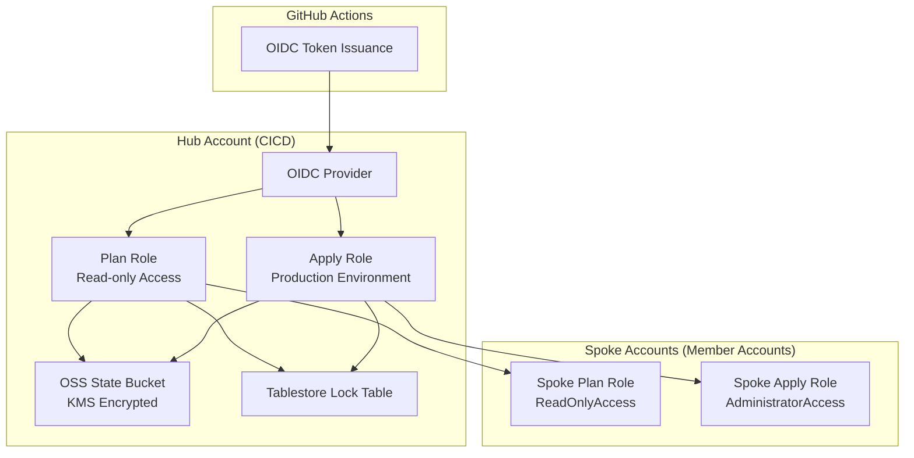
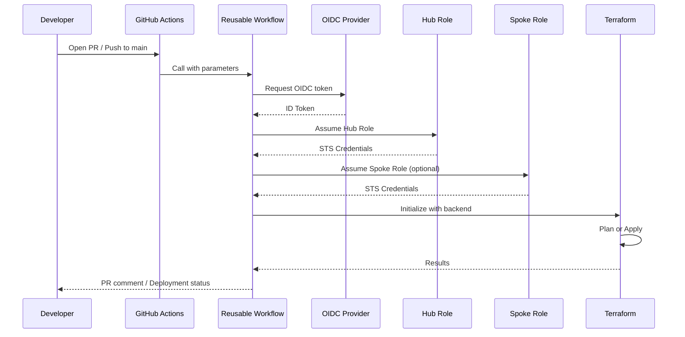

# Project Overview

<cite>
**Referenced Files in This Document**
- [README.md](file://README.md)
- [.github/workflows/terraform-reusable.yml](file://.github/workflows/terraform-reusable.yml)
- [bootstrap/01-cicd-foundation/main.tf](file://bootstrap/01-cicd-foundation/main.tf)
- [bootstrap/02-spoke-bootstrap/modules/spoke-roles/main.tf](file://bootstrap/02-spoke-bootstrap/modules/spoke-roles/main.tf)
- [.github/workflows/bootstrap-01-cicd-foundation.yml](file://.github/workflows/bootstrap-01-cicd-foundation.yml)
- [.github/workflows/stacks.yml](file://.github/workflows/stacks.yml)
- [bootstrap/01-cicd-foundation/backend.tf.example](file://bootstrap/01-cicd-foundation/backend.tf.example)
</cite>

## Update Summary
**Changes Made**
- Updated to reflect comprehensive README.md as central documentation hub
- Enhanced architecture diagrams with detailed credential flow explanations
- Added complete step-by-step quick start instructions covering all bootstrap phases
- Included GitHub repository variables configuration documentation
- Expanded security model documentation emphasizing no long-lived credentials and least privilege principles
- Added project directory structure explanation
- Integrated references to relevant Alibaba Cloud and Terraform provider documentation

## Table of Contents
1. [Introduction](#introduction)
2. [Architecture Overview](#architecture-overview)
3. [Security Model](#security-model)
4. [Bootstrap Process](#bootstrap-process)
5. [CI/CD Pipeline Architecture](#cicd-pipeline-architecture)
6. [Project Structure](#project-structure)
7. [GitHub Repository Configuration](#github-repository-configuration)
8. [Day-2 Operations](#day-2-operations)
9. [References](#references)

## Introduction
This project demonstrates a secure CI/CD automation framework for deploying and managing Alibaba Cloud infrastructure using Terraform and GitHub Actions with OIDC federation — no long-lived credentials required. It enforces a hub-and-spoke security model with strict credential delegation and least privilege principles, relying on short-lived STS tokens issued from GitHub OIDC tokens.

The repository serves as a comprehensive guide and implementation reference for establishing a production-ready landing zone accelerator on Alibaba Cloud, providing both conceptual overviews for beginners and technical implementation details for experienced developers.

## Architecture Overview
The system follows a hub-and-spoke model with strict credential delegation and least privilege access patterns.



**Diagram sources**
- [README.md:7-26](file://README.md#L7-L26)
- [.github/workflows/terraform-reusable.yml:50-55](file://.github/workflows/terraform-reusable.yml#L50-L55)
- [bootstrap/01-cicd-foundation/main.tf:46-101](file://bootstrap/01-cicd-foundation/main.tf#L46-L101)
- [bootstrap/02-spoke-bootstrap/modules/spoke-roles/main.tf:3-41](file://bootstrap/02-spoke-bootstrap/modules/spoke-roles/main.tf#L3-L41)

### Credential Flow
The authentication process follows this sequence:
1. **GitHub OIDC Token** → Hub Role (CICD account) → Spoke Role (member account) → Resources

Each workflow run generates fresh short-lived STS tokens, eliminating the need for long-lived credentials storage.

**Section sources**
- [README.md:28](file://README.md#L28)
- [.github/workflows/terraform-reusable.yml:50-55](file://.github/workflows/terraform-reusable.yml#L50-L55)

## Security Model
The security model is built around several key principles:

### No Long-Lived Credentials
- GitHub OIDC tokens are exchanged for short-lived STS tokens at every workflow run
- No permanent access keys stored in repositories or environment variables
- Automatic token rotation with each pipeline execution

### Least Privilege Roles
- **Plan role**: Read-only access used on pull requests for previewing changes
- **Apply role**: Read-write access restricted to the `production` GitHub environment with required reviewers
- **Account isolation**: Each spoke account has its own IAM role; compromise of one role cannot affect other accounts

### State Management Security
- **Encrypted state**: Terraform state is stored in OSS with server-side KMS encryption
- **State locking**: Tablestore provides distributed locking to prevent concurrent applies
- **Version control**: OSS bucket maintains version history for state recovery

**Section sources**
- [README.md:106-112](file://README.md#L106-L112)
- [bootstrap/01-cicd-foundation/main.tf:5-40](file://bootstrap/01-cicd-foundation/main.tf#L5-L40)

## Bootstrap Process
The bootstrap establishes the landing zone foundation through four controlled phases:

### Phase 0 — Manual Account Hygiene
Prerequisites before automated deployment:
1. Enable MFA on the management account root user
2. Complete real-name verification for all member accounts
3. Enable Resource Directory in the management account console

### Phase 1 — Organization Structure
Automates the creation of organizational hierarchy:
- Resource Directory setup
- Folder hierarchy (Core, Workloads, Sandbox)
- Core member accounts (devops, log-archive, security, network, shared-services)

### Phase 2 — CI/CD Foundation
Provisions the infrastructure for automated deployments:
- OIDC provider for GitHub Actions integration
- Hub Plan/Apply roles with appropriate permissions
- OSS state bucket with KMS encryption
- Tablestore lock table for distributed locking

### Phase 3 — Spoke Bootstrap
Establishes trust relationships between hub and spoke accounts:
- Spoke roles in each member account that trust the hub roles
- Reusable module for consistent spoke role configuration
- Proper permission scoping for plan vs apply operations

### Phase 4+ — Automated Pipeline
Once bootstrap is complete, the CI/CD pipeline takes over:
- Push repository to GitHub
- Configure required repository variables
- Open PR for plan execution
- Merge to main for apply execution

**Section sources**
- [README.md:42-94](file://README.md#L42-L94)

## CI/CD Pipeline Architecture
The pipeline uses a reusable workflow pattern for consistency and maintainability.



**Diagram sources**
- [.github/workflows/terraform-reusable.yml:38-117](file://.github/workflows/terraform-reusable.yml#L38-L117)
- [.github/workflows/bootstrap-01-cicd-foundation.yml:18-35](file://.github/workflows/bootstrap-01-cicd-foundation.yml#L18-L35)

### Reusable Workflow Features
The core reusable workflow (`terraform-reusable.yml`) provides:
- Standardized OIDC credential configuration
- Consistent Terraform initialization and execution
- PR plan commenting with formatted output
- Environment-based access control
- Artifact upload for plan results

### Matrix-Driven Stack Deployment
Stacks are deployed using a matrix strategy that targets specific spoke accounts:
- Each stack is paired with an account key from repository variables
- Dynamic account resolution using JSON mapping
- Parallel execution for independent stacks
- Sequential execution for dependent resources

**Section sources**
- [.github/workflows/terraform-reusable.yml:1-118](file://.github/workflows/terraform-reusable.yml#L1-L118)
- [.github/workflows/stacks.yml:19-112](file://.github/workflows/stacks.yml#L19-L112)

## Project Structure
The repository is organized into logical components that support the bootstrap and deployment lifecycle:

```
├── bootstrap/                    # Four-phase bootstrap process
│   ├── 00-org-structure/         # Phase 1: RD, folders, member accounts
│   ├── 01-cicd-foundation/       # Phase 2: OSS state, OIDC, hub roles
│   └── 02-spoke-bootstrap/       # Phase 3: spoke roles in member accounts
│       └── modules/spoke-roles/  # Reusable spoke role module
├── stacks/                       # Modular infrastructure-as-code
│   ├── 10-identity-cloudsso/     # Identity and SSO configuration
│   ├── 11-log-archive/           # Centralized logging setup
│   ├── 12-guardrails-preventive/ # Preventive security controls
│   ├── 13-guardrails-detective/  # Detective security controls
│   ├── 20-network-cen/           # Network connectivity (fully implemented)
│   ├── 21-network-dmz/           # DMZ network configuration
│   ├── 30-security-kms/          # Key management services
│   ├── 30-security-firewall/     # Network firewall rules
│   └── 30-security-waf/          # Web application firewall
└── .github/workflows/            # CI/CD pipeline definitions
    ├── terraform-reusable.yml    # Core reusable workflow
    ├── bootstrap-00-org-structure.yml
    ├── bootstrap-01-cicd-foundation.yml
    ├── bootstrap-02-spoke.yml
    └── stacks.yml                # Matrix-driven stack deployment
```

**Section sources**
- [README.md:141-165](file://README.md#L141-L165)

## GitHub Repository Configuration
Required repository variables must be configured in GitHub Settings > Secrets and variables > Actions:

| Variable | Description | Example |
|----------|-------------|---------|
| `HUB_ACCOUNT_ID` | CICD hub account ID | `1234567890123456` |
| `GHA_PLAN_ROLE_ARN` | Plan role ARN | `acs:ram::1234567890123456:role/GitHubActionsPlanRole` |
| `GHA_APPLY_ROLE_ARN` | Apply role ARN | `acs:ram::1234567890123456:role/GitHubActionsApplyRole` |
| `OIDC_PROVIDER_ARN` | OIDC provider ARN | `acs:ram::1234567890123456:oidc-provider/GitHubActions` |
| `SPOKE_ACCOUNT_IDS_JSON` | JSON map of spoke accounts | `{"devops":"123...","log-archive":"456...","security":"789..."}` |

These variables enable dynamic configuration of the CI/CD pipeline without hardcoding sensitive information in the repository.

**Section sources**
- [README.md:96-104](file://README.md#L96-L104)

## Day-2 Operations
After initial deployment, the following operational procedures are supported:

### Adding a New Spoke Account
1. Add the new account to the `spokes` variable in `bootstrap/02-spoke-bootstrap/variables.tf`
2. Run `terraform apply` in `bootstrap/02-spoke-bootstrap`
3. Update `SPOKE_ACCOUNT_IDS_JSON` in the GitHub repository variables

### Adding a New Stack
1. Copy an existing stack (e.g., `stacks/20-network-cen`) as a template
2. Update `providers.tf` and `variables.tf` to target the desired account
3. Add the new stack to the `matrix` in `.github/workflows/stacks.yml`
4. Open a PR to validate the plan

### Drift Detection
Schedule plan-only workflow runs (e.g., nightly) to detect configuration drift:

```yaml
on:
  schedule:
    - cron: '0 2 * * *'
```

The reusable workflow already supports plan-only mode for drift detection scenarios.

**Section sources**
- [README.md:114-139](file://README.md#L114-L139)

## References
For additional information and official documentation:

- [Alibaba Cloud RAM — OIDC Provider Documentation](https://www.alibabacloud.com/help/en/ram/user-guide/overview-of-oidc-based-sso)
- [aliyun/configure-aliyun-credentials-action](https://github.com/aliyun/configure-aliyun-credentials-action) — GitHub Action for OIDC-based credential configuration
- [Terraform Alibaba Cloud Provider](https://registry.terraform.io/providers/aliyun/alicloud/latest/docs)
- [Terraform OSS Backend](https://www.alibabacloud.com/help/en/oss/developer-reference/terraform-backend-type)
- [Landing Zone Accelerator on Alibaba Cloud](https://github.com/aliyun/alibabacloud-landing-zone)

**Section sources**
- [README.md:167-173](file://README.md#L167-L173)