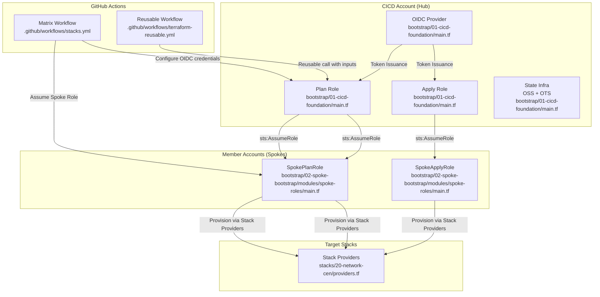
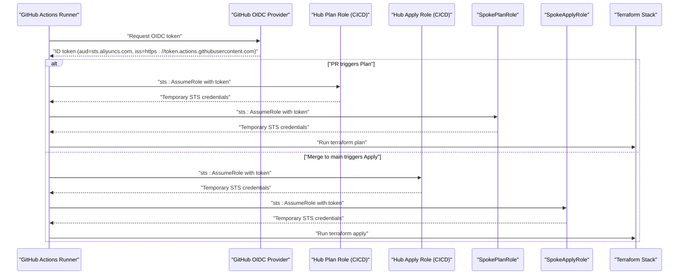
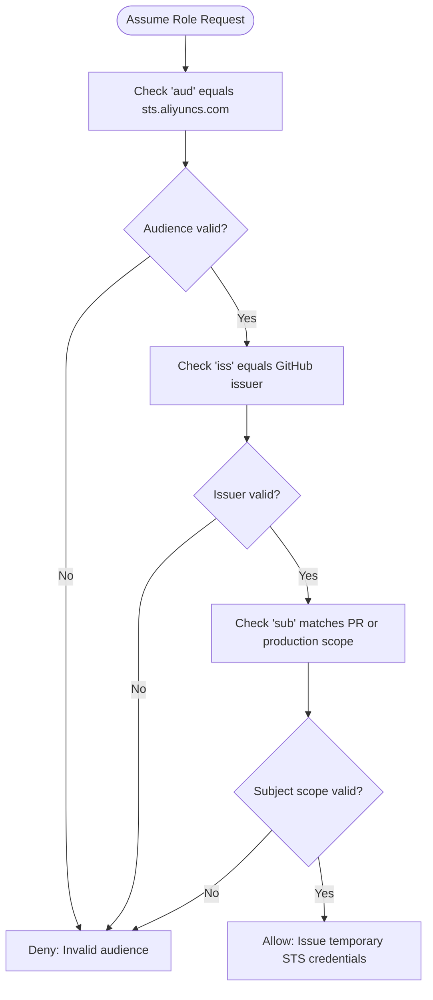
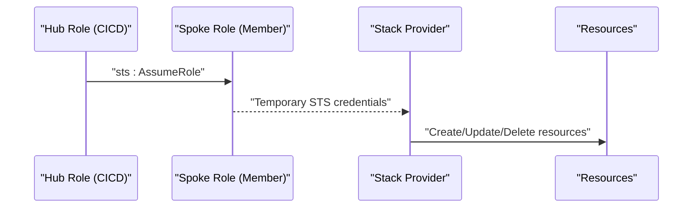
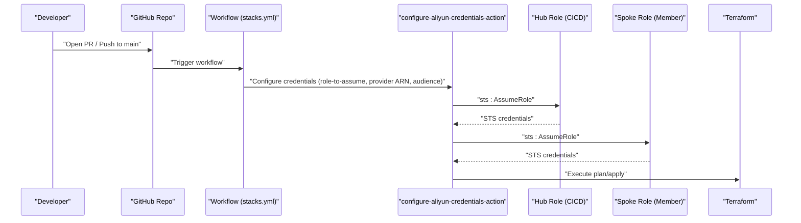
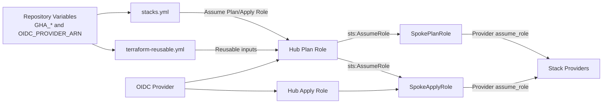

# Credential Management

<cite>
**Referenced Files in This Document**
- [README.md](file://README.md)
- [terraform-reusable.yml](file://.github/workflows/terraform-reusable.yml)
- [stacks.yml](file://.github/workflows/stacks.yml)
- [main.tf](file://bootstrap/01-cicd-foundation/main.tf)
- [providers.tf](file://bootstrap/01-cicd-foundation/providers.tf)
- [variables.tf](file://bootstrap/01-cicd-foundation/variables.tf)
- [main.tf](file://bootstrap/02-spoke-bootstrap/main.tf)
- [main.tf](file://bootstrap/02-spoke-bootstrap/modules/spoke-roles/main.tf)
- [providers.tf](file://bootstrap/02-spoke-bootstrap/providers.tf)
- [variables.tf](file://bootstrap/02-spoke-bootstrap/variables.tf)
- [main.tf](file://bootstrap/00-org-structure/main.tf)
- [providers.tf](file://stacks/20-network-cen/providers.tf)
- [variables.tf](file://stacks/20-network-cen/variables.tf)
</cite>

## Table of Contents
1. [Introduction](#introduction)
2. [Project Structure](#project-structure)
3. [Core Components](#core-components)
4. [Architecture Overview](#architecture-overview)
5. [Detailed Component Analysis](#detailed-component-analysis)
6. [Dependency Analysis](#dependency-analysis)
7. [Performance Considerations](#performance-considerations)
8. [Troubleshooting Guide](#troubleshooting-guide)
9. [Conclusion](#conclusion)

## Introduction
This document explains the OIDC-based credential management system that eliminates long-lived credentials in the Alibaba Cloud Landing Zone Accelerator demo. It covers how GitHub Actions OIDC tokens are minted, validated, and exchanged for Alibaba Cloud temporary credentials, and how the multi-stage flow proceeds from the GitHub OIDC provider through hub roles (Plan/Apply) to spoke role assumptions. It also documents token conditions, audience validation, repository-level access controls, and the security benefits of short-lived credentials, including automatic rotation and expiration handling.

## Project Structure
The repository is organized into three phases of bootstrapping and multiple Terraform stacks orchestrated by GitHub Actions workflows:
- bootstrap/00-org-structure: Establishes Resource Directory and organizational accounts/folders.
- bootstrap/01-cicd-foundation: Creates the OIDC provider, hub roles (Plan/Apply), and state infrastructure (OSS + Tablestore).
- bootstrap/02-spoke-bootstrap: Deploys spoke roles in member accounts, trusting the hub roles.
- stacks/: Individual deployment targets (e.g., networking, security) that assume spoke roles for provisioning.
- .github/workflows/: CI/CD pipelines that orchestrate plan/apply using OIDC-assumed roles.

**Diagram sources**
- [terraform-reusable.yml:1-118](file://.github/workflows/terraform-reusable.yml#L1-L118)
- [stacks.yml:1-112](file://.github/workflows/stacks.yml#L1-L112)
- [main.tf:49-105](file://bootstrap/01-cicd-foundation/main.tf#L49-L105)
- [main.tf:1-42](file://bootstrap/02-spoke-bootstrap/modules/spoke-roles/main.tf#L1-L42)
- [providers.tf:1-9](file://stacks/20-network-cen/providers.tf#L1-L9)

**Section sources**
- [README.md:141-165](file://README.md#L141-L165)

## Core Components
- GitHub OIDC Provider: Configured in the CICD account with issuer URL and client ID aligned to Alibaba Cloud STS.
- Hub Roles (Plan/Apply): Trust the OIDC provider with conditions for audience, issuer, and subject scopes (PR vs production environment).
- State Infrastructure: OSS bucket (KMS encrypted) and OTS table for state storage and locking.
- Spoke Roles: Per-account roles that trust the hub roles, scoped to least privilege (read-only for Plan; admin for Apply).
- Workflows: Two workflow modes:
  - Matrix workflow for PRs (Plan) and merges to main (Apply).
  - Reusable workflow supporting plan-only or apply modes with explicit inputs.

Security highlights:
- No long-lived credentials; short-lived STS tokens are requested per-run.
- Session duration capped at 1 hour for all roles.
- Environment gating restricts Apply to a protected environment.

**Section sources**
- [main.tf:49-105](file://bootstrap/01-cicd-foundation/main.tf#L49-L105)
- [main.tf:1-42](file://bootstrap/02-spoke-bootstrap/modules/spoke-roles/main.tf#L1-L42)
- [stacks.yml:13-16](file://.github/workflows/stacks.yml#L13-L16)
- [stacks.yml:42-47](file://.github/workflows/stacks.yml#L42-L47)
- [stacks.yml:94-99](file://.github/workflows/stacks.yml#L94-L99)
- [README.md:106-112](file://README.md#L106-L112)

## Architecture Overview
The system enforces a strict multi-stage trust chain:
1. GitHub Actions requests an OIDC token from the GitHub OIDC endpoint.
2. The token is exchanged for a hub role session in the CICD account using conditions for audience, issuer, and subject.
3. The hub role assumes a spoke role in the target member account.
4. The spoke role executes Terraform operations against Alibaba Cloud resources.

**Diagram sources**
- [main.tf:61-105](file://bootstrap/01-cicd-foundation/main.tf#L61-L105)
- [main.tf:1-42](file://bootstrap/02-spoke-bootstrap/modules/spoke-roles/main.tf#L1-L42)
- [stacks.yml:42-61](file://.github/workflows/stacks.yml#L42-L61)
- [stacks.yml:94-111](file://.github/workflows/stacks.yml#L94-L111)

## Detailed Component Analysis

### GitHub OIDC Provider and Conditions
- The OIDC provider is created in the CICD account with a fixed issuer URL and a client ID aligned to Alibaba Cloud STS.
- Hub roles embed conditions that require:
  - Audience equals the Alibaba Cloud STS client ID.
  - Issuer equals the GitHub OIDC issuer URL.
  - Subject pattern matches either pull request contexts or production environment contexts.

These conditions ensure that only authorized GitHub Actions workflows can assume the hub roles.

**Section sources**
- [main.tf:49-55](file://bootstrap/01-cicd-foundation/main.tf#L49-L55)
- [main.tf:61-82](file://bootstrap/01-cicd-foundation/main.tf#L61-L82)
- [main.tf:84-105](file://bootstrap/01-cicd-foundation/main.tf#L84-L105)

### Hub Roles: Plan and Apply
- Plan Role: Read-only access used during PR reviews; configured with conditions for pull_request subject scope.
- Apply Role: Write access restricted to the production environment; configured with conditions for production environment subject scope.
- Both roles attach a policy granting:
  - Access to OSS state bucket and OTS lock table.
  - Permission to assume spoke roles in member accounts.

**Diagram sources**
- [main.tf:61-105](file://bootstrap/01-cicd-foundation/main.tf#L61-L105)

**Section sources**
- [main.tf:112-149](file://bootstrap/01-cicd-foundation/main.tf#L112-L149)

### Spoke Roles and Provider Chaining
- Spoke roles are deployed per member account and trust the hub roles.
- Stacks configure provider assume_role with the spoke role ARN injected via environment variables.
- Provider chaining ensures that Terraform operations execute under the spoke role’s permissions.

**Diagram sources**
- [main.tf:1-42](file://bootstrap/02-spoke-bootstrap/modules/spoke-roles/main.tf#L1-L42)
- [providers.tf:1-9](file://stacks/20-network-cen/providers.tf#L1-L9)

**Section sources**
- [main.tf:1-42](file://bootstrap/02-spoke-bootstrap/modules/spoke-roles/main.tf#L1-L42)
- [providers.tf:1-9](file://stacks/20-network-cen/providers.tf#L1-L9)
- [variables.tf:7-10](file://stacks/20-network-cen/variables.tf#L7-L10)

### Workflows: Matrix and Reusable
- Matrix workflow:
  - PRs trigger plan-only runs using the Plan role and SpokePlanRole.
  - Merges to main trigger apply runs using the Apply role and SpokeApplyRole.
  - Uses repository variables for role ARNs and provider ARN.
- Reusable workflow:
  - Accepts inputs for role-to-assume, OIDC provider ARN, optional spoke role ARN, and action type.
  - Supports plan-only or apply modes and environment gating for apply.

**Diagram sources**
- [stacks.yml:18-68](file://.github/workflows/stacks.yml#L18-L68)
- [stacks.yml:69-112](file://.github/workflows/stacks.yml#L69-L112)
- [terraform-reusable.yml:38-118](file://.github/workflows/terraform-reusable.yml#L38-L118)

**Section sources**
- [stacks.yml:13-16](file://.github/workflows/stacks.yml#L13-L16)
- [stacks.yml:42-47](file://.github/workflows/stacks.yml#L42-L47)
- [stacks.yml:94-99](file://.github/workflows/stacks.yml#L94-L99)
- [terraform-reusable.yml:33-36](file://.github/workflows/terraform-reusable.yml#L33-L36)
- [terraform-reusable.yml:50-56](file://.github/workflows/terraform-reusable.yml#L50-L56)
- [terraform-reusable.yml:113-118](file://.github/workflows/terraform-reusable.yml#L113-L118)

### State Infrastructure and Locking
- OSS bucket with versioning and KMS encryption is provisioned in the CICD account.
- OTS instance/table provides distributed locking for Terraform state.
- Hub roles are granted access to these resources via attached policies.

**Section sources**
- [main.tf:5-43](file://bootstrap/01-cicd-foundation/main.tf#L5-L43)
- [main.tf:112-149](file://bootstrap/01-cicd-foundation/main.tf#L112-L149)

### Bootstrapping Providers and Cross-Account Access
- Management account provider uses a bootstrap operator credential.
- CICD account provider chains via ResourceDirectoryAccountAccessRole.
- Spoke providers chain into member accounts via the same access role pattern.

**Section sources**
- [providers.tf:1-16](file://bootstrap/01-cicd-foundation/providers.tf#L1-L16)
- [providers.tf:1-51](file://bootstrap/02-spoke-bootstrap/providers.tf#L1-L51)

## Dependency Analysis
The system exhibits clear separation of concerns:
- Workflows depend on repository variables and the reusable workflow contract.
- Hub roles depend on the OIDC provider and conditions.
- Spoke roles depend on hub roles.
- Stacks depend on spoke role ARNs injected at runtime.

**Diagram sources**
- [stacks.yml:42-47](file://.github/workflows/stacks.yml#L42-L47)
- [stacks.yml:94-99](file://.github/workflows/stacks.yml#L94-L99)
- [terraform-reusable.yml:15-27](file://.github/workflows/terraform-reusable.yml#L15-L27)
- [main.tf:49-55](file://bootstrap/01-cicd-foundation/main.tf#L49-L55)
- [main.tf:61-105](file://bootstrap/01-cicd-foundation/main.tf#L61-L105)
- [main.tf:1-42](file://bootstrap/02-spoke-bootstrap/modules/spoke-roles/main.tf#L1-L42)

**Section sources**
- [README.md:96-105](file://README.md#L96-L105)
- [variables.tf:12-15](file://bootstrap/01-cicd-foundation/variables.tf#L12-L15)

## Performance Considerations
- Session Duration: All roles cap session duration at 1 hour, minimizing exposure windows and enabling frequent rotation.
- Minimal State Writes: OSS versioning and OTS locking reduce contention and retries.
- Parallelization: Matrix workflow runs stacks concurrently; apply jobs are serialized to maintain safety.
- Network Efficiency: Provider chaining avoids repeated credential acquisition by reusing short-lived sessions.

[No sources needed since this section provides general guidance]

## Troubleshooting Guide
Common OIDC and credential issues and resolutions:

- Invalid Audience or Issuer
  - Symptom: AssumeRole fails with invalid audience or issuer.
  - Cause: Token audience mismatch or wrong issuer URL.
  - Resolution: Verify repository variable for OIDC provider ARN and ensure the hub role conditions match the expected audience and issuer.

- Subject Scope Mismatch
  - Symptom: PR-triggered plan fails to assume Plan role; production apply fails to assume Apply role.
  - Cause: Subject condition does not match PR or production environment.
  - Resolution: Confirm workflow triggers align with role conditions (pull_request vs production environment).

- Missing Repository Variables
  - Symptom: Workflow cannot resolve role ARNs or provider ARN.
  - Cause: Missing repository variables.
  - Resolution: Set GHA_PLAN_ROLE_ARN, GHA_APPLY_ROLE_ARN, OIDC_PROVIDER_ARN, and SPOKE_ACCOUNT_IDS_JSON.

- Spoke Role ARN Not Provided
  - Symptom: Stack provider cannot assume spoke role.
  - Cause: TF_VAR_spoke_role_arn not set.
  - Resolution: Ensure workflow sets TF_VAR_spoke_role_arn to the spoke role ARN for the target account.

- State Access Failures
  - Symptom: Plan/Apply cannot read/write state.
  - Cause: Hub role lacks state access policy.
  - Resolution: Confirm HubStateAccess policy is attached to both Plan and Apply roles.

- Cross-Account Provider Chaining
  - Symptom: Cannot operate in member accounts.
  - Cause: Missing ResourceDirectoryAccountAccessRole assumption or incorrect alias.
  - Resolution: Verify provider aliases and assume_role blocks in spoke bootstrap and stack providers.

**Section sources**
- [main.tf:61-105](file://bootstrap/01-cicd-foundation/main.tf#L61-L105)
- [main.tf:112-149](file://bootstrap/01-cicd-foundation/main.tf#L112-L149)
- [stacks.yml:42-47](file://.github/workflows/stacks.yml#L42-L47)
- [stacks.yml:94-99](file://.github/workflows/stacks.yml#L94-L99)
- [providers.tf:1-9](file://stacks/20-network-cen/providers.tf#L1-L9)
- [variables.tf:7-10](file://stacks/20-network-cen/variables.tf#L7-L10)

## Conclusion
This OIDC-based credential management system enforces least-privilege, repository-scoped access, and automatic rotation through short-lived credentials. By chaining trust from GitHub OIDC through hub roles to spoke roles, it minimizes risk while enabling secure, auditable automation across Alibaba Cloud accounts. The documented conditions, repository variables, and workflow inputs provide a clear blueprint for deployment and troubleshooting.