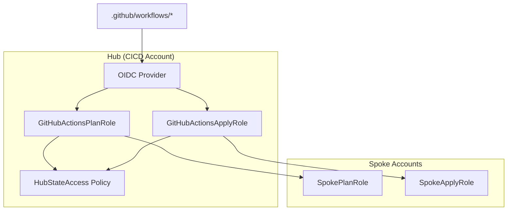
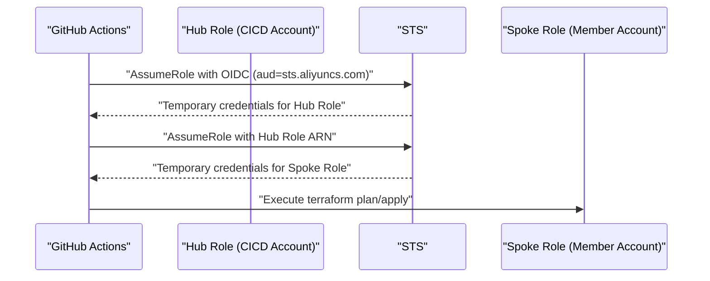
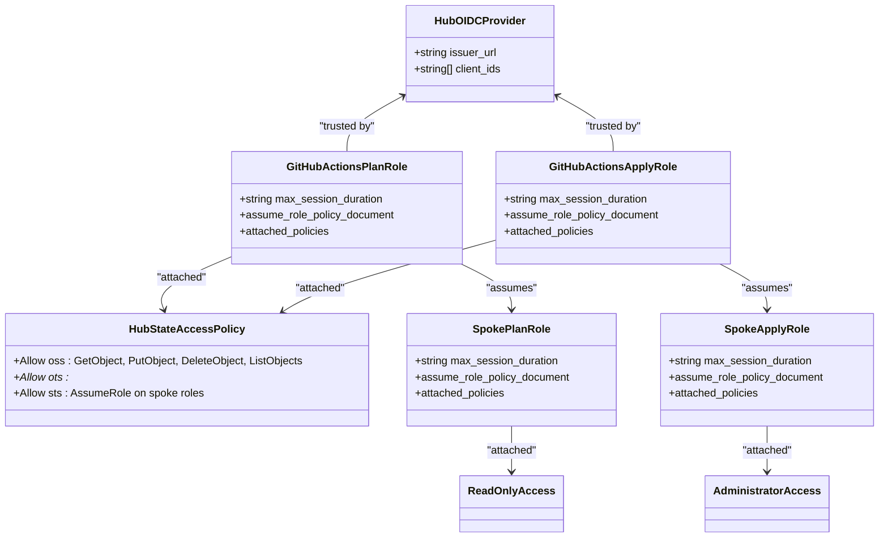
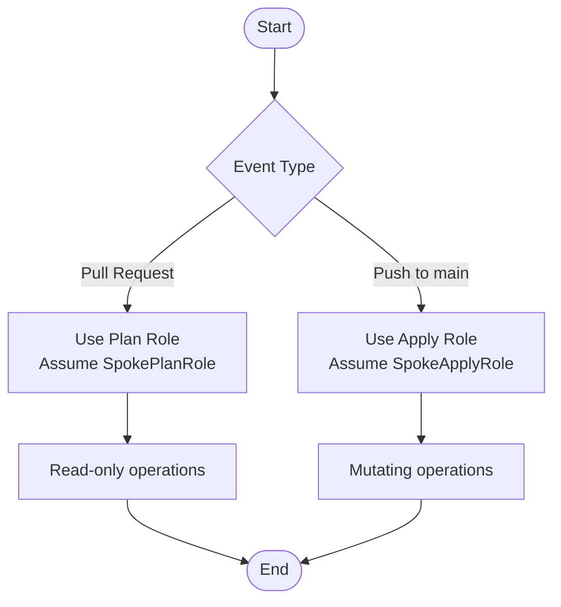
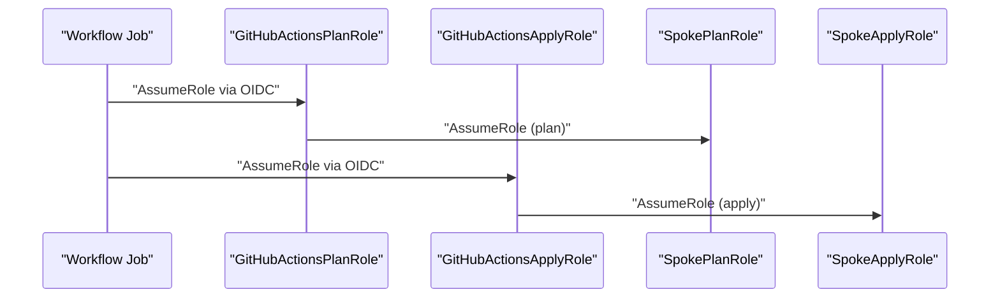
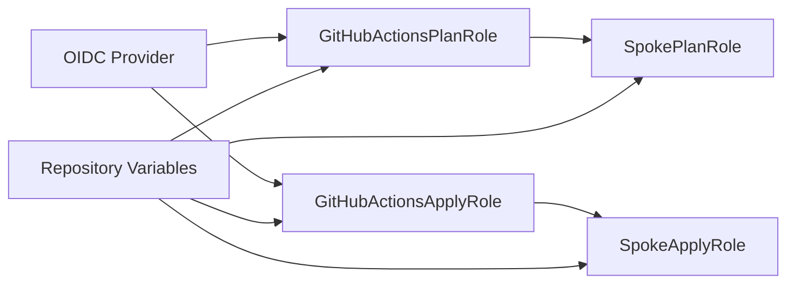

# IAM Role Design

<cite>
**Referenced Files in This Document**
- [README.md](file://README.md)
- [bootstrap/01-cicd-foundation/main.tf](file://bootstrap/01-cicd-foundation/main.tf)
- [bootstrap/01-cicd-foundation/variables.tf](file://bootstrap/01-cicd-foundation/variables.tf)
- [bootstrap/02-spoke-bootstrap/main.tf](file://bootstrap/02-spoke-bootstrap/main.tf)
- [bootstrap/02-spoke-bootstrap/modules/spoke-roles/main.tf](file://bootstrap/02-spoke-bootstrap/modules/spoke-roles/main.tf)
- [bootstrap/02-spoke-bootstrap/modules/spoke-roles/variables.tf](file://bootstrap/02-spoke-bootstrap/modules/spoke-roles/variables.tf)
- [bootstrap/02-spoke-bootstrap/modules/spoke-roles/outputs.tf](file://bootstrap/02-spoke-bootstrap/modules/spoke-roles/outputs.tf)
- [bootstrap/02-spoke-bootstrap/variables.tf](file://bootstrap/02-spoke-bootstrap/variables.tf)
- [.github/workflows/stacks.yml](file://.github/workflows/stacks.yml)
- [.github/workflows/terraform-reusable.yml](file://.github/workflows/terraform-reusable.yml)
- [.github/workflows/bootstrap-00-org-structure.yml](file://.github/workflows/bootstrap-00-org-structure.yml)
- [.github/workflows/bootstrap-01-cicd-foundation.yml](file://.github/workflows/bootstrap-01-cicd-foundation.yml)
- [.github/workflows/bootstrap-02-spoke.yml](file://.github/workflows/bootstrap-02-spoke.yml)
- [stacks/20-network-cen/providers.tf](file://stacks/20-network-cen/providers.tf)
- [stacks/11-log-archive/providers.tf](file://stacks/11-log-archive/providers.tf)
</cite>

## Table of Contents
1. [Introduction](#introduction)
2. [Project Structure](#project-structure)
3. [Core Components](#core-components)
4. [Architecture Overview](#architecture-overview)
5. [Detailed Component Analysis](#detailed-component-analysis)
6. [Dependency Analysis](#dependency-analysis)
7. [Performance Considerations](#performance-considerations)
8. [Troubleshooting Guide](#troubleshooting-guide)
9. [Conclusion](#conclusion)
10. [Appendices](#appendices)

## Introduction
This document describes the least-privilege Identity and Access Management (IAM) role design that separates Plan and Apply operations across hub and spoke accounts. It explains the role hierarchy, trust policies, permission boundaries, separation of duties, role session duration limits, condition-based access controls, cross-account role delegation patterns, policy attachment strategies, role naming conventions, and security implications.

## Project Structure
The repository organizes bootstrapping and deployment across three phases:
- Phase 1: Organization structure provisioning
- Phase 2: CI/CD foundation (OIDC provider, hub roles, state backend)
- Phase 3: Spoke roles provisioning in member accounts

**Diagram sources**
- [bootstrap/01-cicd-foundation/main.tf:49-105](file://bootstrap/01-cicd-foundation/main.tf#L49-L105)
- [bootstrap/01-cicd-foundation/main.tf:112-149](file://bootstrap/01-cicd-foundation/main.tf#L112-L149)
- [bootstrap/02-spoke-bootstrap/modules/spoke-roles/main.tf:3-41](file://bootstrap/02-spoke-bootstrap/modules/spoke-roles/main.tf#L3-L41)

**Section sources**
- [README.md:5-28](file://README.md#L5-L28)
- [README.md:141-165](file://README.md#L141-L165)

## Core Components
- GitHubActionsPlanRole (hub): Read-only role used during pull requests to perform terraform plan.
- GitHubActionsApplyRole (hub): Full-access role used for production apply, gated by GitHub environments and conditions.
- SpokePlanRole (spoke): Read-only role assumed by the plan role to inspect resources in a specific spoke account.
- SpokeApplyRole (spoke): Administrator role assumed by the apply role to mutate resources in a specific spoke account.

Key characteristics:
- Session duration: All roles configured with a 3600-second (1 hour) maximum session duration.
- Trust model: Hub roles trust the OIDC provider with conditions; spoke roles trust the respective hub role.
- Least privilege: Plan roles are read-only; Apply roles are administrator scoped to the spoke.

**Section sources**
- [bootstrap/01-cicd-foundation/main.tf:61-105](file://bootstrap/01-cicd-foundation/main.tf#L61-L105)
- [bootstrap/01-cicd-foundation/main.tf:112-149](file://bootstrap/01-cicd-foundation/main.tf#L112-L149)
- [bootstrap/02-spoke-bootstrap/modules/spoke-roles/main.tf:3-41](file://bootstrap/02-spoke-bootstrap/modules/spoke-roles/main.tf#L3-L41)

## Architecture Overview
The credential flow follows a two-stage chain:
1. GitHub OIDC token is exchanged for a short-lived hub role session.
2. The hub role assumes the corresponding spoke role in the target account.

**Diagram sources**
- [README.md:28-28](file://README.md#L28-L28)
- [bootstrap/01-cicd-foundation/main.tf:49-105](file://bootstrap/01-cicd-foundation/main.tf#L49-L105)
- [bootstrap/02-spoke-bootstrap/modules/spoke-roles/main.tf:3-41](file://bootstrap/02-spoke-bootstrap/modules/spoke-roles/main.tf#L3-L41)

## Detailed Component Analysis

### Role Hierarchy and Trust Policies
- Hub OIDC Provider: Created in the CICD account and federated with GitHub Actions.
- GitHubActionsPlanRole:
  - Trusted by the OIDC provider with conditions limiting audience and subject.
  - Attached to a custom policy enabling state operations and assuming spoke plan roles.
- GitHubActionsApplyRole:
  - Trusted by the OIDC provider with conditions targeting the production environment.
  - Attached to the same state policy as the plan role.
- SpokePlanRole:
  - Trusted by the hub plan role ARN.
  - Attached to ReadOnlyAccess system policy.
- SpokeApplyRole:
  - Trusted by the hub apply role ARN.
  - Attached to AdministratorAccess system policy.

**Diagram sources**
- [bootstrap/01-cicd-foundation/main.tf:49-105](file://bootstrap/01-cicd-foundation/main.tf#L49-L105)
- [bootstrap/01-cicd-foundation/main.tf:112-149](file://bootstrap/01-cicd-foundation/main.tf#L112-L149)
- [bootstrap/02-spoke-bootstrap/modules/spoke-roles/main.tf:3-41](file://bootstrap/02-spoke-bootstrap/modules/spoke-roles/main.tf#L3-L41)

**Section sources**
- [bootstrap/01-cicd-foundation/main.tf:49-105](file://bootstrap/01-cicd-foundation/main.tf#L49-L105)
- [bootstrap/01-cicd-foundation/main.tf:112-149](file://bootstrap/01-cicd-foundation/main.tf#L112-L149)
- [bootstrap/02-spoke-bootstrap/modules/spoke-roles/main.tf:3-41](file://bootstrap/02-spoke-bootstrap/modules/spoke-roles/main.tf#L3-L41)

### Separation of Duties Between Planning and Applying
- Planning:
  - Uses GitHubActionsPlanRole to access state backend and assume SpokePlanRole.
  - SpokePlanRole is read-only, preventing accidental mutations.
- Applying:
  - Uses GitHubActionsApplyRole (restricted to production environment) to access state backend and assume SpokeApplyRole.
  - SpokeApplyRole is administrator-scoped to the spoke, enabling resource changes.

**Diagram sources**
- [.github/workflows/stacks.yml:19-68](file://.github/workflows/stacks.yml#L19-L68)
- [.github/workflows/stacks.yml:69-112](file://.github/workflows/stacks.yml#L69-L112)
- [bootstrap/01-cicd-foundation/main.tf:61-105](file://bootstrap/01-cicd-foundation/main.tf#L61-L105)
- [bootstrap/02-spoke-bootstrap/modules/spoke-roles/main.tf:3-41](file://bootstrap/02-spoke-bootstrap/modules/spoke-roles/main.tf#L3-L41)

**Section sources**
- [.github/workflows/stacks.yml:19-68](file://.github/workflows/stacks.yml#L19-L68)
- [.github/workflows/stacks.yml:69-112](file://.github/workflows/stacks.yml#L69-L112)
- [README.md:106-113](file://README.md#L106-L113)

### Role Assumption Chains and Cross-Account Delegation
- Stage 1: GitHub OIDC token to hub role.
- Stage 2: Hub role to spoke role in the target account.
- The spoke role ARNs are passed via environment variables and Terraform provider assume_role configuration.

**Diagram sources**
- [.github/workflows/stacks.yml:42-99](file://.github/workflows/stacks.yml#L42-L99)
- [stacks/20-network-cen/providers.tf:3-7](file://stacks/20-network-cen/providers.tf#L3-L7)
- [stacks/11-log-archive/providers.tf:3-7](file://stacks/11-log-archive/providers.tf#L3-L7)

**Section sources**
- [.github/workflows/stacks.yml:42-99](file://.github/workflows/stacks.yml#L42-L99)
- [stacks/20-network-cen/providers.tf:3-7](file://stacks/20-network-cen/providers.tf#L3-L7)
- [stacks/11-log-archive/providers.tf:3-7](file://stacks/11-log-archive/providers.tf#L3-L7)

### Trust Policies and Conditions
- Hub roles trust the OIDC provider with:
  - Audience equals the Alibaba Cloud STS endpoint identifier.
  - Issuer equals the GitHub OIDC issuer URL.
  - Subject conditions restrict plan role to pull requests and apply role to production environment.
- Spoke roles trust the hub role ARN of the matching operation (plan or apply).

**Section sources**
- [bootstrap/01-cicd-foundation/main.tf:65-103](file://bootstrap/01-cicd-foundation/main.tf#L65-L103)
- [bootstrap/02-spoke-bootstrap/modules/spoke-roles/main.tf:6-13](file://bootstrap/02-spoke-bootstrap/modules/spoke-roles/main.tf#L6-L13)
- [bootstrap/02-spoke-bootstrap/modules/spoke-roles/main.tf:27-34](file://bootstrap/02-spoke-bootstrap/modules/spoke-roles/main.tf#L27-L34)

### Permission Boundaries and Least Privilege
- Plan roles:
  - Hub plan role: state access plus assume-role on spoke plan roles.
  - Spoke plan role: ReadOnlyAccess system policy.
- Apply roles:
  - Hub apply role: identical state access policy.
  - Spoke apply role: AdministratorAccess system policy.

Scope-down opportunities:
- Replace AdministratorAccess with scoping policies tailored to each spoke’s responsibilities.
- Introduce SCPs or permission boundaries at the organizational level to further constrain permissions.

**Section sources**
- [bootstrap/01-cicd-foundation/main.tf:112-149](file://bootstrap/01-cicd-foundation/main.tf#L112-L149)
- [bootstrap/02-spoke-bootstrap/modules/spoke-roles/main.tf:16-20](file://bootstrap/02-spoke-bootstrap/modules/spoke-roles/main.tf#L16-L20)
- [bootstrap/02-spoke-bootstrap/modules/spoke-roles/main.tf:37-41](file://bootstrap/02-spoke-bootstrap/modules/spoke-roles/main.tf#L37-L41)

### Role Naming Conventions and Session Duration Limits
- Naming:
  - Hub roles: GitHubActionsPlanRole, GitHubActionsApplyRole
  - Spoke roles: SpokePlanRole, SpokeApplyRole
- Session duration:
  - All roles configured with a maximum session duration of 3600 seconds.

**Section sources**
- [bootstrap/01-cicd-foundation/main.tf:61-105](file://bootstrap/01-cicd-foundation/main.tf#L61-L105)
- [bootstrap/02-spoke-bootstrap/modules/spoke-roles/main.tf:4-5](file://bootstrap/02-spoke-bootstrap/modules/spoke-roles/main.tf#L4-L5)
- [bootstrap/02-spoke-bootstrap/modules/spoke-roles/main.tf:25-26](file://bootstrap/02-spoke-bootstrap/modules/spoke-roles/main.tf#L25-L26)

### Policy Attachment Strategies
- Hub roles are attached to a custom HubStateAccess policy that:
  - Grants OSS access to the state bucket and objects.
  - Grants OTS access for state locking.
  - Allows sts:AssumeRole on both spoke plan and apply roles.
- Spoke roles attach system policies:
  - SpokePlanRole: ReadOnlyAccess
  - SpokeApplyRole: AdministratorAccess

**Section sources**
- [bootstrap/01-cicd-foundation/main.tf:112-149](file://bootstrap/01-cicd-foundation/main.tf#L112-L149)
- [bootstrap/02-spoke-bootstrap/modules/spoke-roles/main.tf:16-20](file://bootstrap/02-spoke-bootstrap/modules/spoke-roles/main.tf#L16-L20)
- [bootstrap/02-spoke-bootstrap/modules/spoke-roles/main.tf:37-41](file://bootstrap/02-spoke-bootstrap/modules/spoke-roles/main.tf#L37-L41)

### Cross-Account Role Delegation Patterns
- The spoke role ARNs are constructed dynamically using the target account ID and injected into Terraform provider assume_role blocks.
- Workflows pass the spoke role ARN via environment variables to the Terraform Alibaba Cloud provider.

**Section sources**
- [.github/workflows/stacks.yml:58-58](file://.github/workflows/stacks.yml#L58-L58)
- [.github/workflows/stacks.yml:110-110](file://.github/workflows/stacks.yml#L110-L110)
- [stacks/20-network-cen/providers.tf:4-6](file://stacks/20-network-cen/providers.tf#L4-L6)
- [stacks/11-log-archive/providers.tf:4-6](file://stacks/11-log-archive/providers.tf#L4-L6)

## Dependency Analysis
The design exhibits clear separation of concerns:
- Hub roles depend on the OIDC provider and state infrastructure.
- Spoke roles depend on the hub roles’ trust policies.
- Workflows depend on repository variables to select the correct hub role and spoke role ARN.

**Diagram sources**
- [bootstrap/01-cicd-foundation/main.tf:49-105](file://bootstrap/01-cicd-foundation/main.tf#L49-L105)
- [bootstrap/02-spoke-bootstrap/modules/spoke-roles/main.tf:3-41](file://bootstrap/02-spoke-bootstrap/modules/spoke-roles/main.tf#L3-L41)
- [.github/workflows/stacks.yml:42-99](file://.github/workflows/stacks.yml#L42-L99)

**Section sources**
- [bootstrap/01-cicd-foundation/main.tf:49-105](file://bootstrap/01-cicd-foundation/main.tf#L49-L105)
- [bootstrap/02-spoke-bootstrap/modules/spoke-roles/main.tf:3-41](file://bootstrap/02-spoke-bootstrap/modules/spoke-roles/main.tf#L3-L41)
- [.github/workflows/stacks.yml:42-99](file://.github/workflows/stacks.yml#L42-L99)

## Performance Considerations
- Session duration: 3600 seconds balances operational convenience with risk mitigation.
- State operations: Using OSS with KMS encryption and OTS for locking ensures reliable and secure state management.
- Parallelization: Apply jobs are serialized per stack to avoid race conditions; plan jobs can run in parallel across stacks.

[No sources needed since this section provides general guidance]

## Troubleshooting Guide
Common issues and resolutions:
- OIDC audience or issuer mismatch: Verify the OIDC provider configuration and the audience used in assume-role calls.
- Insufficient permissions:
  - Plan failures: Confirm ReadOnlyAccess is attached to SpokePlanRole and HubStateAccess is attached to the hub plan role.
  - Apply failures: Confirm AdministratorAccess is attached to SpokeApplyRole and HubStateAccess is attached to the hub apply role.
- Incorrect spoke role ARN:
  - Ensure the spoke role ARN is correctly constructed and passed to the Terraform provider assume_role block.
- Session expiration:
  - If sessions expire mid-run, consider increasing the session duration or splitting large plans/applies into smaller batches.

**Section sources**
- [bootstrap/01-cicd-foundation/main.tf:65-103](file://bootstrap/01-cicd-foundation/main.tf#L65-L103)
- [bootstrap/01-cicd-foundation/main.tf:112-149](file://bootstrap/01-cicd-foundation/main.tf#L112-L149)
- [bootstrap/02-spoke-bootstrap/modules/spoke-roles/main.tf:16-20](file://bootstrap/02-spoke-bootstrap/modules/spoke-roles/main.tf#L16-L20)
- [bootstrap/02-spoke-bootstrap/modules/spoke-roles/main.tf:37-41](file://bootstrap/02-spoke-bootstrap/modules/spoke-roles/main.tf#L37-L41)
- [.github/workflows/stacks.yml:58-58](file://.github/workflows/stacks.yml#L58-L58)
- [.github/workflows/stacks.yml:110-110](file://.github/workflows/stacks.yml#L110-L110)

## Conclusion
This design enforces least privilege by separating planning and applying operations across hub and spoke accounts, using OIDC-based short-lived credentials, strict trust policies with conditions, and read-only vs. administrator scopes. The modular structure enables safe, auditable, and scalable deployments with clear separation of duties and robust security controls.

[No sources needed since this section summarizes without analyzing specific files]

## Appendices

### Appendix A: Role Lifecycle and Bootstrap Phases
- Phase 1: Organization structure provisioning (not covered here).
- Phase 2: CI/CD foundation (OIDC provider, hub roles, state backend).
- Phase 3: Spoke roles provisioning in member accounts.

**Section sources**
- [README.md:48-77](file://README.md#L48-L77)
- [bootstrap/01-cicd-foundation/main.tf:49-105](file://bootstrap/01-cicd-foundation/main.tf#L49-L105)
- [bootstrap/02-spoke-bootstrap/main.tf:4-33](file://bootstrap/02-spoke-bootstrap/main.tf#L4-L33)

### Appendix B: Workflow Integration Examples
- Stacks workflow:
  - Pull request triggers plan with SpokePlanRole.
  - Push to main triggers apply with SpokeApplyRole.
- Reusable workflow:
  - Accepts role-to-assume, OIDC provider ARN, optional spoke role ARN, and action type.
  - Supports plan-only mode for drift detection.

**Section sources**
- [.github/workflows/stacks.yml:19-68](file://.github/workflows/stacks.yml#L19-L68)
- [.github/workflows/stacks.yml:69-112](file://.github/workflows/stacks.yml#L69-L112)
- [.github/workflows/terraform-reusable.yml:1-118](file://.github/workflows/terraform-reusable.yml#L1-L118)