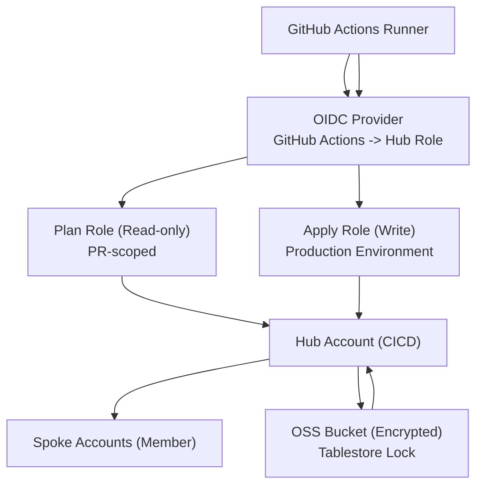
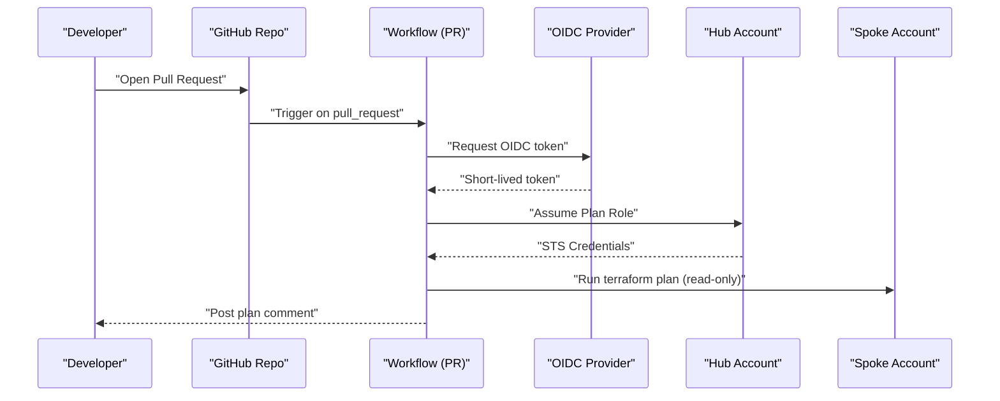
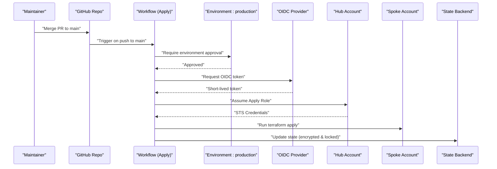
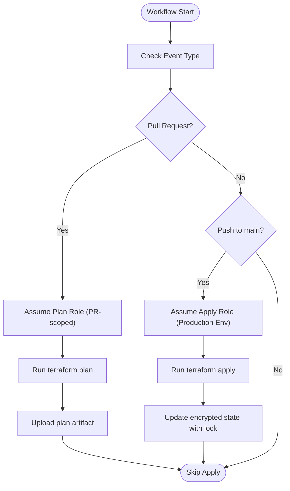
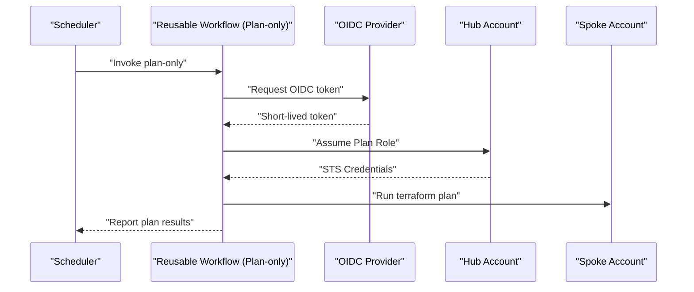
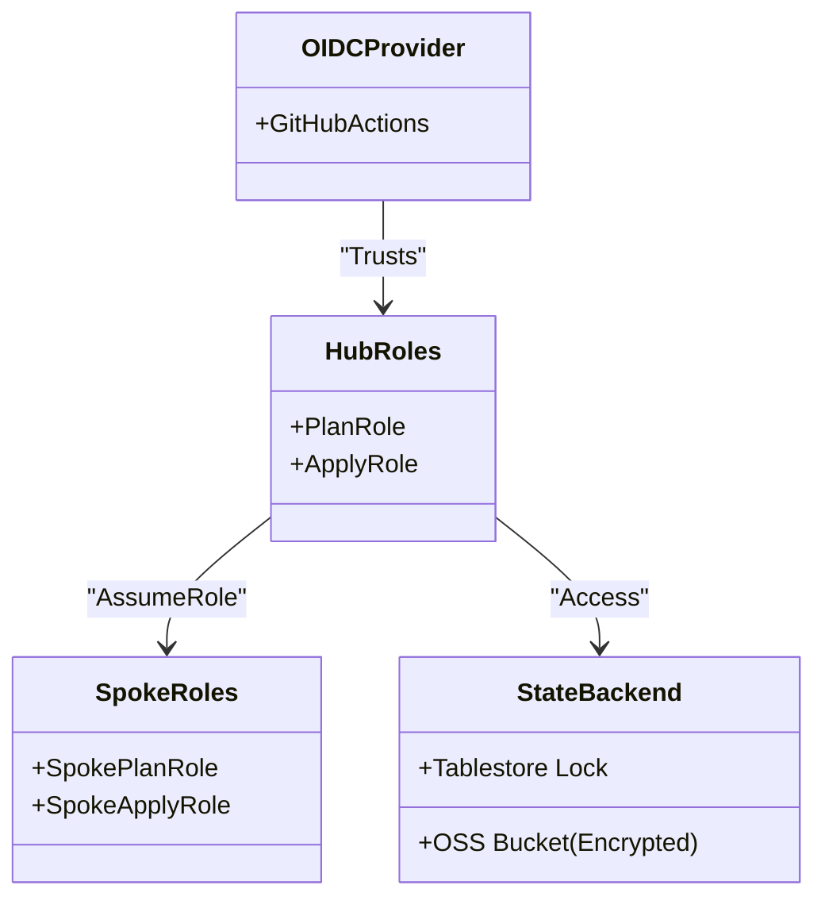
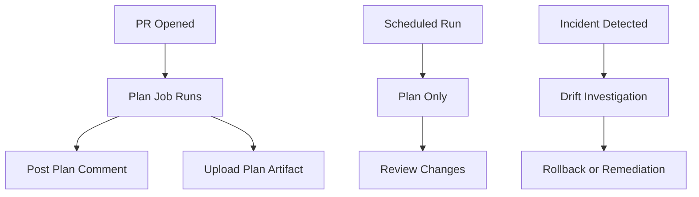
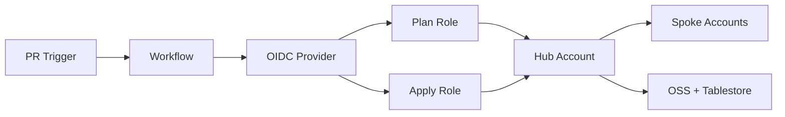

# Operational Security

<cite>
**Referenced Files in This Document**
- [README.md](file://README.md)
- [.github/workflows/bootstrap-00-org-structure.yml](file://.github/workflows/bootstrap-00-org-structure.yml)
- [.github/workflows/bootstrap-01-cicd-foundation.yml](file://.github/workflows/bootstrap-01-cicd-foundation.yml)
- [.github/workflows/bootstrap-02-spoke.yml](file://.github/workflows/bootstrap-02-spoke.yml)
- [.github/workflows/stacks.yml](file://.github/workflows/stacks.yml)
- [.github/workflows/terraform-reusable.yml](file://.github/workflows/terraform-reusable.yml)
- [bootstrap/00-org-structure/main.tf](file://bootstrap/00-org-structure/main.tf)
- [bootstrap/01-cicd-foundation/main.tf](file://bootstrap/01-cicd-foundation/main.tf)
- [bootstrap/01-cicd-foundation/backend.tf.example](file://bootstrap/01-cicd-foundation/backend.tf.example)
- [bootstrap/02-spoke-bootstrap/main.tf](file://bootstrap/02-spoke-bootstrap/main.tf)
- [bootstrap/02-spoke-bootstrap/modules/spoke-roles/main.tf](file://bootstrap/02-spoke-bootstrap/modules/spoke-roles/main.tf)
- [stacks/10-identity-cloudsso/main.tf](file://stacks/10-identity-cloudsso/main.tf)
- [stacks/30-security-kms/main.tf](file://stacks/30-security-kms/main.tf)
- [stacks/12-guardrails-preventive/main.tf](file://stacks/12-guardrails-preventive/main.tf)
</cite>

## Table of Contents
1. [Introduction](#introduction)
2. [Project Structure](#project-structure)
3. [Core Components](#core-components)
4. [Architecture Overview](#architecture-overview)
5. [Detailed Component Analysis](#detailed-component-analysis)
6. [Dependency Analysis](#dependency-analysis)
7. [Performance Considerations](#performance-considerations)
8. [Troubleshooting Guide](#troubleshooting-guide)
9. [Conclusion](#conclusion)
10. [Appendices](#appendices)

## Introduction
This document describes operational security practices for the repository, focusing on pull request validation, environment-based deployments, and security monitoring. It explains CI/CD security controls such as branch protection alignment, required reviews, and environment approval gates. It also documents security scanning integration, dependency vulnerability checks, and compliance validation in workflows. Audit logging, change tracking, and incident response procedures are covered alongside security best practices for repository permissions, secret management, and access control. Finally, it outlines security monitoring dashboards, alerting mechanisms, and continuous security assessment processes.

## Project Structure
The repository is organized into three primary areas:
- bootstrap: bootstrapping phases for organizational structure, CI/CD foundation, and spoke roles
- stacks: modular cloud deployments grouped by domain (identity, logging, guardrails, networking, security)
- .github/workflows: GitHub Actions workflows for CI/CD automation

```mermaid
graph TB
subgraph "Repository"
A[".github/workflows"]
B["bootstrap"]
C["stacks"]
end
subgraph "Workflows"
W1["bootstrap-00-org-structure.yml"]
W2["bootstrap-01-cicd-foundation.yml"]
W3["bootstrap-02-spoke.yml"]
W4["stacks.yml"]
W5["terraform-reusable.yml"]
end
subgraph "Bootstrap Stages"
S1["00-org-structure"]
S2["01-cicd-foundation"]
S3["02-spoke-bootstrap"]
end
subgraph "Stacks"
T1["10-identity-cloudsso"]
T2["11-log-archive"]
T3["12-guardrails-preventive"]
T4["13-guardrails-detective"]
T5["20-network-cen"]
T6["21-network-dmz"]
T7["30-security-kms"]
T8["30-security-firewall"]
T9["30-security-waf"]
end
A --> W1
A --> W2
A --> W3
A --> W4
A --> W5
B --> S1
B --> S2
B --> S3
C --> T1
C --> T2
C --> T3
C --> T4
C --> T5
C --> T6
C --> T7
C --> T8
C --> T9
```

**Diagram sources**
- [README.md:141-165](file://README.md#L141-L165)
- [.github/workflows/bootstrap-00-org-structure.yml:1-36](file://.github/workflows/bootstrap-00-org-structure.yml#L1-L36)
- [.github/workflows/bootstrap-01-cicd-foundation.yml:1-36](file://.github/workflows/bootstrap-01-cicd-foundation.yml#L1-L36)
- [.github/workflows/bootstrap-02-spoke.yml:1-36](file://.github/workflows/bootstrap-02-spoke.yml#L1-L36)
- [.github/workflows/stacks.yml:1-112](file://.github/workflows/stacks.yml#L1-L112)
- [.github/workflows/terraform-reusable.yml:1-118](file://.github/workflows/terraform-reusable.yml#L1-L118)

**Section sources**
- [README.md:141-165](file://README.md#L141-L165)

## Core Components
- Pull Request Validation: PR-triggered workflows run plan-only operations against affected bootstrap and stacks directories, producing human-readable plans and posting them as comments for review.
- Environment-Based Deployments: Apply operations are gated behind a production environment requiring manual approval, ensuring least-privilege and separation of duties.
- Security Monitoring: Drift detection is supported via scheduled plan-only runs; logs and artifacts capture operational changes for auditability.
- CI/CD Security Controls: Branch protection alignment, required reviews, and environment approval gates are enforced by workflow configuration and IAM role conditions.
- Security Scanning Integration: The repository demonstrates OIDC-based identity federation and encrypted state storage; scanning and vulnerability checks can be integrated at the CI stage.
- Compliance Validation: Role assumptions are constrained by OIDC conditions and environment scopes; state encryption and locking enforce data integrity and compliance.

**Section sources**
- [.github/workflows/bootstrap-00-org-structure.yml:18-36](file://.github/workflows/bootstrap-00-org-structure.yml#L18-L36)
- [.github/workflows/bootstrap-01-cicd-foundation.yml:18-36](file://.github/workflows/bootstrap-01-cicd-foundation.yml#L18-L36)
- [.github/workflows/bootstrap-02-spoke.yml:18-36](file://.github/workflows/bootstrap-02-spoke.yml#L18-L36)
- [.github/workflows/stacks.yml:19-112](file://.github/workflows/stacks.yml#L19-L112)
- [.github/workflows/terraform-reusable.yml:33-118](file://.github/workflows/terraform-reusable.yml#L33-L118)
- [README.md:106-113](file://README.md#L106-L113)

## Architecture Overview
The operational security architecture combines GitHub Actions with Alibaba Cloud OIDC federation and role assumption across hub and spoke accounts. The CI/CD pipeline enforces least privilege and environment gating, while state is stored securely with encryption and locking.

**Diagram sources**
- [README.md:28-28](file://README.md#L28-L28)
- [bootstrap/01-cicd-foundation/main.tf:49-105](file://bootstrap/01-cicd-foundation/main.tf#L49-L105)
- [bootstrap/02-spoke-bootstrap/modules/spoke-roles/main.tf:3-41](file://bootstrap/02-spoke-bootstrap/modules/spoke-roles/main.tf#L3-L41)
- [bootstrap/01-cicd-foundation/main.tf:5-43](file://bootstrap/01-cicd-foundation/main.tf#L5-L43)

## Detailed Component Analysis

### Pull Request Validation
- Trigger Conditions: Workflows activate on pull_request for specific paths and post plans as comments for review.
- Least Privilege: PR plans assume the Plan Role (read-only) scoped to PR contexts.
- Artifact and Review: Plans are uploaded and posted as comments for reviewer visibility.

**Diagram sources**
- [.github/workflows/bootstrap-00-org-structure.yml:18-36](file://.github/workflows/bootstrap-00-org-structure.yml#L18-L36)
- [.github/workflows/bootstrap-01-cicd-foundation.yml:18-36](file://.github/workflows/bootstrap-01-cicd-foundation.yml#L18-L36)
- [.github/workflows/bootstrap-02-spoke.yml:18-36](file://.github/workflows/bootstrap-02-spoke.yml#L18-L36)
- [.github/workflows/terraform-reusable.yml:50-112](file://.github/workflows/terraform-reusable.yml#L50-L112)
- [bootstrap/01-cicd-foundation/main.tf:61-105](file://bootstrap/01-cicd-foundation/main.tf#L61-L105)
- [bootstrap/02-spoke-bootstrap/modules/spoke-roles/main.tf:3-21](file://bootstrap/02-spoke-bootstrap/modules/spoke-roles/main.tf#L3-L21)

**Section sources**
- [.github/workflows/bootstrap-00-org-structure.yml:18-36](file://.github/workflows/bootstrap-00-org-structure.yml#L18-L36)
- [.github/workflows/bootstrap-01-cicd-foundation.yml:18-36](file://.github/workflows/bootstrap-01-cicd-foundation.yml#L18-L36)
- [.github/workflows/bootstrap-02-spoke.yml:18-36](file://.github/workflows/bootstrap-02-spoke.yml#L18-L36)
- [.github/workflows/terraform-reusable.yml:50-112](file://.github/workflows/terraform-reusable.yml#L50-L112)

### Environment-Based Deployments and Approval Gates
- Production Environment: Apply jobs run only when merged to main and target the production environment, enforcing manual approvals.
- Least Privilege: Apply operations assume the Apply Role, which is constrained by OIDC conditions and environment scopes.
- Concurrency Control: Apply jobs limit concurrency to one stack at a time to reduce risk.

**Diagram sources**
- [.github/workflows/stacks.yml:69-112](file://.github/workflows/stacks.yml#L69-L112)
- [.github/workflows/terraform-reusable.yml:39-42](file://.github/workflows/terraform-reusable.yml#L39-L42)
- [bootstrap/01-cicd-foundation/main.tf:84-105](file://bootstrap/01-cicd-foundation/main.tf#L84-L105)
- [bootstrap/02-spoke-bootstrap/modules/spoke-roles/main.tf:22-41](file://bootstrap/02-spoke-bootstrap/modules/spoke-roles/main.tf#L22-L41)
- [bootstrap/01-cicd-foundation/main.tf:5-43](file://bootstrap/01-cicd-foundation/main.tf#L5-L43)

**Section sources**
- [.github/workflows/stacks.yml:69-112](file://.github/workflows/stacks.yml#L69-L112)
- [bootstrap/01-cicd-foundation/main.tf:84-105](file://bootstrap/01-cicd-foundation/main.tf#L84-L105)
- [bootstrap/02-spoke-bootstrap/modules/spoke-roles/main.tf:22-41](file://bootstrap/02-spoke-bootstrap/modules/spoke-roles/main.tf#L22-L41)

### Security Scanning Integration and Compliance Validation
- OIDC Federation: No long-lived credentials; short-lived tokens are requested per-run.
- Encrypted State: State stored in OSS with server-side encryption and lifecycle policies.
- State Locking: Distributed locking via Tablestore prevents concurrent applies.
- Role Conditions: OIDC conditions restrict role usage to PR contexts for plan and to production environment for apply.

**Diagram sources**
- [.github/workflows/stacks.yml:19-112](file://.github/workflows/stacks.yml#L19-L112)
- [.github/workflows/terraform-reusable.yml:39-118](file://.github/workflows/terraform-reusable.yml#L39-L118)
- [bootstrap/01-cicd-foundation/main.tf:5-43](file://bootstrap/01-cicd-foundation/main.tf#L5-L43)
- [bootstrap/01-cicd-foundation/main.tf:49-105](file://bootstrap/01-cicd-foundation/main.tf#L49-L105)

**Section sources**
- [README.md:106-113](file://README.md#L106-L113)
- [bootstrap/01-cicd-foundation/main.tf:5-43](file://bootstrap/01-cicd-foundation/main.tf#L5-L43)
- [bootstrap/01-cicd-foundation/main.tf:49-105](file://bootstrap/01-cicd-foundation/main.tf#L49-L105)

### Drift Detection and Continuous Assessment
- Scheduled Drift Checks: Nightly or periodic plan-only runs detect configuration drift.
- Reusable Workflow Support: The reusable workflow supports plan-only mode for continuous assessment.

**Diagram sources**
- [README.md:129-139](file://README.md#L129-L139)
- [.github/workflows/terraform-reusable.yml:28-32](file://.github/workflows/terraform-reusable.yml#L28-L32)

**Section sources**
- [README.md:129-139](file://README.md#L129-L139)
- [.github/workflows/terraform-reusable.yml:28-32](file://.github/workflows/terraform-reusable.yml#L28-L32)

### Repository Permissions, Secret Management, and Access Control
- No Long-Lived Credentials: OIDC tokens are exchanged for short-lived STS credentials per run.
- Least Privilege Roles: Plan role is read-only; Apply role is restricted to production environment.
- Account Isolation: Each spoke account has dedicated roles; compromise of one does not affect others.
- Encrypted State: OSS bucket configured with SSE-KMS; lifecycle policies applied.
- State Locking: Tablestore table used for distributed locking.

**Diagram sources**
- [bootstrap/01-cicd-foundation/main.tf:49-105](file://bootstrap/01-cicd-foundation/main.tf#L49-L105)
- [bootstrap/02-spoke-bootstrap/modules/spoke-roles/main.tf:3-41](file://bootstrap/02-spoke-bootstrap/modules/spoke-roles/main.tf#L3-L41)
- [bootstrap/01-cicd-foundation/main.tf:5-43](file://bootstrap/01-cicd-foundation/main.tf#L5-L43)

**Section sources**
- [README.md:106-113](file://README.md#L106-L113)
- [bootstrap/01-cicd-foundation/main.tf:5-43](file://bootstrap/01-cicd-foundation/main.tf#L5-L43)
- [bootstrap/01-cicd-foundation/main.tf:49-105](file://bootstrap/01-cicd-foundation/main.tf#L49-L105)
- [bootstrap/02-spoke-bootstrap/modules/spoke-roles/main.tf:3-41](file://bootstrap/02-spoke-bootstrap/modules/spoke-roles/main.tf#L3-L41)

### Audit Logging, Change Tracking, and Incident Response
- PR Comments: Plan outputs are posted as comments for traceability and peer review.
- Artifacts: Plan artifacts are uploaded for later inspection.
- Drift Detection: Periodic plan-only runs support continuous monitoring and incident response readiness.
- State Integrity: Encrypted state and distributed locking protect against unauthorized or conflicting changes.

**Diagram sources**
- [.github/workflows/terraform-reusable.yml:81-112](file://.github/workflows/terraform-reusable.yml#L81-L112)
- [README.md:129-139](file://README.md#L129-L139)

**Section sources**
- [.github/workflows/terraform-reusable.yml:81-112](file://.github/workflows/terraform-reusable.yml#L81-L112)
- [README.md:129-139](file://README.md#L129-L139)

## Dependency Analysis
The CI/CD pipeline depends on GitHub Actions, OIDC federation, and Alibaba Cloud resources. The hub roles depend on the OIDC provider and grant assume-role to spoke roles. State access is controlled centrally and propagated to spoke accounts.

**Diagram sources**
- [.github/workflows/stacks.yml:19-112](file://.github/workflows/stacks.yml#L19-L112)
- [bootstrap/01-cicd-foundation/main.tf:49-105](file://bootstrap/01-cicd-foundation/main.tf#L49-L105)
- [bootstrap/02-spoke-bootstrap/modules/spoke-roles/main.tf:3-41](file://bootstrap/02-spoke-bootstrap/modules/spoke-roles/main.tf#L3-L41)
- [bootstrap/01-cicd-foundation/main.tf:5-43](file://bootstrap/01-cicd-foundation/main.tf#L5-L43)

**Section sources**
- [.github/workflows/stacks.yml:19-112](file://.github/workflows/stacks.yml#L19-L112)
- [bootstrap/01-cicd-foundation/main.tf:49-105](file://bootstrap/01-cicd-foundation/main.tf#L49-L105)
- [bootstrap/02-spoke-bootstrap/modules/spoke-roles/main.tf:3-41](file://bootstrap/02-spoke-bootstrap/modules/spoke-roles/main.tf#L3-L41)

## Performance Considerations
- Parallelism vs. Safety: Apply jobs use max-parallel 1 to avoid race conditions; consider parallelizing across non-conflicting stacks when safe.
- Artifact Size: Plan comments are truncated to fit platform limits; ensure plan outputs remain concise for readability.
- State Operations: Encrypted state and locking add minimal overhead compared to the security benefits.

## Troubleshooting Guide
- OIDC Token Issues: Verify OIDC provider ARN and audience match configuration; confirm repository variables are set.
- Role Assumption Failures: Confirm role ARNs and OIDC conditions; ensure environment approval is granted for apply jobs.
- State Backend Problems: Validate OSS bucket encryption and Tablestore table existence; check backend configuration and credentials.
- Drift Detection: Schedule plan-only runs to catch configuration drift; review plan artifacts and comments.

**Section sources**
- [README.md:96-105](file://README.md#L96-L105)
- [bootstrap/01-cicd-foundation/backend.tf.example:13-22](file://bootstrap/01-cicd-foundation/backend.tf.example#L13-L22)

## Conclusion
The repository implements robust operational security through OIDC-based identity federation, least-privilege roles, environment gating, encrypted state storage, and distributed locking. CI/CD security controls align with branch protection and required reviews, while drift detection and artifact retention support continuous monitoring and incident response. These practices collectively enforce compliance, minimize risk, and maintain auditability across the landing zone deployment lifecycle.

## Appendices
- Best Practices Checklist
  - Enforce environment approval gates for production applies
  - Keep PR plans read-only and visible to reviewers
  - Monitor scheduled drift checks and remediate promptly
  - Rotate and restrict access to bootstrap credentials
  - Integrate security scanning and vulnerability checks into CI stages
  - Maintain encrypted state and distributed locking