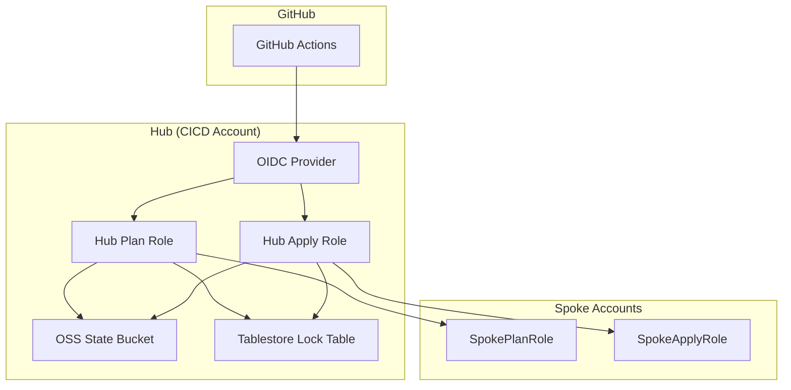
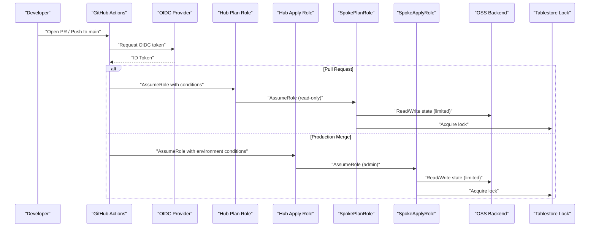
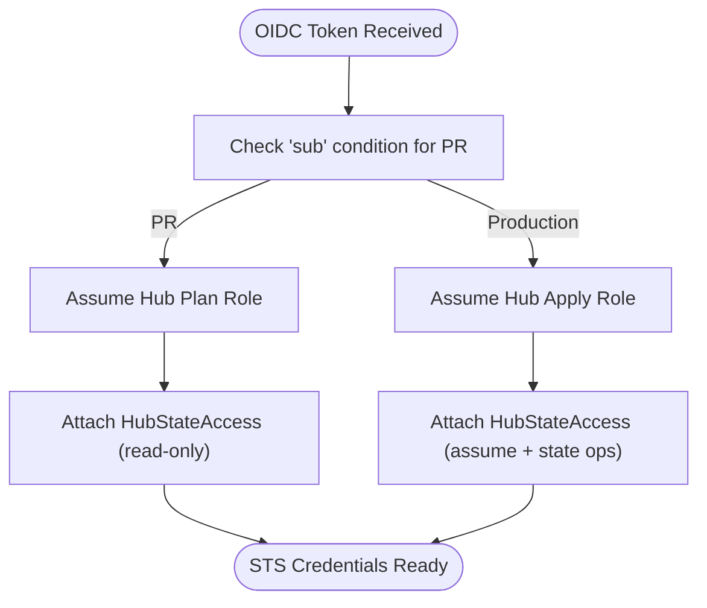
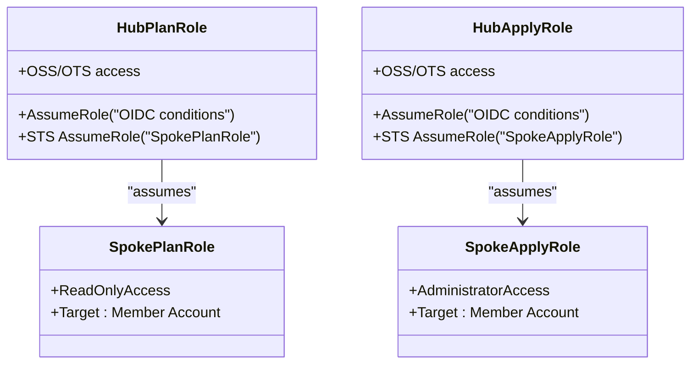
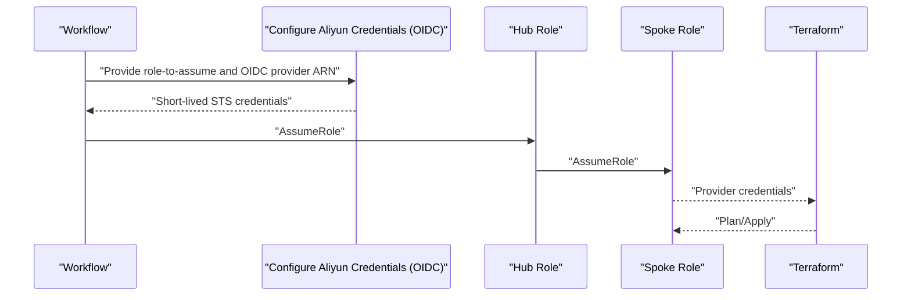
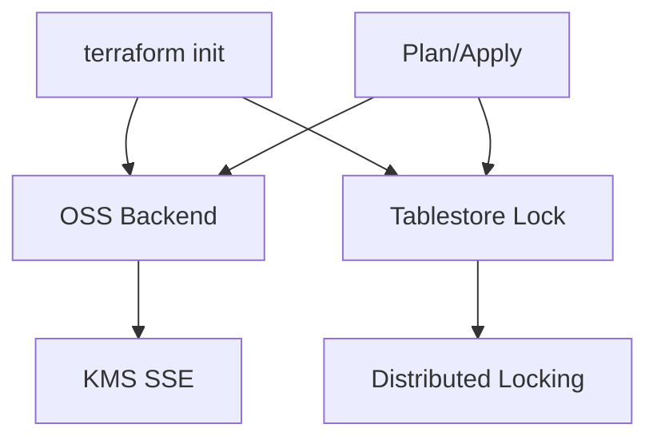
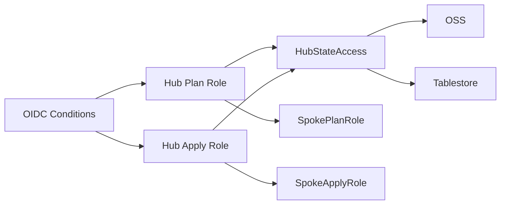
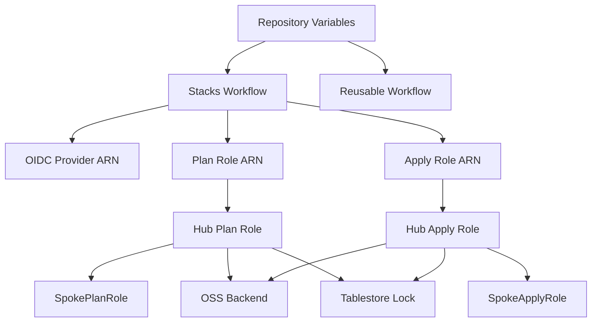

# Security Model

<cite>
**Referenced Files in This Document**
- [README.md](file://README.md)
- [.github/workflows/terraform-reusable.yml](file://.github/workflows/terraform-reusable.yml)
- [.github/workflows/stacks.yml](file://.github/workflows/stacks.yml)
- [.github/workflows/bootstrap-01-cicd-foundation.yml](file://.github/workflows/bootstrap-01-cicd-foundation.yml)
- [bootstrap/01-cicd-foundation/main.tf](file://bootstrap/01-cicd-foundation/main.tf)
- [bootstrap/01-cicd-foundation/backend.tf.example](file://bootstrap/01-cicd-foundation/backend.tf.example)
- [bootstrap/01-cicd-foundation/variables.tf](file://bootstrap/01-cicd-foundation/variables.tf)
- [bootstrap/02-spoke-bootstrap/main.tf](file://bootstrap/02-spoke-bootstrap/main.tf)
- [bootstrap/02-spoke-bootstrap/modules/spoke-roles/main.tf](file://bootstrap/02-spoke-bootstrap/modules/spoke-roles/main.tf)
- [bootstrap/02-spoke-bootstrap/variables.tf](file://bootstrap/02-spoke-bootstrap/variables.tf)
- [bootstrap/00-org-structure/main.tf](file://bootstrap/00-org-structure/main.tf)
- [stacks/20-network-cen/main.tf](file://stacks/20-network-cen/main.tf)
</cite>

## Table of Contents
1. [Introduction](#introduction)
2. [Project Structure](#project-structure)
3. [Core Components](#core-components)
4. [Architecture Overview](#architecture-overview)
5. [Detailed Component Analysis](#detailed-component-analysis)
6. [Dependency Analysis](#dependency-analysis)
7. [Performance Considerations](#performance-considerations)
8. [Troubleshooting Guide](#troubleshooting-guide)
9. [Conclusion](#conclusion)
10. [Appendices](#appendices)

## Introduction
This document explains the multi-layered security model that eliminates long-lived credentials and enforces least-privilege access control. It documents the OIDC token exchange mechanism, role separation between Plan and Apply operations, and account isolation through spoke roles. It also covers the credential flow from GitHub OIDC tokens through hub and spoke role assumptions to resource provisioning, along with IAM role design patterns, permission boundaries, encrypted state management with OSS backend and Tablestore distributed locking, threat modeling, compliance considerations, audit capabilities, and security monitoring and incident response guidance.

## Project Structure
The repository is organized into three bootstrap phases and multiple stacks:
- bootstrap/00-org-structure: Establishes Resource Directory and core member accounts.
- bootstrap/01-cicd-foundation: Provisions OIDC provider, hub Plan/Apply roles, OSS state bucket, and Tablestore lock table.
- bootstrap/02-spoke-bootstrap: Deploys spoke roles in each member account, trusting the hub roles.
- stacks: Implementation of landing zone components (identity, guardrails, networking, security), each targeting a specific spoke account.

**Diagram sources**
- [bootstrap/01-cicd-foundation/main.tf:49-105](file://bootstrap/01-cicd-foundation/main.tf#L49-L105)
- [bootstrap/02-spoke-bootstrap/modules/spoke-roles/main.tf:3-41](file://bootstrap/02-spoke-bootstrap/modules/spoke-roles/main.tf#L3-L41)
- [bootstrap/01-cicd-foundation/backend.tf.example:13-22](file://bootstrap/01-cicd-foundation/backend.tf.example#L13-L22)

**Section sources**
- [README.md:141-165](file://README.md#L141-L165)

## Core Components
- No long-lived credentials: GitHub OIDC tokens are exchanged for short-lived STS tokens at every workflow run.
- Least-privilege roles: Plan role is read-only; Apply role is restricted to the production environment with required reviewers.
- Account isolation: Each spoke account has its own IAM role; compromise of one role does not affect others.
- Encrypted state: Terraform state stored in OSS with server-side KMS encryption.
- State locking: Tablestore provides distributed locking to prevent concurrent applies.

**Section sources**
- [README.md:106-113](file://README.md#L106-L113)

## Architecture Overview
The security architecture relies on GitHub OIDC federation to assume hub roles in the CICD account, which then chain to spoke roles in member accounts for resource provisioning. State is stored securely in OSS with KMS encryption and locked via Tablestore.

**Diagram sources**
- [bootstrap/01-cicd-foundation/main.tf:61-105](file://bootstrap/01-cicd-foundation/main.tf#L61-L105)
- [bootstrap/02-spoke-bootstrap/modules/spoke-roles/main.tf:3-41](file://bootstrap/02-spoke-bootstrap/modules/spoke-roles/main.tf#L3-L41)
- [.github/workflows/stacks.yml:42-99](file://.github/workflows/stacks.yml#L42-L99)

## Detailed Component Analysis

### OIDC Provider and Hub Roles
- OIDC provider configured in the hub account with issuer and audience matching GitHub Actions.
- Hub Plan Role allows read-only operations during pull requests with conditions on repository and PR context.
- Hub Apply Role allows apply operations only under the production environment with environment-specific conditions.
- Both hub roles are granted permissions to access OSS/OTS and to assume spoke roles.

**Diagram sources**
- [bootstrap/01-cicd-foundation/main.tf:49-105](file://bootstrap/01-cicd-foundation/main.tf#L49-L105)
- [bootstrap/01-cicd-foundation/main.tf:112-149](file://bootstrap/01-cicd-foundation/main.tf#L112-L149)

**Section sources**
- [bootstrap/01-cicd-foundation/main.tf:49-105](file://bootstrap/01-cicd-foundation/main.tf#L49-L105)
- [bootstrap/01-cicd-foundation/main.tf:112-149](file://bootstrap/01-cicd-foundation/main.tf#L112-L149)
- [bootstrap/01-cicd-foundation/variables.tf:1-16](file://bootstrap/01-cicd-foundation/variables.tf#L1-L16)

### Spoke Roles and Account Isolation
- SpokePlanRole trusts the hub’s Plan role and is attached to ReadOnlyAccess.
- SpokeApplyRole trusts the hub’s Apply role and is attached to AdministratorAccess.
- Each spoke role is scoped to a single member account, ensuring isolation.

**Diagram sources**
- [bootstrap/02-spoke-bootstrap/modules/spoke-roles/main.tf:3-41](file://bootstrap/02-spoke-bootstrap/modules/spoke-roles/main.tf#L3-L41)

**Section sources**
- [bootstrap/02-spoke-bootstrap/modules/spoke-roles/main.tf:3-41](file://bootstrap/02-spoke-bootstrap/modules/spoke-roles/main.tf#L3-L41)
- [bootstrap/02-spoke-bootstrap/main.tf:1-33](file://bootstrap/02-spoke-bootstrap/main.tf#L1-L33)
- [bootstrap/02-spoke-bootstrap/variables.tf:12-25](file://bootstrap/02-spoke-bootstrap/variables.tf#L12-L25)

### Credential Flow and Least-Privilege Execution
- During PRs, the workflow assumes the Plan role ARN and executes plan-only operations against the SpokePlanRole.
- On production merges, the workflow assumes the Apply role ARN and executes apply against the SpokeApplyRole.
- Environment gating ensures apply requires production environment approval.

**Diagram sources**
- [.github/workflows/stacks.yml:42-99](file://.github/workflows/stacks.yml#L42-L99)
- [.github/workflows/terraform-reusable.yml:50-56](file://.github/workflows/terraform-reusable.yml#L50-L56)

**Section sources**
- [.github/workflows/stacks.yml:18-112](file://.github/workflows/stacks.yml#L18-L112)
- [.github/workflows/terraform-reusable.yml:33-37](file://.github/workflows/terraform-reusable.yml#L33-L37)

### Encrypted State Management (OSS + Tablestore Locking)
- OSS bucket enables versioning and KMS server-side encryption.
- Tablestore instance/table configured for distributed locking.
- Backend block references Tablestore endpoint and table for state locking.

**Diagram sources**
- [bootstrap/01-cicd-foundation/main.tf:5-43](file://bootstrap/01-cicd-foundation/main.tf#L5-L43)
- [bootstrap/01-cicd-foundation/backend.tf.example:13-22](file://bootstrap/01-cicd-foundation/backend.tf.example#L13-L22)

**Section sources**
- [bootstrap/01-cicd-foundation/main.tf:5-43](file://bootstrap/01-cicd-foundation/main.tf#L5-L43)
- [bootstrap/01-cicd-foundation/backend.tf.example:13-22](file://bootstrap/01-cicd-foundation/backend.tf.example#L13-L22)

### IAM Role Design Patterns and Permission Boundaries
- Hub roles use OIDC conditions to restrict usage by repository and environment.
- Spoke roles enforce account isolation and least privilege (read-only vs admin).
- HubStateAccess policy grants only necessary permissions to state infrastructure and spoke role assumption.

**Diagram sources**
- [bootstrap/01-cicd-foundation/main.tf:61-105](file://bootstrap/01-cicd-foundation/main.tf#L61-L105)
- [bootstrap/01-cicd-foundation/main.tf:112-149](file://bootstrap/01-cicd-foundation/main.tf#L112-L149)
- [bootstrap/02-spoke-bootstrap/modules/spoke-roles/main.tf:3-41](file://bootstrap/02-spoke-bootstrap/modules/spoke-roles/main.tf#L3-L41)

**Section sources**
- [bootstrap/01-cicd-foundation/main.tf:112-149](file://bootstrap/01-cicd-foundation/main.tf#L112-L149)
- [bootstrap/02-spoke-bootstrap/modules/spoke-roles/main.tf:3-41](file://bootstrap/02-spoke-bootstrap/modules/spoke-roles/main.tf#L3-L41)

### Organization Structure and Account Hygiene
- Enables Resource Directory and creates core member accounts for isolation.
- Supports day-2 operations like adding new spoke accounts and stacks.

**Section sources**
- [bootstrap/00-org-structure/main.tf:1-49](file://bootstrap/00-org-structure/main.tf#L1-L49)
- [README.md:114-129](file://README.md#L114-L129)

## Dependency Analysis
The system exhibits clear separation of concerns:
- Workflows depend on OIDC provider ARN and role ARNs from repository variables.
- Hub roles depend on OIDC provider conditions and state infrastructure.
- Spoke roles depend on hub role trust and are isolated per account.

**Diagram sources**
- [.github/workflows/stacks.yml:42-99](file://.github/workflows/stacks.yml#L42-L99)
- [.github/workflows/terraform-reusable.yml:15-27](file://.github/workflows/terraform-reusable.yml#L15-L27)
- [bootstrap/01-cicd-foundation/main.tf:49-105](file://bootstrap/01-cicd-foundation/main.tf#L49-L105)

**Section sources**
- [.github/workflows/stacks.yml:18-112](file://.github/workflows/stacks.yml#L18-L112)
- [.github/workflows/bootstrap-01-cicd-foundation.yml:18-36](file://.github/workflows/bootstrap-01-cicd-foundation.yml#L18-L36)

## Performance Considerations
- Session duration capped at one hour for all roles to minimize exposure windows.
- Plan jobs run concurrently across stacks; Apply jobs are serialized to avoid state contention.
- OSS versioning and lifecycle policies help manage state growth and retention.

[No sources needed since this section provides general guidance]

## Troubleshooting Guide
Common issues and remediation steps:
- OIDC token audience mismatch: Verify OIDC provider ARN and audience value in workflow configuration.
- Insufficient permissions: Confirm HubStateAccess policy is attached to hub roles and spoke roles have expected access.
- State locking failures: Ensure Tablestore instance and table exist and are reachable.
- Cross-account assumption errors: Validate trust relationships between hub and spoke roles and account IDs.

**Section sources**
- [bootstrap/01-cicd-foundation/main.tf:112-149](file://bootstrap/01-cicd-foundation/main.tf#L112-L149)
- [bootstrap/02-spoke-bootstrap/modules/spoke-roles/main.tf:3-41](file://bootstrap/02-spoke-bootstrap/modules/spoke-roles/main.tf#L3-L41)
- [bootstrap/01-cicd-foundation/backend.tf.example:13-22](file://bootstrap/01-cicd-foundation/backend.tf.example#L13-L22)

## Conclusion
This security model eliminates long-lived credentials, enforces least-privilege access, isolates accounts through spoke roles, and secures state with encryption and distributed locking. The OIDC-based token exchange and environment-gated apply operations provide strong operational and compliance controls.

[No sources needed since this section summarizes without analyzing specific files]

## Appendices

### Threat Modeling and Controls
- Compromised GitHub runner: Mitigated by short-lived STS tokens and strict OIDC conditions.
- Compromised hub role: Limited by least-privilege policies and environment gating.
- State theft: Protected by OSS KMS encryption and Tablestore locking.
- Cross-account lateral movement: Prevented by per-account spoke roles and explicit trust boundaries.

[No sources needed since this section provides general guidance]

### Compliance Considerations
- Principle of least privilege enforced via read-only Plan role and admin SpokeApplyRole.
- Audit-ready state locking and immutable state via OSS versioning.
- Environment-based approvals align with change control requirements.

[No sources needed since this section provides general guidance]

### Audit Capabilities
- Track OIDC assume events and role usage via cloud audit logs.
- Monitor Terraform plan artifacts and PR comments for visibility.
- Use Tablestore and OSS access logs for state access auditing.

[No sources needed since this section provides general guidance]

### Security Monitoring and Incident Response
- Monitor for anomalous OIDC assume patterns and unexpected apply operations.
- Alert on repeated failed assume-role attempts and unauthorized state modifications.
- Incident response: Revoke compromised hub role, rotate OIDC provider, and review spoke role trust policies.

[No sources needed since this section provides general guidance]