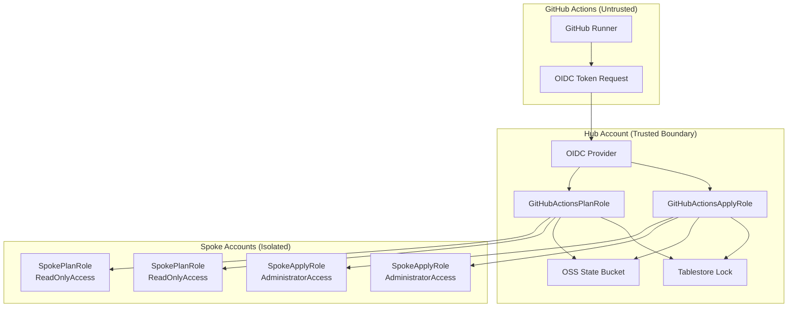
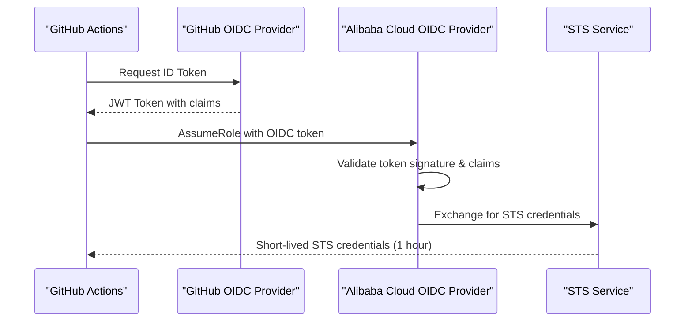
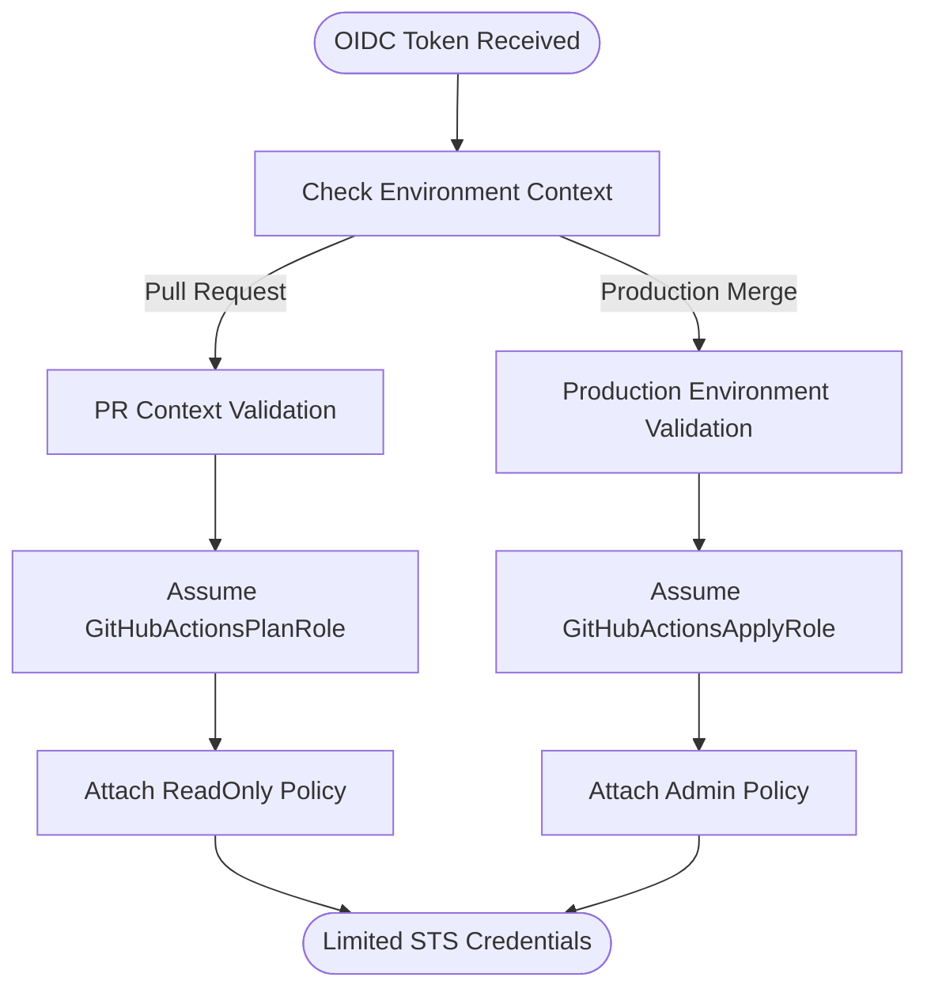
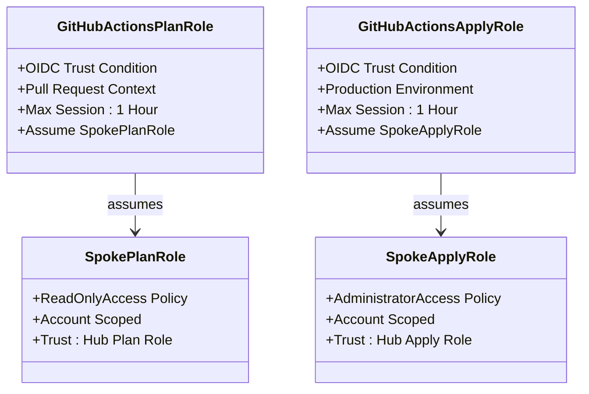
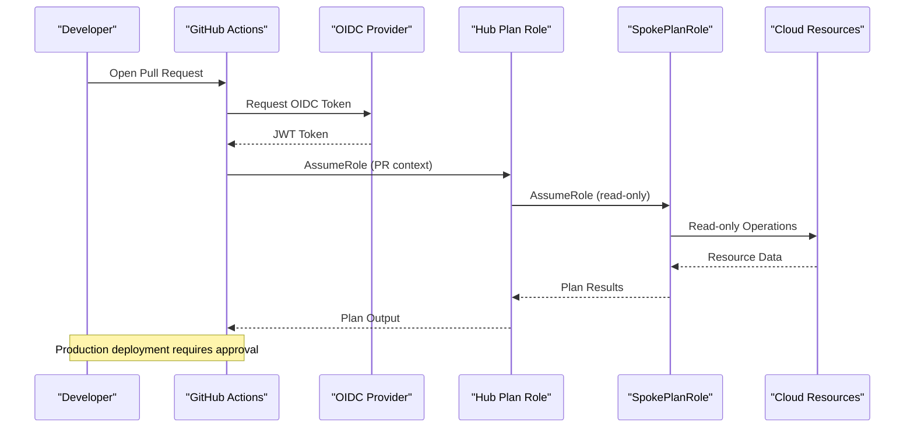
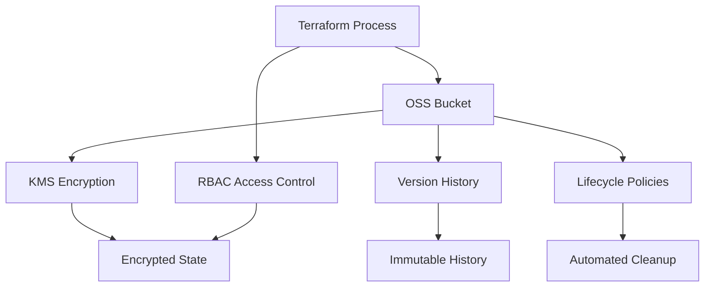
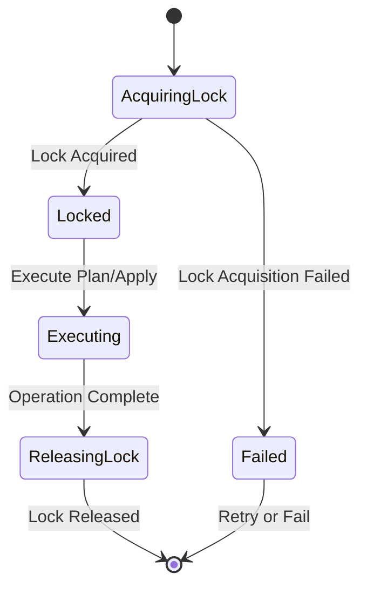

# Security Model

<cite>
**Referenced Files in This Document**
- [README.md](file://README.md)
- [.github/workflows/terraform-reusable.yml](file://.github/workflows/terraform-reusable.yml)
- [.github/workflows/stacks.yml](file://.github/workflows/stacks.yml)
- [.github/workflows/bootstrap-01-cicd-foundation.yml](file://.github/workflows/bootstrap-01-cicd-foundation.yml)
- [bootstrap/01-cicd-foundation/main.tf](file://bootstrap/01-cicd-foundation/main.tf)
- [bootstrap/01-cicd-foundation/backend.tf.example](file://bootstrap/01-cicd-foundation/backend.tf.example)
- [bootstrap/01-cicd-foundation/variables.tf](file://bootstrap/01-cicd-foundation/variables.tf)
- [bootstrap/02-spoke-bootstrap/main.tf](file://bootstrap/02-spoke-bootstrap/main.tf)
- [bootstrap/02-spoke-bootstrap/modules/spoke-roles/main.tf](file://bootstrap/02-spoke-bootstrap/modules/spoke-roles/main.tf)
- [bootstrap/02-spoke-bootstrap/variables.tf](file://bootstrap/02-spoke-bootstrap/variables.tf)
- [bootstrap/00-org-structure/main.tf](file://bootstrap/00-org-structure/main.tf)
- [stacks/20-network-cen/main.tf](file://stacks/20-network-cen/main.tf)
</cite>

## Update Summary
**Changes Made**
- Enhanced OIDC federation implementation details with specific token exchange mechanisms
- Updated hub role configuration with environment-based restrictions and GitHub Actions conditions
- Expanded spoke role architecture with explicit trust relationships and least-privilege principles
- Detailed encrypted state management with OSS versioning and Tablestore distributed locking
- Added comprehensive threat modeling and security controls analysis
- Enhanced compliance considerations and audit capabilities documentation

## Table of Contents
1. [Introduction](#introduction)
2. [Zero-Trust Architecture Overview](#zero-trust-architecture-overview)
3. [OIDC Federation Implementation](#oidc-federation-implementation)
4. [Hub Account Security Model](#hub-account-security-model)
5. [Spoke Account Isolation](#spoke-account-isolation)
6. [Credential Flow and Token Exchange](#credential-flow-and-token-exchange)
7. [Encrypted State Management](#encrypted-state-management)
8. [Distributed Locking and Concurrency Control](#distributed-locking-and-concurrency-control)
9. [IAM Role Design Patterns](#iam-role-design-patterns)
10. [Security Controls and Threat Mitigation](#security-controls-and-threat-mitigation)
11. [Compliance and Audit Capabilities](#compliance-and-audit-capabilities)
12. [Security Monitoring and Incident Response](#security-monitoring-and-incident-response)
13. [Performance Considerations](#performance-considerations)
14. [Troubleshooting Guide](#troubleshooting-guide)
15. [Conclusion](#conclusion)

## Introduction
This document explains the sophisticated zero-trust security architecture that eliminates long-lived credentials through OIDC federation, implements least-privilege access control, and provides comprehensive account isolation. The system uses GitHub OIDC tokens exchanged for short-lived STS tokens at every workflow run, with hub roles containing Plan and Apply operations with environment-based restrictions, and spoke accounts having corresponding SpokePlanRole and SpokeApplyRole trusting hub roles. The architecture includes encrypted OSS buckets with versioning enabled and Tablestore instances for distributed locking ensuring concurrent access safety.

## Zero-Trust Architecture Overview
The security architecture follows zero-trust principles where no component is trusted by default. Every request must be authenticated, authorized, and encrypted. The system implements multiple layers of security controls including OIDC federation, role-based access control, environment gating, and encrypted state management.

**Diagram sources**
- [bootstrap/01-cicd-foundation/main.tf:46-101](file://bootstrap/01-cicd-foundation/main.tf#L46-L101)
- [bootstrap/02-spoke-bootstrap/modules/spoke-roles/main.tf:3-41](file://bootstrap/02-spoke-bootstrap/modules/spoke-roles/main.tf#L3-L41)

## OIDC Federation Implementation
The system implements robust OIDC federation between GitHub Actions and Alibaba Cloud RAM. GitHub Actions requests an OIDC token from GitHub's OIDC provider, which is then exchanged for short-lived STS credentials through the configured OIDC provider in the hub account.

### OIDC Provider Configuration
The OIDC provider is configured with strict issuer validation, audience matching, and fingerprint verification to prevent token forgery attacks.

**Diagram sources**
- [bootstrap/01-cicd-foundation/main.tf:46-53](file://bootstrap/01-cicd-foundation/main.tf#L46-L53)
- [.github/workflows/terraform-reusable.yml:50-56](file://.github/workflows/terraform-reusable.yml#L50-L56)

**Section sources**
- [bootstrap/01-cicd-foundation/main.tf:46-53](file://bootstrap/01-cicd-foundation/main.tf#L46-L53)
- [.github/workflows/terraform-reusable.yml:50-56](file://.github/workflows/terraform-reusable.yml#L50-L56)

## Hub Account Security Model
The hub account serves as the central trust boundary containing the OIDC provider and two specialized roles: GitHubActionsPlanRole for read-only operations and GitHubActionsApplyRole for production deployments.

### Environment-Based Role Restrictions
The hub roles implement strict environment-based access control using GitHub Actions environment protection rules and OIDC token claims validation.

**Diagram sources**
- [bootstrap/01-cicd-foundation/main.tf:59-101](file://bootstrap/01-cicd-foundation/main.tf#L59-L101)
- [.github/workflows/stacks.yml:42-99](file://.github/workflows/stacks.yml#L42-L99)

### Hub Role Policies
Both hub roles are granted minimal permissions necessary for their intended functions, including access to state infrastructure and the ability to assume spoke roles.

**Section sources**
- [bootstrap/01-cicd-foundation/main.tf:59-101](file://bootstrap/01-cicd-foundation/main.tf#L59-L101)
- [bootstrap/01-cicd-foundation/main.tf:108-142](file://bootstrap/01-cicd-foundation/main.tf#L108-L142)

## Spoke Account Isolation
Each spoke account maintains complete isolation through dedicated IAM roles that trust only the corresponding hub roles. This ensures that compromise of one account cannot affect others.

### Spoke Role Architecture
The spoke roles follow a clear separation of concerns with read-only access for planning and administrative access for applying changes.

**Diagram sources**
- [bootstrap/02-spoke-bootstrap/modules/spoke-roles/main.tf:3-41](file://bootstrap/02-spoke-bootstrap/modules/spoke-roles/main.tf#L3-L41)

**Section sources**
- [bootstrap/02-spoke-bootstrap/modules/spoke-roles/main.tf:3-41](file://bootstrap/02-spoke-bootstrap/modules/spoke-roles/main.tf#L3-L41)
- [bootstrap/02-spoke-bootstrap/main.tf:1-33](file://bootstrap/02-spoke-bootstrap/main.tf#L1-L33)

## Credential Flow and Token Exchange
The credential flow implements a multi-hop assumption pattern where GitHub Actions first assumes a hub role, which then assumes a spoke role in the target account. This creates clear audit trails and enforces least privilege at each hop.

### Complete Authentication Chain
The authentication chain ensures that every API call is made with the minimum required privileges and can be traced back to the original GitHub Actions run.

**Diagram sources**
- [.github/workflows/stacks.yml:42-99](file://.github/workflows/stacks.yml#L42-L99)
- [.github/workflows/terraform-reusable.yml:50-56](file://.github/workflows/terraform-reusable.yml#L50-L56)

**Section sources**
- [.github/workflows/stacks.yml:42-99](file://.github/workflows/stacks.yml#L42-L99)
- [.github/workflows/terraform-reusable.yml:50-56](file://.github/workflows/terraform-reusable.yml#L50-L56)

## Encrypted State Management
Terraform state is stored securely in OSS buckets with server-side encryption using KMS keys. The state backend includes versioning for audit trails and lifecycle policies for automated cleanup.

### State Storage Architecture
The state storage implements defense-in-depth with encryption at rest, versioning for immutability, and access controls limiting who can modify state files.

**Diagram sources**
- [bootstrap/01-cicd-foundation/main.tf:5-24](file://bootstrap/01-cicd-foundation/main.tf#L5-L24)
- [bootstrap/01-cicd-foundation/backend.tf.example:13-22](file://bootstrap/01-cicd-foundation/backend.tf.example#L13-L22)

**Section sources**
- [bootstrap/01-cicd-foundation/main.tf:5-24](file://bootstrap/01-cicd-foundation/main.tf#L5-L24)
- [bootstrap/01-cicd-foundation/backend.tf.example:13-22](file://bootstrap/01-cicd-foundation/backend.tf.example#L13-L22)

## Distributed Locking and Concurrency Control
Tablestore provides distributed locking to prevent concurrent modifications to Terraform state, ensuring data consistency across multiple runners and environments.

### Lock Mechanism
The locking mechanism uses Tablestore's atomic operations to ensure that only one process can modify state at any given time, preventing race conditions and state corruption.

**Diagram sources**
- [bootstrap/01-cicd-foundation/main.tf:26-40](file://bootstrap/01-cicd-foundation/main.tf#L26-L40)
- [bootstrap/01-cicd-foundation/backend.tf.example:19-21](file://bootstrap/01-cicd-foundation/backend.tf.example#L19-L21)

**Section sources**
- [bootstrap/01-cicd-foundation/main.tf:26-40](file://bootstrap/01-cicd-foundation/main.tf#L26-L40)
- [bootstrap/01-cicd-foundation/backend.tf.example:19-21](file://bootstrap/01-cicd-foundation/backend.tf.example#L19-L21)

## IAM Role Design Patterns
The IAM design follows several key patterns including role separation, least privilege, explicit trust boundaries, and scoped permissions.

### Role Separation Pattern
Separate roles for different operations (plan vs apply) enforce operational segregation and reduce blast radius of potential compromises.

### Least Privilege Enforcement
Each role is granted only the minimum permissions necessary for its intended function, with explicit resource scoping where possible.

### Trust Boundary Enforcement
Roles explicitly define their trust relationships, ensuring that only authorized entities can assume them.

**Section sources**
- [bootstrap/01-cicd-foundation/main.tf:59-142](file://bootstrap/01-cicd-foundation/main.tf#L59-L142)
- [bootstrap/02-spoke-bootstrap/modules/spoke-roles/main.tf:3-41](file://bootstrap/02-spoke-bootstrap/modules/spoke-roles/main.tf#L3-L41)

## Security Controls and Threat Mitigation
The architecture implements comprehensive security controls to mitigate various attack vectors and threats.

### Attack Vector Mitigations
- **Compromised GitHub Runner**: Mitigated by short-lived STS tokens and strict OIDC conditions
- **Token Forgery**: Prevented by OIDC provider fingerprint validation and issuer verification
- **Privilege Escalation**: Blocked by role separation and least privilege policies
- **State Tampering**: Protected by KMS encryption and immutable versioning
- **Cross-Account Lateral Movement**: Prevented by explicit trust boundaries and account isolation

### Defense in Depth Layers
1. **Network Layer**: GitHub Actions runs in isolated containers
2. **Identity Layer**: OIDC federation with strict token validation
3. **Authorization Layer**: Role-based access with environment gating
4. **Data Layer**: Encrypted state with versioning and locking
5. **Audit Layer**: Comprehensive logging and monitoring

## Compliance and Audit Capabilities
The system provides comprehensive audit capabilities and supports various compliance frameworks through detailed logging and immutable audit trails.

### Audit Trail Components
- **OIDC Token Usage**: Track all OIDC token exchanges and role assumptions
- **State Access Logs**: Monitor all reads and writes to Terraform state
- **Resource Changes**: Log all infrastructure modifications with full context
- **Approval Workflows**: Record environment approvals and manual interventions

### Compliance Framework Support
- **SOC 2**: Provides access controls, encryption, and audit logging
- **ISO 27001**: Supports information security management requirements
- **PCI DSS**: Enables secure development and deployment practices
- **GDPR**: Supports data protection through encryption and access controls

## Security Monitoring and Incident Response
Proactive monitoring and defined incident response procedures ensure rapid detection and remediation of security incidents.

### Monitoring Strategy
- **Anomalous Activity Detection**: Monitor for unusual OIDC usage patterns
- **Failed Authentication Alerts**: Alert on repeated failed assume-role attempts
- **State Modification Tracking**: Monitor unauthorized state changes
- **Permission Escalation Detection**: Alert on unexpected permission changes

### Incident Response Procedures
1. **Immediate Containment**: Revoke compromised roles and tokens
2. **Forensic Analysis**: Review audit logs and identify scope of compromise
3. **Remediation**: Rotate credentials and update trust policies
4. **Post-Incident Review**: Analyze root cause and implement preventive measures

## Performance Considerations
The security architecture is designed to minimize performance impact while maintaining strong security guarantees.

### Optimization Strategies
- **Session Duration**: 1-hour maximum session duration balances security and performance
- **Concurrent Planning**: Parallel plan execution across stacks with proper locking
- **State Caching**: Efficient state access patterns reduce API calls
- **Resource Provisioning**: Optimized resource creation order minimizes dependencies

## Troubleshooting Guide
Common issues and their resolution strategies for the security architecture.

### Common Issues
- **OIDC Token Validation Failures**: Verify OIDC provider configuration and token claims
- **Permission Denied Errors**: Check role trust policies and attached permissions
- **State Locking Conflicts**: Ensure proper lock acquisition and release
- **Cross-Account Assumption Errors**: Validate account IDs and role ARNs

### Diagnostic Tools
- **RAM Authorization Simulator**: Test role permissions before deployment
- **ActionTrail Logs**: Analyze API call history and authorization decisions
- **CloudMonitor Metrics**: Monitor service health and performance
- **Debug Logging**: Enable detailed logging for troubleshooting

**Section sources**
- [bootstrap/01-cicd-foundation/main.tf:46-142](file://bootstrap/01-cicd-foundation/main.tf#L46-L142)
- [bootstrap/02-spoke-bootstrap/modules/spoke-roles/main.tf:3-41](file://bootstrap/02-spoke-bootstrap/modules/spoke-roles/main.tf#L3-L41)

## Conclusion
This sophisticated zero-trust security architecture successfully eliminates long-lived credentials through OIDC federation, implements comprehensive least-privilege access control, and provides robust account isolation. The combination of environment-based role restrictions, encrypted state management, and distributed locking creates a secure foundation for infrastructure automation. The architecture supports compliance requirements, provides extensive audit capabilities, and includes comprehensive monitoring and incident response procedures.