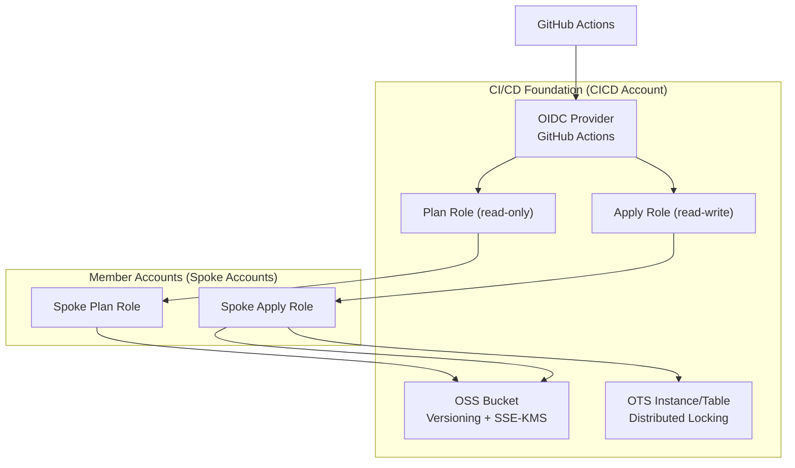
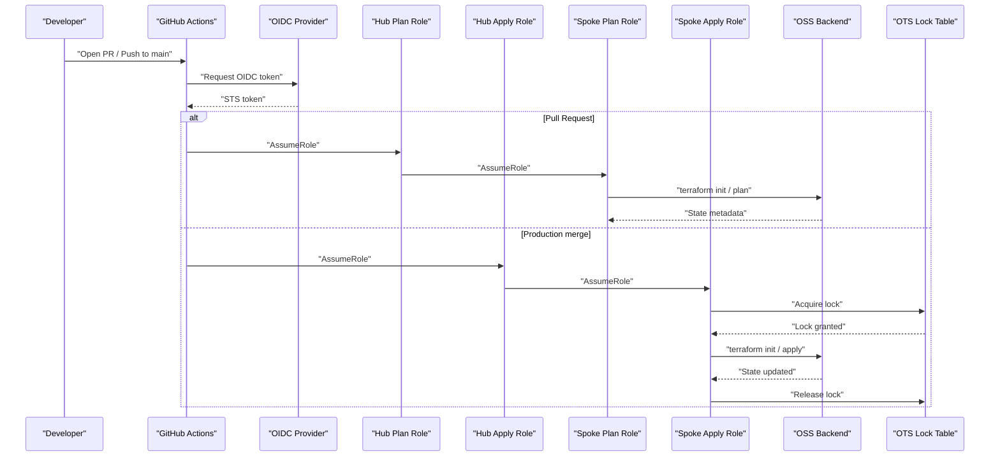
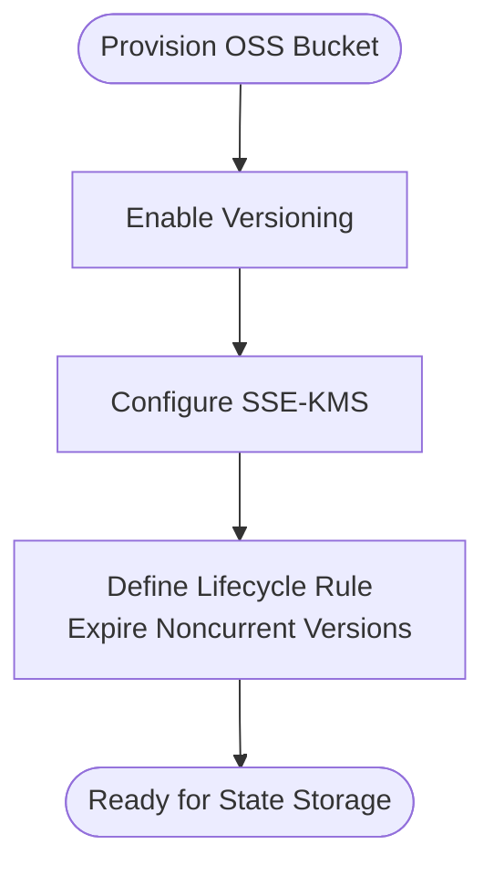
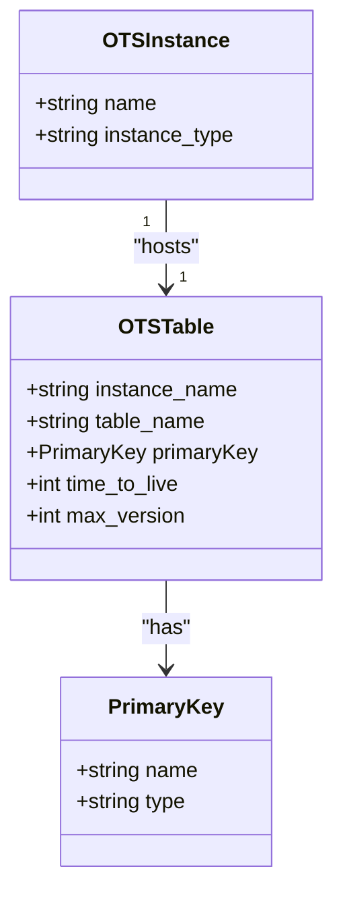
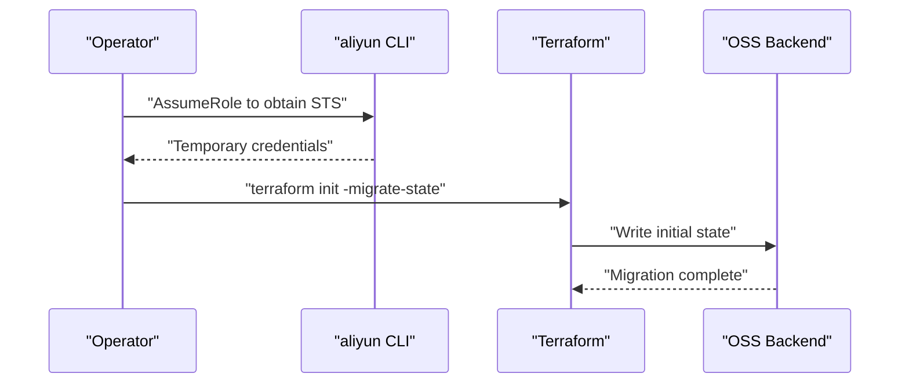
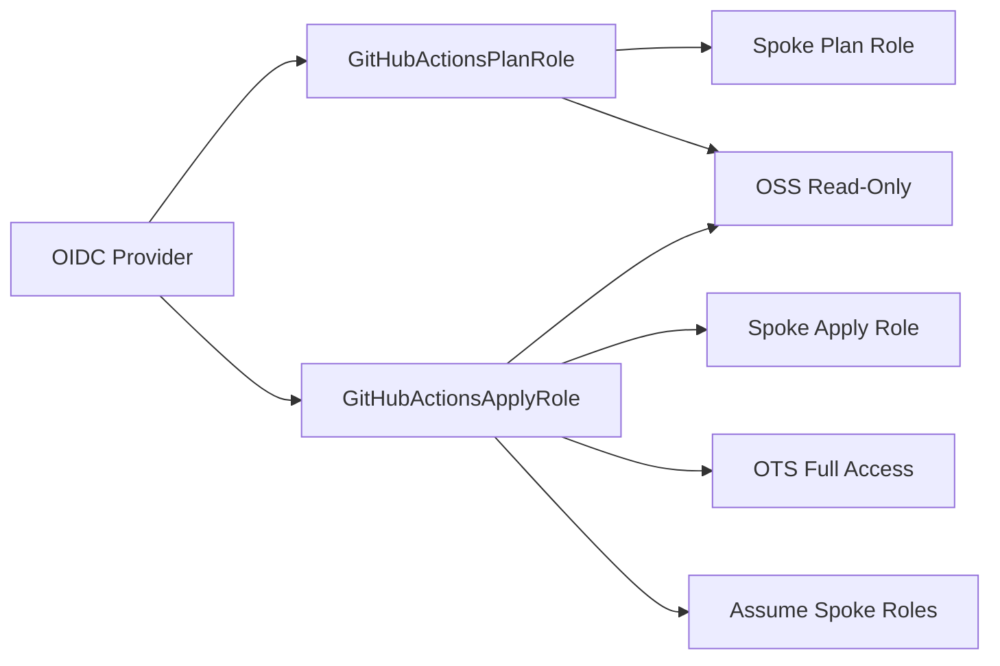
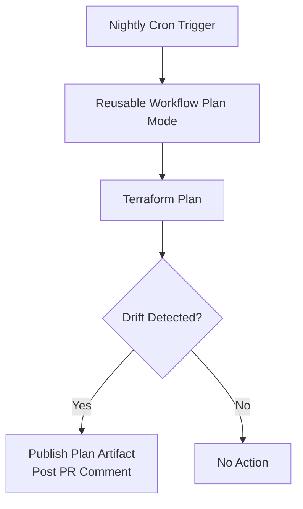
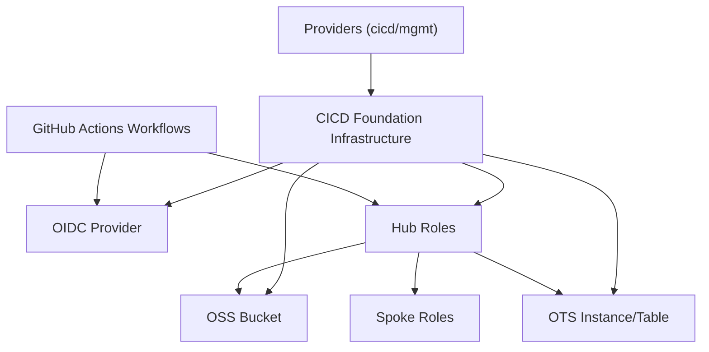

# State Security

<cite>
**Referenced Files in This Document**
- [README.md](file://README.md)
- [backend.tf.example](file://bootstrap/01-cicd-foundation/backend.tf.example)
- [main.tf](file://bootstrap/01-cicd-foundation/main.tf)
- [outputs.tf](file://bootstrap/01-cicd-foundation/outputs.tf)
- [providers.tf](file://bootstrap/01-cicd-foundation/providers.tf)
- [variables.tf](file://bootstrap/01-cicd-foundation/variables.tf)
- [main.tf](file://bootstrap/02-spoke-bootstrap/main.tf)
- [variables.tf](file://bootstrap/02-spoke-bootstrap/variables.tf)
- [main.tf](file://bootstrap/02-spoke-bootstrap/modules/spoke-roles/main.tf)
- [variables.tf](file://bootstrap/02-spoke-bootstrap/modules/spoke-roles/variables.tf)
- [terraform-reusable.yml](file://.github/workflows/terraform-reusable.yml)
- [bootstrap-01-cicd-foundation.yml](file://.github/workflows/bootstrap-01-cicd-foundation.yml)
- [main.tf](file://stacks/30-security-kms/main.tf)
</cite>

## Table of Contents
1. [Introduction](#introduction)
2. [Project Structure](#project-structure)
3. [Core Components](#core-components)
4. [Architecture Overview](#architecture-overview)
5. [Detailed Component Analysis](#detailed-component-analysis)
6. [Dependency Analysis](#dependency-analysis)
7. [Performance Considerations](#performance-considerations)
8. [Troubleshooting Guide](#troubleshooting-guide)
9. [Conclusion](#conclusion)
10. [Appendices](#appendices)

## Introduction
This document explains the encrypted state management architecture using Alibaba Cloud OSS as the backend with Tablestore (OTS) for distributed locking. It covers the state infrastructure setup (versioning, server-side encryption with KMS, lifecycle policies), distributed locking mechanics, backend configuration, state migration procedures, and security controls. It also addresses integrity verification, drift detection, and secure state sharing patterns.

## Project Structure
The repository organizes state infrastructure provisioning in the CICD foundation phase and operational workflows in GitHub Actions. The key elements are:
- State infrastructure: OSS bucket with versioning and SSE-KMS, OTS instance/table for locking
- OIDC provider and hub roles for GitHub Actions
- Spoke roles in member accounts for least-privilege access
- Reusable workflow orchestrating plan/apply with OIDC-based credentials

**Diagram sources**
- [main.tf](file://bootstrap/01-cicd-foundation/main.tf)
- [outputs.tf](file://bootstrap/01-cicd-foundation/outputs.tf)
- [providers.tf](file://bootstrap/01-cicd-foundation/providers.tf)
- [main.tf](file://bootstrap/02-spoke-bootstrap/modules/spoke-roles/main.tf)
- [terraform-reusable.yml](file://.github/workflows/terraform-reusable.yml)

**Section sources**
- [README.md](file://README.md)
- [main.tf](file://bootstrap/01-cicd-foundation/main.tf)
- [outputs.tf](file://bootstrap/01-cicd-foundation/outputs.tf)
- [providers.tf](file://bootstrap/01-cicd-foundation/providers.tf)
- [variables.tf](file://bootstrap/01-cicd-foundation/variables.tf)
- [main.tf](file://bootstrap/02-spoke-bootstrap/main.tf)
- [variables.tf](file://bootstrap/02-spoke-bootstrap/variables.tf)
- [main.tf](file://bootstrap/02-spoke-bootstrap/modules/spoke-roles/main.tf)
- [variables.tf](file://bootstrap/02-spoke-bootstrap/modules/spoke-roles/variables.tf)
- [terraform-reusable.yml](file://.github/workflows/terraform-reusable.yml)
- [bootstrap-01-cicd-foundation.yml](file://.github/workflows/bootstrap-01-cicd-foundation.yml)

## Core Components
- Encrypted state storage on OSS:
  - Versioning enabled to preserve historical state
  - Server-side encryption with KMS
  - Lifecycle rule to expire noncurrent object versions after a retention period
- Distributed locking via OTS:
  - OTS instance configured as Capacity
  - Dedicated table with a string primary key and single-version TTL
- Backend configuration:
  - OSS backend block specifying bucket, prefix, key, region, OTS endpoint, and table
- Security model:
  - OIDC provider for GitHub Actions
  - Hub roles with scoped permissions for state access and assume-role on spokes
  - Spoke roles with least-privilege policies attached

**Section sources**
- [main.tf](file://bootstrap/01-cicd-foundation/main.tf)
- [backend.tf.example](file://bootstrap/01-cicd-foundation/backend.tf.example)
- [outputs.tf](file://bootstrap/01-cicd-foundation/outputs.tf)
- [variables.tf](file://bootstrap/01-cicd-foundation/variables.tf)

## Architecture Overview
The state backend architecture combines secure object storage with distributed locking to prevent concurrent modifications. The CI/CD workflow authenticates via OIDC, assumes hub roles, and optionally chains into spoke accounts to provision resources while ensuring exclusive state access.

**Diagram sources**
- [terraform-reusable.yml](file://.github/workflows/terraform-reusable.yml)
- [bootstrap-01-cicd-foundation.yml](file://.github/workflows/bootstrap-01-cicd-foundation.yml)
- [main.tf](file://bootstrap/01-cicd-foundation/main.tf)
- [outputs.tf](file://bootstrap/01-cicd-foundation/outputs.tf)
- [main.tf](file://bootstrap/02-spoke-bootstrap/modules/spoke-roles/main.tf)

## Detailed Component Analysis

### OSS State Infrastructure
- Bucket configuration:
  - Versioning enabled to maintain immutable state history
  - SSE-KMS enforced for server-side encryption
  - Lifecycle rule to expire noncurrent object versions after a defined number of days
- Purpose:
  - Provides durable, encrypted storage for Terraform state
  - Supports safe migration and rollback via versioning

**Diagram sources**
- [main.tf](file://bootstrap/01-cicd-foundation/main.tf)

**Section sources**
- [main.tf](file://bootstrap/01-cicd-foundation/main.tf)

### OTS Distributed Locking
- OTS instance and table:
  - Instance type set to Capacity
  - Table with a string primary key and TTL set to infinite (-1)
  - Max version constrained to 1 for deterministic lock records
- Behavior:
  - Ensures mutual exclusion during apply operations
  - Prevents concurrent writes to the same state key

**Diagram sources**
- [main.tf](file://bootstrap/01-cicd-foundation/main.tf)

**Section sources**
- [main.tf](file://bootstrap/01-cicd-foundation/main.tf)

### Backend Configuration and State Migration
- Backend block:
  - Specifies OSS bucket, prefix, key, region
  - Configures OTS endpoint and table for distributed locking
- Migration procedure:
  - Obtain STS credentials for the CICD account
  - Initialize with OSS backend and migrate local state

**Diagram sources**
- [backend.tf.example](file://bootstrap/01-cicd-foundation/backend.tf.example)

**Section sources**
- [backend.tf.example](file://bootstrap/01-cicd-foundation/backend.tf.example)

### Security Controls and Access Policies
- OIDC provider:
  - GitHub Actions OIDC issuer configured with audience and conditions
- Hub roles:
  - Plan role for read-only operations on pull requests
  - Apply role for production merges with restricted environment
- Hub state access policy:
  - Permissions scoped to OSS bucket and OTS operations
  - Allow assume-role on spoke roles
- Spoke roles:
  - Plan role with read-only access
  - Apply role with administrator access (scope down per spoke as appropriate)

**Diagram sources**
- [main.tf](file://bootstrap/01-cicd-foundation/main.tf)
- [main.tf](file://bootstrap/02-spoke-bootstrap/modules/spoke-roles/main.tf)

**Section sources**
- [main.tf](file://bootstrap/01-cicd-foundation/main.tf)
- [outputs.tf](file://bootstrap/01-cicd-foundation/outputs.tf)
- [main.tf](file://bootstrap/02-spoke-bootstrap/modules/spoke-roles/main.tf)

### Drift Detection and Integrity Verification
- Drift detection:
  - Schedule periodic plan-only runs to surface configuration drift
- Integrity verification:
  - Use plan artifacts and PR comments for review
  - Combine with scheduled checks to catch unauthorized changes

**Diagram sources**
- [.github/workflows/terraform-reusable.yml](file://.github/workflows/terraform-reusable.yml)
- [README.md](file://README.md)

**Section sources**
- [README.md](file://README.md)
- [.github/workflows/terraform-reusable.yml](file://.github/workflows/terraform-reusable.yml)

### Secure State Sharing Patterns
- Cross-account state access:
  - Hub roles assume spoke roles to operate in member accounts
  - Least privilege enforced via separate plan/apply roles
- Environment gating:
  - Apply jobs run only in protected environments with required reviewers

**Section sources**
- [main.tf](file://bootstrap/02-spoke-bootstrap/modules/spoke-roles/main.tf)
- [terraform-reusable.yml](file://.github/workflows/terraform-reusable.yml)

## Dependency Analysis
The state security relies on coordinated components across providers, roles, and backend configuration.

**Diagram sources**
- [providers.tf](file://bootstrap/01-cicd-foundation/providers.tf)
- [main.tf](file://bootstrap/01-cicd-foundation/main.tf)
- [main.tf](file://bootstrap/02-spoke-bootstrap/main.tf)
- [terraform-reusable.yml](file://.github/workflows/terraform-reusable.yml)

**Section sources**
- [providers.tf](file://bootstrap/01-cicd-foundation/providers.tf)
- [main.tf](file://bootstrap/01-cicd-foundation/main.tf)
- [main.tf](file://bootstrap/02-spoke-bootstrap/main.tf)
- [variables.tf](file://bootstrap/02-spoke-bootstrap/variables.tf)
- [terraform-reusable.yml](file://.github/workflows/terraform-reusable.yml)

## Performance Considerations
- OTS capacity sizing:
  - Evaluate expected lock contention; adjust instance type accordingly
- OSS lifecycle costs:
  - Noncurrent version expiration reduces storage costs over time
- Workflow concurrency:
  - Limit simultaneous apply operations to reduce OTS contention

## Troubleshooting Guide
- OIDC authentication failures:
  - Verify provider ARN, audience, and conditions match repository configuration
- Lock acquisition timeouts:
  - Confirm OTS table exists and permissions allow OTS operations
- State migration errors:
  - Ensure STS credentials are valid and backend block matches bucket naming and region
- Drift detection:
  - Review plan artifacts posted in PRs; investigate differences promptly

**Section sources**
- [outputs.tf](file://bootstrap/01-cicd-foundation/outputs.tf)
- [backend.tf.example](file://bootstrap/01-cicd-foundation/backend.tf.example)
- [terraform-reusable.yml](file://.github/workflows/terraform-reusable.yml)

## Conclusion
This repository demonstrates a robust, secure state management setup on Alibaba Cloud using OSS with KMS encryption and OTS-based distributed locking. Combined with OIDC-based identity, least-privilege roles, and automated drift detection, it provides a strong foundation for CI/CD operations across multiple accounts.

## Appendices

### Appendix A: Encryption Key Management
- Current state:
  - OSS SSE-KMS is enabled in the state infrastructure
  - KMS key configuration is marked as pending in the KMS stack
- Recommendations:
  - Define and scope KMS keys for state encryption
  - Enforce key rotation and audit logging
  - Scope key usage to the state bucket resource

**Section sources**
- [main.tf](file://bootstrap/01-cicd-foundation/main.tf)
- [main.tf](file://stacks/30-security-kms/main.tf)

### Appendix B: Access Control Policies for State Objects
- Hub state access policy:
  - Explicitly grants OSS read/write/delete/list/get bucket actions on the state bucket
  - Grants OTS operations across resources
  - Allows assume-role on spoke plan/apply roles
- Spoke roles:
  - Plan role attached to read-only access
  - Apply role attached to administrator access

**Section sources**
- [main.tf](file://bootstrap/01-cicd-foundation/main.tf)
- [main.tf](file://bootstrap/02-spoke-bootstrap/modules/spoke-roles/main.tf)

### Appendix C: Backup and Recovery Procedures
- Versioning-based recovery:
  - Use OSS versioning to restore previous state versions
- Lock table preservation:
  - Maintain OTS table for continued lock availability
- DR considerations:
  - Replicate state bucket across regions if required
  - Automate key rotation and cross-region replication with appropriate IAM and KMS policies

**Section sources**
- [main.tf](file://bootstrap/01-cicd-foundation/main.tf)