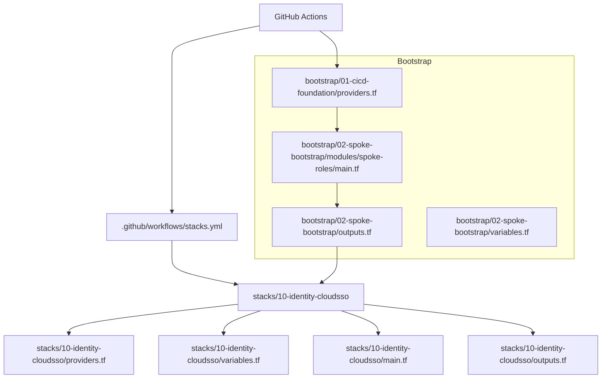
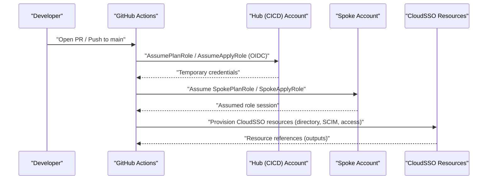
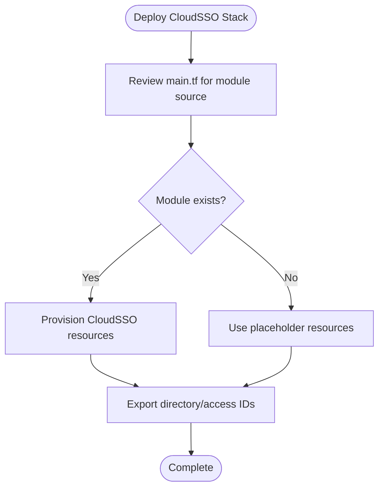
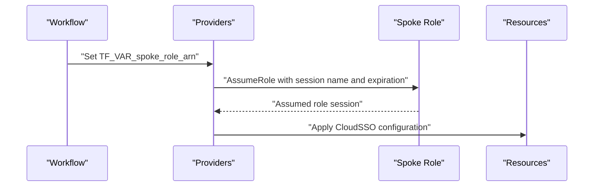
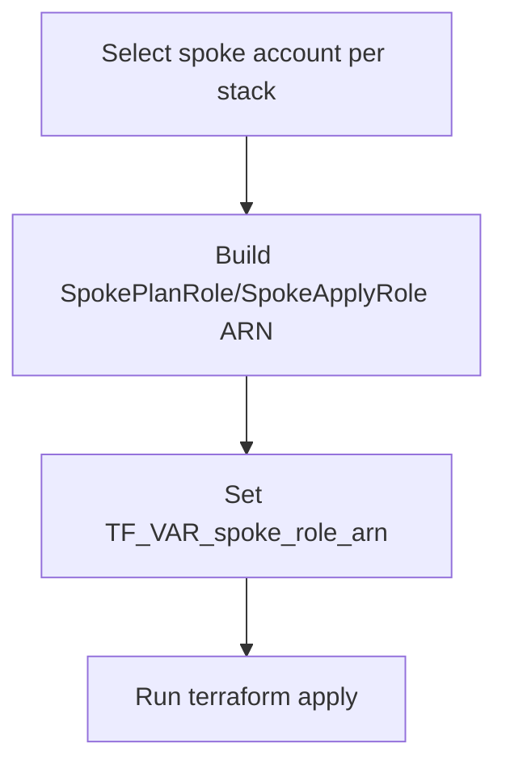
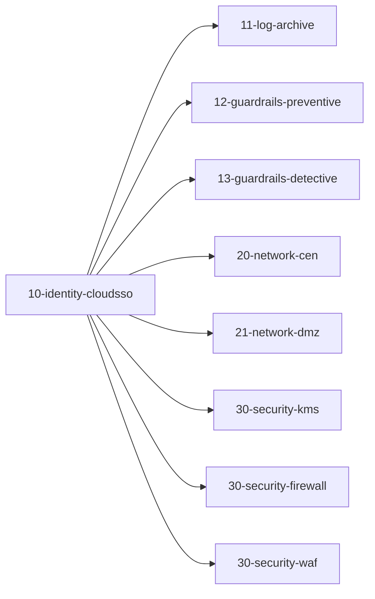
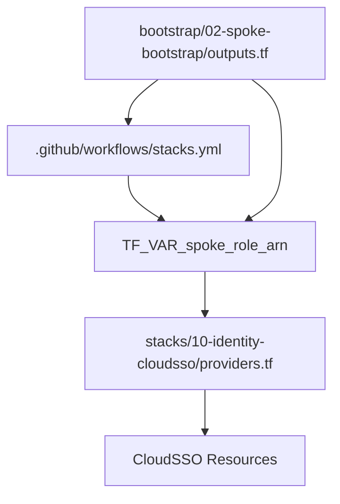

# Identity & Access Management

<cite>
**Referenced Files in This Document**
- [README.md](file://README.md)
- [.github/workflows/stacks.yml](file://.github/workflows/stacks.yml)
- [stacks/10-identity-cloudsso/main.tf](file://stacks/10-identity-cloudsso/main.tf)
- [stacks/10-identity-cloudsso/providers.tf](file://stacks/10-identity-cloudsso/providers.tf)
- [stacks/10-identity-cloudsso/variables.tf](file://stacks/10-identity-cloudsso/variables.tf)
- [stacks/10-identity-cloudsso/outputs.tf](file://stacks/10-identity-cloudsso/outputs.tf)
- [bootstrap/02-spoke-bootstrap/modules/spoke-roles/main.tf](file://bootstrap/02-spoke-bootstrap/modules/spoke-roles/main.tf)
- [bootstrap/02-spoke-bootstrap/variables.tf](file://bootstrap/02-spoke-bootstrap/variables.tf)
- [bootstrap/02-spoke-bootstrap/outputs.tf](file://bootstrap/02-spoke-bootstrap/outputs.tf)
- [bootstrap/01-cicd-foundation/providers.tf](file://bootstrap/01-cicd-foundation/providers.tf)
</cite>

## Table of Contents
1. [Introduction](#introduction)
2. [Project Structure](#project-structure)
3. [Core Components](#core-components)
4. [Architecture Overview](#architecture-overview)
5. [Detailed Component Analysis](#detailed-component-analysis)
6. [Dependency Analysis](#dependency-analysis)
7. [Performance Considerations](#performance-considerations)
8. [Troubleshooting Guide](#troubleshooting-guide)
9. [Conclusion](#conclusion)
10. [Appendices](#appendices)

## Introduction
This document describes the Identity & Access Management stack that integrates Alibaba Cloud CloudSSO within the Landing Zone Accelerator. It explains how the stack is configured to operate cross-account using OIDC-based federation, how provider credentials are assumed via spoke roles, and how variables and outputs are structured to support CloudSSO directory synchronization and access control. It also outlines integration patterns with external identity providers, security implications, and best practices for designing access control policies.

## Project Structure
The Identity & Access Management stack resides under stacks/10-identity-cloudsso and is orchestrated by GitHub Actions. The workflow matrix deploys this stack alongside others, targeting specific spoke accounts. Cross-account operations rely on spoke roles provisioned during the bootstrap phase.

**Diagram sources**
- [.github/workflows/stacks.yml:18-112](file://.github/workflows/stacks.yml#L18-L112)
- [stacks/10-identity-cloudsso/providers.tf:1-9](file://stacks/10-identity-cloudsso/providers.tf#L1-L9)
- [stacks/10-identity-cloudsso/variables.tf:1-11](file://stacks/10-identity-cloudsso/variables.tf#L1-L11)
- [stacks/10-identity-cloudsso/main.tf:1-10](file://stacks/10-identity-cloudsso/main.tf#L1-L10)
- [stacks/10-identity-cloudsso/outputs.tf:1-3](file://stacks/10-identity-cloudsso/outputs.tf#L1-L3)
- [bootstrap/02-spoke-bootstrap/modules/spoke-roles/main.tf:1-42](file://bootstrap/02-spoke-bootstrap/modules/spoke-roles/main.tf#L1-L42)
- [bootstrap/02-spoke-bootstrap/outputs.tf:1-22](file://bootstrap/02-spoke-bootstrap/outputs.tf#L1-L22)
- [bootstrap/02-spoke-bootstrap/variables.tf:1-26](file://bootstrap/02-spoke-bootstrap/variables.tf#L1-L26)
- [bootstrap/01-cicd-foundation/providers.tf:1-15](file://bootstrap/01-cicd-foundation/providers.tf#L1-L15)

**Section sources**
- [README.md:141-165](file://README.md#L141-L165)
- [.github/workflows/stacks.yml:18-112](file://.github/workflows/stacks.yml#L18-L112)
- [stacks/10-identity-cloudsso/main.tf:1-10](file://stacks/10-identity-cloudsso/main.tf#L1-L10)
- [stacks/10-identity-cloudsso/providers.tf:1-9](file://stacks/10-identity-cloudsso/providers.tf#L1-L9)
- [stacks/10-identity-cloudsso/variables.tf:1-11](file://stacks/10-identity-cloudsso/variables.tf#L1-L11)
- [stacks/10-identity-cloudsso/outputs.tf:1-3](file://stacks/10-identity-cloudsso/outputs.tf#L1-L3)
- [bootstrap/02-spoke-bootstrap/modules/spoke-roles/main.tf:1-42](file://bootstrap/02-spoke-bootstrap/modules/spoke-roles/main.tf#L1-L42)
- [bootstrap/02-spoke-bootstrap/outputs.tf:1-22](file://bootstrap/02-spoke-bootstrap/outputs.tf#L1-L22)
- [bootstrap/02-spoke-bootstrap/variables.tf:1-26](file://bootstrap/02-spoke-bootstrap/variables.tf#L1-L26)
- [bootstrap/01-cicd-foundation/providers.tf:1-15](file://bootstrap/01-cicd-foundation/providers.tf#L1-L15)

## Core Components
- CloudSSO stack entrypoint: The main configuration file indicates CloudSSO directory, SCIM, and access configuration resources are intended but not yet implemented in this demo.
- Provider configuration: The stack configures the Alibaba Cloud provider to assume a spoke role for cross-account operations, setting region and session parameters.
- Variables: Defines region and spoke_role_arn, where the latter is injected via environment variables from the workflow.
- Outputs: Placeholder for exporting CloudSSO directory ID and access configuration references.

Implementation pointers:
- The CloudSSO stack main file references a module path indicating where the CloudSSO implementation would be sourced from in production.
- The workflow matrix includes the CloudSSO stack and passes the SpokeApplyRole ARN for apply jobs.

**Section sources**
- [stacks/10-identity-cloudsso/main.tf:1-10](file://stacks/10-identity-cloudsso/main.tf#L1-L10)
- [stacks/10-identity-cloudsso/providers.tf:1-9](file://stacks/10-identity-cloudsso/providers.tf#L1-L9)
- [stacks/10-identity-cloudsso/variables.tf:1-11](file://stacks/10-identity-cloudsso/variables.tf#L1-L11)
- [stacks/10-identity-cloudsso/outputs.tf:1-3](file://stacks/10-identity-cloudsso/outputs.tf#L1-L3)
- [.github/workflows/stacks.yml:77-112](file://.github/workflows/stacks.yml#L77-L112)

## Architecture Overview
The CloudSSO stack operates within the Landing Zone’s OIDC-based credential flow. GitHub Actions assumes either a Plan or Apply role in the CICD account, then assumes a Spoke role in the target member account to provision CloudSSO resources.

**Diagram sources**
- [README.md:28](file://README.md#L28)
- [.github/workflows/stacks.yml:42-99](file://.github/workflows/stacks.yml#L42-L99)
- [bootstrap/01-cicd-foundation/providers.tf:7-15](file://bootstrap/01-cicd-foundation/providers.tf#L7-L15)
- [bootstrap/02-spoke-bootstrap/modules/spoke-roles/main.tf:3-41](file://bootstrap/02-spoke-bootstrap/modules/spoke-roles/main.tf#L3-L41)
- [stacks/10-identity-cloudsso/providers.tf:1-9](file://stacks/10-identity-cloudsso/providers.tf#L1-L9)

## Detailed Component Analysis

### CloudSSO Stack Configuration
- Purpose: Define CloudSSO directory, SCIM integration, and access control configuration for the Landing Zone.
- Current state: The main file documents the intent and references a module path for production sourcing; the implementation is marked as pending in this demo.
- Provider: Uses assume_role to chain into the Spoke role ARN passed via TF_VAR_spoke_role_arn.
- Variables: region and spoke_role_arn are required; the latter is set by the workflow matrix for each stack.
- Outputs: Reserved for exporting CloudSSO directory and access configuration identifiers.

**Diagram sources**
- [stacks/10-identity-cloudsso/main.tf:1-10](file://stacks/10-identity-cloudsso/main.tf#L1-L10)
- [stacks/10-identity-cloudsso/providers.tf:1-9](file://stacks/10-identity-cloudsso/providers.tf#L1-L9)
- [stacks/10-identity-cloudsso/variables.tf:1-11](file://stacks/10-identity-cloudsso/variables.tf#L1-L11)
- [stacks/10-identity-cloudsso/outputs.tf:1-3](file://stacks/10-identity-cloudsso/outputs.tf#L1-L3)

**Section sources**
- [stacks/10-identity-cloudsso/main.tf:1-10](file://stacks/10-identity-cloudsso/main.tf#L1-L10)
- [stacks/10-identity-cloudsso/providers.tf:1-9](file://stacks/10-identity-cloudsso/providers.tf#L1-L9)
- [stacks/10-identity-cloudsso/variables.tf:1-11](file://stacks/10-identity-cloudsso/variables.tf#L1-L11)
- [stacks/10-identity-cloudsso/outputs.tf:1-3](file://stacks/10-identity-cloudsso/outputs.tf#L1-L3)

### Provider Configuration and Cross-Account Assumption
- The Alibaba Cloud provider is configured to assume a spoke role ARN for the target account.
- Session parameters include session name and expiration aligned with the workflow’s Spoke roles.
- The workflow sets TF_VAR_spoke_role_arn dynamically per stack using the spoke account mapping.

**Diagram sources**
- [.github/workflows/stacks.yml:58-111](file://.github/workflows/stacks.yml#L58-L111)
- [stacks/10-identity-cloudsso/providers.tf:1-9](file://stacks/10-identity-cloudsso/providers.tf#L1-L9)
- [bootstrap/02-spoke-bootstrap/modules/spoke-roles/main.tf:3-41](file://bootstrap/02-spoke-bootstrap/modules/spoke-roles/main.tf#L3-L41)

**Section sources**
- [.github/workflows/stacks.yml:58-111](file://.github/workflows/stacks.yml#L58-L111)
- [stacks/10-identity-cloudsso/providers.tf:1-9](file://stacks/10-identity-cloudsso/providers.tf#L1-L9)
- [bootstrap/02-spoke-bootstrap/modules/spoke-roles/main.tf:3-41](file://bootstrap/02-spoke-bootstrap/modules/spoke-roles/main.tf#L3-L41)

### Variable Definitions and Environment Integration
- region: Determines the Alibaba Cloud region for the CloudSSO resources.
- spoke_role_arn: Injected by the workflow to assume the appropriate Spoke role per stack.
- The workflow matrix selects the spoke account per stack and constructs the Spoke role ARN accordingly.

**Diagram sources**
- [.github/workflows/stacks.yml:24-33](file://.github/workflows/stacks.yml#L24-L33)
- [.github/workflows/stacks.yml:58-111](file://.github/workflows/stacks.yml#L58-L111)
- [stacks/10-identity-cloudsso/variables.tf:7-10](file://stacks/10-identity-cloudsso/variables.tf#L7-L10)

**Section sources**
- [.github/workflows/stacks.yml:24-33](file://.github/workflows/stacks.yml#L24-L33)
- [.github/workflows/stacks.yml:58-111](file://.github/workflows/stacks.yml#L58-L111)
- [stacks/10-identity-cloudsso/variables.tf:1-11](file://stacks/10-identity-cloudsso/variables.tf#L1-L11)

### Outputs Management
- The outputs file is reserved for exporting CloudSSO directory identifiers and access configuration references.
- These outputs enable downstream stacks or integrations to consume CloudSSO resource references.

**Section sources**
- [stacks/10-identity-cloudsso/outputs.tf:1-3](file://stacks/10-identity-cloudsso/outputs.tf#L1-L3)

### Relationship with Other Stacks
- The CloudSSO stack participates in the workflow matrix alongside other stacks (e.g., logging, guardrails, networking, security).
- Outputs from this stack can be consumed by other stacks that require CloudSSO-backed identities or access controls.

**Diagram sources**
- [.github/workflows/stacks.yml:24-33](file://.github/workflows/stacks.yml#L24-L33)

**Section sources**
- [.github/workflows/stacks.yml:24-33](file://.github/workflows/stacks.yml#L24-L33)

### Implementation Examples (Conceptual)
Note: The following describe conceptual steps for implementing CloudSSO features. Replace placeholders with actual resource blocks and module calls in your production configuration.

- CloudSSO tenant creation
  - Define a CloudSSO tenant resource in the CloudSSO stack main file.
  - Export the tenant identifier via outputs for reuse by other stacks.
  - Reference the module path indicated in the main file for production sourcing.

- Directory connection
  - Add a directory connection resource referencing the tenant and directory settings.
  - Ensure the directory provider aligns with your external identity provider (e.g., OIDC, Active Directory).

- Access control configuration
  - Define access configurations that map organizational units/groups to permissions.
  - Use outputs to export access configuration IDs for downstream consumption.

- Directory synchronization (SCIM)
  - Integrate SCIM provisioning to synchronize users and groups from the directory to CloudSSO.
  - Align SCIM settings with your directory’s capabilities and security posture.

[No sources needed since this section provides conceptual guidance]

## Dependency Analysis
- Workflow to stack: The workflow matrix selects the CloudSSO stack and injects the Spoke role ARN for assume_role.
- Spoke roles: Provisioned during bootstrap; outputs expose role ARNs for use in stacks.
- Provider chaining: The Alibaba Cloud provider in the CloudSSO stack depends on the Spoke role ARN to assume the correct identity in the target account.

**Diagram sources**
- [.github/workflows/stacks.yml:58-111](file://.github/workflows/stacks.yml#L58-L111)
- [stacks/10-identity-cloudsso/providers.tf:1-9](file://stacks/10-identity-cloudsso/providers.tf#L1-L9)
- [bootstrap/02-spoke-bootstrap/outputs.tf:1-22](file://bootstrap/02-spoke-bootstrap/outputs.tf#L1-L22)

**Section sources**
- [.github/workflows/stacks.yml:58-111](file://.github/workflows/stacks.yml#L58-L111)
- [stacks/10-identity-cloudsso/providers.tf:1-9](file://stacks/10-identity-cloudsso/providers.tf#L1-L9)
- [bootstrap/02-spoke-bootstrap/outputs.tf:1-22](file://bootstrap/02-spoke-bootstrap/outputs.tf#L1-L22)

## Performance Considerations
- Session duration: The provider session expiration is set to one hour, balancing operational convenience with security.
- Least privilege: The SpokePlanRole is read-only; SpokeApplyRole is scoped appropriately per spoke.
- State storage: Encrypted state with locking prevents conflicts and ensures secure state management.

[No sources needed since this section provides general guidance]

## Troubleshooting Guide
- OIDC credential flow failures
  - Verify OIDC provider ARN and role assumptions in the workflow match the hub account configuration.
  - Confirm the audience parameter aligns with Alibaba Cloud STS endpoints.

- Cross-account assumption errors
  - Ensure the Spoke role ARN matches the spoke account and role name.
  - Confirm the Spoke role trust policy allows the hub roles used by the workflow.

- CloudSSO resource provisioning issues
  - Validate that the CloudSSO stack main file references the correct module path and that the module is available in production.
  - Check that outputs are defined and exported for downstream consumers.

- Drift detection
  - Schedule periodic plan-only runs to detect configuration drift and maintain compliance.

**Section sources**
- [README.md:106-113](file://README.md#L106-L113)
- [.github/workflows/stacks.yml:42-99](file://.github/workflows/stacks.yml#L42-L99)
- [bootstrap/02-spoke-bootstrap/modules/spoke-roles/main.tf:3-41](file://bootstrap/02-spoke-bootstrap/modules/spoke-roles/main.tf#L3-L41)

## Conclusion
The Identity & Access Management stack establishes the foundation for CloudSSO within the Landing Zone by configuring cross-account operations via OIDC-assumed roles, defining variables for region and spoke role ARN, and reserving outputs for CloudSSO resource references. While the CloudSSO implementation is currently a placeholder in this demo, the workflow and provider configuration demonstrate a secure, least-privilege pattern that can be extended to include directory connections, SCIM synchronization, and access control configurations.

[No sources needed since this section summarizes without analyzing specific files]

## Appendices

### Security Implications of Identity Management
- No long-lived credentials are used; short-lived tokens are assumed at runtime.
- Least privilege roles are enforced: read-only for plan, administrative for apply where necessary.
- Account isolation is achieved through spoke-specific roles; a compromise of one role does not affect others.
- State is encrypted and locked to prevent unauthorized changes.

**Section sources**
- [README.md:106-113](file://README.md#L106-L113)

### Integration Patterns with External Identity Providers
- The CloudSSO stack main file references a module path suitable for sourcing production components.
- Align directory connection and SCIM settings with your external identity provider’s capabilities and security requirements.

**Section sources**
- [stacks/10-identity-cloudsso/main.tf:3-7](file://stacks/10-identity-cloudsso/main.tf#L3-L7)