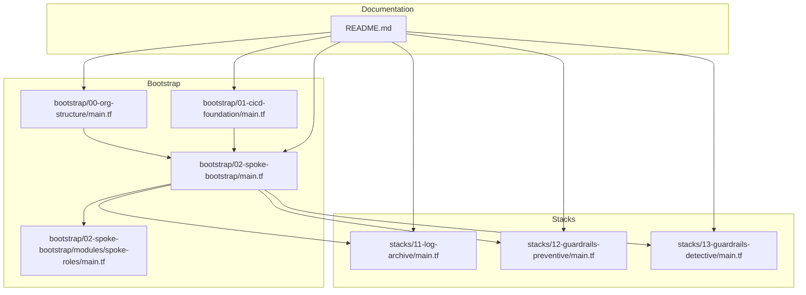
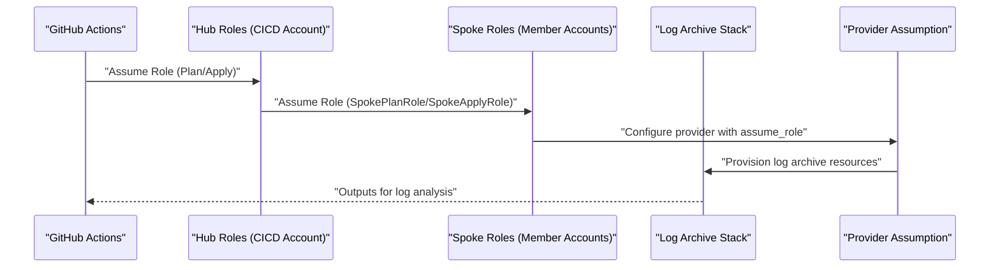
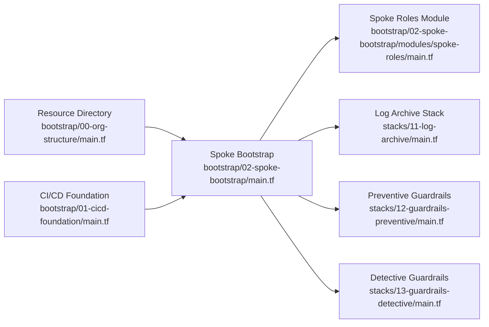

# Logging Infrastructure

<cite>
**Referenced Files in This Document**
- [README.md](file://README.md)
- [bootstrap/00-org-structure/main.tf](file://bootstrap/00-org-structure/main.tf)
- [bootstrap/01-cicd-foundation/main.tf](file://bootstrap/01-cicd-foundation/main.tf)
- [bootstrap/02-spoke-bootstrap/main.tf](file://bootstrap/02-spoke-bootstrap/main.tf)
- [bootstrap/02-spoke-bootstrap/modules/spoke-roles/main.tf](file://bootstrap/02-spoke-bootstrap/modules/spoke-roles/main.tf)
- [stacks/11-log-archive/main.tf](file://stacks/11-log-archive/main.tf)
- [stacks/11-log-archive/providers.tf](file://stacks/11-log-archive/providers.tf)
- [stacks/11-log-archive/variables.tf](file://stacks/11-log-archive/variables.tf)
- [stacks/11-log-archive/versions.tf](file://stacks/11-log-archive/versions.tf)
- [stacks/12-guardrails-preventive/main.tf](file://stacks/12-guardrails-preventive/main.tf)
- [stacks/12-guardrails-preventive/variables.tf](file://stacks/12-guardrails-preventive/variables.tf)
- [stacks/13-guardrails-detective/main.tf](file://stacks/13-guardrails-detective/main.tf)
- [stacks/13-guardrails-detective/variables.tf](file://stacks/13-guardrails-detective/variables.tf)
</cite>

## Table of Contents
1. [Introduction](#introduction)
2. [Project Structure](#project-structure)
3. [Core Components](#core-components)
4. [Architecture Overview](#architecture-overview)
5. [Detailed Component Analysis](#detailed-component-analysis)
6. [Dependency Analysis](#dependency-analysis)
7. [Performance Considerations](#performance-considerations)
8. [Troubleshooting Guide](#troubleshooting-guide)
9. [Conclusion](#conclusion)
10. [Appendices](#appendices)

## Introduction
This document describes the Logging Infrastructure stack designed to establish centralized log management and audit capabilities within the Landing Zone. It covers the log archive account setup, audit logging configuration, cross-account log forwarding mechanisms, provider configuration for log delivery, variable definitions for retention and compliance settings, and output management for log analysis resources. It also provides implementation examples, security considerations, compliance requirements, operational procedures, forwarding patterns, storage optimization strategies, and troubleshooting guidance for log delivery.

## Project Structure
The Logging Infrastructure spans three areas:
- Bootstrap phase: Organization structure and CI/CD foundation that enable secure, federated access to member accounts.
- Stacks: Implementation of foundational services including the log archive stack and guardrails that support audit and detection.
- Workflows: GitHub Actions orchestration enabling OIDC-based, least-privileged deployments.

**Diagram sources**
- [README.md:141-165](file://README.md#L141-L165)
- [bootstrap/00-org-structure/main.tf:1-49](file://bootstrap/00-org-structure/main.tf#L1-L49)
- [bootstrap/01-cicd-foundation/main.tf:1-150](file://bootstrap/01-cicd-foundation/main.tf#L1-L150)
- [bootstrap/02-spoke-bootstrap/main.tf:1-33](file://bootstrap/02-spoke-bootstrap/main.tf#L1-L33)
- [bootstrap/02-spoke-bootstrap/modules/spoke-roles/main.tf:1-42](file://bootstrap/02-spoke-bootstrap/modules/spoke-roles/main.tf#L1-L42)
- [stacks/11-log-archive/main.tf:1-10](file://stacks/11-log-archive/main.tf#L1-L10)
- [stacks/12-guardrails-preventive/main.tf:1-10](file://stacks/12-guardrails-preventive/main.tf#L1-L10)
- [stacks/13-guardrails-detective/main.tf:1-10](file://stacks/13-guardrails-detective/main.tf#L1-L10)

**Section sources**
- [README.md:141-165](file://README.md#L141-L165)
- [bootstrap/00-org-structure/main.tf:1-49](file://bootstrap/00-org-structure/main.tf#L1-L49)
- [bootstrap/01-cicd-foundation/main.tf:1-150](file://bootstrap/01-cicd-foundation/main.tf#L1-L150)
- [bootstrap/02-spoke-bootstrap/main.tf:1-33](file://bootstrap/02-spoke-bootstrap/main.tf#L1-L33)
- [bootstrap/02-spoke-bootstrap/modules/spoke-roles/main.tf:1-42](file://bootstrap/02-spoke-bootstrap/modules/spoke-roles/main.tf#L1-L42)
- [stacks/11-log-archive/main.tf:1-10](file://stacks/11-log-archive/main.tf#L1-L10)
- [stacks/12-guardrails-preventive/main.tf:1-10](file://stacks/12-guardrails-preventive/main.tf#L1-L10)
- [stacks/13-guardrails-detective/main.tf:1-10](file://stacks/13-guardrails-detective/main.tf#L1-L10)

## Core Components
- Log Archive Account: Dedicated member account for centralized log storage and analysis.
- Cross-Account Provider Assumption: Uses OIDC-assumed hub roles to assume spoke roles in member accounts for provisioning.
- Audit and Detection Stacks: Guardrails that enable resource directory control policies and Cloud Config rules to support audit and detection.
- CI/CD Foundation: Secure state backend (OSS), distributed locking (Tablestore), and OIDC provider for GitHub Actions.

Key responsibilities:
- Establish a secure, isolated log archive account under the Resource Directory.
- Configure provider blocks to assume spoke roles with session names and expiration.
- Define variables for region and spoke role ARN injection.
- Prepare outputs for log analysis resources (e.g., SLS project name, logstore ARNs).
- Integrate guardrails for preventive and detective controls to support audit trails.

**Section sources**
- [bootstrap/00-org-structure/main.tf:32-49](file://bootstrap/00-org-structure/main.tf#L32-L49)
- [bootstrap/01-cicd-foundation/main.tf:49-105](file://bootstrap/01-cicd-foundation/main.tf#L49-L105)
- [bootstrap/02-spoke-bootstrap/main.tf:4-8](file://bootstrap/02-spoke-bootstrap/main.tf#L4-L8)
- [bootstrap/02-spoke-bootstrap/modules/spoke-roles/main.tf:3-41](file://bootstrap/02-spoke-bootstrap/modules/spoke-roles/main.tf#L3-L41)
- [stacks/11-log-archive/providers.tf:1-9](file://stacks/11-log-archive/providers.tf#L1-L9)
- [stacks/11-log-archive/variables.tf:1-11](file://stacks/11-log-archive/variables.tf#L1-L11)
- [stacks/11-log-archive/versions.tf:1-18](file://stacks/11-log-archive/versions.tf#L1-L18)
- [stacks/12-guardrails-preventive/main.tf:1-10](file://stacks/12-guardrails-preventive/main.tf#L1-L10)
- [stacks/13-guardrails-detective/main.tf:1-10](file://stacks/13-guardrails-detective/main.tf#L1-L10)

## Architecture Overview
The logging infrastructure follows a federated, least-privileged model:
- GitHub Actions obtains OIDC tokens and assumes hub roles in the CICD account.
- The hub roles assume spoke roles in member accounts (including the log archive account).
- Providers in stacks use assumed roles to provision resources securely.

**Diagram sources**
- [README.md:28-28](file://README.md#L28-L28)
- [bootstrap/01-cicd-foundation/main.tf:61-105](file://bootstrap/01-cicd-foundation/main.tf#L61-L105)
- [bootstrap/02-spoke-bootstrap/modules/spoke-roles/main.tf:3-41](file://bootstrap/02-spoke-bootstrap/modules/spoke-roles/main.tf#L3-L41)
- [stacks/11-log-archive/providers.tf:1-9](file://stacks/11-log-archive/providers.tf#L1-L9)

**Section sources**
- [README.md:28-28](file://README.md#L28-L28)
- [bootstrap/01-cicd-foundation/main.tf:61-105](file://bootstrap/01-cicd-foundation/main.tf#L61-L105)
- [bootstrap/02-spoke-bootstrap/modules/spoke-roles/main.tf:3-41](file://bootstrap/02-spoke-bootstrap/modules/spoke-roles/main.tf#L3-L41)
- [stacks/11-log-archive/providers.tf:1-9](file://stacks/11-log-archive/providers.tf#L1-L9)

## Detailed Component Analysis

### Log Archive Account Setup
- Purpose: Centralized storage for audit logs across the Landing Zone.
- Account placement: Created under the Resource Directory in the “Core” folder alongside other foundational accounts.
- Provider configuration: Uses assume_role with a session name and expiration to securely target the log archive account.
- Variables: Region and spoke role ARN injected via environment variables for dynamic targeting.
- Outputs: Reserved for exposing SLS project name and logstore ARNs for downstream consumption.

Implementation examples (paths):
- Log archive stack placeholder and provider configuration: [stacks/11-log-archive/main.tf:1-10](file://stacks/11-log-archive/main.tf#L1-L10), [stacks/11-log-archive/providers.tf:1-9](file://stacks/11-log-archive/providers.tf#L1-L9)
- Variables definition: [stacks/11-log-archive/variables.tf:1-11](file://stacks/11-log-archive/variables.tf#L1-L11)
- Versions and backend configuration: [stacks/11-log-archive/versions.tf:1-18](file://stacks/11-log-archive/versions.tf#L1-L18)
- Account placement in Resource Directory: [bootstrap/00-org-structure/main.tf:32-49](file://bootstrap/00-org-structure/main.tf#L32-L49)

Security and compliance considerations:
- Use short-lived sessions with explicit session names and expiration.
- Restrict spoke role permissions to least privilege for log archive operations.
- Store state remotely with encryption and distributed locking.

Operational procedures:
- After implementing the log archive stack, define outputs for SLS project and logstores.
- Integrate with monitoring dashboards using the exposed identifiers.

**Section sources**
- [bootstrap/00-org-structure/main.tf:32-49](file://bootstrap/00-org-structure/main.tf#L32-L49)
- [stacks/11-log-archive/main.tf:1-10](file://stacks/11-log-archive/main.tf#L1-L10)
- [stacks/11-log-archive/providers.tf:1-9](file://stacks/11-log-archive/providers.tf#L1-L9)
- [stacks/11-log-archive/variables.tf:1-11](file://stacks/11-log-archive/variables.tf#L1-L11)
- [stacks/11-log-archive/versions.tf:1-18](file://stacks/11-log-archive/versions.tf#L1-L18)

### Audit Logging Configuration
- Preventive guardrails: Resource Directory control policies to enforce governance at rest.
- Detective guardrails: Cloud Config rules to continuously evaluate compliance.

Implementation examples (paths):
- Preventive guardrails placeholder: [stacks/12-guardrails-preventive/main.tf:1-10](file://stacks/12-guardrails-preventive/main.tf#L1-L10)
- Variables definition: [stacks/12-guardrails-preventive/variables.tf:1-11](file://stacks/12-guardrails-preventive/variables.tf#L1-L11)
- Detective guardrails placeholder: [stacks/13-guardrails-detective/main.tf:1-10](file://stacks/13-guardrails-detective/main.tf#L1-L10)
- Variables definition: [stacks/13-guardrails-detective/variables.tf:1-11](file://stacks/13-guardrails-detective/variables.tf#L1-L11)

Audit trail configuration:
- Align guardrail policies with organizational standards and compliance requirements.
- Use Cloud Config rules to detect misconfigurations and remediate automatically where applicable.

**Section sources**
- [stacks/12-guardrails-preventive/main.tf:1-10](file://stacks/12-guardrails-preventive/main.tf#L1-L10)
- [stacks/12-guardrails-preventive/variables.tf:1-11](file://stacks/12-guardrails-preventive/variables.tf#L1-L11)
- [stacks/13-guardrails-detective/main.tf:1-10](file://stacks/13-guardrails-detective/main.tf#L1-L10)
- [stacks/13-guardrails-detective/variables.tf:1-11](file://stacks/13-guardrails-detective/variables.tf#L1-L11)

### Cross-Account Log Forwarding Mechanisms
- Provider assumption: The log archive stack configures a provider with assume_role to operate in the log archive account.
- Module invocation pattern: The spoke bootstrap deploys roles that trust hub roles; stacks use provider aliases to target specific member accounts.

Implementation examples (paths):
- Provider configuration in log archive stack: [stacks/11-log-archive/providers.tf:1-9](file://stacks/11-log-archive/providers.tf#L1-L9)
- Spoke role deployment: [bootstrap/02-spoke-bootstrap/main.tf:4-8](file://bootstrap/02-spoke-bootstrap/main.tf#L4-L8)
- Spoke role trust policies: [bootstrap/02-spoke-bootstrap/modules/spoke-roles/main.tf:3-41](file://bootstrap/02-spoke-bootstrap/modules/spoke-roles/main.tf#L3-L41)

Forwarding patterns:
- Use SLS ingestion endpoints to forward audit logs from member accounts to the log archive account.
- Apply resource directory control policies to restrict cross-account log forwarding to authorized targets.

**Section sources**
- [stacks/11-log-archive/providers.tf:1-9](file://stacks/11-log-archive/providers.tf#L1-L9)
- [bootstrap/02-spoke-bootstrap/main.tf:4-8](file://bootstrap/02-spoke-bootstrap/main.tf#L4-L8)
- [bootstrap/02-spoke-bootstrap/modules/spoke-roles/main.tf:3-41](file://bootstrap/02-spoke-bootstrap/modules/spoke-roles/main.tf#L3-L41)

### Provider Configuration for Log Delivery
- Provider block defines region and assume_role with role_arn, session_name, and session_expiration.
- Session name enables traceability; expiration enforces rotation.

Implementation example (paths):
- Provider configuration: [stacks/11-log-archive/providers.tf:1-9](file://stacks/11-log-archive/providers.tf#L1-L9)

Best practices:
- Keep session expiration aligned with operational windows.
- Use distinct session names per stack for auditing.

**Section sources**
- [stacks/11-log-archive/providers.tf:1-9](file://stacks/11-log-archive/providers.tf#L1-L9)

### Variable Definitions for Log Retention and Compliance Settings
- Region: Ensures consistent regional alignment for log archive resources.
- Spoke role ARN: Injected dynamically to target the log archive account during apply.

Implementation examples (paths):
- Variables: [stacks/11-log-archive/variables.tf:1-11](file://stacks/11-log-archive/variables.tf#L1-L11)

Compliance guidance:
- Define retention periods consistent with regulatory requirements.
- Enforce access controls and encryption at rest and in transit.

**Section sources**
- [stacks/11-log-archive/variables.tf:1-11](file://stacks/11-log-archive/variables.tf#L1-L11)

### Output Management for Log Analysis Resources
- Outputs reserved for SLS project name and logstore ARNs to integrate with dashboards and alerting systems.

Implementation example (paths):
- Outputs placeholder: [stacks/11-log-archive/outputs.tf:1-3](file://stacks/11-log-archive/outputs.tf#L1-L3)

Integration steps:
- Populate outputs after creating SLS projects and logstores.
- Reference outputs in downstream monitoring stacks.

**Section sources**
- [stacks/11-log-archive/outputs.tf:1-3](file://stacks/11-log-archive/outputs.tf#L1-L3)

### Implementation Examples

#### Log Archive Creation
- Steps:
  - Create SLS project and logstores in the log archive account.
  - Expose outputs for SLS project name and logstore ARNs.
  - Configure ingestion endpoints in member accounts to forward audit logs.

Reference paths:
- Provider configuration: [stacks/11-log-archive/providers.tf:1-9](file://stacks/11-log-archive/providers.tf#L1-L9)
- Outputs definition: [stacks/11-log-archive/outputs.tf:1-3](file://stacks/11-log-archive/outputs.tf#L1-L3)

#### Audit Trail Configuration
- Steps:
  - Enable Resource Directory control policies via preventive guardrails.
  - Configure Cloud Config rules via detective guardrails.
  - Monitor and report on compliance deviations.

Reference paths:
- Preventive guardrails: [stacks/12-guardrails-preventive/main.tf:1-10](file://stacks/12-guardrails-preventive/main.tf#L1-L10)
- Variables: [stacks/12-guardrails-preventive/variables.tf:1-11](file://stacks/12-guardrails-preventive/variables.tf#L1-L11)
- Detective guardrails: [stacks/13-guardrails-detective/main.tf:1-10](file://stacks/13-guardrails-detective/main.tf#L1-L10)
- Variables: [stacks/13-guardrails-detective/variables.tf:1-11](file://stacks/13-guardrails-detective/variables.tf#L1-L11)

#### Integration with Monitoring Systems
- Steps:
  - Use outputs from the log archive stack to configure dashboards and alerts.
  - Connect SLS logstores to monitoring solutions for real-time insights.

Reference paths:
- Outputs placeholder: [stacks/11-log-archive/outputs.tf:1-3](file://stacks/11-log-archive/outputs.tf#L1-L3)

## Dependency Analysis
The logging infrastructure relies on:
- Resource Directory for account organization.
- CI/CD foundation for secure state management and OIDC-based role assumption.
- Spoke roles for cross-account delegation.
- Stacks for provisioning log archive and guardrails.

**Diagram sources**
- [bootstrap/00-org-structure/main.tf:1-49](file://bootstrap/00-org-structure/main.tf#L1-L49)
- [bootstrap/01-cicd-foundation/main.tf:1-150](file://bootstrap/01-cicd-foundation/main.tf#L1-L150)
- [bootstrap/02-spoke-bootstrap/main.tf:1-33](file://bootstrap/02-spoke-bootstrap/main.tf#L1-L33)
- [bootstrap/02-spoke-bootstrap/modules/spoke-roles/main.tf:1-42](file://bootstrap/02-spoke-bootstrap/modules/spoke-roles/main.tf#L1-L42)
- [stacks/11-log-archive/main.tf:1-10](file://stacks/11-log-archive/main.tf#L1-L10)
- [stacks/12-guardrails-preventive/main.tf:1-10](file://stacks/12-guardrails-preventive/main.tf#L1-L10)
- [stacks/13-guardrails-detective/main.tf:1-10](file://stacks/13-guardrails-detective/main.tf#L1-L10)

**Section sources**
- [bootstrap/00-org-structure/main.tf:1-49](file://bootstrap/00-org-structure/main.tf#L1-L49)
- [bootstrap/01-cicd-foundation/main.tf:1-150](file://bootstrap/01-cicd-foundation/main.tf#L1-L150)
- [bootstrap/02-spoke-bootstrap/main.tf:1-33](file://bootstrap/02-spoke-bootstrap/main.tf#L1-L33)
- [bootstrap/02-spoke-bootstrap/modules/spoke-roles/main.tf:1-42](file://bootstrap/02-spoke-bootstrap/modules/spoke-roles/main.tf#L1-L42)
- [stacks/11-log-archive/main.tf:1-10](file://stacks/11-log-archive/main.tf#L1-L10)
- [stacks/12-guardrails-preventive/main.tf:1-10](file://stacks/12-guardrails-preventive/main.tf#L1-L10)
- [stacks/13-guardrails-detective/main.tf:1-10](file://stacks/13-guardrails-detective/main.tf#L1-L10)

## Performance Considerations
- Minimize cross-account calls by batching log forwarding where feasible.
- Use regional endpoints and consistent regions to reduce latency.
- Optimize log retention policies to balance compliance needs with storage costs.
- Employ indexing and partitioning strategies in SLS to improve query performance.

[No sources needed since this section provides general guidance]

## Troubleshooting Guide
Common issues and resolutions:
- Provider assume_role failures:
  - Verify spoke role ARN injection and session name/expiration settings.
  - Confirm that the hub role can assume the spoke role in the target account.
  - Check OIDC provider configuration and trust policies.

- State backend connectivity:
  - Ensure OSS bucket exists and KMS encryption is configured.
  - Confirm Tablestore instance/table availability for distributed locking.

- Cross-account permission errors:
  - Review spoke role trust policies and attached managed policies.
  - Validate that the roles have sufficient permissions for log archive operations.

Reference paths:
- Provider configuration: [stacks/11-log-archive/providers.tf:1-9](file://stacks/11-log-archive/providers.tf#L1-L9)
- Spoke role trust policies: [bootstrap/02-spoke-bootstrap/modules/spoke-roles/main.tf:3-41](file://bootstrap/02-spoke-bootstrap/modules/spoke-roles/main.tf#L3-L41)
- CI/CD state infrastructure: [bootstrap/01-cicd-foundation/main.tf:5-43](file://bootstrap/01-cicd-foundation/main.tf#L5-L43)

**Section sources**
- [stacks/11-log-archive/providers.tf:1-9](file://stacks/11-log-archive/providers.tf#L1-L9)
- [bootstrap/02-spoke-bootstrap/modules/spoke-roles/main.tf:3-41](file://bootstrap/02-spoke-bootstrap/modules/spoke-roles/main.tf#L3-L41)
- [bootstrap/01-cicd-foundation/main.tf:5-43](file://bootstrap/01-cicd-foundation/main.tf#L5-L43)

## Conclusion
The Logging Infrastructure establishes a secure, auditable, and scalable foundation for centralized log management within the Landing Zone. By leveraging OIDC-based role assumption, guardrails for prevention and detection, and a dedicated log archive account, organizations can meet compliance requirements while maintaining operational efficiency. Proper configuration of provider assumptions, variables, and outputs ensures seamless integration with monitoring systems and robust troubleshooting capabilities.

[No sources needed since this section summarizes without analyzing specific files]

## Appendices

### Security Considerations for Log Data Protection
- Use short-lived session tokens with explicit session names and expiration.
- Restrict spoke role permissions to least privilege.
- Encrypt state at rest and in transit; leverage KMS-managed keys.
- Enforce strict access controls on log archive resources.

[No sources needed since this section provides general guidance]

### Compliance Requirements for Log Retention
- Define retention periods aligned with regulatory mandates.
- Implement automated lifecycle policies for log archival and deletion.
- Maintain immutable records where required by compliance frameworks.

[No sources needed since this section provides general guidance]

### Operational Procedures for Log Analysis
- Continuously monitor log archive ingestion and storage health.
- Set up alerts for anomalies and retention violations.
- Periodically review and update guardrail policies to reflect evolving risks.

[No sources needed since this section provides general guidance]