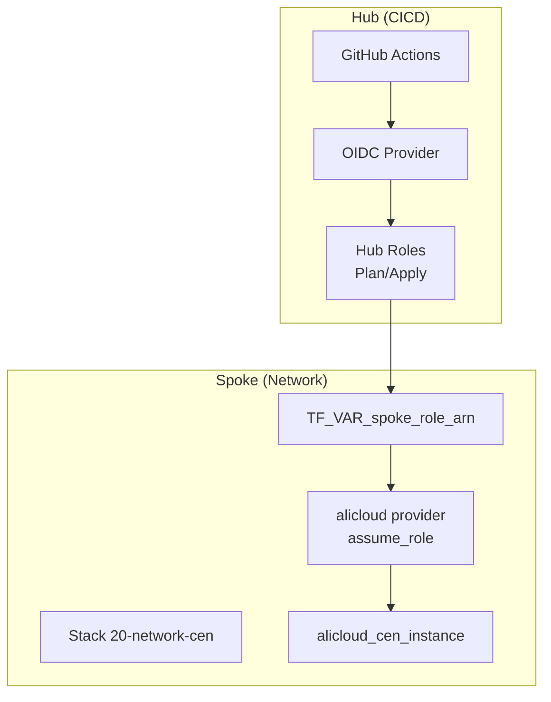
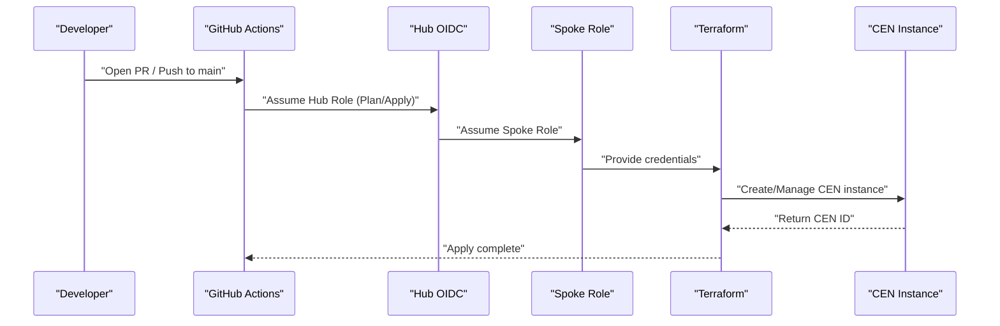
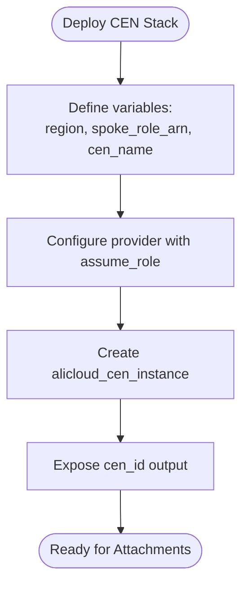
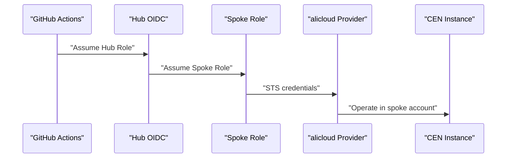
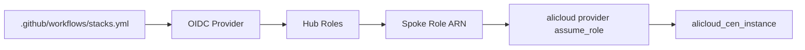

# CEN Hub-and-Spoke Networking

<cite>
**Referenced Files in This Document**
- [README.md](file://README.md)
- [stacks/20-network-cen/main.tf](file://stacks/20-network-cen/main.tf)
- [stacks/20-network-cen/variables.tf](file://stacks/20-network-cen/variables.tf)
- [stacks/20-network-cen/providers.tf](file://stacks/20-network-cen/providers.tf)
- [stacks/20-network-cen/outputs.tf](file://stacks/20-network-cen/outputs.tf)
- [stacks/20-network-cen/versions.tf](file://stacks/20-network-cen/versions.tf)
- [.github/workflows/stacks.yml](file://.github/workflows/stacks.yml)
- [.github/workflows/terraform-reusable.yml](file://.github/workflows/terraform-reusable.yml)
- [bootstrap/02-spoke-bootstrap/main.tf](file://bootstrap/02-spoke-bootstrap/main.tf)
- [bootstrap/02-spoke-bootstrap/variables.tf](file://bootstrap/02-spoke-bootstrap/variables.tf)
- [bootstrap/02-spoke-bootstrap/providers.tf](file://bootstrap/02-spoke-bootstrap/providers.tf)
- [bootstrap/02-spoke-bootstrap/modules/spoke-roles/main.tf](file://bootstrap/02-spoke-bootstrap/modules/spoke-roles/main.tf)
</cite>

## Table of Contents
1. [Introduction](#introduction)
2. [Project Structure](#project-structure)
3. [Core Components](#core-components)
4. [Architecture Overview](#architecture-overview)
5. [Detailed Component Analysis](#detailed-component-analysis)
6. [Dependency Analysis](#dependency-analysis)
7. [Performance Considerations](#performance-considerations)
8. [Troubleshooting Guide](#troubleshooting-guide)
9. [Conclusion](#conclusion)
10. [Appendices](#appendices)

## Introduction
This document explains the Cloud Enterprise Network (CEN) hub-and-spoke networking implementation in the Alibaba Cloud landing zone accelerator. It covers CEN instance configuration, hub-and-spoke topology design, network segmentation strategies, cross-account provider setup, variable definitions for naming and descriptions, integration with spoke accounts, and practical examples for CEN instance creation, attachment management, and route propagation configuration. It also addresses network isolation patterns, traffic routing between hubs and spokes, security boundary enforcement, the relationship between CEN and VPC peering, performance considerations for cross-region connectivity, troubleshooting connectivity issues, and best practices for CEN attachments, route table management, and network monitoring.

## Project Structure
The CEN implementation is delivered as a stack that deploys into a dedicated spoke account. The stack defines a CEN instance and exposes its identifier as an output. Cross-account operations are orchestrated via GitHub Actions and OIDC-based provider chaining, where the hub’s OIDC identity assumes a spoke role to provision resources.

**Diagram sources**
- [.github/workflows/stacks.yml:29](file://.github/workflows/stacks.yml#L29)
- [.github/workflows/stacks.yml:58](file://.github/workflows/stacks.yml#L58)
- [stacks/20-network-cen/providers.tf:1-9](file://stacks/20-network-cen/providers.tf#L1-L9)
- [stacks/20-network-cen/main.tf:12-16](file://stacks/20-network-cen/main.tf#L12-L16)

**Section sources**
- [README.md:141-165](file://README.md#L141-L165)
- [stacks/20-network-cen/main.tf:1-16](file://stacks/20-network-cen/main.tf#L1-L16)
- [stacks/20-network-cen/variables.tf:1-17](file://stacks/20-network-cen/variables.tf#L1-L17)
- [stacks/20-network-cen/providers.tf:1-9](file://stacks/20-network-cen/providers.tf#L1-L9)
- [stacks/20-network-cen/outputs.tf:1-5](file://stacks/20-network-cen/outputs.tf#L1-L5)
- [stacks/20-network-cen/versions.tf:1-18](file://stacks/20-network-cen/versions.tf#L1-L18)
- [.github/workflows/stacks.yml:18-112](file://.github/workflows/stacks.yml#L18-L112)

## Core Components
- CEN Instance: A single CEN instance is created in the network spoke account. The instance name and description are configurable via variables.
- Provider Chaining: The alicloud provider is configured to assume a spoke role injected via TF_VAR_spoke_role_arn, enabling cross-account provisioning.
- Outputs: The stack exposes the CEN instance identifier for downstream consumption.
- Versions and Backend: The stack pins provider versions and configures an OSS backend with locking for state management.

Practical example references:
- CEN instance creation: [stacks/20-network-cen/main.tf:12-16](file://stacks/20-network-cen/main.tf#L12-L16)
- Provider chaining with spoke role: [stacks/20-network-cen/providers.tf:1-9](file://stacks/20-network-cen/providers.tf#L1-L9)
- Outputs: [stacks/20-network-cen/outputs.tf:1-5](file://stacks/20-network-cen/outputs.tf#L1-L5)
- Versions and backend: [stacks/20-network-cen/versions.tf:1-18](file://stacks/20-network-cen/versions.tf#L1-L18)

**Section sources**
- [stacks/20-network-cen/main.tf:12-16](file://stacks/20-network-cen/main.tf#L12-L16)
- [stacks/20-network-cen/providers.tf:1-9](file://stacks/20-network-cen/providers.tf#L1-L9)
- [stacks/20-network-cen/outputs.tf:1-5](file://stacks/20-network-cen/outputs.tf#L1-L5)
- [stacks/20-network-cen/versions.tf:1-18](file://stacks/20-network-cen/versions.tf#L1-L18)

## Architecture Overview
The CEN stack is deployed into the network spoke account using a provider that assumes a spoke role. The CI/CD pipeline injects the spoke role ARN via TF_VAR_spoke_role_arn, enabling secure, cross-account provisioning without long-lived credentials.

**Diagram sources**
- [.github/workflows/stacks.yml:42-111](file://.github/workflows/stacks.yml#L42-L111)
- [stacks/20-network-cen/providers.tf:1-9](file://stacks/20-network-cen/providers.tf#L1-L9)
- [stacks/20-network-cen/main.tf:12-16](file://stacks/20-network-cen/main.tf#L12-L16)

## Detailed Component Analysis

### CEN Instance Configuration
- Purpose: Creates a CEN instance scoped to the network spoke account.
- Naming and Description: Controlled via variables for consistent naming and labeling.
- Outputs: Exposes the CEN instance identifier for integration with other components.

References:
- Instance definition: [stacks/20-network-cen/main.tf:12-16](file://stacks/20-network-cen/main.tf#L12-L16)
- Variables: [stacks/20-network-cen/variables.tf:12-16](file://stacks/20-network-cen/variables.tf#L12-L16)
- Output: [stacks/20-network-cen/outputs.tf:1-5](file://stacks/20-network-cen/outputs.tf#L1-L5)

**Diagram sources**
- [stacks/20-network-cen/variables.tf:1-17](file://stacks/20-network-cen/variables.tf#L1-L17)
- [stacks/20-network-cen/providers.tf:1-9](file://stacks/20-network-cen/providers.tf#L1-L9)
- [stacks/20-network-cen/main.tf:12-16](file://stacks/20-network-cen/main.tf#L12-L16)
- [stacks/20-network-cen/outputs.tf:1-5](file://stacks/20-network-cen/outputs.tf#L1-L5)

**Section sources**
- [stacks/20-network-cen/main.tf:12-16](file://stacks/20-network-cen/main.tf#L12-L16)
- [stacks/20-network-cen/variables.tf:12-16](file://stacks/20-network-cen/variables.tf#L12-L16)
- [stacks/20-network-cen/outputs.tf:1-5](file://stacks/20-network-cen/outputs.tf#L1-L5)

### Provider Setup for Cross-Account CEN Operations
- OIDC-Based Authentication: The pipeline assumes hub roles using OIDC tokens.
- Provider Chaining: The alicloud provider assumes a spoke role using TF_VAR_spoke_role_arn.
- Role Trust: The spoke role is created during bootstrap and attached to the network spoke account.

References:
- Pipeline injection of spoke role ARN: [.github/workflows/stacks.yml:58](file://.github/workflows/stacks.yml#L58)
- Provider assume_role configuration: [stacks/20-network-cen/providers.tf:1-9](file://stacks/20-network-cen/providers.tf#L1-L9)
- Spoke role creation (bootstrap): [bootstrap/02-spoke-bootstrap/modules/spoke-roles/main.tf:1-42](file://bootstrap/02-spoke-bootstrap/modules/spoke-roles/main.tf#L1-L42)

**Diagram sources**
- [.github/workflows/stacks.yml:42-111](file://.github/workflows/stacks.yml#L42-L111)
- [stacks/20-network-cen/providers.tf:1-9](file://stacks/20-network-cen/providers.tf#L1-L9)
- [bootstrap/02-spoke-bootstrap/modules/spoke-roles/main.tf:1-42](file://bootstrap/02-spoke-bootstrap/modules/spoke-roles/main.tf#L1-L42)

**Section sources**
- [.github/workflows/stacks.yml:42-111](file://.github/workflows/stacks.yml#L42-L111)
- [stacks/20-network-cen/providers.tf:1-9](file://stacks/20-network-cen/providers.tf#L1-L9)
- [bootstrap/02-spoke-bootstrap/modules/spoke-roles/main.tf:1-42](file://bootstrap/02-spoke-bootstrap/modules/spoke-roles/main.tf#L1-L42)

### Variable Definitions for CEN Naming and Descriptions
- region: Specifies the Alibaba Cloud region for the stack.
- spoke_role_arn: Injected at runtime to enable provider chaining.
- cen_name: Configures the CEN instance name; defaults to a production-friendly value.

References:
- Variables: [stacks/20-network-cen/variables.tf:1-17](file://stacks/20-network-cen/variables.tf#L1-L17)

**Section sources**
- [stacks/20-network-cen/variables.tf:1-17](file://stacks/20-network-cen/variables.tf#L1-L17)

### Integration with Spoke Accounts
- Spoke Role Creation: During bootstrap, spoke roles are created in each member account and configured to trust hub roles.
- Provider Aliasing: The bootstrap module demonstrates provider aliasing per spoke, which aligns with the CEN stack’s use of a spoke role ARN.

References:
- Spoke roles module: [bootstrap/02-spoke-bootstrap/modules/spoke-roles/main.tf:1-42](file://bootstrap/02-spoke-bootstrap/modules/spoke-roles/main.tf#L1-L42)
- Provider aliases per spoke: [bootstrap/02-spoke-bootstrap/providers.tf:6-50](file://bootstrap/02-spoke-bootstrap/providers.tf#L6-L50)
- Spokes map: [bootstrap/02-spoke-bootstrap/variables.tf:12-25](file://bootstrap/02-spoke-bootstrap/variables.tf#L12-L25)

**Section sources**
- [bootstrap/02-spoke-bootstrap/modules/spoke-roles/main.tf:1-42](file://bootstrap/02-spoke-bootstrap/modules/spoke-roles/main.tf#L1-L42)
- [bootstrap/02-spoke-bootstrap/providers.tf:6-50](file://bootstrap/02-spoke-bootstrap/providers.tf#L6-L50)
- [bootstrap/02-spoke-bootstrap/variables.tf:12-25](file://bootstrap/02-spoke-bootstrap/variables.tf#L12-L25)

### Practical Examples: CEN Instance Creation, Attachment Management, and Route Propagation
Note: The current CEN stack creates the CEN instance but does not include attachment or route propagation resources. The following examples describe how to extend the implementation conceptually.

- CEN Instance Creation
  - Reference: [stacks/20-network-cen/main.tf:12-16](file://stacks/20-network-cen/main.tf#L12-L16)
- Attachment Management
  - Concept: After creating the CEN instance, attach VPCs or transit gateways to the CEN instance in the spoke account using provider chaining.
  - Reference pattern: [stacks/20-network-cen/providers.tf:1-9](file://stacks/20-network-cen/providers.tf#L1-L9)
- Route Propagation Configuration
  - Concept: Configure route propagation between the CEN instance and route tables associated with attached networks.
  - Reference pattern: [stacks/20-network-cen/variables.tf:12-16](file://stacks/20-network-cen/variables.tf#L12-L16)

[No sources needed since this section describes conceptual extensions beyond the current implementation]

### Network Isolation Patterns and Traffic Routing Between Hubs and Spokes
- Network Isolation: Each spoke account maintains its own resources and IAM roles, preventing lateral movement across accounts.
- Traffic Routing: CEN enables centralized routing across the hub-and-spoke topology. Attachments connect spoke VPCs to the CEN instance, enabling inter-account communication.
- Security Boundaries: Provider chaining ensures least-privilege access; no long-lived credentials are used.

References:
- Security model and isolation: [README.md:106-113](file://README.md#L106-L113)
- Provider chaining: [stacks/20-network-cen/providers.tf:1-9](file://stacks/20-network-cen/providers.tf#L1-L9)

**Section sources**
- [README.md:106-113](file://README.md#L106-L113)
- [stacks/20-network-cen/providers.tf:1-9](file://stacks/20-network-cen/providers.tf#L1-L9)

### Relationship Between CEN and VPC Peering
- CEN vs. VPC Peering: CEN centralizes routing and simplifies cross-account connectivity; VPC peering remains useful for direct, low-latency connections within the same region. Choose based on topology needs and scale.
- Hybrid Strategy: Use CEN for hub-and-spoke orchestration and VPC peering for specific regional optimizations.

[No sources needed since this section provides conceptual guidance]

### Performance Considerations for Cross-Region Connectivity
- Latency and Throughput: Prefer colocating spoke workloads in the same region as the CEN hub when possible. For cross-region scenarios, monitor latency and throughput and consider transit gateway attachments.
- Scaling: CEN scales with the number of attachments; avoid excessive attachments in a single region to maintain manageable routing tables.

[No sources needed since this section provides general guidance]

### Best Practices for CEN Attachments, Route Table Management, and Monitoring
- Attachments
  - Keep attachment scopes minimal and documented.
  - Use naming conventions aligned with environment and workload tiers.
- Route Table Management
  - Segment routes by environment (prod/test/dev) and region.
  - Use route propagation selectively to reduce complexity.
- Monitoring
  - Track CEN bandwidth utilization and attachment health.
  - Integrate with Cloud Monitor dashboards for visibility.

[No sources needed since this section provides general guidance]

## Dependency Analysis
The CEN stack depends on:
- GitHub Actions for orchestrating OIDC-based authentication.
- Hub roles for assuming spoke roles.
- The spoke role ARN injected at runtime via TF_VAR_spoke_role_arn.
- The alicloud provider configured with assume_role.

**Diagram sources**
- [.github/workflows/stacks.yml:42-111](file://.github/workflows/stacks.yml#L42-L111)
- [stacks/20-network-cen/providers.tf:1-9](file://stacks/20-network-cen/providers.tf#L1-L9)
- [stacks/20-network-cen/main.tf:12-16](file://stacks/20-network-cen/main.tf#L12-L16)

**Section sources**
- [.github/workflows/stacks.yml:42-111](file://.github/workflows/stacks.yml#L42-L111)
- [stacks/20-network-cen/providers.tf:1-9](file://stacks/20-network-cen/providers.tf#L1-L9)
- [stacks/20-network-cen/main.tf:12-16](file://stacks/20-network-cen/main.tf#L12-L16)

## Performance Considerations
- Minimize the number of attachments per region to keep route tables concise.
- Prefer regional attachments for latency-sensitive workloads.
- Monitor CEN bandwidth and route propagation updates to detect anomalies early.

[No sources needed since this section provides general guidance]

## Troubleshooting Guide
Common issues and resolutions:
- Permission Denied
  - Cause: Insufficient permissions in the spoke role.
  - Resolution: Verify spoke role trust policy and attached managed policies.
- Provider Chaining Failure
  - Cause: Incorrect TF_VAR_spoke_role_arn or expired session.
  - Resolution: Confirm the ARN and session duration; re-run the job.
- CEN Instance Not Found
  - Cause: Wrong region or account.
  - Resolution: Validate region and account context in the provider configuration.

References:
- Spoke role trust and policies: [bootstrap/02-spoke-bootstrap/modules/spoke-roles/main.tf:1-42](file://bootstrap/02-spoke-bootstrap/modules/spoke-roles/main.tf#L1-L42)
- Provider assume_role: [stacks/20-network-cen/providers.tf:1-9](file://stacks/20-network-cen/providers.tf#L1-L9)

**Section sources**
- [bootstrap/02-spoke-bootstrap/modules/spoke-roles/main.tf:1-42](file://bootstrap/02-spoke-bootstrap/modules/spoke-roles/main.tf#L1-L42)
- [stacks/20-network-cen/providers.tf:1-9](file://stacks/20-network-cen/providers.tf#L1-L9)

## Conclusion
The CEN hub-and-spoke implementation in this repository establishes a secure, cross-account foundation using OIDC-based provider chaining and spoke roles. The stack creates a CEN instance with configurable naming and description, and exposes its identifier for further integration. Extending the implementation to include attachments and route propagation will complete the hub-and-spoke networking solution, while maintaining strict isolation and least-privilege access across spoke accounts.

[No sources needed since this section summarizes without analyzing specific files]

## Appendices
- CI/CD Orchestration
  - Matrix-driven deployment targets the network spoke account for CEN.
  - Plan and apply jobs are separated to enforce review and approval gates.
- Bootstrap Context
  - Spoke roles are provisioned during bootstrap and trusted by hub roles.
  - Provider aliasing demonstrates multi-account targeting patterns.

References:
- Stacks workflow: [.github/workflows/stacks.yml:18-112](file://.github/workflows/stacks.yml#L18-L112)
- Reusable workflow: [.github/workflows/terraform-reusable.yml:1-118](file://.github/workflows/terraform-reusable.yml#L1-L118)
- Bootstrap spoke roles: [bootstrap/02-spoke-bootstrap/main.tf:1-33](file://bootstrap/02-spoke-bootstrap/main.tf#L1-L33)
- Bootstrap providers: [bootstrap/02-spoke-bootstrap/providers.tf:6-50](file://bootstrap/02-spoke-bootstrap/providers.tf#L6-L50)

**Section sources**
- [.github/workflows/stacks.yml:18-112](file://.github/workflows/stacks.yml#L18-L112)
- [.github/workflows/terraform-reusable.yml:1-118](file://.github/workflows/terraform-reusable.yml#L1-L118)
- [bootstrap/02-spoke-bootstrap/main.tf:1-33](file://bootstrap/02-spoke-bootstrap/main.tf#L1-L33)
- [bootstrap/02-spoke-bootstrap/providers.tf:6-50](file://bootstrap/02-spoke-bootstrap/providers.tf#L6-L50)