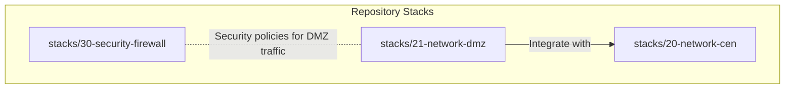
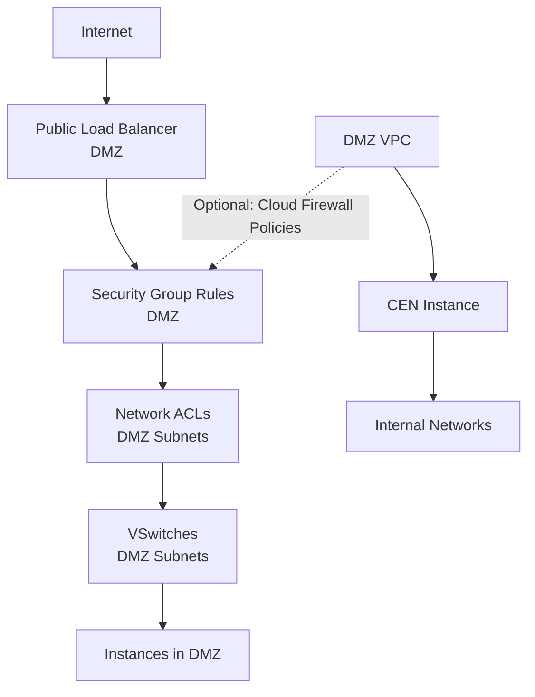
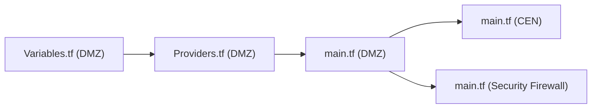

# DMZ Configuration

<cite>
**Referenced Files in This Document**
- [README.md](file://README.md)
- [stacks/21-network-dmz/main.tf](file://stacks/21-network-dmz/main.tf)
- [stacks/21-network-dmz/variables.tf](file://stacks/21-network-dmz/variables.tf)
- [stacks/21-network-dmz/providers.tf](file://stacks/21-network-dmz/providers.tf)
- [stacks/21-network-dmz/outputs.tf](file://stacks/21-network-dmz/outputs.tf)
- [stacks/20-network-cen/main.tf](file://stacks/20-network-cen/main.tf)
- [stacks/20-network-cen/variables.tf](file://stacks/20-network-cen/variables.tf)
- [stacks/20-network-cen/outputs.tf](file://stacks/20-network-cen/outputs.tf)
- [stacks/30-security-firewall/main.tf](file://stacks/30-security-firewall/main.tf)
- [stacks/30-security-firewall/variables.tf](file://stacks/30-security-firewall/variables.tf)
</cite>

## Table of Contents
1. [Introduction](#introduction)
2. [Project Structure](#project-structure)
3. [Core Components](#core-components)
4. [Architecture Overview](#architecture-overview)
5. [Detailed Component Analysis](#detailed-component-analysis)
6. [Dependency Analysis](#dependency-analysis)
7. [Performance Considerations](#performance-considerations)
8. [Troubleshooting Guide](#troubleshooting-guide)
9. [Conclusion](#conclusion)
10. [Appendices](#appendices)

## Introduction
This document provides comprehensive guidance for designing and operating a Demilitarized Zone (DMZ) network in Alibaba Cloud within the Landing Zone Accelerator framework. It focuses on security isolation for internet-facing services, subnet configuration, security boundaries, provider setup, variable definitions, and integration with the VPC and Cloud Enterprise Network (CEN). It also outlines practical examples for DMZ subnet creation, security group rules, network ACL configuration, traffic filtering, separation of public and private resources, ingress/egress controls, monitoring, best practices, load balancer integration, troubleshooting, and disaster recovery considerations.

## Project Structure
The DMZ configuration is part of the stacks in this repository. The DMZ stack currently contains placeholders and references to a production module. The CEN stack demonstrates a hub-and-spoke network topology that the DMZ can integrate with. The README describes the overall Landing Zone architecture and CI/CD model.

**Diagram sources**
- [stacks/21-network-dmz/main.tf:1-10](file://stacks/21-network-dmz/main.tf#L1-L10)
- [stacks/20-network-cen/main.tf:12-16](file://stacks/20-network-cen/main.tf#L12-L16)
- [stacks/30-security-firewall/main.tf:1-10](file://stacks/30-security-firewall/main.tf#L1-L10)

**Section sources**
- [README.md:141-165](file://README.md#L141-L165)
- [stacks/21-network-dmz/main.tf:1-10](file://stacks/21-network-dmz/main.tf#L1-L10)
- [stacks/20-network-cen/main.tf:12-16](file://stacks/20-network-cen/main.tf#L12-L16)
- [stacks/30-security-firewall/main.tf:1-10](file://stacks/30-security-firewall/main.tf#L1-L10)

## Core Components
- DMZ Network Stack: Defines provider configuration and placeholder for DMZ VPC, NAT Gateway, and Elastic IP resources. See [stacks/21-network-dmz/providers.tf:1-9](file://stacks/21-network-dmz/providers.tf#L1-L9) and [stacks/21-network-dmz/main.tf:1-10](file://stacks/21-network-dmz/main.tf#L1-L10).
- CEN Network Stack: Deploys the Cloud Enterprise Network instance used for cross-account and cross-region connectivity. See [stacks/20-network-cen/main.tf:12-16](file://stacks/20-network-cen/main.tf#L12-L16).
- Security Firewall Stack: Placeholder for Cloud Firewall configuration that can enforce DMZ traffic policies. See [stacks/30-security-firewall/main.tf:1-10](file://stacks/30-security-firewall/main.tf#L1-L10).

**Section sources**
- [stacks/21-network-dmz/providers.tf:1-9](file://stacks/21-network-dmz/providers.tf#L1-L9)
- [stacks/21-network-dmz/main.tf:1-10](file://stacks/21-network-dmz/main.tf#L1-L10)
- [stacks/20-network-cen/main.tf:12-16](file://stacks/20-network-cen/main.tf#L12-L16)
- [stacks/30-security-firewall/main.tf:1-10](file://stacks/30-security-firewall/main.tf#L1-L10)

## Architecture Overview
The DMZ sits between the public internet and internal networks. Traffic entering the DMZ is filtered and monitored before reaching internal systems. The DMZ integrates with the CEN for secure inter-account routing and can leverage Cloud Firewall for granular traffic control.

**Diagram sources**
- [stacks/21-network-dmz/main.tf:1-10](file://stacks/21-network-dmz/main.tf#L1-L10)
- [stacks/20-network-cen/main.tf:12-16](file://stacks/20-network-cen/main.tf#L12-L16)
- [stacks/30-security-firewall/main.tf:1-10](file://stacks/30-security-firewall/main.tf#L1-L10)

## Detailed Component Analysis

### DMZ Provider Setup and Variables
- Provider configuration assumes a spoke role with a session name and expiration. See [stacks/21-network-dmz/providers.tf:1-9](file://stacks/21-network-dmz/providers.tf#L1-L9).
- Variables include region and spoke role ARN injection. See [stacks/21-network-dmz/variables.tf:1-11](file://stacks/21-network-dmz/variables.tf#L1-L11).

Implementation guidance:
- Define region and spoke role ARN as variables to enable multi-account and multi-region deployments.
- Use provider assume_role to align with the Landing Zone’s OIDC-based CI/CD model.

**Section sources**
- [stacks/21-network-dmz/providers.tf:1-9](file://stacks/21-network-dmz/providers.tf#L1-L9)
- [stacks/21-network-dmz/variables.tf:1-11](file://stacks/21-network-dmz/variables.tf#L1-L11)

### DMZ Subnet Configuration and Security Boundaries
- Current DMZ stack is a placeholder indicating production usage of a vendor module and a TODO to implement VPC, NAT Gateway, and EIP resources. See [stacks/21-network-dmz/main.tf:1-10](file://stacks/21-network-dmz/main.tf#L1-L10).
- Recommended subnet design:
  - Public subnet(s) for internet-facing services behind a load balancer.
  - Private subnet(s) for backend services that require limited outbound access.
  - Separate VSwitches per subnet tier to enforce isolation.
- Security boundary implementation:
  - Security Groups: Allow inbound only from the load balancer and restrict outbound to necessary internal services.
  - Network ACLs: Enforce least-privilege egress/ingress at the subnet level.
  - Route tables: Point public subnet routes to a NAT Gateway for outbound internet access; keep private subnets without default routes to the internet.

Note: The above describes recommended practices aligned with DMZ principles; specific resource definitions are not present in the current repository snapshot.

**Section sources**
- [stacks/21-network-dmz/main.tf:1-10](file://stacks/21-network-dmz/main.tf#L1-L10)

### Integration with VPC and CEN
- CEN instance is provisioned in the network spoke account. See [stacks/20-network-cen/main.tf:12-16](file://stacks/20-network-cen/main.tf#L12-L16).
- Variables include region, spoke role ARN, and CEN instance name. See [stacks/20-network-cen/variables.tf:1-17](file://stacks/20-network-cen/variables.tf#L1-L17).
- Outputs expose the CEN instance ID. See [stacks/20-network-cen/outputs.tf:1-5](file://stacks/20-network-cen/outputs.tf#L1-L5).

Integration guidance:
- Attach the DMZ VPC to the CEN to enable controlled routing to/from internal networks.
- Configure route propagation and association between the DMZ VPC and CEN to achieve hub-and-spoke connectivity.

**Section sources**
- [stacks/20-network-cen/main.tf:12-16](file://stacks/20-network-cen/main.tf#L12-L16)
- [stacks/20-network-cen/variables.tf:1-17](file://stacks/20-network-cen/variables.tf#L1-L17)
- [stacks/20-network-cen/outputs.tf:1-5](file://stacks/20-network-cen/outputs.tf#L1-L5)

### Security Group Rules and Network ACL Configuration
- Security Groups: Allow inbound traffic from the load balancer and restrict outbound to trusted internal destinations. Deny all other traffic by default.
- Network ACLs: Permit only necessary protocols and ports at the subnet level; deny by default.
- Traffic Filtering Mechanisms:
  - Layer 3/4 filtering via Security Groups.
  - Layer 3/4 filtering plus subnet-level enforcement via Network ACLs.
  - Optional: Layer 7 filtering via Cloud Firewall policies.

Note: These are operational recommendations for DMZ traffic control; specific resource definitions are not present in the current repository snapshot.

**Section sources**
- [stacks/30-security-firewall/main.tf:1-10](file://stacks/30-security-firewall/main.tf#L1-L10)

### Monitoring DMZ Traffic
- Recommended approach:
  - Enable VPC Flow Logs in DMZ subnets to capture accepted and rejected traffic.
  - Stream logs to a centralized logging account or service for analysis.
  - Correlate with Cloud Firewall logs and ALB access logs for comprehensive visibility.
- Alerting:
  - Monitor spikes in rejected traffic or unusual destination patterns.
  - Track NAT Gateway utilization and throttling events.

Note: These are operational recommendations for DMZ observability; specific resource definitions are not present in the current repository snapshot.

**Section sources**
- [stacks/21-network-dmz/main.tf:1-10](file://stacks/21-network-dmz/main.tf#L1-L10)

### Best Practices for DMZ Security Posture
- Principle of least privilege: Allow only necessary inbound/outbound traffic.
- Segmentation: Separate web, app, and database tiers within the DMZ.
- Immutable infrastructure: Use AMIs and container images with minimal base OS packages.
- Patching and hardening: Maintain hardened baselines for all instances and containers.
- Logging and auditing: Centralize logs and enable audit trails for compliance.
- Backup and recovery: Regularly test backup restoration for DMZ assets.

[No sources needed since this section provides general guidance]

### Load Balancer Integration
- Place public load balancers in DMZ public subnets.
- Configure health checks and stickiness as required.
- Use Security Groups to allow inbound traffic only from the load balancer to backend instances.
- Route traffic to backend instances in private subnets to minimize exposure.

[No sources needed since this section provides general guidance]

### Relationship Between DMZ and Internal Networks
- DMZ acts as a buffer zone; internal networks should not route directly to the internet.
- CEN enables controlled routing between DMZ and internal networks.
- Private subnets in internal networks should not have default routes to the internet; outbound access should traverse NAT Gateways.

**Section sources**
- [stacks/20-network-cen/main.tf:12-16](file://stacks/20-network-cen/main.tf#L12-L16)

### Failover Scenarios and Disaster Recovery
- Multi-AZ placement of public load balancers and DMZ subnets.
- Cross-region replication for critical DMZ assets where applicable.
- DR testing: Validate failover of public load balancers and rerouting via CEN.
- Backup and restore procedures for DMZ VPC configuration and associated resources.

[No sources needed since this section provides general guidance]

## Dependency Analysis
The DMZ stack depends on the spoke role ARN and region variables to configure the provider. The DMZ integrates with the CEN stack for cross-account connectivity. The Security Firewall stack complements DMZ policies.

**Diagram sources**
- [stacks/21-network-dmz/variables.tf:1-11](file://stacks/21-network-dmz/variables.tf#L1-L11)
- [stacks/21-network-dmz/providers.tf:1-9](file://stacks/21-network-dmz/providers.tf#L1-L9)
- [stacks/21-network-dmz/main.tf:1-10](file://stacks/21-network-dmz/main.tf#L1-L10)
- [stacks/20-network-cen/main.tf:12-16](file://stacks/20-network-cen/main.tf#L12-L16)
- [stacks/30-security-firewall/main.tf:1-10](file://stacks/30-security-firewall/main.tf#L1-L10)

**Section sources**
- [stacks/21-network-dmz/variables.tf:1-11](file://stacks/21-network-dmz/variables.tf#L1-L11)
- [stacks/21-network-dmz/providers.tf:1-9](file://stacks/21-network-dmz/providers.tf#L1-L9)
- [stacks/21-network-dmz/main.tf:1-10](file://stacks/21-network-dmz/main.tf#L1-L10)
- [stacks/20-network-cen/main.tf:12-16](file://stacks/20-network-cen/main.tf#L12-L16)
- [stacks/30-security-firewall/main.tf:1-10](file://stacks/30-security-firewall/main.tf#L1-L10)

## Performance Considerations
- Scale-out DMZ capacity by adding more Availability Zones and distributing workloads across subnets.
- Use managed services (e.g., Application Load Balancer) to offload SSL/TLS termination and connection handling.
- Monitor NAT Gateway throughput and scale out public subnets accordingly.
- Optimize Security Group and Network ACL rules to reduce rule evaluation overhead.

[No sources needed since this section provides general guidance]

## Troubleshooting Guide
Common DMZ connectivity issues and resolutions:
- No internet access from DMZ instances:
  - Verify public subnet route table points to NAT Gateway.
  - Confirm NAT Gateway is deployed in a public subnet and associated with the correct VSwitch.
- Instances cannot reach internal services:
  - Check Security Group rules allow outbound to internal destinations.
  - Validate CEN route propagation and associations between DMZ and internal networks.
- Load balancer cannot reach backend instances:
  - Ensure Security Group allows inbound from the load balancer to backend instances.
  - Confirm backend instances are in private subnets and have appropriate route tables.
- Excessive rejected traffic:
  - Review Network ACLs and Security Groups for overly restrictive rules.
  - Enable VPC Flow Logs and correlate with Cloud Firewall logs to identify offending traffic.

[No sources needed since this section provides general guidance]

## Conclusion
The DMZ stack in this repository serves as a foundation for DMZ network configuration using Alibaba Cloud resources. While the current implementation is a placeholder, the provider setup, variable definitions, and integration points with CEN and Security Firewall are established. By implementing the recommended subnet segmentation, security boundaries, traffic filtering, monitoring, and operational best practices, teams can achieve a robust and secure DMZ posture aligned with the Landing Zone Accelerator’s CI/CD and identity model.

[No sources needed since this section summarizes without analyzing specific files]

## Appendices

### Appendix A: Provider Setup Reference
- Provider configuration with assume_role and session settings. See [stacks/21-network-dmz/providers.tf:1-9](file://stacks/21-network-dmz/providers.tf#L1-L9).

**Section sources**
- [stacks/21-network-dmz/providers.tf:1-9](file://stacks/21-network-dmz/providers.tf#L1-L9)

### Appendix B: Variables Reference
- DMZ variables: region and spoke role ARN. See [stacks/21-network-dmz/variables.tf:1-11](file://stacks/21-network-dmz/variables.tf#L1-L11).
- CEN variables: region, spoke role ARN, and CEN instance name. See [stacks/20-network-cen/variables.tf:1-17](file://stacks/20-network-cen/variables.tf#L1-L17).

**Section sources**
- [stacks/21-network-dmz/variables.tf:1-11](file://stacks/21-network-dmz/variables.tf#L1-L11)
- [stacks/20-network-cen/variables.tf:1-17](file://stacks/20-network-cen/variables.tf#L1-L17)

### Appendix C: Outputs Reference
- DMZ outputs placeholder for VPC ID, NAT Gateway ID, and EIP addresses. See [stacks/21-network-dmz/outputs.tf:1-3](file://stacks/21-network-dmz/outputs.tf#L1-L3).
- CEN outputs exposing the CEN instance ID. See [stacks/20-network-cen/outputs.tf:1-5](file://stacks/20-network-cen/outputs.tf#L1-L5).

**Section sources**
- [stacks/21-network-dmz/outputs.tf:1-3](file://stacks/21-network-dmz/outputs.tf#L1-L3)
- [stacks/20-network-cen/outputs.tf:1-5](file://stacks/20-network-cen/outputs.tf#L1-L5)