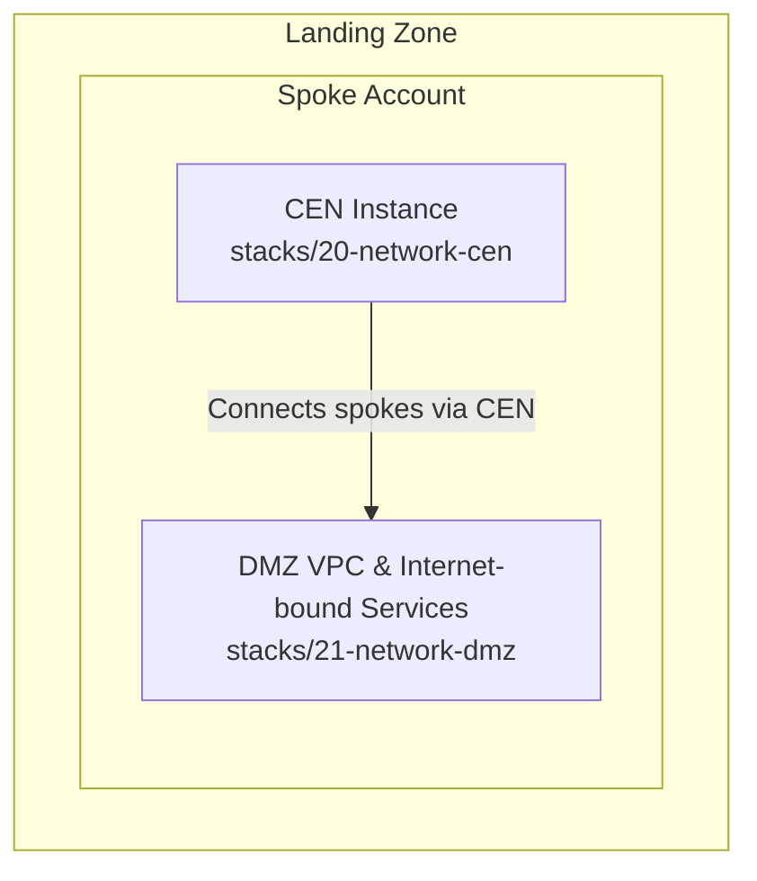
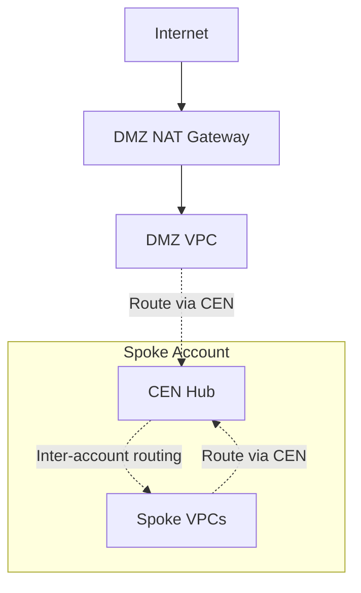
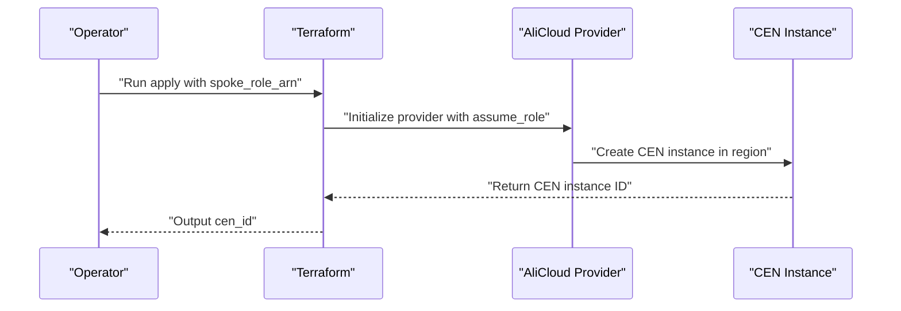
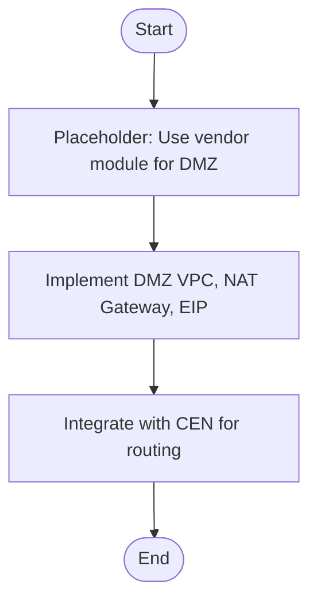
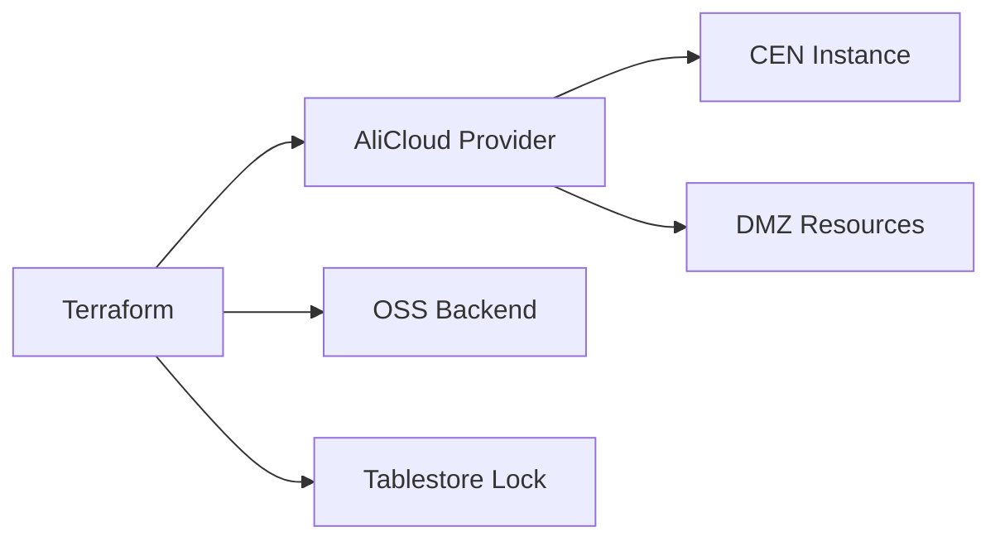

# Network Foundation

<cite>
**Referenced Files in This Document**
- [README.md](file://README.md)
- [20-network-cen/main.tf](file://stacks/20-network-cen/main.tf)
- [20-network-cen/variables.tf](file://stacks/20-network-cen/variables.tf)
- [20-network-cen/providers.tf](file://stacks/20-network-cen/providers.tf)
- [20-network-cen/outputs.tf](file://stacks/20-network-cen/outputs.tf)
- [20-network-cen/versions.tf](file://stacks/20-network-cen/versions.tf)
- [21-network-dmz/main.tf](file://stacks/21-network-dmz/main.tf)
- [21-network-dmz/variables.tf](file://stacks/21-network-dmz/variables.tf)
- [21-network-dmz/providers.tf](file://stacks/21-network-dmz/providers.tf)
- [21-network-dmz/versions.tf](file://stacks/21-network-dmz/versions.tf)
</cite>

## Table of Contents
1. [Introduction](#introduction)
2. [Project Structure](#project-structure)
3. [Core Components](#core-components)
4. [Architecture Overview](#architecture-overview)
5. [Detailed Component Analysis](#detailed-component-analysis)
6. [Dependency Analysis](#dependency-analysis)
7. [Performance Considerations](#performance-considerations)
8. [Troubleshooting Guide](#troubleshooting-guide)
9. [Conclusion](#conclusion)
10. [Appendices](#appendices)

## Introduction
This document describes the Network Foundation stack that establishes the core networking infrastructure within the Landing Zone. It focuses on the Cloud Enterprise Network (CEN) hub-and-spoke model, network segmentation strategies, and traffic routing foundations. It also documents the DMZ (Demilitarized Zone) setup for internet-facing services, security boundaries, and isolation patterns. The guide explains provider configuration for network operations, variable definitions for regions and roles, and integration touchpoints with VPC and subnet management. Guidance is included for security considerations, performance optimization, and troubleshooting connectivity issues.

## Project Structure
The Network Foundation is composed of two primary stacks:
- CEN (hub-and-spoke): Deploys the central CEN instance in the network spoke account.
- DMZ: Defines the DMZ VPC, NAT Gateway, and EIP resources for internet-facing workloads.

**Diagram sources**
- [20-network-cen/main.tf:12-16](file://stacks/20-network-cen/main.tf#L12-L16)
- [21-network-dmz/main.tf:1-10](file://stacks/21-network-dmz/main.tf#L1-L10)

**Section sources**
- [README.md:141-165](file://README.md#L141-L165)

## Core Components
- CEN Instance: Central network hub that enables inter-account communication and routing.
- DMZ VPC: Isolated network segment for internet-facing services with controlled ingress/egress.
- Provider Configuration: Uses Alibaba Cloud provider with role assumption for secure, least-privileged operations.
- Version Constraints: Enforces Terraform and provider versions and configures remote state with OSS backend and Tablestore locking.

Implementation highlights:
- CEN instance creation and output exposure for downstream consumers.
- Provider role assumption configured per stack to operate in the target spoke account.
- Remote state managed via OSS with encryption and distributed locking.

**Section sources**
- [20-network-cen/main.tf:12-16](file://stacks/20-network-cen/main.tf#L12-L16)
- [20-network-cen/outputs.tf:1-5](file://stacks/20-network-cen/outputs.tf#L1-L5)
- [20-network-cen/providers.tf:1-9](file://stacks/20-network-cen/providers.tf#L1-L9)
- [20-network-cen/versions.tf:1-18](file://stacks/20-network-cen/versions.tf#L1-L18)
- [21-network-dmz/providers.tf:1-9](file://stacks/21-network-dmz/providers.tf#L1-L9)
- [21-network-dmz/versions.tf:1-18](file://stacks/21-network-dmz/versions.tf#L1-L18)

## Architecture Overview
The Network Foundation establishes a hub-and-spoke topology:
- Hub: CEN instance in the network spoke account.
- Spokes: Member accounts’ VPCs connected to the hub via CEN.
- DMZ: Internet-facing services reside in a dedicated VPC with a NAT Gateway and Elastic IP for outbound internet access.

[No sources needed since this diagram shows conceptual workflow, not actual code structure]

## Detailed Component Analysis

### CEN Hub-and-Spoke Stack
Purpose:
- Deploy the central CEN instance in the network spoke account.
- Expose the CEN instance identifier for downstream stacks to attach VPCs and configure routes.

Key implementation patterns:
- Provider configuration assumes a spoke role ARN for secure operations.
- Variables define region and spoke role ARN injection via environment variables.
- Outputs expose the CEN instance ID for integration.

**Diagram sources**
- [20-network-cen/providers.tf:1-9](file://stacks/20-network-cen/providers.tf#L1-L9)
- [20-network-cen/main.tf:12-16](file://stacks/20-network-cen/main.tf#L12-L16)
- [20-network-cen/outputs.tf:1-5](file://stacks/20-network-cen/outputs.tf#L1-L5)

Operational notes:
- The CEN instance name is configurable via variable.
- The stack uses a pinned provider version and enforces a minimum Terraform version.
- Remote state is configured with OSS backend and Tablestore locking.

**Section sources**
- [20-network-cen/main.tf:12-16](file://stacks/20-network-cen/main.tf#L12-L16)
- [20-network-cen/variables.tf:1-17](file://stacks/20-network-cen/variables.tf#L1-L17)
- [20-network-cen/providers.tf:1-9](file://stacks/20-network-cen/providers.tf#L1-L9)
- [20-network-cen/outputs.tf:1-5](file://stacks/20-network-cen/outputs.tf#L1-L5)
- [20-network-cen/versions.tf:1-18](file://stacks/20-network-cen/versions.tf#L1-L18)

### DMZ Stack
Purpose:
- Define the DMZ VPC and associated internet-bound resources (NAT Gateway and EIP).
- Provide a secure, isolated perimeter for public-facing services.

Current status:
- The stack is a placeholder indicating production usage of a vendor module and includes a TODO to implement DMZ VPC configuration.

[No sources needed since this diagram shows conceptual workflow, not actual code structure]

Operational notes:
- Provider configuration mirrors the CEN stack with role assumption.
- Variables include region and spoke role ARN.
- Remote state is configured similarly with OSS backend and Tablestore locking.

**Section sources**
- [21-network-dmz/main.tf:1-10](file://stacks/21-network-dmz/main.tf#L1-L10)
- [21-network-dmz/variables.tf:1-11](file://stacks/21-network-dmz/variables.tf#L1-L11)
- [21-network-dmz/providers.tf:1-9](file://stacks/21-network-dmz/providers.tf#L1-L9)
- [21-network-dmz/versions.tf:1-18](file://stacks/21-network-dmz/versions.tf#L1-L18)

## Dependency Analysis
- Provider dependency: Both stacks depend on the Alibaba Cloud provider with version constraints.
- State backend: Both stacks configure remote state using OSS with Tablestore locking.
- Role assumption: Both stacks rely on a spoke role ARN injected via environment variables for cross-account operations.
- CEN integration: The DMZ stack is intended to integrate with the CEN instance produced by the CEN stack.

**Diagram sources**
- [20-network-cen/providers.tf:1-9](file://stacks/20-network-cen/providers.tf#L1-L9)
- [20-network-cen/versions.tf:9-16](file://stacks/20-network-cen/versions.tf#L9-L16)
- [21-network-dmz/providers.tf:1-9](file://stacks/21-network-dmz/providers.tf#L1-L9)
- [21-network-dmz/versions.tf:9-16](file://stacks/21-network-dmz/versions.tf#L9-L16)

**Section sources**
- [20-network-cen/versions.tf:1-18](file://stacks/20-network-cen/versions.tf#L1-L18)
- [21-network-dmz/versions.tf:1-18](file://stacks/21-network-dmz/versions.tf#L1-L18)

## Performance Considerations
- Prefer regional proximity: Place CEN and spoke VPCs in the same region to minimize latency.
- Route table optimization: Keep route tables minimal and avoid overlapping prefixes to reduce lookup overhead.
- NAT Gateway sizing: Right-size NAT capacity for peak outbound traffic in DMZ.
- Provider version stability: Pin provider versions to ensure predictable performance and compatibility.
- State backend throughput: Ensure OSS bucket and Tablestore table are provisioned in the same region as the Terraform runs.

[No sources needed since this section provides general guidance]

## Troubleshooting Guide
Common issues and resolutions:
- Authentication failures:
  - Verify the spoke role ARN is correctly passed and the role trusts the hub role.
  - Confirm session name and expiration are set appropriately in provider assume_role.
- Region mismatch:
  - Ensure the region variable matches the spoke account’s targeted region.
- State locking conflicts:
  - Check that the Tablestore lock table exists and is reachable.
  - Retry after resolving concurrent applies.
- Missing outputs:
  - Confirm the CEN output is present and capture it for downstream stacks.
- DMZ implementation gaps:
  - Replace the placeholder with the vendor module and implement VPC, NAT Gateway, and EIP resources.

**Section sources**
- [20-network-cen/providers.tf:1-9](file://stacks/20-network-cen/providers.tf#L1-L9)
- [20-network-cen/variables.tf:1-17](file://stacks/20-network-cen/variables.tf#L1-L17)
- [20-network-cen/versions.tf:9-16](file://stacks/20-network-cen/versions.tf#L9-L16)
- [20-network-cen/outputs.tf:1-5](file://stacks/20-network-cen/outputs.tf#L1-L5)
- [21-network-dmz/main.tf:1-10](file://stacks/21-network-dmz/main.tf#L1-L10)

## Conclusion
The Network Foundation stack establishes the essential building blocks for secure, scalable networking in the Landing Zone. The CEN hub-and-spoke model centralizes routing and inter-account connectivity, while the DMZ provides a hardened perimeter for internet-facing services. With provider-assumed roles, strict versioning, and remote state management, the foundation supports secure automation and operational reliability. Future enhancements should focus on completing the DMZ implementation and integrating route tables and VPC attachments to finalize the traffic routing configuration.

[No sources needed since this section summarizes without analyzing specific files]

## Appendices
- Provider configuration reference:
  - Region and assume_role settings for both stacks.
- Variable reference:
  - region, spoke_role_arn, and optional cen_name for CEN stack.
- State backend reference:
  - OSS bucket, prefix, key, region, and Tablestore endpoint/table for both stacks.

**Section sources**
- [20-network-cen/providers.tf:1-9](file://stacks/20-network-cen/providers.tf#L1-L9)
- [20-network-cen/variables.tf:1-17](file://stacks/20-network-cen/variables.tf#L1-L17)
- [20-network-cen/versions.tf:9-16](file://stacks/20-network-cen/versions.tf#L9-L16)
- [21-network-dmz/providers.tf:1-9](file://stacks/21-network-dmz/providers.tf#L1-L9)
- [21-network-dmz/versions.tf:9-16](file://stacks/21-network-dmz/versions.tf#L9-L16)