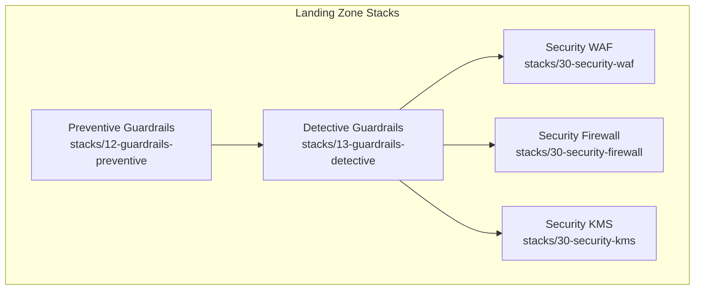
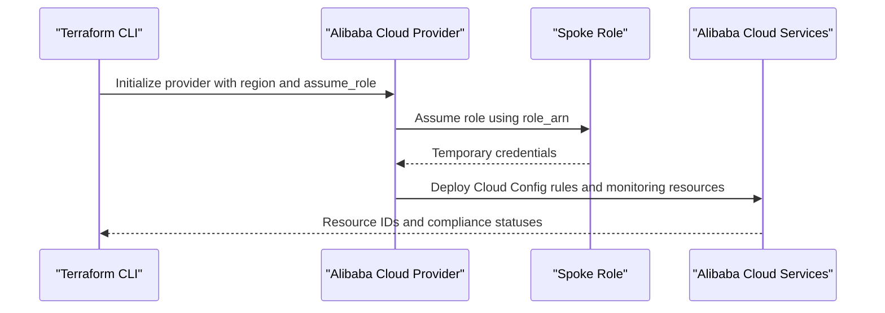
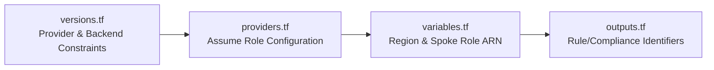
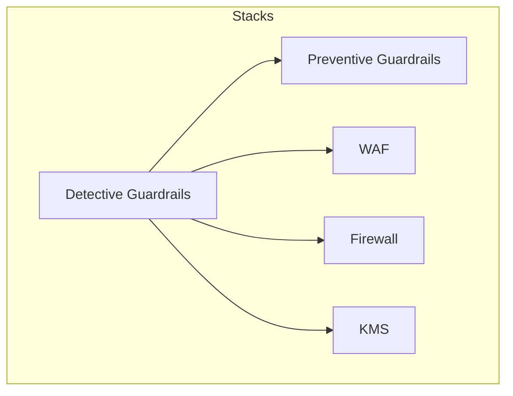

# Detective Guardrails

<cite>
**Referenced Files in This Document**
- [main.tf](file://stacks/13-guardrails-detective/main.tf)
- [variables.tf](file://stacks/13-guardrails-detective/variables.tf)
- [providers.tf](file://stacks/13-guardrails-detective/providers.tf)
- [versions.tf](file://stacks/13-guardrails-detective/versions.tf)
- [outputs.tf](file://stacks/13-guardrails-detective/outputs.tf)
- [main.tf](file://stacks/12-guardrails-preventive/main.tf)
- [variables.tf](file://stacks/12-guardrails-preventive/variables.tf)
- [providers.tf](file://stacks/12-guardrails-preventive/providers.tf)
- [versions.tf](file://stacks/12-guardrails-preventive/versions.tf)
- [outputs.tf](file://stacks/12-guardrails-preventive/outputs.tf)
- [providers.tf](file://stacks/30-security-waf/providers.tf)
- [versions.tf](file://stacks/30-security-waf/versions.tf)
- [providers.tf](file://stacks/30-security-firewall/providers.tf)
- [versions.tf](file://stacks/30-security-firewall/versions.tf)
- [providers.tf](file://stacks/30-security-kms/providers.tf)
- [versions.tf](file://stacks/30-security-kms/versions.tf)
</cite>

## Table of Contents
1. [Introduction](#introduction)
2. [Project Structure](#project-structure)
3. [Core Components](#core-components)
4. [Architecture Overview](#architecture-overview)
5. [Detailed Component Analysis](#detailed-component-analysis)
6. [Dependency Analysis](#dependency-analysis)
7. [Performance Considerations](#performance-considerations)
8. [Troubleshooting Guide](#troubleshooting-guide)
9. [Conclusion](#conclusion)
10. [Appendices](#appendices)

## Introduction
This document describes the Detective Guardrails component responsible for reactive security monitoring and alerting within the Landing Zone. It explains how compliance tracking detects security incidents and policy violations, outlines provider configuration for monitoring operations, and documents integration patterns with Alibaba Cloud monitoring services. It also covers alert triage, incident response workflows, continuous improvement processes, and the relationship between detective controls and overall security operations, including alert correlation, false positive reduction, and security analytics integration.

## Project Structure
The Detective Guardrails stack is organized as a Terraform-managed module within the Landing Zone accelerator. It defines provider configuration, variables, version constraints, and placeholders for outputs. The stack follows a consistent pattern with other Landing Zone stacks, including preventive guardrails and security enablers such as WAF, Firewall, and KMS.

**Diagram sources**
- [main.tf:1-10](file://stacks/12-guardrails-preventive/main.tf#L1-L10)
- [main.tf:1-10](file://stacks/13-guardrails-detective/main.tf#L1-L10)
- [providers.tf:1-8](file://stacks/30-security-waf/providers.tf#L1-L8)
- [providers.tf:1-8](file://stacks/30-security-firewall/providers.tf#L1-L8)
- [providers.tf:1-8](file://stacks/30-security-kms/providers.tf#L1-L8)

**Section sources**
- [main.tf:1-10](file://stacks/13-guardrails-detective/main.tf#L1-L10)
- [variables.tf:1-11](file://stacks/13-guardrails-detective/variables.tf#L1-L11)
- [providers.tf:1-9](file://stacks/13-guardrails-detective/providers.tf#L1-L9)
- [versions.tf:1-18](file://stacks/13-guardrails-detective/versions.tf#L1-L18)
- [outputs.tf:1-3](file://stacks/13-guardrails-detective/outputs.tf#L1-L3)

## Core Components
- Provider configuration: Uses the Alibaba Cloud provider with role assumption for cross-account operations.
- Variables: Defines region and spoke role ARN for secure operations.
- Version constraints: Ensures compatible Terraform and provider versions with remote state storage via OSS backend.
- Outputs: Placeholder for exporting Cloud Config rule IDs and compliance pack identifiers.

Implementation examples and integration patterns are documented below under Detailed Component Analysis.

**Section sources**
- [providers.tf:1-9](file://stacks/13-guardrails-detective/providers.tf#L1-L9)
- [variables.tf:1-11](file://stacks/13-guardrails-detective/variables.tf#L1-L11)
- [versions.tf:1-18](file://stacks/13-guardrails-detective/versions.tf#L1-L18)
- [outputs.tf:1-3](file://stacks/13-guardrails-detective/outputs.tf#L1-L3)

## Architecture Overview
The Detective Guardrails stack orchestrates reactive monitoring and alerting by integrating with Alibaba Cloud services. It assumes a spoke role to deploy and manage detective controls, aligning with Landing Zone governance and separation of duties.

**Diagram sources**
- [providers.tf:1-9](file://stacks/13-guardrails-detective/providers.tf#L1-L9)

## Detailed Component Analysis

### Provider Configuration for Monitoring Operations
- Region selection ensures resources are provisioned in the target Alibaba Cloud region.
- Role assumption enables cross-account operations using a spoke role ARN injected via environment variables.
- Session name and expiration define operational boundaries for the assumed role.

Integration patterns:
- Use a dedicated session name per stack to simplify audit trails.
- Align session expiration with CI/CD job durations to avoid premature credential expiry.

**Section sources**
- [providers.tf:1-9](file://stacks/13-guardrails-detective/providers.tf#L1-L9)
- [variables.tf:7-10](file://stacks/13-guardrails-detective/variables.tf#L7-L10)

### Variable Definitions for Alert Thresholds and Scope
- region: Target Alibaba Cloud region for resource deployment.
- spoke_role_arn: ARN of the spoke role to assume for cross-account operations.

Recommendations:
- Define environment-specific regions and enforce regional compliance policies.
- Parameterize spoke role ARNs per environment to support segregation of duties.

**Section sources**
- [variables.tf:1-11](file://stacks/13-guardrails-detective/variables.tf#L1-L11)

### Implementation Examples: Alert Rule Configuration
Note: The current stack is a placeholder. The following example outlines how to configure Cloud Config rules and compliance packs after implementing the module source.

Example patterns:
- Define Cloud Config rulesets aligned with organizational security baselines.
- Configure compliance packs to continuously evaluate resource configurations against standards.
- Export rule IDs and compliance pack IDs via outputs for downstream alerting systems.

Outputs:
- Expose Cloud Config rule IDs and compliance pack IDs for integration with monitoring and alerting platforms.

**Section sources**
- [outputs.tf:1-3](file://stacks/13-guardrails-detective/outputs.tf#L1-L3)

### Notification Delivery Mechanisms
- Integrate with Alibaba Cloud EventBridge for event routing and filtering.
- Use SNS topics to fan out alerts to teams and tools.
- Connect with Security Analytics services to enrich events with contextual metadata.

Operational guidance:
- Design topic subscriptions with appropriate filtering to reduce noise.
- Implement dead letter queues and retry policies for resilient delivery.

[No sources needed since this section provides general guidance]

### Integration with Security Orchestration Tools
- Use Alibaba Cloud SDKs or APIs to trigger playbooks in SOCs.
- Export Cloud Config compliance results to SIEM/SOAR for correlation and remediation.
- Establish webhook integrations for real-time alert forwarding.

[No sources needed since this section provides general guidance]

### Relationship Between Detective Controls and Security Operations
- Detective controls complement preventive controls by detecting deviations after the fact.
- Enable correlation across logs, metrics, and compliance signals to reduce false positives.
- Feed analytics pipelines to improve detection accuracy over time.

**Section sources**
- [main.tf:1-10](file://stacks/12-guardrails-preventive/main.tf#L1-L10)
- [main.tf:1-10](file://stacks/13-guardrails-detective/main.tf#L1-L10)

### Alert Triage Procedures and Incident Response Workflows
- Tiered alert classification: critical, high, medium, low.
- Automated suppression windows for planned maintenance.
- Escalation paths to primary and secondary responders with on-call rotations.

[No sources needed since this section provides general guidance]

### Continuous Improvement Processes
- Regular review of detection effectiveness and tuning of thresholds.
- Post-incident retrospectives to refine rules and alerting logic.
- Feedback loops with security analysts to reduce false positives.

[No sources needed since this section provides general guidance]

## Dependency Analysis
Detective Guardrails depends on provider configuration and version constraints similar to other Landing Zone stacks. It shares the same Alibaba Cloud provider assumptions and backend configuration patterns.

**Diagram sources**
- [versions.tf:1-18](file://stacks/13-guardrails-detective/versions.tf#L1-L18)
- [providers.tf:1-9](file://stacks/13-guardrails-detective/providers.tf#L1-L9)
- [variables.tf:1-11](file://stacks/13-guardrails-detective/variables.tf#L1-L11)
- [outputs.tf:1-3](file://stacks/13-guardrails-detective/outputs.tf#L1-L3)

**Section sources**
- [versions.tf:1-18](file://stacks/13-guardrails-detective/versions.tf#L1-L18)
- [providers.tf:1-9](file://stacks/13-guardrails-detective/providers.tf#L1-L9)
- [variables.tf:1-11](file://stacks/13-guardrails-detective/variables.tf#L1-L11)
- [outputs.tf:1-3](file://stacks/13-guardrails-detective/outputs.tf#L1-L3)

## Performance Considerations
- Minimize the number of Cloud Config rules to reduce evaluation overhead.
- Use targeted compliance packs to focus on mission-critical controls.
- Leverage incremental evaluations and caching where supported by Alibaba Cloud services.

[No sources needed since this section provides general guidance]

## Troubleshooting Guide
Common issues and resolutions:
- Authentication failures: Verify the spoke role ARN and session permissions.
- Region misconfiguration: Ensure the region variable matches the intended Alibaba Cloud region.
- State locking errors: Confirm OSS backend configuration and tablestore lock table settings.

**Section sources**
- [providers.tf:1-9](file://stacks/13-guardrails-detective/providers.tf#L1-L9)
- [versions.tf:9-17](file://stacks/13-guardrails-detective/versions.tf#L9-L17)

## Conclusion
The Detective Guardrails component establishes a foundation for reactive security monitoring and alerting within the Landing Zone. By leveraging Alibaba Cloud provider capabilities, centralized role assumption, and standardized configuration patterns, it enables scalable and auditable detection of security incidents and policy violations. As the implementation evolves, integrating Cloud Config rules, compliance packs, and robust alerting pipelines will strengthen the overall security posture.

[No sources needed since this section summarizes without analyzing specific files]

## Appendices

### Appendix A: Comparative Stack Patterns
Other Landing Zone stacks follow similar provider and version patterns, ensuring consistency across the platform.

**Diagram sources**
- [providers.tf:1-9](file://stacks/13-guardrails-detective/providers.tf#L1-L9)
- [versions.tf:1-18](file://stacks/13-guardrails-detective/versions.tf#L1-L18)
- [providers.tf:1-9](file://stacks/12-guardrails-preventive/providers.tf#L1-L9)
- [versions.tf:1-18](file://stacks/12-guardrails-preventive/versions.tf#L1-L18)
- [providers.tf:1-8](file://stacks/30-security-waf/providers.tf#L1-L8)
- [versions.tf:1-17](file://stacks/30-security-waf/versions.tf#L1-L17)
- [providers.tf:1-8](file://stacks/30-security-firewall/providers.tf#L1-L8)
- [versions.tf:1-17](file://stacks/30-security-firewall/versions.tf#L1-L17)
- [providers.tf:1-8](file://stacks/30-security-kms/providers.tf#L1-L8)
- [versions.tf:1-17](file://stacks/30-security-kms/versions.tf#L1-L17)