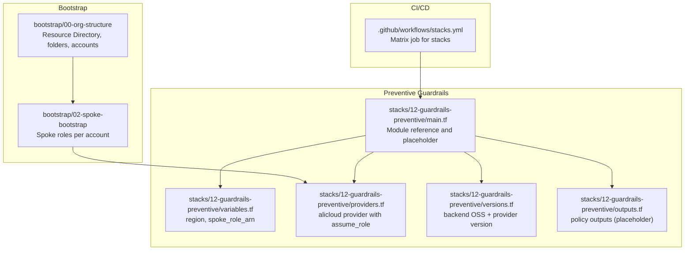
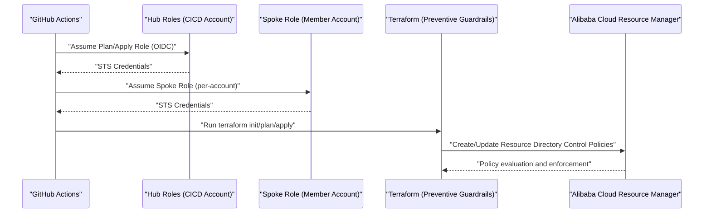
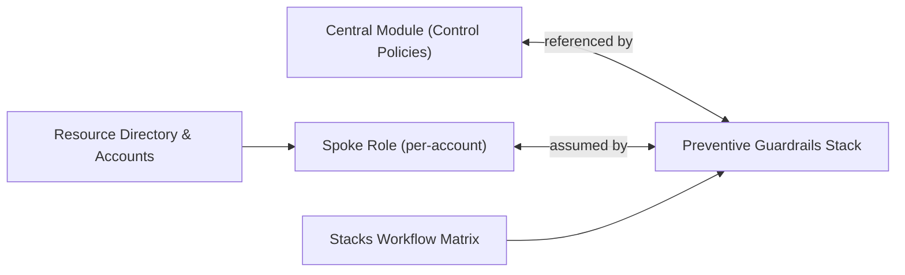

# Preventive Guardrails

<cite>
**Referenced Files in This Document**
- [README.md](file://README.md)
- [stacks/12-guardrails-preventive/main.tf](file://stacks/12-guardrails-preventive/main.tf)
- [stacks/12-guardrails-preventive/variables.tf](file://stacks/12-guardrails-preventive/variables.tf)
- [stacks/12-guardrails-preventive/providers.tf](file://stacks/12-guardrails-preventive/providers.tf)
- [stacks/12-guardrails-preventive/versions.tf](file://stacks/12-guardrails-preventive/versions.tf)
- [stacks/12-guardrails-preventive/outputs.tf](file://stacks/12-guardrails-preventive/outputs.tf)
- [stacks/13-guardrails-detective/main.tf](file://stacks/13-guardrails-detective/main.tf)
- [.github/workflows/stacks.yml](file://.github/workflows/stacks.yml)
- [bootstrap/00-org-structure/main.tf](file://bootstrap/00-org-structure/main.tf)
- [bootstrap/00-org-structure/outputs.tf](file://bootstrap/00-org-structure/outputs.tf)
- [bootstrap/01-cicd-foundation/providers.tf](file://bootstrap/01-cicd-foundation/providers.tf)
- [bootstrap/02-spoke-bootstrap/providers.tf](file://bootstrap/02-spoke-bootstrap/providers.tf)
</cite>

## Table of Contents
1. [Introduction](#introduction)
2. [Project Structure](#project-structure)
3. [Core Components](#core-components)
4. [Architecture Overview](#architecture-overview)
5. [Detailed Component Analysis](#detailed-component-analysis)
6. [Dependency Analysis](#dependency-analysis)
7. [Performance Considerations](#performance-considerations)
8. [Troubleshooting Guide](#troubleshooting-guide)
9. [Conclusion](#conclusion)

## Introduction
This document describes the Preventive Guardrails component that enforces proactive security controls within the Landing Zone using Alibaba Cloud Resource Directory Control Policies. It explains how the stack is configured to define and enforce policies that prevent unauthorized resource creation and configuration changes, outlines provider configuration for secure operations, and documents integration patterns with Alibaba Cloud Resource Manager. It also covers policy effectiveness measurement, compliance reporting, and operational procedures for violations, along with the relationship between preventive controls and the overall security posture, including policy cascading, exception handling, and remediation workflows.

## Project Structure
The Preventive Guardrails stack is one of several stacks orchestrated by the CI/CD pipeline. It is designed to be applied against a target spoke account using OIDC-assumed roles and an OSS-backed Terraform state. The stack references a module that encapsulates the Resource Directory Control Policies implementation.

**Diagram sources**
- [.github/workflows/stacks.yml:27](file://.github/workflows/stacks.yml#L27)
- [bootstrap/00-org-structure/main.tf:1](file://bootstrap/00-org-structure/main.tf#L1)
- [bootstrap/02-spoke-bootstrap/providers.tf:1](file://bootstrap/02-spoke-bootstrap/providers.tf#L1)
- [stacks/12-guardrails-preventive/main.tf:1](file://stacks/12-guardrails-preventive/main.tf#L1)
- [stacks/12-guardrails-preventive/variables.tf:1](file://stacks/12-guardrails-preventive/variables.tf#L1)
- [stacks/12-guardrails-preventive/providers.tf:1](file://stacks/12-guardrails-preventive/providers.tf#L1)
- [stacks/12-guardrails-preventive/versions.tf:1](file://stacks/12-guardrails-preventive/versions.tf#L1)
- [stacks/12-guardrails-preventive/outputs.tf:1](file://stacks/12-guardrails-preventive/outputs.tf#L1)

**Section sources**
- [README.md:141](file://README.md#L141)
- [README.md:152](file://README.md#L152)
- [.github/workflows/stacks.yml:27](file://.github/workflows/stacks.yml#L27)

## Core Components
- Preventive Guardrails stack entrypoint: Defines a module reference and a placeholder for Resource Directory Control Policies.
- Provider configuration: Uses assume_role to securely assume a spoke role for operations.
- Variables: Exposes region and spoke_role_arn for flexible targeting.
- Versioning and backend: Locks provider version and configures OSS backend with Tablestore locking.
- Outputs: Intended to surface control policy identifiers and related metadata.

Implementation highlights:
- The module reference indicates that the actual policy definitions reside in a centralized module consumed by this stack.
- The provider assumes a spoke role per account, aligning with the Landing Zone’s least-privilege and separation-of-concerns model.
- The backend configuration ensures encrypted state storage and distributed locking.

**Section sources**
- [stacks/12-guardrails-preventive/main.tf:1](file://stacks/12-guardrails-preventive/main.tf#L1)
- [stacks/12-guardrails-preventive/providers.tf:1](file://stacks/12-guardrails-preventive/providers.tf#L1)
- [stacks/12-guardrails-preventive/variables.tf:1](file://stacks/12-guardrails-preventive/variables.tf#L1)
- [stacks/12-guardrails-preventive/versions.tf:1](file://stacks/12-guardrails-preventive/versions.tf#L1)
- [stacks/12-guardrails-preventive/outputs.tf:1](file://stacks/12-guardrails-preventive/outputs.tf#L1)

## Architecture Overview
The Preventive Guardrails stack participates in the CI/CD pipeline and operates against a spoke account via OIDC-assumed roles. It integrates with Alibaba Cloud Resource Manager to enforce control policies at the account level.

**Diagram sources**
- [.github/workflows/stacks.yml:42](file://.github/workflows/stacks.yml#L42)
- [.github/workflows/stacks.yml:94](file://.github/workflows/stacks.yml#L94)
- [stacks/12-guardrails-preventive/providers.tf:3](file://stacks/12-guardrails-preventive/providers.tf#L3)
- [bootstrap/02-spoke-bootstrap/providers.tf:7](file://bootstrap/02-spoke-bootstrap/providers.tf#L7)

## Detailed Component Analysis

### Preventive Guardrails Stack
- Purpose: Enforce Resource Directory Control Policies to prevent unauthorized resource creation and configuration changes.
- Module reference: The stack references a centralized module that defines and manages control policies.
- Placeholder content: The main.tf file includes comments indicating the module source and a TODO to implement RD Control Policies.
- Outputs: The outputs file is a placeholder for surfacing control policy IDs and related metadata.

Operational flow:
- The CI/CD workflow triggers the Preventive Guardrails stack as part of the matrix deployment.
- The provider configuration assumes the appropriate spoke role per account.
- The stack applies the module that enforces control policies against the target account.

```mermaid
flowchart TD
Start(["Deploy Preventive Guardrails"]) --> LoadVars["Load variables<br/>region, spoke_role_arn"]
LoadVars --> Init["terraform init"]
Init --> Plan["terraform plan"]
Plan --> Apply{"Apply?"}
Apply --> |Yes| RunApply["terraform apply"]
RunApply --> ModuleRef["Reference central module<br/>for Resource Directory Control Policies"]
ModuleRef --> Enforce["Enforce control policies<br/>against target account"]
Enforce --> End(["Complete"])
Apply --> |No| End
```

**Diagram sources**
- [stacks/12-guardrails-preventive/main.tf:1](file://stacks/12-guardrails-preventive/main.tf#L1)
- [stacks/12-guardrails-preventive/variables.tf:1](file://stacks/12-guardrails-preventive/variables.tf#L1)
- [stacks/12-guardrails-preventive/providers.tf:1](file://stacks/12-guardrails-preventive/providers.tf#L1)
- [.github/workflows/stacks.yml:56](file://.github/workflows/stacks.yml#L56)
- [.github/workflows/stacks.yml:108](file://.github/workflows/stacks.yml#L108)

**Section sources**
- [stacks/12-guardrails-preventive/main.tf:1](file://stacks/12-guardrails-preventive/main.tf#L1)
- [stacks/12-guardrails-preventive/variables.tf:1](file://stacks/12-guardrails-preventive/variables.tf#L1)
- [stacks/12-guardrails-preventive/providers.tf:1](file://stacks/12-guardrails-preventive/providers.tf#L1)
- [stacks/12-guardrails-preventive/versions.tf:1](file://stacks/12-guardrails-preventive/versions.tf#L1)
- [stacks/12-guardrails-preventive/outputs.tf:1](file://stacks/12-guardrails-preventive/outputs.tf#L1)
- [.github/workflows/stacks.yml:27](file://.github/workflows/stacks.yml#L27)

### Provider Configuration for Security Operations
- Provider aliasing: The stack uses assume_role to chain from hub roles into the spoke account.
- Session configuration: Includes session_name and session_expiration for auditability and lifecycle control.
- Consistency: Similar patterns appear across other stacks, ensuring uniform security posture.

Integration pattern:
- The CI/CD workflow sets TF_VAR_spoke_role_arn dynamically per stack.
- The provider block assumes the spoke role for the duration of the Terraform run.

**Section sources**
- [stacks/12-guardrails-preventive/providers.tf:1](file://stacks/12-guardrails-preventive/providers.tf#L1)
- [.github/workflows/stacks.yml:58](file://.github/workflows/stacks.yml#L58)
- [.github/workflows/stacks.yml:110](file://.github/workflows/stacks.yml#L110)
- [bootstrap/02-spoke-bootstrap/providers.tf:7](file://bootstrap/02-spoke-bootstrap/providers.tf#L7)

### Integration with Alibaba Cloud Resource Manager
- Resource Directory enablement: The bootstrap phase creates the Resource Directory, folders, and member accounts.
- Folder and account mapping: Outputs expose root folder and account IDs for downstream stacks.
- Policy scope: Control policies are enforced at the account level via the spoke role.

Operational context:
- The Preventive Guardrails stack targets a specific spoke account using the spoke role.
- The module consumes Resource Directory APIs to create and update control policies.

**Section sources**
- [bootstrap/00-org-structure/main.tf:1](file://bootstrap/00-org-structure/main.tf#L1)
- [bootstrap/00-org-structure/outputs.tf:1](file://bootstrap/00-org-structure/outputs.tf#L1)
- [stacks/12-guardrails-preventive/providers.tf:3](file://stacks/12-guardrails-preventive/providers.tf#L3)

### Relationship Between Preventive Controls and Security Posture
- Proactive prevention: Control policies block unauthorized changes before they occur.
- Cascading effects: Policies apply across resources within the target account according to Resource Manager semantics.
- Exception handling: Exceptions can be granted via Resource Manager exceptions; the module should support exception parameters.
- Remediation workflows: Non-compliant resources should be identified and remediated through automated or manual workflows.

[No sources needed since this section synthesizes conceptual relationships]

### Policy Definition Syntax, Compliance Thresholds, and Automated Enforcement
- Policy definition syntax: Defined within the central module referenced by the stack; the stack main.tf indicates the module source.
- Compliance thresholds: Managed by the module; thresholds can include resource types, regions, tags, and configuration constraints.
- Automated enforcement: Controlled policies are evaluated by Resource Manager during resource operations; failures block provisioning or changes.

[No sources needed since this section describes module-level behavior conceptually]

### Policy Effectiveness Measurement and Compliance Reporting
- Effectiveness measurement: Track policy evaluation results and violation counts via Resource Manager reporting.
- Compliance reporting: Surface policy IDs and statuses via stack outputs; integrate with monitoring dashboards.
- Audit trails: Leverage OSS backend state and CI/CD logs for auditability.

[No sources needed since this section provides general guidance]

### Operational Procedures for Policy Violations
- Detection: CI/CD plans and applies surface policy violations.
- Escalation: Route violations to designated reviewers or security teams.
- Remediation: Correct misconfigurations or request exceptions through proper channels.
- Retest: Re-run plan/apply after remediation to confirm compliance.

[No sources needed since this section provides general guidance]

## Dependency Analysis
The Preventive Guardrails stack depends on:
- Central module for Resource Directory Control Policies (referenced in main.tf).
- Spoke role assumption via provider configuration.
- CI/CD orchestration via the stacks workflow matrix.

**Diagram sources**
- [stacks/12-guardrails-preventive/main.tf:1](file://stacks/12-guardrails-preventive/main.tf#L1)
- [stacks/12-guardrails-preventive/providers.tf:3](file://stacks/12-guardrails-preventive/providers.tf#L3)
- [.github/workflows/stacks.yml:27](file://.github/workflows/stacks.yml#L27)
- [bootstrap/00-org-structure/main.tf:1](file://bootstrap/00-org-structure/main.tf#L1)

**Section sources**
- [stacks/12-guardrails-preventive/main.tf:1](file://stacks/12-guardrails-preventive/main.tf#L1)
- [stacks/12-guardrails-preventive/providers.tf:1](file://stacks/12-guardrails-preventive/providers.tf#L1)
- [.github/workflows/stacks.yml:27](file://.github/workflows/stacks.yml#L27)
- [bootstrap/00-org-structure/main.tf:1](file://bootstrap/00-org-structure/main.tf#L1)

## Performance Considerations
- Minimize policy scope: Define precise resource filters to reduce evaluation overhead.
- Batch deployments: Group related changes to reduce repeated policy evaluations.
- State performance: Use OSS backend with Tablestore locking to avoid contention and ensure fast initialization.

[No sources needed since this section provides general guidance]

## Troubleshooting Guide
Common issues and resolutions:
- Authentication failures: Verify OIDC provider ARN, plan/apply role ARNs, and session assumptions in the workflow and provider blocks.
- Permission errors: Confirm the spoke role has sufficient permissions to manage Resource Directory Control Policies.
- State locking: Resolve concurrent apply conflicts using the OSS backend and Tablestore lock table.
- Policy evaluation failures: Review policy definitions and thresholds; ensure exceptions are documented and approved.

**Section sources**
- [.github/workflows/stacks.yml:42](file://.github/workflows/stacks.yml#L42)
- [.github/workflows/stacks.yml:94](file://.github/workflows/stacks.yml#L94)
- [stacks/12-guardrails-preventive/providers.tf:1](file://stacks/12-guardrails-preventive/providers.tf#L1)
- [stacks/12-guardrails-preventive/versions.tf:9](file://stacks/12-guardrails-preventive/versions.tf#L9)

## Conclusion
The Preventive Guardrails stack establishes proactive security controls by enforcing Resource Directory Control Policies against target spoke accounts. Through OIDC-assisted role chaining, centralized module consumption, and CI/CD orchestration, it integrates seamlessly into the Landing Zone’s security framework. While the current stack main.tf indicates a placeholder for policy implementation, the provider configuration, variable exposure, backend setup, and workflow integration collectively support robust, auditable, and scalable enforcement aligned with the overall security posture.