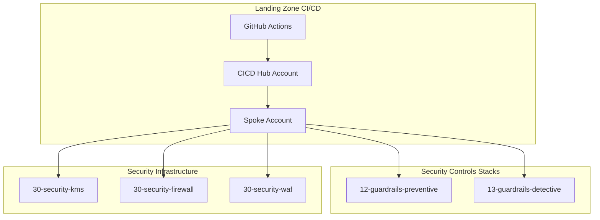
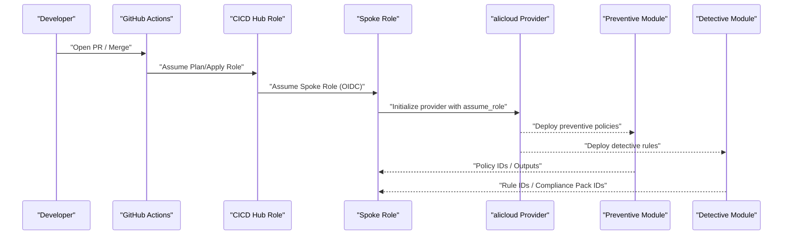
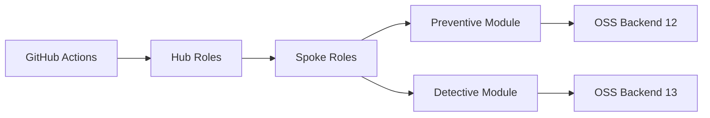

# Security Controls

<cite>
**Referenced Files in This Document**
- [README.md](file://README.md)
- [stacks/12-guardrails-preventive/main.tf](file://stacks/12-guardrails-preventive/main.tf)
- [stacks/12-guardrails-preventive/variables.tf](file://stacks/12-guardrails-preventive/variables.tf)
- [stacks/12-guardrails-preventive/providers.tf](file://stacks/12-guardrails-preventive/providers.tf)
- [stacks/12-guardrails-preventive/versions.tf](file://stacks/12-guardrails-preventive/versions.tf)
- [stacks/13-guardrails-detective/main.tf](file://stacks/13-guardrails-detective/main.tf)
- [stacks/13-guardrails-detective/variables.tf](file://stacks/13-guardrails-detective/variables.tf)
- [stacks/13-guardrails-detective/providers.tf](file://stacks/13-guardrails-detective/providers.tf)
- [stacks/13-guardrails-detective/versions.tf](file://stacks/13-guardrails-detective/versions.tf)
- [stacks/30-security-firewall/main.tf](file://stacks/30-security-firewall/main.tf)
- [stacks/30-security-kms/main.tf](file://stacks/30-security-kms/main.tf)
- [stacks/30-security-waf/main.tf](file://stacks/30-security-waf/main.tf)
</cite>

## Table of Contents
1. [Introduction](#introduction)
2. [Project Structure](#project-structure)
3. [Core Components](#core-components)
4. [Architecture Overview](#architecture-overview)
5. [Detailed Component Analysis](#detailed-component-analysis)
6. [Dependency Analysis](#dependency-analysis)
7. [Performance Considerations](#performance-considerations)
8. [Troubleshooting Guide](#troubleshooting-guide)
9. [Conclusion](#conclusion)
10. [Appendices](#appendices)

## Introduction
This document describes the Security Controls stack that implements both preventive and detective guardrails within the Alibaba Cloud Landing Zone. It explains how the current repository organizes these guardrails, outlines implementation patterns for policy enforcement and monitoring/alerting, and provides guidance for integrating with security orchestration tools. It also covers provider configuration, variable definitions, compliance thresholds, and operational procedures for incident response and continuous improvement.

## Project Structure
The Security Controls stack is organized as two dedicated Terraform stacks:
- Preventive guardrails: Resource Directory Control Policies
- Detective guardrails: Cloud Config rules

These stacks are designed to be deployed per spoke account and use OIDC-assumed roles for least-privilege operations. Supporting security infrastructure stacks (KMS, Firewall, WAF) are present but currently placeholders in this demo.

**Diagram sources**
- [README.md:106-113](file://README.md#L106-L113)
- [stacks/12-guardrails-preventive/providers.tf:1-9](file://stacks/12-guardrails-preventive/providers.tf#L1-L9)
- [stacks/13-guardrails-detective/providers.tf:1-9](file://stacks/13-guardrails-detective/providers.tf#L1-L9)

**Section sources**
- [README.md:141-165](file://README.md#L141-L165)
- [stacks/12-guardrails-preventive/versions.tf:1-18](file://stacks/12-guardrails-preventive/versions.tf#L1-L18)
- [stacks/13-guardrails-detective/versions.tf:1-18](file://stacks/13-guardrails-detective/versions.tf#L1-L18)

## Core Components
- Preventive Guardrails (Resource Directory Control Policies): Enforce organizational and resource policies to prevent misconfigurations and unauthorized changes at source.
- Detective Guardrails (Cloud Config rules): Continuously monitor resources and evaluate compliance against predefined rules, generating alerts on violations.
- Supporting Security Infrastructure: KMS for encryption keys, Firewall for network protection, and WAF for web traffic filtering.

Implementation status in this demo:
- Preventive and Detective guardrails are placeholders that reference upstream modules in the Landing Zone Accelerator (LZA).
- Security infrastructure stacks are placeholders indicating where those modules would be integrated.

**Section sources**
- [stacks/12-guardrails-preventive/main.tf:1-10](file://stacks/12-guardrails-preventive/main.tf#L1-L10)
- [stacks/13-guardrails-detective/main.tf:1-10](file://stacks/13-guardrails-detective/main.tf#L1-L10)
- [stacks/30-security-kms/main.tf:1-10](file://stacks/30-security-kms/main.tf#L1-L10)
- [stacks/30-security-firewall/main.tf:1-10](file://stacks/30-security-firewall/main.tf#L1-L10)
- [stacks/30-security-waf/main.tf:1-10](file://stacks/30-security-waf/main.tf#L1-L10)

## Architecture Overview
The Security Controls architecture leverages:
- OIDC-based identity federation for secure, short-lived credentials
- Separate provider configurations per stack to isolate permissions
- Per-stacks state backends for auditability and isolation
- Placeholder modules that integrate with LZA’s guardrails and security components

**Diagram sources**
- [README.md:28](file://README.md#L28)
- [README.md:106-113](file://README.md#L106-L113)
- [stacks/12-guardrails-preventive/providers.tf:1-9](file://stacks/12-guardrails-preventive/providers.tf#L1-L9)
- [stacks/13-guardrails-detective/providers.tf:1-9](file://stacks/13-guardrails-detective/providers.tf#L1-L9)

## Detailed Component Analysis

### Preventive Guardrails (Resource Directory Control Policies)
Purpose:
- Enforce organizational and resource policies to prevent prohibited actions or misconfigurations during provisioning.

Current Implementation Pattern:
- The stack references an upstream LZA module for preventive guardrails.
- Provider assumes a spoke role with a session name and expiration configured per stack.
- Variables define region and spoke role ARN, enabling per-account operation.

Provider and Variables:
- Region selection and spoke role assumption are defined in the provider configuration.
- Variables include region and spoke role ARN, with the latter injected via environment variables.

Outputs:
- Outputs are reserved for control policy identifiers and related metadata.

Operational Guidance:
- Integrate with LZA’s preventive module to configure policies aligned with organizational standards.
- Define policy exceptions and remediation procedures in your security framework.
- Track policy assignment and compliance outcomes via outputs and logs.

**Section sources**
- [stacks/12-guardrails-preventive/main.tf:1-10](file://stacks/12-guardrails-preventive/main.tf#L1-L10)
- [stacks/12-guardrails-preventive/providers.tf:1-9](file://stacks/12-guardrails-preventive/providers.tf#L1-L9)
- [stacks/12-guardrails-preventive/variables.tf:1-11](file://stacks/12-guardrails-preventive/variables.tf#L1-L11)
- [stacks/12-guardrails-preventive/outputs.tf:1-3](file://stacks/12-guardrails-preventive/outputs.tf#L1-L3)

### Detective Guardrails (Cloud Config Rules)
Purpose:
- Continuously evaluate resources against compliance rules and trigger alerts on violations.

Current Implementation Pattern:
- The stack references an upstream LZA module for detective guardrails.
- Provider configuration mirrors preventive stack with separate session name and role assumption.
- Variables define region and spoke role ARN for per-account operation.

Outputs:
- Outputs are reserved for Cloud Config rule IDs and compliance pack identifiers.

Operational Guidance:
- Integrate with LZA’s detective module to define and manage Cloud Config rules.
- Establish alerting integrations (e.g., event rules, SLS, or SIEM) to notify on rule violations.
- Periodically review rule effectiveness and tune thresholds to reduce noise while maintaining coverage.

**Section sources**
- [stacks/13-guardrails-detective/main.tf:1-10](file://stacks/13-guardrails-detective/main.tf#L1-L10)
- [stacks/13-guardrails-detective/providers.tf:1-9](file://stacks/13-guardrails-detective/providers.tf#L1-L9)
- [stacks/13-guardrails-detective/variables.tf:1-11](file://stacks/13-guardrails-detective/variables.tf#L1-L11)
- [stacks/13-guardrails-detective/outputs.tf:1-3](file://stacks/13-guardrails-detective/outputs.tf#L1-L3)

### Supporting Security Infrastructure
- KMS: Customer Master Keys for encryption and key management.
- Firewall: Network-level protection via Cloud Firewall.
- WAF: Web application firewall for HTTP(S) traffic filtering.

Status:
- These stacks are placeholders indicating where LZA modules would be integrated.

Integration Guidance:
- After deploying preventive and detective guardrails, integrate KMS for encryption, Firewall for network segmentation, and WAF for web traffic protection.
- Align security controls with compliance frameworks and define thresholds for alerting and reporting.

**Section sources**
- [stacks/30-security-kms/main.tf:1-10](file://stacks/30-security-kms/main.tf#L1-L10)
- [stacks/30-security-firewall/main.tf:1-10](file://stacks/30-security-firewall/main.tf#L1-L10)
- [stacks/30-security-waf/main.tf:1-10](file://stacks/30-security-waf/main.tf#L1-L10)

## Dependency Analysis
- Identity and Access:
  - GitHub Actions assume roles in the hub account, which then assume spoke roles in member accounts.
  - Providers in each stack use assume_role blocks to operate under the spoke role.
- State Management:
  - Each stack defines its own OSS backend and Tablestore lock table for state storage and concurrency control.
- Module Dependencies:
  - Preventive and detective stacks depend on upstream LZA modules referenced in main.tf.

**Diagram sources**
- [README.md:28](file://README.md#L28)
- [README.md:106-113](file://README.md#L106-L113)
- [stacks/12-guardrails-preventive/versions.tf:9-17](file://stacks/12-guardrails-preventive/versions.tf#L9-L17)
- [stacks/13-guardrails-detective/versions.tf:9-17](file://stacks/13-guardrails-detective/versions.tf#L9-L17)

**Section sources**
- [README.md:106-113](file://README.md#L106-L113)
- [stacks/12-guardrails-preventive/versions.tf:1-18](file://stacks/12-guardrails-preventive/versions.tf#L1-L18)
- [stacks/13-guardrails-detective/versions.tf:1-18](file://stacks/13-guardrails-detective/versions.tf#L1-L18)

## Performance Considerations
- Provider Session Expiration: Both stacks set a 1-hour session expiration for assume_role sessions. This balances operational convenience with security.
- State Locking: Tablestore-based locking prevents concurrent applies, reducing conflicts and rework.
- Drift Detection: Schedule periodic plan-only runs to catch configuration drift early.

[No sources needed since this section provides general guidance]

## Troubleshooting Guide
Common Issues and Remedies:
- Authentication Failures:
  - Verify OIDC provider ARN and hub role ARNs are correctly configured in repository variables.
  - Confirm the spoke role ARN passed to the stacks matches the spoke account and role name.
- Permission Denied:
  - Ensure the spoke role attached to the provider has permissions to create and manage guardrail resources.
  - Review least-privilege role assignments and avoid broad administrative permissions.
- State Lock Conflicts:
  - Resolve concurrent applies by waiting for locks to release or investigate failed runs.
  - Confirm OSS backend credentials and Tablestore table availability.
- Drift and Non-Compliance:
  - Use plan-only scheduled runs to surface drift.
  - Review detective rule outputs and adjust thresholds or rules accordingly.

**Section sources**
- [README.md:96-105](file://README.md#L96-L105)
- [README.md:129-139](file://README.md#L129-L139)
- [stacks/12-guardrails-preventive/providers.tf:1-9](file://stacks/12-guardrails-preventive/providers.tf#L1-L9)
- [stacks/13-guardrails-detective/providers.tf:1-9](file://stacks/13-guardrails-detective/providers.tf#L1-L9)

## Conclusion
The Security Controls stack establishes a foundation for both preventive and detective guardrails within the Landing Zone. By leveraging OIDC-based identity federation, per-stack provider configurations, and upstream LZA modules, teams can enforce policies and continuously monitor compliance. Integrating supporting security infrastructure and establishing robust alerting and incident response procedures will further strengthen the security posture and enable continuous improvement.

[No sources needed since this section summarizes without analyzing specific files]

## Appendices

### Implementation Examples and Patterns

- Preventive Policy Configuration
  - Reference the upstream preventive module and pass spoke role ARN and region.
  - Define policy exceptions and remediation workflows in your security framework.
  - Capture outputs for policy IDs and compliance metrics.

- Detective Monitoring Setup
  - Reference the upstream detective module and pass spoke role ARN and region.
  - Define Cloud Config rules aligned with compliance requirements.
  - Capture outputs for rule IDs and compliance pack identifiers.

- Alerting Rules
  - Integrate with event rules or log services to trigger alerts on rule violations.
  - Define thresholds and suppression windows to balance sensitivity and signal quality.

- Provider Configuration
  - Use assume_role with a unique session name per stack.
  - Set session expiration to align with operational needs and security posture.

- Variable Definitions
  - region: Target Alibaba Cloud region.
  - spoke_role_arn: ARN of the spoke role to assume (injected via environment variables).

- Integration Patterns
  - Connect outputs to downstream systems (e.g., SIEM, ticketing) for automated remediation.
  - Use scheduled plan-only runs to detect drift and maintain continuous compliance.

**Section sources**
- [stacks/12-guardrails-preventive/main.tf:1-10](file://stacks/12-guardrails-preventive/main.tf#L1-L10)
- [stacks/13-guardrails-detective/main.tf:1-10](file://stacks/13-guardrails-detective/main.tf#L1-L10)
- [stacks/12-guardrails-preventive/providers.tf:1-9](file://stacks/12-guardrails-preventive/providers.tf#L1-L9)
- [stacks/13-guardrails-detective/providers.tf:1-9](file://stacks/13-guardrails-detective/providers.tf#L1-L9)
- [stacks/12-guardrails-preventive/variables.tf:1-11](file://stacks/12-guardrails-preventive/variables.tf#L1-L11)
- [stacks/13-guardrails-detective/variables.tf:1-11](file://stacks/13-guardrails-detective/variables.tf#L1-L11)