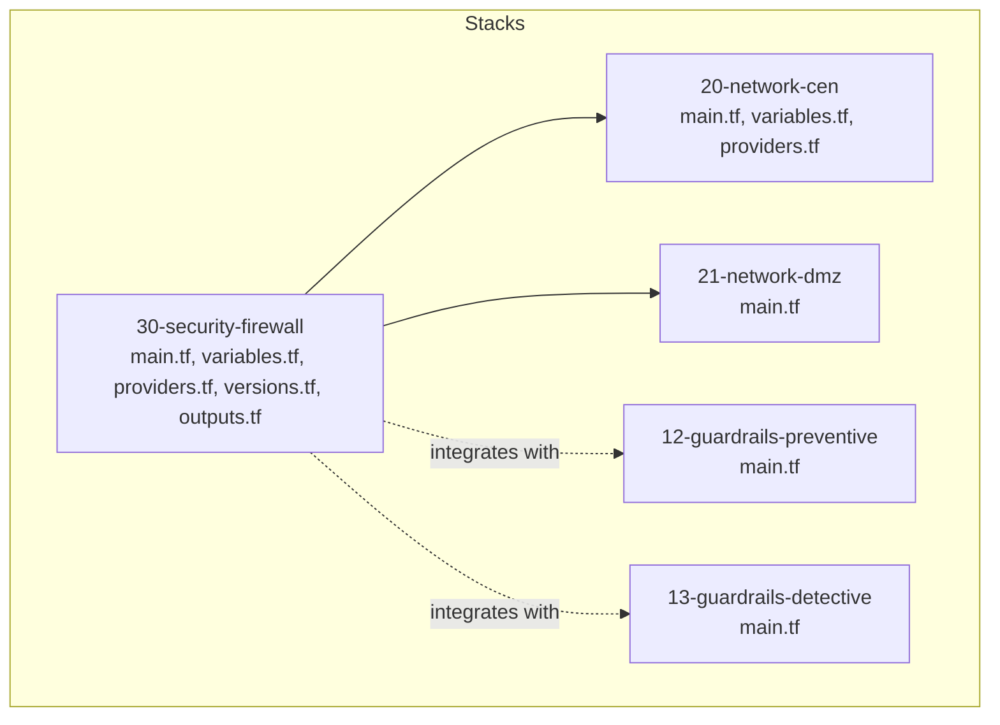
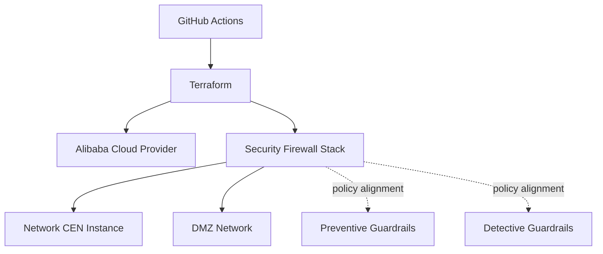
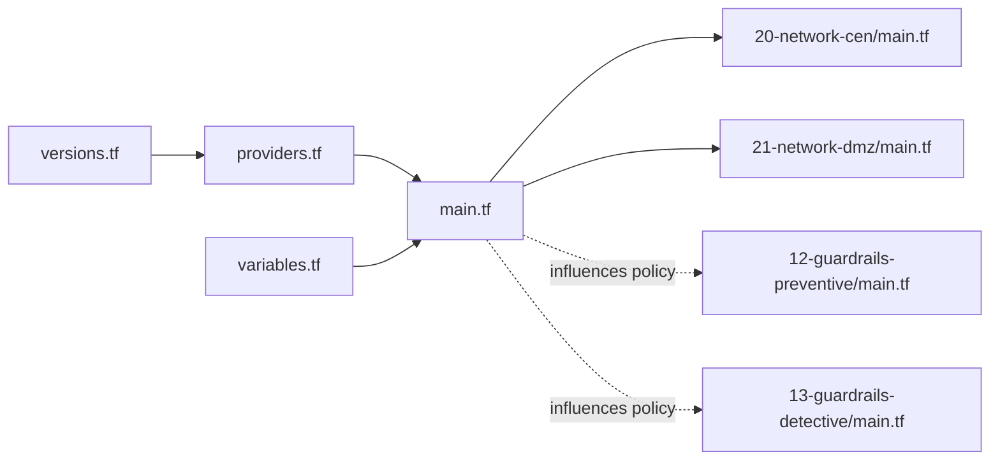

# Firewall Rules

<cite>
**Referenced Files in This Document**
- [README.md](file://README.md)
- [stacks/30-security-firewall/main.tf](file://stacks/30-security-firewall/main.tf)
- [stacks/30-security-firewall/variables.tf](file://stacks/30-security-firewall/variables.tf)
- [stacks/30-security-firewall/providers.tf](file://stacks/30-security-firewall/providers.tf)
- [stacks/30-security-firewall/versions.tf](file://stacks/30-security-firewall/versions.tf)
- [stacks/30-security-firewall/outputs.tf](file://stacks/30-security-firewall/outputs.tf)
- [stacks/20-network-cen/main.tf](file://stacks/20-network-cen/main.tf)
- [stacks/20-network-cen/variables.tf](file://stacks/20-network-cen/variables.tf)
- [stacks/20-network-cen/providers.tf](file://stacks/20-network-cen/providers.tf)
- [stacks/21-network-dmz/main.tf](file://stacks/21-network-dmz/main.tf)
- [stacks/12-guardrails-preventive/main.tf](file://stacks/12-guardrails-preventive/main.tf)
- [stacks/13-guardrails-detective/main.tf](file://stacks/13-guardrails-detective/main.tf)
</cite>

## Table of Contents
1. [Introduction](#introduction)
2. [Project Structure](#project-structure)
3. [Core Components](#core-components)
4. [Architecture Overview](#architecture-overview)
5. [Detailed Component Analysis](#detailed-component-analysis)
6. [Dependency Analysis](#dependency-analysis)
7. [Performance Considerations](#performance-considerations)
8. [Troubleshooting Guide](#troubleshooting-guide)
9. [Conclusion](#conclusion)
10. [Appendices](#appendices)

## Introduction
This document describes the network security firewall rules stack intended to manage access control and traffic filtering at the network level within the Alibaba Cloud Landing Zone Accelerator demo. It focuses on how security groups, network ACLs, and firewall rule configuration can be modeled to control inbound and outbound traffic, segment networks, and integrate with VPC networks and subnets. It also covers provider configuration, variable definitions for rule specifications and priority settings, monitoring and auditing, and operational best practices such as rule optimization and troubleshooting.

The repository demonstrates a modular, stack-based deployment model using Terraform with Alibaba Cloud provider configuration and GitHub Actions automation. The firewall stack currently contains placeholders and is intended to be implemented against the vendor-provided Landing Zone Accelerator modules.

## Project Structure
The repository organizes resources by functional domains into “stacks.” The firewall stack resides under stacks/30-security-firewall and follows the same pattern as other stacks: a main configuration file, variables, provider configuration, version constraints, and outputs. Supporting network foundations are present in stacks/20-network-cen and stacks/21-network-dmz, while guardrail stacks illustrate preventive and detective controls.

**Diagram sources**
- [stacks/30-security-firewall/main.tf:1-10](file://stacks/30-security-firewall/main.tf#L1-L10)
- [stacks/30-security-firewall/variables.tf:1-11](file://stacks/30-security-firewall/variables.tf#L1-L11)
- [stacks/30-security-firewall/providers.tf:1-9](file://stacks/30-security-firewall/providers.tf#L1-L9)
- [stacks/30-security-firewall/versions.tf:1-17](file://stacks/30-security-firewall/versions.tf#L1-L17)
- [stacks/30-security-firewall/outputs.tf:1-3](file://stacks/30-security-firewall/outputs.tf#L1-L3)
- [stacks/20-network-cen/main.tf:1-16](file://stacks/20-network-cen/main.tf#L1-L16)
- [stacks/20-network-cen/variables.tf:1-17](file://stacks/20-network-cen/variables.tf#L1-L17)
- [stacks/20-network-cen/providers.tf:1-8](file://stacks/20-network-cen/providers.tf#L1-L8)
- [stacks/21-network-dmz/main.tf:1-10](file://stacks/21-network-dmz/main.tf#L1-L10)
- [stacks/12-guardrails-preventive/main.tf:1-10](file://stacks/12-guardrails-preventive/main.tf#L1-L10)
- [stacks/13-guardrails-detective/main.tf:1-10](file://stacks/13-guardrails-detective/main.tf#L1-L10)

**Section sources**
- [README.md:141-165](file://README.md#L141-L165)
- [stacks/30-security-firewall/main.tf:1-10](file://stacks/30-security-firewall/main.tf#L1-L10)
- [stacks/30-security-firewall/variables.tf:1-11](file://stacks/30-security-firewall/variables.tf#L1-L11)
- [stacks/30-security-firewall/providers.tf:1-9](file://stacks/30-security-firewall/providers.tf#L1-L9)
- [stacks/30-security-firewall/versions.tf:1-17](file://stacks/30-security-firewall/versions.tf#L1-L17)
- [stacks/30-security-firewall/outputs.tf:1-3](file://stacks/30-security-firewall/outputs.tf#L1-L3)
- [stacks/20-network-cen/main.tf:1-16](file://stacks/20-network-cen/main.tf#L1-L16)
- [stacks/20-network-cen/variables.tf:1-17](file://stacks/20-network-cen/variables.tf#L1-L17)
- [stacks/20-network-cen/providers.tf:1-8](file://stacks/20-network-cen/providers.tf#L1-L8)
- [stacks/21-network-dmz/main.tf:1-10](file://stacks/21-network-dmz/main.tf#L1-L10)
- [stacks/12-guardrails-preventive/main.tf:1-10](file://stacks/12-guardrails-preventive/main.tf#L1-L10)
- [stacks/13-guardrails-detective/main.tf:1-10](file://stacks/13-guardrails-detective/main.tf#L1-L10)

## Core Components
- Provider configuration: The Alibaba Cloud provider is configured with region and role assumption for the firewall stack, enabling secure, short-lived credentials via the spoke role ARN.
- Version constraints: The firewall stack pins the Alibaba Cloud provider version and configures an OSS backend with Tablestore-based locking for state management.
- Variables: Region and spoke role ARN are defined as inputs to parameterize deployments across environments and accounts.
- Placeholder implementation: The main configuration file indicates a future integration with the vendor’s firewall module and includes a TODO to implement Cloud Firewall configuration.

Practical implications:
- Provider configuration ensures least-privilege access and aligns with the repository’s security model.
- Version constraints and backend configuration support reproducible, auditable deployments.
- Variables enable environment-specific customization without changing code.

**Section sources**
- [stacks/30-security-firewall/providers.tf:1-9](file://stacks/30-security-firewall/providers.tf#L1-L9)
- [stacks/30-security-firewall/versions.tf:1-17](file://stacks/30-security-firewall/versions.tf#L1-L17)
- [stacks/30-security-firewall/variables.tf:1-11](file://stacks/30-security-firewall/variables.tf#L1-L11)
- [stacks/30-security-firewall/main.tf:1-10](file://stacks/30-security-firewall/main.tf#L1-L10)

## Architecture Overview
The firewall stack is designed to operate within the Landing Zone network topology. It integrates with:
- VPC and routing via CEN (hub-and-spoke) for inter-account connectivity.
- DMZ network constructs for perimeter defense.
- Guardrails for preventive and detective controls to complement firewall policies.

**Diagram sources**
- [stacks/30-security-firewall/providers.tf:1-9](file://stacks/30-security-firewall/providers.tf#L1-L9)
- [stacks/20-network-cen/main.tf:12-16](file://stacks/20-network-cen/main.tf#L12-L16)
- [stacks/21-network-dmz/main.tf:1-10](file://stacks/21-network-dmz/main.tf#L1-L10)
- [stacks/12-guardrails-preventive/main.tf:1-10](file://stacks/12-guardrails-preventive/main.tf#L1-L10)
- [stacks/13-guardrails-detective/main.tf:1-10](file://stacks/13-guardrails-detective/main.tf#L1-L10)

## Detailed Component Analysis

### Security Groups
Security groups act as virtual firewalls for ECS instances and other resources, controlling inbound and outbound traffic at the instance level. Recommended modeling:
- Define security groups per tier (web, app, db) with minimal ingress rules.
- Use tags or naming conventions to associate groups with VPCs and subnets.
- Enforce principle of least privilege—only allow necessary ports and protocols.

Operational guidance:
- Maintain separate groups for management and application traffic.
- Regularly review and prune unused rules to reduce attack surface.

### Network ACLs (VPC-level)
Network ACLs filter traffic at the subnet level, providing stateless packet filtering. Recommended modeling:
- Deny by default, allow specific CIDR/port combinations.
- Segment subnets by trust boundary (public, private, isolated).
- Log and audit ACL decisions for compliance.

Operational guidance:
- Align ACL rules with security group policies to avoid conflicts.
- Monitor for unexpected drops and adjust rules accordingly.

### Firewall Rule Configuration
High-level rule configuration patterns:
- Inbound rules: Restrict source IP ranges, limit protocols (TCP/UDP), and specify destination ports.
- Outbound rules: Permit only known egress destinations (e.g., public package repositories, update servers).
- Priority ordering: Place more specific rules before general ones; deny rules placed before allow rules when necessary.

Rule specification variables:
- Source/Destination CIDRs and FQDNs.
- Protocols and port ranges.
- Rule action (allow/deny).
- Rule priority and description for auditability.

Integration with VPC and subnets:
- Associate ACLs with subnets; attach security groups to NICs of instances.
- Ensure route tables and CEN routes do not bypass ACLs or security groups unintentionally.

Monitoring and auditing:
- Enable logging for firewall events and integrate with log analytics.
- Periodic reviews and automated alerts for rule drift or anomalies.

### Provider Configuration for Firewall Operations
Provider configuration in the firewall stack:
- Region selection for consistent resource placement.
- Role assumption via assume_role with a session name and expiration to enforce least privilege and short-lived credentials.

Best practices:
- Use dedicated spoke roles per account and environment.
- Limit provider permissions to only what is required for firewall provisioning.

**Section sources**
- [stacks/30-security-firewall/providers.tf:1-9](file://stacks/30-security-firewall/providers.tf#L1-L9)
- [stacks/30-security-firewall/variables.tf:1-11](file://stacks/30-security-firewall/variables.tf#L1-L11)

### Variable Definitions for Rule Specifications and Priority Settings
Recommended variables for firewall rule management:
- rule_name: Unique identifier for each rule.
- direction: Ingress or Egress.
- action: Allow or Deny.
- priority: Numeric priority value for rule ordering.
- source_cidrs: List of source IP ranges.
- destination_cidrs: List of destination IP ranges.
- protocols: List of protocols (TCP/UDP/ICMP/ANY).
- ports: List of destination ports or port ranges.
- description: Human-readable rule purpose for audit trails.

Priority settings:
- Lower numeric values take precedence when multiple rules match.
- Place restrictive deny rules before permissive allow rules when needed.

**Section sources**
- [stacks/30-security-firewall/variables.tf:1-11](file://stacks/30-security-firewall/variables.tf#L1-L11)

### Integration with VPC Networks and Subnets
- CEN instance establishes cross-account network connectivity and route propagation among spokes.
- DMZ stack defines perimeter network constructs suitable for public-facing workloads.
- Firewall rules should complement ACLs and security groups to achieve layered protection.

Operational guidance:
- Ensure subnets are tagged consistently for automated rule targeting.
- Validate route tables and CEN route propagation do not introduce unintended exposure.

**Section sources**
- [stacks/20-network-cen/main.tf:12-16](file://stacks/20-network-cen/main.tf#L12-L16)
- [stacks/21-network-dmz/main.tf:1-10](file://stacks/21-network-dmz/main.tf#L1-L10)

### Practical Examples
Note: The firewall stack main file indicates a future integration with vendor modules and includes a TODO to implement Cloud Firewall configuration. The following examples describe recommended patterns for rule creation and traffic flow control.

Example: Inbound web traffic rule
- Purpose: Allow HTTPS from the internet to load balancers in the DMZ.
- Direction: Ingress
- Source: Internet-facing CIDR
- Destination: Load balancer security group
- Protocol: TCP
- Ports: 443
- Action: Allow
- Priority: 100

Example: Outbound package updates rule
- Purpose: Permit outbound package manager updates.
- Direction: Egress
- Source: Application servers
- Destination: Public package repositories
- Protocol: TCP/UDP
- Ports: 80/443
- Action: Allow
- Priority: 200

Example: Traffic flow control
- Use ACLs to block all inbound traffic except approved ports.
- Use security groups to further restrict instance-level access.
- Combine with CEN routes to ensure traffic traverses approved paths.

[No sources needed since this subsection provides conceptual examples]

### Firewall Rule Effectiveness Monitoring
- Enable logging for firewall events and export logs to a centralized log service.
- Set up dashboards to track rule hit counts and denied connections.
- Establish alerting thresholds for unusual spikes in denied traffic.

Automated rule management
- Use infrastructure-as-code to version-control rule sets.
- Implement periodic audits to detect orphaned or redundant rules.
- Integrate with change management workflows to approve rule modifications.

[No sources needed since this subsection provides general guidance]

### Security Audit Procedures
- Maintain immutable records of rule changes with timestamps and approvers.
- Conduct quarterly reviews of rule effectiveness and necessity.
- Align firewall policies with organizational security baselines and compliance frameworks.

[No sources needed since this subsection provides general guidance]

## Dependency Analysis
The firewall stack depends on:
- Alibaba Cloud provider configuration and assumed role for provisioning.
- Network foundation stacks (CEN and DMZ) for VPC and routing context.
- Guardrail stacks for complementary preventive and detective controls.

**Diagram sources**
- [stacks/30-security-firewall/versions.tf:1-17](file://stacks/30-security-firewall/versions.tf#L1-L17)
- [stacks/30-security-firewall/providers.tf:1-9](file://stacks/30-security-firewall/providers.tf#L1-L9)
- [stacks/30-security-firewall/variables.tf:1-11](file://stacks/30-security-firewall/variables.tf#L1-L11)
- [stacks/30-security-firewall/main.tf:1-10](file://stacks/30-security-firewall/main.tf#L1-L10)
- [stacks/20-network-cen/main.tf:12-16](file://stacks/20-network-cen/main.tf#L12-L16)
- [stacks/21-network-dmz/main.tf:1-10](file://stacks/21-network-dmz/main.tf#L1-L10)
- [stacks/12-guardrails-preventive/main.tf:1-10](file://stacks/12-guardrails-preventive/main.tf#L1-L10)
- [stacks/13-guardrails-detective/main.tf:1-10](file://stacks/13-guardrails-detective/main.tf#L1-L10)

**Section sources**
- [stacks/30-security-firewall/versions.tf:1-17](file://stacks/30-security-firewall/versions.tf#L1-L17)
- [stacks/30-security-firewall/providers.tf:1-9](file://stacks/30-security-firewall/providers.tf#L1-L9)
- [stacks/30-security-firewall/variables.tf:1-11](file://stacks/30-security-firewall/variables.tf#L1-L11)
- [stacks/30-security-firewall/main.tf:1-10](file://stacks/30-security-firewall/main.tf#L1-L10)
- [stacks/20-network-cen/main.tf:12-16](file://stacks/20-network-cen/main.tf#L12-L16)
- [stacks/21-network-dmz/main.tf:1-10](file://stacks/21-network-dmz/main.tf#L1-L10)
- [stacks/12-guardrails-preventive/main.tf:1-10](file://stacks/12-guardrails-preventive/main.tf#L1-L10)
- [stacks/13-guardrails-detective/main.tf:1-10](file://stacks/13-guardrails-detective/main.tf#L1-L10)

## Performance Considerations
- Minimize the number of rules and keep rule specificity high to reduce evaluation overhead.
- Prefer CIDR blocks aligned with actual traffic needs to avoid unnecessary wildcard rules.
- Use hierarchical rule organization (by tier, protocol, port) to improve maintainability and performance.

[No sources needed since this section provides general guidance]

## Troubleshooting Guide
Common connectivity issues caused by firewall restrictions:
- Unexpected egress failures: Verify outbound rules permit required destinations and ports; confirm ACLs do not block traffic.
- Ingress blocked from trusted networks: Review security group and ACL rules for overlapping deny statements.
- Route conflicts: Ensure CEN routes and VPC route tables do not bypass ACLs or security groups unintentionally.

Operational steps:
- Correlate firewall logs with VPC flow logs to identify dropped packets.
- Temporarily add permissive allow rules for testing, then tighten after confirming root cause.
- Validate rule priorities and confirm deny rules are not overriding allow rules unintentionally.

[No sources needed since this section provides general guidance]

## Conclusion
The firewall stack in this repository establishes the foundation for secure, auditable, and automated network access control using Alibaba Cloud resources. While the current implementation is a placeholder, the documented patterns for security groups, network ACLs, and firewall rule configuration provide a blueprint for building robust traffic filtering policies. Integrating with the CEN and DMZ stacks, along with preventive and detective guardrails, enables a comprehensive network security architecture. Adopting the recommended practices for rule specification, monitoring, and troubleshooting will help maintain secure and performant network operations.

[No sources needed since this section summarizes without analyzing specific files]

## Appendices

### Appendix A: Provider and Backend Configuration Reference
- Provider region and assume_role configuration for secure, short-lived credentials.
- Backend configuration for state storage and locking.

**Section sources**
- [stacks/30-security-firewall/providers.tf:1-9](file://stacks/30-security-firewall/providers.tf#L1-L9)
- [stacks/30-security-firewall/versions.tf:9-16](file://stacks/30-security-firewall/versions.tf#L9-L16)

### Appendix B: Relationship Between Stacks and Network Security
- CEN provides cross-account routing context for firewall traffic.
- DMZ defines perimeter boundaries suitable for strict ingress controls.
- Guardrails complement firewall policies with governance and detection.

**Section sources**
- [stacks/20-network-cen/main.tf:12-16](file://stacks/20-network-cen/main.tf#L12-L16)
- [stacks/21-network-dmz/main.tf:1-10](file://stacks/21-network-dmz/main.tf#L1-L10)
- [stacks/12-guardrails-preventive/main.tf:1-10](file://stacks/12-guardrails-preventive/main.tf#L1-L10)
- [stacks/13-guardrails-detective/main.tf:1-10](file://stacks/13-guardrails-detective/main.tf#L1-L10)