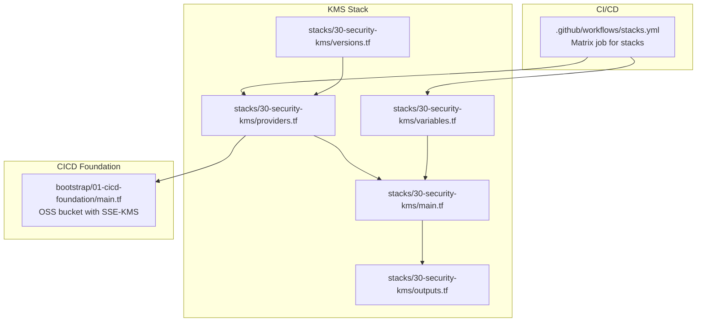
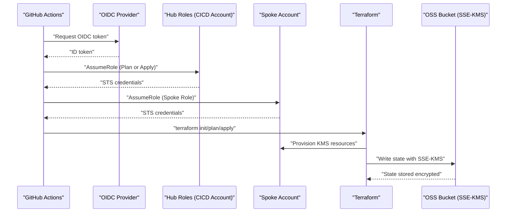
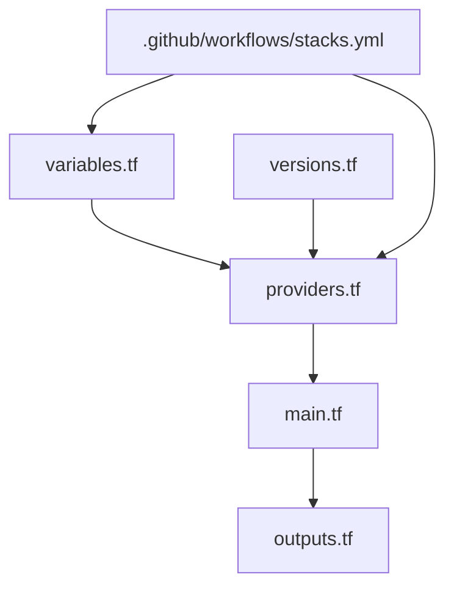

# KMS Encryption

<cite>
**Referenced Files in This Document**
- [README.md](file://README.md)
- [stacks/30-security-kms/main.tf](file://stacks/30-security-kms/main.tf)
- [stacks/30-security-kms/variables.tf](file://stacks/30-security-kms/variables.tf)
- [stacks/30-security-kms/providers.tf](file://stacks/30-security-kms/providers.tf)
- [stacks/30-security-kms/outputs.tf](file://stacks/30-security-kms/outputs.tf)
- [stacks/30-security-kms/versions.tf](file://stacks/30-security-kms/versions.tf)
- [.github/workflows/stacks.yml](file://.github/workflows/stacks.yml)
- [bootstrap/01-cicd-foundation/main.tf](file://bootstrap/01-cicd-foundation/main.tf)
</cite>

## Table of Contents
1. [Introduction](#introduction)
2. [Project Structure](#project-structure)
3. [Core Components](#core-components)
4. [Architecture Overview](#architecture-overview)
5. [Detailed Component Analysis](#detailed-component-analysis)
6. [Dependency Analysis](#dependency-analysis)
7. [Performance Considerations](#performance-considerations)
8. [Troubleshooting Guide](#troubleshooting-guide)
9. [Conclusion](#conclusion)
10. [Appendices](#appendices)

## Introduction
This document describes the KMS (Key Management Service) encryption stack within the Alibaba Cloud Landing Zone Accelerator demo. It focuses on how customer master keys (CMKs) are provisioned and managed to support encrypted data storage, particularly Terraform state encryption at rest in OSS. The repository demonstrates a CI/CD-driven approach using GitHub Actions and OIDC-based short-lived credentials to provision and operate KMS-backed resources. The KMS stack in this repository currently serves as a placeholder for CMK configuration and is intended to be implemented using the Landing Zone Accelerator (LZA) module ecosystem.

Key goals addressed:
- Define provider configuration for KMS operations
- Outline variable definitions for key specifications and access controls
- Describe security best practices for key management
- Explain integration with OSS for encrypted state storage
- Provide practical examples of key configuration and automated rotation setup
- Detail backup and recovery procedures, compliance, and monitoring approaches
- Clarify the relationship between KMS keys and encrypted resources, plus troubleshooting guidance

## Project Structure
The KMS stack is organized as a Terraform stack under stacks/30-security-kms. It includes standard Terraform files for providers, variables, versions, and outputs, along with a placeholder for CMK provisioning. The CI/CD pipeline in .github/workflows/stacks.yml orchestrates plan and apply jobs for this stack, assuming spoke roles per account.

**Diagram sources**
- [.github/workflows/stacks.yml:31-33](file://.github/workflows/stacks.yml#L31-L33)
- [stacks/30-security-kms/main.tf:1-10](file://stacks/30-security-kms/main.tf#L1-L10)
- [stacks/30-security-kms/providers.tf:1-9](file://stacks/30-security-kms/providers.tf#L1-L9)
- [stacks/30-security-kms/variables.tf:1-11](file://stacks/30-security-kms/variables.tf#L1-L11)
- [stacks/30-security-kms/outputs.tf:1-3](file://stacks/30-security-kms/outputs.tf#L1-L3)
- [stacks/30-security-kms/versions.tf:1-18](file://stacks/30-security-kms/versions.tf#L1-L18)
- [bootstrap/01-cicd-foundation/main.tf:5-25](file://bootstrap/01-cicd-foundation/main.tf#L5-L25)

**Section sources**
- [README.md:141-165](file://README.md#L141-L165)
- [.github/workflows/stacks.yml:31-33](file://.github/workflows/stacks.yml#L31-L33)
- [stacks/30-security-kms/main.tf:1-10](file://stacks/30-security-kms/main.tf#L1-L10)
- [stacks/30-security-kms/providers.tf:1-9](file://stacks/30-security-kms/providers.tf#L1-L9)
- [stacks/30-security-kms/variables.tf:1-11](file://stacks/30-security-kms/variables.tf#L1-L11)
- [stacks/30-security-kms/outputs.tf:1-3](file://stacks/30-security-kms/outputs.tf#L1-L3)
- [stacks/30-security-kms/versions.tf:1-18](file://stacks/30-security-kms/versions.tf#L1-L18)
- [bootstrap/01-cicd-foundation/main.tf:5-25](file://bootstrap/01-cicd-foundation/main.tf#L5-L25)

## Core Components
- Provider configuration: Configures the Alibaba Cloud provider with OIDC-assumed role and region, enabling KMS operations within the spoke account.
- Variables: Defines region and spoke role ARN variables used to parameterize provider configuration and enable cross-account operations.
- Versions: Declares the minimum Terraform version and Alibaba Cloud provider version, and configures the OSS backend for state storage.
- Placeholder main.tf: Indicates where CMK configuration will be implemented, referencing the LZA module source for production use.
- Outputs: Intended to expose CMK identifiers and aliases for downstream consumers.

Security model highlights:
- No long-lived credentials are used; GitHub Actions exchange OIDC tokens for short-lived STS credentials.
- Encrypted state: OSS buckets use SSE-KMS for server-side encryption, aligning with secure state management.

**Section sources**
- [stacks/30-security-kms/providers.tf:1-9](file://stacks/30-security-kms/providers.tf#L1-L9)
- [stacks/30-security-kms/variables.tf:1-11](file://stacks/30-security-kms/variables.tf#L1-L11)
- [stacks/30-security-kms/versions.tf:1-18](file://stacks/30-security-kms/versions.tf#L1-L18)
- [stacks/30-security-kms/main.tf:1-10](file://stacks/30-security-kms/main.tf#L1-L10)
- [stacks/30-security-kms/outputs.tf:1-3](file://stacks/30-security-kms/outputs.tf#L1-L3)
- [README.md:106-112](file://README.md#L106-L112)
- [bootstrap/01-cicd-foundation/main.tf:14-16](file://bootstrap/01-cicd-foundation/main.tf#L14-L16)

## Architecture Overview
The KMS stack participates in a CI/CD-driven provisioning flow. GitHub Actions configure Alibaba Cloud credentials using OIDC, then Terraform initializes and applies the stack against the target spoke account. The OSS backend in the CICD account encrypts Terraform state using KMS, ensuring secure state management across environments.

**Diagram sources**
- [.github/workflows/stacks.yml:42-47](file://.github/workflows/stacks.yml#L42-L47)
- [.github/workflows/stacks.yml:94-99](file://.github/workflows/stacks.yml#L94-L99)
- [stacks/30-security-kms/providers.tf:3-7](file://stacks/30-security-kms/providers.tf#L3-L7)
- [bootstrap/01-cicd-foundation/main.tf:14-16](file://bootstrap/01-cicd-foundation/main.tf#L14-L16)

## Detailed Component Analysis

### Provider Configuration for KMS Operations
- Region and role assumption: The provider block sets the Alibaba Cloud region and uses assume_role to configure short-lived credentials for the spoke account.
- Session expiration: The session_name and session_expiration help track and limit the lifetime of credentials during CI/CD runs.
- Cross-account operation: The spoke role ARN is passed via TF_VAR_spoke_role_arn, enabling Terraform to assume the role in the target account.

Implementation notes:
- Use a dedicated spoke role per account to enforce least privilege.
- Keep session expiration aligned with CI/CD needs (e.g., 1 hour) to minimize exposure windows.

**Section sources**
- [stacks/30-security-kms/providers.tf:1-9](file://stacks/30-security-kms/providers.tf#L1-L9)
- [.github/workflows/stacks.yml:58](file://.github/workflows/stacks.yml#L58)
- [.github/workflows/stacks.yml:110](file://.github/workflows/stacks.yml#L110)

### Variables for Key Specifications and Access Controls
- region: Specifies the Alibaba Cloud region for KMS operations.
- spoke_role_arn: Supplies the ARN of the spoke role to assume, injected via environment variables in the CI/CD workflow.

Recommendations:
- Parameterize region per environment to ensure consistent key placement.
- Store spoke_role_arn securely in repository variables and avoid hardcoding.

**Section sources**
- [stacks/30-security-kms/variables.tf:1-11](file://stacks/30-security-kms/variables.tf#L1-L11)
- [.github/workflows/stacks.yml:58](file://.github/workflows/stacks.yml#L58)
- [.github/workflows/stacks.yml:110](file://.github/workflows/stacks.yml#L110)

### Version Constraints and Backend Configuration
- Minimum Terraform version ensures compatibility with OIDC-based provider authentication.
- Alibaba Cloud provider version pinning guarantees reproducible builds.
- OSS backend configuration centralizes state storage with locking and encryption.

Operational impact:
- Backend encryption with SSE-KMS protects state at rest.
- Tablestore-based locking prevents concurrent applies.

**Section sources**
- [stacks/30-security-kms/versions.tf:1-18](file://stacks/30-security-kms/versions.tf#L1-L18)
- [bootstrap/01-cicd-foundation/main.tf:9-16](file://bootstrap/01-cicd-foundation/main.tf#L9-L16)

### Placeholder Implementation and LZA Module Integration
- The main.tf file indicates where CMK configuration will be implemented and references the LZA module source for production deployments.
- Outputs are reserved for exposing CMK identifiers and aliases.

Next steps:
- Replace the placeholder with a module block sourcing the LZA KMS component.
- Define variables for key policies, rotation periods, and key usage permissions.
- Emit outputs for CMK ARNs and aliases for integration with encrypted resources.

**Section sources**
- [stacks/30-security-kms/main.tf:1-10](file://stacks/30-security-kms/main.tf#L1-L10)
- [stacks/30-security-kms/outputs.tf:1-3](file://stacks/30-security-kms/outputs.tf#L1-L3)

### CI/CD Orchestration for KMS Stack
- The stacks workflow includes the KMS stack in both plan and apply matrices.
- Credentials are assumed using OIDC, and the spoke role ARN is supplied via environment variables.

Best practices:
- Use separate roles for plan (read-only) and apply (read-write) to reduce risk.
- Gate apply behind environment approval and require reviewers.

**Section sources**
- [.github/workflows/stacks.yml:31-33](file://.github/workflows/stacks.yml#L31-L33)
- [.github/workflows/stacks.yml:69-85](file://.github/workflows/stacks.yml#L69-L85)
- [.github/workflows/stacks.yml:42-47](file://.github/workflows/stacks.yml#L42-L47)
- [.github/workflows/stacks.yml:94-99](file://.github/workflows/stacks.yml#L94-L99)

## Dependency Analysis
The KMS stack depends on:
- Provider configuration for Alibaba Cloud and role assumption
- CI/CD orchestration to supply spoke role ARNs
- OSS backend encryption for state protection

**Diagram sources**
- [stacks/30-security-kms/providers.tf:1-9](file://stacks/30-security-kms/providers.tf#L1-L9)
- [stacks/30-security-kms/variables.tf:1-11](file://stacks/30-security-kms/variables.tf#L1-L11)
- [stacks/30-security-kms/main.tf:1-10](file://stacks/30-security-kms/main.tf#L1-L10)
- [stacks/30-security-kms/outputs.tf:1-3](file://stacks/30-security-kms/outputs.tf#L1-L3)
- [stacks/30-security-kms/versions.tf:1-18](file://stacks/30-security-kms/versions.tf#L1-L18)
- [.github/workflows/stacks.yml:31-33](file://.github/workflows/stacks.yml#L31-L33)

**Section sources**
- [stacks/30-security-kms/providers.tf:1-9](file://stacks/30-security-kms/providers.tf#L1-L9)
- [stacks/30-security-kms/variables.tf:1-11](file://stacks/30-security-kms/variables.tf#L1-L11)
- [stacks/30-security-kms/main.tf:1-10](file://stacks/30-security-kms/main.tf#L1-L10)
- [stacks/30-security-kms/outputs.tf:1-3](file://stacks/30-security-kms/outputs.tf#L1-L3)
- [stacks/30-security-kms/versions.tf:1-18](file://stacks/30-security-kms/versions.tf#L1-L18)
- [.github/workflows/stacks.yml:31-33](file://.github/workflows/stacks.yml#L31-L33)

## Performance Considerations
- Credential lifetimes: Keep session expiration short to reduce overhead and risk.
- State backend performance: OSS performance characteristics depend on region and workload; ensure adequate throughput for CI/CD concurrency.
- Rotation cadence: Align key rotation with operational capacity to avoid disruption during peak CI/CD activity.

## Troubleshooting Guide
Common issues and resolutions:
- Authentication failures:
  - Verify OIDC provider ARN and audience match the configured values.
  - Confirm the hub roles allow AssumeRole from the OIDC provider and the spoke roles exist in the target account.
- Insufficient permissions:
  - Ensure the spoke role attached to the provider has permissions to create and manage KMS keys and related resources.
  - Check that the role can also write to the OSS backend bucket and tablestore lock table.
- State locking conflicts:
  - Investigate concurrent runs and adjust workflow concurrency or retry logic.
- Backend encryption errors:
  - Confirm the OSS bucket’s SSE-KMS configuration and KMS key permissions for the CICD account.

Operational checks:
- Validate provider configuration and assume_role settings.
- Review CI/CD logs for OIDC token acquisition and role assumption steps.
- Confirm backend configuration and KMS key policies.

**Section sources**
- [.github/workflows/stacks.yml:42-47](file://.github/workflows/stacks.yml#L42-L47)
- [.github/workflows/stacks.yml:94-99](file://.github/workflows/stacks.yml#L94-L99)
- [stacks/30-security-kms/providers.tf:3-7](file://stacks/30-security-kms/providers.tf#L3-L7)
- [bootstrap/01-cicd-foundation/main.tf:14-16](file://bootstrap/01-cicd-foundation/main.tf#L14-L16)

## Conclusion
The KMS stack placeholder establishes the foundation for secure, CI/CD-driven key management in the Alibaba Cloud Landing Zone Accelerator demo. By integrating OIDC-based credentials, enforcing least privilege, and leveraging OSS SSE-KMS for state encryption, the repository demonstrates a robust approach to managing encryption keys and encrypted resources. Future implementation should focus on defining CMK policies, rotation schedules, and outputs for downstream integrations.

## Appendices

### Practical Examples and Best Practices
- Key configuration example:
  - Reference the LZA module for CMK creation and attach appropriate key policies.
  - Define variables for key specs (e.g., key usage, key material origin) and access controls.
- Automated key rotation:
  - Set rotation intervals aligned with organizational policy and test impact.
  - Use outputs to propagate CMK identifiers for encrypted resources.
- Backup and recovery:
  - Enable key rotation and maintain audit logs for key operations.
  - Test restoration procedures periodically and document recovery playbooks.
- Compliance:
  - Align key policies with regulatory requirements (e.g., data sovereignty, audit trails).
  - Monitor key usage patterns and alert on anomalous access.
- Monitoring:
  - Track KMS API calls via CloudWatch or equivalent logging.
  - Alert on unauthorized key changes, excessive usage, or failed decryption attempts.

[No sources needed since this section provides general guidance]