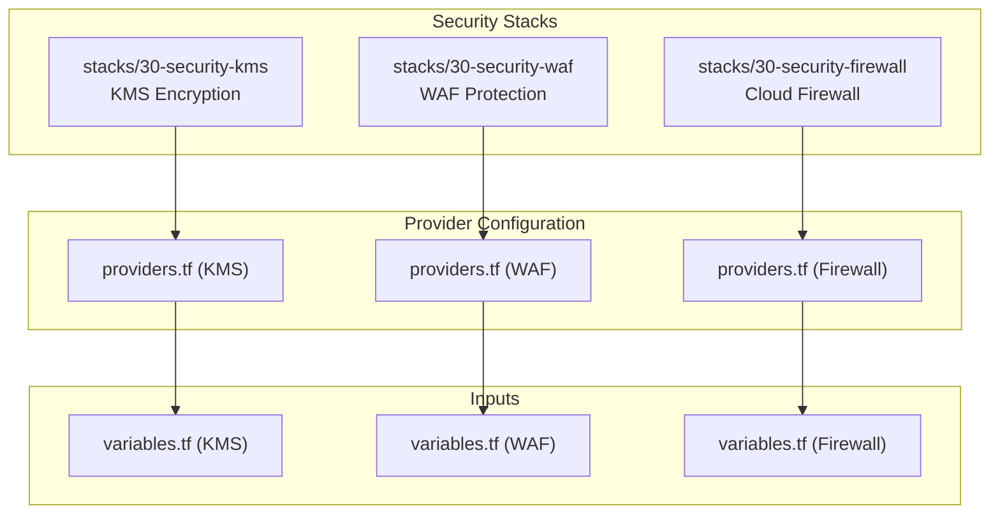
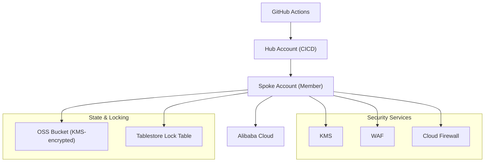
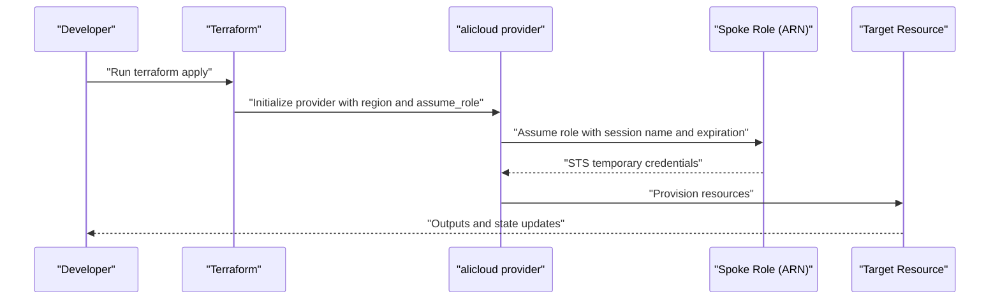
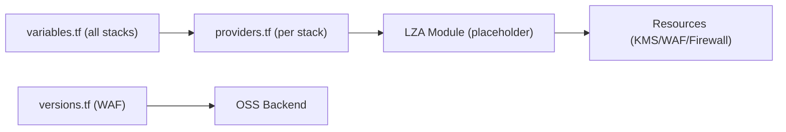

# Security Services

<cite>
**Referenced Files in This Document**
- [README.md](file://README.md)
- [stacks/30-security-kms/main.tf](file://stacks/30-security-kms/main.tf)
- [stacks/30-security-kms/variables.tf](file://stacks/30-security-kms/variables.tf)
- [stacks/30-security-kms/providers.tf](file://stacks/30-security-kms/providers.tf)
- [stacks/30-security-waf/main.tf](file://stacks/30-security-waf/main.tf)
- [stacks/30-security-waf/variables.tf](file://stacks/30-security-waf/variables.tf)
- [stacks/30-security-waf/providers.tf](file://stacks/30-security-waf/providers.tf)
- [stacks/30-security-waf/versions.tf](file://stacks/30-security-waf/versions.tf)
- [stacks/30-security-firewall/main.tf](file://stacks/30-security-firewall/main.tf)
- [stacks/30-security-firewall/variables.tf](file://stacks/30-security-firewall/variables.tf)
- [stacks/30-security-firewall/providers.tf](file://stacks/30-security-firewall/providers.tf)
</cite>

## Table of Contents
1. [Introduction](#introduction)
2. [Project Structure](#project-structure)
3. [Core Components](#core-components)
4. [Architecture Overview](#architecture-overview)
5. [Detailed Component Analysis](#detailed-component-analysis)
6. [Dependency Analysis](#dependency-analysis)
7. [Performance Considerations](#performance-considerations)
8. [Troubleshooting Guide](#troubleshooting-guide)
9. [Conclusion](#conclusion)
10. [Appendices](#appendices)

## Introduction
This document describes the Security Services stack that implements essential security capabilities within the Landing Zone. It focuses on:
- KMS encryption key management and customer master key (CMK) configuration
- WAF (Web Application Firewall) protection setup and traffic filtering
- Cloud Firewall configuration for network-layer protection
- Provider configuration for secure operations
- Variable definitions for encryption settings and security policies
- Integration patterns with other security controls
- Effectiveness, compliance considerations, and operational procedures

The Security Services stack currently defines placeholder implementations for KMS, WAF, and Firewall. The repository’s README highlights that state is encrypted at rest using KMS and that CI/CD leverages OIDC-assumed roles for least-privileged automation. This document provides implementation guidance aligned with the existing patterns and placeholders.

## Project Structure
The Security Services stack is organized into three dedicated Terraform stacks under stacks/30-security-*:
- stacks/30-security-kms: KMS encryption and CMK lifecycle
- stacks/30-security-waf: WAF protection and rule management
- stacks/30-security-firewall: Cloud Firewall network policies

Each stack defines:
- providers.tf: Alibaba Cloud provider with OIDC-assumed spoke role and session configuration
- variables.tf: Region and spoke role ARN inputs
- main.tf: Placeholder for module sourcing and future implementation
- versions.tf: Optional backend configuration for state persistence (WAF stack includes an OSS backend block)

**Diagram sources**
- [stacks/30-security-kms/providers.tf:1-9](file://stacks/30-security-kms/providers.tf#L1-L9)
- [stacks/30-security-waf/providers.tf:1-9](file://stacks/30-security-waf/providers.tf#L1-L9)
- [stacks/30-security-firewall/providers.tf:1-9](file://stacks/30-security-firewall/providers.tf#L1-L9)
- [stacks/30-security-kms/variables.tf:1-11](file://stacks/30-security-kms/variables.tf#L1-L11)
- [stacks/30-security-waf/variables.tf:1-11](file://stacks/30-security-waf/variables.tf#L1-L11)
- [stacks/30-security-firewall/variables.tf:1-11](file://stacks/30-security-firewall/variables.tf#L1-L11)

**Section sources**
- [README.md:141-165](file://README.md#L141-L165)
- [stacks/30-security-kms/main.tf:1-10](file://stacks/30-security-kms/main.tf#L1-L10)
- [stacks/30-security-waf/main.tf:1-10](file://stacks/30-security-waf/main.tf#L1-L10)
- [stacks/30-security-firewall/main.tf:1-10](file://stacks/30-security-firewall/main.tf#L1-L10)

## Core Components
- Provider configuration with OIDC-assumed spoke roles ensures least-privilege automation and eliminates long-lived credentials.
- Variables define region and spoke role ARN inputs, enabling cross-account and cross-region deployments.
- Placeholders indicate that production implementations should source modules from the Landing Zone Accelerator (LZA) components.

Implementation guidance:
- KMS: Replace placeholder with a module that provisions CMKs, key policies, rotation schedules, and alias management.
- WAF: Replace placeholder with a module that configures WAF instances, domains, and rule groups.
- Firewall: Replace placeholder with a module that sets up Cloud Firewall policies and rule sets.

**Section sources**
- [stacks/30-security-kms/providers.tf:1-9](file://stacks/30-security-kms/providers.tf#L1-L9)
- [stacks/30-security-waf/providers.tf:1-9](file://stacks/30-security-waf/providers.tf#L1-L9)
- [stacks/30-security-firewall/providers.tf:1-9](file://stacks/30-security-firewall/providers.tf#L1-L9)
- [stacks/30-security-kms/variables.tf:1-11](file://stacks/30-security-kms/variables.tf#L1-L11)
- [stacks/30-security-waf/variables.tf:1-11](file://stacks/30-security-waf/variables.tf#L1-L11)
- [stacks/30-security-firewall/variables.tf:1-11](file://stacks/30-security-firewall/variables.tf#L1-L11)
- [stacks/30-security-kms/main.tf:3-8](file://stacks/30-security-kms/main.tf#L3-L8)
- [stacks/30-security-waf/main.tf:3-8](file://stacks/30-security-waf/main.tf#L3-L8)
- [stacks/30-security-firewall/main.tf:3-8](file://stacks/30-security-firewall/main.tf#L3-L8)

## Architecture Overview
The Security Services stack follows a layered security model:
- Identity and access: OIDC-assumed spoke roles for CI/CD and day-2 operations
- Data protection: KMS encryption for state at rest
- Network protection: Cloud Firewall for perimeter and inter-VPC filtering
- Application protection: WAF for web traffic filtering and attack prevention

**Diagram sources**
- [README.md:28-28](file://README.md#L28-L28)
- [README.md:106-112](file://README.md#L106-L112)
- [stacks/30-security-waf/versions.tf:9-16](file://stacks/30-security-waf/versions.tf#L9-L16)

**Section sources**
- [README.md:106-112](file://README.md#L106-L112)
- [README.md:28-28](file://README.md#L28-L28)
- [stacks/30-security-waf/versions.tf:9-16](file://stacks/30-security-waf/versions.tf#L9-L16)

## Detailed Component Analysis

### KMS Encryption and CMK Management
Purpose:
- Manage customer master keys for encrypting sensitive data and protecting state at rest.

Placeholder and production alignment:
- The KMS stack includes a placeholder indicating that production implementations should source a module from LZA components.

Recommended implementation pattern:
- Provision CMKs with appropriate key policies and enable automatic key rotation per organizational standards.
- Create key aliases for easy reference by other services (e.g., OSS bucket encryption).
- Enforce key usage constraints (e.g., grant decryption only to specific roles).

Operational procedures:
- Define rotation intervals (e.g., annual) and alert thresholds for rotation failures.
- Audit key usage via CloudTrail and integrate with SIEM for monitoring.

Compliance considerations:
- Align key management with enterprise encryption policies and regulatory requirements (e.g., data sovereignty, auditability).

Integration patterns:
- Use CMK ARNs to encrypt OSS buckets and other data stores.
- Reference CMK aliases in downstream stacks for consistent key selection.

**Section sources**
- [stacks/30-security-kms/main.tf:3-8](file://stacks/30-security-kms/main.tf#L3-L8)
- [stacks/30-security-kms/providers.tf:1-9](file://stacks/30-security-kms/providers.tf#L1-L9)
- [stacks/30-security-kms/variables.tf:1-11](file://stacks/30-security-kms/variables.tf#L1-L11)

### WAF Protection Setup
Purpose:
- Provide web application firewall protection, including attack prevention and traffic filtering.

Placeholder and production alignment:
- The WAF stack includes a placeholder indicating that production implementations should source a module from LZA components.

Recommended implementation pattern:
- Configure WAF instances per protected domains or load balancers.
- Define rule groups for common attack categories (e.g., SQL injection, XSS, LFI).
- Set rate-based rules to mitigate DDoS and brute-force attempts.
- Integrate with ALB or CDN for traffic interception.

Operational procedures:
- Monitor WAF logs and adjust rules based on threat intelligence feeds.
- Establish alerting for blocked requests and rule bypass events.

Compliance considerations:
- Ensure rule coverage aligns with application security baselines and regulatory requirements.

Integration patterns:
- Share WAF configuration across environments via module parameters.
- Combine with Cloud Firewall for defense-in-depth.

**Section sources**
- [stacks/30-security-waf/main.tf:3-8](file://stacks/30-security-waf/main.tf#L3-L8)
- [stacks/30-security-waf/providers.tf:1-9](file://stacks/30-security-waf/providers.tf#L1-L9)
- [stacks/30-security-waf/variables.tf:1-11](file://stacks/30-security-waf/variables.tf#L1-L11)
- [stacks/30-security-waf/versions.tf:1-17](file://stacks/30-security-waf/versions.tf#L1-L17)

### Cloud Firewall Rule Management
Purpose:
- Enforce network-layer protection between VPCs and internet boundaries.

Placeholder and production alignment:
- The Firewall stack includes a placeholder indicating that production implementations should source a module from LZA components.

Recommended implementation pattern:
- Define outbound and inbound rule sets with explicit allow/deny policies.
- Segment traffic by application tiers and enforce least-privilege egress.
- Use FQDN lists and CIDR blocks to control external connectivity.

Operational procedures:
- Periodically review and retire unused rules.
- Track rule hit counts and correlate with security events.

Compliance considerations:
- Align rules with organizational network segmentation and regulatory access controls.

Integration patterns:
- Coordinate with VPC routing and NACLs for consistent enforcement.
- Combine with WAF for multi-layered protection.

**Section sources**
- [stacks/30-security-firewall/main.tf:3-8](file://stacks/30-security-firewall/main.tf#L3-L8)
- [stacks/30-security-firewall/providers.tf:1-9](file://stacks/30-security-firewall/providers.tf#L1-L9)
- [stacks/30-security-firewall/variables.tf:1-11](file://stacks/30-security-firewall/variables.tf#L1-L11)

### Provider Configuration and Variables
Provider configuration:
- Each stack configures the Alibaba Cloud provider with assume_role to use a spoke role ARN injected via TF_VAR_spoke_role_arn.
- Session name and expiration are set per stack to isolate sessions and limit exposure.

Variables:
- region: Defines the Alibaba Cloud region for resource provisioning.
- spoke_role_arn: Injected at runtime to assume the spoke role for cross-account operations.

State backend (WAF):
- The WAF stack includes an OSS backend configuration for persistent state storage with tablestore-based locking.

**Diagram sources**
- [stacks/30-security-kms/providers.tf:1-9](file://stacks/30-security-kms/providers.tf#L1-L9)
- [stacks/30-security-waf/providers.tf:1-9](file://stacks/30-security-waf/providers.tf#L1-L9)
- [stacks/30-security-firewall/providers.tf:1-9](file://stacks/30-security-firewall/providers.tf#L1-L9)

**Section sources**
- [stacks/30-security-kms/providers.tf:1-9](file://stacks/30-security-kms/providers.tf#L1-L9)
- [stacks/30-security-waf/providers.tf:1-9](file://stacks/30-security-waf/providers.tf#L1-L9)
- [stacks/30-security-firewall/providers.tf:1-9](file://stacks/30-security-firewall/providers.tf#L1-L9)
- [stacks/30-security-kms/variables.tf:1-11](file://stacks/30-security-kms/variables.tf#L1-L11)
- [stacks/30-security-waf/variables.tf:1-11](file://stacks/30-security-waf/variables.tf#L1-L11)
- [stacks/30-security-firewall/variables.tf:1-11](file://stacks/30-security-firewall/variables.tf#L1-L11)
- [stacks/30-security-waf/versions.tf:9-16](file://stacks/30-security-waf/versions.tf#L9-L16)

## Dependency Analysis
- Provider dependency: All stacks depend on the Alibaba Cloud provider configured with assume_role and region.
- Cross-stack dependency: None defined; stacks are isolated by design.
- External dependency: WAF stack declares an OSS backend for state persistence.

**Diagram sources**
- [stacks/30-security-kms/variables.tf:1-11](file://stacks/30-security-kms/variables.tf#L1-L11)
- [stacks/30-security-waf/variables.tf:1-11](file://stacks/30-security-waf/variables.tf#L1-L11)
- [stacks/30-security-firewall/variables.tf:1-11](file://stacks/30-security-firewall/variables.tf#L1-L11)
- [stacks/30-security-kms/providers.tf:1-9](file://stacks/30-security-kms/providers.tf#L1-L9)
- [stacks/30-security-waf/providers.tf:1-9](file://stacks/30-security-waf/providers.tf#L1-L9)
- [stacks/30-security-firewall/providers.tf:1-9](file://stacks/30-security-firewall/providers.tf#L1-L9)
- [stacks/30-security-waf/versions.tf:1-17](file://stacks/30-security-waf/versions.tf#L1-L17)

**Section sources**
- [stacks/30-security-kms/main.tf:3-8](file://stacks/30-security-kms/main.tf#L3-L8)
- [stacks/30-security-waf/main.tf:3-8](file://stacks/30-security-waf/main.tf#L3-L8)
- [stacks/30-security-firewall/main.tf:3-8](file://stacks/30-security-firewall/main.tf#L3-L8)
- [stacks/30-security-waf/versions.tf:9-16](file://stacks/30-security-waf/versions.tf#L9-L16)

## Performance Considerations
- Session expiration: 1-hour session lifetime reduces risk but requires re-authentication; ensure CI/CD jobs handle retries gracefully.
- Rule complexity: Keep WAF and Firewall rule sets concise to minimize latency and improve maintainability.
- Monitoring overhead: Enable logging and alerts judiciously to avoid excessive data volume.

## Troubleshooting Guide
Common issues and resolutions:
- Authentication failures: Verify TF_VAR_spoke_role_arn and session name uniqueness across stacks.
- State locking conflicts: Resolve concurrent applies using the tablestore lock table or schedule non-overlapping runs.
- Missing module source: Replace placeholders with valid module sources from LZA components and pass required variables.

Operational checks:
- Validate provider initialization and role assumption before applying changes.
- Review backend configuration for WAF stack to ensure OSS bucket and tablestore table availability.

**Section sources**
- [stacks/30-security-kms/providers.tf:1-9](file://stacks/30-security-kms/providers.tf#L1-L9)
- [stacks/30-security-waf/providers.tf:1-9](file://stacks/30-security-waf/providers.tf#L1-L9)
- [stacks/30-security-firewall/providers.tf:1-9](file://stacks/30-security-firewall/providers.tf#L1-L9)
- [stacks/30-security-waf/versions.tf:9-16](file://stacks/30-security-waf/versions.tf#L9-L16)

## Conclusion
The Security Services stack establishes a foundation for encryption, web protection, and network control within the Landing Zone. While current implementations are placeholders, the provider and variable patterns align with LZA components and support secure, automated operations. By implementing CMK lifecycle management, WAF rule sets, and Cloud Firewall policies, teams can achieve robust, compliant, and maintainable security posture.

## Appendices
- Security incident response procedures:
  - Isolate affected workloads using Cloud Firewall rules.
  - Rotate KMS keys and update resource encryption contexts.
  - Review WAF logs and adjust rules to mitigate ongoing threats.
  - Engage with SIEM and compliance teams for audit and remediation.

- Compliance alignment:
  - Encrypt state at rest using KMS-managed keys.
  - Enforce least privilege and role-based access control.
  - Maintain audit trails for key usage, WAF blocks, and firewall rule hits.

[No sources needed since this section provides general guidance]