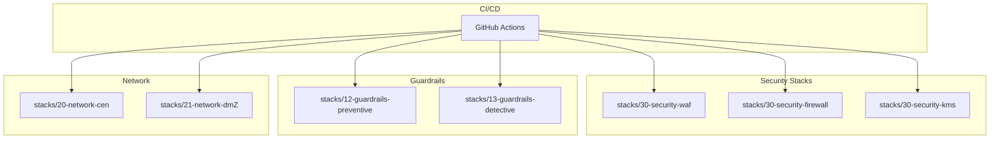
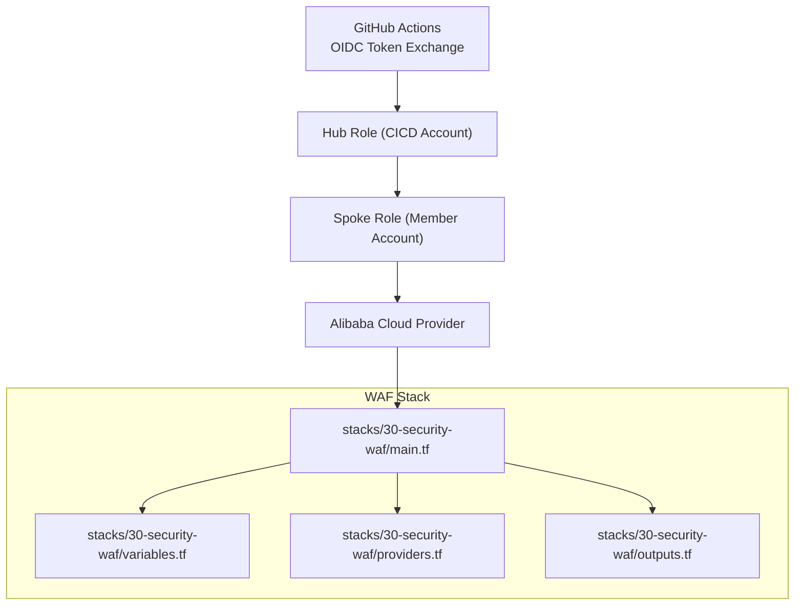
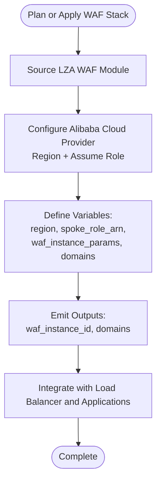
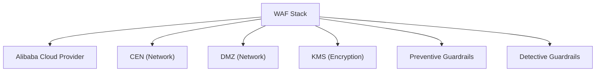

# WAF Protection

<cite>
**Referenced Files in This Document**
- [README.md](file://README.md)
- [main.tf](file://stacks/30-security-waf/main.tf)
- [variables.tf](file://stacks/30-security-waf/variables.tf)
- [providers.tf](file://stacks/30-security-waf/providers.tf)
- [outputs.tf](file://stacks/30-security-waf/outputs.tf)
- [versions.tf](file://stacks/30-security-waf/versions.tf)
- [main.tf](file://stacks/30-security-firewall/main.tf)
- [variables.tf](file://stacks/30-security-firewall/variables.tf)
- [main.tf](file://stacks/30-security-kms/main.tf)
- [variables.tf](file://stacks/30-security-kms/variables.tf)
- [main.tf](file://stacks/12-guardrails-preventive/main.tf)
- [main.tf](file://stacks/13-guardrails-detective/main.tf)
- [main.tf](file://stacks/20-network-cen/main.tf)
- [main.tf](file://stacks/21-network-dmz/main.tf)
</cite>

## Table of Contents
1. [Introduction](#introduction)
2. [Project Structure](#project-structure)
3. [Core Components](#core-components)
4. [Architecture Overview](#architecture-overview)
5. [Detailed Component Analysis](#detailed-component-analysis)
6. [Dependency Analysis](#dependency-analysis)
7. [Performance Considerations](#performance-considerations)
8. [Troubleshooting Guide](#troubleshooting-guide)
9. [Conclusion](#conclusion)

## Introduction
This document describes the Web Application Firewall (WAF) protection stack within the Alibaba Cloud Landing Zone Accelerator demo. It explains how the WAF stack is configured, how provider credentials are assumed via OIDC, and how the WAF integrates with network and security components. It also outlines practical guidance for implementing WAF policies, rule management, traffic filtering, monitoring, and incident response, grounded in the repository’s structure and documented patterns.

## Project Structure
The repository organizes resources by capability domains. The WAF stack resides under stacks/30-security-waf and follows a standard Terraform layout with provider configuration, variables, outputs, and version constraints. Supporting stacks include network foundations (CEN and DMZ), security enablers (KMS), and guardrails (preventive and detective). The README documents the overall architecture and CI/CD model.

**Section sources**
- [README.md:141-165](file://README.md#L141-L165)

## Core Components
- Provider configuration: The WAF stack configures the Alibaba Cloud provider with region and role assumption for secure, short-lived credentials.
- Variables: Region and spoke role ARN are defined to support cross-account operations.
- Version constraints: The stack pins the provider version and enables an OSS backend with Tablestore locking for state management.
- Outputs: Intended to expose WAF instance identifiers and domain configurations for downstream integrations.

Practical implications:
- The provider assumes a spoke role injected via environment variables, aligning with the repository’s OIDC-based CI/CD model.
- The OSS backend ensures encrypted, centralized state with distributed locking.

**Section sources**
- [providers.tf:1-9](file://stacks/30-security-waf/providers.tf#L1-L9)
- [variables.tf:1-11](file://stacks/30-security-waf/variables.tf#L1-L11)
- [versions.tf:1-18](file://stacks/30-security-waf/versions.tf#L1-L18)
- [outputs.tf:1-3](file://stacks/30-security-waf/outputs.tf#L1-L3)

## Architecture Overview
The WAF stack participates in a hub-and-spoke network topology and is orchestrated by GitHub Actions. The CI/CD pipeline assumes roles across accounts using OIDC, enabling safe provisioning of security controls. The WAF stack references a reusable module pattern (as indicated in comments) and is intended to integrate with load balancers and applications via domain and listener configurations managed elsewhere.

**Diagram sources**
- [README.md:28-28](file://README.md#L28-L28)
- [providers.tf:1-9](file://stacks/30-security-waf/providers.tf#L1-L9)
- [main.tf](file://stacks/30-security-waf/main.tf)

**Section sources**
- [README.md:106-113](file://README.md#L106-L113)
- [main.tf](file://stacks/30-security-waf/main.tf)

## Detailed Component Analysis

### WAF Stack Implementation Guidance
- Module sourcing: The WAF stack references a reusable module pattern in its main file comments, indicating that the actual WAF resources are expected to be provisioned via a module sourced from the Landing Zone Accelerator (LZA).
- Provider and credentials: The provider block defines region and role assumption with a session name and expiration, aligning with the repository’s OIDC-based credential flow.
- Variables and outputs: The variables file defines region and spoke role ARN; outputs are reserved for exposing WAF instance and domain identifiers.

Recommended implementation steps:
- Replace the placeholder comment with a module source pointing to the LZA WAF component.
- Define variables for WAF instance attributes, domain lists, and security policy parameters.
- Emit outputs for WAF instance ID, attached domains, and listener associations.

**Section sources**
- [main.tf](file://stacks/30-security-waf/main.tf)
- [providers.tf:1-9](file://stacks/30-security-waf/providers.tf#L1-L9)
- [variables.tf:1-11](file://stacks/30-security-waf/variables.tf#L1-L11)
- [outputs.tf:1-3](file://stacks/30-security-waf/outputs.tf#L1-L3)

### Provider Configuration and Credential Assumption
- The provider uses region and assume_role with role_arn, session_name, and session_expiration.
- The role_arn is supplied via TF_VAR_spoke_role_arn, consistent with the repository’s CI/CD variables.

Operational notes:
- Ensure the spoke role has permissions to create and manage WAF resources.
- Keep session expiration aligned with CI/CD run duration.

**Section sources**
- [providers.tf:1-9](file://stacks/30-security-waf/providers.tf#L1-L9)
- [variables.tf:7-10](file://stacks/30-security-waf/variables.tf#L7-L10)

### Security Policy Setup and Rule Management
Policy and rule management follow a modular approach:
- Centralize policy definitions in variables for reuse across environments.
- Use separate modules for rule sets (e.g., OWASP Core Rule Set variants) and attach them to WAF instances.
- Parameterize thresholds and protection levels via variables to enable environment-specific tuning.

Example variable categories:
- Protection level: low/medium/high with corresponding rule strictness.
- Thresholds: anomaly detection sensitivity, rate limits per IP, and request size caps.
- Exclusions: trusted IPs, health check paths, and internal endpoints.

Integration touchpoints:
- Domain association: attach WAF to application listeners or hostnames.
- Listener rules: route traffic through WAF before reaching origin servers.

[No sources needed since this section provides general guidance]

### Attack Prevention Mechanisms
- DDoS protection: Combine WAF rate limiting with Cloud Firewall allowlists and upstream DDoS mitigation services.
- SQL injection filtering: Enable SQLi rule groups and customize signatures in the WAF policy.
- XSS mitigation: Activate XSS rule groups and sanitize unsafe parameters at the application boundary.

Operational tips:
- Start with a restrictive baseline and gradually relax rules while monitoring false positives.
- Use staged rollouts per environment (dev/test/prod) to validate impact.

[No sources needed since this section provides general guidance]

### Traffic Filtering Rules
Traffic filtering should be layered:
- Network-level: Cloud Firewall rules to restrict ingress/egress.
- Transport-level: Load balancer rules to enforce TLS and HTTP/2 constraints.
- Application-level: WAF rules to filter malicious requests.

Common filters:
- Path-based allow/block lists.
- Header validation (User-Agent, Content-Type).
- IP reputation and country/blocklist enforcement.

[No sources needed since this section provides general guidance]

### Monitoring, Detection, and Automated Response
Monitoring:
- Enable WAF logs and export to log aggregation systems.
- Track blocked requests, top attack vectors, and evasion attempts.

Detection:
- Alert on spikes in blocked requests or rule hit rates.
- Correlate with load balancer and firewall logs.

Automated response:
- Trigger remediation actions (e.g., update Cloud Firewall allowlists) when thresholds are exceeded.
- Integrate with security orchestration tools for dynamic IP blacklisting.

[No sources needed since this section provides general guidance]

### Relationship Between WAF Policies and Application Security Posture
- WAF acts as a first line of defense; application hardening remains essential.
- Align WAF policies with application threat models and compliance requirements.
- Regularly review and update policies based on attack intelligence and audit findings.

[No sources needed since this section provides general guidance]

### Rule Tuning for False Positives
- Use allow-listing of benign paths and parameters.
- Temporarily disable high-risk rules in staging to measure impact.
- Leverage learning modes where available to adapt rules based on observed traffic.

[No sources needed since this section provides general guidance]

### Troubleshooting WAF Blocking Issues
- Inspect WAF logs to identify offending rule groups and matched parameters.
- Temporarily bypass WAF to confirm application-level causes.
- Validate domain and listener associations; ensure correct certificate and routing.

[No sources needed since this section provides general guidance]

## Dependency Analysis
The WAF stack depends on:
- Provider credentials (assumed via OIDC) to access Alibaba Cloud APIs.
- Network constructs (CEN and DMZ) to route traffic to WAF-protected applications.
- Security enablers (KMS) for encrypted state storage and logging.
- Guardrails (preventive and detective) for policy alignment and compliance checks.

**Section sources**
- [README.md:141-165](file://README.md#L141-L165)
- [main.tf](file://stacks/20-network-cen/main.tf)
- [main.tf](file://stacks/21-network-dmz/main.tf)
- [main.tf](file://stacks/30-security-kms/main.tf)
- [main.tf](file://stacks/12-guardrails-preventive/main.tf)
- [main.tf](file://stacks/13-guardrails-detective/main.tf)

## Performance Considerations
- Minimize rule complexity to reduce latency; group related rules and avoid overlapping conditions.
- Use caching for static assets behind WAF to lower request volume.
- Scale load balancer capacity and WAF tiers according to traffic patterns.

[No sources needed since this section provides general guidance]

## Troubleshooting Guide
- Verify provider credentials and role assumptions using the variables and provider blocks.
- Confirm region alignment between the provider and target resources.
- Review backend configuration for state consistency and locking.

**Section sources**
- [providers.tf:1-9](file://stacks/30-security-waf/providers.tf#L1-L9)
- [versions.tf:9-16](file://stacks/30-security-waf/versions.tf#L9-L16)

## Conclusion
The WAF protection stack in this repository establishes a secure, CI/CD-driven foundation for deploying web application defenses. By leveraging OIDC-assumed roles, centralized state management, and modular configuration, teams can reliably operate WAF policies, integrate with network and security controls, and maintain strong application security postures. The guidance herein complements the existing stack structure to operationalize WAF protection effectively.