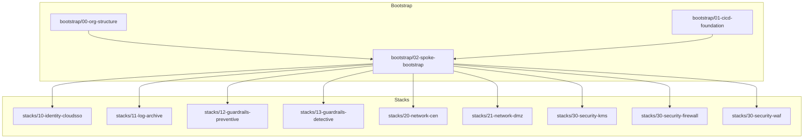
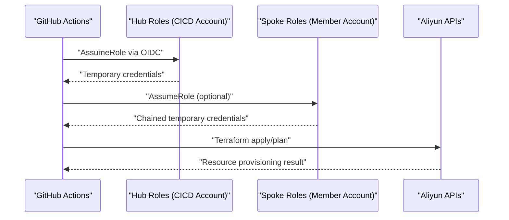
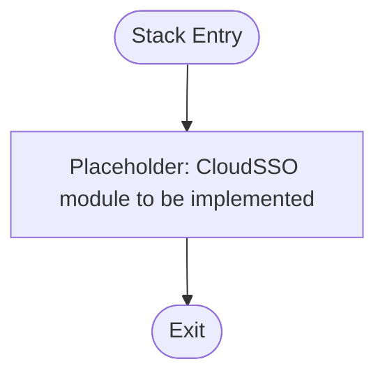
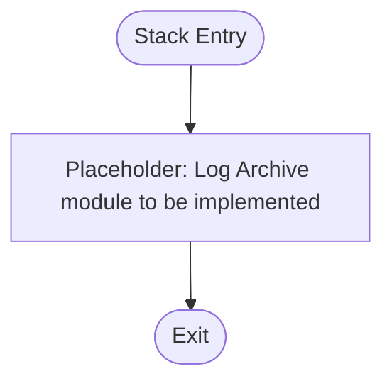
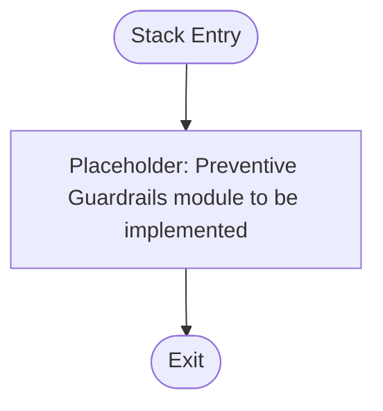
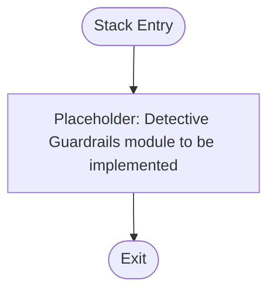
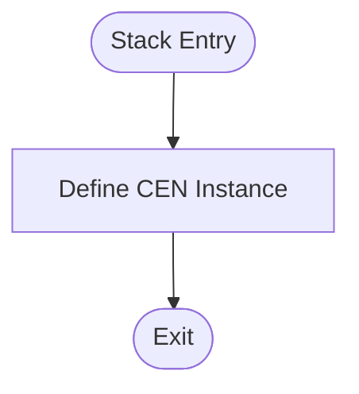
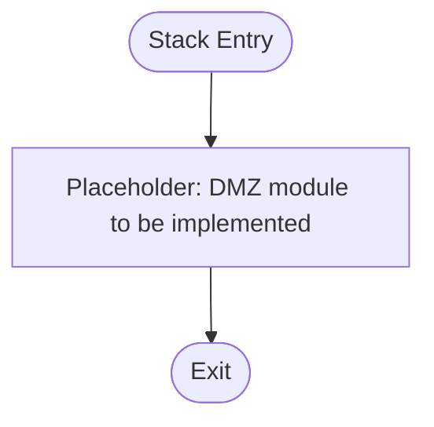
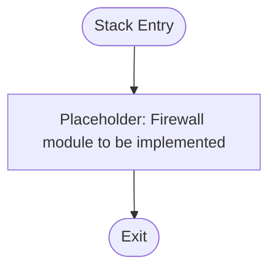
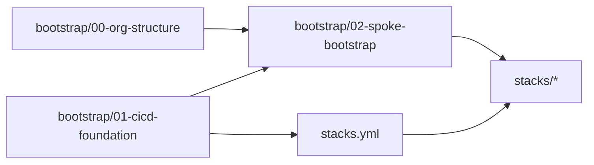

# Stack Architecture

<cite>
**Referenced Files in This Document**
- [README.md](file://README.md)
- [bootstrap/00-org-structure/main.tf](file://bootstrap/00-org-structure/main.tf)
- [bootstrap/01-cicd-foundation/main.tf](file://bootstrap/01-cicd-foundation/main.tf)
- [bootstrap/02-spoke-bootstrap/main.tf](file://bootstrap/02-spoke-bootstrap/main.tf)
- [bootstrap/02-spoke-bootstrap/modules/spoke-roles/main.tf](file://bootstrap/02-spoke-bootstrap/modules/spoke-roles/main.tf)
- [stacks/10-identity-cloudsso/main.tf](file://stacks/10-identity-cloudsso/main.tf)
- [stacks/11-log-archive/main.tf](file://stacks/11-log-archive/main.tf)
- [stacks/12-guardrails-preventive/main.tf](file://stacks/12-guardrails-preventive/main.tf)
- [stacks/13-guardrails-detective/main.tf](file://stacks/13-guardrails-detective/main.tf)
- [stacks/20-network-cen/main.tf](file://stacks/20-network-cen/main.tf)
- [stacks/21-network-dmz/main.tf](file://stacks/21-network-dmz/main.tf)
- [stacks/30-security-kms/main.tf](file://stacks/30-security-kms/main.tf)
- [stacks/30-security-firewall/main.tf](file://stacks/30-security-firewall/main.tf)
- [stacks/30-security-waf/main.tf](file://stacks/30-security-waf/main.tf)
- [.github/workflows/stacks.yml](file://.github/workflows/stacks.yml)
- [.github/workflows/terraform-reusable.yml](file://.github/workflows/terraform-reusable.yml)
</cite>

## Table of Contents
1. [Introduction](#introduction)
2. [Project Structure](#project-structure)
3. [Core Components](#core-components)
4. [Architecture Overview](#architecture-overview)
5. [Detailed Component Analysis](#detailed-component-analysis)
6. [Dependency Analysis](#dependency-analysis)
7. [Performance Considerations](#performance-considerations)
8. [Troubleshooting Guide](#troubleshooting-guide)
9. [Conclusion](#conclusion)
10. [Appendices](#appendices)

## Introduction
This document explains the modular stack architecture that implements Alibaba Cloud Landing Zone infrastructure across nine stack categories:
- Identity & Access Management: CloudSSO
- Logging Infrastructure: Log Archive
- Security Controls: KMS, WAF, Firewall, Guardrails
- Network Foundation: CEN, DMZ

It covers the stack composition pattern, provider configuration, variable management, and deployment sequencing. It also documents how stacks relate to each other, how to customize and extend them, and how they integrate with the broader CI/CD foundation.

## Project Structure
The repository organizes infrastructure into two phases of bootstrapping and a set of stacks:
- bootstrap/00-org-structure: Enables Resource Directory and creates organizational folders and core member accounts.
- bootstrap/01-cicd-foundation: Sets up OIDC, hub roles, state backend (OSS), and distributed locking (Tablestore).
- bootstrap/02-spoke-bootstrap: Deploys spoke roles in each member account and exposes provider aliases for targeting.
- stacks/: Modular, category-based stacks that provision resources in their respective spoke accounts.

**Diagram sources**
- [bootstrap/00-org-structure/main.tf:1-49](file://bootstrap/00-org-structure/main.tf#L1-L49)
- [bootstrap/01-cicd-foundation/main.tf:1-150](file://bootstrap/01-cicd-foundation/main.tf#L1-L150)
- [bootstrap/02-spoke-bootstrap/main.tf:1-33](file://bootstrap/02-spoke-bootstrap/main.tf#L1-L33)
- [stacks/10-identity-cloudsso/main.tf:1-10](file://stacks/10-identity-cloudsso/main.tf#L1-L10)
- [stacks/11-log-archive/main.tf:1-10](file://stacks/11-log-archive/main.tf#L1-L10)
- [stacks/12-guardrails-preventive/main.tf:1-10](file://stacks/12-guardrails-preventive/main.tf#L1-L10)
- [stacks/13-guardrails-detective/main.tf:1-10](file://stacks/13-guardrails-detective/main.tf#L1-L10)
- [stacks/20-network-cen/main.tf:1-16](file://stacks/20-network-cen/main.tf#L1-L16)
- [stacks/21-network-dmz/main.tf:1-10](file://stacks/21-network-dmz/main.tf#L1-L10)
- [stacks/30-security-kms/main.tf:1-10](file://stacks/30-security-kms/main.tf#L1-L10)
- [stacks/30-security-firewall/main.tf:1-10](file://stacks/30-security-firewall/main.tf#L1-L10)
- [stacks/30-security-waf/main.tf:1-10](file://stacks/30-security-waf/main.tf#L1-L10)

**Section sources**
- [README.md:141-165](file://README.md#L141-L165)

## Core Components
- Provider Aliasing and Targeting: The spoke-bootstrap phase defines provider aliases for each member account so that stack modules can target the correct spoke account.
- Hub Roles and OIDC: The CI/CD foundation provisions an OIDC provider and hub roles with least-privilege conditions. The reusable workflow assumes these hub roles to chain into spoke roles.
- State Backend and Locking: OSS bucket with SSE-KMS and OTS table provide secure, centralized state and distributed locking.
- Stacks: Each stack resides under stacks/<category>-<name> and targets a specific spoke account via provider alias.

Key implementation references:
- Provider aliasing and spoke role deployment: [bootstrap/02-spoke-bootstrap/main.tf:1-33](file://bootstrap/02-spoke-bootstrap/main.tf#L1-L33), [bootstrap/02-spoke-bootstrap/modules/spoke-roles/main.tf:1-42](file://bootstrap/02-spoke-bootstrap/modules/spoke-roles/main.tf#L1-L42)
- Hub roles and OIDC: [bootstrap/01-cicd-foundation/main.tf:49-149](file://bootstrap/01-cicd-foundation/main.tf#L49-L149)
- State backend and locking: [bootstrap/01-cicd-foundation/main.tf:5-43](file://bootstrap/01-cicd-foundation/main.tf#L5-L43)
- Stack orchestration: [.github/workflows/stacks.yml:1-112](file://.github/workflows/stacks.yml#L1-L112), [.github/workflows/terraform-reusable.yml:1-118](file://.github/workflows/terraform-reusable.yml#L1-L118)

**Section sources**
- [bootstrap/02-spoke-bootstrap/main.tf:1-33](file://bootstrap/02-spoke-bootstrap/main.tf#L1-L33)
- [bootstrap/02-spoke-bootstrap/modules/spoke-roles/main.tf:1-42](file://bootstrap/02-spoke-bootstrap/modules/spoke-roles/main.tf#L1-L42)
- [bootstrap/01-cicd-foundation/main.tf:5-43](file://bootstrap/01-cicd-foundation/main.tf#L5-L43)
- [bootstrap/01-cicd-foundation/main.tf:49-149](file://bootstrap/01-cicd-foundation/main.tf#L49-L149)
- [.github/workflows/stacks.yml:18-112](file://.github/workflows/stacks.yml#L18-L112)
- [.github/workflows/terraform-reusable.yml:38-118](file://.github/workflows/terraform-reusable.yml#L38-L118)

## Architecture Overview
The deployment flow follows a hub-and-spoke model:
- CI/CD hub account holds OIDC provider and hub roles.
- Spoke roles are deployed in each member account and trust the hub roles.
- GitHub Actions assume the hub roles and, optionally, chain into spoke roles to provision resources in the target spoke account.

**Diagram sources**
- [bootstrap/01-cicd-foundation/main.tf:49-149](file://bootstrap/01-cicd-foundation/main.tf#L49-L149)
- [bootstrap/02-spoke-bootstrap/modules/spoke-roles/main.tf:1-42](file://bootstrap/02-spoke-bootstrap/modules/spoke-roles/main.tf#L1-L42)
- [.github/workflows/stacks.yml:42-99](file://.github/workflows/stacks.yml#L42-L99)
- [.github/workflows/terraform-reusable.yml:50-55](file://.github/workflows/terraform-reusable.yml#L50-L55)

## Detailed Component Analysis

### Stack Composition Pattern
Each stack follows a consistent structure:
- providers.tf: Declares provider aliases and selects the target spoke provider.
- variables.tf: Defines inputs consumed by the stack (e.g., spoke role ARN injected by CI/CD).
- main.tf: Implements the category’s resources using the aliased provider.
- outputs.tf: Exposes identifiers for downstream consumption.

Provider configuration and variable injection are orchestrated by the CI/CD workflow matrix and reusable workflow.

**Section sources**
- [.github/workflows/stacks.yml:34-67](file://.github/workflows/stacks.yml#L34-L67)
- [.github/workflows/stacks.yml:86-111](file://.github/workflows/stacks.yml#L86-L111)
- [.github/workflows/terraform-reusable.yml:5-32](file://.github/workflows/terraform-reusable.yml#L5-L32)

### Identity & Access Management (CloudSSO)
- Purpose: Centralized identity provisioning and access configuration.
- Implementation pattern: Use a module sourced from the Landing Zone Accelerator (LZA) components in production; placeholder in this demo indicates future implementation.

**Diagram sources**
- [stacks/10-identity-cloudsso/main.tf:1-10](file://stacks/10-identity-cloudsso/main.tf#L1-L10)

**Section sources**
- [stacks/10-identity-cloudsso/main.tf:1-10](file://stacks/10-identity-cloudsso/main.tf#L1-L10)

### Logging Infrastructure (Log Archive)
- Purpose: Centralize audit logs using SLS.
- Implementation pattern: Use a module sourced from LZA components in production; placeholder indicates future implementation.

**Diagram sources**
- [stacks/11-log-archive/main.tf:1-10](file://stacks/11-log-archive/main.tf#L1-L10)

**Section sources**
- [stacks/11-log-archive/main.tf:1-10](file://stacks/11-log-archive/main.tf#L1-L10)

### Security Controls: Guardrails (Preventive)
- Purpose: Enforce Resource Directory control policies to prevent prohibited configurations.
- Implementation pattern: Use a module sourced from LZA components in production; placeholder indicates future implementation.

**Diagram sources**
- [stacks/12-guardrails-preventive/main.tf:1-10](file://stacks/12-guardrails-preventive/main.tf#L1-L10)

**Section sources**
- [stacks/12-guardrails-preventive/main.tf:1-10](file://stacks/12-guardrails-preventive/main.tf#L1-L10)

### Security Controls: Guardrails (Detective)
- Purpose: Detect misconfigurations using Cloud Config rules.
- Implementation pattern: Use a module sourced from LZA components in production; placeholder indicates future implementation.

**Diagram sources**
- [stacks/13-guardrails-detective/main.tf:1-10](file://stacks/13-guardrails-detective/main.tf#L1-L10)

**Section sources**
- [stacks/13-guardrails-detective/main.tf:1-10](file://stacks/13-guardrails-detective/main.tf#L1-L10)

### Network Foundation: CEN (Cloud Enterprise Network)
- Purpose: Establish a hub-and-spoke network backbone.
- Implementation pattern: Demonstrates direct resource definition in the network spoke account; in production, source from LZA modules.

**Diagram sources**
- [stacks/20-network-cen/main.tf:12-16](file://stacks/20-network-cen/main.tf#L12-L16)

**Section sources**
- [stacks/20-network-cen/main.tf:1-16](file://stacks/20-network-cen/main.tf#L1-L16)

### Network Foundation: DMZ
- Purpose: Provide a demilitarized zone with VPC, NAT Gateway, and EIP.
- Implementation pattern: Use a module sourced from LZA components in production; placeholder indicates future implementation.

**Diagram sources**
- [stacks/21-network-dmz/main.tf:1-10](file://stacks/21-network-dmz/main.tf#L1-L10)

**Section sources**
- [stacks/21-network-dmz/main.tf:1-10](file://stacks/21-network-dmz/main.tf#L1-L10)

### Security Controls: KMS
- Purpose: Manage Customer Master Keys for encryption.
- Implementation pattern: Use a module sourced from LZA components in production; placeholder indicates future implementation.

**Diagram sources**
- [stacks/30-security-kms/main.tf:1-10](file://stacks/30-security-kms/main.tf#L1-L10)

**Section sources**
- [stacks/30-security-kms/main.tf:1-10](file://stacks/30-security-kms/main.tf#L1-L10)

### Security Controls: Firewall
- Purpose: Configure Cloud Firewall for network security.
- Implementation pattern: Use a module sourced from LZA components in production; placeholder indicates future implementation.

**Diagram sources**
- [stacks/30-security-firewall/main.tf:1-10](file://stacks/30-security-firewall/main.tf#L1-L10)

**Section sources**
- [stacks/30-security-firewall/main.tf:1-10](file://stacks/30-security-firewall/main.tf#L1-L10)

### Security Controls: WAF
- Purpose: Protect web applications with Web Application Firewall.
- Implementation pattern: Use a module sourced from LZA components in production; placeholder indicates future implementation.

**Diagram sources**
- [stacks/30-security-waf/main.tf:1-10](file://stacks/30-security-waf/main.tf#L1-L10)

**Section sources**
- [stacks/30-security-waf/main.tf:1-10](file://stacks/30-security-waf/main.tf#L1-L10)

## Dependency Analysis
- Bootstrapping order: Organization structure must exist before deploying spoke roles; the CI/CD foundation must be established before stacks can assume hub roles.
- Provider targeting: Stacks depend on provider aliases defined in spoke-bootstrap to target the correct member account.
- Role chaining: CI/CD hub roles assume spoke roles to provision resources; the reusable workflow injects the spoke role ARN via TF_VAR_spoke_role_arn.
- Deployment sequencing: The stacks workflow runs plan on pull requests and apply on pushes to main, with apply jobs serialized to avoid contention.

**Diagram sources**
- [bootstrap/00-org-structure/main.tf:1-49](file://bootstrap/00-org-structure/main.tf#L1-L49)
- [bootstrap/01-cicd-foundation/main.tf:1-150](file://bootstrap/01-cicd-foundation/main.tf#L1-L150)
- [bootstrap/02-spoke-bootstrap/main.tf:1-33](file://bootstrap/02-spoke-bootstrap/main.tf#L1-L33)
- [.github/workflows/stacks.yml:18-112](file://.github/workflows/stacks.yml#L18-L112)

**Section sources**
- [bootstrap/00-org-structure/main.tf:1-49](file://bootstrap/00-org-structure/main.tf#L1-L49)
- [bootstrap/01-cicd-foundation/main.tf:1-150](file://bootstrap/01-cicd-foundation/main.tf#L1-L150)
- [bootstrap/02-spoke-bootstrap/main.tf:1-33](file://bootstrap/02-spoke-bootstrap/main.tf#L1-L33)
- [.github/workflows/stacks.yml:18-112](file://.github/workflows/stacks.yml#L18-L112)

## Performance Considerations
- State backend: Using OSS with SSE-KMS ensures encrypted state at rest; enable lifecycle expiration for old versions to control cost and retention.
- Locking: OTS table provides distributed locking to prevent concurrent applies; keep apply jobs serialized when necessary.
- Provider aliasing: Minimizes cross-account assumptions and reduces errors by ensuring each stack targets the correct spoke.
- CI/CD cadence: Schedule periodic plan-only runs to detect drift without applying changes.

[No sources needed since this section provides general guidance]

## Troubleshooting Guide
- OIDC credential failures: Verify OIDC provider ARN and hub role ARNs in repository variables; confirm GitHub Actions permissions for id-token.
- Role assumption errors: Confirm spoke roles trust the hub roles and that the spoke role ARN is correctly passed via TF_VAR_spoke_role_arn.
- State initialization: After migrating to OSS backend, ensure backend configuration is present and run terraform init -migrate-state.
- Drift detection: Use scheduled plan-only runs to surface configuration drift early.

**Section sources**
- [.github/workflows/stacks.yml:42-99](file://.github/workflows/stacks.yml#L42-L99)
- [.github/workflows/terraform-reusable.yml:50-55](file://.github/workflows/terraform-reusable.yml#L50-L55)
- [README.md:78-87](file://README.md#L78-L87)
- [README.md:129-139](file://README.md#L129-L139)

## Conclusion
This modular stack architecture separates concerns across identity, logging, guardrails, networking, and security domains. By leveraging provider aliasing, hub/spoke roles, and a reusable CI/CD workflow, it enforces least privilege, enables safe automation, and scales to new stacks and spoke accounts. Production deployments should source modules from the Landing Zone Accelerator while maintaining the same stack composition pattern and variable injection mechanisms.

[No sources needed since this section summarizes without analyzing specific files]

## Appendices

### Stack Categories and Targets
- Identity & Access Management: CloudSSO (target: devops)
- Logging Infrastructure: Log Archive (target: log-archive)
- Security Controls: KMS (target: security), WAF (target: shared), Firewall (target: network)
- Security Controls: Guardrails (Preventive/Detective) (targets: devops, security)
- Network Foundation: CEN (target: network), DMZ (target: network)

**Section sources**
- [.github/workflows/stacks.yml:24-33](file://.github/workflows/stacks.yml#L24-L33)
- [.github/workflows/stacks.yml:77-85](file://.github/workflows/stacks.yml#L77-L85)

### Provider Configuration and Variable Management
- Provider aliasing: Defined in spoke-bootstrap and consumed by stacks via providers.tf.
- Variable injection: TF_VAR_spoke_role_arn is set by the workflow to chain into spoke roles.
- Version pinning: Terraform version is configured in the reusable workflow.

**Section sources**
- [bootstrap/02-spoke-bootstrap/main.tf:1-33](file://bootstrap/02-spoke-bootstrap/main.tf#L1-L33)
- [.github/workflows/stacks.yml:58-59](file://.github/workflows/stacks.yml#L58-L59)
- [.github/workflows/stacks.yml:109-110](file://.github/workflows/stacks.yml#L109-L110)
- [.github/workflows/terraform-reusable.yml:5-32](file://.github/workflows/terraform-reusable.yml#L5-L32)