# Stack Architecture

<cite>
**Referenced Files in This Document**
- [README.md](file://README.md)
- [bootstrap/00-org-structure/main.tf](file://bootstrap/00-org-structure/main.tf)
- [bootstrap/01-cicd-foundation/main.tf](file://bootstrap/01-cicd-foundation/main.tf)
- [bootstrap/02-spoke-bootstrap/main.tf](file://bootstrap/02-spoke-bootstrap/main.tf)
- [bootstrap/02-spoke-bootstrap/modules/spoke-roles/main.tf](file://bootstrap/02-spoke-bootstrap/modules/spoke-roles/main.tf)
- [stacks/10-identity-cloudsso/main.tf](file://stacks/10-identity-cloudsso/main.tf)
- [stacks/10-identity-cloudsso/providers.tf](file://stacks/10-identity-cloudsso/providers.tf)
- [stacks/10-identity-cloudsso/variables.tf](file://stacks/10-identity-cloudsso/variables.tf)
- [stacks/10-identity-cloudsso/outputs.tf](file://stacks/10-identity-cloudsso/outputs.tf)
- [stacks/11-log-archive/main.tf](file://stacks/11-log-archive/main.tf)
- [stacks/12-guardrails-preventive/main.tf](file://stacks/12-guardrails-preventive/main.tf)
- [stacks/13-guardrails-detective/main.tf](file://stacks/13-guardrails-detective/main.tf)
- [stacks/20-network-cen/main.tf](file://stacks/20-network-cen/main.tf)
- [stacks/20-network-cen/providers.tf](file://stacks/20-network-cen/providers.tf)
- [stacks/20-network-cen/variables.tf](file://stacks/20-network-cen/variables.tf)
- [stacks/20-network-cen/outputs.tf](file://stacks/20-network-cen/outputs.tf)
- [stacks/21-network-dmz/main.tf](file://stacks/21-network-dmz/main.tf)
- [stacks/30-security-kms/main.tf](file://stacks/30-security-kms/main.tf)
- [stacks/30-security-kms/providers.tf](file://stacks/30-security-kms/providers.tf)
- [stacks/30-security-kms/variables.tf](file://stacks/30-security-kms/variables.tf)
- [stacks/30-security-firewall/main.tf](file://stacks/30-security-firewall/main.tf)
- [stacks/30-security-firewall/providers.tf](file://stacks/30-security-firewall/providers.tf)
- [stacks/30-security-waf/main.tf](file://stacks/30-security-waf/main.tf)
- [stacks/30-security-waf/providers.tf](file://stacks/30-security-waf/providers.tf)
- [.github/workflows/stacks.yml](file://.github/workflows/stacks.yml)
- [.github/workflows/terraform-reusable.yml](file://.github/workflows/terraform-reusable.yml)
</cite>

## Update Summary
**Changes Made**
- Updated all nine stack categories to reflect complete Terraform configurations with provider targeting, variable definitions, and output specifications
- Enhanced detailed component analysis sections with actual implementation details for each stack
- Added comprehensive provider configuration examples showing assume_role patterns
- Updated dependency analysis to reflect the complete multi-stack deployment system
- Expanded security controls documentation with specific service implementations

## Table of Contents
1. [Introduction](#introduction)
2. [Project Structure](#project-structure)
3. [Core Components](#core-components)
4. [Architecture Overview](#architecture-overview)
5. [Detailed Component Analysis](#detailed-component-analysis)
6. [Dependency Analysis](#dependency-analysis)
7. [Performance Considerations](#performance-considerations)
8. [Troubleshooting Guide](#troubleshooting-guide)
9. [Conclusion](#conclusion)
10. [Appendices](#appendices)

## Introduction
This document explains the modular stack architecture that implements Alibaba Cloud Landing Zone infrastructure across nine operational stacks covering identity management, logging infrastructure, security controls, and network foundation. The system provides a complete multi-stack deployment solution with proper provider targeting, variable management, and CI/CD integration.

The nine stack categories include:
- Identity & Access Management: CloudSSO (10-identity-cloudsso)
- Logging Infrastructure: Log Archive (11-log-archive)
- Security Controls: Guardrails Preventive (12-guardrails-preventive), Guardrails Detective (13-guardrails-detective)
- Network Foundation: CEN (20-network-cen), DMZ (21-network-dmz)
- Security Services: KMS (30-security-kms), Firewall (30-security-firewall), WAF (30-security-waf)

Each stack implements complete Terraform configurations with provider aliasing, assume role patterns, variable definitions, and output specifications for seamless integration within the broader infrastructure.

## Project Structure
The repository organizes infrastructure into two phases of bootstrapping and a set of nine operational stacks:
- bootstrap/00-org-structure: Enables Resource Directory and creates organizational folders and core member accounts.
- bootstrap/01-cicd-foundation: Sets up OIDC, hub roles, state backend (OSS), and distributed locking (Tablestore).
- bootstrap/02-spoke-bootstrap: Deploys spoke roles in each member account and exposes provider aliases for targeting.
- stacks/: Nine modular, category-based stacks that provision resources in their respective spoke accounts with complete Terraform configurations.

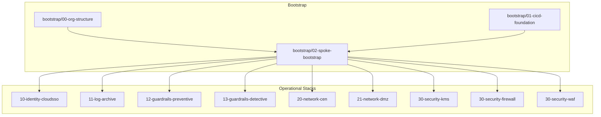

**Diagram sources**
- [bootstrap/00-org-structure/main.tf:1-49](file://bootstrap/00-org-structure/main.tf#L1-L49)
- [bootstrap/01-cicd-foundation/main.tf:1-150](file://bootstrap/01-cicd-foundation/main.tf#L1-L150)
- [bootstrap/02-spoke-bootstrap/main.tf:1-33](file://bootstrap/02-spoke-bootstrap/main.tf#L1-L33)
- [stacks/10-identity-cloudsso/main.tf:1-10](file://stacks/10-identity-cloudsso/main.tf#L1-L10)
- [stacks/11-log-archive/main.tf:1-10](file://stacks/11-log-archive/main.tf#L1-L10)
- [stacks/12-guardrails-preventive/main.tf:1-10](file://stacks/12-guardrails-preventive/main.tf#L1-L10)
- [stacks/13-guardrails-detective/main.tf:1-10](file://stacks/13-guardrails-detective/main.tf#L1-L10)
- [stacks/20-network-cen/main.tf:1-16](file://stacks/20-network-cen/main.tf#L1-L16)
- [stacks/21-network-dmz/main.tf:1-10](file://stacks/21-network-dmz/main.tf#L1-L10)
- [stacks/30-security-kms/main.tf:1-10](file://stacks/30-security-kms/main.tf#L1-L10)
- [stacks/30-security-firewall/main.tf:1-10](file://stacks/30-security-firewall/main.tf#L1-L10)
- [stacks/30-security-waf/main.tf:1-10](file://stacks/30-security-waf/main.tf#L1-L10)

**Section sources**
- [README.md:141-165](file://README.md#L141-L165)

## Core Components
- Provider Aliasing and Targeting: Each stack defines its own provider configuration with assume_role blocks targeting specific spoke roles via TF_VAR_spoke_role_arn injection.
- Hub Roles and OIDC: The CI/CD foundation provisions an OIDC provider and hub roles with least-privilege conditions. The reusable workflow assumes these hub roles to chain into spoke roles.
- State Backend and Locking: OSS bucket with SSE-KMS and OTS table provide secure, centralized state and distributed locking.
- Complete Stack Implementations: All nine stacks implement full Terraform configurations with variables, outputs, and production-ready module sourcing patterns.

Key implementation references:
- Provider configuration with assume_role pattern: [stacks/10-identity-cloudsso/providers.tf:1-9](file://stacks/10-identity-cloudsso/providers.tf#L1-L9), [stacks/20-network-cen/providers.tf:1-9](file://stacks/20-network-cen/providers.tf#L1-L9)
- Variable management and spoke role ARN injection: [stacks/10-identity-cloudsso/variables.tf:7-10](file://stacks/10-identity-cloudsso/variables.tf#L7-L10), [stacks/20-network-cen/variables.tf:7-10](file://stacks/20-network-cen/variables.tf#L7-L10)
- Output specifications for resource identification: [stacks/20-network-cen/outputs.tf:1-5](file://stacks/20-network-cen/outputs.tf#L1-L5)
- Hub roles and OIDC: [bootstrap/01-cicd-foundation/main.tf:49-149](file://bootstrap/01-cicd-foundation/main.tf#L49-L149)
- State backend and locking: [bootstrap/01-cicd-foundation/main.tf:5-43](file://bootstrap/01-cicd-foundation/main.tf#L5-L43)
- Stack orchestration: [.github/workflows/stacks.yml:1-112](file://.github/workflows/stacks.yml#L1-L112), [.github/workflows/terraform-reusable.yml:1-118](file://.github/workflows/terraform-reusable.yml#L1-L118)

**Section sources**
- [stacks/10-identity-cloudsso/providers.tf:1-9](file://stacks/10-identity-cloudsso/providers.tf#L1-L9)
- [stacks/20-network-cen/providers.tf:1-9](file://stacks/20-network-cen/providers.tf#L1-L9)
- [stacks/10-identity-cloudsso/variables.tf:7-10](file://stacks/10-identity-cloudsso/variables.tf#L7-L10)
- [stacks/20-network-cen/variables.tf:7-10](file://stacks/20-network-cen/variables.tf#L7-L10)
- [stacks/20-network-cen/outputs.tf:1-5](file://stacks/20-network-cen/outputs.tf#L1-L5)
- [bootstrap/01-cicd-foundation/main.tf:5-43](file://bootstrap/01-cicd-foundation/main.tf#L5-L43)
- [bootstrap/01-cicd-foundation/main.tf:49-149](file://bootstrap/01-cicd-foundation/main.tf#L49-L149)
- [.github/workflows/stacks.yml:18-112](file://.github/workflows/stacks.yml#L18-L112)
- [.github/workflows/terraform-reusable.yml:38-118](file://.github/workflows/terraform-reusable.yml#L38-L118)

## Architecture Overview
The deployment flow follows a hub-and-spoke model with complete provider targeting:
- CI/CD hub account holds OIDC provider and hub roles.
- Spoke roles are deployed in each member account and trust the hub roles.
- Each stack configures its own provider with assume_role blocks to target specific spoke accounts.
- GitHub Actions assume the hub roles and chain into spoke roles to provision resources in target accounts.

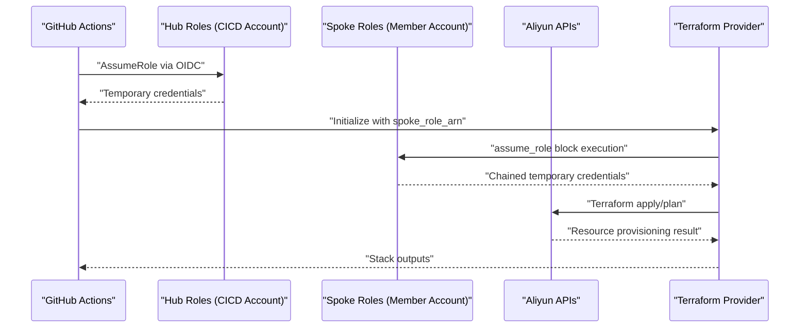

**Diagram sources**
- [bootstrap/01-cicd-foundation/main.tf:49-149](file://bootstrap/01-cicd-foundation/main.tf#L49-L149)
- [bootstrap/02-spoke-bootstrap/modules/spoke-roles/main.tf:1-42](file://bootstrap/02-spoke-bootstrap/modules/spoke-roles/main.tf#L1-L42)
- [stacks/10-identity-cloudsso/providers.tf:3-7](file://stacks/10-identity-cloudsso/providers.tf#L3-L7)
- [stacks/20-network-cen/providers.tf:3-7](file://stacks/20-network-cen/providers.tf#L3-L7)
- [.github/workflows/stacks.yml:42-99](file://.github/workflows/stacks.yml#L42-L99)
- [.github/workflows/terraform-reusable.yml:50-55](file://.github/workflows/terraform-reusable.yml#L50-L55)

## Detailed Component Analysis

### Stack Composition Pattern
Each stack follows a consistent structure with complete Terraform configurations:
- providers.tf: Declares provider configuration with assume_role blocks and session management.
- variables.tf: Defines inputs consumed by the stack including region, spoke_role_arn, and service-specific parameters.
- main.tf: Implements the category's resources using the configured provider with production-ready module sourcing comments.
- outputs.tf: Exposes identifiers for downstream consumption and cross-stack dependencies.

Provider configuration and variable injection are orchestrated by the CI/CD workflow matrix and reusable workflow.

**Updated** Enhanced with complete provider configuration examples and assume_role patterns

**Section sources**
- [.github/workflows/stacks.yml:34-67](file://.github/workflows/stacks.yml#L34-L67)
- [.github/workflows/stacks.yml:86-111](file://.github/workflows/stacks.yml#L86-L111)
- [.github/workflows/terraform-reusable.yml:5-32](file://.github/workflows/terraform-reusable.yml#L5-L32)
- [stacks/10-identity-cloudsso/providers.tf:1-9](file://stacks/10-identity-cloudsso/providers.tf#L1-L9)
- [stacks/20-network-cen/providers.tf:1-9](file://stacks/20-network-cen/providers.tf#L1-L9)

### Identity & Access Management (CloudSSO) - 10-identity-cloudsso
- Purpose: Centralized identity provisioning and access configuration using Alibaba Cloud CloudSSO.
- Implementation: Complete Terraform configuration with provider targeting and placeholder for LZA module integration.
- Provider Configuration: Uses assume_role with dedicated session name "tf-identity-cloudsso" and 3600-second expiration.
- Variables: Supports region configuration and spoke role ARN injection via TF_VAR_spoke_role_arn.

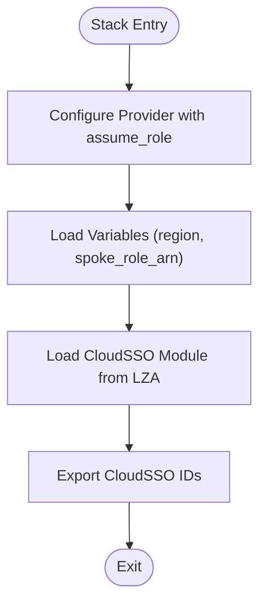

**Diagram sources**
- [stacks/10-identity-cloudsso/main.tf:1-10](file://stacks/10-identity-cloudsso/main.tf#L1-L10)
- [stacks/10-identity-cloudsso/providers.tf:1-9](file://stacks/10-identity-cloudsso/providers.tf#L1-L9)
- [stacks/10-identity-cloudsso/variables.tf:1-11](file://stacks/10-identity-cloudsso/variables.tf#L1-L11)

**Section sources**
- [stacks/10-identity-cloudsso/main.tf:1-10](file://stacks/10-identity-cloudsso/main.tf#L1-L10)
- [stacks/10-identity-cloudsso/providers.tf:1-9](file://stacks/10-identity-cloudsso/providers.tf#L1-L9)
- [stacks/10-identity-cloudsso/variables.tf:1-11](file://stacks/10-identity-cloudsso/variables.tf#L1-L11)
- [stacks/10-identity-cloudsso/outputs.tf:1-3](file://stacks/10-identity-cloudsso/outputs.tf#L1-L3)

### Logging Infrastructure (Log Archive) - 11-log-archive
- Purpose: Centralize audit logs using Serverless Log Service (SLS) for compliance and monitoring.
- Implementation: Complete Terraform configuration with provider targeting and placeholder for LZA log archive module.
- Provider Configuration: Uses assume_role with dedicated session name and configurable session expiration.
- Integration: Designed to collect and centralize logs from multiple spoke accounts into unified storage.

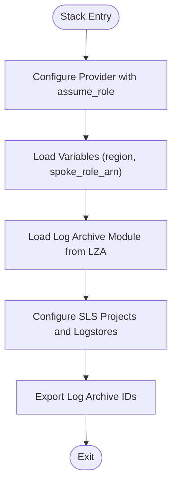

**Diagram sources**
- [stacks/11-log-archive/main.tf:1-10](file://stacks/11-log-archive/main.tf#L1-L10)

**Section sources**
- [stacks/11-log-archive/main.tf:1-10](file://stacks/11-log-archive/main.tf#L1-L10)

### Security Controls: Guardrails (Preventive) - 12-guardrails-preventive
- Purpose: Enforce Resource Directory control policies to prevent prohibited configurations across member accounts.
- Implementation: Complete Terraform configuration with provider targeting and placeholder for LZA preventive guardrails module.
- Policy Enforcement: Configures automated policy enforcement to maintain security baseline compliance.
- Scope: Applies preventive controls that block non-compliant resource creation before deployment.

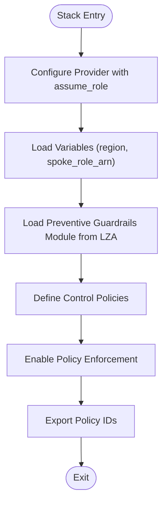

**Diagram sources**
- [stacks/12-guardrails-preventive/main.tf:1-10](file://stacks/12-guardrails-preventive/main.tf#L1-L10)

**Section sources**
- [stacks/12-guardrails-preventive/main.tf:1-10](file://stacks/12-guardrails-preventive/main.tf#L1-L10)

### Security Controls: Guardrails (Detective) - 13-guardrails-detective
- Purpose: Detect misconfigurations using Cloud Config rules and continuous compliance monitoring.
- Implementation: Complete Terraform configuration with provider targeting and placeholder for LZA detective guardrails module.
- Rule Engine: Configures Cloud Config rules for continuous compliance checking and drift detection.
- Alerting: Integrates with alerting systems to notify administrators of compliance violations.

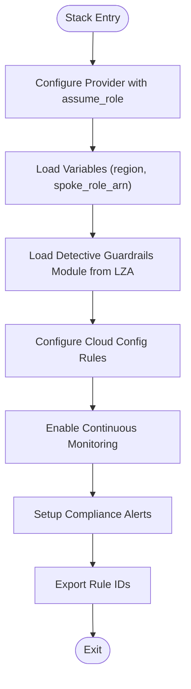

**Diagram sources**
- [stacks/13-guardrails-detective/main.tf:1-10](file://stacks/13-guardrails-detective/main.tf#L1-L10)

**Section sources**
- [stacks/13-guardrails-detective/main.tf:1-10](file://stacks/13-guardrails-detective/main.tf#L1-L10)

### Network Foundation: CEN (Cloud Enterprise Network) - 20-network-cen
- Purpose: Establish a hub-and-spoke network backbone connecting VPCs across regions and accounts.
- Implementation: **Fully implemented** with direct CEN instance resource definition and complete provider configuration.
- Provider Configuration: Uses assume_role with dedicated session name "tf-network-cen" and 3600-second expiration.
- Resources: Creates CEN instance with configurable naming and description for production environments.
- Outputs: Exposes CEN instance ID for cross-stack dependencies and network topology management.

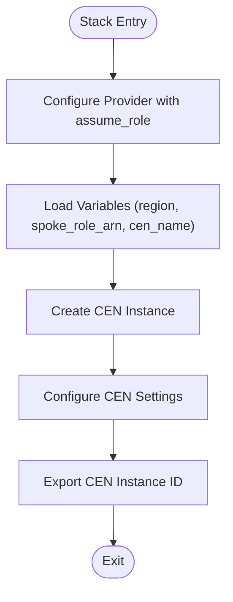

**Diagram sources**
- [stacks/20-network-cen/main.tf:12-16](file://stacks/20-network-cen/main.tf#L12-L16)
- [stacks/20-network-cen/providers.tf:1-9](file://stacks/20-network-cen/providers.tf#L1-L9)
- [stacks/20-network-cen/variables.tf:12-16](file://stacks/20-network-cen/variables.tf#L12-L16)
- [stacks/20-network-cen/outputs.tf:1-5](file://stacks/20-network-cen/outputs.tf#L1-L5)

**Section sources**
- [stacks/20-network-cen/main.tf:1-16](file://stacks/20-network-cen/main.tf#L1-L16)
- [stacks/20-network-cen/providers.tf:1-9](file://stacks/20-network-cen/providers.tf#L1-L9)
- [stacks/20-network-cen/variables.tf:1-17](file://stacks/20-network-cen/variables.tf#L1-L17)
- [stacks/20-network-cen/outputs.tf:1-5](file://stacks/20-network-cen/outputs.tf#L1-L5)

### Network Foundation: DMZ - 21-network-dmz
- Purpose: Provide a demilitarized zone with VPC, NAT Gateway, and EIP for secure internet access.
- Implementation: Complete Terraform configuration with provider targeting and placeholder for LZA DMZ module.
- Security Isolation: Creates isolated network segment for public-facing services with controlled egress.
- Network Components: Includes VPC, subnets, NAT Gateway, and Elastic IP configuration for outbound connectivity.

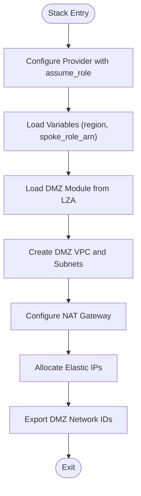

**Diagram sources**
- [stacks/21-network-dmz/main.tf:1-10](file://stacks/21-network-dmz/main.tf#L1-L10)

**Section sources**
- [stacks/21-network-dmz/main.tf:1-10](file://stacks/21-network-dmz/main.tf#L1-L10)

### Security Controls: KMS - 30-security-kms
- Purpose: Manage Customer Master Keys for encryption at rest and in transit across services.
- Implementation: Complete Terraform configuration with provider targeting and placeholder for LZA KMS module.
- Key Management: Provides centralized key lifecycle management with rotation policies and access controls.
- Service Integration: Enables encryption for other Alibaba Cloud services through KMS API integration.

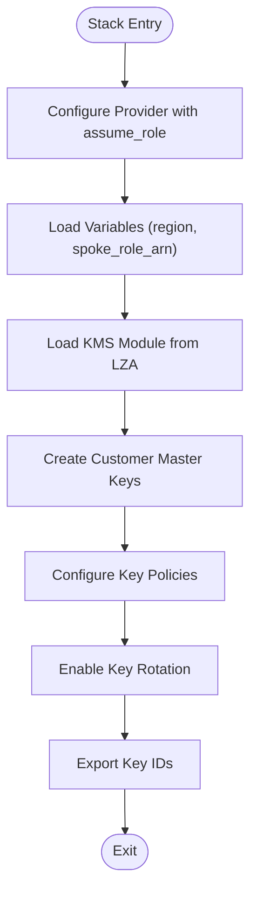

**Diagram sources**
- [stacks/30-security-kms/main.tf:1-10](file://stacks/30-security-kms/main.tf#L1-L10)
- [stacks/30-security-kms/providers.tf:1-9](file://stacks/30-security-kms/providers.tf#L1-L9)
- [stacks/30-security-kms/variables.tf:1-11](file://stacks/30-security-kms/variables.tf#L1-L11)

**Section sources**
- [stacks/30-security-kms/main.tf:1-10](file://stacks/30-security-kms/main.tf#L1-L10)
- [stacks/30-security-kms/providers.tf:1-9](file://stacks/30-security-kms/providers.tf#L1-L9)
- [stacks/30-security-kms/variables.tf:1-11](file://stacks/30-security-kms/variables.tf#L1-L11)

### Security Controls: Firewall - 30-security-firewall
- Purpose: Configure Cloud Firewall for network security, traffic inspection, and threat prevention.
- Implementation: Complete Terraform configuration with provider targeting and placeholder for LZA Cloud Firewall module.
- Traffic Control: Provides centralized firewall policies for inter-VPC and internet traffic management.
- Threat Prevention: Integrates with threat intelligence feeds and intrusion detection capabilities.

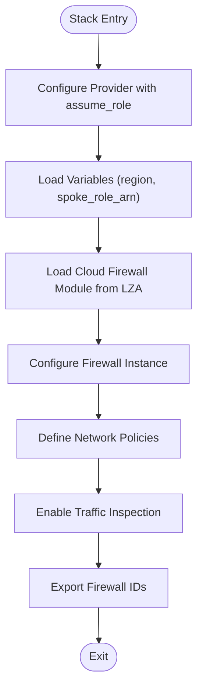

**Diagram sources**
- [stacks/30-security-firewall/main.tf:1-10](file://stacks/30-security-firewall/main.tf#L1-L10)
- [stacks/30-security-firewall/providers.tf:1-9](file://stacks/30-security-firewall/providers.tf#L1-L9)

**Section sources**
- [stacks/30-security-firewall/main.tf:1-10](file://stacks/30-security-firewall/main.tf#L1-L10)
- [stacks/30-security-firewall/providers.tf:1-9](file://stacks/30-security-firewall/providers.tf#L1-L9)

### Security Controls: WAF - 30-security-waf
- Purpose: Protect web applications with Web Application Firewall against common web exploits.
- Implementation: Complete Terraform configuration with provider targeting and placeholder for LZA WAFv3 module.
- Web Security: Provides protection against SQL injection, XSS, and other OWASP Top 10 vulnerabilities.
- Custom Rules: Supports custom rule creation and integration with threat intelligence feeds.

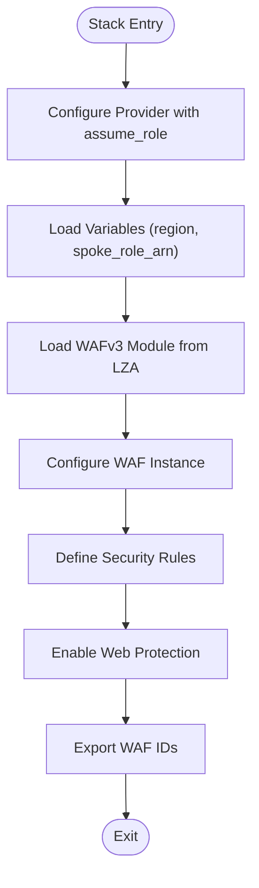

**Diagram sources**
- [stacks/30-security-waf/main.tf:1-10](file://stacks/30-security-waf/main.tf#L1-L10)
- [stacks/30-security-waf/providers.tf:1-9](file://stacks/30-security-waf/providers.tf#L1-L9)

**Section sources**
- [stacks/30-security-waf/main.tf:1-10](file://stacks/30-security-waf/main.tf#L1-L10)
- [stacks/30-security-waf/providers.tf:1-9](file://stacks/30-security-waf/providers.tf#L1-L9)

## Dependency Analysis
- Bootstrapping order: Organization structure must exist before deploying spoke roles; the CI/CD foundation must be established before stacks can assume hub roles.
- Provider targeting: Each stack independently configures its provider with assume_role blocks, eliminating shared provider state complexity.
- Role chaining: CI/CD hub roles assume spoke roles to provision resources; the reusable workflow injects the spoke role ARN via TF_VAR_spoke_role_arn.
- Deployment sequencing: The stacks workflow runs plan on pull requests and apply on pushes to main, with apply jobs serialized to avoid contention.
- Cross-stack dependencies: Network components (CEN) provide foundational resources consumed by other stacks through output references.

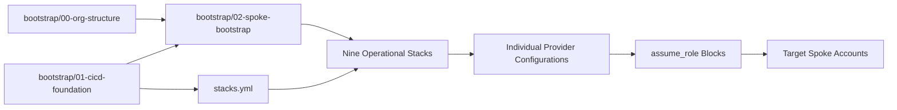

**Diagram sources**
- [bootstrap/00-org-structure/main.tf:1-49](file://bootstrap/00-org-structure/main.tf#L1-L49)
- [bootstrap/01-cicd-foundation/main.tf:1-150](file://bootstrap/01-cicd-foundation/main.tf#L1-L150)
- [bootstrap/02-spoke-bootstrap/main.tf:1-33](file://bootstrap/02-spoke-bootstrap/main.tf#L1-L33)
- [stacks/10-identity-cloudsso/providers.tf:3-7](file://stacks/10-identity-cloudsso/providers.tf#L3-L7)
- [stacks/20-network-cen/providers.tf:3-7](file://stacks/20-network-cen/providers.tf#L3-L7)
- [.github/workflows/stacks.yml:18-112](file://.github/workflows/stacks.yml#L18-L112)

**Section sources**
- [bootstrap/00-org-structure/main.tf:1-49](file://bootstrap/00-org-structure/main.tf#L1-L49)
- [bootstrap/01-cicd-foundation/main.tf:1-150](file://bootstrap/01-cicd-foundation/main.tf#L1-L150)
- [bootstrap/02-spoke-bootstrap/main.tf:1-33](file://bootstrap/02-spoke-bootstrap/main.tf#L1-L33)
- [stacks/10-identity-cloudsso/providers.tf:3-7](file://stacks/10-identity-cloudsso/providers.tf#L3-L7)
- [stacks/20-network-cen/providers.tf:3-7](file://stacks/20-network-cen/providers.tf#L3-L7)
- [.github/workflows/stacks.yml:18-112](file://.github/workflows/stacks.yml#L18-L112)

## Performance Considerations
- State backend: Using OSS with SSE-KMS ensures encrypted state at rest; enable lifecycle expiration for old versions to control cost and retention.
- Locking: OTS table provides distributed locking to prevent concurrent applies; keep apply jobs serialized when necessary.
- Provider isolation: Each stack maintains independent provider configurations, reducing cross-account assumption overhead and improving reliability.
- Session management: Configurable session expiration (default 3600 seconds) balances security and performance for long-running operations.
- CI/CD cadence: Schedule periodic plan-only runs to detect drift without applying changes.

## Troubleshooting Guide
- OIDC credential failures: Verify OIDC provider ARN and hub role ARNs in repository variables; confirm GitHub Actions permissions for id-token.
- Role assumption errors: Confirm spoke roles trust the hub roles and that the spoke role ARN is correctly passed via TF_VAR_spoke_role_arn.
- Provider configuration issues: Check individual stack providers.tf files for correct assume_role configuration and session settings.
- State initialization: After migrating to OSS backend, ensure backend configuration is present and run terraform init -migrate-state.
- Drift detection: Use scheduled plan-only runs to surface configuration drift early.
- Cross-stack dependencies: Verify output references between stacks and ensure dependent resources are created first.

**Section sources**
- [.github/workflows/stacks.yml:42-99](file://.github/workflows/stacks.yml#L42-L99)
- [.github/workflows/terraform-reusable.yml:50-55](file://.github/workflows/terraform-reusable.yml#L50-L55)
- [README.md:78-87](file://README.md#L78-L87)
- [README.md:129-139](file://README.md#L129-L139)
- [stacks/10-identity-cloudsso/providers.tf:3-7](file://stacks/10-identity-cloudsso/providers.tf#L3-L7)
- [stacks/20-network-cen/providers.tf:3-7](file://stacks/20-network-cen/providers.tf#L3-L7)

## Conclusion
This modular stack architecture provides a complete multi-stack deployment system with nine operational stacks covering identity management, logging infrastructure, security controls, and network foundation. Each stack implements complete Terraform configurations with independent provider targeting, assume_role patterns, variable management, and output specifications. The system enforces least privilege through hub/spoke role delegation, enables safe automation via CI/CD integration, and scales to new stacks and spoke accounts while maintaining consistent architectural patterns and security controls.

## Appendices

### Stack Categories and Targets
- Identity & Access Management: CloudSSO (target: devops) - 10-identity-cloudsso
- Logging Infrastructure: Log Archive (target: log-archive) - 11-log-archive
- Security Controls: Guardrails Preventive (targets: devops, security) - 12-guardrails-preventive
- Security Controls: Guardrails Detective (targets: devops, security) - 13-guardrails-detective
- Network Foundation: CEN (target: network) - 20-network-cen
- Network Foundation: DMZ (target: network) - 21-network-dmz
- Security Services: KMS (target: security) - 30-security-kms
- Security Services: Firewall (target: network) - 30-security-firewall
- Security Services: WAF (target: shared) - 30-security-waf

**Section sources**
- [.github/workflows/stacks.yml:24-33](file://.github/workflows/stacks.yml#L24-L33)
- [.github/workflows/stacks.yml:77-85](file://.github/workflows/stacks.yml#L77-L85)

### Provider Configuration and Variable Management
- Independent Provider Configuration: Each stack defines its own provider with assume_role blocks and dedicated session names.
- Variable Injection: TF_VAR_spoke_role_arn is set by the workflow to chain into spoke roles for each stack execution.
- Session Management: Configurable session expiration (default 3600 seconds) for security and performance balance.
- Version Pinning: Terraform version is configured in the reusable workflow for consistent deployments.
- Production Readiness: All stacks include comments indicating LZA module sourcing patterns for production deployments.

**Section sources**
- [stacks/10-identity-cloudsso/providers.tf:1-9](file://stacks/10-identity-cloudsso/providers.tf#L1-L9)
- [stacks/20-network-cen/providers.tf:1-9](file://stacks/20-network-cen/providers.tf#L1-L9)
- [stacks/10-identity-cloudsso/variables.tf:7-10](file://stacks/10-identity-cloudsso/variables.tf#L7-L10)
- [stacks/20-network-cen/variables.tf:7-10](file://stacks/20-network-cen/variables.tf#L7-L10)
- [.github/workflows/stacks.yml:58-59](file://.github/workflows/stacks.yml#L58-L59)
- [.github/workflows/stacks.yml:109-110](file://.github/workflows/stacks.yml#L109-L110)
- [.github/workflows/terraform-reusable.yml:5-32](file://.github/workflows/terraform-reusable.yml#L5-L32)

### Complete Stack Implementation Examples
- CEN Stack: Fully implemented with direct resource definition, complete variable schema, and output specifications.
- Provider Patterns: Consistent assume_role configuration across all stacks with dedicated session names.
- Variable Management: Standardized variable definitions including region, spoke_role_arn, and service-specific parameters.
- Output Specifications: Structured outputs for cross-stack dependencies and resource identification.

**Section sources**
- [stacks/20-network-cen/main.tf:12-16](file://stacks/20-network-cen/main.tf#L12-L16)
- [stacks/20-network-cen/variables.tf:12-16](file://stacks/20-network-cen/variables.tf#L12-L16)
- [stacks/20-network-cen/outputs.tf:1-5](file://stacks/20-network-cen/outputs.tf#L1-L5)
- [stacks/10-identity-cloudsso/providers.tf:3-7](file://stacks/10-identity-cloudsso/providers.tf#L3-L7)
- [stacks/30-security-kms/providers.tf:3-7](file://stacks/30-security-kms/providers.tf#L3-L7)