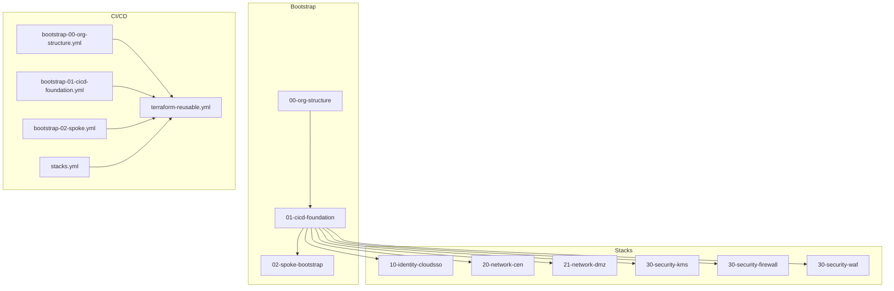
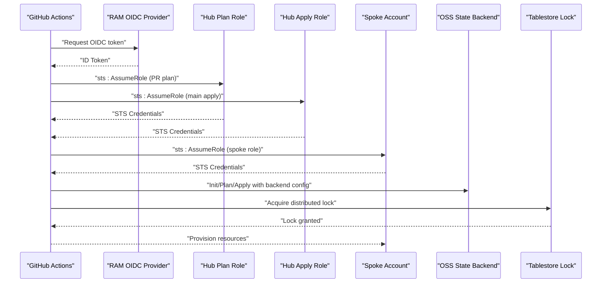
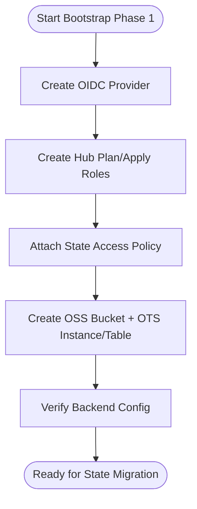
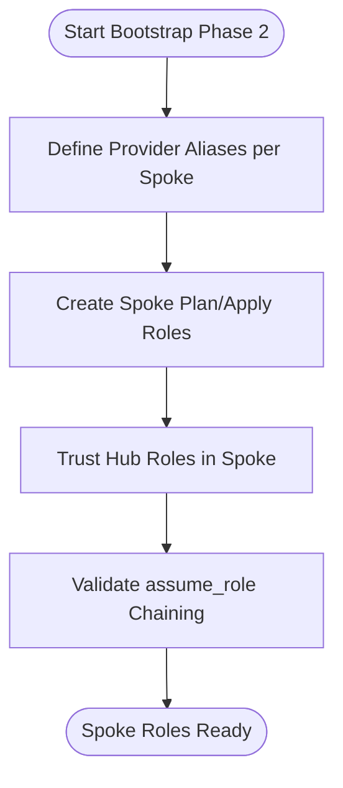
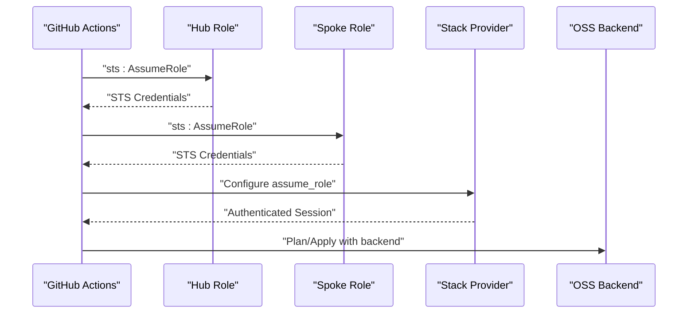
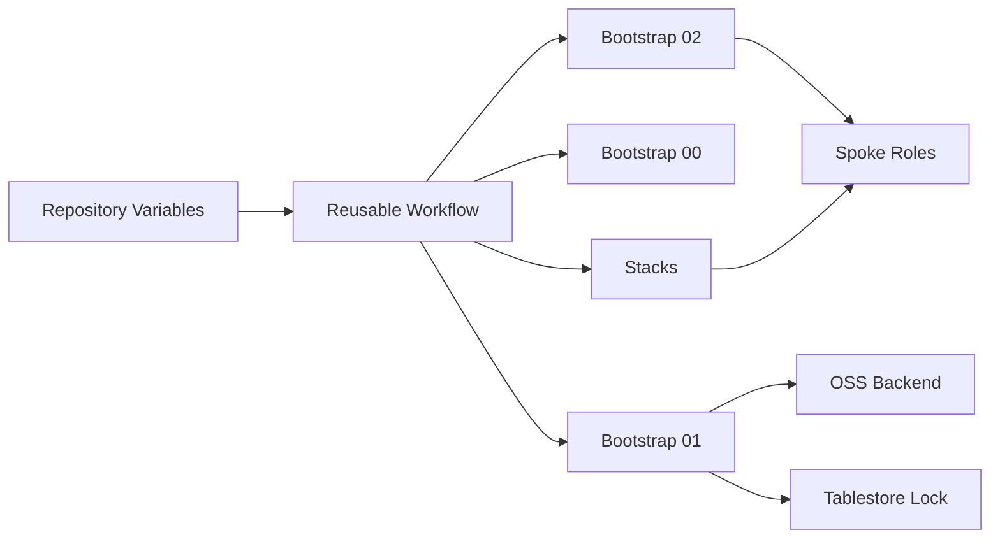

# Troubleshooting Guide

<cite>
**Referenced Files in This Document**
- [README.md](file://README.md)
- [bootstrap/00-org-structure/main.tf](file://bootstrap/00-org-structure/main.tf)
- [bootstrap/01-cicd-foundation/main.tf](file://bootstrap/01-cicd-foundation/main.tf)
- [bootstrap/01-cicd-foundation/providers.tf](file://bootstrap/01-cicd-foundation/providers.tf)
- [bootstrap/01-cicd-foundation/backend.tf.example](file://bootstrap/01-cicd-foundation/backend.tf.example)
- [bootstrap/02-spoke-bootstrap/main.tf](file://bootstrap/02-spoke-bootstrap/main.tf)
- [bootstrap/02-spoke-bootstrap/providers.tf](file://bootstrap/02-spoke-bootstrap/providers.tf)
- [bootstrap/02-spoke-bootstrap/modules/spoke-roles/main.tf](file://bootstrap/02-spoke-bootstrap/modules/spoke-roles/main.tf)
- [.github/workflows/bootstrap-00-org-structure.yml](file://.github/workflows/bootstrap-00-org-structure.yml)
- [.github/workflows/bootstrap-01-cicd-foundation.yml](file://.github/workflows/bootstrap-01-cicd-foundation.yml)
- [.github/workflows/bootstrap-02-spoke.yml](file://.github/workflows/bootstrap-02-spoke.yml)
- [.github/workflows/stacks.yml](file://.github/workflows/stacks.yml)
- [.github/workflows/terraform-reusable.yml](file://.github/workflows/terraform-reusable.yml)
- [stacks/10-identity-cloudsso/providers.tf](file://stacks/10-identity-cloudsso/providers.tf)
- [stacks/20-network-cen/providers.tf](file://stacks/20-network-cen/providers.tf)
- [stacks/30-security-firewall/providers.tf](file://stacks/30-security-firewall/providers.tf)
</cite>

## Table of Contents
1. [Introduction](#introduction)
2. [Project Structure](#project-structure)
3. [Core Components](#core-components)
4. [Architecture Overview](#architecture-overview)
5. [Detailed Component Analysis](#detailed-component-analysis)
6. [Dependency Analysis](#dependency-analysis)
7. [Performance Considerations](#performance-considerations)
8. [Troubleshooting Guide](#troubleshooting-guide)
9. [Conclusion](#conclusion)
10. [Appendices](#appendices)

## Introduction
This guide provides a comprehensive troubleshooting reference for the Alibaba Cloud Landing Zone Accelerator deployed via Terraform and GitHub Actions. It focuses on diagnosing and resolving bootstrap failures, state migration issues, CI/CD pipeline errors, OIDC authentication and role assumption problems, provider configuration issues, state backend connectivity and distributed locking conflicts, drift detection failures, and recovery procedures for corrupted state and failed deployments. It also includes escalation procedures and support resources.

## Project Structure
The repository is organized into three bootstrap phases, multiple stacks, and GitHub Actions workflows. The bootstrap phases establish the organization structure, CI/CD foundation (OIDC, state backend, locking), and spoke roles. Stacks represent domain-specific infrastructure managed by the CI/CD pipeline.

**Diagram sources**
- [README.md:141-165](file://README.md#L141-L165)
- [.github/workflows/bootstrap-00-org-structure.yml:1-36](file://.github/workflows/bootstrap-00-org-structure.yml#L1-L36)
- [.github/workflows/bootstrap-01-cicd-foundation.yml:1-36](file://.github/workflows/bootstrap-01-cicd-foundation.yml#L1-L36)
- [.github/workflows/bootstrap-02-spoke.yml:1-36](file://.github/workflows/bootstrap-02-spoke.yml#L1-L36)
- [.github/workflows/stacks.yml:1-112](file://.github/workflows/stacks.yml#L1-L112)
- [.github/workflows/terraform-reusable.yml:1-118](file://.github/workflows/terraform-reusable.yml#L1-L118)

**Section sources**
- [README.md:141-165](file://README.md#L141-L165)

## Core Components
- Bootstrap phases:
  - Organization structure creation and member account provisioning.
  - CI/CD foundation: OIDC provider, hub roles, OSS state bucket, Tablestore lock table.
  - Spoke bootstrap: spoke roles per member account trusting hub roles.
- Stacks: domain-specific infrastructure targeting spoke accounts via provider assume_role chaining.
- Workflows: reusable workflow orchestrating OIDC credential configuration, Terraform init/plan/apply, and artifact upload.

**Section sources**
- [bootstrap/00-org-structure/main.tf:1-49](file://bootstrap/00-org-structure/main.tf#L1-L49)
- [bootstrap/01-cicd-foundation/main.tf:1-150](file://bootstrap/01-cicd-foundation/main.tf#L1-L150)
- [bootstrap/02-spoke-bootstrap/main.tf:1-33](file://bootstrap/02-spoke-bootstrap/main.tf#L1-L33)
- [bootstrap/02-spoke-bootstrap/modules/spoke-roles/main.tf:1-42](file://bootstrap/02-spoke-bootstrap/modules/spoke-roles/main.tf#L1-L42)
- [.github/workflows/terraform-reusable.yml:1-118](file://.github/workflows/terraform-reusable.yml#L1-L118)

## Architecture Overview
The CI/CD architecture relies on GitHub OIDC tokens exchanged for short-lived STS tokens, then chained through hub roles to spoke roles for provisioning in target accounts. State is stored in OSS with server-side KMS encryption and locked via Tablestore.

**Diagram sources**
- [README.md:23-28](file://README.md#L23-L28)
- [bootstrap/01-cicd-foundation/main.tf:49-105](file://bootstrap/01-cicd-foundation/main.tf#L49-L105)
- [bootstrap/02-spoke-bootstrap/modules/spoke-roles/main.tf:3-41](file://bootstrap/02-spoke-bootstrap/modules/spoke-roles/main.tf#L3-L41)
- [bootstrap/01-cicd-foundation/backend.tf.example:13-22](file://bootstrap/01-cicd-foundation/backend.tf.example#L13-L22)

## Detailed Component Analysis

### Bootstrap Phase 1: CI/CD Foundation
Issues commonly involve OIDC provider creation, hub role policies, and state backend configuration.

**Diagram sources**
- [bootstrap/01-cicd-foundation/main.tf:49-150](file://bootstrap/01-cicd-foundation/main.tf#L49-L150)
- [bootstrap/01-cicd-foundation/providers.tf:1-16](file://bootstrap/01-cicd-foundation/providers.tf#L1-L16)
- [bootstrap/01-cicd-foundation/backend.tf.example:13-22](file://bootstrap/01-cicd-foundation/backend.tf.example#L13-L22)

**Section sources**
- [bootstrap/01-cicd-foundation/main.tf:49-150](file://bootstrap/01-cicd-foundation/main.tf#L49-L150)
- [bootstrap/01-cicd-foundation/providers.tf:1-16](file://bootstrap/01-cicd-foundation/providers.tf#L1-L16)
- [bootstrap/01-cicd-foundation/backend.tf.example:13-22](file://bootstrap/01-cicd-foundation/backend.tf.example#L13-L22)

### Bootstrap Phase 2: Spoke Bootstrap
Issues commonly involve spoke role trust policies and provider alias configuration for cross-account assume_role chaining.

**Diagram sources**
- [bootstrap/02-spoke-bootstrap/providers.tf:1-51](file://bootstrap/02-spoke-bootstrap/providers.tf#L1-L51)
- [bootstrap/02-spoke-bootstrap/modules/spoke-roles/main.tf:3-41](file://bootstrap/02-spoke-bootstrap/modules/spoke-roles/main.tf#L3-L41)
- [bootstrap/02-spoke-bootstrap/main.tf:1-33](file://bootstrap/02-spoke-bootstrap/main.tf#L1-L33)

**Section sources**
- [bootstrap/02-spoke-bootstrap/providers.tf:1-51](file://bootstrap/02-spoke-bootstrap/providers.tf#L1-L51)
- [bootstrap/02-spoke-bootstrap/modules/spoke-roles/main.tf:3-41](file://bootstrap/02-spoke-bootstrap/modules/spoke-roles/main.tf#L3-L41)
- [bootstrap/02-spoke-bootstrap/main.tf:1-33](file://bootstrap/02-spoke-bootstrap/main.tf#L1-L33)

### Stacks: Provider Chaining and Drift Detection
Stacks configure provider assume_role to chain from hub to spoke roles. Drift detection is supported via plan-only runs.

**Diagram sources**
- [stacks/10-identity-cloudsso/providers.tf:1-9](file://stacks/10-identity-cloudsso/providers.tf#L1-L9)
- [stacks/20-network-cen/providers.tf:1-9](file://stacks/20-network-cen/providers.tf#L1-L9)
- [stacks/30-security-firewall/providers.tf:1-9](file://stacks/30-security-firewall/providers.tf#L1-L9)
- [.github/workflows/stacks.yml:42-111](file://.github/workflows/stacks.yml#L42-L111)

**Section sources**
- [stacks/10-identity-cloudsso/providers.tf:1-9](file://stacks/10-identity-cloudsso/providers.tf#L1-L9)
- [stacks/20-network-cen/providers.tf:1-9](file://stacks/20-network-cen/providers.tf#L1-L9)
- [stacks/30-security-firewall/providers.tf:1-9](file://stacks/30-security-firewall/providers.tf#L1-L9)
- [.github/workflows/stacks.yml:42-111](file://.github/workflows/stacks.yml#L42-L111)

## Dependency Analysis
- Bootstrap phases depend on each other: org structure precedes CI/CD foundation, which precedes spoke bootstrap.
- Workflows depend on repository variables (hub account ID, role ARNs, OIDC provider ARN, spoke account IDs).
- Stacks depend on spoke roles configured during spoke bootstrap and on the reusable workflow for OIDC credential configuration.

**Diagram sources**
- [.github/workflows/terraform-reusable.yml:1-118](file://.github/workflows/terraform-reusable.yml#L1-L118)
- [.github/workflows/stacks.yml:1-112](file://.github/workflows/stacks.yml#L1-L112)
- [README.md:96-105](file://README.md#L96-L105)

**Section sources**
- [.github/workflows/stacks.yml:1-112](file://.github/workflows/stacks.yml#L1-L112)
- [README.md:96-105](file://README.md#L96-L105)

## Performance Considerations
- Prefer plan-only runs for drift detection to reduce compute and locking contention.
- Use matrix strategies to parallelize independent stacks while limiting apply concurrency to avoid lock conflicts.
- Keep session durations aligned with provider limits and enable auto-approve only for apply jobs in protected environments.

[No sources needed since this section provides general guidance]

## Troubleshooting Guide

### A. Bootstrap Failures

Common symptoms:
- OIDC provider creation fails or missing.
- Hub roles lack permissions to access OSS/OTS or assume spoke roles.
- Spoke roles not created or trust policy invalid.

Step-by-step resolution:
1. Verify OIDC provider ARN exists and matches the workflow variable.
2. Confirm hub roles have the HubStateAccess policy attached and correct assume role conditions.
3. Ensure provider aliases for spoke accounts are defined and assume_role chaining works from management to spoke.
4. Validate spoke roles exist and trust hub roles with correct principals.
5. Re-run the failing bootstrap job with debug logs enabled.

Diagnostic commands:
- List OIDC providers in the hub account.
- Inspect hub role policies and trust policies.
- Describe spoke roles and their trust relationships.

Escalation:
- Review workflow permissions and OIDC audience/issuer conditions.
- Confirm GitHub repository variables are set and environment protection rules are satisfied.

**Section sources**
- [bootstrap/01-cicd-foundation/main.tf:49-150](file://bootstrap/01-cicd-foundation/main.tf#L49-L150)
- [bootstrap/02-spoke-bootstrap/providers.tf:1-51](file://bootstrap/02-spoke-bootstrap/providers.tf#L1-L51)
- [bootstrap/02-spoke-bootstrap/modules/spoke-roles/main.tf:3-41](file://bootstrap/02-spoke-bootstrap/modules/spoke-roles/main.tf#L3-L41)
- [.github/workflows/bootstrap-00-org-structure.yml:18-36](file://.github/workflows/bootstrap-00-org-structure.yml#L18-L36)
- [.github/workflows/bootstrap-01-cicd-foundation.yml:18-36](file://.github/workflows/bootstrap-01-cicd-foundation.yml#L18-L36)
- [.github/workflows/bootstrap-02-spoke.yml:18-36](file://.github/workflows/bootstrap-02-spoke.yml#L18-L36)

### B. State Migration Problems

Common symptoms:
- terraform init fails after adding backend block.
- Migration errors due to missing credentials or incorrect backend configuration.

Step-by-step resolution:
1. Export temporary STS credentials using the ResourceDirectoryAccountAccessRole in the CICD account.
2. Initialize with state migration enabled.
3. Verify OSS bucket and Tablestore table exist and are reachable.
4. Ensure backend keys and prefixes match the intended stack.

Diagnostic commands:
- Verify OSS bucket versioning and SSE-KMS settings.
- Check Tablestore instance/table availability and endpoint.

Escalation:
- Confirm the backend block region and tablestore_endpoint align with the hub account configuration.

**Section sources**
- [bootstrap/01-cicd-foundation/backend.tf.example:1-23](file://bootstrap/01-cicd-foundation/backend.tf.example#L1-L23)
- [bootstrap/01-cicd-foundation/main.tf:5-43](file://bootstrap/01-cicd-foundation/main.tf#L5-L43)

### C. CI/CD Pipeline Errors

Common symptoms:
- OIDC token request fails or insufficient permissions.
- Role assumption fails in either hub or spoke accounts.
- Provider configuration issues in stacks.

Step-by-step resolution:
1. Validate repository variables: hub account ID, GHA_PLAN_ROLE_ARN, GHA_APPLY_ROLE_ARN, OIDC_PROVIDER_ARN, SPOKE_ACCOUNT_IDS_JSON.
2. Confirm workflow permissions include id-token: write.
3. For plan jobs, ensure the Plan role ARN is used; for apply jobs, ensure the Apply role ARN is used and environment protection is enforced.
4. Verify spoke role ARN passed to stacks matches the spoke account ID.
5. Check reusable workflow inputs and working directory.

Diagnostic commands:
- Inspect workflow run logs for OIDC token acquisition and role assumption steps.
- Validate assume_role chaining from hub to spoke using describe-role APIs.

Escalation:
- Review environment protection rules and required reviewers for the production environment.

**Section sources**
- [.github/workflows/stacks.yml:42-111](file://.github/workflows/stacks.yml#L42-L111)
- [.github/workflows/terraform-reusable.yml:1-118](file://.github/workflows/terraform-reusable.yml#L1-118)
- [README.md:96-105](file://README.md#L96-L105)

### D. Debugging OIDC Authentication Issues

Common symptoms:
- OIDC token rejected by RAM.
- Audience or issuer mismatch.
- Missing or incorrect sub condition for PR vs production.

Step-by-step resolution:
1. Confirm OIDC provider ARN and issuer URL in the hub account.
2. Verify workflow uses the correct OIDC provider ARN and audience value.
3. Ensure conditions match repository pattern for PRs and production environment.
4. Test OIDC token retrieval and role assumption locally using the credentials action.

Diagnostic commands:
- List OIDC providers and their client IDs.
- Compare conditions in hub roles with repository path patterns.

Escalation:
- Validate GitHub Actions permissions and repository-level OIDC settings.

**Section sources**
- [bootstrap/01-cicd-foundation/main.tf:49-105](file://bootstrap/01-cicd-foundation/main.tf#L49-L105)
- [.github/workflows/terraform-reusable.yml:50-56](file://.github/workflows/terraform-reusable.yml#L50-L56)

### E. Role Assumption Failures

Common symptoms:
- sts:AssumeRole denied due to trust policy mismatch.
- Insufficient privileges after assumption.
- Session duration or expiration issues.

Step-by-step resolution:
1. Verify spoke roles trust hub roles with correct principals.
2. Confirm hub roles have HubStateAccess policy allowing sts:AssumeRole on spoke roles.
3. Check session duration limits and adjust provider assume_role settings.
4. Validate that the spoke role ARN passed to stacks matches the spoke account.

Diagnostic commands:
- Describe spoke roles and trust policies.
- List hub role policies and attachments.

Escalation:
- Review least-privilege policies and environment protection rules.

**Section sources**
- [bootstrap/02-spoke-bootstrap/modules/spoke-roles/main.tf:3-41](file://bootstrap/02-spoke-bootstrap/modules/spoke-roles/main.tf#L3-L41)
- [bootstrap/01-cicd-foundation/main.tf:112-149](file://bootstrap/01-cicd-foundation/main.tf#L112-L149)
- [stacks/10-identity-cloudsso/providers.tf:1-9](file://stacks/10-identity-cloudsso/providers.tf#L1-L9)

### F. Provider Configuration Problems

Common symptoms:
- Provider alias not found or misconfigured.
- assume_role chaining fails across accounts.
- Region mismatch or missing session name.

Step-by-step resolution:
1. Ensure provider aliases for spoke accounts are defined and use ResourceDirectoryAccountAccessRole.
2. Verify assume_role settings include role_arn and session_name.
3. Align regions across providers and stacks.
4. Pass spoke role ARN via TF_VAR_spoke_role_arn to stacks.

Diagnostic commands:
- List provider aliases and their assume_role configurations.
- Validate stack provider blocks and variable bindings.

Escalation:
- Confirm spoke account IDs and region mappings in variables.

**Section sources**
- [bootstrap/02-spoke-bootstrap/providers.tf:1-51](file://bootstrap/02-spoke-bootstrap/providers.tf#L1-L51)
- [stacks/20-network-cen/providers.tf:1-9](file://stacks/20-network-cen/providers.tf#L1-L9)
- [.github/workflows/stacks.yml:58-111](file://.github/workflows/stacks.yml#L58-L111)

### G. State Backend Connectivity and Distributed Locking Conflicts

Common symptoms:
- terraform init fails to reach OSS or Tablestore.
- Lock acquisition fails or stale locks remain.
- Concurrency issues causing apply failures.

Step-by-step resolution:
1. Verify OSS bucket exists, is encrypted with KMS, and is writable.
2. Confirm Tablestore instance and table exist and are reachable.
3. Check backend configuration keys and prefixes.
4. Release stale locks manually if needed and retry.
5. Limit apply concurrency to avoid lock conflicts.

Diagnostic commands:
- Test OSS connectivity and permissions.
- Query Tablestore lock table for active locks.

Escalation:
- Review backend configuration and consider increasing lock TTL or adjusting concurrency.

**Section sources**
- [bootstrap/01-cicd-foundation/backend.tf.example:13-22](file://bootstrap/01-cicd-foundation/backend.tf.example#L13-L22)
- [bootstrap/01-cicd-foundation/main.tf:5-43](file://bootstrap/01-cicd-foundation/main.tf#L5-L43)

### H. Drift Detection Failures

Common symptoms:
- Plan-only runs not scheduled or failing.
- Excessive plan diffs indicating frequent changes.

Step-by-step resolution:
1. Schedule plan-only runs using cron expressions.
2. Use the reusable workflow’s plan mode for drift checks.
3. Review plan artifacts and address unexpected changes promptly.

Diagnostic commands:
- Inspect workflow schedules and plan artifacts.
- Compare plan outputs across runs.

Escalation:
- Investigate external changes or manual overrides affecting drift.

**Section sources**
- [README.md:129-139](file://README.md#L129-L139)
- [.github/workflows/stacks.yml:18-68](file://.github/workflows/stacks.yml#L18-L68)

### I. Recovery Procedures

Corrupted state:
1. Back up current OSS state and Tablestore lock records.
2. Remove or rename the remote state key temporarily.
3. Reinitialize with backend and re-apply successful plans where possible.

Failed deployments:
1. Identify failing resources and reconcile differences.
2. Use plan to inspect changes and selectively undo problematic operations.
3. Re-apply after fixing configuration.

Security incidents:
1. Revoke compromised hub or spoke role credentials immediately.
2. Rotate OIDC provider and update trust policies.
3. Audit role assumptions and restrict access as needed.

Diagnostic commands:
- List OSS versions and restore previous versions if needed.
- Query Tablestore for lock ownership and release stale locks.

Escalation:
- Engage cloud security team and review audit logs.

**Section sources**
- [bootstrap/01-cicd-foundation/backend.tf.example:13-22](file://bootstrap/01-cicd-foundation/backend.tf.example#L13-L22)
- [bootstrap/01-cicd-foundation/main.tf:5-43](file://bootstrap/01-cicd-foundation/main.tf#L5-L43)

### J. Monitoring Approaches

- Enable GitHub Actions workflow monitoring and alert on failures.
- Monitor OSS bucket metrics (bytes stored, requests) and Tablestore capacity.
- Track drift detection plan artifacts and trends.
- Set up alerts for role assumption anomalies.

Diagnostic commands:
- Use Alibaba Cloud Console to view metrics and logs.
- Review Terraform Cloud/Enterprise logs if applicable.

Escalation:
- Coordinate with platform teams for capacity planning and incident response.

**Section sources**
- [README.md:129-139](file://README.md#L129-L139)

### K. Escalation Procedures and Support Resources

Escalation:
- For OIDC and role trust issues, escalate to cloud identity administrators.
- For state backend issues, escalate to DevOps/platform teams.
- For drift and compliance, escalate to security and platform leads.

Support resources:
- Alibaba Cloud RAM OIDC documentation.
- Alibaba Cloud OSS backend documentation.
- Terraform Alibaba Cloud provider documentation.
- Landing Zone Accelerator repository.

**Section sources**
- [README.md:167-177](file://README.md#L167-L177)

## Conclusion
This guide consolidates practical troubleshooting steps for the Alibaba Cloud Landing Zone Accelerator. By validating bootstrap prerequisites, ensuring proper OIDC and role assumption configuration, maintaining state backend integrity, and enforcing drift detection, teams can maintain a secure and reliable CI/CD pipeline. Use the escalation procedures and support resources for persistent issues.

## Appendices

### A. Quick Reference: Common Commands and Checks
- Verify OIDC provider and hub roles.
- Check OSS backend connectivity and permissions.
- Validate Tablestore lock table.
- Confirm spoke role trust policies.
- Review workflow permissions and repository variables.

**Section sources**
- [bootstrap/01-cicd-foundation/main.tf:49-150](file://bootstrap/01-cicd-foundation/main.tf#L49-L150)
- [bootstrap/01-cicd-foundation/backend.tf.example:13-22](file://bootstrap/01-cicd-foundation/backend.tf.example#L13-L22)
- [bootstrap/02-spoke-bootstrap/modules/spoke-roles/main.tf:3-41](file://bootstrap/02-spoke-bootstrap/modules/spoke-roles/main.tf#L3-L41)
- [.github/workflows/stacks.yml:42-111](file://.github/workflows/stacks.yml#L42-L111)